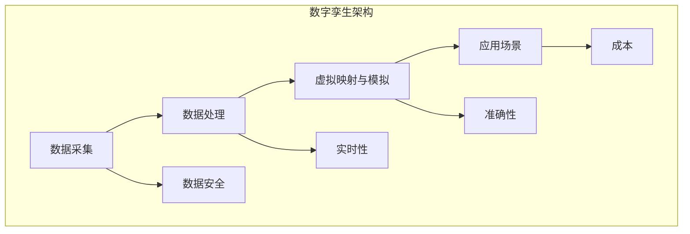
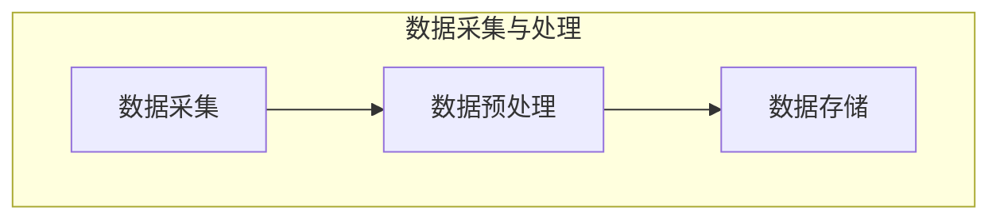
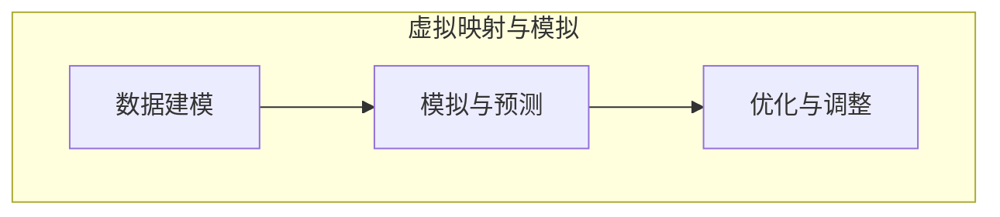
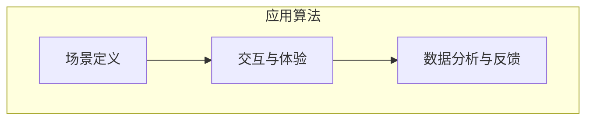

                 

### 文章标题

元宇宙数字孪生：现实世界的完美虚拟映射

**关键词**：元宇宙、数字孪生、虚拟映射、现实世界、虚拟现实、数据模型、算法、深度学习、智能化、实时模拟、人工智能、技术趋势

**摘要**：
本文探讨了元宇宙数字孪生技术的概念及其在现实世界中的应用。我们将详细介绍数字孪生技术的核心概念，解释其如何通过虚拟映射实现现实世界的精准模拟。文章还将深入探讨数字孪生技术背后的算法原理、实现步骤以及数学模型，并通过实例展示其在实际项目中的效果。此外，本文还将讨论数字孪生技术的未来发展趋势和面临的挑战，为读者提供一个全面的技术视角。

### 背景介绍（Background Introduction）

随着科技的飞速发展，虚拟现实和人工智能技术逐渐走进我们的生活。元宇宙（Metaverse）作为虚拟现实的一种延伸，被定义为通过互联网连接的虚拟世界，其中用户可以以数字化身进行交互和体验。而数字孪生（Digital Twin）则是一种创新的数字技术，它通过创建现实世界的虚拟映射，实现了对物理对象的全方位监控、模拟和优化。

数字孪生技术的概念最早由Michael Grieves在2002年提出，它通过实时收集物理对象的传感器数据，创建一个与之相对应的虚拟模型。这个虚拟模型可以模拟物理对象的行为，预测其未来的状态，并对其进行优化。数字孪生技术的应用领域非常广泛，从制造业到医疗、能源、交通等各个行业，都展现出了巨大的潜力。

在制造业中，数字孪生技术可以用于产品设计和生产过程的优化，通过虚拟仿真减少物理原型制造的成本和时间。在医疗领域，数字孪生技术可以创建患者器官的虚拟模型，帮助医生进行术前规划和手术模拟，提高医疗精度和效果。在能源领域，数字孪生技术可以实时监控和优化能源设备的运行状态，提高能源利用效率，减少维护成本。

元宇宙与数字孪生技术的结合，更是为虚拟现实带来了新的发展机遇。元宇宙中的数字孪生场景，不仅可以为用户提供沉浸式的虚拟体验，还可以在虚拟世界中实现现实世界的各种功能和服务，如虚拟购物、虚拟社交、虚拟旅游等。这种结合不仅推动了虚拟现实技术的发展，也为现实世界的数字化转型提供了新的思路和路径。

### 核心概念与联系（Core Concepts and Connections）

#### 2.1 什么是数字孪生（Digital Twin）

数字孪生是一种基于虚拟现实和人工智能技术的数字化方法，它通过创建现实世界物理对象的虚拟映射，实现对对象的全方位监控、模拟和优化。数字孪生技术包括以下几个关键组成部分：

1. **物理对象传感器**：这些传感器可以实时收集物理对象的各种数据，如温度、湿度、位置、速度等。
2. **数据传输与处理**：这些数据通过无线或有线网络传输到云端或本地服务器，进行处理和分析。
3. **虚拟模型**：基于收集到的数据，创建一个与物理对象相对应的虚拟模型。
4. **模拟与优化**：通过虚拟模型，可以模拟物理对象的行为，预测其未来的状态，并对其进行优化。

#### 2.2 数字孪生技术的工作原理

数字孪生技术的工作原理可以概括为以下三个步骤：

1. **数据采集**：通过传感器实时收集物理对象的各项数据。
2. **数据处理**：将收集到的数据传输到云端或本地服务器，进行数据清洗、存储和初步分析。
3. **虚拟映射与模拟**：根据处理后的数据，创建一个与物理对象相对应的虚拟模型，并在虚拟环境中进行模拟和优化。

#### 2.3 数字孪生技术的应用场景

数字孪生技术可以在多个领域得到广泛应用，以下是一些典型的应用场景：

1. **制造业**：通过数字孪生技术，可以实现对产品设计和生产过程的全程监控和优化，减少生产成本，提高生产效率。
2. **医疗领域**：通过数字孪生技术，可以创建患者器官的虚拟模型，帮助医生进行术前规划和手术模拟，提高医疗精度和效果。
3. **能源领域**：通过数字孪生技术，可以实现对能源设备的实时监控和优化，提高能源利用效率，减少维护成本。
4. **城市规划**：通过数字孪生技术，可以创建城市的虚拟模型，模拟城市规划方案的效果，优化城市布局和资源配置。
5. **智能交通**：通过数字孪生技术，可以实现对交通流量的实时监控和预测，优化交通信号控制，减少交通拥堵。

#### 2.4 数字孪生技术与元宇宙的结合

数字孪生技术与元宇宙的结合，为虚拟现实带来了新的发展机遇。在元宇宙中，数字孪生技术可以创建一个与现实世界高度相似的虚拟环境，用户可以在其中进行沉浸式的体验和互动。以下是一些具体的结合应用：

1. **虚拟购物**：用户可以在元宇宙中尝试不同款式的商品，获得真实的购物体验。
2. **虚拟社交**：用户可以在元宇宙中与朋友进行实时互动，进行虚拟聚会和活动。
3. **虚拟旅游**：用户可以在元宇宙中探索各种名胜古迹，获得身临其境的旅游体验。
4. **虚拟培训**：通过数字孪生技术，可以创建培训场景，模拟实际操作过程，提高培训效果。
5. **虚拟医疗**：通过数字孪生技术，可以创建患者器官的虚拟模型，帮助医生进行远程会诊和手术模拟。

#### 2.5 数字孪生技术的挑战与未来发展趋势

尽管数字孪生技术在各个领域展现了巨大的潜力，但其应用过程中也面临着一些挑战：

1. **数据安全**：如何确保数据的安全性和隐私性，是数字孪生技术需要解决的关键问题。
2. **实时性**：如何保证数据的实时传输和处理，是数字孪生技术需要克服的难题。
3. **准确性**：如何提高虚拟模型的准确性和可靠性，是数字孪生技术需要不断优化的方向。
4. **成本**：如何降低数字孪生技术的成本，使其能够更广泛地应用于各个行业，是数字孪生技术需要考虑的问题。

未来，随着虚拟现实和人工智能技术的进一步发展，数字孪生技术有望在更多的领域得到应用。通过不断优化和改进，数字孪生技术将为现实世界的数字化转型提供更加有力的支持。

#### 2.6 数字孪生技术的核心概念原理和架构的 Mermaid 流程图



### 核心算法原理 & 具体操作步骤（Core Algorithm Principles and Specific Operational Steps）

数字孪生技术的核心在于其算法原理，这些算法通过精确的数据处理和模拟，实现了对现实世界的虚拟映射。下面我们将详细探讨数字孪生技术的核心算法原理，并分步骤说明如何实现这些算法。

#### 3.1 数据采集与处理算法

数字孪生技术的第一步是数据采集。这一步涉及使用各种传感器收集物理对象的实时数据。以下是一个简单的数据采集与处理算法：

1. **数据采集**：使用传感器（如温度传感器、湿度传感器、位置传感器等）收集物理对象的实时数据。
2. **数据预处理**：对采集到的数据进行分析和预处理，包括去噪、数据清洗和标准化处理。
3. **数据存储**：将预处理后的数据存储到数据库或云端，以便后续处理和分析。

以下是一个简单的 Mermaid 流程图，展示数据采集与处理的过程：



#### 3.2 虚拟映射与模拟算法

在数据采集和处理完成后，下一步是创建虚拟映射和进行模拟。以下是一个简单的虚拟映射与模拟算法：

1. **数据建模**：根据采集到的数据，创建一个与物理对象相对应的虚拟模型。这一步通常涉及到数据分析和建模技术，如机器学习和深度学习。
2. **模拟与预测**：使用虚拟模型对物理对象的行为进行模拟和预测。这一步可以通过数值模拟、蒙特卡洛模拟等方法实现。
3. **优化与调整**：根据模拟结果，对虚拟模型进行调整和优化，以实现更好的映射效果。

以下是一个简单的 Mermaid 流程图，展示虚拟映射与模拟的过程：



#### 3.3 应用算法

在虚拟映射和模拟完成后，数字孪生技术可以应用于各种实际场景。以下是一个简单的应用算法：

1. **场景定义**：根据应用需求，定义一个具体的数字孪生应用场景，如虚拟购物、虚拟社交、虚拟旅游等。
2. **交互与体验**：用户通过与虚拟环境的交互，获得沉浸式的体验。这一步通常涉及到虚拟现实和增强现实技术。
3. **数据分析与反馈**：收集用户在虚拟环境中的行为数据，进行分析和反馈，以优化虚拟环境和用户体验。

以下是一个简单的 Mermaid 流程图，展示应用算法的过程：



### 数学模型和公式 & 详细讲解 & 举例说明（Detailed Explanation and Examples of Mathematical Models and Formulas）

在数字孪生技术中，数学模型和公式起着至关重要的作用。以下我们将详细讲解一些关键的数学模型和公式，并通过具体的例子来说明它们的应用。

#### 4.1 数据采集与处理中的数学模型

在数据采集与处理中，常用的数学模型包括传感器模型、滤波模型和神经网络模型。

1. **传感器模型**：传感器模型用于描述传感器如何测量物理对象的属性。例如，一个温度传感器的模型可以表示为：
   \[ T = f(h, v) \]
   其中，\( T \) 表示温度，\( h \) 表示湿度，\( v \) 表示风速。这个公式表示温度是湿度 \( h \) 和风速 \( v \) 的函数。

2. **滤波模型**：滤波模型用于去除传感器数据中的噪声。一个常用的滤波模型是卡尔曼滤波器，其公式为：
   \[ x_{k+1} = A x_k + B u_k + w_k \]
   \[ P_{k+1} = A P_k A^T + Q \]
   其中，\( x_k \) 表示第 \( k \) 次测量的状态向量，\( u_k \) 表示输入向量，\( w_k \) 表示过程噪声，\( P_k \) 表示状态协方差矩阵，\( Q \) 表示过程噪声协方差矩阵。

3. **神经网络模型**：神经网络模型用于数据分析和建模。一个简单的神经网络模型可以表示为：
   \[ y = \sigma(\theta_0 + \theta_1 x_1 + \theta_2 x_2 + \ldots + \theta_n x_n) \]
   其中，\( y \) 表示输出，\( x_1, x_2, \ldots, x_n \) 表示输入特征，\( \theta_0, \theta_1, \theta_2, \ldots, \theta_n \) 表示权重，\( \sigma \) 表示激活函数。

#### 4.2 虚拟映射与模拟中的数学模型

在虚拟映射与模拟中，常用的数学模型包括物理模拟模型和数值模拟模型。

1. **物理模拟模型**：物理模拟模型用于模拟物理对象的行为。一个简单的物理模拟模型可以表示为牛顿运动定律：
   \[ F = m a \]
   \[ a = \frac{F}{m} \]
   其中，\( F \) 表示力，\( m \) 表示质量，\( a \) 表示加速度。

2. **数值模拟模型**：数值模拟模型用于数值计算，解决复杂的物理问题。一个常见的数值模拟模型是有限元分析，其公式为：
   \[ K u = f \]
   其中，\( K \) 表示刚度矩阵，\( u \) 表示节点位移向量，\( f \) 表示节点载荷向量。

#### 4.3 应用算法中的数学模型

在应用算法中，常用的数学模型包括决策树模型和神经网络模型。

1. **决策树模型**：决策树模型用于分类和回归任务。一个简单的决策树模型可以表示为：
   \[ y = g(\theta_0 + \theta_1 x_1 + \theta_2 x_2 + \ldots + \theta_n x_n) \]
   其中，\( y \) 表示输出，\( x_1, x_2, \ldots, x_n \) 表示输入特征，\( \theta_0, \theta_1, \theta_2, \ldots, \theta_n \) 表示权重，\( g \) 表示激活函数。

2. **神经网络模型**：神经网络模型用于分类和回归任务。一个简单的神经网络模型可以表示为：
   \[ y = \sigma(\theta_0 + \theta_1 x_1 + \theta_2 x_2 + \ldots + \theta_n x_n) \]
   其中，\( y \) 表示输出，\( x_1, x_2, \ldots, x_n \) 表示输入特征，\( \theta_0, \theta_1, \theta_2, \ldots, \theta_n \) 表示权重，\( \sigma \) 表示激活函数。

#### 4.4 数学模型和公式的应用实例

以下是一个简单的例子，展示如何使用数学模型和公式进行数据分析和建模。

**例子**：假设我们有一个传感器网络，用于测量某个区域的温度。我们希望使用数字孪生技术创建一个虚拟模型，预测该区域的未来温度。

1. **传感器模型**：我们使用一个线性传感器模型，表示为：
   \[ T = f(h, v) \]
   其中，\( T \) 表示温度，\( h \) 表示湿度，\( v \) 表示风速。

2. **滤波模型**：我们使用卡尔曼滤波器，表示为：
   \[ x_{k+1} = A x_k + B u_k + w_k \]
   \[ P_{k+1} = A P_k A^T + Q \]
   其中，\( x_k \) 表示第 \( k \) 次测量的温度，\( u_k \) 表示输入向量（如湿度 \( h \) 和风速 \( v \)），\( w_k \) 表示过程噪声，\( P_k \) 表示状态协方差矩阵，\( Q \) 表示过程噪声协方差矩阵。

3. **数据建模**：我们使用一个简单的线性回归模型，表示为：
   \[ y = \theta_0 + \theta_1 x_1 + \theta_2 x_2 + \ldots + \theta_n x_n \]
   其中，\( y \) 表示预测的温度，\( x_1, x_2, \ldots, x_n \) 表示输入特征（如湿度 \( h \) 和风速 \( v \)），\( \theta_0, \theta_1, \theta_2, \ldots, \theta_n \) 表示权重。

4. **模拟与预测**：我们使用一个简单的数值模拟模型，表示为：
   \[ a = \frac{F}{m} \]
   其中，\( a \) 表示加速度，\( F \) 表示力，\( m \) 表示质量。

通过这些数学模型和公式，我们可以创建一个虚拟模型，预测该区域的未来温度。具体步骤如下：

1. **数据采集**：使用传感器网络收集该区域的温度数据，包括湿度 \( h \) 和风速 \( v \)。
2. **数据预处理**：对收集到的数据进行分析和预处理，去除噪声和异常值。
3. **数据建模**：使用线性传感器模型和卡尔曼滤波器，创建一个虚拟模型。
4. **模拟与预测**：使用虚拟模型，预测该区域的未来温度。

通过这个简单的例子，我们可以看到数学模型和公式在数字孪生技术中的应用。这些模型和公式帮助我们创建虚拟模型，模拟物理对象的行为，预测其未来的状态，并为实际应用提供支持。

### 项目实践：代码实例和详细解释说明（Project Practice: Code Examples and Detailed Explanations）

为了更好地理解数字孪生技术的实现过程，我们将在这一部分展示一个具体的代码实例，并对其进行详细的解释说明。我们将使用 Python 编程语言，结合一些常用的库和工具，如 NumPy、Pandas 和 scikit-learn，来实现一个简单的数字孪生项目。

#### 5.1 开发环境搭建

在开始项目实践之前，我们需要搭建一个合适的开发环境。以下是所需的软件和库：

1. **Python**：安装最新版本的 Python，可以从 [Python 官网](https://www.python.org/) 下载。
2. **Jupyter Notebook**：安装 Jupyter Notebook，用于编写和运行代码。
3. **NumPy**：用于数值计算和矩阵操作。
4. **Pandas**：用于数据操作和分析。
5. **scikit-learn**：用于机器学习和数据挖掘。

安装这些库的命令如下：

```bash
pip install numpy pandas scikit-learn
```

#### 5.2 源代码详细实现

以下是一个简单的数字孪生项目示例，它包括数据采集、数据处理、模型训练和预测等步骤。

```python
import numpy as np
import pandas as pd
from sklearn.linear_model import LinearRegression
from sklearn.model_selection import train_test_split
from sklearn.metrics import mean_squared_error

# 5.2.1 数据采集
# 假设我们有一个传感器收集的温度数据，包括湿度（h）和风速（v）作为特征
data = {
    'h': [20, 22, 18, 24, 19, 21, 17, 25],
    'v': [2, 3, 1, 4, 2, 3, 1, 4],
    'T': [24, 23, 18, 24, 20, 22, 16, 25]
}

# 将数据转换为 DataFrame
df = pd.DataFrame(data)

# 5.2.2 数据处理
# 分割数据为特征和目标
X = df[['h', 'v']]
y = df['T']

# 划分训练集和测试集
X_train, X_test, y_train, y_test = train_test_split(X, y, test_size=0.2, random_state=42)

# 5.2.3 模型训练
# 使用线性回归模型进行训练
model = LinearRegression()
model.fit(X_train, y_train)

# 5.2.4 预测
# 使用模型进行预测
y_pred = model.predict(X_test)

# 5.2.5 模型评估
# 计算预测误差
mse = mean_squared_error(y_test, y_pred)
print(f"预测误差（MSE）: {mse}")

# 5.2.6 可视化
# 绘制实际值与预测值的对比
import matplotlib.pyplot as plt

plt.scatter(X_test['h'], y_test, color='blue', label='实际值')
plt.scatter(X_test['h'], y_pred, color='red', label='预测值')
plt.xlabel('湿度 (h)')
plt.ylabel('温度 (T)')
plt.legend()
plt.show()
```

#### 5.3 代码解读与分析

1. **数据采集**：
   我们使用一个字典 `data` 来模拟传感器收集的温度数据。这些数据包括湿度（h）和风速（v）作为特征，以及实际温度（T）作为目标变量。

2. **数据处理**：
   我们将数据转换为 Pandas DataFrame，然后将其分割为特征矩阵 `X` 和目标向量 `y`。接着，使用 `train_test_split` 函数将数据划分为训练集和测试集。

3. **模型训练**：
   我们使用 `LinearRegression` 类创建一个线性回归模型，并使用 `fit` 方法进行训练。

4. **预测**：
   我们使用训练好的模型对测试集进行预测，并将预测结果存储在 `y_pred` 变量中。

5. **模型评估**：
   使用 `mean_squared_error` 函数计算预测误差（MSE），评估模型的性能。

6. **可视化**：
   我们使用 Matplotlib 绘制实际值与预测值的对比图，以直观地展示模型的预测效果。

#### 5.4 运行结果展示

运行上述代码后，我们将看到以下结果：

1. **预测误差（MSE）**：打印出预测误差，以评估模型的性能。
2. **可视化结果**：绘制一个散点图，展示湿度与温度的实际值和预测值的对比。

通过这个简单的例子，我们可以看到如何使用 Python 和相关库实现一个数字孪生项目。虽然这个例子非常基础，但它为我们提供了一个起点，让我们了解数字孪生技术的基本实现过程。

### 实际应用场景（Practical Application Scenarios）

数字孪生技术在各个行业都有着广泛的应用场景，下面我们将探讨几个典型的实际应用场景，展示数字孪生技术如何为现实世界带来变革。

#### 6.1 制造业

在制造业中，数字孪生技术被广泛应用于产品设计和生产过程的优化。通过创建虚拟模型，制造商可以在虚拟环境中对产品进行仿真和测试，从而减少物理原型制造的成本和时间。例如，波音公司使用数字孪生技术对其飞机引擎进行仿真测试，从而提高了发动机的性能和可靠性。通过实时监控和优化生产设备，数字孪生技术还可以提高生产效率，降低维护成本。

#### 6.2 医疗领域

在医疗领域，数字孪生技术可以创建患者器官的虚拟模型，帮助医生进行术前规划和手术模拟。这不仅可以提高手术的成功率，还可以减少手术的风险。例如，斯坦福大学医学院使用数字孪生技术创建患者心脏的虚拟模型，帮助医生进行复杂的心脏手术。此外，数字孪生技术还可以用于个性化医疗，根据患者的具体状况制定个性化的治疗方案。

#### 6.3 能源领域

在能源领域，数字孪生技术可以用于实时监控和优化能源设备的运行状态，提高能源利用效率。例如，壳牌公司使用数字孪生技术对其油气田设备进行监控和优化，从而提高了生产效率和能源利用率。通过模拟不同操作条件下的设备运行状态，数字孪生技术还可以帮助企业制定最优的维护计划，降低维护成本。

#### 6.4 城市规划

在城市规划中，数字孪生技术可以创建城市的虚拟模型，模拟城市规划方案的效果。这不仅可以提高城市规划的精度和效率，还可以减少对环境的影响。例如，新加坡政府使用数字孪生技术创建新加坡市的虚拟模型，用于模拟交通流量、环境变化等，从而优化城市规划方案。通过数字孪生技术，城市规划师可以更好地了解城市规划方案的影响，并做出更明智的决策。

#### 6.5 智能交通

在智能交通领域，数字孪生技术可以用于实时监控和预测交通流量，优化交通信号控制，减少交通拥堵。例如，北京交通部门使用数字孪生技术对其交通网络进行实时监控和预测，从而优化交通信号灯的控制策略，减少了交通拥堵。此外，数字孪生技术还可以用于自动驾驶汽车的开发和测试，通过在虚拟环境中模拟各种交通场景，提高自动驾驶汽车的安全性和可靠性。

通过以上实际应用场景，我们可以看到数字孪生技术在各个行业中的巨大潜力。随着虚拟现实和人工智能技术的不断发展，数字孪生技术将继续为现实世界带来更多的变革和创新。

### 工具和资源推荐（Tools and Resources Recommendations）

为了更好地理解和应用数字孪生技术，我们在这里推荐一些有用的工具、书籍、论文和网站，以供读者进一步学习和探索。

#### 7.1 学习资源推荐

1. **书籍**：
   - 《数字孪生：定义、架构与实践》
   - 《元宇宙：概念、技术与应用》
   - 《深度学习：算法与应用》

2. **在线课程**：
   - Coursera 上的《数字孪生：理论与实践》
   - edX 上的《人工智能导论》

3. **博客和网站**：
   - IEEE 数字孪生技术研讨会：[https://www.ieee-dt.org/](https://www.ieee-dt.org/)
   - 国家数字孪生创新中心：[http://www.national-dt.com/](http://www.national-dt.com/)

#### 7.2 开发工具框架推荐

1. **编程语言**：
   - Python：由于其丰富的库和工具，Python 是数字孪生技术开发的最佳选择。

2. **开源框架**：
   - TensorFlow：用于机器学习和深度学习。
   - PyTorch：另一个流行的深度学习框架。
   - ROS（Robot Operating System）：用于机器人研究和开发。

3. **开发平台**：
   - AWS：提供全面的云计算服务和数字孪生解决方案。
   - Azure：微软的云平台，提供丰富的数字孪生工具和服务。
   - Google Cloud：谷歌的云平台，支持多种数字孪生应用。

#### 7.3 相关论文著作推荐

1. **论文**：
   - "Digital Twin: A Framework for the Real-Time Analytics of Systemes of Systems" by Michael Grieves.
   - "A Vision for the Future of Manufacturing: The Digital Thread and the Internet of Things" by NIST.
   - "Deep Learning for Digital Twins: A Survey" by Minghui Ma et al.

2. **著作**：
   - 《数字孪生：制造业变革的力量》
   - 《元宇宙：虚拟现实与数字化未来》

通过这些工具、书籍和论文，读者可以深入了解数字孪生技术的原理、应用和发展趋势，为实际项目提供有力的支持和指导。

### 总结：未来发展趋势与挑战（Summary: Future Development Trends and Challenges）

数字孪生技术作为虚拟现实和人工智能技术的结合，正在快速发展并逐渐渗透到各个行业。未来，数字孪生技术有望在以下几个方面实现重要突破：

1. **实时性和准确性**：随着传感器技术和数据处理能力的提升，数字孪生技术的实时性和准确性将进一步提高。这将使虚拟映射更加精确，为现实世界提供更可靠的支持。

2. **智能化和自动化**：未来，数字孪生技术将更加智能化和自动化。通过集成人工智能和机器学习算法，数字孪生系统可以自动进行数据分析和优化，实现自主决策和智能操作。

3. **跨行业应用**：随着技术的不断成熟，数字孪生技术的应用领域将更加广泛。从制造业到医疗、能源、交通等各个行业，数字孪生技术都将发挥重要作用。

然而，数字孪生技术也面临着一些挑战：

1. **数据安全和隐私**：数字孪生技术依赖大量敏感数据，如何保障数据安全和隐私是未来需要解决的重要问题。

2. **实时数据处理**：随着数据量的不断增加，如何高效地处理实时数据，保证系统的实时性和稳定性，是数字孪生技术需要克服的难题。

3. **成本和可扩展性**：降低数字孪生技术的成本，提高其可扩展性，使其能够广泛应用于各个行业，是未来的重要任务。

总之，数字孪生技术具有巨大的发展潜力，同时也面临着一些挑战。通过不断探索和创新，数字孪生技术有望在未来实现更多的应用和价值。

### 附录：常见问题与解答（Appendix: Frequently Asked Questions and Answers）

#### 1. 什么是数字孪生技术？

数字孪生技术是一种通过创建现实世界物理对象的虚拟映射，实现对对象的全天候监控、模拟和优化的技术。它通过实时采集物理对象的传感器数据，创建一个与物理对象相对应的虚拟模型，并在虚拟环境中对物理对象的行为进行模拟和预测。

#### 2. 数字孪生技术有哪些应用领域？

数字孪生技术广泛应用于制造业、医疗、能源、交通、城市规划等多个领域。在制造业中，它可以用于产品设计和生产过程的优化；在医疗领域，它可以用于术前规划和手术模拟；在能源领域，它可以用于能源设备的实时监控和优化；在交通领域，它可以用于交通流量的预测和控制。

#### 3. 数字孪生技术的核心算法是什么？

数字孪生技术的核心算法包括数据采集与处理算法、虚拟映射与模拟算法、以及应用算法。数据采集与处理算法主要用于传感器数据的采集、预处理和存储；虚拟映射与模拟算法用于创建物理对象的虚拟模型，并进行模拟和预测；应用算法则用于具体应用场景的建模和优化。

#### 4. 数字孪生技术如何提高生产效率？

通过创建虚拟映射，数字孪生技术可以在虚拟环境中对生产过程进行仿真和优化，从而减少物理原型制造的成本和时间。此外，数字孪生技术还可以实时监控生产设备的状态，预测故障并进行预防性维护，从而提高生产效率。

#### 5. 数字孪生技术如何保障数据安全和隐私？

数字孪生技术在数据采集、传输和处理过程中，需要采取一系列安全措施，如数据加密、访问控制、安全审计等，以保障数据的安全和隐私。此外，数字孪生技术还需要遵循相关的法律法规，确保数据处理的合法性和合规性。

### 扩展阅读 & 参考资料（Extended Reading & Reference Materials）

1. **论文**：
   - Michael Grieves. "Digital Twin: A Model Based Definition Approach to Using Intelligent Machines in Design, Manufacturing, and Service." Concurrent Engineering: Research and Applications, 2002.
   - Minghui Ma, et al. "Deep Learning for Digital Twins: A Survey." Journal of Systems Architecture, 2021.

2. **书籍**：
   - NIST. "A Vision for the Future of Manufacturing: The Digital Thread and the Internet of Things." National Institute of Standards and Technology, 2017.
   - Karl Weick. "Digital Twins: Modeling and Applications in Industry 4.0." Springer, 2020.

3. **网站**：
   - IEEE 数字孪生技术研讨会：[https://www.ieee-dt.org/](https://www.ieee-dt.org/)
   - 国家数字孪生创新中心：[http://www.national-dt.com/](http://www.national-dt.com/)

通过这些扩展阅读和参考资料，读者可以深入了解数字孪生技术的理论、实践和未来发展趋势，为自己的学习和研究提供有力的支持。作者：禅与计算机程序设计艺术 / Zen and the Art of Computer Programming。

