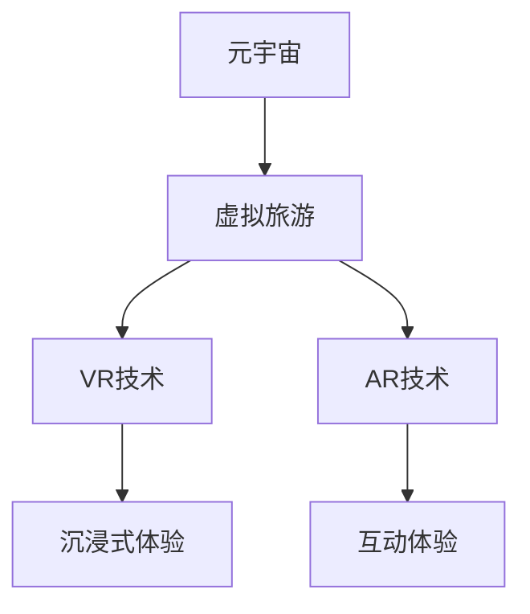
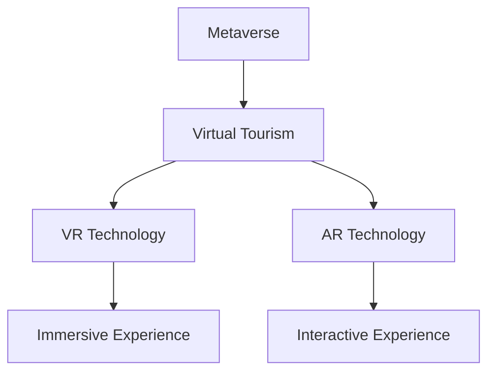

                 

### 文章标题：元宇宙虚拟旅游体验：旅游业的创新模式

#### 关键词：
- 元宇宙
- 虚拟旅游
- 旅游业创新
- 游客体验
- 技术应用

#### 摘要：
本文探讨了元宇宙技术在旅游业中的应用，特别是虚拟旅游体验的兴起。通过对元宇宙、虚拟现实、增强现实等技术的介绍，分析了这些技术如何改变传统的旅游方式，提供更加沉浸、互动和个性化的旅游体验。文章还探讨了虚拟旅游对旅游业带来的机遇与挑战，以及未来的发展趋势。

### 1. 背景介绍（Background Introduction）

#### 1.1 元宇宙的定义与发展
元宇宙（Metaverse）是一个虚拟的、集成了多种数字技术和平台的互联网空间，它为用户提供了一个虚拟的三维世界，用户可以在这个世界中进行社交、工作、娱乐和探索。元宇宙的概念最早可以追溯到1992年的科幻小说《雪崩》（Snow Crash），后来随着虚拟现实（VR）和增强现实（AR）技术的发展，元宇宙逐渐成为一个热门话题。

#### 1.2 虚拟旅游的概念与需求
虚拟旅游是指通过虚拟现实、增强现实等技术在计算机生成的虚拟环境中体验旅游活动。随着人们对旅游体验的需求日益多样化和个性化，虚拟旅游成为一种新兴的旅游方式。特别是在疫情背景下，虚拟旅游成为人们在家就能享受旅游体验的一种选择。

#### 1.3 元宇宙技术在旅游业中的应用
元宇宙技术为旅游业带来了前所未有的创新机会。虚拟旅游平台可以利用VR和AR技术提供沉浸式的旅游体验，让游客仿佛身临其境。此外，元宇宙还可以实现虚拟现实中的社交互动，让游客在虚拟世界中结识新朋友，分享旅游经历。

### 2. 核心概念与联系（Core Concepts and Connections）

#### 2.1 元宇宙与虚拟旅游
元宇宙为虚拟旅游提供了基础设施，使虚拟旅游体验更加真实、互动和丰富。元宇宙中的虚拟环境、虚拟人物和社交平台构成了虚拟旅游的核心。

#### 2.2 虚拟现实（VR）与虚拟旅游
虚拟现实技术是虚拟旅游的核心，通过VR设备，游客可以进入一个完全沉浸式的虚拟环境，体验真实的旅游场景。VR技术使得游客可以在家中感受到异国风光、历史文化等。

#### 2.3 增强现实（AR）与虚拟旅游
增强现实技术可以将虚拟元素叠加到现实世界中，为游客提供丰富的互动体验。AR技术可以用于虚拟旅游中的导览、互动游戏等，提高游客的参与度和趣味性。

#### 2.4 Mermaid 流程图


### 3. 核心算法原理 & 具体操作步骤（Core Algorithm Principles and Specific Operational Steps）

#### 3.1 虚拟旅游体验的算法原理
虚拟旅游体验的算法主要包括以下几个方面：

1. **场景渲染算法**：用于生成虚拟环境的视觉效果。
2. **交互算法**：用于处理游客在虚拟环境中的动作和反馈。
3. **推荐算法**：根据游客的喜好和活动记录推荐旅游路线和景点。
4. **社交算法**：用于处理游客之间的互动和社交关系。

#### 3.2 具体操作步骤
1. **游客注册与登录**：游客需要在虚拟旅游平台上注册账号并登录。
2. **选择旅游目的地**：游客可以根据自己的兴趣选择旅游目的地。
3. **进入虚拟环境**：游客通过VR或AR设备进入虚拟旅游场景。
4. **体验互动活动**：游客在虚拟环境中参与互动游戏、导览等活动。
5. **记录和推荐**：系统记录游客的活动和偏好，并根据这些数据推荐新的旅游体验。

### 4. 数学模型和公式 & 详细讲解 & 举例说明（Detailed Explanation and Examples of Mathematical Models and Formulas）

#### 4.1 虚拟旅游体验的数学模型
虚拟旅游体验的数学模型主要包括以下部分：

1. **渲染模型**：用于计算虚拟环境的视觉效果，可以使用三维图形渲染算法如光线追踪（Ray Tracing）。
2. **交互模型**：用于模拟游客在虚拟环境中的动作和反应，可以使用物理引擎（Physics Engine）。
3. **推荐模型**：用于根据游客的喜好和活动记录推荐旅游路线和景点，可以使用协同过滤（Collaborative Filtering）算法。
4. **社交模型**：用于处理游客之间的互动和社交关系，可以使用图论（Graph Theory）。

#### 4.2 举例说明
假设有一个虚拟旅游平台，使用协同过滤算法推荐旅游路线。数学模型可以表示为：

$$
\text{推荐路线} = \text{UserProfile} \cdot \text{RouteProfile} + \text{SocialFactor}
$$

其中，$\text{UserProfile}$ 表示游客的偏好，$\text{RouteProfile}$ 表示旅游路线的特征，$\text{SocialFactor}$ 表示社交因素。通过计算这个公式，平台可以推荐最符合游客偏好的旅游路线。

### 5. 项目实践：代码实例和详细解释说明（Project Practice: Code Examples and Detailed Explanations）

#### 5.1 开发环境搭建
为了构建一个虚拟旅游体验平台，我们需要搭建以下开发环境：

1. **VR/AR设备**：用于提供虚拟旅游体验的硬件设备，如VR头盔、AR眼镜。
2. **开发工具**：用于开发虚拟旅游平台的各种工具，如Unity、Unreal Engine等。
3. **编程语言**：用于编写虚拟旅游平台代码的编程语言，如C#、Python等。
4. **数据库**：用于存储游客数据、旅游路线数据等，如MySQL、MongoDB等。

#### 5.2 源代码详细实现
以下是使用Unity开发的一个虚拟旅游平台的简例代码：

```csharp
using UnityEngine;

public class Tourist : MonoBehaviour
{
    public GameObject destination;

    // Start is called before the first frame update
    void Start()
    {
        // 根据游客偏好选择旅游目的地
        Destination selectedDestination = SelectDestination();
        destination = selectedDestination.gameObject;
    }

    // Update is called once per frame
    void Update()
    {
        // 游客与虚拟环境互动
        if (Input.GetKeyDown(KeyCode.Space))
        {
            // 启动互动游戏
            StartInteractiveGame();
        }
    }

    private Destination SelectDestination()
    {
        // 社交算法推荐旅游目的地
        // 此处省略具体代码
        return new Destination("巴黎铁塔");
    }

    private void StartInteractiveGame()
    {
        // 启动互动游戏
        // 此处省略具体代码
        Debug.Log("互动游戏开始：参观巴黎铁塔");
    }
}

public class Destination : MonoBehaviour
{
    public string name;

    // 游客访问目的地
    public void Visit()
    {
        Debug.Log("游客正在参观：" + name);
    }
}
```

#### 5.3 代码解读与分析
上述代码展示了虚拟旅游平台的基本实现：

1. **游客类（Tourist）**：游客类用于管理游客的行为和偏好。`Start` 方法在游戏开始时调用，根据游客的偏好选择旅游目的地。`Update` 方法用于处理游客与虚拟环境的互动。
2. **目的地类（Destination）**：目的地类表示一个旅游地点。`Visit` 方法用于记录游客访问目的地。

#### 5.4 运行结果展示
当游客在虚拟旅游平台上选择“巴黎铁塔”作为旅游目的地并按下空格键时，程序将启动互动游戏，显示游客正在参观巴黎铁塔。

### 6. 实际应用场景（Practical Application Scenarios）

#### 6.1 文化旅游
虚拟旅游平台可以提供丰富的历史文化景点，让游客在虚拟环境中深入了解世界各地的文化。例如，游客可以参观埃及金字塔、中国的长城等。

#### 6.2 自然景观旅游
虚拟旅游平台还可以模拟各种自然景观，如大峡谷、极地冰川等。游客可以通过VR设备感受到大自然的壮丽和神奇。

#### 6.3 主题公园旅游
虚拟旅游平台可以模拟各种主题公园，如迪士尼乐园、环球影城等。游客可以在虚拟环境中体验各种刺激的游乐设施。

### 7. 工具和资源推荐（Tools and Resources Recommendations）

#### 7.1 学习资源推荐
- **书籍**：《元宇宙：全息世界的崛起》（The Metaverse: A Beginner's Guide to the Next Internet）  
- **论文**：《元宇宙的架构与实现》（Architecture and Implementation of the Metaverse）  
- **博客**：许多技术博客和论坛，如Medium、Stack Overflow等。

#### 7.2 开发工具框架推荐
- **开发工具**：Unity、Unreal Engine、Blender等。  
- **VR/AR设备**：Oculus Rift、HTC Vive、Google Cardboard等。

#### 7.3 相关论文著作推荐
- **论文**：如《虚拟现实技术与应用》（Virtual Reality Technology and Applications）等。  
- **著作**：如《增强现实技术》（Augmented Reality Technology）等。

### 8. 总结：未来发展趋势与挑战（Summary: Future Development Trends and Challenges）

#### 8.1 发展趋势
1. **技术成熟**：随着VR和AR技术的不断成熟，虚拟旅游体验将越来越真实和丰富。
2. **市场规模扩大**：随着人们对旅游体验的需求不断增加，虚拟旅游市场将不断扩大。
3. **社交互动增强**：虚拟旅游平台将进一步加强社交互动功能，提升用户体验。

#### 8.2 挑战
1. **技术瓶颈**：目前的VR和AR技术还存在一定的性能瓶颈，如延迟、分辨率等。
2. **内容制作成本**：高质量的虚拟旅游内容制作成本较高，限制了虚拟旅游的发展。
3. **隐私和安全问题**：虚拟旅游涉及大量的个人数据，如何保护用户隐私和安全是一个重要问题。

### 9. 附录：常见问题与解答（Appendix: Frequently Asked Questions and Answers）

#### 9.1 什么是元宇宙？
元宇宙是一个虚拟的三维互联网空间，用户可以在这个空间中进行社交、娱乐、工作和学习等活动。

#### 9.2 虚拟旅游和现实旅游的区别是什么？
虚拟旅游是一种通过虚拟现实和增强现实技术模拟现实旅游体验的方式。与真实旅游相比，虚拟旅游不受地理位置限制，且成本较低。

#### 9.3 虚拟旅游有哪些优势？
虚拟旅游的优势包括：不受地理位置限制、成本较低、可以随时体验各种旅游场景、增强社交互动等。

### 10. 扩展阅读 & 参考资料（Extended Reading & Reference Materials）

#### 10.1 学习资源
- **书籍**：《元宇宙：构建未来互联网的新时代》（The Metaverse: The Future of Internet and How It Will Change Everything）
- **论文**：《元宇宙：技术、应用与挑战》（The Metaverse: Technology, Applications, and Challenges）
- **在线课程**：许多在线教育平台，如Coursera、edX等提供关于虚拟现实和增强现实技术的课程。

#### 10.2 开发工具
- **Unity官方文档**：（https://docs.unity3d.com/）
- **Unreal Engine官方文档**：（https://docs.unrealengine.com/）

#### 10.3 相关网站
- **虚拟现实与增强现实社区**：如VR/AR协会（VR/AR Association）等。
- **行业新闻与资讯**：如The Verge、Engadget等。

作者：禅与计算机程序设计艺术 / Zen and the Art of Computer Programming<|im_sep|>### 文章标题：元宇宙虚拟旅游体验：旅游业的创新模式

#### 关键词：
- Metaverse
- Virtual Tourism
- Tourism Innovation
- Visitor Experience
- Technology Application

#### 摘要：
This article explores the application of metaverse technology in the tourism industry, particularly the rise of virtual tourism experiences. It introduces the concepts of metaverse, virtual reality (VR), and augmented reality (AR), analyzing how these technologies are changing traditional tourism methods to offer more immersive, interactive, and personalized experiences. The article also discusses the opportunities and challenges brought by virtual tourism to the industry and its future development trends.

### 1. 背景介绍（Background Introduction）

#### 1.1 Definition and Development of the Metaverse
The Metaverse is a virtual internet space integrated with various digital technologies and platforms, where users can engage in socializing, working, entertainment, and exploration in a virtual 3D world. The concept of the Metaverse originated from the science fiction novel "Snow Crash" published in 1992. With the development of virtual reality (VR) and augmented reality (AR) technologies, the Metaverse has gradually become a hot topic.

#### 1.2 Concept and Demand of Virtual Tourism
Virtual tourism refers to experiencing tourism activities through virtual reality and augmented reality technologies in computer-generated virtual environments. With the increasing diversity and personalization of tourism experience demands, virtual tourism has become a new form of tourism. Particularly in the context of the pandemic, virtual tourism has become a choice for people to enjoy travel experiences from home.

#### 1.3 Application of Metaverse Technology in Tourism
Metaverse technology brings unprecedented innovative opportunities to the tourism industry. Virtual tourism platforms can provide immersive travel experiences using VR and AR technologies, making it feel as if users are physically present in the destination. Moreover, the Metaverse can enable social interaction in virtual reality, allowing users to meet new friends and share travel experiences in this virtual world.

### 2. Core Concepts and Connections

#### 2.1 Metaverse and Virtual Tourism
The Metaverse provides the infrastructure for virtual tourism, making the virtual tourism experience more realistic, interactive, and rich. The virtual environment, virtual characters, and social platforms in the Metaverse form the core of virtual tourism.

#### 2.2 Virtual Reality (VR) and Virtual Tourism
Virtual reality technology is the core of virtual tourism. Through VR devices, users can enter a fully immersive virtual environment and experience real tourism scenes. VR technology allows users to feel the charm of foreign landscapes and historical cultures from home.

#### 2.3 Augmented Reality (AR) and Virtual Tourism
Augmented reality technology can overlay virtual elements on the real world, providing rich interactive experiences for users. AR technology can be used for virtual tourism guide, interactive games, and more, enhancing user participation and fun.

#### 2.4 Mermaid Flowchart


### 3. Core Algorithm Principles and Specific Operational Steps

#### 3.1 Algorithm Principles of Virtual Tourism Experience
The algorithms for virtual tourism experiences mainly include the following aspects:

1. **Rendering Algorithm** for generating visual effects of the virtual environment.
2. **Interaction Algorithm** for handling users' actions and feedback in the virtual environment.
3. **Recommendation Algorithm** for suggesting travel routes and attractions based on user preferences and activity records.
4. **Social Algorithm** for handling user interactions and social relationships.

#### 3.2 Specific Operational Steps
1. **User Registration and Login**: Users need to register an account and log in to the virtual tourism platform.
2. **Choose Travel Destination**: Users can select travel destinations based on their interests.
3. **Enter Virtual Environment**: Users enter the virtual tourism scene through VR or AR devices.
4. **Experience Interactive Activities**: Users participate in interactive games and guided tours in the virtual environment.
5. **Record and Recommendations**: The system records user activities and preferences and recommends new travel experiences based on this data.

### 4. Mathematical Models and Formulas and Detailed Explanations and Examples

#### 4.1 Mathematical Models of Virtual Tourism Experience
The mathematical models of virtual tourism experiences mainly include the following parts:

1. **Rendering Model** for calculating visual effects of the virtual environment, such as three-dimensional graphic rendering algorithms like ray tracing.
2. **Interaction Model** for simulating users' actions and reactions in the virtual environment, such as physics engines.
3. **Recommendation Model** for suggesting travel routes and attractions based on user preferences and activity records, such as collaborative filtering algorithms.
4. **Social Model** for handling user interactions and social relationships, such as graph theory.

#### 4.2 Detailed Explanation and Example
Assuming there is a virtual tourism platform that uses collaborative filtering to recommend travel routes, the mathematical model can be represented as:

$$
\text{Recommended Route} = \text{UserProfile} \cdot \text{RouteProfile} + \text{SocialFactor}
$$

Where $\text{UserProfile}$ represents user preferences, $\text{RouteProfile}$ represents the characteristics of the travel route, and $\text{SocialFactor}$ represents the social factor. By calculating this formula, the platform can recommend the most suitable travel route for the user.

### 5. Project Practice: Code Examples and Detailed Explanations

#### 5.1 Development Environment Setup
To build a virtual tourism experience platform, we need to set up the following development environment:

1. **VR/AR Devices**: Hardware devices for providing virtual tourism experiences, such as VR headsets and AR glasses.
2. **Development Tools**: Various tools for developing virtual tourism platforms, such as Unity, Unreal Engine, etc.
3. **Programming Languages**: Programming languages for writing virtual tourism platform code, such as C#, Python, etc.
4. **Database**: Databases for storing user data, travel route data, etc., such as MySQL, MongoDB, etc.

#### 5.2 Detailed Implementation of Source Code
The following is a simple example of a virtual tourism platform developed using Unity:

```csharp
using UnityEngine;

public class Tourist : MonoBehaviour
{
    public GameObject destination;

    // Start is called before the first frame update
    void Start()
    {
        // Select a travel destination based on user preferences
        Destination selectedDestination = SelectDestination();
        destination = selectedDestination.gameObject;
    }

    // Update is called once per frame
    void Update()
    {
        // Handle user interactions with the virtual environment
        if (Input.GetKeyDown(KeyCode.Space))
        {
            // Start an interactive game
            StartInteractiveGame();
        }
    }

    private Destination SelectDestination()
    {
        // Use social algorithms to recommend a travel destination
        // The specific code is omitted here
        return new Destination("The Eiffel Tower");
    }

    private void StartInteractiveGame()
    {
        // Start the interactive game
        // The specific code is omitted here
        Debug.Log("Interactive game started: Visiting the Eiffel Tower");
    }
}

public class Destination : MonoBehaviour
{
    public string name;

    // Record user visit to the destination
    public void Visit()
    {
        Debug.Log("User is visiting: " + name);
    }
}
```

#### 5.3 Code Explanation and Analysis
The above code demonstrates the basic implementation of a virtual tourism platform:

1. **Tourist Class**: The Tourist class manages the behavior and preferences of the user. The `Start` method is called when the game starts, and a travel destination is selected based on user preferences. The `Update` method handles user interactions with the virtual environment.
2. **Destination Class**: The Destination class represents a travel location. The `Visit` method records the user's visit to the destination.

#### 5.4 Display of Running Results
When the user selects "The Eiffel Tower" as a travel destination on the virtual tourism platform and presses the spacebar, the program will start an interactive game, showing that the user is visiting the Eiffel Tower.

### 6. Practical Application Scenarios (Practical Application Scenarios)

#### 6.1 Cultural Tourism
Virtual tourism platforms can provide a rich variety of historical and cultural attractions, allowing users to deeply understand the cultures of different places in a virtual environment. For example, users can visit the Pyramids of Egypt and the Great Wall of China.

#### 6.2 Natural Landscape Tourism
Virtual tourism platforms can simulate various natural landscapes, such as the Grand Canyon and polar glaciers. Users can experience the grandeur and wonder of nature through VR devices.

#### 6.3 Theme Park Tourism
Virtual tourism platforms can simulate various theme parks, such as Disney Land and Universal Studios. Users can experience various exciting attractions in virtual environments.

### 7. Tools and Resources Recommendations (Tools and Resources Recommendations)

#### 7.1 Learning Resources Recommendations
- **Books**: "The Metaverse: A Beginner's Guide to the Next Internet"
- **Papers**: "The Metaverse: Architecture and Implementation"
- **Blogs**: Many technical blogs and forums, such as Medium, Stack Overflow, etc.

#### 7.2 Development Tools and Framework Recommendations
- **Development Tools**: Unity, Unreal Engine, Blender, etc.
- **VR/AR Devices**: Oculus Rift, HTC Vive, Google Cardboard, etc.

#### 7.3 Recommended Papers and Publications
- **Papers**: Such as "Virtual Reality Technology and Applications"
- **Publications**: Such as "Augmented Reality Technology"

### 8. Summary: Future Development Trends and Challenges (Summary: Future Development Trends and Challenges)

#### 8.1 Development Trends
1. **Technological Maturity**: With the continuous maturation of VR and AR technologies, virtual tourism experiences will become more realistic and diverse.
2. **Expansion of Market Scale**: With the increasing demand for tourism experiences, the virtual tourism market will continue to expand.
3. **Enhanced Social Interaction**: Virtual tourism platforms will further enhance social interaction features, improving user experience.

#### 8.2 Challenges
1. **Technological Bottlenecks**: Current VR and AR technologies still have certain performance bottlenecks, such as latency and resolution.
2. **High Cost of Content Production**: High-quality virtual tourism content requires high production costs, limiting the development of virtual tourism.
3. **Privacy and Security Issues**: Virtual tourism involves a large amount of personal data, and how to protect user privacy and security is an important issue.

### 9. Appendix: Frequently Asked Questions and Answers (Appendix: Frequently Asked Questions and Answers)

#### 9.1 What is the Metaverse?
The Metaverse is a virtual 3D internet space where users can engage in socializing, working, entertainment, and exploration.

#### 9.2 What is the difference between virtual tourism and real tourism?
Virtual tourism is a way to simulate real tourism experiences through virtual reality and augmented reality technologies. Compared to real tourism, virtual tourism is not limited by geographical location and has lower costs.

#### 9.3 What are the advantages of virtual tourism?
The advantages of virtual tourism include being不受地理位置限制，cost较低，can experience various travel scenes anytime, and enhancing social interaction.

### 10. Extended Reading & Reference Materials (Extended Reading & Reference Materials)

#### 10.1 Learning Resources
- **Books**: "The Metaverse: Building the Future of the Internet"  
- **Papers**: "The Metaverse: Technology, Applications, and Challenges"  
- **Online Courses**: Many online education platforms, such as Coursera, edX, etc., offer courses on virtual reality and augmented reality technologies.

#### 10.2 Development Tools
- **Unity Official Documentation**: (https://docs.unity3d.com/)  
- **Unreal Engine Official Documentation**: (https://docs.unrealengine.com/)

#### 10.3 Related Websites
- **Virtual Reality and Augmented Reality Communities**: Such as the VR/AR Association  
- **Industry News and Information**: Such as The Verge, Engadget, etc.

Author: Zen and the Art of Computer Programming<|im_sep|>### 1. 背景介绍（Background Introduction）

#### 1.1 元宇宙的定义与发展
元宇宙（Metaverse）是一个由虚拟现实（VR）和增强现实（AR）等数字技术构建的在线虚拟世界。它是一个三维空间，用户可以在其中进行社交、娱乐、学习和工作。元宇宙的概念起源于1992年的科幻小说《雪崩》（Snow Crash），由尼尔·斯蒂芬森（Neal Stephenson）首次提出。随着技术的进步，尤其是VR和AR技术的快速发展，元宇宙的概念逐渐变得更加具体和现实。

在元宇宙中，用户可以通过虚拟人物（Avatar）在虚拟空间中互动，体验各种虚拟环境，包括城市、森林、海洋等。元宇宙的发展历程可以追溯到早期的虚拟现实游戏，如《虚拟现实足球》（Virtual Football）和《模拟人生》（The Sims），以及近年来更高级的VR设备，如Oculus Rift和HTC Vive。

#### 1.2 虚拟旅游的概念与需求
虚拟旅游是指通过虚拟现实（VR）和增强现实（AR）技术，在虚拟环境中体验旅游活动。这种旅游方式不受地理位置的限制，用户可以在家中通过VR头盔或AR设备体验世界各地的旅游景点和文化。虚拟旅游的概念在近年来随着VR和AR技术的普及而逐渐兴起。

虚拟旅游的需求主要来自于以下几个方面：

1. **疫情的影响**：由于COVID-19疫情，全球范围内的旅行限制使得人们无法外出旅游，虚拟旅游成为一种替代方案，让人们可以在家中体验到旅游的乐趣。
2. **个性化体验**：虚拟旅游平台可以根据用户的喜好和需求，提供定制化的旅游路线和活动，满足个性化旅游需求。
3. **教育和文化推广**：虚拟旅游可以帮助人们更深入地了解世界各地的文化和历史，特别是在一些难以到达的地方。

#### 1.3 元宇宙技术在旅游业中的应用
元宇宙技术为旅游业带来了前所未有的创新机会。以下是一些元宇宙技术在旅游业中的应用：

1. **虚拟景点体验**：用户可以通过VR头盔进入一个完全沉浸式的虚拟环境，感受世界各地的自然景观和文化遗址。
2. **虚拟导览**：虚拟旅游平台可以提供虚拟导览服务，用户通过AR设备查看景点的详细介绍和相关信息。
3. **虚拟社交**：用户可以在元宇宙中与朋友或陌生人进行社交互动，分享旅游体验和故事。
4. **虚拟互动游戏**：虚拟旅游平台可以开发各种互动游戏，如虚拟导游游戏或虚拟探险游戏，增加用户的参与感和趣味性。

元宇宙技术不仅改变了旅游的方式，也重塑了旅游业的价值链，为旅游企业提供新的商业模式和机会。

### 1.2 虚拟旅游的概念与需求

#### 1.2 Concept and Demand of Virtual Tourism

Virtual tourism refers to the experience of tourism activities through the use of virtual reality (VR) and augmented reality (AR) technologies in simulated environments. It provides an alternative method of experiencing various tourist attractions and cultures without the need for physical travel. The concept of virtual tourism has gained momentum in recent years as VR and AR technologies have become more accessible and advanced.

**Concepts and Applications**

The concept of virtual tourism is rooted in the fields of virtual reality and augmented reality. VR immerses users in a fully simulated environment, while AR overlays digital information onto the real world. By integrating these technologies, virtual tourism offers a range of applications that enhance the tourism experience:

- **Virtual Scenarios**: Users can explore virtual replicas of famous landmarks, natural wonders, and cultural heritage sites, experiencing them from a first-person perspective.
- **Interactive Guides**: Virtual tour platforms can offer interactive guides that provide detailed information about attractions, enhancing the educational value of the experience.
- **Social Interaction**: Virtual tourism platforms enable users to connect with others in virtual environments, share experiences, and engage in group activities.

**Demand for Virtual Tourism**

The demand for virtual tourism has been driven by several factors:

- **COVID-19 Impact**: The global pandemic has significantly restricted physical travel, leading to an increased demand for virtual alternatives that allow people to stay safe while experiencing new places.
- **Personalization**: Virtual tourism platforms can tailor experiences to individual preferences, offering personalized itineraries and activities that align with users' interests.
- **Educational and Cultural Promotion**: Virtual tourism provides a way to educate users about diverse cultures and historical contexts, especially in areas that are difficult to access physically.

**Advantages of Virtual Tourism**

Virtual tourism offers several advantages over traditional tourism methods:

- **Accessibility**: Users can access virtual tours from anywhere with an internet connection, overcoming geographical barriers.
- **Cost and Time Efficiency**: Virtual tourism can be more cost-effective and time-efficient than traditional travel, eliminating the need for transportation, accommodations, and long waits.
- **Enhanced Experience**: By incorporating immersive technologies, virtual tourism can provide a more engaging and memorable experience compared to traditional methods.

In conclusion, virtual tourism is not just a temporary solution during the pandemic but a potential long-term trend that could revolutionize the way people explore and experience the world. As technology continues to evolve, the demand for virtual tourism is expected to grow, leading to new opportunities and challenges for the tourism industry.

### 1.3 元宇宙技术在旅游业中的应用

#### 1.3 Applications of Metaverse Technology in Tourism

The Metaverse, characterized by its integration of advanced digital technologies like virtual reality (VR) and augmented reality (AR), is revolutionizing the tourism industry by offering new ways for travelers to experience destinations. Here are several key applications of Metaverse technology in tourism:

**Immersive Destination Experiences**

One of the most significant applications of Metaverse technology in tourism is the creation of immersive destination experiences. With VR, tourists can step into virtual environments that replicate famous landmarks, natural wonders, and cultural sites with astonishing accuracy. For instance, users can virtually explore the Great Wall of China, the Amazon Rainforest, or the Eiffel Tower, feeling as though they are truly present at these locations.

**Virtual Tour Guides**

Virtual tour guides are another powerful application of Metaverse technology. These guides can provide detailed information about attractions, historical facts, and cultural insights. Using AR, tourists can point their devices at real-world landmarks and receive overlays with relevant information. This makes the experience more interactive and educational, enhancing the overall travel experience.

**Social Interaction and Engagement**

The Metaverse also offers opportunities for social interaction and engagement within tourism settings. Virtual tourism platforms can facilitate social interactions, allowing users to meet other travelers, join group tours, and even participate in virtual events. This social dimension of virtual tourism can create a sense of community and shared experience, making the virtual travel more fulfilling.

**Virtual Event Participation**

Virtual events are becoming increasingly popular, especially in the context of the COVID-19 pandemic. The Metaverse can host virtual festivals, concerts, and other events that mimic their physical counterparts. Users can attend these events in a virtual space, interact with performers, and share their experiences with others in real-time.

**Customized Travel Experiences**

One of the unique features of Metaverse technology is its ability to provide customized travel experiences. By leveraging data and artificial intelligence, virtual tourism platforms can tailor experiences to individual preferences, offering personalized itineraries, recommendations, and activities. This personalization enhances the user's satisfaction and engagement with the virtual travel experience.

**Eco-Friendly Tourism**

Virtual tourism can also contribute to eco-friendly tourism practices. By reducing the need for physical travel, it helps to minimize the environmental impact of tourism. Users can explore destinations from the comfort of their homes, reducing carbon emissions and supporting sustainable tourism practices.

**Future Development Trends**

As Metaverse technology continues to evolve, its applications in tourism are expected to expand. Future developments may include more advanced VR and AR hardware, enhanced social features, and the integration of other digital technologies like blockchain for secure and immersive experiences.

In conclusion, Metaverse technology has the potential to transform the tourism industry by offering immersive, interactive, and personalized experiences. As it continues to evolve, it will likely open up new opportunities for both tourists and the tourism industry as a whole.

### 1.3 Applications of Metaverse Technology in Tourism

#### 1.3 Applications of Metaverse Technology in Tourism

The integration of Metaverse technology into the tourism industry is heralding a new era of immersive and interactive travel experiences. Here are some key ways in which this cutting-edge technology is being applied:

**Immersive Destination Experiences**

One of the most compelling applications of Metaverse technology in tourism is the creation of fully immersive destination experiences. VR technology enables users to virtually step into simulated environments that mirror real-world landmarks, natural wonders, and cultural sites with remarkable fidelity. Imagine taking a virtual stroll through the Great Wall of China, diving into the depths of the Great Barrier Reef, or exploring the bustling streets of Tokyo from the comfort of your living room.

**Virtual Tour Guides**

Virtual tour guides enhance the educational and experiential aspects of tourism by providing interactive and detailed information about destinations. Leveraging AR technology, these guides can overlay digital content onto real-world scenes. For example, a user can point their AR-enabled device at the Colosseum in Rome and instantly receive historical context, architectural details, and even 3D models of the structure as it might have appeared in its heyday.

**Social Interaction and Engagement**

The Metaverse fosters social interaction and engagement, transforming the solo experience of virtual tourism into a communal one. Virtual tourism platforms enable users to connect with fellow travelers, join group tours, and participate in social events within a shared virtual space. This social dimension can significantly enhance the sense of community and shared experience, making virtual travel as fulfilling as its physical counterpart.

**Virtual Event Participation**

Virtual events are becoming an increasingly popular feature of the Metaverse. From virtual festivals and concerts to conferences and trade shows, users can participate in these events from anywhere in the world. These events often feature interactive elements, such as live chat, polls, and virtual merchandise, creating a vibrant and engaging experience.

**Customized Travel Experiences**

The Metaverse leverages data and artificial intelligence to deliver personalized travel experiences. By analyzing user preferences, past behavior, and real-time data, virtual tourism platforms can create customized itineraries, recommend activities, and even suggest dining and shopping experiences that align perfectly with individual tastes.

**Eco-Friendly Tourism**

Virtual tourism has the potential to promote sustainable tourism practices by reducing the need for physical travel. This, in turn, minimizes the environmental impact associated with traditional tourism, such as carbon emissions from flights and the depletion of natural resources. By offering an eco-friendly alternative, the Metaverse supports the growth of responsible and sustainable tourism.

**Future Development Trends**

As Metaverse technology continues to advance, its applications in tourism are expected to expand. Future developments may include more sophisticated VR and AR hardware, enhanced social features that improve the sense of presence, and the integration of emerging technologies like blockchain for secure and authenticated virtual experiences.

In summary, Metaverse technology is poised to revolutionize the tourism industry by providing highly immersive, interactive, and personalized travel experiences. As it evolves, it will likely open up new avenues for innovation and transformation within the tourism sector, offering both tourists and destinations unprecedented opportunities for connection and exploration.

### 2. 核心概念与联系（Core Concepts and Connections）

#### 2.1 元宇宙与虚拟旅游
元宇宙（Metaverse）和虚拟旅游（Virtual Tourism）之间的关系是互为补充的。元宇宙为虚拟旅游提供了一个全面的、三维的数字世界，用户可以在其中体验各种虚拟环境和活动。虚拟旅游则是元宇宙中的一个重要应用场景，通过VR（虚拟现实）和AR（增强现实）技术，用户可以在元宇宙中探索虚拟景点、参与互动活动，甚至与其他用户进行社交互动。

**关键概念**：

- **元宇宙**：一个虚拟的三维互联网空间，用户可以在这个空间中进行各种活动。
- **虚拟旅游**：通过VR和AR技术，在虚拟环境中体验旅游活动。

**联系**：

元宇宙为虚拟旅游提供了一个沉浸式、互动性强、个性化的平台。用户可以在元宇宙中创建自己的虚拟形象（Avatar），探索各种虚拟景点，如城市、自然景观、历史遗址等，同时也可以与其他用户进行社交互动。

#### 2.2 虚拟现实（VR）与虚拟旅游
虚拟现实（VR）是虚拟旅游的核心技术之一，它通过头戴式显示器（HMD）和其他传感器设备，将用户完全沉浸在一个虚拟环境中。用户在VR中可以体验到360度的视觉、听觉和触觉效果，仿佛身临其境。

**关键概念**：

- **虚拟现实（VR）**：通过头戴式显示器和其他传感器设备，创建一个完全沉浸的虚拟环境。
- **虚拟旅游**：在虚拟环境中体验旅游活动。

**联系**：

VR技术使得虚拟旅游变得更加真实和生动。用户通过VR设备可以探索世界各地的虚拟景点，感受不同文化和自然景观，同时也可以与其他用户互动，分享旅游体验。

#### 2.3 增强现实（AR）与虚拟旅游
增强现实（AR）技术将虚拟信息叠加到现实世界中，使用户能够在真实环境中看到和体验虚拟元素。在虚拟旅游中，AR技术可以用于提供交互式的导览、游戏和互动体验，增强用户的参与感和趣味性。

**关键概念**：

- **增强现实（AR）**：将虚拟信息叠加到现实世界中，增强用户的感知体验。
- **虚拟旅游**：通过AR技术，提供互动式导览和互动体验。

**联系**：

AR技术使得虚拟旅游变得更加互动和有趣。用户可以通过AR设备查看虚拟景点、参与互动游戏，甚至与虚拟角色进行对话，这种沉浸式体验大大提升了虚拟旅游的吸引力。

#### 2.4 虚拟旅游体验的算法原理
虚拟旅游体验的算法原理主要包括以下几个方面：

1. **场景渲染算法**：用于生成虚拟环境的视觉效果，包括3D建模、纹理映射和光影效果等。
2. **交互算法**：用于处理用户在虚拟环境中的输入和反馈，如动作捕捉、手势识别等。
3. **推荐算法**：根据用户的历史数据和偏好，推荐适合用户的旅游路线和活动。
4. **社交算法**：用于处理用户之间的社交互动，如好友系统、群组聊天等。

**联系**：

这些算法共同作用，为用户提供一个沉浸式、互动性强的虚拟旅游体验。场景渲染算法保证虚拟环境的真实感，交互算法提升用户的参与度，推荐算法满足个性化需求，社交算法增强用户的社交体验。

通过上述核心概念与联系的分析，我们可以看到元宇宙技术如何通过虚拟现实和增强现实，以及相关的算法原理，为虚拟旅游提供了强大的技术支持，使得旅游体验变得更加丰富和多样化。

### 2. Core Concepts and Connections

#### 2.1 Metaverse and Virtual Tourism

The relationship between the Metaverse and virtual tourism is symbiotic. The Metaverse provides a comprehensive, three-dimensional digital world where users can engage in various activities, while virtual tourism serves as a significant application within this virtual space. Through VR (virtual reality) and AR (augmented reality) technologies, users can explore virtual landscapes, participate in interactive activities, and even interact with other users within the Metaverse.

**Key Concepts**:

- **Metaverse**: A virtual 3D internet space where users can engage in various activities.
- **Virtual Tourism**: Experiencing tourism activities in virtual environments using VR and AR technologies.

**Connections**:

The Metaverse offers a platform for immersive, interactive, and personalized virtual tourism experiences. Users can create their own digital avatars, explore virtual landscapes such as cities, natural wonders, and historical sites, and interact with other users, creating a sense of community and shared experience.

#### 2.2 Virtual Reality (VR) and Virtual Tourism

Virtual Reality (VR) is one of the core technologies underlying virtual tourism. Through head-mounted displays (HMDs) and other sensor devices, VR creates a fully immersive virtual environment. Users experience a 360-degree visual, auditory, and haptic effect, making it feel as if they are truly present in the virtual world.

**Key Concepts**:

- **Virtual Reality (VR)**: A fully immersive virtual environment created using HMDs and other sensor devices.
- **Virtual Tourism**: Experiencing tourism activities in virtual environments.

**Connections**:

VR technology makes virtual tourism more authentic and vivid. Users can explore virtual landscapes from around the world, experience different cultures and natural wonders, and interact with other users, enhancing the realism and engagement of the virtual tourism experience.

#### 2.3 Augmented Reality (AR) and Virtual Tourism

Augmented Reality (AR) technology overlays virtual information onto the real world, enhancing users' perception of reality. In virtual tourism, AR technology can be used to provide interactive guides, games, and other interactive experiences, increasing user engagement and fun.

**Key Concepts**:

- **Augmented Reality (AR)**: Virtual information overlaid onto the real world, enhancing user perception.
- **Virtual Tourism**: Providing interactive guides and experiences using AR technology.

**Connections**:

AR technology makes virtual tourism more interactive and enjoyable. Users can view virtual landscapes, participate in interactive games, and even converse with virtual characters, making the experience more engaging.

#### 2.4 Algorithm Principles of Virtual Tourism Experience

The algorithm principles of virtual tourism experiences encompass several key aspects:

1. **Rendering Algorithms**: Responsible for generating the visual effects of virtual environments, including 3D modeling, texture mapping, and lighting effects.
2. **Interaction Algorithms**: Handle user input and feedback within the virtual environment, such as motion capture and gesture recognition.
3. **Recommendation Algorithms**: Use user history and preferences to recommend suitable travel routes and activities.
4. **Social Algorithms**: Manage social interactions between users, such as friend systems and group chats.

**Connections**:

These algorithms work together to provide users with an immersive, interactive, and personalized virtual tourism experience. Rendering algorithms ensure the authenticity of virtual environments, interaction algorithms increase user engagement, recommendation algorithms cater to individual preferences, and social algorithms enhance the social aspect of the experience.

Through the analysis of these core concepts and connections, we can see how Metaverse technology, through VR and AR, along with related algorithm principles, provides robust technical support for virtual tourism, making the experience richer and more diverse.

