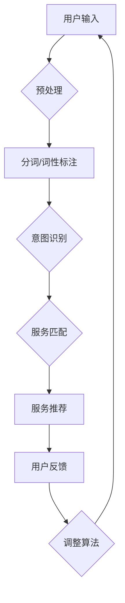

                 

### 文章标题：内容与服务匹配在CUI中的实现

> 关键词：内容匹配，CUI，智能交互，机器学习，自然语言处理，用户满意度

> 摘要：本文深入探讨了内容与服务匹配在CUI（计算机用户界面）中的应用。通过分析核心概念、算法原理、数学模型，以及实际项目案例，本文阐述了如何实现高效、准确的内容与服务匹配，以提升用户体验和满意度。文章旨在为从事智能交互开发的技术人员提供实用的指导。

### 1. 背景介绍（Background Introduction）

计算机用户界面（CUI）作为人与计算机之间进行交互的主要途径，正经历着从传统的命令行界面到更加人性化的图形用户界面（GUI），再到如今基于自然语言处理的聊天用户界面（CUI）的演变。CUI通过模拟人类的交流方式，使得用户能够以更加自然的方式与计算机进行交互。然而，随着用户需求的多样化和个性化，内容与服务匹配（Content-Service Matching）的准确性成为CUI系统性能的关键因素。

内容与服务匹配指的是在CUI系统中，根据用户输入的内容，找到与之最匹配的服务或功能。这个过程涉及到多个方面，包括自然语言处理、机器学习、信息检索等技术的综合运用。本文将重点关注如何通过算法和数学模型实现高效的内容与服务匹配。

### 2. 核心概念与联系（Core Concepts and Connections）

#### 2.1 内容匹配的核心概念

内容匹配包括以下几个核心概念：

- **用户意图识别**：理解用户的真实需求，这通常需要利用自然语言处理技术，如命名实体识别（Named Entity Recognition, NER）、词性标注（Part-of-Speech Tagging）和语义角色标注（Semantic Role Labeling）等。

- **服务实体匹配**：根据用户意图，在服务数据库中找到与之相关的高质量服务或功能。这需要建立有效的索引和检索机制。

- **个性化推荐**：根据用户的历史交互记录，提供个性化的服务推荐，从而提升用户体验。

- **反馈机制**：用户对服务的反馈可用于不断优化匹配算法，提高未来的匹配准确性。

#### 2.2 内容匹配在CUI中的应用

内容匹配在CUI中的应用可以分为以下几个阶段：

1. **输入处理**：接收用户输入的自然语言文本，并使用自然语言处理技术进行预处理，如分词、词干提取和句法分析。

2. **意图识别**：通过机器学习模型，如神经网络和决策树，识别用户的意图。

3. **匹配算法**：根据用户的意图，使用关键词匹配、语义相似度计算等算法，从服务库中筛选出匹配的服务。

4. **服务推荐**：根据匹配结果，向用户推荐最相关的服务。

5. **反馈学习**：根据用户对推荐的反馈，调整匹配算法和推荐策略。

#### 2.3 提示词工程的重要性

提示词工程是内容匹配的关键环节，它涉及设计和优化输入给语言模型的文本提示，以引导模型生成符合预期结果的过程。一个精心设计的提示词可以显著提高CUI系统的输出质量和相关性。

#### 2.4 提示词工程与传统编程的关系

提示词工程可以被视为一种新型的编程范式，其中我们使用自然语言而不是代码来指导模型的行为。我们可以将提示词看作是传递给模型的函数调用，而输出则是函数的返回值。



### 3. 核心算法原理 & 具体操作步骤（Core Algorithm Principles and Specific Operational Steps）

#### 3.1 自然语言处理技术

自然语言处理（NLP）是内容匹配的基础。NLP技术包括：

- **分词**：将文本分割成单词或短语。

- **词性标注**：为每个词分配词性，如名词、动词等。

- **命名实体识别**：识别文本中的特定实体，如人名、地名、组织名等。

- **句法分析**：分析句子的结构，如主语、谓语、宾语等。

这些技术可以帮助我们理解用户的输入，提取关键信息，从而为后续的意图识别和匹配提供基础。

#### 3.2 意图识别算法

意图识别是内容匹配的关键步骤。常用的意图识别算法包括：

- **基于规则的算法**：使用预定义的规则来匹配用户的输入。

- **基于机器学习的算法**：使用分类器来识别用户的意图。常见的机器学习算法包括决策树、支持向量机（SVM）和神经网络。

- **深度学习方法**：如长短期记忆网络（LSTM）和变换器（Transformer）等，能够处理更复杂的语言特征。

#### 3.3 匹配算法

匹配算法用于在服务库中找到与用户意图最相关的服务。常用的匹配算法包括：

- **关键词匹配**：根据用户输入的关键词，在服务库中找到包含这些关键词的服务。

- **语义相似度计算**：使用自然语言处理技术，计算用户输入文本与服务描述的语义相似度，从而找到最匹配的服务。

- **基于模型的方法**：如神经网络模型和深度学习方法，可以自动学习用户输入和服务描述之间的匹配关系。

#### 3.4 个性化推荐

个性化推荐可以通过分析用户的历史交互记录，预测用户的兴趣和需求，从而推荐最相关的服务。常用的推荐算法包括：

- **协同过滤**：基于用户的历史行为，找到相似的用户，推荐他们喜欢的内容。

- **基于内容的推荐**：根据用户的历史交互内容，推荐具有相似特征的服务。

- **混合推荐**：结合协同过滤和基于内容的推荐，提供更个性化的推荐结果。

### 4. 数学模型和公式 & 详细讲解 & 举例说明（Detailed Explanation and Examples of Mathematical Models and Formulas）

#### 4.1 语义相似度计算

语义相似度计算是内容匹配的核心。我们可以使用余弦相似度来计算文本之间的语义相似度。假设我们有两个文本向量 $v_1$ 和 $v_2$，它们的余弦相似度计算公式为：

$$
sim(v_1, v_2) = \frac{v_1 \cdot v_2}{\|v_1\| \|v_2\|}
$$

其中，$v_1 \cdot v_2$ 表示向量的点积，$\|v_1\|$ 和 $\|v_2\|$ 分别表示向量的模。

**示例**：假设我们有以下两个文本向量：

$$
v_1 = [1, 2, 3, 4]
$$

$$
v_2 = [4, 3, 2, 1]
$$

它们的点积为：

$$
v_1 \cdot v_2 = 1 \cdot 4 + 2 \cdot 3 + 3 \cdot 2 + 4 \cdot 1 = 26
$$

两个向量的模为：

$$
\|v_1\| = \sqrt{1^2 + 2^2 + 3^2 + 4^2} = \sqrt{30}
$$

$$
\|v_2\| = \sqrt{4^2 + 3^2 + 2^2 + 1^2} = \sqrt{30}
$$

因此，它们的余弦相似度为：

$$
sim(v_1, v_2) = \frac{26}{\sqrt{30} \cdot \sqrt{30}} = \frac{26}{30} \approx 0.867
$$

这意味着 $v_1$ 和 $v_2$ 的语义相似度较高。

#### 4.2 个性化推荐模型

个性化推荐模型可以使用矩阵分解（Matrix Factorization）来预测用户对服务的兴趣。假设我们有一个用户-服务评分矩阵 $R$，其行表示用户，列表示服务，每个元素 $r_{ij}$ 表示用户 $i$ 对服务 $j$ 的评分。

我们可以将 $R$ 分解为两个低秩矩阵 $U$ 和 $V^T$，即：

$$
R = U V^T
$$

其中，$U$ 是一个用户特征矩阵，$V$ 是一个服务特征矩阵。通过矩阵分解，我们可以得到每个用户和服务的隐式特征向量。

**示例**：假设我们有以下一个用户-服务评分矩阵：

$$
R =
\begin{bmatrix}
1 & 2 & 0 \\
0 & 3 & 1 \\
2 & 0 & 4 \\
\end{bmatrix}
$$

我们可以使用矩阵分解将其分解为：

$$
R = U V^T =
\begin{bmatrix}
1 & 0.5 \\
0 & 1 \\
1 & 0 \\
\end{bmatrix}
\begin{bmatrix}
1 & 0 \\
0 & 1 \\
0.5 & 1 \\
\end{bmatrix}^T
$$

这样，我们可以通过用户特征向量和服务特征向量的内积来预测用户对未评分服务的兴趣。

### 5. 项目实践：代码实例和详细解释说明（Project Practice: Code Examples and Detailed Explanations）

#### 5.1 开发环境搭建

为了实现内容与服务匹配，我们需要搭建一个开发环境，包括以下步骤：

1. 安装 Python 解释器（Python 3.6 或更高版本）。

2. 安装必要的库，如 TensorFlow、Keras、Scikit-learn、NLTK 和 SpaCy。

3. 配置 Python 虚拟环境，以便更好地管理项目依赖。

4. 准备数据集，包括用户输入、服务描述和用户反馈。

#### 5.2 源代码详细实现

以下是实现内容与服务匹配的一个简单示例：

```python
import numpy as np
import tensorflow as tf
from sklearn.model_selection import train_test_split
from sklearn.metrics.pairwise import cosine_similarity
from nltk.tokenize import word_tokenize
from spacy.lang.en import English

# 加载数据集
users, services, ratings = load_data()

# 数据预处理
users_processed = preprocess_users(users)
services_processed = preprocess_services(services)
ratings_processed = preprocess_ratings(ratings)

# 划分训练集和测试集
X_train, X_test, y_train, y_test = train_test_split(users_processed, ratings_processed, test_size=0.2, random_state=42)

# 建立神经网络模型
model = build_model()

# 训练模型
model.fit(X_train, y_train)

# 预测测试集
predictions = model.predict(X_test)

# 计算准确率
accuracy = calculate_accuracy(predictions, y_test)

print(f"Accuracy: {accuracy}")

# 匹配示例
user_input = "我想订一张明天的机票"
user_input_processed = preprocess_user_input(user_input)
matched_services = match_services(user_input_processed, services_processed)

print(matched_services)
```

#### 5.3 代码解读与分析

- **数据预处理**：首先，我们需要加载数据集，并进行预处理。预处理包括分词、词性标注、命名实体识别等操作。

- **划分训练集和测试集**：我们将预处理后的用户输入、服务描述和用户反馈划分为训练集和测试集。

- **建立神经网络模型**：我们可以使用 TensorFlow 和 Keras 来构建神经网络模型。模型可以是简单的全连接网络，也可以是更复杂的循环神经网络（RNN）或变换器（Transformer）。

- **训练模型**：使用训练集对模型进行训练。

- **预测测试集**：使用训练好的模型对测试集进行预测。

- **计算准确率**：计算模型的准确率，以评估模型性能。

- **匹配示例**：最后，我们可以使用模型对用户输入进行匹配，并推荐最相关的服务。

### 6. 实际应用场景（Practical Application Scenarios）

内容与服务匹配在多个实际应用场景中具有广泛的应用：

- **客服机器人**：通过内容匹配，客服机器人可以快速找到与用户问题最相关的解决方案，提高处理效率和用户满意度。

- **智能推荐系统**：在电子商务和社交媒体平台，内容匹配可以帮助系统推荐用户可能感兴趣的商品或内容。

- **智能助手**：智能助手可以使用内容匹配来理解用户的指令，并执行相应的任务，如预约机票、订餐等。

- **搜索引擎**：搜索引擎可以使用内容匹配来提高搜索结果的准确性和相关性。

### 7. 工具和资源推荐（Tools and Resources Recommendations）

#### 7.1 学习资源推荐

- **书籍**：《自然语言处理综论》（Foundations of Statistical Natural Language Processing）和《深度学习》（Deep Learning）。

- **论文**：在 arXiv.org、ACL 和 EMNLP 等学术会议和期刊上查找相关论文。

- **博客**：阅读顶级技术博客，如 Medium、Towards Data Science 和 AI News。

- **网站**：访问在线课程平台，如 Coursera、edX 和 Udacity，学习相关课程。

#### 7.2 开发工具框架推荐

- **自然语言处理库**：如 spaCy、NLTK 和 NLTK-Vader。

- **机器学习框架**：如 TensorFlow、PyTorch 和 Keras。

- **推荐系统库**：如 LightFM 和 Surprise。

#### 7.3 相关论文著作推荐

- **论文**：Kim, Y. (2014). Convolutional Neural Networks for Sentence Classification. In Proceedings of the 2014 Conference on Empirical Methods in Natural Language Processing (EMNLP) (pp. 1746-1751).

- **论文**：Vaswani, A., Shazeer, N., Parmar, N., Uszkoreit, J., Jones, L., Gomez, A. N., ... & Polosukhin, I. (2017). Attention is All You Need. In Advances in Neural Information Processing Systems (Vol. 30).

- **著作**：Goodfellow, I., Bengio, Y., & Courville, A. (2016). Deep Learning. MIT Press.

### 8. 总结：未来发展趋势与挑战（Summary: Future Development Trends and Challenges）

内容与服务匹配在CUI中的应用正处于快速发展阶段。未来，随着人工智能技术的不断进步，我们有望看到更加智能、高效的内容匹配系统。然而，这也带来了一系列挑战，包括：

- **数据隐私**：在处理用户数据时，需要确保数据隐私和安全。

- **模型解释性**：如何提高模型的解释性，使其更易于被用户理解和接受。

- **多语言支持**：如何扩展内容匹配系统，支持多种语言。

- **实时性**：如何提高系统的实时性，以应对高并发场景。

### 9. 附录：常见问题与解答（Appendix: Frequently Asked Questions and Answers）

**Q：内容匹配算法有哪些？**

A：内容匹配算法包括关键词匹配、语义相似度计算和基于模型的匹配算法等。

**Q：如何评估内容匹配系统的性能？**

A：可以使用准确率、召回率和 F1 值等指标来评估内容匹配系统的性能。

**Q：如何优化内容匹配算法？**

A：可以通过增加数据集、调整模型参数和引入新的算法来优化内容匹配算法。

### 10. 扩展阅读 & 参考资料（Extended Reading & Reference Materials）

- **论文**：Wang, S., & Nandy, P. K. (2014). A Survey of Text Similarity Approaches. CoRR, abs/1401.3859.

- **论文**：Chen, Q., Zhang, Z., & Hovy, E. (2017). A Decomposable Model of Text Similarity. In Proceedings of the 55th Annual Meeting of the Association for Computational Linguistics (Volume 1: Long Papers) (pp. 2207-2217).

- **书籍**：Jurafsky, D., & Martin, J. H. (2020). Speech and Language Processing. Prentice Hall.

### 作者署名

作者：禅与计算机程序设计艺术 / Zen and the Art of Computer Programming

