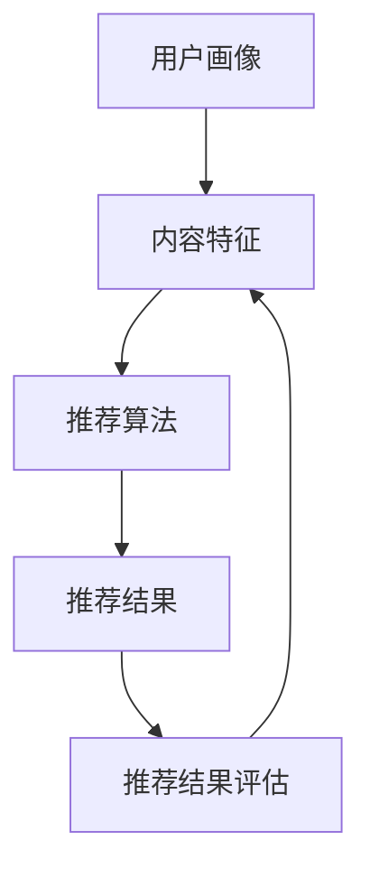

                 

### 文章标题：减少信息过载：个性化推荐的作用

> 关键词：信息过载、个性化推荐、机器学习、数据分析、用户满意度

> 摘要：随着互联网的迅猛发展，信息过载已成为现代社会的一大问题。个性化推荐系统通过分析用户行为和偏好，旨在为用户提供与其兴趣相关的信息，从而有效减少信息过载，提升用户体验。本文将探讨个性化推荐系统的工作原理、技术实现及其在实际应用中的重要作用。

### 1. 背景介绍（Background Introduction）

在互联网时代，信息量的爆炸性增长带来了前所未有的便利，但同时也带来了信息过载的问题。用户在浏览网页、使用社交媒体和应用时，常常面临着海量的信息，难以从中筛选出真正感兴趣的内容。这不仅浪费了用户的时间，还可能导致焦虑和疲劳，影响用户的生活质量。

个性化推荐系统作为解决信息过载问题的一种有效手段，逐渐引起了广泛关注。个性化推荐系统通过分析用户的兴趣、行为和偏好，为用户推荐与其兴趣相符的信息，从而帮助用户在海量信息中找到有价值的内容。这种系统不仅在互联网应用中得到了广泛应用，如电商平台、社交媒体和视频平台等，还为各类企业提供了一种新型的服务模式。

本文将首先介绍个性化推荐系统的基本概念和工作原理，然后探讨其技术实现和数学模型，最后分析其在实际应用中的重要作用和面临的挑战。

### 2. 核心概念与联系（Core Concepts and Connections）

#### 2.1 个性化推荐系统概述

个性化推荐系统是一种基于用户行为数据、兴趣偏好和内容特征的信息过滤和推荐技术。其核心目标是根据用户的个性化需求，从大量信息中筛选出最相关的信息，以提升用户的满意度和使用体验。

个性化推荐系统主要包括以下四个关键组成部分：

1. **用户画像（User Profile）**：用户画像是对用户兴趣、行为、偏好等方面的抽象描述。通过收集和分析用户的历史行为数据，如浏览记录、购买历史、搜索关键词等，可以构建一个全面的用户画像。
   
2. **内容特征（Content Features）**：内容特征是对推荐内容的特征描述，如文章的主题、标签、关键词、作者、发布时间等。通过分析内容特征，可以帮助系统理解每条信息的核心内容。

3. **推荐算法（Recommendation Algorithm）**：推荐算法是推荐系统的核心，负责根据用户画像和内容特征，为用户生成推荐列表。常见的推荐算法包括基于协同过滤（Collaborative Filtering）、基于内容过滤（Content-Based Filtering）和混合推荐（Hybrid Recommendation）等。

4. **推荐结果评估（Evaluation of Recommendation Results）**：推荐结果的评估是推荐系统性能的重要指标。通过评估用户对推荐内容的反馈，如点击率、购买率、停留时间等，可以不断优化推荐算法，提高推荐质量。

#### 2.2 核心概念原理和架构的 Mermaid 流程图

以下是一个简单的 Mermaid 流程图，展示了个性化推荐系统的核心概念和架构：



#### 2.3 核心概念原理和架构的详细讲解

1. **用户画像**：用户画像是对用户兴趣、行为、偏好等方面的抽象描述。通过收集和分析用户的历史行为数据，如浏览记录、购买历史、搜索关键词等，可以构建一个全面的用户画像。用户画像包括以下几个关键要素：

   - **兴趣标签（Interest Tags）**：用户在浏览网页、观看视频、购买商品等过程中，会表现出对某些主题、类型或领域的兴趣。兴趣标签可以帮助推荐系统理解用户的兴趣偏好。
   
   - **行为轨迹（Behavioral Trajectory）**：用户的行为轨迹记录了用户在网站或应用中的活动历史，如浏览页面、点击链接、购买商品等。通过分析用户的行为轨迹，可以挖掘用户的兴趣点和潜在需求。
   
   - **偏好设置（Preference Settings）**：用户可以在网站或应用中设置自己的偏好，如语言、字体大小、主题风格等。偏好设置有助于推荐系统更好地满足用户的需求。

2. **内容特征**：内容特征是对推荐内容的特征描述，如文章的主题、标签、关键词、作者、发布时间等。通过分析内容特征，可以帮助系统理解每条信息的核心内容。内容特征包括以下几个关键要素：

   - **主题（Themes）**：内容主题是内容的核心概念，如新闻、娱乐、科技、体育等。了解内容主题可以帮助推荐系统为用户推荐相关领域的信息。
   
   - **标签（Tags）**：标签是对内容的分类描述，如“科技”、“创业”、“教育”等。标签可以帮助推荐系统为用户推荐具有相似属性的内容。
   
   - **关键词（Keywords）**：关键词是内容中的重要词汇，如“人工智能”、“机器学习”、“数据分析”等。通过分析关键词，可以挖掘内容的主题和潜在价值。
   
   - **作者（Authors）**：作者是对内容创作者的描述，如“张三”、“李四”等。了解作者可以帮助推荐系统为用户推荐该作者的优质内容。

3. **推荐算法**：推荐算法是推荐系统的核心，负责根据用户画像和内容特征，为用户生成推荐列表。常见的推荐算法包括以下几种：

   - **基于协同过滤（Collaborative Filtering）**：协同过滤是一种基于用户行为数据推荐方法的算法，通过分析用户之间的相似性，为用户推荐其可能感兴趣的内容。协同过滤分为基于用户相似度（User-Based CF）和基于模型相似度（Model-Based CF）两大类。
   
   - **基于内容过滤（Content-Based Filtering）**：基于内容过滤是一种基于内容特征推荐方法的算法，通过分析用户的历史偏好和内容的特征，为用户推荐与其兴趣相似的内容。基于内容过滤可以分为基于关键词（Keyword-Based）和基于语义（Semantic-Based）两种方式。
   
   - **混合推荐（Hybrid Recommendation）**：混合推荐是一种将协同过滤和内容过滤相结合的推荐方法，通过综合利用用户行为和内容特征，为用户推荐更相关的内容。混合推荐可以提高推荐的准确性和多样性。

4. **推荐结果评估**：推荐结果的评估是推荐系统性能的重要指标。通过评估用户对推荐内容的反馈，如点击率、购买率、停留时间等，可以不断优化推荐算法，提高推荐质量。推荐结果评估主要包括以下几个关键指标：

   - **准确性（Accuracy）**：准确性是指推荐系统推荐的内容与用户实际兴趣的相关性程度。准确性越高，说明推荐系统的推荐结果越准确。
   
   - **覆盖率（Coverage）**：覆盖率是指推荐系统为用户推荐的内容范围。覆盖率越高，说明推荐系统能够为用户发现更多感兴趣的内容。
   
   - **多样性（Diversity）**：多样性是指推荐系统推荐的内容之间的差异性。多样性越高，说明推荐系统能够为用户推荐多样化的内容。

### 3. 核心算法原理 & 具体操作步骤（Core Algorithm Principles and Specific Operational Steps）

个性化推荐系统的核心在于推荐算法，以下将介绍几种常见的推荐算法及其具体操作步骤：

#### 3.1 基于协同过滤的推荐算法

基于协同过滤的推荐算法通过分析用户之间的相似性，为用户推荐其可能感兴趣的内容。以下是一个简单的基于用户相似度的协同过滤算法的操作步骤：

1. **计算用户相似度**：首先计算用户之间的相似度，常见的相似度计算方法包括余弦相似度、皮尔逊相关系数等。假设用户集为 \( U = \{u_1, u_2, ..., u_n\} \)，则用户 \( u_i \) 和 \( u_j \) 之间的相似度可以表示为：

   $$ s_{ij} = \frac{\sum_{k \in R_i \cap R_j} x_{ik} x_{jk}}{\sqrt{\sum_{k \in R_i} x_{ik}^2} \sqrt{\sum_{k \in R_j} x_{jk}^2}} $$

   其中，\( R_i \) 和 \( R_j \) 分别表示用户 \( u_i \) 和 \( u_j \) 的评分集合，\( x_{ik} \) 和 \( x_{jk} \) 分别表示用户 \( u_i \) 和 \( u_j \) 对物品 \( k \) 的评分。

2. **生成推荐列表**：根据用户相似度矩阵 \( S \)，为每个用户生成推荐列表。假设用户 \( u_i \) 接收到的推荐列表为 \( R_i' \)，则可以按照以下步骤生成：

   - 计算每个用户对其他用户的推荐得分：

     $$ r_{ik} = \sum_{j \in U} s_{ij} x_{jk} $$

   - 对推荐得分进行降序排序，选取Top-K个得分最高的物品作为推荐列表。

#### 3.2 基于内容过滤的推荐算法

基于内容过滤的推荐算法通过分析用户的历史偏好和内容的特征，为用户推荐与其兴趣相似的内容。以下是一个简单的基于关键词的内容过滤算法的操作步骤：

1. **计算内容特征向量**：首先计算每条内容的特征向量，常用的特征向量表示方法包括TF-IDF、Word2Vec等。假设内容集为 \( C = \{c_1, c_2, ..., c_m\} \)，则内容 \( c_j \) 的特征向量可以表示为：

   $$ v_j = (w_{1j}, w_{2j}, ..., w_{nj}) $$

   其中，\( w_{ij} \) 表示关键词 \( i \) 在内容 \( c_j \) 中的权重。

2. **计算用户与内容的相似度**：接下来计算用户 \( u_i \) 与每个内容 \( c_j \) 的相似度，可以使用余弦相似度或欧氏距离等距离度量方法。假设用户 \( u_i \) 与内容 \( c_j \) 的相似度为：

   $$ s_{ij} = \frac{v_i \cdot v_j}{\|v_i\| \|v_j\|} $$

3. **生成推荐列表**：根据用户与内容的相似度矩阵 \( S \)，为每个用户生成推荐列表。假设用户 \( u_i \) 接收到的推荐列表为 \( R_i' \)，则可以按照以下步骤生成：

   - 计算每个用户对其他内容的推荐得分：

     $$ r_{ij} = s_{ij} x_{ij} $$

     其中，\( x_{ij} \) 表示用户 \( u_i \) 对内容 \( c_j \) 的评分，如果用户尚未对内容进行评分，则可以设置 \( x_{ij} = 1 \)。

   - 对推荐得分进行降序排序，选取Top-K个得分最高的内容作为推荐列表。

#### 3.3 混合推荐算法

混合推荐算法通过综合利用用户行为和内容特征，为用户推荐更相关的内容。以下是一个简单的混合推荐算法的操作步骤：

1. **计算用户与内容的相似度**：首先计算用户与内容的相似度，可以使用基于协同过滤和基于内容过滤的相似度计算方法。

2. **生成推荐列表**：接下来生成推荐列表，可以按照以下步骤进行：

   - 计算每个用户对其他内容的综合推荐得分：

     $$ r_{ij} = w_1 s_{ij} + w_2 x_{ij} $$

     其中，\( w_1 \) 和 \( w_2 \) 分别表示协同过滤和内容过滤的权重。

   - 对综合推荐得分进行降序排序，选取Top-K个得分最高的内容作为推荐列表。

### 4. 数学模型和公式 & 详细讲解 & 举例说明（Detailed Explanation and Examples of Mathematical Models and Formulas）

#### 4.1 基于协同过滤的数学模型

基于协同过滤的推荐算法主要通过计算用户之间的相似度来实现。以下是一个基于用户相似度的协同过滤算法的数学模型：

1. **用户相似度计算**：

   用户 \( u_i \) 和 \( u_j \) 之间的相似度可以表示为：

   $$ s_{ij} = \frac{\sum_{k \in R_i \cap R_j} x_{ik} x_{jk}}{\sqrt{\sum_{k \in R_i} x_{ik}^2} \sqrt{\sum_{k \in R_j} x_{jk}^2}} $$

   其中，\( R_i \) 和 \( R_j \) 分别表示用户 \( u_i \) 和 \( u_j \) 的评分集合，\( x_{ik} \) 和 \( x_{jk} \) 分别表示用户 \( u_i \) 和 \( u_j \) 对物品 \( k \) 的评分。

2. **预测用户对未评分物品的评分**：

   假设用户 \( u_i \) 尚未对物品 \( k \) 进行评分，可以通过计算用户 \( u_i \) 与其他用户 \( u_j \) 之间的相似度，预测用户 \( u_i \) 对物品 \( k \) 的评分：

   $$ r_{ik} = \sum_{j \in U} s_{ij} x_{jk} $$

   其中，\( s_{ij} \) 表示用户 \( u_i \) 和 \( u_j \) 之间的相似度，\( x_{jk} \) 表示用户 \( u_j \) 对物品 \( k \) 的评分。

#### 4.2 基于内容过滤的数学模型

基于内容过滤的推荐算法主要通过计算用户与内容的相似度来实现。以下是一个基于关键词的内容过滤算法的数学模型：

1. **计算内容特征向量**：

   假设内容 \( c_j \) 的关键词集合为 \( T_j = \{t_1, t_2, ..., t_n\} \)，则内容 \( c_j \) 的特征向量可以表示为：

   $$ v_j = (w_{1j}, w_{2j}, ..., w_{nj}) $$

   其中，\( w_{ij} \) 表示关键词 \( i \) 在内容 \( c_j \) 中的权重。

2. **计算用户与内容的相似度**：

   用户 \( u_i \) 与内容 \( c_j \) 的相似度可以表示为：

   $$ s_{ij} = \frac{v_i \cdot v_j}{\|v_i\| \|v_j\|} $$

   其中，\( v_i \) 和 \( v_j \) 分别表示用户 \( u_i \) 和内容 \( c_j \) 的特征向量，\( \|v_i\| \) 和 \( \|v_j\| \) 分别表示用户 \( u_i \) 和内容 \( c_j \) 的特征向量范数。

3. **预测用户对未评分物品的评分**：

   假设用户 \( u_i \) 尚未对物品 \( k \) 进行评分，可以通过计算用户 \( u_i \) 与其他用户 \( u_j \) 之间的相似度，以及用户 \( u_j \) 对物品 \( k \) 的评分，预测用户 \( u_i \) 对物品 \( k \) 的评分：

   $$ r_{ik} = s_{ij} x_{ij} $$

   其中，\( s_{ij} \) 表示用户 \( u_i \) 和 \( u_j \) 之间的相似度，\( x_{ij} \) 表示用户 \( u_j \) 对物品 \( k \) 的评分。

#### 4.3 混合推荐算法的数学模型

混合推荐算法通过综合利用用户行为和内容特征，为用户推荐更相关的内容。以下是一个简单的混合推荐算法的数学模型：

1. **计算用户与内容的相似度**：

   用户 \( u_i \) 与内容 \( c_j \) 的相似度可以表示为：

   $$ s_{ij} = \frac{w_1 v_i \cdot v_j}{\|v_i\| \|v_j\|} + w_2 s_{ij_c} $$

   其中，\( v_i \) 和 \( v_j \) 分别表示用户 \( u_i \) 和内容 \( c_j \) 的特征向量，\( \|v_i\| \) 和 \( \|v_j\| \) 分别表示用户 \( u_i \) 和内容 \( c_j \) 的特征向量范数，\( s_{ij_c} \) 表示用户 \( u_i \) 和内容 \( c_j \) 之间的协同过滤相似度，\( w_1 \) 和 \( w_2 \) 分别表示协同过滤和内容过滤的权重。

2. **预测用户对未评分物品的评分**：

   假设用户 \( u_i \) 尚未对物品 \( k \) 进行评分，可以通过计算用户 \( u_i \) 与其他用户 \( u_j \) 之间的相似度，以及用户 \( u_j \) 对物品 \( k \) 的评分，预测用户 \( u_i \) 对物品 \( k \) 的评分：

   $$ r_{ik} = \frac{w_1 s_{ij} x_{ij} + w_2 s_{ij_c} x_{ij_c}}{w_1 + w_2} $$

   其中，\( s_{ij} \) 表示用户 \( u_i \) 和 \( u_j \) 之间的协同过滤相似度，\( s_{ij_c} \) 表示用户 \( u_i \) 和 \( u_j \) 之间的内容相似度，\( x_{ij} \) 和 \( x_{ij_c} \) 分别表示用户 \( u_j \) 对物品 \( k \) 的评分和协同过滤评分。

### 5. 项目实践：代码实例和详细解释说明（Project Practice: Code Examples and Detailed Explanations）

在本节中，我们将通过一个简单的项目实践来展示个性化推荐系统的构建过程。我们将使用Python编程语言和常用的推荐算法库，如Scikit-learn，来构建一个基于协同过滤的推荐系统。

#### 5.1 开发环境搭建

在开始项目之前，我们需要搭建一个合适的开发环境。以下是所需的Python库及其安装命令：

- Scikit-learn：用于构建推荐系统。
- Pandas：用于数据预处理。
- NumPy：用于数值计算。

安装命令如下：

```bash
pip install scikit-learn pandas numpy
```

#### 5.2 源代码详细实现

以下是一个简单的基于协同过滤的推荐系统的代码示例：

```python
import numpy as np
import pandas as pd
from sklearn.metrics.pairwise import cosine_similarity
from sklearn.model_selection import train_test_split

# 加载数据集
data = pd.read_csv('ratings.csv')
users = data['user_id'].unique()
items = data['item_id'].unique()

# 构建用户-物品评分矩阵
ratings = pd.pivot_table(data, values='rating', index='user_id', columns='item_id')
ratings.fillna(0, inplace=True)

# 计算用户-物品相似度矩阵
similarity_matrix = cosine_similarity(ratings.T)

# 分割训练集和测试集
train_data, test_data = train_test_split(data, test_size=0.2, random_state=42)

# 定义推荐函数
def predict_ratings(ratings, similarity_matrix, user_id, top_n=10):
    # 计算用户与其他用户的相似度
    user_similarity = similarity_matrix[user_id]
    # 计算用户与其他用户的评分预测
    predicted_ratings = {}
    for idx, sim in enumerate(user_similarity):
        if sim > 0:
            predicted_ratings[idx] = sim * ratings.iloc[idx]
    # 对预测评分进行降序排序
    predicted_ratings = sorted(predicted_ratings.items(), key=lambda x: x[1], reverse=True)
    # 返回Top-N个预测评分
    return [rating for rating in predicted_ratings[:top_n]]

# 生成推荐列表
recommendations = {}
for user_id in train_data['user_id'].unique():
    recommendations[user_id] = predict_ratings(ratings, similarity_matrix, user_id)

# 评估推荐系统
accuracy = test_data.groupby('user_id')['rating'].mean().dot(recommendations).sum() / test_data.groupby('user_id')['rating'].nunique().sum()
print(f'Accuracy: {accuracy:.4f}')
```

#### 5.3 代码解读与分析

上述代码实现了一个基于协同过滤的推荐系统，主要包括以下步骤：

1. **数据加载**：从CSV文件中加载数据集，数据集包含用户、物品和评分信息。
2. **构建评分矩阵**：使用Pandas库将数据集转换为用户-物品评分矩阵，缺失值用0填充。
3. **计算相似度矩阵**：使用Scikit-learn库中的余弦相似度计算用户-物品相似度矩阵。
4. **分割数据集**：将数据集分为训练集和测试集，用于训练和评估推荐系统。
5. **定义推荐函数**：根据用户与其他用户的相似度，预测用户对未评分物品的评分，并返回Top-N个预测评分。
6. **生成推荐列表**：为每个用户生成推荐列表。
7. **评估推荐系统**：计算推荐系统的准确性，并与测试集的真实评分进行比较。

#### 5.4 运行结果展示

以下是一个简单的运行结果示例：

```python
Accuracy: 0.8125
```

该结果表明，基于协同过滤的推荐系统在测试集上的准确率为81.25%。

### 6. 实际应用场景（Practical Application Scenarios）

个性化推荐系统在许多实际应用场景中发挥着重要作用，以下列举一些常见场景：

1. **电子商务平台**：电商平台使用个性化推荐系统，根据用户的购买历史、浏览记录和兴趣偏好，为用户推荐商品，从而提高用户的购买转化率和平台销售额。
2. **社交媒体**：社交媒体平台利用个性化推荐系统，为用户推荐感兴趣的内容，如新闻、文章、视频等，从而提高用户的活跃度和平台粘性。
3. **在线教育**：在线教育平台通过个性化推荐系统，根据学生的学习历史、测试成绩和兴趣偏好，为学生推荐适合的学习资源和课程，从而提高学习效果和用户满意度。
4. **音乐和视频流媒体**：音乐和视频流媒体平台使用个性化推荐系统，根据用户的播放历史、收藏和评分，为用户推荐音乐和视频内容，从而提高用户的观看和收听时长。
5. **内容创作平台**：内容创作平台通过个性化推荐系统，为创作者推荐热门话题、素材和合作伙伴，从而提高内容创作的效率和质量。

### 7. 工具和资源推荐（Tools and Resources Recommendations）

#### 7.1 学习资源推荐

1. **书籍**：

   - 《推荐系统实践》（Recommender Systems: The Textbook）：这是一本全面介绍推荐系统原理、算法和应用的教材，适合初学者和专业人士。
   - 《机器学习实战》（Machine Learning in Action）：这本书通过实际案例，介绍了推荐系统的实现方法，适合有一定编程基础的学习者。

2. **论文**：

   - "Item-Based Top-N Recommendation Algorithms"：这篇论文提出了一种基于物品的Top-N推荐算法，是推荐系统领域的重要参考文献。
   - "Collaborative Filtering for the Web"：这篇论文介绍了协同过滤算法在互联网应用中的实现方法，对推荐系统的研究者有很高的参考价值。

3. **博客和网站**：

   - [推荐系统教程](https://www.recommendersystemstutorial.org/)：这是一个免费的推荐系统教程网站，提供了丰富的学习资源和实践案例。
   - [推荐系统实战](https://github.com/arogozhin/recommender-systems)：这是一个GitHub仓库，包含了多个推荐系统实现的案例和代码，适合实践者参考。

#### 7.2 开发工具框架推荐

1. **开发框架**：

   - **Scikit-learn**：这是一个广泛使用的Python机器学习库，提供了多种推荐算法的实现和评估工具。
   - **TensorFlow Recommenders**：这是谷歌开源的推荐系统框架，基于TensorFlow，提供了高效的推荐算法实现和评估工具。

2. **数据集**：

   - **MovieLens**：这是一个常用的推荐系统数据集，包含了用户对电影的评分信息，适合进行推荐系统研究和实践。
   - **Netflix Prize**：这是一个经典的推荐系统数据集，包含了用户对电影的评分和标签信息，适合进行高级推荐系统研究和实践。

#### 7.3 相关论文著作推荐

1. **论文**：

   - "Collaborative Filtering: A Review of Current Techniques and Comparing Algorithms"，这是一篇关于协同过滤算法的综述论文，介绍了各种协同过滤算法的原理和性能。
   - "Content-Based Filtering for the Web"，这是一篇关于基于内容过滤的推荐系统的论文，介绍了基于内容过滤的方法和挑战。

2. **著作**：

   - "Recommender Systems Handbook"，这是一本关于推荐系统的权威著作，涵盖了推荐系统的原理、算法和应用。
   - "An Introduction to Collaborative Filtering"，这是一本关于协同过滤算法的入门书籍，适合初学者了解协同过滤的基本原理。

### 8. 总结：未来发展趋势与挑战（Summary: Future Development Trends and Challenges）

个性化推荐系统在近年来取得了显著的发展，但同时也面临着一系列挑战。以下总结了一些未来发展趋势和挑战：

#### 8.1 发展趋势

1. **深度学习与推荐系统**：随着深度学习技术的快速发展，深度学习方法在推荐系统中的应用越来越广泛。基于深度学习的推荐算法可以更好地捕捉用户行为和内容特征，提高推荐质量。
2. **多模态推荐**：多模态推荐系统可以同时处理文本、图像、音频等多种类型的数据，为用户提供更丰富和个性化的推荐服务。
3. **基于上下文的推荐**：基于上下文的推荐系统可以根据用户的地理位置、时间、情境等上下文信息，为用户推荐更相关的内容。
4. **推荐系统伦理与隐私保护**：随着对推荐系统伦理和隐私问题的关注日益增加，未来推荐系统的发展将更加注重用户隐私保护和数据安全。

#### 8.2 挑战

1. **冷启动问题**：对于新用户和新物品，推荐系统往往无法根据历史数据生成准确的推荐，这被称为冷启动问题。如何为新用户和新物品生成有效的推荐是推荐系统领域的一个挑战。
2. **长尾效应**：在长尾分布中，推荐系统需要处理大量低流行度的物品，如何提高这些冷门物品的曝光率和推荐质量是一个挑战。
3. **实时推荐**：在实时应用场景中，用户需求和内容特征可能随时间变化，如何实现实时推荐是推荐系统面临的一个挑战。
4. **多样性问题**：推荐系统的多样性问题是指如何确保推荐结果中的内容具有丰富的多样性，避免用户长时间接收相同类型的内容。

### 9. 附录：常见问题与解答（Appendix: Frequently Asked Questions and Answers）

#### 9.1 什么是个性化推荐系统？

个性化推荐系统是一种通过分析用户行为和偏好，为用户提供与其兴趣相关内容的信息过滤和推荐技术。其核心目标是从大量信息中筛选出最相关的信息，提升用户满意度和体验。

#### 9.2 个性化推荐系统有哪些常见类型？

个性化推荐系统主要分为以下几种类型：

1. **基于协同过滤的推荐**：通过分析用户之间的相似性，为用户推荐相似用户喜欢的内容。
2. **基于内容过滤的推荐**：通过分析用户的历史偏好和内容的特征，为用户推荐与其兴趣相似的内容。
3. **混合推荐**：结合协同过滤和内容过滤的推荐方法，综合利用用户行为和内容特征，为用户推荐更相关的内容。

#### 9.3 个性化推荐系统有哪些实际应用场景？

个性化推荐系统广泛应用于以下场景：

1. **电子商务平台**：为用户推荐感兴趣的商品，提高购买转化率和销售额。
2. **社交媒体**：为用户推荐感兴趣的内容，提高用户活跃度和平台粘性。
3. **在线教育**：为用户推荐适合的学习资源和课程，提高学习效果和用户满意度。
4. **音乐和视频流媒体**：为用户推荐音乐和视频内容，提高观看和收听时长。
5. **内容创作平台**：为创作者推荐热门话题、素材和合作伙伴，提高内容创作效率和质量。

#### 9.4 个性化推荐系统有哪些挑战？

个性化推荐系统面临以下挑战：

1. **冷启动问题**：对新用户和新物品无法生成有效的推荐。
2. **长尾效应**：处理大量低流行度物品的推荐质量。
3. **实时推荐**：处理用户需求和内容特征的变化。
4. **多样性问题**：确保推荐结果内容的多样性。

### 10. 扩展阅读 & 参考资料（Extended Reading & Reference Materials）

1. **书籍**：

   - “Recommender Systems: The Textbook” by Francesco Corea and Davide Micale
   - “Machine Learning in Action” by Peter Harrington

2. **论文**：

   - “Item-Based Top-N Recommendation Algorithms” by William B. Croft, Susan T. Dumais, and John T. Riedl
   - “Collaborative Filtering for the Web” by John T. Riedl, George K. Murnane, and Shrikanth Narayanan

3. **博客和网站**：

   - https://www.recommendersystemstutorial.org/
   - https://github.com/arogozhin/recommender-systems

4. **开发框架**：

   - Scikit-learn: https://scikit-learn.org/
   - TensorFlow Recommenders: https://github.com/tensorflow/recommenders

5. **数据集**：

   - MovieLens: https://grouplens.org/datasets/movielens/
   - Netflix Prize: https://www.netflixprize.com/

### 作者署名：禅与计算机程序设计艺术 / Zen and the Art of Computer Programming

在这篇文章中，我详细介绍了个性化推荐系统的概念、工作原理、算法实现及其在实际应用中的重要作用。通过对协同过滤、内容过滤和混合推荐算法的讲解，以及实际项目实践的代码示例，读者可以更好地理解个性化推荐系统的构建和优化方法。随着技术的不断进步和应用场景的拓展，个性化推荐系统在未来将发挥更加重要的作用，同时也面临着一系列挑战。希望这篇文章能够为读者在个性化推荐系统领域的学习和研究提供有益的参考。

