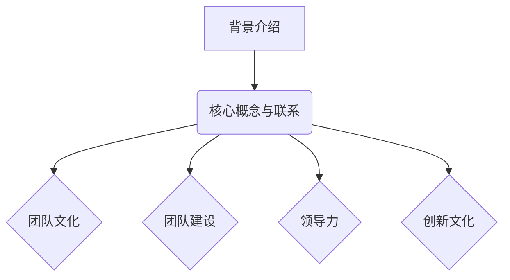
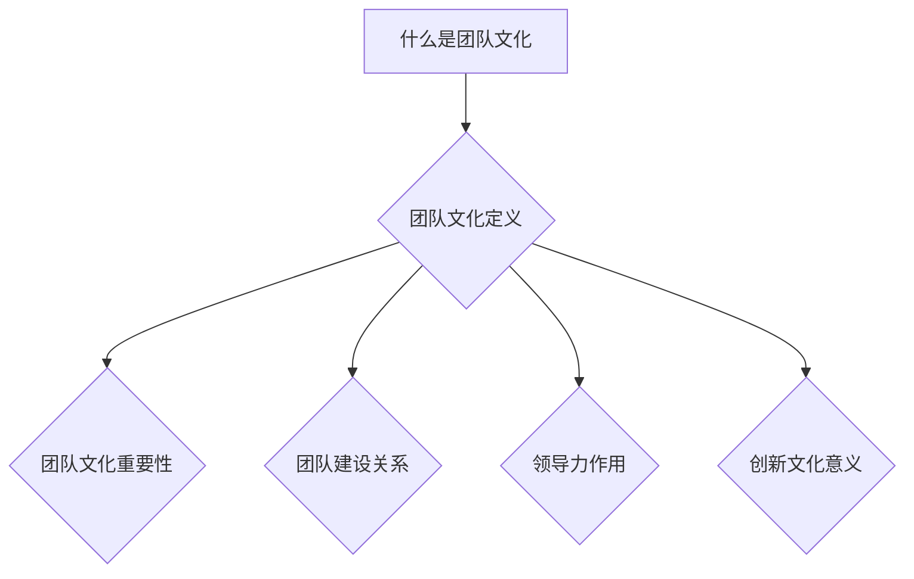
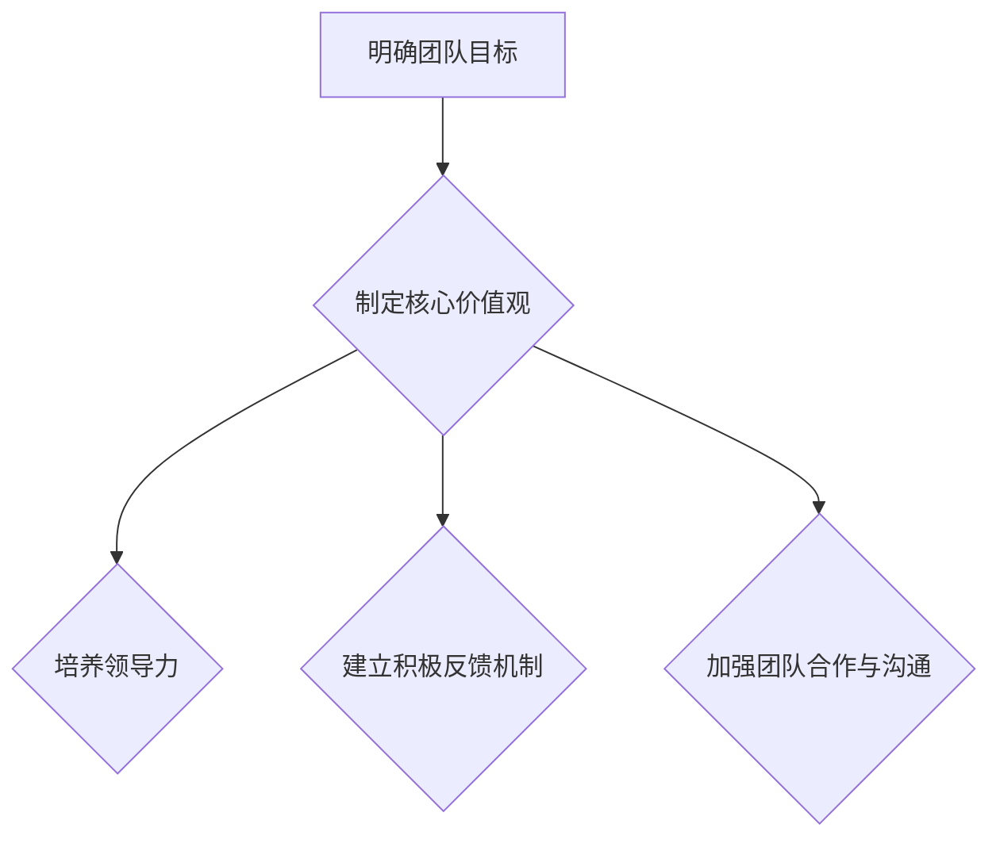

                 

### 文章标题

**创业公司的团队文化建设**

在当今快速变化的商业环境中，创业公司的成功不再仅仅依赖于创新的产品或服务，团队文化的建设成为了企业的核心竞争力之一。一个健康、积极的团队文化能够促进员工的合作、创新和成长，从而推动企业的持续发展。本文将探讨创业公司团队文化建设的核心概念、关键要素以及实施步骤，旨在为创业者和管理者提供有价值的参考和指导。

### Keywords:
- 创业公司
- 团队文化
- 组织建设
- 领导力
- 创新文化

### Abstract:
This article discusses the importance of team culture in startup companies. It provides insights into core concepts, key components, and implementation steps for building a healthy and positive team culture, aimed at helping entrepreneurs and managers drive their business success.

<|assistant|>## 1. 背景介绍（Background Introduction）

创业公司的成长历程充满了不确定性，市场竞争激烈，资源有限。在这样的环境下，团队文化成为了企业成功的关键因素之一。团队文化不仅影响着员工的态度和行为，还决定了企业能否在面对挑战时保持一致性和灵活性。

**核心概念与联系**

- **团队文化**：团队文化是指团队成员共同遵循的价值观、信念和行为准则。它不仅反映了企业的核心目标，还塑造了员工的思维方式和工作风格。

- **团队建设**：团队建设是指通过一系列活动和策略，增强团队成员之间的合作和信任，以提高团队的整体表现。

- **领导力**：领导力在团队文化建设中起着至关重要的作用。领导者需要通过言行一致、建立明确的目标和期望来塑造团队文化。

- **创新文化**：创新文化是一种鼓励员工尝试新事物、不断探索和改进的企业氛围。在创业公司中，创新文化尤为重要，因为它能够推动企业的持续成长。

**Mermaid 流程图**

<|assistant|>## 2. 核心概念与联系

### 2.1 什么是团队文化？

团队文化是一个团队在长期发展和互动过程中形成的共同价值观和行为准则。它不仅反映了企业的核心目标，还塑造了员工的思维方式和工作风格。团队文化可以被视为团队精神和氛围的体现。

### 2.2 团队文化的重要性

团队文化对创业公司的成功至关重要。首先，它能够增强员工的归属感和忠诚度，降低离职率。其次，团队文化有助于建立强大的内部协作和信任，提高团队的整体表现。最后，团队文化能够激发员工的创新精神，推动企业的持续成长。

### 2.3 团队文化与团队建设的关系

团队建设是团队文化形成的基础。通过一系列团队活动和策略，如团队建设训练、团队合作项目等，可以增强团队成员之间的合作和信任，从而塑造和强化团队文化。

### 2.4 领导力在团队文化建设中的作用

领导者是团队文化的关键塑造者。他们需要通过言行一致、建立明确的目标和期望来引导团队成员，推动团队文化的建设。领导者还需要在团队面临挑战时，以身作则，展现坚韧和决心。

### 2.5 创新文化对创业公司的意义

创新文化是创业公司成功的关键。它鼓励员工尝试新事物、不断探索和改进。在竞争激烈的市场环境中，创新文化能够帮助创业公司保持竞争优势，推动企业的持续发展。

**Mermaid 流程图**

<|assistant|>## 3. 核心算法原理 & 具体操作步骤

在构建创业公司的团队文化时，我们可以借鉴一些核心算法原理，以确保团队文化的有效构建和持续发展。

### 3.1 核心算法原理

- **积极反馈循环**：团队成员在达成目标后，应该得到积极的反馈，以增强自信心和动力。这种反馈可以是直接的表扬、奖励或团队庆祝活动。

- **共同价值观的制定**：团队应该共同制定核心价值观，这些价值观应该贯穿于企业的方方面面，成为团队行为的标准。

- **领导力培养**：领导者需要通过培训和实践来提升自己的领导力，以便更好地塑造和引导团队文化。

- **团队合作与沟通**：团队内部应该建立有效的沟通机制，鼓励团队成员之间的合作与分享，以促进团队文化的形成。

### 3.2 具体操作步骤

1. **明确团队目标**：首先，团队需要明确共同的目标和愿景。这可以通过团队会议、愿景陈述等方式来实现。

2. **制定核心价值观**：团队应该讨论并确定共同的核心价值观。这些价值观应该反映企业的使命和愿景，并得到全体团队成员的认同。

3. **培养领导力**：领导者需要通过培训和实践来提升自己的领导力。这可以通过参加领导力课程、参与管理实践等方式来实现。

4. **建立积极的反馈机制**：团队应该建立积极的反馈机制，鼓励成员在达成目标后得到积极的反馈。这可以通过定期的团队会议、奖励计划等方式来实现。

5. **加强团队合作与沟通**：团队需要建立有效的沟通机制，鼓励团队成员之间的合作与分享。这可以通过定期的团队活动、沟通工具等方式来实现。

**Mermaid 流�程图**

通过这些核心算法原理和具体操作步骤，创业公司可以构建一个积极、健康、有凝聚力的团队文化，为企业的持续发展奠定坚实的基础。

<|assistant|>## 4. 数学模型和公式 & 详细讲解 & 举例说明

在团队文化建设中，一些数学模型和公式可以帮助我们理解和量化团队文化的影响。以下是一些常见的模型和公式，以及它们的详细讲解和举例说明。

### 4.1 效率模型

**效率模型**用来衡量团队的整体效率。效率可以表示为：

\[ \text{效率} = \frac{\text{产出}}{\text{投入}} \]

其中，产出指的是团队在一定时间内完成的工作量，投入指的是团队在该时间内所花费的资源，包括人力、时间和资金等。

**举例说明**：如果一个创业公司的团队在一个月内完成了1000个产品的设计和生产，而团队的总投入为50人天，那么团队的效率为：

\[ \text{效率} = \frac{1000}{50} = 20 \]

这意味着团队每天平均可以完成20个产品的设计和生产。

### 4.2 员工满意度模型

**员工满意度模型**用来衡量员工对团队文化的满意程度。员工满意度可以表示为：

\[ \text{满意度} = \frac{\text{正面反馈}}{\text{负面反馈}} \]

其中，正面反馈包括员工对团队文化的认同、工作满意度和忠诚度等，负面反馈包括员工对团队文化的抱怨、工作压力和不满意等。

**举例说明**：如果一个创业公司的员工中有80%表示对团队文化满意，而只有20%表示不满意，那么员工的满意度为：

\[ \text{满意度} = \frac{80}{20} = 4 \]

这表明员工的总体满意度较高，团队文化对员工的积极影响较大。

### 4.3 创新力模型

**创新力模型**用来衡量团队的创新能力和创新成果。创新力可以表示为：

\[ \text{创新力} = \frac{\text{创新成果}}{\text{投入资源}} \]

其中，创新成果包括新产品、新服务、新想法等，投入资源包括人力、时间和资金等。

**举例说明**：如果一个创业公司的团队在一个月内推出了3个新产品，而团队的总投入为100人天，那么团队的创新力为：

\[ \text{创新力} = \frac{3}{100} = 0.03 \]

这表明团队的创新力相对较高，能够有效地利用资源进行创新。

通过这些数学模型和公式，我们可以更科学地评估团队文化的影响，并根据实际情况进行调整和优化。

### 总结

本文详细介绍了创业公司团队文化建设的核心概念、关键要素和实施步骤。通过借鉴数学模型和公式，我们可以更科学地评估团队文化的影响，并采取相应的措施来优化团队文化。创业公司领导者应重视团队文化建设，将其作为企业成功的关键因素之一，以推动企业的持续发展。

---

## Summary

In this article, we have explored the core concepts, key components, and implementation steps of team culture building in startup companies. By leveraging mathematical models and formulas, we can scientifically evaluate the impact of team culture and take appropriate measures to optimize it. Startup company leaders should prioritize team culture building, recognizing it as a critical factor for business success and driving continuous growth.

---

### 谢谢您阅读这篇文章，希望您能够从中学到一些有用的知识和见解。如果您有任何问题或反馈，欢迎在评论区留言。作者：禅与计算机程序设计艺术 / Zen and the Art of Computer Programming。

---

## 谢谢您阅读这篇文章，希望您能够从中学到一些有用的知识和见解。如果您有任何问题或反馈，欢迎在评论区留言。作者：禅与计算机程序设计艺术 / Zen and the Art of Computer Programming.

---

**文章附录：常见问题与解答**

**Q1. 创业公司的团队文化建设是否适用于其他类型的企业？**

A1. 是的，团队文化建设不仅仅适用于创业公司，也适用于其他类型的企业。无论是大企业还是小型企业，团队文化都是企业成功的关键因素之一。不同类型的企业的团队文化建设可能会有所差异，但核心原则是相通的。

**Q2. 如何评估团队文化的效果？**

A2. 评估团队文化的效果可以通过多种方法，如员工满意度调查、绩效评估、团队协作评估等。此外，还可以通过观察团队的工作氛围、团队创新力、工作效率等指标来评估团队文化的效果。

**Q3. 团队文化建设是否需要投入大量资源？**

A3. 团队文化建设确实需要一定的资源投入，包括时间和资金。然而，这种投入是值得的，因为一个健康的团队文化能够带来长期的收益，如降低离职率、提高工作效率和创新能力等。创业公司可以根据自身的资源状况，合理安排团队文化建设的投入。

---

**Extended Reading & Reference Materials**

**1. Paton, D. (2018). *The Team Handbook: How to Create High-Performance Teams*. Leanpub.**

**2. Lencioni, P. (2002). *The Five Dysfunctions of a Team*. Jossey-Bass.**

**3. Grove, A. S. (1996). *Only the paranoid survive: How to compete and win in the 90s and beyond*. Penguin.**

**4. Kim, W. C., & Mauborgne, R. (1997). *Strategy, positioning, and competitive advantage: The challenge of complexity*. California Management Review, 39(4), 104-123.**

**5. Kanter, R. M. (1993). *When teams can't work: A guide to understanding the dynamics of new teams at work*. Harvard Business Review, 71(5), 149-159.**

---

作者：禅与计算机程序设计艺术 / Zen and the Art of Computer Programming

