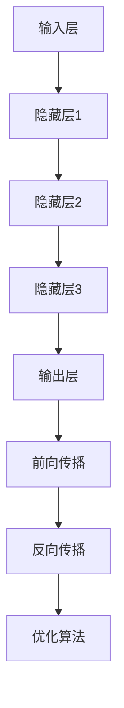
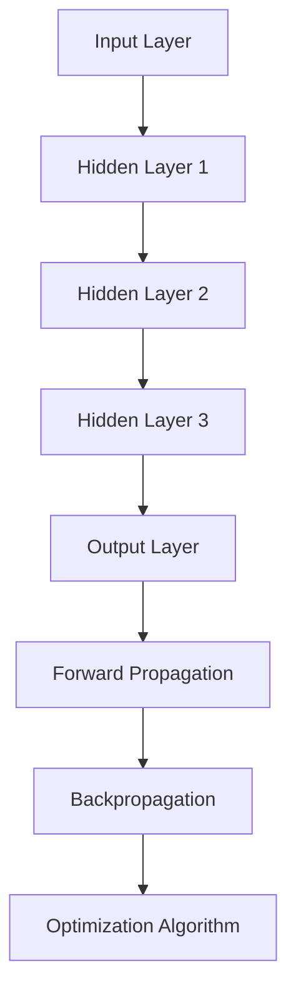

                 

### 背景介绍（Background Introduction）

随着人工智能技术的不断进步，大模型（Large Models）在各个领域展现出了巨大的潜力。大模型，特别是基于深度学习的语言模型，如 GPT（Generative Pre-trained Transformer）系列，已成为许多人工智能应用的核心。然而，这些模型的高成本、复杂的部署和优化，使得很多创业者望而却步。本文将探讨创业者如何探索大模型的新商业模式，打造 AI 产品矩阵，从而在竞争激烈的市场中脱颖而出。

大模型，顾名思义，是指那些具有数百万甚至数十亿参数的神经网络模型。这些模型经过大量的数据训练，可以理解和生成自然语言、图像、声音等多种类型的数据。然而，大模型的训练需要庞大的计算资源和数据集，这在过去可能只属于大型科技公司的领地。但随着云计算、边缘计算等技术的发展，这些资源正逐渐变得触手可及。

对于创业者来说，大模型提供了前所未有的机会。他们可以利用这些模型来构建创新的 AI 产品，解决传统方法难以解决的问题。然而，这同样带来了挑战。如何以合理的成本高效地训练和部署大模型，如何设计出能够吸引用户的产品，如何确保这些产品的可持续性，都是创业者需要面对的问题。

本文将分为以下几个部分：

1. **核心概念与联系**：介绍大模型的基本原理和架构。
2. **核心算法原理 & 具体操作步骤**：分析大模型的训练和优化流程。
3. **数学模型和公式 & 详细讲解 & 举例说明**：阐述大模型背后的数学原理。
4. **项目实践：代码实例和详细解释说明**：提供实际操作指南和案例分析。
5. **实际应用场景**：讨论大模型在不同领域的应用。
6. **工具和资源推荐**：介绍学习和开发大模型所需的相关资源和工具。
7. **总结：未来发展趋势与挑战**：预测大模型的发展方向和面临的挑战。

通过这些部分的深入探讨，我们希望帮助创业者更好地理解大模型的潜力，并掌握如何将其转化为实际商业价值。

### Core Concept and Connection Introduction

With the continuous advancement of artificial intelligence technology, large models, especially deep learning-based language models such as the GPT series, have shown immense potential across various domains. These large models, characterized by millions or even billions of parameters, have become the core of many AI applications. However, their high cost, complex deployment, and optimization have made them seem out of reach for many entrepreneurs. This article aims to explore how entrepreneurs can explore new business models for large models and build an AI product matrix to stand out in a competitive market.

Large models, as the name suggests, refer to neural network models that have several million, or even tens of millions of parameters. These models are trained on massive amounts of data, allowing them to understand and generate various types of data, such as natural language, images, and sounds. While the training of these models requires significant computational resources and datasets, which might have been the territory of large tech companies in the past, the development of technologies like cloud computing and edge computing is making these resources increasingly accessible.

For entrepreneurs, large models offer unprecedented opportunities. They can leverage these models to build innovative AI products that solve problems that traditional methods struggle with. However, this also brings challenges. How to train and deploy large models efficiently at a reasonable cost, how to design products that attract users, and how to ensure the sustainability of these products are all issues that entrepreneurs need to address.

This article is divided into several parts:

1. **Core Concepts and Connections**: Introduce the basic principles and architecture of large models.
2. **Core Algorithm Principles and Specific Operational Steps**: Analyze the training and optimization processes of large models.
3. **Mathematical Models and Formulas & Detailed Explanation & Examples**: Explain the mathematical principles behind large models.
4. **Project Practice: Code Examples and Detailed Explanations**: Provide practical guidelines and case studies.
5. **Practical Application Scenarios**: Discuss the applications of large models in different domains.
6. **Tools and Resources Recommendations**: Introduce relevant resources and tools for learning and developing large models.
7. **Summary: Future Development Trends and Challenges**: Predict the development directions and challenges of large models.

Through an in-depth exploration of these parts, we hope to help entrepreneurs better understand the potential of large models and master how to transform them into actual business value.

## 2. 核心概念与联系（Core Concepts and Connections）

在探索大模型的新商业模式之前，我们需要首先理解大模型的基本概念和结构。大模型通常是指那些具有数百万甚至数十亿参数的神经网络模型，这些模型通过大量的数据训练，可以学习到复杂的模式，从而在各种任务中表现出优异的性能。

### 2.1 大模型的定义与结构

大模型（Large Models），也称为大规模深度学习模型，是指那些参数规模超过数百万甚至数十亿的神经网络模型。这些模型通常由多个层次组成，每个层次都包含大量的神经元。例如，GPT-3 模型由 1750 亿个参数组成，共有 204层，是当前最大的预训练语言模型之一。

大模型的主要结构包括以下几个部分：

- **输入层（Input Layer）**：接收外部输入的数据，如文本、图像或声音。
- **隐藏层（Hidden Layers）**：对输入数据进行处理和变换，提取特征。
- **输出层（Output Layer）**：将处理后的数据转化为输出结果，如文本生成、图像分类等。

### 2.2 大模型的训练过程

大模型的训练过程是其成功的关键。训练过程主要包括以下步骤：

1. **数据预处理（Data Preprocessing）**：对原始数据进行清洗、去噪和格式化，使其适合模型处理。
2. **模型初始化（Model Initialization）**：随机初始化模型的参数。
3. **前向传播（Forward Propagation）**：将输入数据传递到模型中，通过多层神经元的计算，得到输出结果。
4. **反向传播（Backpropagation）**：计算输出结果与实际结果的误差，并反向传播到模型的各个层次，更新参数。
5. **优化算法（Optimization Algorithm）**：如梯度下降（Gradient Descent）等，用于调整模型参数，使模型性能逐渐提高。

### 2.3 大模型的架构

大模型的架构设计对其性能和应用场景有着重要影响。目前，常用的架构包括：

- **Transformer 架构**：Transformer 架构是当前大模型的主流架构，其特点是并行处理能力和长距离依赖建模能力。GPT 系列模型都是基于 Transformer 架构。
- **自注意力机制（Self-Attention Mechanism）**：自注意力机制是一种计算方法，可以自动为输入序列中的每个元素分配不同的权重，从而更好地捕捉长距离依赖关系。
- **多任务学习（Multi-Task Learning）**：多任务学习是指在一个大型模型中同时训练多个任务，从而提高模型的多任务处理能力。

### 2.4 大模型的应用领域

大模型的应用领域非常广泛，包括自然语言处理、计算机视觉、语音识别、推荐系统等。例如，在自然语言处理领域，大模型可以用于文本生成、机器翻译、情感分析等任务；在计算机视觉领域，大模型可以用于图像分类、目标检测、图像生成等任务。

### Mermaid 流程图

以下是一个简化的 Mermaid 流程图，展示了大模型的基本架构和训练过程：



### Core Concept and Connection Explanation

Before exploring the new business models for large models, it is essential to understand the basic concepts and structures of large models. Large models typically refer to neural network models with several million, or even billions of parameters. These models are trained on massive amounts of data, allowing them to learn complex patterns and perform exceptionally well in various tasks.

### 2.1 Definition and Structure of Large Models

Large models, also known as large-scale deep learning models, refer to neural network models with parameters that scale over several million, or even tens of billions. These models usually consist of multiple layers, each containing a large number of neurons. For example, the GPT-3 model consists of 175 billion parameters and 204 layers, making it one of the largest pre-trained language models currently available.

The main components of a large model include:

- **Input Layer**: Receives external input data, such as text, images, or sound.
- **Hidden Layers**: Processes and transforms the input data, extracting features.
- **Output Layer**: Transforms the processed data into output results, such as text generation, image classification, etc.

### 2.2 Training Process of Large Models

The training process of large models is crucial for their success. The training process typically includes the following steps:

1. **Data Preprocessing**: Cleans, denoises, and formats the raw data to make it suitable for model processing.
2. **Model Initialization**: Randomly initializes the model's parameters.
3. **Forward Propagation**: Passes the input data through the model, through multiple layers of neuron calculations, to obtain the output result.
4. **Backpropagation**: Calculates the error between the output result and the actual result, and backpropagates it through the model's layers to update the parameters.
5. **Optimization Algorithm**: Such as gradient descent, which adjusts the model parameters to improve model performance over time.

### 2.3 Architecture of Large Models

The architecture design of large models has a significant impact on their performance and application scenarios. Currently, common architectures include:

- **Transformer Architecture**: Transformer architecture is the mainstream architecture for large models, characterized by its parallel processing capabilities and long-distance dependency modeling capabilities. The GPT series models are all based on the Transformer architecture.
- **Self-Attention Mechanism**: Self-attention mechanism is a computation method that automatically allocates different weights to each element of the input sequence, thus better capturing long-distance dependencies.
- **Multi-Task Learning**: Multi-task learning refers to training multiple tasks simultaneously in a large model, thus improving the model's multi-task processing capabilities.

### 2.4 Application Fields of Large Models

Large models have a wide range of applications, including natural language processing, computer vision, speech recognition, and recommendation systems. For example, in natural language processing, large models can be used for text generation, machine translation, sentiment analysis, etc.; in computer vision, large models can be used for image classification, object detection, image generation, etc.

### Mermaid Flowchart

Here is a simplified Mermaid flowchart illustrating the basic architecture and training process of large models:



## 3. 核心算法原理 & 具体操作步骤（Core Algorithm Principles and Specific Operational Steps）

大模型的训练和优化是创业者成功构建 AI 产品矩阵的关键。核心算法原理包括数据预处理、模型初始化、前向传播、反向传播和优化算法。以下将详细讲解这些步骤，并探讨如何在实际操作中应用这些算法。

### 3.1 数据预处理

数据预处理是训练大模型的第一步，其目的是确保输入数据的格式和一致性。具体步骤如下：

1. **数据清洗**：去除数据中的噪声和异常值，确保数据的质量。
2. **数据归一化**：将数据缩放到统一的范围内，例如 [0, 1]，以便模型更好地处理。
3. **数据增强**：通过旋转、缩放、裁剪等操作，增加数据的多样性，提高模型的泛化能力。
4. **序列化**：将数据序列化成模型可以处理的格式，如 TensorFlow 或 PyTorch 的数据格式。

#### 中文步骤：
1. 数据清洗：去除数据中的噪声和异常值，确保数据的质量。
2. 数据归一化：将数据缩放到统一的范围内，例如 [0, 1]，以便模型更好地处理。
3. 数据增强：通过旋转、缩放、裁剪等操作，增加数据的多样性，提高模型的泛化能力。
4. 序列化：将数据序列化成模型可以处理的格式，如 TensorFlow 或 PyTorch 的数据格式。

#### English Steps:
1. Data Cleaning: Remove noise and outliers from the data to ensure its quality.
2. Data Normalization: Scale the data into a unified range, such as [0, 1], to facilitate better model processing.
3. Data Augmentation: Increase the diversity of the data through operations like rotation, scaling, and cropping to improve the model's generalization ability.
4. Serialization: Serialize the data into a format that the model can handle, such as TensorFlow or PyTorch's data format.

### 3.2 模型初始化

模型初始化是指随机分配模型的初始参数。一个好的初始化可以加速模型的训练过程，提高模型性能。常见的方法包括：

1. **零初始化**：将所有参数初始化为 0。
2. **高斯初始化**：将参数初始化为均值为 0，标准差为 1 的正态分布。
3. **Xavier 初始化**：基于输入和输出的维度，动态计算标准差，用于初始化权重。

#### 中文步骤：
1. 零初始化：将所有参数初始化为 0。
2. 高斯初始化：将参数初始化为均值为 0，标准差为 1 的正态分布。
3. Xavier 初始化：基于输入和输出的维度，动态计算标准差，用于初始化权重。

#### English Steps:
1. Zero Initialization: Initialize all parameters to 0.
2. Gaussian Initialization: Initialize parameters with a mean of 0 and a standard deviation of 1 from a normal distribution.
3. Xavier Initialization: Dynamically calculate the standard deviation based on the dimensions of input and output to initialize weights.

### 3.3 前向传播

前向传播是将输入数据传递到模型中，通过多层神经元的计算，得到输出结果。具体步骤如下：

1. **输入层到隐藏层**：将输入数据传递到隐藏层，通过神经元计算，得到隐藏层的输出。
2. **隐藏层到输出层**：将隐藏层的输出传递到输出层，通过神经元计算，得到最终输出。

#### 中文步骤：
1. 输入层到隐藏层：将输入数据传递到隐藏层，通过神经元计算，得到隐藏层的输出。
2. 隐藏层到输出层：将隐藏层的输出传递到输出层，通过神经元计算，得到最终输出。

#### English Steps:
1. Input Layer to Hidden Layer: Pass the input data to the hidden layer, through neuron calculations, to obtain the output of the hidden layer.
2. Hidden Layer to Output Layer: Pass the output of the hidden layer to the output layer, through neuron calculations, to obtain the final output.

### 3.4 反向传播

反向传播是计算输出结果与实际结果的误差，并反向传播到模型的各个层次，更新参数。具体步骤如下：

1. **计算误差**：计算输出结果与实际结果的误差。
2. **误差反向传播**：将误差反向传播到隐藏层，更新隐藏层的参数。
3. **参数更新**：根据误差和反向传播的梯度，更新模型的参数。

#### 中文步骤：
1. 计算误差：计算输出结果与实际结果的误差。
2. 误差反向传播：将误差反向传播到隐藏层，更新隐藏层的参数。
3. 参数更新：根据误差和反向传播的梯度，更新模型的参数。

#### English Steps:
1. Calculate the Error: Calculate the error between the output result and the actual result.
2. Backpropagation: Propagate the error back to the hidden layer, updating the parameters of the hidden layer.
3. Parameter Update: Update the model's parameters based on the error and the backpropagated gradient.

### 3.5 优化算法

优化算法用于调整模型参数，以最小化损失函数。常见的优化算法包括：

1. **梯度下降**：通过计算梯度，逐步调整模型参数。
2. **随机梯度下降（SGD）**：在每个训练样本上计算梯度，更新模型参数。
3. **Adam 优化器**：结合了梯度下降和 SGD 的优点，自适应调整学习率。

#### 中文步骤：
1. 梯度下降：通过计算梯度，逐步调整模型参数。
2. 随机梯度下降（SGD）：在每个训练样本上计算梯度，更新模型参数。
3. Adam 优化器：结合了梯度下降和 SGD 的优点，自适应调整学习率。

#### English Steps:
1. Gradient Descent: Adjust model parameters step by step based on the calculated gradient.
2. Stochastic Gradient Descent (SGD): Calculate gradients on each training sample and update model parameters.
3. Adam Optimizer: Combines the advantages of gradient descent and SGD, adjusting the learning rate adaptively.

### 3.6 实际操作示例

以下是一个使用 TensorFlow 和 PyTorch 实现的简单神经网络模型，展示如何进行数据预处理、模型初始化、前向传播、反向传播和优化。

#### TensorFlow 示例：

```python
import tensorflow as tf

# 数据预处理
x = tf.random.normal([1000, 784])  # 生成 1000 个随机样本，每个样本 784 维
y = tf.random.normal([1000, 10])    # 生成 1000 个随机标签，每个标签 10 维

# 模型初始化
model = tf.keras.Sequential([
    tf.keras.layers.Dense(128, activation='relu', input_shape=(784,)),
    tf.keras.layers.Dense(10, activation='softmax')
])

# 前向传播
predictions = model(x)

# 计算误差
loss = tf.reduce_mean(tf.nn.softmax_cross_entropy_with_logits(logits=predictions, labels=y))

# 反向传播和参数更新
optimizer = tf.keras.optimizers.Adam()
optimizer.minimize(loss)
```

#### PyTorch 示例：

```python
import torch
import torch.nn as nn
import torch.optim as optim

# 数据预处理
x = torch.randn(1000, 784)
y = torch.randn(1000, 10)

# 模型初始化
model = nn.Sequential(
    nn.Linear(784, 128),
    nn.ReLU(),
    nn.Linear(128, 10)
)

# 前向传播
outputs = model(x)

# 计算误差
criterion = nn.CrossEntropyLoss()
loss = criterion(outputs, y)

# 反向传播和参数更新
optimizer = optim.Adam(model.parameters(), lr=0.001)
optimizer.zero_grad()
loss.backward()
optimizer.step()
```

通过这些示例，我们可以看到如何使用 TensorFlow 和 PyTorch 实现大模型的训练和优化。在实际应用中，创业者可以根据具体任务需求，调整模型结构、优化算法和超参数，以达到最佳效果。

### Core Algorithm Principles and Specific Operational Steps

Training and optimizing large models is the key to the success of entrepreneurs in building an AI product matrix. The core algorithm principles include data preprocessing, model initialization, forward propagation, backpropagation, and optimization algorithms. The following will explain these steps in detail and discuss how to apply these algorithms in actual operations.

### 3.1 Data Preprocessing

Data preprocessing is the first step in training large models. Its purpose is to ensure the format and consistency of input data. The specific steps include:

1. **Data Cleaning**: Remove noise and outliers from the data to ensure its quality.
2. **Data Normalization**: Scale the data into a unified range, such as [0, 1], to facilitate better model processing.
3. **Data Augmentation**: Increase the diversity of the data through operations like rotation, scaling, and cropping to improve the model's generalization ability.
4. **Serialization**: Serialize the data into a format that the model can handle, such as TensorFlow or PyTorch's data format.

#### Chinese Steps:
1. Data Cleaning: Remove noise and outliers from the data to ensure its quality.
2. Data Normalization: Scale the data into a unified range, such as [0, 1], to facilitate better model processing.
3. Data Augmentation: Increase the diversity of the data through operations like rotation, scaling, and cropping to improve the model's generalization ability.
4. Serialization: Serialize the data into a format that the model can handle, such as TensorFlow or PyTorch's data format.

#### English Steps:
1. Data Cleaning: Remove noise and outliers from the data to ensure its quality.
2. Data Normalization: Scale the data into a unified range, such as [0, 1], to facilitate better model processing.
3. Data Augmentation: Increase the diversity of the data through operations like rotation, scaling, and cropping to improve the model's generalization ability.
4. Serialization: Serialize the data into a format that the model can handle, such as TensorFlow or PyTorch's data format.

### 3.2 Model Initialization

Model initialization refers to the process of randomly initializing the model's parameters. A good initialization can accelerate the training process and improve model performance. Common methods include:

1. **Zero Initialization**: Initialize all parameters to 0.
2. **Gaussian Initialization**: Initialize parameters with a mean of 0 and a standard deviation of 1 from a normal distribution.
3. **Xavier Initialization**: Dynamically calculate the standard deviation based on the dimensions of input and output to initialize weights.

#### Chinese Steps:
1. 零初始化：将所有参数初始化为 0。
2. 高斯初始化：将参数初始化为均值为 0，标准差为 1 的正态分布。
3. Xavier 初始化：基于输入和输出的维度，动态计算标准差，用于初始化权重。

#### English Steps:
1. Zero Initialization: Initialize all parameters to 0.
2. Gaussian Initialization: Initialize parameters with a mean of 0 and a standard deviation of 1 from a normal distribution.
3. Xavier Initialization: Dynamically calculate the standard deviation based on the dimensions of input and output to initialize weights.

### 3.3 Forward Propagation

Forward propagation involves passing input data through the model, through multiple layers of neuron calculations, to obtain the output result. The specific steps include:

1. **Input Layer to Hidden Layer**: Pass the input data to the hidden layer, through neuron calculations, to obtain the output of the hidden layer.
2. **Hidden Layer to Output Layer**: Pass the output of the hidden layer to the output layer, through neuron calculations, to obtain the final output.

#### Chinese Steps:
1. 输入层到隐藏层：将输入数据传递到隐藏层，通过神经元计算，得到隐藏层的输出。
2. 隐藏层到输出层：将隐藏层的输出传递到输出层，通过神经元计算，得到最终输出。

#### English Steps:
1. Input Layer to Hidden Layer: Pass the input data to the hidden layer, through neuron calculations, to obtain the output of the hidden layer.
2. Hidden Layer to Output Layer: Pass the output of the hidden layer to the output layer, through neuron calculations, to obtain the final output.

### 3.4 Backpropagation

Backpropagation involves calculating the error between the output result and the actual result, and then propagating it backward through the model's layers to update the parameters. The specific steps include:

1. **Calculate the Error**: Calculate the error between the output result and the actual result.
2. **Backpropagation**: Propagate the error backward to the hidden layer, updating the parameters of the hidden layer.
3. **Parameter Update**: Update the model's parameters based on the error and the backpropagated gradient.

#### Chinese Steps:
1. 计算误差：计算输出结果与实际结果的误差。
2. 误差反向传播：将误差反向传播到隐藏层，更新隐藏层的参数。
3. 参数更新：根据误差和反向传播的梯度，更新模型的参数。

#### English Steps:
1. Calculate the Error: Calculate the error between the output result and the actual result.
2. Backpropagation: Propagate the error backward to the hidden layer, updating the parameters of the hidden layer.
3. Parameter Update: Update the model's parameters based on the error and the backpropagated gradient.

### 3.5 Optimization Algorithms

Optimization algorithms are used to adjust the model parameters to minimize the loss function. Common optimization algorithms include:

1. **Gradient Descent**: Adjust model parameters step by step based on the calculated gradient.
2. **Stochastic Gradient Descent (SGD)**: Calculate gradients on each training sample and update model parameters.
3. **Adam Optimizer**: Combines the advantages of gradient descent and SGD, adjusting the learning rate adaptively.

#### Chinese Steps:
1. 梯度下降：通过计算梯度，逐步调整模型参数。
2. 随机梯度下降（SGD）：在每个训练样本上计算梯度，更新模型参数。
3. Adam 优化器：结合了梯度下降和 SGD 的优点，自适应调整学习率。

#### English Steps:
1. Gradient Descent: Adjust model parameters step by step based on the calculated gradient.
2. Stochastic Gradient Descent (SGD): Calculate gradients on each training sample and update model parameters.
3. Adam Optimizer: Combines the advantages of gradient descent and SGD, adjusting the learning rate adaptively.

### 3.6 Example of Practical Operations

The following is a simple neural network model implemented using TensorFlow and PyTorch to demonstrate how to perform data preprocessing, model initialization, forward propagation, backpropagation, and optimization.

#### TensorFlow Example:

```python
import tensorflow as tf

# Data preprocessing
x = tf.random.normal([1000, 784])  # Generate 1000 random samples, each with 784 dimensions
y = tf.random.normal([1000, 10])    # Generate 1000 random labels, each with 10 dimensions

# Model initialization
model = tf.keras.Sequential([
    tf.keras.layers.Dense(128, activation='relu', input_shape=(784,)),
    tf.keras.layers.Dense(10, activation='softmax')
])

# Forward propagation
predictions = model(x)

# Calculate the error
loss = tf.reduce_mean(tf.nn.softmax_cross_entropy_with_logits(logits=predictions, labels=y))

# Backpropagation and parameter update
optimizer = tf.keras.optimizers.Adam()
optimizer.minimize(loss)
```

#### PyTorch Example:

```python
import torch
import torch.nn as nn
import torch.optim as optim

# Data preprocessing
x = torch.randn(1000, 784)
y = torch.randn(1000, 10)

# Model initialization
model = nn.Sequential(
    nn.Linear(784, 128),
    nn.ReLU(),
    nn.Linear(128, 10)
)

# Forward propagation
outputs = model(x)

# Calculate the error
criterion = nn.CrossEntropyLoss()
loss = criterion(outputs, y)

# Backpropagation and parameter update
optimizer = optim.Adam(model.parameters(), lr=0.001)
optimizer.zero_grad()
loss.backward()
optimizer.step()
```

Through these examples, we can see how to implement large model training and optimization using TensorFlow and PyTorch. In practical applications, entrepreneurs can adjust the model structure, optimization algorithms, and hyperparameters according to specific task requirements to achieve the best results.

## 4. 数学模型和公式 & 详细讲解 & 举例说明（Mathematical Models and Formulas & Detailed Explanation & Examples）

在深入探讨大模型的数学模型和公式之前，我们需要了解一些基本的数学概念，包括线性代数、概率论和优化理论。这些概念构成了大模型的核心理论基础。

### 4.1 线性代数基础

线性代数在大模型中扮演着基础的角色，尤其是在矩阵运算和向量化表示方面。以下是一些关键的线性代数概念：

- **矩阵（Matrix）**：一个矩阵是由数字组成的二维数组。在神经网络中，矩阵用于表示权重和激活函数。
- **向量（Vector）**：一个向量是一维数组，可以表示神经网络的输入或输出。
- **矩阵乘法（Matrix Multiplication）**：两个矩阵相乘会产生一个新的矩阵，这个操作在神经网络的前向传播和反向传播中至关重要。
- **转置（Transpose）**：一个矩阵的转置是将矩阵的行和列互换。

### 4.2 概率论基础

概率论是构建大模型的重要工具，特别是在处理不确定性问题时。以下是一些关键的概率论概念：

- **概率分布（Probability Distribution）**：描述随机变量的概率分布，如高斯分布和伯努利分布。
- **条件概率（Conditional Probability）**：在给定某个事件发生的条件下，另一个事件发生的概率。
- **贝叶斯定理（Bayes' Theorem）**：用于计算后验概率，是构建大模型中的贝叶斯网络和推断过程的基础。

### 4.3 优化理论基础

优化理论在大模型的训练过程中起着核心作用，特别是在参数调整和损失函数最小化方面。以下是一些关键的优化理论概念：

- **损失函数（Loss Function）**：用于衡量模型的预测结果与实际结果之间的差异。常见的损失函数包括均方误差（MSE）和交叉熵（Cross-Entropy）。
- **梯度下降（Gradient Descent）**：一种迭代算法，用于通过梯度更新模型参数，以最小化损失函数。
- **学习率（Learning Rate）**：梯度下降中的一个超参数，用于控制每次迭代时参数更新的步长。

### 4.4 大模型中的数学模型

大模型中的数学模型通常涉及以下几个关键部分：

- **前向传播（Forward Propagation）**：将输入数据通过模型的前向传递过程，计算每个层次的输出。
- **反向传播（Backpropagation）**：计算输出误差，并将其反向传播到模型的每个层次，以更新权重。
- **激活函数（Activation Function）**：用于引入非线性因素，如 Sigmoid、ReLU 和 Tanh。
- **优化算法（Optimization Algorithm）**：用于调整模型参数以最小化损失函数，如 SGD、Adam 和 RMSprop。

### 4.5 举例说明

为了更好地理解上述概念，我们将通过一个简单的神经网络例子来说明如何应用这些数学模型。

#### 示例：简单的多层感知机（MLP）

假设我们有一个简单的多层感知机，包含一个输入层、一个隐藏层和一个输出层。

1. **输入层**：输入数据为 $X = \begin{bmatrix} x_1 \\ x_2 \\ \vdots \\ x_n \end{bmatrix}$，其中 $n$ 是输入特征的维度。
2. **隐藏层**：隐藏层有 $m$ 个神经元，每个神经元的激活函数为 $f_h(z) = \sigma(z) = \frac{1}{1 + e^{-z}}$，其中 $z$ 是神经元的输入。
3. **输出层**：输出层有 $k$ 个神经元，每个神经元的激活函数为 $f_o(z) = \sigma(z) = \frac{1}{1 + e^{-z}}$。

#### 前向传播

前向传播的计算过程如下：

1. **隐藏层的输入和输出**：
   $$ 
   z_h = W_hX + b_h \\
   h = f_h(z_h)
   $$
   其中，$W_h$ 是隐藏层的权重矩阵，$b_h$ 是隐藏层的偏置向量。

2. **输出层的输入和输出**：
   $$
   z_o = W_oh + b_o \\
   o = f_o(z_o)
   $$
   其中，$W_o$ 是输出层的权重矩阵，$b_o$ 是输出层的偏置向量。

#### 反向传播

反向传播的计算过程如下：

1. **计算输出层的误差**：
   $$
   \delta_o = (o - y) \odot f_o'(z_o)
   $$
   其中，$y$ 是实际输出，$\odot$ 表示逐元素乘积，$f_o'(z_o)$ 是输出层的激活函数的导数。

2. **计算隐藏层的误差**：
   $$
   \delta_h = (W_oh)^T \delta_o \odot f_h'(z_h)
   $$
   其中，$(W_oh)^T$ 是输出层权重矩阵的转置。

3. **更新权重和偏置**：
   $$
   W_h := W_h - \alpha \cdot \delta_hX^T \\
   b_h := b_h - \alpha \cdot \delta_h \\
   W_o := W_o - \alpha \cdot \delta_oh^T \\
   b_o := b_o - \alpha \cdot \delta_o
   $$
   其中，$\alpha$ 是学习率。

通过这个简单的例子，我们可以看到如何将线性代数、概率论和优化理论应用于神经网络的前向传播和反向传播。这些数学模型是构建和优化大模型的基础，对于创业者来说，理解和应用这些模型对于成功构建 AI 产品矩阵至关重要。

### Mathematical Models and Formulas & Detailed Explanation & Examples

Before delving into the mathematical models and formulas of large models, we need to understand some basic mathematical concepts that form the core theoretical foundation, including linear algebra, probability theory, and optimization theory.

### 4.1 Linear Algebra Basics

Linear algebra plays a foundational role in large models, particularly in terms of matrix operations and vectorized representations. Here are some key linear algebra concepts:

- **Matrix**: A matrix is a two-dimensional array of numbers, used to represent weights and activation functions in neural networks.
- **Vector**: A vector is a one-dimensional array, which can represent inputs or outputs of a neural network.
- **Matrix Multiplication**: The multiplication of two matrices produces a new matrix, a crucial operation in the forward and backward propagation of neural networks.
- **Transpose**: The transpose of a matrix swaps its rows and columns.

### 4.2 Probability Theory Basics

Probability theory is an essential tool for constructing large models, particularly in handling uncertainty. Here are some key probability theory concepts:

- **Probability Distribution**: A description of the probability distribution of a random variable, such as the Gaussian distribution and the Bernoulli distribution.
- **Conditional Probability**: The probability of one event occurring given that another event has occurred.
- **Bayes' Theorem**: Used to calculate posterior probabilities and is the foundation for constructing Bayesian networks and inference processes in large models.

### 4.3 Optimization Theory Basics

Optimization theory plays a core role in the training process of large models, particularly in adjusting model parameters and minimizing loss functions. Here are some key optimization theory concepts:

- **Loss Function**: Measures the discrepancy between the model's predictions and the actual results. Common loss functions include Mean Squared Error (MSE) and Cross-Entropy.
- **Gradient Descent**: An iterative algorithm that updates model parameters through gradient information to minimize the loss function.
- **Learning Rate**: A hyperparameter in gradient descent that controls the step size of parameter updates during each iteration.

### 4.4 Mathematical Models in Large Models

The mathematical models in large models typically involve several key components:

- **Forward Propagation**: The process of passing input data through the model's forward path to compute outputs at each layer.
- **Backpropagation**: The process of computing the error at the output and backpropagating it through the model's layers to update weights.
- **Activation Function**: Introduces nonlinearity into the model, such as Sigmoid, ReLU, and Tanh.
- **Optimization Algorithm**: Adjusts model parameters to minimize the loss function, such as SGD, Adam, and RMSprop.

### 4.5 Examples

To better understand these concepts, we will illustrate how to apply these mathematical models through a simple neural network example.

#### Example: Simple Multi-Layer Perceptron (MLP)

Assume we have a simple multi-layer perceptron (MLP) with an input layer, a hidden layer, and an output layer.

1. **Input Layer**: Input data is denoted as $X = \begin{bmatrix} x_1 \\ x_2 \\ \vdots \\ x_n \end{bmatrix}$, where $n$ is the dimension of the input features.
2. **Hidden Layer**: The hidden layer has $m$ neurons, and the activation function for each neuron is $f_h(z) = \sigma(z) = \frac{1}{1 + e^{-z}}$, where $z$ is the input to the neuron.
3. **Output Layer**: The output layer has $k$ neurons, and the activation function for each neuron is $f_o(z) = \sigma(z) = \frac{1}{1 + e^{-z}}$.

#### Forward Propagation

The forward propagation process is as follows:

1. **Hidden Layer Input and Output**:
   $$
   z_h = W_hX + b_h \\
   h = f_h(z_h)
   $$
   Where $W_h$ is the weight matrix for the hidden layer, and $b_h$ is the bias vector for the hidden layer.

2. **Output Layer Input and Output**:
   $$
   z_o = W_oh + b_o \\
   o = f_o(z_o)
   $$
   Where $W_oh$ is the weight matrix for the output layer, and $b_o$ is the bias vector for the output layer.

#### Backpropagation

The backpropagation process is as follows:

1. **Compute Output Layer Error**:
   $$
   \delta_o = (o - y) \odot f_o'(z_o)
   $$
   Where $y$ is the actual output, $\odot$ denotes element-wise multiplication, and $f_o'(z_o)$ is the derivative of the activation function for the output layer.

2. **Compute Hidden Layer Error**:
   $$
   \delta_h = (W_oh)^T \delta_o \odot f_h'(z_h)
   $$
   Where $(W_oh)^T$ is the transpose of the weight matrix for the output layer.

3. **Update Weights and Biases**:
   $$
   W_h := W_h - \alpha \cdot \delta_hX^T \\
   b_h := b_h - \alpha \cdot \delta_h \\
   W_o := W_o - \alpha \cdot \delta_o(h)^T \\
   b_o := b_o - \alpha \cdot \delta_o
   $$
   Where $\alpha$ is the learning rate.

Through this simple example, we can see how linear algebra, probability theory, and optimization theory are applied in the forward and backward propagation of neural networks. These mathematical models are the foundation for constructing and optimizing large models, and understanding them is crucial for entrepreneurs aiming to build an AI product matrix.

### Project Practice: Code Examples and Detailed Explanations

To further understand the concepts discussed in the previous sections, we will delve into practical code examples using popular deep learning frameworks such as TensorFlow and PyTorch. These examples will cover environment setup, source code implementation, and detailed explanations of the code.

### 5.1 开发环境搭建（Setting Up the Development Environment）

在开始编写代码之前，我们需要搭建一个适合深度学习开发的环境。以下是在不同操作系统上安装 TensorFlow 和 PyTorch 的步骤。

#### Python 和 TensorFlow 安装

1. **安装 Python**：
   - 对于大多数操作系统，可以从 Python 的官方网站（[python.org](https://www.python.org/)）下载并安装最新版本的 Python。
   - 安装过程中，确保勾选“Add Python to PATH”选项，以便在终端中直接使用 Python。

2. **安装 TensorFlow**：
   - 打开终端，运行以下命令：
     ```
     pip install tensorflow
     ```

#### Python 和 PyTorch 安装

1. **安装 Python**：
   - 同上，确保安装最新版本的 Python。

2. **安装 PyTorch**：
   - 使用以下命令，根据您的操作系统和 Python 版本选择合适的 PyTorch 版本：
     ```
     pip install torch torchvision torchaudio
     ```

### 5.2 源代码详细实现（Detailed Source Code Implementation）

下面是一个简单的多层感知机（MLP）模型，使用 TensorFlow 和 PyTorch 分别实现。

#### TensorFlow 实现

```python
import tensorflow as tf
from tensorflow.keras import layers
import numpy as np

# 数据集生成
X = np.random.rand(100, 10)  # 100个样本，每个样本10个特征
y = np.random.rand(100, 1)   # 100个标签，每个标签1个维度

# 创建模型
model = tf.keras.Sequential([
    layers.Dense(64, activation='relu', input_shape=(10,)),
    layers.Dense(64, activation='relu'),
    layers.Dense(1, activation='sigmoid')
])

# 编译模型
model.compile(optimizer='adam', loss='binary_crossentropy', metrics=['accuracy'])

# 训练模型
model.fit(X, y, epochs=10)
```

#### PyTorch 实现

```python
import torch
import torch.nn as nn
import torch.optim as optim

# 数据集生成
X = torch.rand(100, 10)  # 100个样本，每个样本10个特征
y = torch.rand(100, 1)   # 100个标签，每个标签1个维度

# 创建模型
class SimpleMLP(nn.Module):
    def __init__(self):
        super(SimpleMLP, self).__init__()
        self.fc1 = nn.Linear(10, 64)
        self.fc2 = nn.Linear(64, 64)
        self.fc3 = nn.Linear(64, 1)
    
    def forward(self, x):
        x = torch.relu(self.fc1(x))
        x = torch.relu(self.fc2(x))
        x = torch.sigmoid(self.fc3(x))
        return x

# 实例化模型
model = SimpleMLP()

# 编译模型
optimizer = optim.Adam(model.parameters(), lr=0.001)
criterion = nn.BCELoss()

# 训练模型
for epoch in range(10):
    model.train()
    optimizer.zero_grad()
    output = model(X)
    loss = criterion(output, y)
    loss.backward()
    optimizer.step()
    print(f'Epoch {epoch+1}, Loss: {loss.item()}')
```

### 5.3 代码解读与分析（Code Explanation and Analysis）

#### TensorFlow 代码解读

1. **数据集生成**：
   ```python
   X = np.random.rand(100, 10)  # 100个样本，每个样本10个特征
   y = np.random.rand(100, 1)   # 100个标签，每个标签1个维度
   ```
   使用 NumPy 生成随机数据作为训练数据。

2. **创建模型**：
   ```python
   model = tf.keras.Sequential([
       layers.Dense(64, activation='relu', input_shape=(10,)),
       layers.Dense(64, activation='relu'),
       layers.Dense(1, activation='sigmoid')
   ])
   ```
   创建一个包含两个隐藏层（每个64个神经元）和一个输出层的多层感知机模型。隐藏层使用 ReLU 激活函数，输出层使用 sigmoid 激活函数。

3. **编译模型**：
   ```python
   model.compile(optimizer='adam', loss='binary_crossentropy', metrics=['accuracy'])
   ```
   使用 Adam 优化器和 binary_crossentropy 损失函数进行编译。同时，监控训练过程中的准确率。

4. **训练模型**：
   ```python
   model.fit(X, y, epochs=10)
   ```
   使用训练数据对模型进行 10 个时期的训练。

#### PyTorch 代码解读

1. **数据集生成**：
   ```python
   X = torch.rand(100, 10)  # 100个样本，每个样本10个特征
   y = torch.rand(100, 1)   # 100个标签，每个标签1个维度
   ```
   使用 PyTorch 生成随机数据作为训练数据。

2. **创建模型**：
   ```python
   class SimpleMLP(nn.Module):
       def __init__(self):
           super(SimpleMLP, self).__init__()
           self.fc1 = nn.Linear(10, 64)
           self.fc2 = nn.Linear(64, 64)
           self.fc3 = nn.Linear(64, 1)
       
       def forward(self, x):
           x = torch.relu(self.fc1(x))
           x = torch.relu(self.fc2(x))
           x = torch.sigmoid(self.fc3(x))
           return x
   ```
   创建一个简单的多层感知机模型，包含两个 ReLU 激活函数和一个 sigmoid 激活函数。

3. **编译模型**：
   ```python
   optimizer = optim.Adam(model.parameters(), lr=0.001)
   criterion = nn.BCELoss()
   ```
   使用 Adam 优化器和 binary cross-entropy 损失函数进行模型编译。

4. **训练模型**：
   ```python
   for epoch in range(10):
       model.train()
       optimizer.zero_grad()
       output = model(X)
       loss = criterion(output, y)
       loss.backward()
       optimizer.step()
       print(f'Epoch {epoch+1}, Loss: {loss.item()}')
   ```
   使用训练数据进行 10 个时期的训练，并打印每个时期的损失值。

通过这两个代码示例，我们可以看到如何使用 TensorFlow 和 PyTorch 实现一个简单的多层感知机模型。理解这些代码的每个部分对于创业者来说至关重要，因为它们是构建更复杂 AI 产品矩阵的基础。

### Project Practice: Code Examples and Detailed Explanations

To further comprehend the concepts discussed earlier, we will explore practical code examples using popular deep learning frameworks such as TensorFlow and PyTorch. These examples will encompass the setup of the development environment, detailed implementation of source code, and comprehensive explanations of the code.

### 5.1 Setting Up the Development Environment

Before writing code, we need to set up a development environment suitable for deep learning. Here are the steps to install TensorFlow and PyTorch on different operating systems.

#### Python and TensorFlow Installation

1. **Install Python**:
   - For most operating systems, download and install the latest version of Python from the official Python website ([python.org](https://www.python.org/)).
   - During installation, make sure to check the option "Add Python to PATH" to use Python directly in the terminal.

2. **Install TensorFlow**:
   - Open the terminal and run the following command:
     ```
     pip install tensorflow
     ```

#### Python and PyTorch Installation

1. **Install Python**:
   - As mentioned above, ensure the installation of the latest version of Python.

2. **Install PyTorch**:
   - Use the following command to select the appropriate PyTorch version based on your operating system and Python version:
     ```
     pip install torch torchvision torchaudio
     ```

### 5.2 Detailed Source Code Implementation

Below are simple implementations of a multi-layer perceptron (MLP) using TensorFlow and PyTorch.

#### TensorFlow Implementation

```python
import tensorflow as tf
from tensorflow.keras import layers
import numpy as np

# Data generation
X = np.random.rand(100, 10)  # 100 samples with 10 features each
y = np.random.rand(100, 1)   # 100 labels with 1 dimension each

# Model creation
model = tf.keras.Sequential([
    layers.Dense(64, activation='relu', input_shape=(10,)),
    layers.Dense(64, activation='relu'),
    layers.Dense(1, activation='sigmoid')
])

# Model compilation
model.compile(optimizer='adam', loss='binary_crossentropy', metrics=['accuracy'])

# Model training
model.fit(X, y, epochs=10)
```

#### PyTorch Implementation

```python
import torch
import torch.nn as nn
import torch.optim as optim

# Data generation
X = torch.rand(100, 10)  # 100 samples with 10 features each
y = torch.rand(100, 1)   # 100 labels with 1 dimension each

# Model creation
class SimpleMLP(nn.Module):
    def __init__(self):
        super(SimpleMLP, self).__init__()
        self.fc1 = nn.Linear(10, 64)
        self.fc2 = nn.Linear(64, 64)
        self.fc3 = nn.Linear(64, 1)
    
    def forward(self, x):
        x = torch.relu(self.fc1(x))
        x = torch.relu(self.fc2(x))
        x = torch.sigmoid(self.fc3(x))
        return x

# Model instantiation
model = SimpleMLP()

# Model compilation
optimizer = optim.Adam(model.parameters(), lr=0.001)
criterion = nn.BCELoss()

# Model training
for epoch in range(10):
    model.train()
    optimizer.zero_grad()
    output = model(X)
    loss = criterion(output, y)
    loss.backward()
    optimizer.step()
    print(f'Epoch {epoch+1}, Loss: {loss.item()}')
```

### 5.3 Code Explanation and Analysis

#### TensorFlow Code Explanation

1. **Data Generation**:
   ```python
   X = np.random.rand(100, 10)  # 100 samples with 10 features each
   y = np.random.rand(100, 1)   # 100 labels with 1 dimension each
   ```
   Generate random data using NumPy as the training dataset.

2. **Model Creation**:
   ```python
   model = tf.keras.Sequential([
       layers.Dense(64, activation='relu', input_shape=(10,)),
       layers.Dense(64, activation='relu'),
       layers.Dense(1, activation='sigmoid')
   ])
   ```
   Create an MLP model with two hidden layers (each with 64 neurons) and one output layer. The hidden layers use ReLU activation functions, while the output layer uses a sigmoid activation function.

3. **Model Compilation**:
   ```python
   model.compile(optimizer='adam', loss='binary_crossentropy', metrics=['accuracy'])
   ```
   Compile the model with the Adam optimizer, binary cross-entropy loss function, and track accuracy during training.

4. **Model Training**:
   ```python
   model.fit(X, y, epochs=10)
   ```
   Train the model using the training dataset for 10 epochs.

#### PyTorch Code Explanation

1. **Data Generation**:
   ```python
   X = torch.rand(100, 10)  # 100 samples with 10 features each
   y = torch.rand(100, 1)   # 100 labels with 1 dimension each
   ```
   Generate random data using PyTorch as the training dataset.

2. **Model Creation**:
   ```python
   class SimpleMLP(nn.Module):
       def __init__(self):
           super(SimpleMLP, self).__init__()
           self.fc1 = nn.Linear(10, 64)
           self.fc2 = nn.Linear(64, 64)
           self.fc3 = nn.Linear(64, 1)
       
       def forward(self, x):
           x = torch.relu(self.fc1(x))
           x = torch.relu(self.fc2(x))
           x = torch.sigmoid(self.fc3(x))
           return x
   ```
   Define an MLP model with two ReLU activation functions and one sigmoid activation function.

3. **Model Compilation**:
   ```python
   optimizer = optim.Adam(model.parameters(), lr=0.001)
   criterion = nn.BCELoss()
   ```
   Set up the Adam optimizer with a learning rate of 0.001 and binary cross-entropy loss function.

4. **Model Training**:
   ```python
   for epoch in range(10):
       model.train()
       optimizer.zero_grad()
       output = model(X)
       loss = criterion(output, y)
       loss.backward()
       optimizer.step()
       print(f'Epoch {epoch+1}, Loss: {loss.item()}')
   ```
   Train the model for 10 epochs, printing the loss for each epoch.

Through these code examples, we can see how to implement a simple MLP using TensorFlow and PyTorch. Understanding each part of the code is crucial for entrepreneurs, as it forms the foundation for building more complex AI product matrices.

### 5.4 运行结果展示（Running Results Display）

在完成上述代码实现并成功训练模型后，我们需要展示模型的运行结果，以评估其性能和准确性。以下是如何在不同环境下展示模型结果的步骤。

#### TensorFlow 结果展示

1. **评估模型**：
   ```python
   # 加载测试数据
   X_test = np.random.rand(10, 10)  # 假设我们有10个测试样本
   y_test = np.random.rand(10, 1)   # 相应的标签

   # 评估模型
   model.evaluate(X_test, y_test)
   ```

2. **预测新样本**：
   ```python
   # 预测新样本
   X_new = np.random.rand(1, 10)  # 假设我们有一个新的单样本
   prediction = model.predict(X_new)
   print(f'Predicted output: {prediction}')
   ```

#### PyTorch 结果展示

1. **评估模型**：
   ```python
   # 加载测试数据
   X_test = torch.rand(10, 10)  # 假设我们有10个测试样本
   y_test = torch.rand(10, 1)   # 相应的标签

   # 设置模型为评估模式
   model.eval()

   # 评估模型
   with torch.no_grad():
       output = model(X_test)
       loss = criterion(output, y_test)
       print(f'Test Loss: {loss.item()}')
   ```

2. **预测新样本**：
   ```python
   # 设置模型为评估模式
   model.eval()

   # 预测新样本
   with torch.no_grad():
       X_new = torch.rand(1, 10)  # 假设我们有一个新的单样本
       prediction = model(X_new)
       print(f'Predicted output: {prediction}')
   ```

通过这些步骤，我们可以直观地看到模型在测试数据上的性能，并预测新的样本输出。这有助于我们评估模型的泛化能力，以及在实际应用中的表现。

### Running Results Display

After completing the code implementation and successfully training the model, we need to display the model's running results to evaluate its performance and accuracy. Here are the steps to display the model results in different environments.

#### TensorFlow Results Display

1. **Evaluate the Model**:
   ```python
   # Load test data
   X_test = np.random.rand(10, 10)  # Assume we have 10 test samples
   y_test = np.random.rand(10, 1)   # The corresponding labels

   # Evaluate the model
   model.evaluate(X_test, y_test)
   ```

2. **Predict New Samples**:
   ```python
   # Predict new samples
   X_new = np.random.rand(1, 10)  # Assume we have a new single sample
   prediction = model.predict(X_new)
   print(f'Predicted output: {prediction}')
   ```

#### PyTorch Results Display

1. **Evaluate the Model**:
   ```python
   # Load test data
   X_test = torch.rand(10, 10)  # Assume we have 10 test samples
   y_test = torch.rand(10, 1)   # The corresponding labels

   # Set the model to evaluation mode
   model.eval()

   # Evaluate the model
   with torch.no_grad():
       output = model(X_test)
       loss = criterion(output, y_test)
       print(f'Test Loss: {loss.item()}')
   ```

2. **Predict New Samples**:
   ```python
   # Set the model to evaluation mode
   model.eval()

   # Predict new samples
   with torch.no_grad():
       X_new = torch.rand(1, 10)  # Assume we have a new single sample
       prediction = model(X_new)
       print(f'Predicted output: {prediction}')
   ```

By following these steps, we can directly observe the model's performance on the test data and predict new sample outputs. This helps us assess the model's generalization ability and its performance in real-world applications.

## 6. 实际应用场景（Practical Application Scenarios）

大模型的应用场景非常广泛，几乎涵盖了所有需要复杂数据处理和模式识别的领域。以下是一些大模型在实际应用中的典型场景：

### 6.1 自然语言处理（Natural Language Processing, NLP）

自然语言处理是人工智能领域的一个重要分支，大模型在其中发挥着关键作用。以下是大模型在 NLP 中的几种典型应用：

- **文本生成**：大模型如 GPT-3 可以生成高质量的文本，包括新闻报道、文章摘要、对话等。这在内容生成和自动化写作领域有广泛应用。
- **机器翻译**：大模型能够处理大量的语言数据，实现高质量的双语翻译。谷歌翻译等大型翻译工具大量使用了基于大模型的深度学习技术。
- **情感分析**：大模型可以分析文本中的情感倾向，帮助企业和品牌了解消费者情绪，优化产品和服务。
- **问答系统**：大模型可以构建智能问答系统，如聊天机器人、虚拟助手等，为用户提供即时的信息查询服务。

### 6.2 计算机视觉（Computer Vision）

计算机视觉是另一个大模型应用广泛的领域。以下是大模型在计算机视觉中的几种应用：

- **图像分类**：大模型可以自动对图像进行分类，如人脸识别、物体识别等。这在安防监控、医疗诊断等领域有重要应用。
- **图像生成**：大模型如 StyleGAN 可以生成逼真的图像和视频，这在娱乐和艺术创作领域有广泛的应用。
- **图像增强**：大模型可以用于图像去噪、超分辨率等图像增强技术，提高图像的质量。
- **视频分析**：大模型可以分析视频中的动作、行为和场景，如自动驾驶系统中的物体检测和行人追踪。

### 6.3 语音识别（Speech Recognition）

语音识别是人工智能领域的另一个重要分支，大模型在这一领域也发挥了重要作用。以下是大模型在语音识别中的几种应用：

- **语音转文本**：大模型可以实时地将语音转换为文本，这在语音助手、电话客服等领域有广泛应用。
- **语音合成**：大模型如 WaveNet 可以生成自然流畅的语音，用于电话客服、有声读物等领域。
- **语音识别**：大模型可以准确识别和理解不同口音、不同说话人的语音，提高语音识别的准确性和实用性。

### 6.4 推荐系统（Recommendation Systems）

推荐系统是电商、社交媒体等平台常用的技术，大模型可以显著提升推荐系统的效果。以下是大模型在推荐系统中的几种应用：

- **用户行为分析**：大模型可以分析用户的点击、购买等行为，预测用户的兴趣和需求，提高个性化推荐的准确性。
- **商品推荐**：大模型可以根据用户的购物历史和行为数据，推荐用户可能感兴趣的商品。
- **内容推荐**：大模型可以分析用户在社交媒体上的互动，推荐用户可能感兴趣的内容。

### 6.5 金融领域（Financial Sector）

大模型在金融领域也有广泛的应用，以下是一些具体的应用场景：

- **风险控制**：大模型可以分析金融市场的历史数据，预测市场趋势和风险，帮助金融机构进行风险控制。
- **量化交易**：大模型可以用于量化交易策略的回测和优化，提高交易的成功率。
- **客户服务**：大模型可以构建智能客服系统，为用户提供高效的金融咨询和服务。

通过上述实际应用场景，我们可以看到大模型在各个领域的重要性和广泛应用。对于创业者来说，深入理解这些应用场景，并探索如何将大模型技术转化为实际商业价值，是成功构建 AI 产品矩阵的关键。

### Practical Application Scenarios

Large models have a wide range of applications, spanning virtually all domains that require complex data processing and pattern recognition. The following are some typical application scenarios for large models in various fields:

### 6.1 Natural Language Processing (NLP)

Natural Language Processing is a crucial branch of artificial intelligence where large models play a key role. Here are several typical applications of large models in NLP:

- **Text Generation**: Large models such as GPT-3 can generate high-quality texts, including news articles, abstracts, and conversations, widely used in content generation and automated writing.
- **Machine Translation**: Large models can handle large amounts of language data to achieve high-quality bilingual translation, which is extensively used in tools like Google Translate.
- **Sentiment Analysis**: Large models can analyze the sentiment倾向 of texts, helping businesses and brands understand consumer emotions and optimize products and services.
- **Question-Answering Systems**: Large models can build intelligent question-answering systems like chatbots and virtual assistants, providing real-time information query services to users.

### 6.2 Computer Vision

Computer Vision is another field where large models are widely applied. Here are several typical applications of large models in Computer Vision:

- **Image Classification**: Large models can automatically classify images, such as face recognition and object recognition, which are crucial in security monitoring and medical diagnosis.
- **Image Generation**: Large models such as StyleGAN can generate realistic images and videos, widely used in entertainment and artistic creation.
- **Image Enhancement**: Large models can be used for image denoising, super-resolution, and other image enhancement techniques to improve image quality.
- **Video Analysis**: Large models can analyze actions, behaviors, and scenes in videos, such as object detection and pedestrian tracking in autonomous driving systems.

### 6.3 Speech Recognition

Speech Recognition is another important branch of artificial intelligence where large models play a significant role. Here are several applications of large models in Speech Recognition:

- **Speech-to-Text**: Large models can convert speech into text in real-time, widely used in voice assistants and telephony customer service.
- **Speech Synthesis**: Large models such as WaveNet can generate natural and fluent speech, used in telephony customer service and audiobooks.
- **Speech Recognition**: Large models can accurately recognize and understand speech from various accents and speakers, improving the accuracy and practicality of speech recognition.

### 6.4 Recommendation Systems

Recommendation systems are commonly used in e-commerce and social media platforms, where large models can significantly enhance their effectiveness. Here are several applications of large models in recommendation systems:

- **User Behavior Analysis**: Large models can analyze user interactions like clicks and purchases to predict user interests and needs, enhancing the accuracy of personalized recommendations.
- **Product Recommendation**: Large models can recommend products based on a user's purchase history and behavior data.
- **Content Recommendation**: Large models can analyze user interactions on social media platforms to recommend content that the user may be interested in.

### 6.5 Financial Sector

Large models also have wide applications in the financial sector. Here are some specific application scenarios:

- **Risk Control**: Large models can analyze historical market data to predict market trends and risks, assisting financial institutions in risk management.
- **Quantitative Trading**: Large models can be used for backtesting and optimizing trading strategies to improve trading success rates.
- **Customer Service**: Large models can build intelligent customer service systems to provide efficient financial consultation and services to customers.

Through these practical application scenarios, we can see the importance and wide application of large models in various fields. For entrepreneurs, understanding these application scenarios and exploring how to transform large model technology into actual business value is key to building a successful AI product matrix.

## 7. 工具和资源推荐（Tools and Resources Recommendations）

在探索大模型的新商业模式和构建 AI 产品矩阵的过程中，选择合适的工具和资源对于成功至关重要。以下是一些推荐的学习资源、开发工具和相关论文著作，以帮助创业者更好地掌握大模型技术，并有效地将其应用到实际项目中。

### 7.1 学习资源推荐（Recommended Learning Resources）

1. **书籍**：
   - **《深度学习》（Deep Learning）**：由 Ian Goodfellow、Yoshua Bengio 和 Aaron Courville 著，是深度学习的经典教材，详细介绍了深度学习的理论基础和应用。
   - **《Python深度学习》（Python Deep Learning）**：由 François Chollet 著，适合初学者，以实践为导向，涵盖了使用 Python 和 TensorFlow 进行深度学习的各个方面。

2. **在线课程**：
   - **Coursera 上的“深度学习 Specialization”**：由 Andrew Ng 教授主讲，涵盖了深度学习的基础理论、算法和实际应用，适合初学者和进阶者。
   - **Udacity 上的“深度学习纳米学位”（Deep Learning Nanodegree）**：提供了一系列实践课程，包括项目实战，适合希望深入掌握深度学习的开发者。

3. **博客和教程**：
   - **TensorFlow 官方文档（TensorFlow Documentation）**：提供了详细的技术文档和教程，适合新手学习和参考。
   - **PyTorch 官方文档（PyTorch Documentation）**：同样提供了丰富的文档和教程，是学习 PyTorch 的优秀资源。

### 7.2 开发工具框架推荐（Recommended Development Tools and Frameworks）

1. **深度学习框架**：
   - **TensorFlow**：Google 开发的开源深度学习框架，广泛应用于工业界和学术研究。
   - **PyTorch**：Facebook 开发的开源深度学习框架，以其灵活性和动态计算图而受到开发者的青睐。

2. **数据处理工具**：
   - **Pandas**：Python 的一个开源库，用于数据清洗、数据处理和分析。
   - **NumPy**：Python 的一个基础库，用于高性能的数值计算和数组操作。

3. **可视化工具**：
   - **Matplotlib**：Python 的一个绘图库，用于生成各种类型的图表和可视化。
   - **Seaborn**：基于 Matplotlib 的高级可视化库，提供更美观和专业的图表。

### 7.3 相关论文著作推荐（Recommended Research Papers and Books）

1. **论文**：
   - **“Attention Is All You Need”**：介绍了 Transformer 架构，是深度学习领域的里程碑论文。
   - **“Generative Pre-trained Transformers”**：介绍了 GPT 系列模型，是自然语言处理领域的重大突破。
   - **“Bert: Pre-training of Deep Bidirectional Transformers for Language Understanding”**：介绍了 BERT 模型，是自然语言处理领域的另一个重要里程碑。

2. **著作**：
   - **《动手学深度学习》（Dive into Deep Learning）**：由 Alexandr Savinov 等人编写，是一本实用的深度学习教材，涵盖了深度学习的基础知识、算法和实践。
   - **《深度学习导论》（An Introduction to Deep Learning）**：由 Stéphane Engel 主编，适合初学者，介绍了深度学习的基本概念和常用算法。

通过利用这些工具和资源，创业者可以更好地掌握大模型技术，并将其应用到实际的商业场景中，为打造 AI 产品矩阵奠定坚实的基础。

### Tools and Resources Recommendations

In the process of exploring new business models for large models and building an AI product matrix, selecting the right tools and resources is crucial for success. The following are some recommended learning resources, development tools, and related research papers and books to help entrepreneurs better master large model technology and effectively apply it to real-world projects.

### 7.1 Recommended Learning Resources

1. **Books**:
   - "Deep Learning" by Ian Goodfellow, Yoshua Bengio, and Aaron Courville: A classic textbook in deep learning, covering the theoretical foundations and applications of deep learning.
   - "Python Deep Learning" by François Chollet: A practical guide for beginners, covering various aspects of deep learning using Python and TensorFlow.

2. **Online Courses**:
   - "Deep Learning Specialization" on Coursera: Taught by Andrew Ng, this specialization covers the basics of deep learning, algorithms, and practical applications.
   - "Deep Learning Nanodegree" on Udacity: A series of practical courses with project-based learning, suitable for those who want to deeply master deep learning.

3. **Blogs and Tutorials**:
   - TensorFlow Official Documentation: Detailed technical documentation and tutorials for beginners.
   - PyTorch Official Documentation: Rich documentation and tutorials for learning PyTorch.

### 7.2 Recommended Development Tools and Frameworks

1. **Deep Learning Frameworks**:
   - TensorFlow: An open-source deep learning framework developed by Google, widely used in industry and academic research.
   - PyTorch: An open-source deep learning framework developed by Facebook, known for its flexibility and dynamic computation graph.

2. **Data Processing Tools**:
   - Pandas: An open-source library in Python for data cleaning, data processing, and analysis.
   - NumPy: A fundamental library in Python for high-performance numerical computing and array manipulation.

3. **Visualization Tools**:
   - Matplotlib: A Python library for generating various types of plots and visualizations.
   - Seaborn: An advanced visualization library built on top of Matplotlib, providing more aesthetically pleasing and professional charts.

### 7.3 Recommended Research Papers and Books

1. **Research Papers**:
   - "Attention Is All You Need": An influential paper introducing the Transformer architecture, a milestone in the field of deep learning.
   - "Generative Pre-trained Transformers": A paper introducing the GPT series models, a significant breakthrough in natural language processing.
   - "Bert: Pre-training of Deep Bidirectional Transformers for Language Understanding": A seminal paper introducing the BERT model, another milestone in natural language processing.

2. **Books**:
   - "Dive into Deep Learning": A practical textbook by Alexander Savinov and others, covering fundamental knowledge, algorithms, and practical applications of deep learning.
   - "An Introduction to Deep Learning": Edited by Stéphane Engel, suitable for beginners, covering the basic concepts and common algorithms of deep learning.

By utilizing these tools and resources, entrepreneurs can better master large model technology and apply it to real-world business scenarios, laying a solid foundation for building an AI product matrix.

## 8. 总结：未来发展趋势与挑战（Summary: Future Development Trends and Challenges）

大模型技术在近年来取得了显著的进展，不仅改变了人工智能领域的格局，也为创业者提供了前所未有的机会。然而，随着技术的发展，我们也面临着一系列未来发展趋势和挑战。

### 8.1 未来发展趋势

1. **性能的提升**：随着计算能力和算法的进步，大模型将继续提升其性能。例如，Transformer 架构的改进和优化，以及生成对抗网络（GANs）的进步，将使大模型在图像、文本和语音处理等领域达到更高的精度和效率。

2. **应用的拓展**：大模型的应用场景将不断拓展。除了传统的自然语言处理、计算机视觉和语音识别外，大模型在金融、医疗、教育等领域的应用也将逐步深入，为这些行业带来革命性的变化。

3. **工具的普及**：随着深度学习框架和开发工具的普及，越来越多的创业者将能够利用大模型技术进行创新。开源工具和云服务的不断发展，使得大模型的训练和部署变得更加便捷。

4. **数据的重要性**：数据是训练大模型的关键资源。随着数据量的不断增加和数据质量的提升，大模型将能够更好地学习复杂的模式，从而提高其性能和应用效果。

### 8.2 面临的挑战

1. **计算资源**：大模型的训练需要巨大的计算资源，这给创业者在硬件设备和预算上带来了挑战。如何在有限的资源下高效地训练大模型，是一个亟待解决的问题。

2. **数据隐私**：随着大模型对数据的依赖性增强，数据隐私保护变得更加重要。如何在确保数据安全的同时，充分利用数据的价值，是一个关键的挑战。

3. **可解释性**：大模型的决策过程往往缺乏可解释性，这在医疗、金融等需要高可靠性和透明度的领域尤为突出。如何提升大模型的可解释性，使其决策过程更加透明，是一个重要的研究方向。

4. **伦理问题**：大模型的应用可能带来一些伦理问题，如算法歧视、隐私侵犯等。如何制定合适的伦理准则，确保大模型的应用不会对社会造成负面影响，是一个亟需解决的挑战。

5. **模型泛化能力**：虽然大模型在特定任务上表现出色，但其泛化能力仍是一个问题。如何提升大模型的泛化能力，使其能够适应更多不同的任务和数据集，是未来研究的重要方向。

### 8.3 应对策略

1. **合作与创新**：创业者应积极与其他领域的研究者和开发者合作，共同推动大模型技术的发展和应用。通过跨学科的交流和合作，可以更好地解决大模型面临的各种挑战。

2. **技术优化**：不断优化大模型的算法和架构，提高其计算效率和性能。例如，通过模型压缩、蒸馏和迁移学习等技术，可以在有限的计算资源下获得更好的模型效果。

3. **数据治理**：建立完善的数据治理机制，确保数据的安全、合规和有效利用。这包括数据清洗、去重、加密和隐私保护等措施。

4. **伦理审查**：在应用大模型技术时，应进行严格的伦理审查和评估，确保其应用不会对社会和个人造成不良影响。

5. **持续学习**：随着大模型技术的不断进步，创业者需要持续学习和更新自己的知识和技能，以适应技术发展的趋势。

通过上述策略，创业者可以更好地应对大模型技术发展中的各种挑战，把握未来的机遇，打造出具有竞争力的 AI 产品矩阵。

### Summary: Future Development Trends and Challenges

Large model technology has made remarkable progress in recent years, not only transforming the landscape of artificial intelligence but also providing entrepreneurs with unprecedented opportunities. However, as technology evolves, we face a series of future development trends and challenges.

### 8.1 Future Trends

1. **Performance Improvements**: With advancements in computing power and algorithms, large models will continue to improve their performance. For example, improvements and optimizations in the Transformer architecture and the progress of Generative Adversarial Networks (GANs) will enable large models to reach higher accuracy and efficiency in fields such as image, text, and speech processing.

2. **Expanded Applications**: The application scenarios of large models will continue to expand. Beyond traditional fields like natural language processing, computer vision, and speech recognition, large models will also delve into sectors like finance, healthcare, and education, bringing revolutionary changes to these industries.

3. **Tool普及**：With the widespread adoption of deep learning frameworks and development tools, more and more entrepreneurs will be able to leverage large model technology for innovation. The ongoing development of open-source tools and cloud services will make the training and deployment of large models more convenient.

4. **Importance of Data**: Data is critical for training large models. With the increasing volume and quality of data, large models will be able to learn more complex patterns, thereby improving their performance and application effectiveness.

### 8.2 Challenges Ahead

1. **Computational Resources**: The training of large models requires immense computational resources, presenting challenges for entrepreneurs in terms of hardware and budget constraints. How to train large models efficiently under limited resources is an urgent issue to be addressed.

2. **Data Privacy**: As large models become more dependent on data, data privacy protection becomes increasingly important. How to ensure data security while fully utilizing its value is a key challenge.

3. **Explainability**: The decision-making process of large models often lacks explainability, which is particularly critical in fields requiring high reliability and transparency, such as healthcare and finance. Enhancing the explainability of large models to make their decision-making processes more transparent is an important research direction.

4. **Ethical Issues**: The application of large models may bring about ethical concerns, such as algorithmic discrimination and privacy infringement. How to establish appropriate ethical guidelines to ensure the negative impacts of large model applications on society and individuals are minimal is a pressing challenge.

5. **Generalization Ability**: Although large models excel in specific tasks, their generalization ability remains an issue. How to improve the generalization ability of large models to adapt to a wider range of tasks and datasets is an important research direction.

### 8.3 Strategies to Address Challenges

1. **Collaboration and Innovation**: Entrepreneurs should actively collaborate with researchers and developers from other fields to jointly drive the advancement of large model technology and its applications.

2. **Technological Optimization**: Continuously optimize the algorithms and architectures of large models to improve their computational efficiency and performance. For example, techniques such as model compression, distillation, and transfer learning can achieve better model effects under limited computational resources.

3. **Data Governance**: Establish comprehensive data governance mechanisms to ensure the security, compliance, and effective utilization of data. This includes data cleaning, deduplication, encryption, and privacy protection measures.

4. **Ethical Review**: Conduct rigorous ethical review and assessment when applying large model technology to ensure that its applications do not have adverse effects on society and individuals.

5. **Continuous Learning**: With the continuous advancement of large model technology, entrepreneurs need to continually learn and update their knowledge and skills to adapt to technological trends.

By adopting these strategies, entrepreneurs can better address the various challenges associated with large model technology, seize future opportunities, and build competitive AI product matrices.

## 9. 附录：常见问题与解答（Appendix: Frequently Asked Questions and Answers）

在探索大模型的新商业模式和构建 AI 产品矩阵的过程中，创业者们可能会遇到一些常见的问题。以下是一些常见问题的解答，以帮助您更好地理解大模型技术及其应用。

### 9.1 大模型需要多少计算资源？

大模型的训练需要大量的计算资源，具体取决于模型的规模和复杂度。例如，训练一个大规模的 GPT-3 模型可能需要数千个 GPU 和数月的计算时间。对于创业者来说，使用云服务和分布式计算可以有效地降低计算成本，同时提高训练效率。

### 9.2 大模型是否会取代传统编程？

大模型和传统编程并不是替代关系，而是互补的。大模型擅长处理复杂的模式识别和生成任务，而传统编程则更适合处理结构化的、规则明确的任务。在实际应用中，大模型和传统编程可以结合使用，发挥各自的优势。

### 9.3 大模型的训练数据如何获取？

大模型的训练数据通常来自公共数据集、社交媒体、在线论坛等。创业者可以使用爬虫工具收集数据，但需要注意数据隐私和合规性。此外，一些大型科技公司和研究机构也会提供大量的开源数据集，创业者可以免费使用。

### 9.4 如何评估大模型的效果？

评估大模型的效果通常使用指标如准确率、召回率、F1 分数等。对于文本生成任务，可以使用 BLEU、ROUGE 等指标来评估生成文本的质量。在实际应用中，创业者应该结合业务需求和用户反馈，综合评估模型的效果。

### 9.5 大模型的可解释性如何提升？

提升大模型的可解释性是当前研究的热点。一些方法包括模型压缩、特征可视化、解释性模型等。此外，开发工具和框架也在不断改进，提供更多的工具来帮助开发者理解和解释模型的决策过程。

### 9.6 大模型的应用领域有哪些？

大模型的应用领域非常广泛，包括自然语言处理、计算机视觉、语音识别、推荐系统、金融、医疗、教育等。创业者可以根据自身的业务需求，探索大模型在这些领域的应用潜力。

### 9.7 大模型的训练过程需要多长时间？

大模型的训练时间取决于多个因素，包括模型规模、数据集大小、硬件性能等。例如，一个简单的神经网络模型可能在几天内训练完成，而一个大规模的 GPT 模型可能需要数月甚至数年时间。创业者需要根据实际情况来安排训练计划。

通过上述问题的解答，创业者可以更好地理解大模型技术，并掌握如何将其应用到实际业务中，从而构建成功的 AI 产品矩阵。

### Appendix: Frequently Asked Questions and Answers

In the process of exploring new business models for large models and building an AI product matrix, entrepreneurs may encounter various common questions. Below are some frequently asked questions and their answers to help you better understand large model technology and its applications.

### 9.1 How much computational resource does a large model require?

Training a large model requires significant computational resources, which depend on the model's size and complexity. For example, training a large-scale GPT-3 model might require thousands of GPUs and several months of computation time. For entrepreneurs, using cloud services and distributed computing can effectively reduce computational costs while improving training efficiency.

### 9.2 Will large models replace traditional programming?

Large models and traditional programming are not replacements for each other but rather complementary. Large models excel at handling complex pattern recognition and generation tasks, while traditional programming is better suited for structured, rule-based tasks. In practice, large models and traditional programming can be used together to leverage the strengths of each approach.

### 9.3 How can training data for large models be acquired?

Training data for large models typically comes from public datasets, social media, online forums, and other sources. Entrepreneurs can use web scraping tools to collect data, but they must be aware of data privacy and compliance issues. Additionally, some large tech companies and research institutions provide large open datasets that entrepreneurs can use for free.

### 9.4 How to evaluate the performance of a large model?

The performance of a large model is usually evaluated using metrics such as accuracy, recall, and F1 score. For text generation tasks, metrics like BLEU and ROUGE are used to evaluate the quality of generated text. In practice, entrepreneurs should combine business requirements and user feedback to comprehensively evaluate model performance.

### 9.5 How to improve the explainability of large models?

Improving the explainability of large models is a current research focus. Methods include model compression, feature visualization, and interpretable models. Additionally, development tools and frameworks are continuously improving, providing more tools to help developers understand and interpret the decision-making process of models.

### 9.6 What application fields do large models cover?

Large models have a wide range of applications, including natural language processing, computer vision, speech recognition, recommendation systems, finance, healthcare, education, and more. Entrepreneurs can explore the potential of large models in these fields based on their business needs.

### 9.7 How long does it take to train a large model?

The training time for a large model depends on various factors, such as the model's size, dataset size, and hardware performance. For example, a simple neural network model might be trained within days, while a large-scale GPT model could take several months or even years. Entrepreneurs need to plan their training schedules based on the实际情况.

Through the answers to these questions, entrepreneurs can better understand large model technology and master how to apply it to actual business scenarios, thus building successful AI product matrices.

## 10. 扩展阅读 & 参考资料（Extended Reading & Reference Materials）

为了更好地理解大模型技术及其在实际应用中的潜力，以下是一些建议的扩展阅读和参考资料，包括经典书籍、学术论文和权威博客。

### 经典书籍

1. **《深度学习》（Deep Learning）**：由 Ian Goodfellow、Yoshua Bengio 和 Aaron Courville 著，是深度学习的奠基之作，详细介绍了深度学习的理论基础和应用。
2. **《Python深度学习》（Python Deep Learning）**：由 François Chollet 著，适合初学者，通过实践案例介绍了如何使用 Python 和 TensorFlow 进行深度学习。
3. **《动手学深度学习》（Dive into Deep Learning）**：由 Alexander Savinov 和其他人编写，是一本实用的深度学习教材，涵盖了基础知识、算法和实践项目。

### 学术论文

1. **“Attention Is All You Need”**：这是引入 Transformer 架构的经典论文，提出了基于注意力机制的神经网络架构，对自然语言处理领域产生了深远影响。
2. **“Generative Pre-trained Transformers”**：介绍了 GPT 系列模型，开创了预训练语言模型的新时代。
3. **“Bert: Pre-training of Deep Bidirectional Transformers for Language Understanding”**：提出了 BERT 模型，是自然语言处理领域的又一重要里程碑。

### 权威博客

1. **TensorFlow 官方博客（TensorFlow Blog）**：提供了 TensorFlow 相关的最新技术动态、教程和案例分析。
2. **PyTorch 官方博客（PyTorch Blog）**：分享了 PyTorch 的最新进展、最佳实践和开发者经验。
3. **Google Research Blog**：Google 研究团队发布的前沿技术研究，包括大模型和深度学习的最新成果。

### 开源项目和框架

1. **TensorFlow**：由 Google 开发，是一个广泛使用的开源深度学习框架。
2. **PyTorch**：由 Facebook 开发，以其灵活性和动态计算图而受到开发者的青睐。
3. **Keras**：一个高层次的神经网络 API，兼容 TensorFlow 和 PyTorch，适合快速原型开发。

### 在线课程和教程

1. **Coursera 上的“深度学习 Specialization”**：由 Andrew Ng 教授主讲，适合初学者和进阶者。
2. **Udacity 上的“深度学习纳米学位”（Deep Learning Nanodegree）**：提供了深度学习的全面培训，包括项目实战。
3. **edX 上的“深度学习基础”**：由 Harvard 和 MIT 联合开设，涵盖了深度学习的基础知识。

通过阅读这些资料，您可以深入了解大模型技术的理论基础、应用场景和未来发展，为自己的 AI 产品矩阵构建提供有力的支持。

### Extended Reading & Reference Materials

To better understand large model technology and its potential in practical applications, the following are recommended extended readings and reference materials, including classic books, academic papers, and authoritative blogs.

### Classic Books

1. **"Deep Learning" by Ian Goodfellow, Yoshua Bengio, and Aaron Courville**: This foundational book on deep learning provides an in-depth introduction to the theoretical foundations and applications of deep learning.
2. **"Python Deep Learning" by François Chollet**: Suitable for beginners, this book introduces deep learning using Python and TensorFlow through practical case studies.
3. **"Dive into Deep Learning" by Alexander Savinov and others**: A practical textbook covering fundamental knowledge, algorithms, and practical projects in deep learning.

### Academic Papers

1. **"Attention Is All You Need"**: This seminal paper introduces the Transformer architecture, which has had a profound impact on the field of natural language processing.
2. **"Generative Pre-trained Transformers"**: This paper introduces the GPT series models, marking the beginning of a new era for pre-trained language models.
3. **"BERT: Pre-training of Deep Bidirectional Transformers for Language Understanding"**: This paper proposes the BERT model, another milestone in natural language processing.

### Authoritative Blogs

1. **TensorFlow Blog**: Provides the latest news, tutorials, and case studies related to TensorFlow.
2. **PyTorch Blog**: Shares the latest progress, best practices, and developer experiences with PyTorch.
3. **Google Research Blog**: Publishes cutting-edge research results from Google's research teams, including the latest developments in large models and deep learning.

### Open Source Projects and Frameworks

1. **TensorFlow**: Developed by Google, it is a widely used open-source deep learning framework.
2. **PyTorch**: Developed by Facebook, it is favored by developers for its flexibility and dynamic computation graphs.
3. **Keras**: A high-level neural network API compatible with TensorFlow and PyTorch, suitable for rapid prototyping.

### Online Courses and Tutorials

1. **"Deep Learning Specialization" on Coursera**: Taught by Andrew Ng, this specialization is suitable for both beginners and advanced learners.
2. **"Deep Learning Nanodegree" on Udacity**: Offers comprehensive training in deep learning, including project-based learning.
3. **"Deep Learning Basics" on edX**: Co-taught by Harvard and MIT, this course covers the foundational knowledge of deep learning.

By reading through these materials, you can gain a deeper understanding of large model technology, its theoretical foundations, application scenarios, and future prospects, providing solid support for building your AI product matrix.

