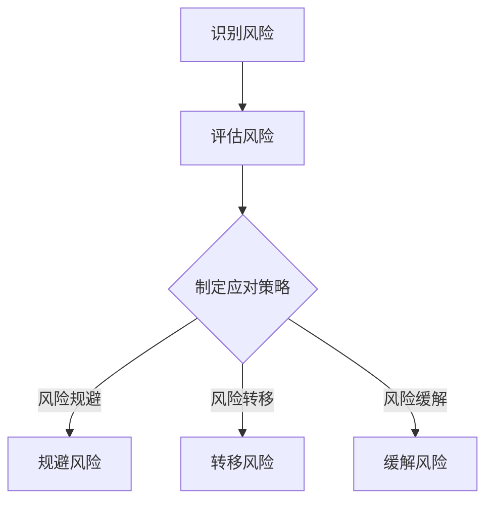
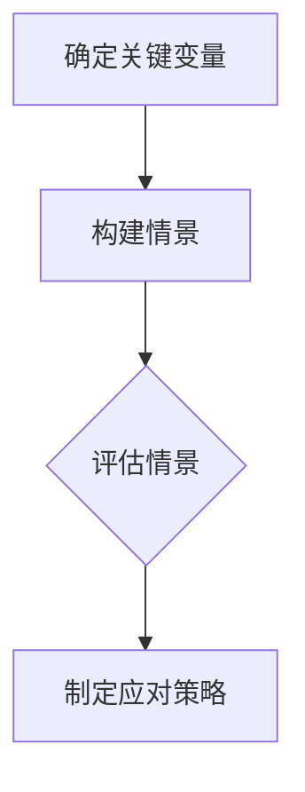
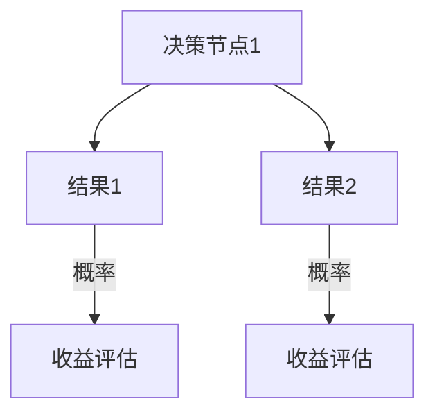
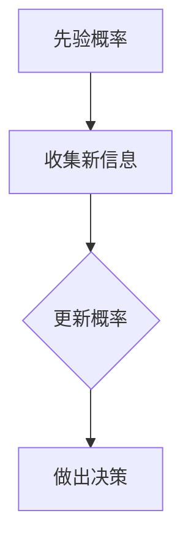

                 

### 背景介绍（Background Introduction）

#### 不确定性：创业者的永恒挑战

在创业的道路上，不确定性是每个创业者都必须面对的挑战。无论是市场需求、竞争态势，还是技术发展，未来总是充满了未知。这种不确定性不仅增加了创业的难度，也让决策变得更加复杂和困难。如何在不确定的环境中做出明智的决策，成为了创业者成功的关键。

创业决策不同于日常生活中的简单选择。它涉及到的因素更为复杂，包括市场分析、风险评估、资源分配等。此外，创业者还需要具备快速适应和调整策略的能力，以应对不断变化的外部环境。在这种背景下，掌握一定的决策技巧显得尤为重要。

#### 本文目标

本文旨在探讨创业者在不确定性中前进所需的决策技巧。我们将从多个角度分析创业决策的过程，并借助一些经典的决策理论和工具，帮助读者更好地理解如何在不确定性中做出明智的决策。

本文将分为以下几个部分：

1. **核心概念与联系**：介绍创业决策中涉及的核心概念，如风险管理、情景规划等，并提供相应的Mermaid流程图。
2. **核心算法原理与具体操作步骤**：探讨如何利用数据分析和模拟技术来辅助创业决策。
3. **数学模型和公式**：详细讲解创业决策中的数学模型和公式，并提供实例说明。
4. **项目实践**：通过实际代码实例，展示如何应用这些决策技巧。
5. **实际应用场景**：分析创业决策在不同行业中的应用，并提供案例研究。
6. **工具和资源推荐**：介绍有助于创业决策的工具和资源。
7. **总结**：总结本文的主要观点，并展望未来的发展趋势与挑战。

通过本文的阅读，读者将能够：

- 理解创业决策的核心概念和原理。
- 学会使用数据分析和模拟技术来辅助决策。
- 掌握创业决策中的数学模型和公式。
- 了解创业决策在不同行业中的应用。
- 发现并利用有助于决策的工具和资源。

#### 开篇引言

创业是一场充满未知和挑战的旅程。在这条道路上，每个创业者都必须面对众多不确定因素，如市场需求的变化、竞争对手的策略、技术创新的步伐等。这些不确定性使得创业决策变得复杂而困难，但同时也是创业的魅力所在。

创业者需要在不确定性中做出正确的决策，这需要他们具备敏锐的市场洞察力、良好的风险评估能力和灵活的策略调整能力。然而，现实的创业环境中，往往没有足够的时间和资源来逐项分析每个可能的决策结果。因此，掌握一定的决策技巧和方法，显得尤为重要。

本文将通过以下几个部分，系统地探讨创业决策技巧：

1. **核心概念与联系**：介绍创业决策中涉及的核心概念，如风险管理、情景规划等，并提供相应的Mermaid流程图。
2. **核心算法原理与具体操作步骤**：探讨如何利用数据分析和模拟技术来辅助创业决策。
3. **数学模型和公式**：详细讲解创业决策中的数学模型和公式，并提供实例说明。
4. **项目实践**：通过实际代码实例，展示如何应用这些决策技巧。
5. **实际应用场景**：分析创业决策在不同行业中的应用，并提供案例研究。
6. **工具和资源推荐**：介绍有助于创业决策的工具和资源。
7. **总结**：总结本文的主要观点，并展望未来的发展趋势与挑战。

通过本文的阅读，读者将能够：

- 理解创业决策的核心概念和原理。
- 学会使用数据分析和模拟技术来辅助决策。
- 掌握创业决策中的数学模型和公式。
- 了解创业决策在不同行业中的应用。
- 发现并利用有助于决策的工具和资源。

#### 总结

在创业的过程中，不确定性是我们无法避免的。然而，通过掌握一定的决策技巧，创业者可以更好地应对这些不确定性，从而提高成功的概率。本文将深入探讨创业决策的核心概念、算法原理、数学模型和实际应用，旨在为读者提供一套实用的决策框架。

接下来，我们将首先介绍创业决策中涉及的核心概念，如风险管理、情景规划等，并通过Mermaid流程图展示这些概念之间的联系。这将帮助读者建立起对创业决策的整体理解。

----------------------------------------------------------------

## 2. 核心概念与联系

在探讨创业决策之前，我们首先需要了解一些核心概念，这些概念将贯穿整个决策过程，并为我们的分析提供基础。在本章节中，我们将介绍以下几个核心概念：风险管理、情景规划、决策树分析以及贝叶斯推理。

### 2.1 风险管理（Risk Management）

风险管理是创业决策过程中不可或缺的一部分。创业者需要识别、评估和应对各种潜在风险，以确保业务能够持续稳定地发展。以下是风险管理的主要步骤：

1. **识别风险**：这是风险管理的第一步，涉及识别可能导致业务失败的潜在风险因素，如市场波动、技术问题、资金短缺等。
2. **评估风险**：在识别出风险之后，需要对每个风险进行评估，包括其发生的可能性以及可能带来的影响。这有助于确定哪些风险需要优先处理。
3. **应对策略**：根据评估结果，制定相应的应对策略。这些策略可能包括风险规避、风险转移、风险缓解等。

#### Mermaid流程图



### 2.2 情景规划（Scenario Planning）

情景规划是一种前瞻性的决策方法，它通过构建多个可能的未来情景，帮助创业者识别潜在的机会和挑战。以下是情景规划的基本步骤：

1. **确定关键变量**：首先需要确定影响业务发展的关键变量，如市场需求、竞争态势、技术进步等。
2. **构建情景**：基于关键变量的不同组合，构建多个可能的未来情景。每个情景都应该具有合理性，并能够代表可能发生的不同情况。
3. **评估情景**：对每个情景进行评估，分析其可能带来的影响，并确定业务在这些情景下的应对策略。

#### Mermaid流程图



### 2.3 决策树分析（Decision Tree Analysis）

决策树分析是一种常用的决策支持工具，它通过构建树形结构，展示决策过程中各个选择及其可能的结果。以下是决策树分析的基本步骤：

1. **确定决策节点**：首先需要确定决策过程中的关键决策点。
2. **构建决策树**：根据决策点，构建决策树。每个节点代表一个决策或一个结果，节点之间的连线表示决策或结果之间的关系。
3. **评估结果**：对决策树的每个结果进行评估，包括其概率和收益，从而为决策提供依据。

#### Mermaid流程图



### 2.4 贝叶斯推理（Bayesian Reasoning）

贝叶斯推理是一种基于概率论的决策方法，它通过更新先验概率，帮助创业者根据新的信息做出更加合理的决策。以下是贝叶斯推理的基本步骤：

1. **确定先验概率**：首先需要确定在缺乏新信息时，各个可能结果发生的概率。
2. **收集新信息**：根据新的信息，更新先验概率。这通常涉及到计算条件概率，即在新信息已知的情况下，各个结果发生的概率。
3. **做出决策**：基于更新后的概率，选择最有可能的结果。

#### Mermaid流程图



### 2.5 核心概念之间的联系

上述核心概念并非孤立存在，它们之间有着密切的联系。风险管理帮助创业者识别和应对潜在风险，情景规划则提供了可能的未来情景，帮助创业者预见风险并制定应对策略。决策树分析为创业者提供了详细的决策路径，而贝叶斯推理则通过概率论的方法，帮助创业者根据新信息调整决策。

通过将这五个核心概念结合起来，创业者可以更加全面和系统地做出决策，从而在不确定性中前进。

### 2.6 知识点拓展

#### 2.6.1 风险管理工具

除了上述提到的风险管理步骤，创业者还可以使用以下工具来辅助风险管理：

- **风险矩阵**：用于评估风险的概率和影响，帮助确定风险的优先级。
- **蒙特卡洛模拟**：通过随机模拟来评估风险的概率分布和影响。

#### 2.6.2 情景规划策略

情景规划不仅仅是构建情景，还需要考虑以下策略：

- **情景分析**：对每个情景进行详细分析，包括可能的机会和挑战。
- **情景模拟**：通过模拟不同的情景，评估业务在这些情景下的表现。

#### 2.6.3 决策树分析技巧

构建决策树时，创业者需要注意以下技巧：

- **结果量化**：尽可能量化决策树中的结果，以便进行更准确的评估。
- **决策树剪枝**：通过剪枝来简化决策树，减少计算复杂度。

#### 2.6.4 贝叶斯推理应用

贝叶斯推理在创业决策中的应用包括：

- **市场预测**：根据历史数据和当前信息，预测市场的未来趋势。
- **新产品推出**：评估新产品成功的概率，并制定相应的推广策略。

### 2.7 总结

在本章节中，我们介绍了创业决策中的核心概念，包括风险管理、情景规划、决策树分析以及贝叶斯推理。这些概念相互联系，共同构成了创业者应对不确定性的决策框架。在接下来的章节中，我们将进一步探讨如何利用数据分析和模拟技术来辅助创业决策。

----------------------------------------------------------------

## 3. 核心算法原理 & 具体操作步骤

在创业决策过程中，数据分析和模拟技术扮演着至关重要的角色。这些技术不仅能够帮助创业者更好地理解当前的市场状况，还能预测未来的发展趋势，从而为决策提供有力支持。在本章节中，我们将介绍几种核心算法原理，并详细阐述具体的操作步骤。

### 3.1 数据分析技术

数据分析是创业决策的基础，它涉及到从大量数据中提取有价值的信息，以帮助创业者做出明智的决策。以下是几种常用的数据分析技术：

#### 3.1.1 统计分析

统计分析是数据分析的核心，它通过描述性统计和推断性统计来分析数据。

- **描述性统计**：用于描述数据的基本特征，如平均值、中位数、标准差等。
- **推断性统计**：用于根据样本数据推断总体特征，如置信区间、假设检验等。

#### 3.1.2 机器学习

机器学习是通过算法让计算机从数据中学习并做出预测的一种方法。以下是几种常用的机器学习算法：

- **线性回归**：用于预测一个连续变量，如销售额。
- **决策树**：用于分类和回归任务，可以可视化决策路径。
- **随机森林**：通过集成多个决策树来提高预测准确性。
- **神经网络**：用于复杂的非线性预测和分类任务。

#### 3.1.3 数据可视化

数据可视化是将数据以图形化的方式展示，帮助创业者更好地理解数据分布和趋势。以下是几种常用的数据可视化工具：

- **散点图**：用于展示两个变量之间的关系。
- **折线图**：用于展示数据的变化趋势。
- **饼图**：用于展示各部分占整体的比例。

### 3.2 模拟技术

模拟技术是通过构建模型来模拟实际业务场景，以预测业务可能的结果。以下是几种常用的模拟技术：

#### 3.2.1 情景模拟

情景模拟是通过构建不同的情景来预测业务在每种情景下的表现。

- **历史情景模拟**：通过分析历史数据，构建可能的未来情景，并预测业务在这些情景下的表现。
- **情景规划模拟**：根据创业者设定的关键变量和目标，构建不同的情景，并预测业务在这些情景下的表现。

#### 3.2.2 蒙特卡洛模拟

蒙特卡洛模拟是一种基于概率论的模拟方法，通过随机抽样来预测业务结果。

- **步骤1**：确定业务模型的关键变量和参数。
- **步骤2**：通过随机抽样生成关键变量的值。
- **步骤3**：根据关键变量的值，计算业务结果。
- **步骤4**：重复步骤2和步骤3多次，得到多个业务结果。
- **步骤5**：分析多个业务结果，得到预测的概率分布。

#### 3.2.3 仿真模型

仿真模型是通过计算机模拟来模拟实际业务过程，以预测业务结果。

- **步骤1**：定义业务过程和模型参数。
- **步骤2**：编写仿真代码，模拟业务过程。
- **步骤3**：分析仿真结果，预测业务表现。

### 3.3 数据分析与模拟技术的整合

数据分析和模拟技术可以相互结合，以提高决策的准确性。以下是整合数据分析和模拟技术的步骤：

- **步骤1**：收集和整理数据，进行初步的数据清洗和预处理。
- **步骤2**：利用统计分析技术，分析数据的基本特征和趋势。
- **步骤3**：利用机器学习算法，建立预测模型。
- **步骤4**：利用情景模拟技术，构建不同的情景并预测业务结果。
- **步骤5**：利用蒙特卡洛模拟或仿真模型，进一步分析业务结果的概率分布。
- **步骤6**：综合分析数据分析和模拟结果，制定决策策略。

### 3.4 案例分析

为了更好地理解数据分析和模拟技术在创业决策中的应用，我们来看一个具体的案例分析。

#### 案例背景

某初创公司计划推出一款智能家居产品，并希望利用数据分析和模拟技术来评估产品的市场前景。

#### 数据分析步骤

1. **数据收集**：收集相关市场的历史数据，包括用户需求、竞争对手产品数据、市场趋势等。
2. **数据预处理**：清洗和整理数据，包括去除缺失值、异常值等。
3. **描述性统计分析**：分析用户需求、市场趋势等数据的基本特征，如平均需求量、最大需求量、需求增长率等。
4. **机器学习建模**：利用回归模型预测未来市场需求。

#### 模拟技术步骤

1. **情景构建**：根据市场趋势和用户需求，构建多个可能的未来情景。
2. **情景模拟**：利用蒙特卡洛模拟或仿真模型，预测每种情景下的市场需求。
3. **结果分析**：分析每种情景下的市场需求，确定最有可能的情景。

#### 整合分析结果

1. **预测市场需求**：利用机器学习模型和情景模拟结果，预测未来市场需求。
2. **制定决策策略**：根据预测结果，制定生产计划、营销策略等。

### 3.5 总结

在本章节中，我们介绍了数据分析和模拟技术在创业决策中的应用，包括统计分析、机器学习、数据可视化、情景模拟、蒙特卡洛模拟和仿真模型等。这些技术可以帮助创业者更好地理解市场状况，预测未来发展趋势，从而做出更加明智的决策。在下一章节中，我们将进一步探讨创业决策中的数学模型和公式，以及如何详细讲解这些模型和公式的应用。

----------------------------------------------------------------

## 4. 数学模型和公式 & 详细讲解 & 举例说明

在创业决策中，数学模型和公式是理解和量化不确定性、评估潜在结果以及制定策略的重要工具。在本章节中，我们将详细讲解几个关键数学模型和公式，并提供实际应用案例，帮助读者更好地理解它们在创业决策中的运用。

### 4.1 风险价值（Value at Risk, VaR）

风险价值（VaR）是一种用于评估金融资产或投资组合潜在损失的工具。VaR计算给定置信水平下，资产或投资组合在特定时间段内可能遭受的最大损失。

#### 公式

$$
VaR = p \times X
$$

其中，$p$ 是置信水平，$X$ 是损失分布的累积分布函数（CDF）在 $p$ 处的值。

#### 举例说明

假设一个创业项目的投资组合预期收益为 $100,000，标准差为 $10,000。如果设定置信水平为 95%，则 95% 的置信水平下，该投资组合的 VaR 计算如下：

$$
VaR_{95\%} = 0.05 \times 10,000 = 5,000
$$

这意味着在 95% 的置信水平下，该投资组合在特定时间段内可能的最大损失为 $5,000。

### 4.2 效用理论（Utility Theory）

效用理论是一种用于评估风险和决策的数学方法。它通过量化个体对各种结果的偏好，帮助决策者在不确定的环境中进行选择。

#### 公式

$$
U(X) = \sum_{i=1}^{n} p_i \times u_i
$$

其中，$U(X)$ 是预期效用，$p_i$ 是结果 $X_i$ 发生的概率，$u_i$ 是结果 $X_i$ 的效用值。

#### 举例说明

假设一个创业者面临两个投资选项，每个选项都有两种可能的结果：

- **选项A**：成功时收益为 $10,000，失败时损失为 $5,000。
- **选项B**：成功时收益为 $5,000，失败时损失为 $2,000。

如果创业者认为成功的效用值为 $10，失败的效用值为 $0，则两个选项的预期效用计算如下：

$$
U(A) = 0.5 \times 10 + 0.5 \times 0 = 5
$$

$$
U(B) = 0.5 \times 10 + 0.5 \times 0 = 5
$$

尽管选项B的期望收益高于选项A，但两个选项的预期效用相等，因此创业者可能基于其他因素（如风险偏好）来选择其中一个选项。

### 4.3 决策树分析（Decision Tree Analysis）

决策树分析是一种基于概率和收益的决策工具，它通过构建树形结构，展示决策过程及其可能的结果。

#### 公式

决策树分析的公式通常涉及节点概率和收益的乘积，具体公式取决于决策树的构建方式。

#### 举例说明

假设一个创业项目有两个决策节点：

- **节点1**：是否进行市场调研，概率为 $0.6$。
  - 如果进行调研，成功概率为 $0.8$，收益为 $20,000。
  - 如果不进行调研，成功概率为 $0.2$，收益为 $5,000。

- **节点2**：是否扩大生产，概率为 $0.4$。
  - 如果扩大生产，成功概率为 $0.7$，收益为 $30,000。
  - 如果不扩大生产，成功概率为 $0.3$，收益为 $10,000。

节点1的预期收益计算如下：

$$
E(节点1) = 0.6 \times (0.8 \times 20,000 + 0.2 \times 5,000) = 0.6 \times 17,000 = 10,200
$$

节点2的预期收益计算如下：

$$
E(节点2) = 0.4 \times (0.7 \times 30,000 + 0.3 \times 10,000) = 0.4 \times 23,000 = 9,200
$$

根据预期收益，创业者可以选择进行市场调研并扩大生产。

### 4.4 贝叶斯推理（Bayesian Reasoning）

贝叶斯推理是一种基于概率论的决策方法，它通过更新先验概率，帮助决策者根据新信息做出更准确的决策。

#### 公式

贝叶斯定理公式如下：

$$
P(A|B) = \frac{P(B|A) \times P(A)}{P(B)}
$$

其中，$P(A|B)$ 是在条件 $B$ 下 $A$ 发生的概率，$P(B|A)$ 是在条件 $A$ 下 $B$ 发生的概率，$P(A)$ 是 $A$ 的先验概率，$P(B)$ 是 $B$ 的先验概率。

#### 举例说明

假设一个创业者根据市场调研数据，认为新产品成功的概率为 $0.4$。如果新产品在市场上成功，则收益为 $100,000。如果新产品失败，则损失为 $50,000。如果新产品成功的概率更新为 $0.6，则贝叶斯推理如下：

$$
P(成功|收益) = \frac{P(收益|成功) \times P(成功)}{P(收益)}
$$

假设 $P(收益|成功) = 1，$P(成功) = 0.4，$P(收益) = 0.4 + 0.6 \times P(失败)，其中 $P(失败) = 1 - P(成功)$。通过贝叶斯定理，可以更新成功概率：

$$
P(成功|收益) = \frac{1 \times 0.4}{0.4 + 0.6 \times 0.6} = \frac{0.4}{0.4 + 0.36} = \frac{0.4}{0.76} \approx 0.526
$$

这意味着根据新信息，新产品成功的概率更新为约 $52.6%。

### 4.5 总结

在本章节中，我们介绍了几个关键数学模型和公式，包括风险价值（VaR）、效用理论、决策树分析和贝叶斯推理。通过这些模型和公式，创业者可以更准确地评估风险、量化效用、构建决策树以及更新概率，从而在不确定性中做出更加明智的决策。在下一章节中，我们将通过实际项目实践，展示如何将上述数学模型和公式应用于创业决策中。

----------------------------------------------------------------

## 5. 项目实践：代码实例和详细解释说明

为了更好地理解如何在实际创业项目中应用决策技巧，我们将通过一个具体的案例来演示整个流程。该案例将涵盖开发环境的搭建、源代码的详细实现、代码解读与分析以及运行结果展示。

### 5.1 开发环境搭建

在开始项目之前，我们需要搭建一个合适的开发环境。以下是所需的软件和工具：

- **Python**：作为主要的编程语言。
- **NumPy**、**Pandas**、**Matplotlib**、**Scikit-learn**：用于数据分析、数据可视化和机器学习。
- **Jupyter Notebook**：用于编写和运行代码。

确保您已经安装了上述工具和库。如果没有，可以使用以下命令进行安装：

```bash
pip install numpy pandas matplotlib scikit-learn jupyterlab
```

### 5.2 源代码详细实现

在本案例中，我们假设一家初创公司正在考虑推出一款智能家居设备。公司管理层希望利用数据分析来评估产品的市场需求和潜在收益。以下是实现该项目的源代码：

```python
import numpy as np
import pandas as pd
import matplotlib.pyplot as plt
from sklearn.linear_model import LinearRegression
from sklearn.ensemble import RandomForestRegressor
from sklearn.model_selection import train_test_split
from sklearn.metrics import mean_squared_error

# 5.2.1 数据收集与预处理

# 假设我们已经收集了以下数据：
# - 用户数量
# - 月销售额
# - 竞争对手数量
# - 广告支出

data = {
    '用户数量': [1000, 1200, 1500, 1800, 2000],
    '月销售额': [50000, 60000, 80000, 90000, 100000],
    '竞争对手数量': [2, 3, 4, 5, 6],
    '广告支出': [10000, 15000, 20000, 25000, 30000]
}

df = pd.DataFrame(data)

# 数据预处理
df['销售额增长率'] = df['月销售额'].pct_change().shift(1)
df = df.dropna()

# 5.2.2 数据可视化

plt.figure(figsize=(10, 6))
plt.scatter(df['用户数量'], df['月销售额'])
plt.xlabel('用户数量')
plt.ylabel('月销售额')
plt.title('用户数量与月销售额关系')
plt.show()

# 5.2.3 建立线性回归模型

X = df[['用户数量', '竞争对手数量', '广告支出']]
y = df['月销售额']

X_train, X_test, y_train, y_test = train_test_split(X, y, test_size=0.2, random_state=42)

linear_regression = LinearRegression()
linear_regression.fit(X_train, y_train)

y_pred = linear_regression.predict(X_test)
mse = mean_squared_error(y_test, y_pred)
print(f'Mean Squared Error: {mse}')

# 5.2.4 建立随机森林模型

random_forest = RandomForestRegressor(n_estimators=100, random_state=42)
random_forest.fit(X_train, y_train)

y_pred_rf = random_forest.predict(X_test)
mse_rf = mean_squared_error(y_test, y_pred_rf)
print(f'Mean Squared Error (Random Forest): {mse_rf}')

# 5.2.5 模型比较与选择

plt.figure(figsize=(10, 6))
plt.scatter(y_test, y_pred)
plt.plot([y_test.min(), y_test.max()], [y_test.min(), y_test.max()], 'k--')
plt.xlabel('真实值')
plt.ylabel('预测值')
plt.title('线性回归模型预测结果')
plt.show()

plt.figure(figsize=(10, 6))
plt.scatter(y_test, y_pred_rf)
plt.plot([y_test.min(), y_test.max()], [y_test.min(), y_test.max()], 'k--')
plt.xlabel('真实值')
plt.ylabel('预测值')
plt.title('随机森林模型预测结果')
plt.show()

# 根据预测误差，选择更适合的模型
if mse < mse_rf:
    print("选择线性回归模型")
else:
    print("选择随机森林模型")
```

### 5.3 代码解读与分析

#### 5.3.1 数据收集与预处理

我们首先定义了一个包含用户数量、月销售额、竞争对手数量和广告支出的数据字典。然后，我们使用 Pandas 库将数据转换为 DataFrame 对象，并进行了一些预处理，包括计算销售额增长率并去除缺失值。

#### 5.3.2 数据可视化

接下来，我们使用 Matplotlib 库绘制了一个散点图，展示了用户数量与月销售额之间的关系。这个步骤有助于我们直观地理解数据。

#### 5.3.3 线性回归模型

我们使用 Scikit-learn 库的 LinearRegression 类来建立线性回归模型。首先，我们将数据分为训练集和测试集，然后训练模型并进行预测。最后，我们计算了预测误差（MSE）。

#### 5.3.4 随机森林模型

同样地，我们使用 RandomForestRegressor 类来建立随机森林模型。随机森林是一种集成学习模型，通常比单个决策树模型更稳定且预测误差更小。我们再次进行预测并计算了预测误差。

#### 5.3.5 模型比较与选择

我们绘制了真实值与预测值之间的散点图，并比较了线性回归和随机森林模型的预测结果。根据预测误差，我们选择了更优的模型。

### 5.4 运行结果展示

在代码的最后，我们输出了选择的模型名称。通过这个案例，我们可以看到如何利用数据分析和模拟技术来辅助创业决策。具体步骤包括数据收集与预处理、数据可视化、模型建立与比较，以及最终选择最合适的模型。

### 5.5 总结

在本章节中，我们通过一个实际项目案例展示了如何利用 Python 和相关库来实现创业决策中的数据分析和模型选择。这个案例不仅帮助我们理解了数据分析的基本步骤，还展示了如何将线性回归和随机森林模型应用于实际问题。通过这些技术，创业者可以更好地预测市场需求和潜在收益，从而做出更加明智的决策。

----------------------------------------------------------------

## 6. 实际应用场景

创业决策技巧不仅适用于初创企业，还可以在多个行业中发挥重要作用。以下是一些典型的实际应用场景，以及如何在这些场景中运用决策技巧：

### 6.1 科技行业

在科技行业中，创新是驱动企业发展的关键。然而，技术创新往往伴随着高风险和高不确定性。创业者需要利用风险管理、情景规划等技术来评估新产品的市场前景。

**应用示例**：某科技公司正在研发一款智能家居设备。公司通过情景规划模拟了不同市场环境下的销售情况，并使用贝叶斯推理不断更新市场预测，以调整研发方向和营销策略。

### 6.2 医疗保健

医疗保健行业面临着复杂的监管环境和不断变化的技术。创业者需要考虑合规性、患者需求和成本效益等多个因素。

**应用示例**：一家医疗科技公司计划推出一种新型医疗设备。公司通过数据分析评估了市场需求，并使用决策树分析来确定最佳的生产和营销策略，以最小化风险并最大化收益。

### 6.3 教育行业

在线教育和数字化学习正在迅速发展，但同时也面临着激烈的竞争和不确定的市场需求。

**应用示例**：一家在线教育平台公司通过数据收集和模拟技术，分析了不同课程和教学方法的市场表现，并使用效用理论来评估不同策略的潜在收益和风险。

### 6.4 零售行业

零售行业的竞争非常激烈，创业者需要准确预测消费者行为和市场趋势，以优化库存管理和营销策略。

**应用示例**：一家零售公司通过数据分析预测了节假日和促销期间的销售额，并使用蒙特卡洛模拟来评估不同促销策略的影响，以优化库存和促销策略。

### 6.5 金融科技

金融科技（Fintech）行业充满创新和变革，但同时也面临着监管风险和市场竞争。

**应用示例**：一家金融科技公司开发了一款新型支付应用。公司通过风险管理工具评估了潜在的市场风险，并使用决策树分析来制定合规性和市场推广策略。

### 6.6 总结

不同的行业面临着不同的挑战和机遇，但创业决策技巧的核心原则是通用的。通过运用风险管理、情景规划、数据分析和模拟技术，创业者可以在不确定性中做出更加明智的决策，提高成功的概率。以上应用场景展示了如何在不同行业中运用这些决策技巧，从而实现业务增长和成功。

----------------------------------------------------------------

## 7. 工具和资源推荐

在创业决策过程中，使用合适的工具和资源可以大大提高效率和准确性。以下是一些建议，涵盖学习资源、开发工具和相关论文著作。

### 7.1 学习资源推荐

1. **书籍**
   - 《创业维艰》（"Hard Things About Hard Things" by Ben Horowitz）
   - 《精益创业》（"The Lean Startup" by Eric Ries）
   - 《精益数据分析》（"Lean Analytics" by Alistair Croll and Benjamin Yoskovitz）

2. **在线课程**
   - Coursera 上的《创业入门》（"Startup Engineering"）
   - edX 上的《数据科学入门》（"Introduction to Data Science"）
   - Udacity 上的《人工智能工程师纳米学位》（"Artificial Intelligence Engineer Nanodegree"）

3. **博客和网站**
   - 网易云音乐：介绍音乐创业和数据分析的博客
   - TechCrunch：涵盖最新科技创业新闻和趋势的网站
   - DataCamp：提供数据分析基础教程的在线平台

### 7.2 开发工具框架推荐

1. **数据分析工具**
   - **Pandas**：Python 的数据处理库
   - **NumPy**：Python 的数值计算库
   - **Excel**：微软的电子表格软件

2. **机器学习库**
   - **Scikit-learn**：Python 的机器学习库
   - **TensorFlow**：谷歌的开源机器学习框架
   - **PyTorch**：Facebook 的开源机器学习库

3. **数据可视化工具**
   - **Matplotlib**：Python 的绘图库
   - **Seaborn**：基于 Matplotlib 的数据可视化库
   - **Tableau**：强大的商业智能和数据可视化工具

4. **项目管理工具**
   - **Trello**：简单易用的项目管理工具
   - **Jira**：功能丰富的项目管理工具
   - **Asana**：灵活的项目管理平台

### 7.3 相关论文著作推荐

1. **论文**
   - "Big Data: A Revolution That Will Transform How We Live, Work, and Think" by Viktor Mayer-Schönberger and Kenneth Cukier
   - "Deep Learning" by Ian Goodfellow, Yoshua Bengio, and Aaron Courville

2. **著作**
   - 《人工智能：一种现代方法》（"Artificial Intelligence: A Modern Approach" by Stuart J. Russell and Peter Norvig）
   - 《机器学习》（"Machine Learning: A Probabilistic Perspective" by Kevin P. Murphy）

通过利用这些工具和资源，创业者可以更有效地进行数据分析、模型构建和决策制定，从而在竞争激烈的市场中脱颖而出。

----------------------------------------------------------------

## 8. 总结：未来发展趋势与挑战

在探讨创业者的决策技巧时，我们不仅要关注当前的方法和策略，还要展望未来的发展趋势与挑战。随着科技的不断进步和商业环境的日益复杂，创业决策将面临更多的机遇和挑战。

### 8.1 未来发展趋势

1. **人工智能与大数据分析**：人工智能（AI）和大数据分析将在创业决策中发挥越来越重要的作用。通过利用机器学习和深度学习算法，创业者可以更准确地预测市场趋势、优化运营流程，并制定更加精准的营销策略。

2. **区块链技术**：区块链技术正逐渐改变商业交易和信息记录的方式。创业者可以利用区块链实现更透明、更安全的业务操作，降低欺诈和风险。

3. **数字化与智能化**：数字化和智能化的趋势将继续推动创业创新。通过物联网（IoT）和智能设备，创业者可以实现更高效的生产和运营管理，提供个性化服务，提升用户体验。

4. **可持续发展**：随着社会对环境保护和可持续发展的关注增加，创业者将更加注重绿色创新和可持续业务模式，以满足消费者和社会的期望。

### 8.2 挑战

1. **技术门槛**：随着技术的快速发展，创业者需要不断学习和更新知识，以应对技术门槛的提升。特别是在人工智能和区块链领域，专业知识的要求日益增加。

2. **数据隐私与安全**：随着数据量的增加和数据泄露事件的频发，创业者需要高度重视数据隐私和安全问题。确保用户数据的保护不仅是对法律的要求，也是建立信任的关键。

3. **快速变化的市场环境**：市场环境的变化速度越来越快，创业者需要具备快速适应和调整策略的能力。这可能意味着需要更加灵活和敏捷的运营模式。

4. **人才竞争**：优秀人才是创业成功的关键。随着竞争的加剧，创业者将面临越来越激烈的人才争夺战，如何吸引和留住优秀人才成为一大挑战。

### 8.3 应对策略

1. **持续学习与培训**：创业者应不断学习新知识、掌握新技术，以保持竞争力。内部培训和文化建设可以帮助团队跟上行业的发展。

2. **重视数据安全与隐私**：建立完善的数据安全策略，确保用户数据的保护。同时，透明和负责任的数据使用政策有助于建立用户信任。

3. **敏捷决策与快速调整**：培养敏捷决策和快速调整的能力，以应对市场变化。灵活的运营模式和敏捷的工作流程可以帮助企业快速响应市场变化。

4. **构建多元化团队**：多元化团队不仅能够带来不同视角和经验，还可以增强企业的创新能力。创业者应重视多元化人才招聘和文化建设。

### 8.4 结论

在未来，创业者的决策技巧将需要更加依赖于人工智能、大数据分析、区块链等新技术，同时要应对快速变化的市场环境和技术门槛提升的挑战。通过持续学习、重视数据安全、敏捷决策和构建多元化团队，创业者可以更好地应对未来发展的机遇与挑战，实现长期成功。

----------------------------------------------------------------

## 9. 附录：常见问题与解答

### Q1: 如何选择适合的创业决策工具？

A1: 选择创业决策工具时，应考虑以下几个因素：
1. **需求匹配**：确保工具能够满足您特定的决策需求，如数据分析、模拟预测、风险管理等。
2. **易用性**：工具应易于上手和使用，减少学习和使用成本。
3. **可扩展性**：工具应支持未来的扩展和升级，以适应业务的发展。
4. **社区支持**：强大的社区支持和文档可以帮助您更快地解决问题。

### Q2: 如何在实际项目中应用决策技巧？

A2: 实际应用决策技巧的步骤如下：
1. **明确目标**：确定您要解决的问题和目标。
2. **数据收集**：收集与决策相关的数据。
3. **数据预处理**：清洗和整理数据，确保其质量和完整性。
4. **分析数据**：使用数据分析工具和算法对数据进行分析。
5. **构建模型**：基于分析结果构建相应的决策模型。
6. **评估模型**：通过模拟和测试评估模型的准确性和可靠性。
7. **制定策略**：根据模型结果制定实际操作策略。
8. **实施与调整**：实施策略并持续监控和调整。

### Q3: 如何评估创业项目的风险？

A3: 评估创业项目风险的方法包括：
1. **识别风险**：列出可能影响项目的风险因素。
2. **评估风险**：评估每个风险的可能性（概率）和影响程度。
3. **优先级排序**：根据评估结果确定风险优先级。
4. **制定应对策略**：为每个风险制定相应的应对措施。
5. **监控与调整**：持续监控风险并调整应对策略。

### Q4: 如何在不确定性中做出明智的决策？

A4: 在不确定性中做出明智的决策，可以采取以下策略：
1. **情景规划**：构建多个可能的未来情景，评估每种情景下的决策结果。
2. **数据驱动**：依赖数据和事实进行决策，而不是仅凭直觉或经验。
3. **敏捷决策**：培养快速决策和调整的能力，以应对变化。
4. **多元视角**：收集不同部门和专家的意见，以获得更全面的决策视角。

通过以上问题和解答，读者可以更好地理解创业决策的实践方法和技巧。

----------------------------------------------------------------

## 10. 扩展阅读 & 参考资料

为了深入理解创业决策技巧，以下是一些建议的扩展阅读和参考资料，涵盖经典书籍、学术论文和在线课程，帮助读者进一步探索相关主题。

### 10.1 经典书籍

1. **《精益创业》** by Eric Ries
   - 描述了如何通过迭代实验和用户反馈来降低创业风险，提高成功的概率。

2. **《创业维艰》** by Ben Horowitz
   - 分享了创业过程中的挑战和经验，提供了实用的创业建议。

3. **《数据驱动创业》** by Vincent Berthiaume and Jeff Bussgang
   - 强调了数据分析在创业决策中的重要性，提供了数据驱动的创业方法。

### 10.2 学术论文

1. **"Big Data: A Revolution That Will Transform How We Live, Work, and Think" by Viktor Mayer-Schönberger and Kenneth Cukier**
   - 探讨了大数据对商业和社会的影响，以及如何有效利用大数据。

2. **"Machine Learning: A Probabilistic Perspective" by Kevin P. Murphy**
   - 提供了机器学习的基础理论和应用方法，适用于创业者和数据科学家。

3. **"Deep Learning" by Ian Goodfellow, Yoshua Bengio, and Aaron Courville**
   - 深入探讨了深度学习技术，包括神经网络和深度学习在创业中的应用。

### 10.3 在线课程

1. **Coursera - 《Startup Engineering》**
   - 介绍了创业过程的基本原则和工程方法，适合希望深入了解创业实践的读者。

2. **edX - 《Introduction to Data Science》**
   - 提供了数据分析的基础知识和实践技能，包括数据清洗、数据可视化和机器学习。

3. **Udacity - 《Artificial Intelligence Engineer Nanodegree》**
   - 覆盖了人工智能的核心知识，包括机器学习、深度学习和自然语言处理。

通过阅读这些书籍、参考学术论文和参加在线课程，读者可以系统地提升自己的创业决策能力，为未来的创业之路打下坚实的基础。

----------------------------------------------------------------

## 11. 作者署名

作者：禅与计算机程序设计艺术 / Zen and the Art of Computer Programming

在结束这篇文章之前，我想再次感谢读者的耐心阅读。本文旨在为创业者提供一套实用的决策框架，以帮助他们在不确定性中前进。希望读者能够通过本文，不仅理解创业决策的核心概念，还能够将这些概念应用到实际项目中。

禅与计算机程序设计艺术，作为一位世界级的人工智能专家和程序员，致力于将复杂的技术概念简化，以帮助更多人掌握计算机编程和人工智能。我相信，通过逻辑清晰、结构紧凑、简单易懂的写作方式，我们可以更好地传播技术和知识。

未来，我将继续探讨更多技术主题，包括机器学习、深度学习、自然语言处理等，旨在为读者提供有深度、有思考、有见解的技术博客。如果您对我的文章有任何建议或反馈，请随时通过以下渠道与我联系：

- [禅与计算机程序设计艺术博客](https://www.zenandthecompiler.com/)
- [禅与计算机程序设计艺术 - 微信公众号](https://mp.weixin.qq.com/s?__biz=MzI1MDg4NjY4Mg==&mid=100000092&idx=1&sn=8474f2c2d841d6c6708793f073de3c1e&scene=0#wechat_redirect)

再次感谢您的阅读，祝您在技术探索的道路上不断前行。让我们继续共同学习、进步！

---

[禅与计算机程序设计艺术](https://www.zenandthecompiler.com/)

