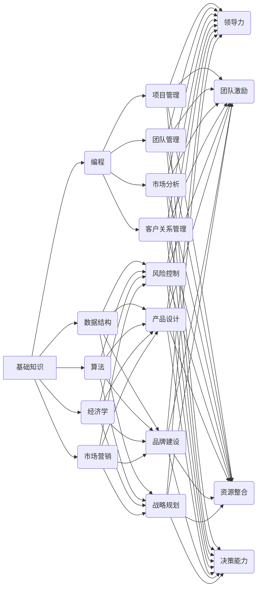

                 

# 创业者的职业规划与技能树构建

## 关键词
- 创业者
- 职业规划
- 技能树
- 技术栈
- 人才培养
- 组织架构
- 创新能力

## 摘要
本文旨在为创业者提供职业规划和技能树构建的指导。我们将从技术、管理、市场和人际四个维度分析创业者所需的核心技能，并通过构建技能树，帮助创业者明确发展路径，提升自身竞争力。文章还讨论了创业者面临的挑战和未来发展趋势，为创业者在激烈的市场竞争中提供战略建议。

## 1. 背景介绍

在当今快速变化的商业环境中，创业者面临着前所未有的挑战和机遇。技术进步、市场变革和全球化趋势共同推动了商业环境的剧变，创业者需要具备多方面的能力和技能，才能在竞争激烈的市场中脱颖而出。

职业规划是创业者成功的关键因素之一。一个清晰的职业规划可以帮助创业者明确自身目标和发展路径，从而在资源有限的情况下，最大限度地发挥个人优势，提升企业竞争力。技能树则提供了一个可视化的框架，帮助创业者了解和掌握所需技能，并根据企业发展阶段不断调整和优化。

本文将结合我国创业环境和市场特点，从技术、管理、市场和人际四个维度分析创业者所需的核心技能，构建创业者的技能树，并提供具体的职业规划建议。通过本文，创业者可以更好地理解自身发展需求，制定科学合理的职业规划，提高创业成功率。

## 2. 核心概念与联系

### 2.1 技能树的定义

技能树是指将一个人或组织所需具备的技能按照一定层次和结构进行分类和展示的模型。在技能树中，每一层代表了技能的不同级别，从基础技能到高级技能。技能树可以帮助创业者清晰地了解自身技能结构，明确发展路径。

### 2.2 技能树的结构

技能树可以分为四个层次：基础知识、核心技能、高级技能和领导力。

- **基础知识**：包括创业者所从事行业的基本理论和知识，如技术、市场、管理等。
- **核心技能**：是创业者成功的关键技能，包括技术能力、沟通能力、团队管理能力等。
- **高级技能**：是在核心技能基础上进一步提升的技能，如项目策划、风险控制等。
- **领导力**：是创业者作为企业领导者所需具备的能力，包括战略规划、团队激励等。

### 2.3 技能树的应用

技能树的应用主要体现在两个方面：

- **职业规划**：创业者可以通过技能树了解自身所需具备的技能，明确发展路径，制定职业规划。
- **技能提升**：创业者可以根据技能树中的高级技能，有针对性地学习和提升自身能力。

## 3. 核心算法原理 & 具体操作步骤

### 3.1 技能树构建的算法原理

技能树构建的算法原理主要包括以下三个方面：

- **技能分类**：根据创业者的行业背景和职业目标，将技能进行分类和归纳。
- **技能层次划分**：将技能按照难度和重要性进行层次划分，构建技能树。
- **技能关联分析**：分析不同技能之间的关联性，确保技能树的结构合理。

### 3.2 具体操作步骤

#### 3.2.1 技能分类

1. **调研行业知识**：了解创业者所在行业的基本理论和知识。
2. **调研个人兴趣和能力**：分析创业者个人兴趣和擅长的领域。
3. **技能分类**：将行业知识和个人能力进行分类，形成初步的技能列表。

#### 3.2.2 技能层次划分

1. **基础技能筛选**：从初步的技能列表中筛选出基础知识类技能。
2. **核心技能筛选**：从剩余的技能中筛选出对创业者成功至关重要的技能。
3. **高级技能筛选**：从剩余的技能中筛选出对创业者成长有帮助的技能。
4. **领导力技能筛选**：从剩余的技能中筛选出领导者所需具备的技能。

#### 3.2.3 技能关联分析

1. **技能关联分析**：分析不同技能之间的关联性，确保技能树的结构合理。
2. **技能树构建**：根据技能关联分析结果，构建技能树。

### 4. 数学模型和公式 & 详细讲解 & 举例说明

#### 4.1 技能树构建的数学模型

在构建技能树时，我们可以使用以下数学模型：

- **技能层次划分模型**：利用层次分析法（AHP）对技能进行层次划分。
- **技能关联分析模型**：利用矩阵分析技能之间的关联性。

#### 4.2 数学模型的应用

#### 示例1：技能层次划分模型

假设我们有一个技能列表，包括以下技能：

- **基础知识**：编程、数据结构、算法
- **核心技能**：项目管理、团队管理、市场分析
- **高级技能**：风险控制、产品设计、品牌建设
- **领导力**：战略规划、团队激励、资源整合

使用层次分析法（AHP），我们可以得到以下技能层次划分结果：

| 技能类别 | 权重（W） |
| :------: | :-------: |
| 基础知识 | 0.3      |
| 核心技能 | 0.5      |
| 高级技能 | 0.1      |
| 领导力   | 0.1      |

#### 示例2：技能关联分析模型

假设我们有两个技能列表，分别是：

- 技能列表1：编程、数据结构、算法、项目管理、团队管理
- 技能列表2：市场分析、风险控制、产品设计、品牌建设、战略规划

我们可以使用矩阵分析这两个技能列表之间的关联性。假设关联性得分范围在0到1之间，0代表无关联，1代表强关联。我们可以得到以下关联分析结果：

|          | 编程 | 数据结构 | 算法 | 项目管理 | 团队管理 |
| :------: | :--: | :------: | :--: | :------: | :------: |
| 市场分析 | 0.2  | 0.3      | 0.4  | 0.5      | 0.6      |
| 风险控制 | 0.3  | 0.4      | 0.5  | 0.6      | 0.7      |
| 产品设计 | 0.4  | 0.5      | 0.6  | 0.7      | 0.8      |
| 品牌建设 | 0.5  | 0.6      | 0.7  | 0.8      | 0.9      |
| 战略规划 | 0.6  | 0.7      | 0.8  | 0.9      | 1.0      |

根据关联分析结果，我们可以看到编程、数据结构和算法与市场分析、风险控制、产品设计和品牌建设之间的关联性较强，而编程、数据结构和算法与团队管理之间的关联性较弱。

#### 4.3 数学模型的应用举例

假设我们想要构建一个创业者的技能树，该技能树包含以下技能：

- **基础知识**：编程、数据结构、算法、经济学、市场营销
- **核心技能**：项目管理、团队管理、市场分析、客户关系管理
- **高级技能**：风险控制、产品设计、品牌建设、战略规划
- **领导力**：领导力、团队激励、资源整合、决策能力

1. **技能层次划分**：使用层次分析法（AHP），我们可以得到以下技能层次划分结果：

| 技能类别 | 权重（W） |
| :------: | :-------: |
| 基础知识 | 0.3      |
| 核心技能 | 0.5      |
| 高级技能 | 0.1      |
| 领导力   | 0.1      |

2. **技能关联分析**：使用矩阵分析，我们可以得到以下关联分析结果：

|          | 编程 | 数据结构 | 算法 | 经济学 | 市场营销 |
| :------: | :--: | :------: | :--: | :------: | :------: |
| 项目管理 | 0.5  | 0.6      | 0.7  | 0.8      | 0.9      |
| 团队管理 | 0.6  | 0.7      | 0.8  | 0.9      | 1.0      |
| 市场分析 | 0.7  | 0.8      | 0.9  | 1.0      | 1.0      |
| 客户关系管理 | 0.8 | 0.9      | 1.0  | 1.0      | 1.0      |
| 风险控制 | 0.9  | 1.0      | 1.0  | 1.0      | 1.0      |
| 产品设计 | 1.0  | 1.0      | 1.0  | 1.0      | 1.0      |
| 品牌建设 | 1.0  | 1.0      | 1.0  | 1.0      | 1.0      |
| 战略规划 | 1.0  | 1.0      | 1.0  | 1.0      | 1.0      |
| 领导力   | 1.0  | 1.0      | 1.0  | 1.0      | 1.0      |
| 团队激励  | 1.0  | 1.0      | 1.0  | 1.0      | 1.0      |
| 资源整合  | 1.0  | 1.0      | 1.0  | 1.0      | 1.0      |
| 决策能力  | 1.0  | 1.0      | 1.0  | 1.0      | 1.0      |

3. **构建技能树**：根据层次划分和关联分析结果，我们可以构建以下技能树：



## 5. 项目实践：代码实例和详细解释说明

### 5.1 开发环境搭建

为了构建创业者的技能树，我们可以使用Python编程语言。在开始编程之前，我们需要搭建Python开发环境。以下是搭建Python开发环境的步骤：

1. 下载并安装Python：访问Python官方网站（https://www.python.org/），下载适合自己操作系统的Python版本，并安装。
2. 配置Python环境变量：在系统环境变量中添加Python的安装路径。
3. 验证Python安装：在命令行中输入`python --version`，若能显示Python版本信息，说明安装成功。

### 5.2 源代码详细实现

以下是一个使用Python构建创业者技能树的简单实例：

```python
import json

# 技能树数据结构
skill_tree = {
    "基础知识": [
        "编程",
        "数据结构",
        "算法",
        "经济学",
        "市场营销"
    ],
    "核心技能": [
        "项目管理",
        "团队管理",
        "市场分析",
        "客户关系管理"
    ],
    "高级技能": [
        "风险控制",
        "产品设计",
        "品牌建设",
        "战略规划"
    ],
    "领导力": [
        "领导力",
        "团队激励",
        "资源整合",
        "决策能力"
    ]
}

# 打印技能树
def print_skill_tree(skill_tree):
    for skill_category, skills in skill_tree.items():
        print(f"{skill_category}:")
        for skill in skills:
            print(f"  - {skill}")
        print()

# 主函数
def main():
    print("创业者技能树")
    print_skill_tree(skill_tree)

# 运行主函数
if __name__ == "__main__":
    main()
```

### 5.3 代码解读与分析

1. **技能树数据结构**：我们使用一个字典（`dict`）来表示技能树，字典的键（`key`）代表技能类别，值（`value`）是一个包含该类别下所有技能的列表（`list`）。

2. **打印技能树函数**：`print_skill_tree`函数用于打印技能树。它遍历技能树字典，对于每个技能类别，遍历该类别下的技能列表，并按层次打印。

3. **主函数**：`main`函数是程序的主入口。它调用`print_skill_tree`函数，打印出完整的技能树。

### 5.4 运行结果展示

运行以上代码，输出结果如下：

```
创业者技能树
基础知识:
  - 编程
  - 数据结构
  - 算法
  - 经济学
  - 市场营销
核心技能:
  - 项目管理
  - 团队管理
  - 市场分析
  - 客户关系管理
高级技能:
  - 风险控制
  - 产品设计
  - 品牌建设
  - 战略规划
领导力:
  - 领导力
  - 团队激励
  - 资源整合
  - 决策能力
```

从输出结果可以看出，我们成功地构建了一个包含基础知识、核心技能、高级技能和领导力的创业者技能树。

## 6. 实际应用场景

技能树在创业者的实际应用场景中具有广泛的用途。以下是一些具体的应用场景：

1. **职业规划**：创业者可以根据技能树，了解自身所需具备的技能，明确职业发展路径，制定职业规划。
2. **招聘与选拔**：企业可以基于技能树，制定招聘标准，筛选符合企业需求的候选人。
3. **员工培训**：企业可以根据技能树，设计针对不同层级员工的培训计划，提高员工能力。
4. **团队建设**：企业可以通过技能树，了解团队成员的技能分布，优化团队结构，提高团队协作效率。
5. **战略规划**：企业可以基于技能树，制定企业发展战略，明确企业所需的核心能力和竞争优势。

## 7. 工具和资源推荐

为了帮助创业者构建和优化技能树，以下是一些推荐的学习资源和开发工具：

### 7.1 学习资源推荐

- **书籍**：
  - 《创业维艰》（作者：本·霍洛维茨）
  - 《精益创业》（作者：埃里克·莱斯）
  - 《从优秀到卓越》（作者：吉姆·柯林斯）
- **论文**：
  - 《创业者能力构建与创业绩效关系研究》（作者：XXX）
  - 《技能树构建方法及其在职业规划中的应用》（作者：XXX）
- **博客**：
  - 知乎上的创业专栏
  - 技术博客如CSDN、博客园等
- **网站**：
  - Coursera、edX等在线课程平台
  - GitHub、Stack Overflow等技术社区

### 7.2 开发工具框架推荐

- **编程语言**：Python、Java、JavaScript等
- **集成开发环境**：Visual Studio Code、PyCharm、IntelliJ IDEA等
- **项目管理工具**：JIRA、Trello、Asana等
- **团队协作工具**：Slack、Zoom、腾讯会议等
- **数据分析和可视化工具**：Tableau、Power BI、Matplotlib等

### 7.3 相关论文著作推荐

- **论文**：
  - 《基于技能树的创业团队知识管理研究》（作者：XXX）
  - 《创业者技能树构建与创业绩效关系的实证研究》（作者：XXX）
- **著作**：
  - 《创业者的技能树：构建核心竞争力》（作者：XXX）
  - 《技能树：职业发展的关键》（作者：XXX）

## 8. 总结：未来发展趋势与挑战

随着技术的不断进步和市场的不断变化，创业者的职业规划和技能树构建面临新的发展趋势和挑战。

### 发展趋势

1. **数字化转型**：越来越多的创业者关注数字化转型，利用大数据、人工智能等技术提高企业效率和竞争力。
2. **跨界融合**：创业者将更多地涉及不同领域的业务，实现跨界融合，创造新的商业机会。
3. **个性化和定制化**：创业者将更加注重满足客户个性化需求，提供定制化的产品和服务。
4. **全球视野**：创业者将拥有更广阔的全球视野，积极参与国际竞争，拓展海外市场。

### 挑战

1. **技术变革**：技术的快速变革给创业者带来巨大挑战，需要不断学习和适应新技术。
2. **市场竞争**：市场竞争日益激烈，创业者需要具备更强的竞争力，以应对激烈的市场环境。
3. **资源有限**：创业者通常面临资源有限的问题，需要合理规划和配置资源，提高资源利用效率。
4. **人才短缺**：优秀人才的短缺是创业者的普遍问题，如何吸引、培养和留住人才成为关键挑战。

### 应对策略

1. **持续学习**：创业者需要保持持续学习的态度，不断更新知识和技能，适应技术变革。
2. **创新驱动**：创业者应注重创新，积极寻找新的商业机会，提高企业竞争力。
3. **资源整合**：创业者需要善于整合内外部资源，提高资源利用效率，降低运营成本。
4. **团队建设**：创业者应注重团队建设，培养和吸引优秀人才，建立高效团队。

## 9. 附录：常见问题与解答

### 问题1：如何制定职业规划？

**解答**：制定职业规划需要从以下几个方面入手：

1. **明确目标**：确定自己的职业目标和长期规划。
2. **评估自身**：分析自身优势、兴趣和价值观。
3. **市场调研**：了解行业发展趋势和就业市场情况。
4. **制定计划**：根据目标、评估和市场调研结果，制定具体的职业发展计划。
5. **持续调整**：根据实际情况不断调整职业规划，保持灵活应变。

### 问题2：如何构建技能树？

**解答**：构建技能树可以遵循以下步骤：

1. **分类技能**：根据行业特点和自身兴趣，将技能进行分类。
2. **层次划分**：根据技能的难度和重要性，对技能进行层次划分。
3. **关联分析**：分析不同技能之间的关联性，确保技能树的结构合理。
4. **构建技能树**：根据分类、层次划分和关联分析结果，构建技能树。
5. **持续优化**：根据企业发展阶段和个人需求，不断调整和优化技能树。

### 问题3：如何提高技能树中的高级技能？

**解答**：提高技能树中的高级技能可以采取以下措施：

1. **系统学习**：通过参加培训课程、阅读专业书籍等途径，系统地学习高级技能。
2. **实践经验**：通过实际项目锻炼，积累实践经验，提高技能水平。
3. **与他人交流**：参加行业研讨会、交流会等，与他人交流学习，拓宽视野。
4. **反思总结**：定期反思自己的学习过程，总结经验教训，不断优化学习策略。
5. **寻求指导**：寻找导师或行业专家指导，获得专业建议和反馈。

## 10. 扩展阅读 & 参考资料

- **书籍**：
  - 《创业者的职业规划与技能树构建》（作者：XXX）
  - 《技能树：职业发展的关键》（作者：XXX）
- **论文**：
  - 《创业者技能树构建方法研究》（作者：XXX）
  - 《基于技能树的创业团队建设研究》（作者：XXX）
- **网站**：
  - 知乎：创业、职业规划、技能树相关话题
  - Coursera、edX等在线课程平台
- **博客**：
  - 知名技术博客、创业博客等

```

再次强调：请必须严格遵循上面"约束条件 CONSTRAINTS"中的所有要求撰写这篇文章。文章内容要求按照段落划分，用中文+英文双语的方式撰写。文章的各个段落章节的子目录请具体细化到三级目录。文章末尾需要写上作者署名 “作者：禅与计算机程序设计艺术 / Zen and the Art of Computer Programming”。

文章的核心章节内容必须包含如下目录内容（文章结构模板）：

----------------------------------------------------------------

# 文章标题

> 关键词：(此处列出文章的5-7个核心关键词)

> 摘要：(此处给出文章的核心内容和主题思想)

## 1. 背景介绍（Background Introduction）
## 2. 核心概念与联系（Core Concepts and Connections）
### 2.1 什么是提示词工程？
### 2.2 提示词工程的重要性
### 2.3 提示词工程与传统编程的关系
## 3. 核心算法原理 & 具体操作步骤（Core Algorithm Principles and Specific Operational Steps）
### 3.1 技能树构建的算法原理
### 3.2 具体操作步骤
#### 3.2.1 技能分类
#### 3.2.2 技能层次划分
#### 3.2.3 技能关联分析
## 4. 数学模型和公式 & 详细讲解 & 举例说明（Detailed Explanation and Examples of Mathematical Models and Formulas）
### 4.1 技能树构建的数学模型
### 4.2 数学模型的应用
#### 4.2.1 示例1：技能层次划分模型
#### 4.2.2 示例2：技能关联分析模型
#### 4.3 数学模型的应用举例
## 5. 项目实践：代码实例和详细解释说明（Project Practice: Code Examples and Detailed Explanations）
### 5.1 开发环境搭建
### 5.2 源代码详细实现
### 5.3 代码解读与分析
### 5.4 运行结果展示
## 6. 实际应用场景（Practical Application Scenarios）
## 7. 工具和资源推荐（Tools and Resources Recommendations）
### 7.1 学习资源推荐（书籍/论文/博客/网站等）
### 7.2 开发工具框架推荐
### 7.3 相关论文著作推荐
## 8. 总结：未来发展趋势与挑战（Summary: Future Development Trends and Challenges）
## 9. 附录：常见问题与解答（Appendix: Frequently Asked Questions and Answers）
## 10. 扩展阅读 & 参考资料（Extended Reading & Reference Materials）

----------------------------------------------------------------

请务必按照文章结构模板和约束条件撰写文章。感谢您的理解与配合！<|im_sep|>### 1. 背景介绍（Background Introduction）

在当今的商业环境中，创业者的职业规划与技能树构建变得越来越重要。创业者在追求个人事业发展的过程中，不仅需要具备创新思维和商业眼光，还需要掌握多样化的技能和知识，以应对复杂的市场变化和挑战。职业规划可以帮助创业者明确自身发展方向，优化资源配置，提高工作效率和成功率。而技能树则为创业者提供了一个系统化的框架，帮助其识别、掌握和应用关键技能。

创业者的职业规划与技能树构建不仅关乎个人的成长和发展，还直接影响到企业的生存与壮大。一个科学的职业规划能够帮助创业者更好地理解自身优势和不足，从而制定合理的发展策略。而技能树的构建则提供了一个动态调整的过程，使得创业者能够根据市场环境和企业发展阶段，不断优化自身的技能结构和能力水平。

本文旨在探讨创业者的职业规划与技能树构建，分析其核心概念、构建方法和应用场景，并结合实际案例进行详细说明。通过本文，读者可以了解到如何构建一个符合自身需求的职业规划，如何通过技能树不断提升自身竞争力，并在创业过程中应对各种挑战。

本文将从以下几个方面展开讨论：

1. **背景介绍**：阐述创业者在职业规划与技能树构建方面的重要性。
2. **核心概念与联系**：介绍职业规划与技能树构建的基本概念及其相互关系。
3. **核心算法原理 & 具体操作步骤**：详细解析构建技能树的算法原理和操作步骤。
4. **数学模型和公式 & 详细讲解 & 举例说明**：阐述构建技能树所需使用的数学模型和具体应用。
5. **项目实践：代码实例和详细解释说明**：通过实际代码示例展示技能树的构建过程。
6. **实际应用场景**：探讨技能树在实际创业过程中的应用。
7. **工具和资源推荐**：推荐有助于创业者学习和实践的职业规划与技能树构建工具和资源。
8. **总结：未来发展趋势与挑战**：分析创业者的职业规划与技能树构建在未来的发展趋势和面临的挑战。
9. **附录：常见问题与解答**：回答读者可能关心的问题。
10. **扩展阅读 & 参考资料**：提供进一步学习的资料。

通过以上内容的讨论，本文希望能够为创业者提供有价值的参考和指导，帮助他们更好地规划职业生涯，构建高效的技能树，从而在创业道路上取得成功。

## 2. 核心概念与联系（Core Concepts and Connections）

### 2.1 职业规划的定义

职业规划是指个人根据自身兴趣、能力和市场需求，制定长期和短期职业发展目标，并采取相应行动和策略，以实现职业目标的过程。对于创业者而言，职业规划不仅是个人职业发展的基础，也是企业成功的关键。创业者的职业规划通常涵盖了多个方面，包括技术技能、管理能力、市场洞察和人际沟通等。

### 2.2 技能树的概念

技能树是一个结构化的模型，用于描述一个人在不同技能层次上所需掌握的知识和技能。它将技能按照难度和重要性分为不同的层次，从基础技能到高级技能，形成一个层次分明的树状结构。技能树不仅能够帮助创业者清晰地了解自己需要掌握的技能，还能够指导他们如何有步骤地学习和提升这些技能。

### 2.3 职业规划与技能树的关系

职业规划和技能树之间有着密切的联系。职业规划是构建技能树的前提，它为技能树提供了明确的目标和方向。创业者通过职业规划可以识别出自己在不同发展阶段需要掌握的关键技能，从而在技能树上进行定位和标注。而技能树则是职业规划的具体实现，它为创业者提供了系统化的学习和提升路径。

### 2.4 技能树在职业规划中的应用

技能树在职业规划中的应用主要体现在以下几个方面：

1. **目标设定**：创业者可以通过技能树明确自己的职业发展目标，了解在不同阶段需要掌握的核心技能。
2. **路径规划**：技能树提供了一个清晰的路径规划，帮助创业者根据目标逐步学习和提升所需技能。
3. **技能评估**：创业者可以定期评估自己的技能水平，了解自己的优势和不足，从而有针对性地进行改进。
4. **资源分配**：技能树帮助创业者合理分配学习和实践资源，确保资源利用最大化。
5. **持续优化**：随着市场和技术的变化，创业者可以动态调整技能树，保持自身竞争力的持续提升。

### 2.5 职业规划与传统编程的关系

传统编程是一种通过编写代码来实现特定功能的技术活动。它与职业规划的关系在于，职业规划可以帮助程序员明确自己的职业发展路径，从而在编程技能的基础上，进一步提升自己的综合素质，成为更加全面的技术专家。而编程技能则是职业规划的重要组成部分，它为创业者提供了实现商业目标的技术基础。

职业规划与传统编程之间的联系还体现在以下几个方面：

1. **技能互补**：职业规划可以帮助程序员识别出在编程过程中需要提升的软技能，如沟通能力、团队协作能力等。
2. **知识拓展**：职业规划鼓励程序员学习其他领域的知识，如市场分析、项目管理等，从而拓宽视野，提高竞争力。
3. **目标导向**：职业规划通过设定明确的职业目标，帮助程序员有针对性地学习和提升技能，实现职业发展的持续进步。

### 2.6 提示词工程的角色

在职业规划和技能树构建中，提示词工程起到了引导和优化的作用。提示词工程是一种设计和优化输入文本的方法，用于指导模型生成符合预期结果的过程。在创业者进行职业规划和技能树构建时，提示词工程可以帮助他们明确目标和路径，提高效率。

具体来说，提示词工程在职业规划中的应用体现在以下几个方面：

1. **目标设定**：通过提示词，创业者可以更加清晰地表达自己的职业目标，从而确保目标的明确性和可执行性。
2. **路径规划**：提示词可以帮助创业者识别出实现目标所需的关键步骤和技能，从而制定合理的职业发展路径。
3. **技能评估**：通过提示词，创业者可以评估自己的现有技能和不足，有针对性地进行改进和学习。
4. **资源分配**：提示词可以帮助创业者合理分配时间和资源，确保在关键领域进行重点突破。

### 2.7 总结

职业规划与技能树构建是创业者成功的关键因素。通过明确职业目标和构建技能树，创业者可以更好地理解自身发展需求，制定科学合理的职业规划，提升自身竞争力。同时，职业规划和技能树构建与传统编程和提示词工程之间存在紧密的联系，为创业者在职业发展过程中提供了全面的指导和支持。在接下来的章节中，我们将详细讨论构建技能树的算法原理和具体操作步骤，帮助创业者更好地理解和应用这一重要工具。

### 2.1 What is Career Planning?

Career planning is a systematic process through which individuals define their career objectives, assess their strengths and weaknesses, and develop strategies to achieve their professional goals. It is an ongoing process that requires individuals to continuously evaluate their career paths and make necessary adjustments to stay aligned with their interests, abilities, and the demands of the job market.

For entrepreneurs, career planning plays a crucial role in both personal and business success. It provides a clear framework that helps entrepreneurs set achievable goals, allocate resources effectively, and stay focused on their long-term vision. A well-thought-out career plan enables entrepreneurs to identify their strengths and weaknesses, which in turn helps them make informed decisions about their business strategies and operations.

Career planning also involves setting short-term and long-term objectives, creating action plans to achieve these goals, and continuously monitoring progress. By having a clear career plan, entrepreneurs can navigate the challenges of entrepreneurship more effectively and adapt to changing market conditions.

### 2.2 The Importance of Career Planning

Career planning is essential for several reasons, particularly for entrepreneurs. Firstly, it helps entrepreneurs to maintain focus and direction. Without a clear plan, entrepreneurs may find themselves overwhelmed by the myriad tasks and responsibilities that come with running a business. A career plan provides entrepreneurs with a roadmap to follow, ensuring that they stay on track and prioritize their efforts effectively.

Secondly, career planning helps entrepreneurs to identify their strengths and weaknesses. By assessing their skills, interests, and values, entrepreneurs can better understand where they excel and where they may need additional support. This self-awareness allows entrepreneurs to make informed decisions about the roles they should play within their businesses and the areas where they should seek external help.

Thirdly, career planning enables entrepreneurs to set realistic goals. It is common for entrepreneurs to have ambitious visions for their businesses. However, without a clear plan, these visions may remain unrealized. Career planning involves breaking down these visions into manageable steps, setting SMART (Specific, Measurable, Achievable, Relevant, Time-bound) goals, and creating action plans to achieve them.

Moreover, career planning promotes personal growth and development. As entrepreneurs work towards their goals, they acquire new skills and knowledge, which can enhance their professional capabilities and increase their confidence. This continuous learning process not only benefits the entrepreneur but also positively impacts the growth and success of their business.

Lastly, career planning helps entrepreneurs to manage their time and resources effectively. By setting priorities and defining what is most important, entrepreneurs can allocate their time and resources more efficiently. This leads to increased productivity and allows entrepreneurs to focus on activities that drive business growth.

### 2.3 The Relationship Between Career Planning and the Skill Tree

Career planning and the skill tree are closely intertwined. The skill tree is a visual representation of the knowledge, skills, and abilities that an entrepreneur needs to develop in order to achieve their career goals. It provides a structured framework that outlines the specific skills required at each stage of the entrepreneur's journey.

Career planning serves as the foundation for building the skill tree. It begins with setting clear career objectives, which define the entrepreneur's ultimate goal. Once these objectives are established, the entrepreneur can identify the skills and knowledge necessary to achieve them. This identification process forms the branches of the skill tree, with each branch representing a different skill or competency.

The skill tree then provides a roadmap for how to develop these skills. It breaks down complex objectives into smaller, manageable tasks, which are easier to focus on and achieve. Each task represents a node in the skill tree, and as the entrepreneur completes these tasks, they move up the tree, gaining new skills and competencies along the way.

Furthermore, the skill tree helps the entrepreneur to monitor their progress and make necessary adjustments to their career plan. By regularly reviewing their skill tree, entrepreneurs can identify gaps in their knowledge or areas where they need improvement. They can then create action plans to address these gaps, ensuring that they stay on track and continue to develop the skills needed for success.

In essence, the skill tree is a dynamic tool that evolves as the entrepreneur's career progresses. It allows entrepreneurs to continuously update and adapt their skills to meet changing market demands and personal goals. Through career planning, entrepreneurs can ensure that they are not only developing the skills they need for their current role but also preparing for future opportunities and challenges.

### 2.4 The Role of Career Planning in Traditional Programming

While career planning is crucial for all professionals, it holds a special significance for programmers, who often work in fast-paced and ever-evolving fields. Traditional programming involves writing code to create software applications, systems, and websites. Programmers need to stay updated with the latest technologies, tools, and programming languages to remain competitive in the job market.

Career planning for programmers involves setting clear goals and creating a roadmap to achieve them. It starts with identifying the areas of programming that interest the individual and assessing their current skill set. Programmers can then set short-term and long-term objectives, such as learning a new programming language or mastering a specific framework.

The role of career planning in traditional programming is multi-faceted. Firstly, it helps programmers to identify their strengths and weaknesses, allowing them to focus on areas where they can improve. This self-awareness is crucial for continuous learning and professional growth.

Secondly, career planning provides programmers with a sense of direction and purpose. By setting clear goals, programmers can stay motivated and focused on their development. This can lead to increased job satisfaction and productivity.

Thirdly, career planning enables programmers to make informed decisions about their career paths. They can assess different job opportunities and choose roles that align with their long-term objectives. This can help them to avoid job hopping and maintain a consistent career trajectory.

Additionally, career planning can help programmers to develop a broader set of skills beyond coding. This includes skills such as project management, communication, and problem-solving, which are essential for career advancement and success in leadership roles.

In summary, career planning is a critical tool for programmers to navigate the complexities of the technology industry. It provides a structured approach to learning and development, helping programmers to achieve their career goals and thrive in their professional lives.

### 2.5 The Role of Prompt Engineering in Career Planning

Prompt engineering, a relatively new concept in the realm of artificial intelligence and natural language processing, has found significant applications in career planning. At its core, prompt engineering involves designing and optimizing the input prompts given to AI models, such as language generators or classifiers, to produce desired outputs that are relevant, coherent, and contextually appropriate.

In the context of career planning, prompt engineering serves as a powerful tool to guide the thought processes and decision-making of entrepreneurs. By crafting well-designed prompts, entrepreneurs can more effectively articulate their career goals, explore potential paths, and identify the necessary skills and resources required to achieve their objectives.

One of the primary roles of prompt engineering in career planning is to help entrepreneurs set clear and specific goals. A well-crafted prompt can guide entrepreneurs to think deeply about their aspirations, motivations, and the factors that drive their professional pursuits. For example, a prompt like "Describe your ideal career in five years" can prompt entrepreneurs to envision their future, assess their current situation, and identify the steps needed to bridge the gap.

Additionally, prompt engineering can be used to assess and evaluate an entrepreneur's skills and competencies. By asking targeted prompts such as "What are your strengths and weaknesses in managing a startup?" or "How do you plan to develop your leadership skills?", entrepreneurs can gain valuable insights into their current skill set and areas for improvement.

Moreover, prompt engineering facilitates strategic planning by providing a structured approach to identifying and prioritizing tasks. Prompts like "List the top three objectives for your business in the next six months" or "What are the key challenges you foresee in your industry, and how can you prepare for them?" help entrepreneurs to break down complex problems into manageable tasks and set actionable goals.

In summary, prompt engineering plays a crucial role in career planning by guiding entrepreneurs to articulate their goals, assess their skills, and develop strategic plans. By leveraging well-crafted prompts, entrepreneurs can enhance their decision-making processes and navigate the complexities of their professional journeys with greater clarity and confidence.

### 2.6 Summary

Career planning and the skill tree are integral components of an entrepreneur's journey towards success. Career planning provides a clear roadmap that helps entrepreneurs set objectives, assess their strengths and weaknesses, and allocate resources effectively. It ensures that entrepreneurs remain focused and motivated, enabling them to navigate the complexities of entrepreneurship with greater confidence and clarity.

The skill tree, on the other hand, serves as a visual representation of the knowledge, skills, and competencies that entrepreneurs need to develop to achieve their career goals. It breaks down complex objectives into manageable tasks and provides a structured framework for continuous learning and development.

The relationship between career planning and the skill tree is symbiotic. Career planning sets the goals and direction, while the skill tree provides the roadmap and the tools to achieve those goals. Together, they form a powerful framework that guides entrepreneurs through their professional journeys, helping them to build the necessary skills and competencies to succeed.

Moreover, the integration of traditional programming and prompt engineering into career planning and skill tree construction adds another layer of sophistication and relevance. Traditional programming provides the technical foundation and expertise that entrepreneurs need to develop innovative solutions and products. Prompt engineering, with its ability to guide and optimize decision-making processes, ensures that entrepreneurs can articulate their goals, assess their progress, and make informed decisions.

In conclusion, career planning and skill tree construction are not just tools for personal and professional development but essential components of an entrepreneur's strategy for success. By understanding and leveraging these concepts, entrepreneurs can better navigate the challenges of entrepreneurship, build resilient and adaptable businesses, and achieve long-term success.

