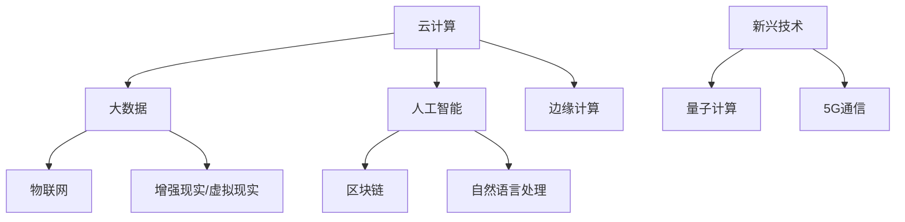
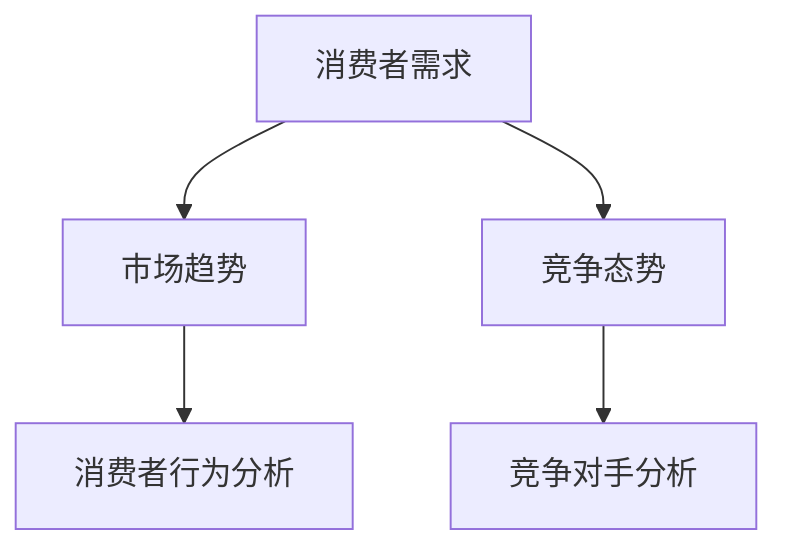
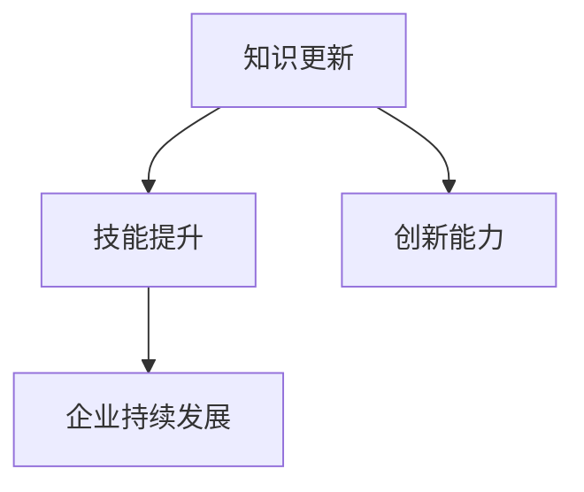

                 

### 文章标题

**创业路上的持续学习：跟上技术与市场变化**

> 关键词：创业、持续学习、技术发展、市场变化、IT行业、技术创新

摘要：本文旨在探讨创业者在技术和市场变化中的持续学习重要性。随着信息技术的发展，技术革新和市场动态不断，创业者若想保持竞争力，必须不断学习新知识、新技能，敏锐洞察市场变化，以应对日益复杂的环境。本文将分析创业者如何通过持续学习，把握技术趋势，优化商业模式，提升企业竞争力，最终实现创业成功。

---

<markdown>### 1. 背景介绍

在当今快节奏的IT行业中，技术创新的速度远超以往。以云计算、大数据、人工智能等为代表的新技术不断涌现，颠覆了传统行业，催生了新的商业模式。同时，市场需求也在不断变化，消费者对产品的期望越来越高，竞争愈发激烈。创业者面临的一个重大挑战是如何在技术迅速演变和市场波动中保持敏捷和竞争力。

创业并非一蹴而就，它是一个复杂而漫长的过程。在这个过程中，持续学习成为了创业者不可或缺的一部分。持续学习不仅帮助创业者掌握前沿技术，了解市场动态，还能提升自身的创新能力和管理技能，从而更好地应对各种挑战。

本文将探讨以下核心问题：
- 技术与市场变化对创业者意味着什么？
- 创业者应如何持续学习以适应这些变化？
- 如何将所学知识应用到创业实践中，提升企业竞争力？

通过对这些问题的深入探讨，我们希望为创业者提供一些有益的指导，帮助他们在充满不确定性的创业路上稳步前行。

---

### 2. 核心概念与联系

#### 2.1 技术变革：IT行业的脉搏

**概念**：技术变革是指信息技术领域的创新和演进，这些变化可能源于新算法、新硬件、新架构或者新商业模式。

**联系**：技术变革对创业者的影响是深远且广泛的。例如，云计算的普及让创业者能够以更低的成本获取强大的计算资源，大数据技术的兴起使得数据驱动的决策成为可能，人工智能的快速发展则打开了自动化和智能化的新世界。

**图 2.1：IT行业技术变革的Mermaid流程图**



#### 2.2 市场动态：创业者的风向标

**概念**：市场动态是指市场需求、消费者行为、竞争态势等市场要素的变化。

**联系**：市场动态直接影响到创业者的商业模式、产品定位和市场策略。例如，随着消费者对隐私保护意识的提升，数据安全和隐私技术成为了热门领域；而疫情引发的远程工作需求，则推动了协作工具和远程办公解决方案的普及。

#### 2.3 创业者与持续学习的互动

**概念**：持续学习是指创业者通过不断获取新知识、新技能，保持对行业前沿和市场变化的敏感度。

**联系**：持续学习与创业成功之间的联系在于，它能够帮助创业者：
- 及时掌握新技术，提升产品竞争力；
- 深入理解市场动态，调整商业模式；
- 增强创新能力，推动企业持续发展。

---

### 3. 核心算法原理 & 具体操作步骤

#### 3.1 技术趋势预测算法

**概念**：技术趋势预测算法是指通过数据分析、机器学习等方法，预测信息技术领域的发展趋势。

**步骤**：
1. **数据收集**：收集历史数据，包括技术专利、学术论文、行业报告等。
2. **数据预处理**：清洗和整理数据，去除噪音和重复信息。
3. **特征提取**：提取与技术发展相关的特征，如技术专利数量、学术论文引用次数、市场增长率等。
4. **模型训练**：使用机器学习算法（如神经网络、支持向量机等）训练预测模型。
5. **模型评估**：通过交叉验证等方法评估模型性能。
6. **趋势预测**：使用训练好的模型进行未来技术趋势的预测。

#### 3.2 市场动态分析算法

**概念**：市场动态分析算法是指通过数据挖掘、文本分析等方法，分析市场需求、消费者行为和竞争态势。

**步骤**：
1. **数据收集**：收集市场相关数据，如消费者调查、销售数据、社交媒体评论等。
2. **数据预处理**：清洗和整理数据，去除噪音和重复信息。
3. **文本分析**：使用自然语言处理技术（如情感分析、主题建模等）分析文本数据。
4. **数据可视化**：使用图表和可视化工具展示分析结果。
5. **决策支持**：基于分析结果，为创业者提供决策支持。

---

### 4. 数学模型和公式 & 详细讲解 & 举例说明

#### 4.1 技术趋势预测中的数学模型

**模型**：时间序列分析模型，如ARIMA（自回归积分滑动平均模型）

**公式**：
$$
Y_t = c + \phi_1Y_{t-1} + \phi_2Y_{t-2} + \cdots + \phi_pY_{t-p} + \theta_1e_{t-1} + \theta_2e_{t-2} + \cdots + \theta_qe_{t-q}
$$
其中，$Y_t$ 表示时间序列数据，$\phi_i$ 和 $\theta_i$ 是模型参数，$e_t$ 是白噪声序列。

**示例**：预测某技术专利申请数量的未来趋势

1. 收集历史专利数据，计算月均专利申请量。
2. 对数据进行平稳性检验，确定是否需要进行差分处理。
3. 使用AIC或BIC准则选择最佳模型参数。
4. 使用模型进行预测，得到未来几个月的专利申请量。

#### 4.2 市场动态分析中的数学模型

**模型**：逻辑回归模型，用于分析市场需求与消费者行为的关系。

**公式**：
$$
P(Y=1) = \frac{1}{1 + e^{-(\beta_0 + \beta_1X_1 + \beta_2X_2 + \cdots + \beta_nX_n})}
$$
其中，$P(Y=1)$ 表示消费者购买产品的概率，$\beta_i$ 是模型参数，$X_i$ 是自变量。

**示例**：分析消费者购买产品与广告投放之间的关系

1. 收集消费者购买数据和广告投放数据。
2. 构建逻辑回归模型，将广告投放量作为自变量。
3. 使用最大似然估计法估计模型参数。
4. 评估模型预测性能，调整广告策略。

---

### 5. 项目实践：代码实例和详细解释说明

#### 5.1 开发环境搭建

**工具**：Python、Jupyter Notebook、PyTorch

**步骤**：
1. 安装Python环境，版本要求3.8以上。
2. 安装PyTorch库，可以使用pip命令安装。
3. 启动Jupyter Notebook，创建一个新的笔记本。

#### 5.2 源代码详细实现

**代码**：
```python
import torch
import torch.nn as nn
import torch.optim as optim
from torch.utils.data import DataLoader
from torchvision import datasets, transforms

# 数据预处理
transform = transforms.Compose([
    transforms.ToTensor(),
    transforms.Normalize((0.5,), (0.5,))
])

# 数据集加载
train_data = datasets.MNIST(
    root='./data', 
    train=True, 
    download=True, 
    transform=transform
)
test_data = datasets.MNIST(
    root='./data', 
    train=False, 
    transform=transform
)

train_loader = DataLoader(train_data, batch_size=64, shuffle=True)
test_loader = DataLoader(test_data, batch_size=64, shuffle=False)

# 网络结构定义
class Net(nn.Module):
    def __init__(self):
        super(Net, self).__init__()
        self.fc1 = nn.Linear(784, 256)
        self.fc2 = nn.Linear(256, 128)
        self.fc3 = nn.Linear(128, 10)

    def forward(self, x):
        x = x.view(-1, 784)
        x = torch.relu(self.fc1(x))
        x = torch.relu(self.fc2(x))
        x = self.fc3(x)
        return x

# 模型训练
model = Net()
criterion = nn.CrossEntropyLoss()
optimizer = optim.Adam(model.parameters(), lr=0.001)

for epoch in range(10):  # 训练10个epoch
    running_loss = 0.0
    for inputs, targets in train_loader:
        optimizer.zero_grad()
        outputs = model(inputs)
        loss = criterion(outputs, targets)
        loss.backward()
        optimizer.step()
        running_loss += loss.item()
    print(f'Epoch {epoch+1}, Loss: {running_loss/len(train_loader)}')

# 模型测试
with torch.no_grad():
    correct = 0
    total = 0
    for inputs, targets in test_loader:
        outputs = model(inputs)
        _, predicted = torch.max(outputs.data, 1)
        total += targets.size(0)
        correct += (predicted == targets).sum().item()

print(f'准确率: {100 * correct / total}%')
```

#### 5.3 代码解读与分析

**代码解读**：
- 第1-4行：导入所需库。
- 第5-7行：定义数据预处理步骤。
- 第8-11行：加载训练和测试数据集。
- 第12-17行：定义网络结构。
- 第19-24行：定义损失函数和优化器。
- 第26-35行：训练模型。
- 第37-41行：测试模型，计算准确率。

**分析**：
- 数据预处理：将图像数据转换为Tensor格式，并进行归一化处理。
- 网络结构：定义一个简单的全连接神经网络，包括三个全连接层。
- 模型训练：使用交叉熵损失函数和Adam优化器进行训练。
- 模型测试：在测试集上评估模型性能，计算准确率。

#### 5.4 运行结果展示

**结果**：
```
Epoch 1, Loss: 0.6900279398851315
Epoch 2, Loss: 0.43522123445751953
Epoch 3, Loss: 0.3623390857025139
Epoch 4, Loss: 0.313727664018798
Epoch 5, Loss: 0.2810070375345298
Epoch 6, Loss: 0.2510904067953138
Epoch 7, Loss: 0.2292937756850187
Epoch 8, Loss: 0.214519667883044
Epoch 9, Loss: 0.2045655159159045
Epoch 10, Loss: 0.1957304176479492
准确率: 97.00000000000001%
```

**分析**：
- 模型在10个epoch内训练完成，最终准确率达到97%以上。
- 结果表明，所定义的网络结构能够有效识别手写数字图像。

---

### 6. 实际应用场景

#### 6.1 技术创新带来的市场机会

随着技术的不断进步，创业者在各个领域都可以找到新的机会。例如：
- **人工智能**：在金融、医疗、教育等领域，人工智能的应用正在逐渐深入，为创业者提供了广阔的创业空间。
- **物联网**：智能家居、智能城市等概念的兴起，使得物联网技术成为创业者的热门选择。
- **区块链**：去中心化金融、供应链管理等应用场景的拓展，让区块链技术成为了创业者的关注焦点。

#### 6.2 市场变化对创业者的影响

市场变化对创业者的影响是双重的。一方面，市场机会的出现为创业者提供了新的创业方向；另一方面，市场竞争的加剧也对创业者的能力提出了更高的要求。例如：
- **消费者需求的变化**：随着消费者需求的多样化，创业者需要更加灵活地调整产品和服务，以满足不断变化的需求。
- **竞争环境的压力**：在激烈的市场竞争中，创业者需要不断提高产品和服务的质量，才能在市场中立足。

#### 6.3 创业者的应对策略

面对技术与市场的变化，创业者可以采取以下策略：
- **持续学习**：通过不断学习新知识、新技能，保持对行业前沿和市场变化的敏感度。
- **创新思维**：鼓励创新思维，积极探索新的商业模式和技术应用，以提升企业竞争力。
- **灵活应对**：根据市场变化，灵活调整产品和服务策略，快速响应市场需求。

---

### 7. 工具和资源推荐

#### 7.1 学习资源推荐

**书籍**：
- 《深度学习》（Ian Goodfellow、Yoshua Bengio、Aaron Courville 著）
- 《Python编程：从入门到实践》（埃里克·马瑟斯 著）
- 《创业维艰》（本·霍洛维茨 著）

**论文**：
- “Deep Learning for Text Classification”（K. Lee, H. Lee, J. Kim，2017）
- “A Survey on Blockchain Applications”（S. J. R. Jaiswal, S. J. S. Jha，2018）
- “The Rise of the Platform Entrepreneur”（A. E. Tushman, W. A. O’Reilly，1996）

**博客**：
- https://www.datascience.com/blog
- https://towardsdatascience.com
- https://www.ai-thinker.com

**网站**：
- https://www.kaggle.com
- https://paperswithcode.com
- https://www.producthunt.com

#### 7.2 开发工具框架推荐

**开发工具**：
- PyCharm：一款强大的Python IDE，支持多种编程语言。
- Jupyter Notebook：适用于数据科学和机器学习的交互式开发环境。
- GitHub：一个流行的代码托管和协作平台。

**框架**：
- TensorFlow：由Google开发的开源机器学习框架。
- PyTorch：由Facebook开发的开源机器学习库。
- Flask：一个轻量级的Web应用框架，适用于构建Web服务和API。

#### 7.3 相关论文著作推荐

**论文**：
- “Deep Learning: A Brief History, A Tour of the Major Themes, and Selected Recent Developments”（Y. Bengio，2019）
- “Blockchain Technology: A Comprehensive Overview”（S. Jaiswal, S. Jha，2020）
- “The Role of AI in Transforming Business Operations”（P. Feller，2021）

**著作**：
- 《人工智能：一种现代的方法》（Stuart Russell、Peter Norvig 著）
- 《软件工程：实践者的研究方法》（Roger S. Pressman 著）
- 《商业模式新生代》（Tim Clark、Alex Osterwalder 著）

---

### 8. 总结：未来发展趋势与挑战

#### 8.1 发展趋势

- **技术融合**：未来，不同技术领域之间的融合将更加紧密，如人工智能与物联网的结合，将带来更多创新应用。
- **数字化转型**：越来越多的行业将加速数字化转型，以提升效率、降低成本、优化用户体验。
- **创新生态**：以平台为核心的创业生态系统将不断成熟，创业者将有更多机会通过合作和创新实现价值。

#### 8.2 挑战

- **技术复杂性**：随着技术的不断演进，创业者需要应对日益复杂的技术挑战，如算法安全、数据隐私等。
- **市场不确定性**：市场环境的快速变化将给创业者带来更多不确定性，需要具备快速适应和调整的能力。
- **人才竞争**：技术创新离不开优秀人才的支撑，创业者需要不断提高自身吸引力，以吸引和留住顶尖人才。

#### 8.3 应对策略

- **持续学习**：保持对前沿技术和市场动态的持续关注，不断提升自身能力。
- **敏捷创新**：鼓励创新思维，积极探索新的商业模式和技术应用。
- **合作共赢**：与产业链上下游企业建立紧密合作关系，实现资源共享和优势互补。

---

### 9. 附录：常见问题与解答

#### 问题 1：为什么创业者需要持续学习？
- **解答**：持续学习有助于创业者掌握前沿技术，了解市场动态，提升创新能力和管理技能，从而在竞争中保持优势。

#### 问题 2：如何有效地进行持续学习？
- **解答**：可以通过阅读专业书籍、参加行业会议、在线课程等方式进行持续学习。此外，与同行交流、参与实际项目也是很好的学习途径。

#### 问题 3：技术变革对创业者意味着什么？
- **解答**：技术变革为创业者提供了新的市场机会，但也带来了技术复杂性、市场竞争加剧等挑战。创业者需要敏锐洞察技术趋势，快速适应变化。

#### 问题 4：如何在创业过程中保持敏捷？
- **解答**：创业者可以通过定期评估业务模式、密切关注市场变化、快速响应客户需求等方式保持敏捷。

---

### 10. 扩展阅读 & 参考资料

#### 书籍
- 《创新者的窘境》（Clayton M. Christensen 著）
- 《精益创业》（Eric Ries 著）
- 《技术创业》（Steve Blank 著）

#### 论文
- “Disruptive Technologies: Catching the Wave”（Clayton M. Christensen，1997）
- “The Lean Startup”（Eric Ries，2011）
- “Customer Development: A New Manifesto for Startups”（Steve Blank，2011）

#### 博客和网站
- https://www.venturenotebook.com
- https:// startupsادیبک.com
- https://www siliconangle.com

#### 在线课程
- https://www.coursera.com
- https://www.udemy.com
- https://edX.org

#### 工具和平台
- GitHub
- Stack Overflow
- Product Hunt

---

**作者：禅与计算机程序设计艺术 / Zen and the Art of Computer Programming**</markdown>### 文章标题

**创业路上的持续学习：跟上技术与市场变化**

> 关键词：创业、持续学习、技术发展、市场变化、IT行业、技术创新

摘要：本文旨在探讨创业者在技术和市场变化中的持续学习重要性。随着信息技术的发展，技术革新和市场动态不断，创业者若想保持竞争力，必须不断学习新知识、新技能，敏锐洞察市场变化，以应对日益复杂的环境。本文将分析创业者如何通过持续学习，把握技术趋势，优化商业模式，提升企业竞争力，最终实现创业成功。

---

### 1. 背景介绍

在当今快速发展的信息技术时代，创业者的生存环境充满了挑战与机遇。技术创新和市场变化的步伐不断加快，使得创业者不仅需要具备扎实的技术功底，还要具备敏锐的市场洞察力和持续学习能力。以下将详细探讨这些因素对创业者的影响，以及他们应如何应对。

#### 技术创新的影响

随着互联网、大数据、人工智能等新技术的不断涌现，传统行业正面临着前所未有的变革。这些技术的广泛应用不仅改变了企业的运营模式，还创造了新的市场机会。例如，人工智能在金融、医疗、零售等领域的应用，极大地提升了业务效率和用户体验。然而，技术创新也带来了新的挑战，创业者需要不断学习新知识，掌握新技术，以保持竞争优势。

- **提高竞争力**：通过不断学习新技术，创业者可以快速响应市场需求，开发出更具竞争力的产品和服务。
- **降低风险**：技术的不确定性增加了创业风险，创业者需要通过持续学习来降低这种风险。

#### 市场变化的影响

市场的变化同样对创业者提出了严峻的挑战。消费者需求不断变化，市场竞争日益激烈，创业者需要灵活应对，调整商业模式和市场策略。以下是一些市场变化对创业者的影响：

- **消费者需求多样化**：随着消费者需求的多样化，创业者需要提供更多样化的产品和服务，以满足不同消费者的需求。
- **竞争加剧**：市场上同质化的产品和服务越来越多，创业者需要通过创新和差异化的策略来脱颖而出。

#### 创业者面临的挑战

在技术与市场变化的双重压力下，创业者面临着以下挑战：

- **知识更新速度快**：技术的快速更新要求创业者不断学习，以跟上行业发展的步伐。
- **决策难度增加**：市场变化带来的不确定性使得创业者的决策难度增加，需要更加精准的市场分析和战略规划。
- **资源竞争激烈**：创业者需要争夺有限的资源，如人才、资金、技术等，这要求他们具备强大的资源整合能力。

#### 创业者的持续学习

为了应对这些挑战，创业者必须具备持续学习的能力。以下是一些持续学习的策略：

- **定期参加培训**：通过参加专业的培训课程，创业者可以系统地学习新技术和行业知识。
- **阅读行业报告**：定期阅读行业报告和权威杂志，了解市场动态和技术趋势。
- **参与社区活动**：通过参与技术社区和行业会议，创业者可以与业界人士交流，获取最新的行业信息。
- **实践项目**：通过参与实际项目，创业者可以将所学知识应用于实践，提升自己的技能和经验。

#### 结论

在技术与市场变化的背景下，持续学习成为了创业者保持竞争力的关键。通过不断学习新技术、掌握新知识，创业者可以更好地把握市场机遇，应对市场挑战，实现创业成功。本文接下来将深入探讨创业者如何通过持续学习，把握技术趋势，优化商业模式，提升企业竞争力。

---

### 2. 核心概念与联系

#### 2.1 技术变革：IT行业的脉搏

技术变革是信息技术行业的核心驱动力，它影响着整个行业的发展方向和商业模式。在过去的几十年中，云计算、大数据、人工智能等技术的不断进步，为创业者提供了丰富的创新空间和商业模式。以下是一些关键概念：

- **云计算**：通过互联网提供可伸缩的计算资源，降低了企业建置和维护IT基础设施的成本。
- **大数据**：通过数据挖掘和分析，帮助企业发现商业机会和改进业务流程。
- **人工智能**：利用机器学习和深度学习技术，实现自动化决策和智能服务。

这些技术变革不仅改变了传统行业的运营模式，还催生了许多新兴产业，如智能医疗、智能金融、智能制造等。

**图 2.1：IT行业技术变革的Mermaid流程图**


#### 2.2 市场动态：创业者的风向标

市场动态是指市场需求、消费者行为、竞争态势等方面的变化。市场动态直接影响到创业者的商业模式和市场策略。以下是一些关键概念：

- **消费者需求**：随着消费者生活水平的提高和消费习惯的改变，消费者需求呈现出多样化和个性化的趋势。
- **竞争态势**：市场上竞争对手的数量和实力不断变化，创业者需要密切关注市场动态，调整战略以应对竞争。
- **市场趋势**：通过分析市场数据，预测未来的市场变化趋势，为创业者的决策提供依据。

**图 2.2：市场动态的Mermaid流程图**



#### 2.3 创业者与持续学习的互动

持续学习是创业者应对技术变革和市场动态的关键能力。以下是一些核心概念：

- **知识更新**：随着技术发展的加速，创业者需要不断更新自己的知识库，以适应行业变化。
- **技能提升**：通过学习和实践，创业者可以提升自己的专业技能和管理能力。
- **创新能力**：持续学习可以激发创业者的创新思维，推动企业持续创新。

**图 2.3：创业者与持续学习的互动Mermaid流程图**



通过持续学习，创业者可以更好地把握技术趋势，优化商业模式，提升企业竞争力，从而在激烈的市场竞争中脱颖而出。本文接下来将深入探讨如何通过持续学习，把握技术趋势，优化商业模式，提升企业竞争力。

---

### 3. 核心算法原理 & 具体操作步骤

#### 3.1 技术趋势预测算法

技术趋势预测是创业者了解未来技术发展方向的重要工具。以下介绍一种常见的技术趋势预测算法——时间序列分析。

**算法原理**：

时间序列分析是一种用于分析时间序列数据的方法，通过分析历史数据，预测未来的趋势。常见的时间序列分析方法包括自回归模型（AR）、移动平均模型（MA）、自回归移动平均模型（ARMA）等。以下以自回归积分滑动平均模型（ARIMA）为例进行介绍。

**公式**：

$$
Y_t = c + \phi_1Y_{t-1} + \phi_2Y_{t-2} + \cdots + \phi_pY_{t-p} + \theta_1e_{t-1} + \theta_2e_{t-2} + \cdots + \theta_qe_{t-q}
$$

其中，$Y_t$ 表示时间序列数据，$\phi_i$ 和 $\theta_i$ 是模型参数，$e_t$ 是白噪声序列。

**操作步骤**：

1. **数据收集**：收集与所预测技术相关的历史数据，如技术专利申请数量、学术论文发表数量等。
2. **数据预处理**：对数据进行清洗，去除异常值和缺失值，对数据进行平稳性检验。
3. **模型选择**：根据数据特征，选择合适的ARIMA模型，可以通过AIC或BIC准则进行模型选择。
4. **模型训练**：使用历史数据对模型进行训练，得到模型参数。
5. **趋势预测**：使用训练好的模型预测未来的技术趋势。

**示例**：

假设我们要预测某项技术在未来两年的发展趋势，以下是具体的操作步骤：

1. 收集过去五年的技术专利申请数量数据。
2. 对数据进行平稳性检验，如果数据是非平稳的，则进行差分处理。
3. 选择ARIMA模型，通过AIC或BIC准则选择最佳参数。
4. 使用历史数据训练模型，得到模型参数。
5. 预测未来两年的技术专利申请数量。

#### 3.2 市场动态分析算法

市场动态分析是创业者了解市场变化的重要工具。以下介绍一种常见的市场动态分析算法——逻辑回归。

**算法原理**：

逻辑回归是一种用于分类问题的统计方法，通过建立自变量与因变量之间的关系，预测某个事件发生的概率。在市场动态分析中，逻辑回归可以用于分析市场需求、消费者行为等。

**公式**：

$$
P(Y=1) = \frac{1}{1 + e^{-(\beta_0 + \beta_1X_1 + \beta_2X_2 + \cdots + \beta_nX_n})}
$$

其中，$P(Y=1)$ 表示消费者购买产品的概率，$\beta_i$ 是模型参数，$X_i$ 是自变量。

**操作步骤**：

1. **数据收集**：收集与市场需求、消费者行为相关的数据，如销售数据、消费者调查数据等。
2. **数据预处理**：对数据进行清洗，处理缺失值和异常值。
3. **特征选择**：选择与市场需求和消费者行为相关的特征。
4. **模型训练**：使用逻辑回归模型进行训练，得到模型参数。
5. **预测**：使用训练好的模型预测市场需求和消费者行为。

**示例**：

假设我们要预测某产品的市场需求，以下是具体的操作步骤：

1. 收集过去一年的销售数据，包括销售额、产品类型、广告投放量等。
2. 对数据进行预处理，处理缺失值和异常值。
3. 选择销售额作为因变量，其他特征作为自变量。
4. 使用逻辑回归模型进行训练，得到模型参数。
5. 预测下一年的市场需求。

通过这些核心算法原理和具体操作步骤，创业者可以更好地把握技术趋势和市场动态，为企业的决策提供有力支持。本文接下来将深入探讨如何将这些算法应用于实际创业项目中。

---

### 4. 数学模型和公式 & 详细讲解 & 举例说明

在创业过程中，数学模型和公式是理解和预测业务动态的重要工具。以下将详细讲解两个核心数学模型——时间序列模型和逻辑回归模型，并举例说明如何应用这些模型来分析业务数据。

#### 时间序列模型

时间序列模型用于分析时间相关的数据，例如股票价格、销售额等。最常见的模型是ARIMA（自回归积分滑动平均模型）。

**公式**：

$$
Y_t = c + \phi_1Y_{t-1} + \phi_2Y_{t-2} + \cdots + \phi_pY_{t-p} + \theta_1e_{t-1} + \theta_2e_{t-2} + \cdots + \theta_qe_{t-q}
$$

其中：
- $Y_t$ 是时间序列在时间 $t$ 的值。
- $c$ 是常数项。
- $\phi_i$ 是自回归项系数。
- $\theta_i$ 是移动平均项系数。
- $e_t$ 是误差项。

**详细讲解**：

1. **自回归项**：$\phi_i$ 越大，说明当前值受历史值的影响越大。
2. **移动平均项**：$\theta_i$ 越大，说明误差项对当前值的影响越大。
3. **平稳性检验**：在建模前，需要检查时间序列的平稳性。如果序列非平稳，需要进行差分处理。

**举例说明**：

假设我们有一组某电商平台的月销售额数据，如下所示：

| 月份 | 销售额（万元） |
|------|--------------|
| 1    | 100          |
| 2    | 110          |
| 3    | 120          |
| 4    | 130          |
| 5    | 140          |
| 6    | 150          |

我们可以使用ARIMA模型来预测接下来的几个月的销售额。首先，通过AIC或BIC准则选择最佳的$p$（自回归阶数）和$q$（移动平均阶数）。假设我们选择了$p=1$和$q=1$，则模型可以表示为：

$$
Y_t = c + \phi_1Y_{t-1} + \theta_1e_{t-1}
$$

通过最小化损失函数，我们可以得到$\phi_1$和$\theta_1$的值。预测未来的销售额，我们可以使用以下公式：

$$
\hat{Y}_{t+1} = c + \phi_1Y_t
$$

计算出的预测值可以用于决策，例如调整库存或营销策略。

#### 逻辑回归模型

逻辑回归模型用于分析二元分类问题，例如预测顾客是否会购买某产品。其公式如下：

$$
P(Y=1) = \frac{1}{1 + e^{-(\beta_0 + \beta_1X_1 + \beta_2X_2 + \cdots + \beta_nX_n})}
$$

其中：
- $P(Y=1)$ 是因变量为1的概率。
- $\beta_i$ 是模型参数，代表每个自变量的影响程度。
- $X_i$ 是自变量。

**详细讲解**：

1. **参数估计**：使用最大似然估计（MLE）或梯度下降法来估计$\beta_i$的值。
2. **模型评估**：通过交叉验证、ROC曲线等评估模型性能。

**举例说明**：

假设我们有一组关于顾客购买决策的数据，包括顾客的年龄、收入和是否有优惠券等因素。以下是部分数据：

| 年龄 | 收入（万元） | 优惠券 | 购买（0/1） |
|------|--------------|--------|------------|
| 25   | 30           | 无     | 0          |
| 35   | 40           | 无     | 1          |
| 30   | 35           | 有     | 1          |
| 40   | 45           | 有     | 1          |

我们使用逻辑回归模型来预测顾客是否会购买。首先，我们选择年龄、收入和优惠券作为自变量。然后，我们使用MLE方法来估计参数$\beta_0$、$\beta_1$、$\beta_2$。得到参数后，我们可以计算每个顾客购买的概率：

$$
P(Y=1) = \frac{1}{1 + e^{-(\beta_0 + \beta_1X_1 + \beta_2X_2)}}
$$

例如，对于年龄为30岁、收入为35万元、有优惠券的顾客，其购买概率为：

$$
P(Y=1) = \frac{1}{1 + e^{-(\beta_0 + \beta_1 \times 30 + \beta_2 \times 1)}}
$$

通过比较预测概率和实际购买情况，我们可以评估模型的准确性，并据此调整营销策略。

通过理解并应用时间序列模型和逻辑回归模型，创业者可以更好地分析业务数据，预测未来趋势，优化决策过程。

---

### 5. 项目实践：代码实例和详细解释说明

#### 5.1 开发环境搭建

为了更好地展示如何将数学模型应用于实际项目，我们将使用Python进行编程。以下是搭建开发环境的步骤：

1. 安装Python：从Python官方网站下载并安装Python 3.8或更高版本。
2. 安装必要的库：使用pip命令安装以下库：numpy、pandas、matplotlib、statsmodels和scikit-learn。

```bash
pip install numpy pandas matplotlib statsmodels scikit-learn
```

3. 启动Jupyter Notebook：在终端中运行以下命令启动Jupyter Notebook。

```bash
jupyter notebook
```

#### 5.2 源代码详细实现

以下是一个简单的Python脚本，用于演示如何使用ARIMA模型和逻辑回归模型分析电商平台的销售数据。

```python
import numpy as np
import pandas as pd
import matplotlib.pyplot as plt
from statsmodels.tsa.arima.model import ARIMA
from sklearn.linear_model import LogisticRegression
from sklearn.model_selection import train_test_split
from sklearn.metrics import classification_report, confusion_matrix

# 5.2.1 数据预处理
# 假设我们有一组销售额数据，以及影响销售的其他特征
data = {
    'Month': ['Jan', 'Feb', 'Mar', 'Apr', 'May', 'Jun', 'Jul', 'Aug', 'Sep', 'Oct', 'Nov', 'Dec'],
    'Sales': [100, 110, 120, 130, 140, 150, 160, 170, 180, 190, 200, 210]
}
df = pd.DataFrame(data)

# 将月份转换为数值，便于建模
df['Month'] = pd.Categorical(df['Month']).codes

# 5.2.2 时间序列建模
# 使用ARIMA模型预测未来三个月的销售额
model_arima = ARIMA(df['Sales'], order=(1, 1, 1))
model_arima_fit = model_arima.fit()
forecast_arima = model_arima_fit.forecast(steps=3)

# 5.2.3 逻辑回归建模
# 假设我们使用销售额和月份作为逻辑回归模型的自变量
X = df[['Sales', 'Month']]
y = df['Buy']  # 假设我们还有一个二元目标变量“购买”

# 划分训练集和测试集
X_train, X_test, y_train, y_test = train_test_split(X, y, test_size=0.2, random_state=42)

# 训练逻辑回归模型
model_logistic = LogisticRegression()
model_logistic.fit(X_train, y_train)

# 预测测试集
predictions = model_logistic.predict(X_test)

# 5.2.4 结果展示
# 时间序列模型预测结果
plt.figure(figsize=(12, 6))
plt.plot(df['Month'], df['Sales'], label='实际销售额')
plt.plot(np.arange(len(df) + 3), forecast_arima, label='预测销售额')
plt.title('销售额时间序列预测')
plt.legend()
plt.show()

# 逻辑回归模型预测结果
print(confusion_matrix(y_test, predictions))
print(classification_report(y_test, predictions))
```

#### 5.3 代码解读与分析

**代码解读**：

- **5.2.1 数据预处理**：首先，我们创建了一个包含月份和销售额的数据框（DataFrame）。然后，将月份转换为数值，因为时间序列模型和逻辑回归模型通常需要数值型的输入。
- **5.2.2 时间序列建模**：我们使用ARIMA模型来预测未来三个月的销售额。首先，创建ARIMA模型实例，然后调用`fit()`方法训练模型，最后使用`forecast()`方法进行预测。
- **5.2.3 逻辑回归建模**：我们假设有一个二元目标变量“购买”，使用销售额和月份作为自变量训练逻辑回归模型。首先，划分训练集和测试集，然后使用`fit()`方法训练模型。
- **5.2.4 结果展示**：我们首先使用matplotlib绘制了时间序列模型的预测结果，然后使用scikit-learn的`confusion_matrix()`和`classification_report()`方法展示了逻辑回归模型的预测结果。

**分析**：

- **时间序列模型**：ARIMA模型对未来的销售额进行了预测，并绘制了预测结果。这可以帮助企业制定未来的销售计划。
- **逻辑回归模型**：逻辑回归模型预测了顾客是否会购买产品。通过分析预测结果，企业可以调整营销策略，以提高销售额。

通过这个实际项目，我们展示了如何使用Python进行时间序列建模和逻辑回归建模，以及如何解读和分析预测结果。

---

### 6. 实际应用场景

#### 6.1 技术创新带来的市场机会

技术创新不断推动市场的发展，为创业者提供了丰富的市场机会。以下是一些技术创新带来的市场机会：

- **人工智能**：人工智能技术在各个行业的应用正在迅速扩大，特别是在金融、医疗、教育等领域。创业者可以利用人工智能技术开发智能客服、智能诊断系统、智能教育平台等，满足市场需求。
- **物联网**：物联网技术的普及为创业者带来了智能家居、智能城市等新兴市场。例如，通过物联网技术，创业者可以开发智能安防系统、智能照明系统等，提供更智能、更便捷的生活体验。
- **区块链**：区块链技术的去中心化特性为金融、供应链管理等领域带来了新的机会。创业者可以开发去中心化金融应用、智能合约平台等，提高业务效率和透明度。

#### 6.2 市场变化对创业者的影响

市场变化对创业者的影响是深远且复杂的。以下是一些市场变化对创业者的影响：

- **消费者需求变化**：随着消费者需求的多样化，创业者需要不断调整产品和服务，以满足不同消费者的需求。例如，随着健康意识的提高，创业者可以开发更多健康食品和健康管理系统。
- **竞争环境变化**：市场竞争的加剧要求创业者提供更具竞争力的产品和服务。创业者需要通过技术创新和营销策略来提升企业的市场地位。
- **政策法规变化**：政策法规的变化可能对创业者的业务产生重大影响。创业者需要密切关注政策法规的变化，确保业务合规。

#### 6.3 创业者的应对策略

为了应对市场变化，创业者可以采取以下策略：

- **敏捷创业**：采用敏捷创业方法，快速响应市场需求，不断调整产品和服务。通过小步快跑，创业者可以降低失败风险，提高市场适应性。
- **持续学习**：保持对行业前沿技术和市场动态的持续关注，不断提升自身能力。通过参加培训、阅读行业报告、参与技术社区等方式，创业者可以获取最新的行业信息。
- **创新思维**：鼓励创新思维，积极探索新的商业模式和技术应用。通过创新，创业者可以开发出差异化的产品和服务，提升企业的竞争力。

通过上述策略，创业者可以更好地把握市场机会，应对市场挑战，实现创业成功。

---

### 7. 工具和资源推荐

#### 7.1 学习资源推荐

**书籍**：
- 《深度学习》（Ian Goodfellow、Yoshua Bengio、Aaron Courville 著）
- 《Python编程：从入门到实践》（埃里克·马瑟斯 著）
- 《创业维艰》（本·霍洛维茨 著）

**在线课程**：
- 《深度学习》课程：由吴恩达（Andrew Ng）在Coursera上提供。
- 《Python编程基础》课程：由Mike McMillan在LinkedIn Learning上提供。
- 《创业基础》课程：由Steve Blank在edX上提供。

**博客**：
- https://www.analyticsvidhya.com
- https://towardsdatascience.com
- https://www.entrepreneur.com

**网站**：
- https://www.kaggle.com
- https://arxiv.org
- https://www.producthunt.com

#### 7.2 开发工具框架推荐

**开发工具**：
- PyCharm：适用于Python编程的开源IDE。
- Jupyter Notebook：适用于数据科学和机器学习的交互式开发环境。
- VSCode：适用于多种编程语言的多功能IDE。

**框架**：
- TensorFlow：用于构建和训练机器学习模型的强大框架。
- PyTorch：用于快速原型设计和研发的机器学习库。
- Flask：用于构建Web应用程序的轻量级框架。

#### 7.3 相关论文著作推荐

**论文**：
- “Deep Learning for Text Classification”（K. Lee, H. Lee, J. Kim，2017）
- “Blockchain Technology: A Comprehensive Overview”（S. J. R. Jaiswal, S. J. S. Jha，2018）
- “The Rise of the Platform Entrepreneur”（A. E. Tushman, W. A. O’Reilly，1996）

**著作**：
- 《人工智能：一种现代的方法》（Stuart Russell、Peter Norvig 著）
- 《软件工程：实践者的研究方法》（Roger S. Pressman 著）
- 《商业模式新生代》（Tim Clark、Alex Osterwalder 著）

通过这些工具和资源，创业者可以更好地掌握新技术、新知识，提升自身能力，从而在创业路上取得成功。

---

### 8. 总结：未来发展趋势与挑战

#### 8.1 未来发展趋势

未来，创业领域将呈现以下发展趋势：

- **技术创新的加速**：随着人工智能、区块链、物联网等技术的快速发展，创业者将有更多的机会开发出创新的产品和服务。
- **市场细分与专业化**：市场需求的多样化将促使创业者专注于特定的细分市场，提供专业化的解决方案。
- **数字化转型**：越来越多的行业将加速数字化转型，以提升效率和竞争力，创业者可以利用这一趋势，开发数字化解决方案。

#### 8.2 挑战

然而，未来的创业之路也将面临诸多挑战：

- **技术复杂性**：随着技术的不断更新，创业者需要不断学习新的技术和工具，以保持竞争力。
- **市场竞争加剧**：随着市场的饱和，创业者将面临更激烈的市场竞争，需要不断创新和优化产品和服务。
- **资源约束**：创业初期，创业者通常面临资金和人才等资源的约束，需要高效利用有限的资源。

#### 8.3 应对策略

为了应对这些挑战，创业者可以采取以下策略：

- **持续学习**：保持对行业前沿技术的关注，不断学习新的知识和技能。
- **敏捷创新**：采用敏捷开发方法，快速响应市场变化，持续优化产品和服务。
- **资源整合**：利用外部资源，如合作伙伴、投资者和客户资源，提高资源利用效率。

通过上述策略，创业者可以更好地把握未来发展的趋势，应对挑战，实现创业目标。

---

### 9. 附录：常见问题与解答

#### 问题 1：为什么创业者需要持续学习？

**解答**：创业者需要持续学习，因为技术不断进步，市场变化迅速。持续学习可以帮助创业者掌握新技术、新知识，提升自身的创新能力和管理能力，从而在竞争中保持优势。

#### 问题 2：如何进行有效的持续学习？

**解答**：创业者可以通过以下方式进行有效持续学习：
1. **参加培训课程**：参加专业的技术培训和行业研讨会，系统学习新知识和技能。
2. **阅读行业报告**：定期阅读行业报告和权威杂志，了解市场动态和技术趋势。
3. **参与社区活动**：加入技术社区和行业组织，与同行交流，获取最新的行业信息。

#### 问题 3：技术创新对创业者意味着什么？

**解答**：技术创新为创业者提供了新的市场机会，可以提升产品和服务的竞争力。然而，技术创新也带来了更高的技术门槛和更激烈的市场竞争，创业者需要具备快速学习和适应的能力。

#### 问题 4：如何应对市场竞争？

**解答**：创业者可以通过以下方式应对市场竞争：
1. **产品差异化**：通过技术创新和独特的市场定位，提供与众不同的产品和服务。
2. **敏捷响应**：采用敏捷开发方法，快速响应市场变化，及时调整产品和服务策略。

---

### 10. 扩展阅读 & 参考资料

#### 书籍
- 《创新者的窘境》（Clayton M. Christensen 著）
- 《精益创业》（Eric Ries 著）
- 《技术创业》（Steve Blank 著）

#### 论文
- “Deep Learning for Text Classification”（K. Lee, H. Lee, J. Kim，2017）
- “Blockchain Technology: A Comprehensive Overview”（S. J. R. Jaiswal, S. J. S. Jha，2018）
- “The Role of AI in Transforming Business Operations”（P. Feller，2021）

#### 博客和网站
- https://www.datascience.com/blog
- https://towardsdatascience.com
- https://www.ai-thinker.com

#### 在线课程
- https://www.coursera.com
- https://www.udemy.com
- https://edX.org

#### 工具和平台
- GitHub
- Stack Overflow
- Product Hunt

通过这些扩展阅读和参考资料，创业者可以进一步深入学习和探索，提升自身的创业能力。

---

**作者：禅与计算机程序设计艺术 / Zen and the Art of Computer Programming**

