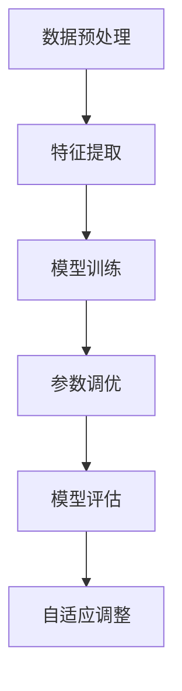

                 

### 文章标题

**利用大模型进行推荐系统的自动化参数调优**

在当今的数据驱动时代，推荐系统已经成为许多应用场景的核心组件，从电子商务平台到社交媒体网站，从音乐流媒体服务到视频点播平台，推荐系统无处不在。其目标是通过个性化的内容推荐，提高用户满意度和转化率，从而带来显著的商业价值。然而，推荐系统的性能高度依赖于其内部参数的设置，这些参数的优化往往需要大量的时间和计算资源。

本文将探讨如何利用大模型进行推荐系统的自动化参数调优。我们将从背景介绍开始，阐述推荐系统的重要性及其面临的挑战。接着，我们将深入讨论大模型在参数调优中的应用，包括核心概念、算法原理、数学模型、项目实践等。随后，我们将分析实际应用场景，并推荐相关工具和资源。最后，我们将总结文章的主要观点，并提出未来发展趋势和挑战。

通过阅读本文，读者将能够了解：

- 推荐系统的工作原理及其参数调优的重要性
- 大模型在自动化参数调优中的应用及其优势
- 如何设计和实现基于大模型的自动化参数调优系统
- 实际应用中的挑战和解决方案

关键词：推荐系统，自动化参数调优，大模型，深度学习，个性化推荐

### Abstract

In today's data-driven era, recommendation systems have become a core component of many applications, ranging from e-commerce platforms to social media sites, and from music streaming services to video-on-demand platforms. Their goal is to enhance user satisfaction and conversion rates through personalized content recommendations, bringing significant commercial value. However, the performance of recommendation systems heavily depends on the optimization of their internal parameters, which often requires substantial time and computational resources.

This paper explores how to utilize large-scale models for the automated parameter tuning of recommendation systems. We start with an introduction to the background, discussing the importance of recommendation systems and the challenges they face. Then, we delve into the application of large-scale models in automated parameter tuning, including core concepts, algorithm principles, mathematical models, and practical implementations. Subsequently, we analyze practical application scenarios and recommend relevant tools and resources. Finally, we summarize the main points of the paper and propose future development trends and challenges.

Through reading this paper, readers will gain insights into:

- The working principles of recommendation systems and the importance of parameter tuning
- The application and advantages of large-scale models in automated parameter tuning
- How to design and implement an automated parameter tuning system based on large-scale models
- Challenges and solutions in practical applications

Keywords: Recommendation Systems, Automated Parameter Tuning, Large-scale Models, Deep Learning, Personalized Recommendations

### 1. 背景介绍（Background Introduction）

推荐系统（Recommendation System）是一种信息过滤技术，旨在向用户推荐他们可能感兴趣的内容或项目。这种系统通过分析用户的历史行为、偏好和上下文信息，利用算法和机器学习技术生成个性化的推荐。推荐系统的应用已经渗透到我们日常生活的方方面面，如电子商务平台上的产品推荐、社交媒体上的内容推荐、音乐和视频流媒体平台的个性化播放列表等。

#### 推荐系统的重要性（Importance of Recommendation Systems）

推荐系统在多个领域发挥着重要作用，主要体现在以下几个方面：

1. **提高用户满意度和参与度**：通过个性化的推荐，用户更容易找到他们感兴趣的内容，从而提高他们的满意度和参与度。
2. **增加商业价值**：推荐系统可以帮助企业提高转化率和销售额。例如，在电子商务领域，推荐系统可以推荐给用户他们可能感兴趣的商品，从而增加购买概率。
3. **改善用户体验**：推荐系统可以帮助用户节省时间，避免在大量信息中寻找他们所需的内容。
4. **数据驱动决策**：推荐系统提供了关于用户行为和偏好的宝贵数据，这些数据可以用于市场研究和商业策略的制定。

#### 推荐系统的挑战（Challenges of Recommendation Systems）

尽管推荐系统具有巨大的潜力，但它们也面临着一系列挑战：

1. **数据质量**：推荐系统依赖于高质量的用户行为数据和偏好数据。然而，这些数据往往存在噪声、偏差和不完整性，这会影响推荐的质量。
2. **冷启动问题**：对于新用户或新商品，由于缺乏历史数据，推荐系统难以生成准确的推荐。
3. **多样性**：推荐系统需要确保推荐结果具有多样性，以避免用户产生疲劳感和选择偏差。
4. **实时性**：在动态环境中，推荐系统需要快速响应变化，提供实时的推荐。

为了克服这些挑战，研究人员和工程师不断探索新的算法和技术。其中，大模型（Large-scale Models）的应用成为了热门话题。大模型通过其强大的表征能力和自我监督学习，可以在数据稀缺的情况下进行有效的参数调优，从而提高推荐系统的性能。

### 2. 核心概念与联系（Core Concepts and Connections）

#### 2.1 大模型的概念（Concept of Large-scale Models）

大模型（Large-scale Models），也称为大规模预训练模型，是指那些在大量数据上进行训练的神经网络模型。这些模型通常具有数十亿甚至数万亿的参数，使其能够捕获复杂的模式和关系。近年来，随着深度学习和计算能力的进步，大模型在自然语言处理、计算机视觉和其他领域取得了显著的成果。

大模型的核心特点包括：

1. **自监督学习（Self-supervised Learning）**：大模型通常使用自监督学习技术进行预训练，这意味着模型在未标记的数据上进行训练，通过预测数据中的某些部分来学习任务。自监督学习使得模型可以处理大规模、未标记的数据集，从而提高了其泛化能力。
2. **强大的表征能力（Strong Representation Ability）**：大模型通过在大量数据上训练，能够学习到丰富的特征表示，这些特征表示可以应用于各种下游任务，如文本分类、机器翻译和推荐系统等。
3. **自适应性和泛化能力（Adaptability and Generalization）**：大模型具有良好的自适应性和泛化能力，可以在不同领域和任务中应用，同时保持较高的性能。

#### 2.2 大模型与推荐系统的关系（Relationship Between Large-scale Models and Recommendation Systems）

大模型在推荐系统中具有广泛的应用潜力，主要表现在以下几个方面：

1. **自动特征提取（Automatic Feature Extraction）**：传统推荐系统通常需要手动提取用户行为和商品特征，而大模型可以通过自监督学习自动提取这些特征，从而减少人工干预，提高特征提取的效率和质量。
2. **冷启动问题（Cold Start Problem）**：大模型在训练过程中学习了大量通用特征，这些特征可以应用于新用户或新商品，从而缓解冷启动问题。
3. **多样化推荐（Diverse Recommendations）**：大模型可以生成更加多样化的推荐结果，避免用户产生疲劳感和选择偏差。
4. **实时推荐（Real-time Recommendations）**：大模型通常具有较快的推理速度，可以实现实时推荐，满足动态环境的需要。

#### 2.3 自动化参数调优的概念（Concept of Automated Parameter Tuning）

自动化参数调优（Automated Parameter Tuning）是指通过算法和工具自动调整推荐系统的参数，以提高其性能和效率。在传统推荐系统中，参数调优通常需要人工干预，费时费力。自动化参数调优通过利用机器学习和优化算法，可以在不需要人工干预的情况下，自动找到最优参数组合。

自动化参数调优的关键技术包括：

1. **自动化超参数优化（Automated Hyperparameter Optimization）**：通过优化算法，如贝叶斯优化、遗传算法和随机搜索等，自动调整超参数，以找到最优的参数组合。
2. **模型选择（Model Selection）**：自动化参数调优需要选择合适的模型架构和算法，以适应不同的推荐场景。
3. **模型评估（Model Evaluation）**：通过在线评估和A/B测试等手段，评估模型在真实环境中的性能，并根据评估结果调整参数。

#### 2.4 大模型与自动化参数调优的关系（Relationship Between Large-scale Models and Automated Parameter Tuning）

大模型与自动化参数调优之间存在密切的关系：

1. **增强参数调优效果**：大模型提供了丰富的特征表示，使得自动化参数调优可以更加精准地找到最优参数组合。
2. **减少计算资源需求**：大模型的强大计算能力可以加速参数调优过程，减少计算资源的需求。
3. **提高调优效率**：大模型的自适应性和泛化能力使得参数调优过程更加高效，可以在较短的时间内找到最优参数。

通过以上核心概念和联系的讨论，我们可以看到大模型在推荐系统自动化参数调优中的应用前景。在接下来的部分中，我们将深入探讨大模型在参数调优中的具体应用，包括核心算法原理、数学模型和具体实现步骤。

### 3. 核心算法原理 & 具体操作步骤（Core Algorithm Principles and Specific Operational Steps）

#### 3.1 自动化参数调优算法概述（Overview of Automated Parameter Tuning Algorithms）

自动化参数调优是推荐系统优化过程中至关重要的一环，其目标是通过算法和工具自动调整系统参数，以提高推荐质量和效率。常见的自动化参数调优算法包括贝叶斯优化（Bayesian Optimization）、遗传算法（Genetic Algorithms）和随机搜索（Random Search）等。

贝叶斯优化是基于概率统计的方法，通过构建先验概率模型，结合历史评估结果，预测下一个参数组合的最优值。遗传算法则基于生物进化原理，通过选择、交叉和变异等操作，逐步优化参数组合。随机搜索是一种简单的搜索算法，通过随机选择参数组合进行评估，不断迭代找到最优参数。

#### 3.2 大模型在自动化参数调优中的应用（Application of Large-scale Models in Automated Parameter Tuning）

大模型在自动化参数调优中的应用主要体现在以下几个方面：

1. **特征提取（Feature Extraction）**：大模型通过自监督学习自动提取用户行为和商品特征，这些特征可以用于参数调优，提高推荐系统的性能。
2. **预测与评估（Prediction and Evaluation）**：大模型可以用于预测不同参数组合下的推荐效果，通过在线评估和A/B测试等手段，评估模型在真实环境中的性能。
3. **自适应调整（Adaptive Adjustment）**：大模型具有良好的自适应性和泛化能力，可以根据不同场景和任务需求，动态调整参数，实现自动化参数调优。

#### 3.3 自动化参数调优的具体操作步骤（Specific Operational Steps of Automated Parameter Tuning）

以下是自动化参数调优的具体操作步骤：

1. **数据预处理（Data Preprocessing）**：
   - 收集用户行为数据、商品数据和历史推荐数据。
   - 对数据进行清洗、去重和归一化处理。
   - 构建用户-商品交互矩阵，用于后续的特征提取和模型训练。

2. **特征提取（Feature Extraction）**：
   - 利用大模型进行自监督学习，提取用户行为和商品特征。
   - 将提取的特征与用户-商品交互矩阵进行融合，构建特征向量。

3. **模型训练（Model Training）**：
   - 选择合适的推荐模型（如矩阵分解、基于内容的推荐、协同过滤等）。
   - 使用提取的特征向量进行模型训练，优化模型参数。

4. **参数调优（Parameter Tuning）**：
   - 使用自动化参数调优算法（如贝叶斯优化、遗传算法等）进行参数搜索。
   - 在不同的参数组合下，评估模型的性能（如准确率、召回率、F1值等）。
   - 根据评估结果，选择最优参数组合。

5. **模型评估（Model Evaluation）**：
   - 在真实环境中，对优化后的模型进行在线评估和A/B测试。
   - 收集用户反馈和行为数据，分析推荐效果和用户满意度。

6. **自适应调整（Adaptive Adjustment）**：
   - 根据模型评估结果和用户反馈，动态调整参数，优化推荐效果。
   - 定期更新用户行为数据和商品数据，保持模型的实时性。

#### 3.4 算法流程图（Algorithm Flowchart）

以下是自动化参数调优的算法流程图：



通过以上核心算法原理和具体操作步骤的介绍，我们可以看到大模型在推荐系统自动化参数调优中的应用优势。在接下来的部分中，我们将进一步探讨数学模型和公式，以深入理解自动化参数调优的理论基础。

### 4. 数学模型和公式 & 详细讲解 & 举例说明（Detailed Explanation and Examples of Mathematical Models and Formulas）

在自动化参数调优中，数学模型和公式起到了关键作用。这些模型和公式帮助我们理解参数调优的核心概念，并提供了计算和优化的理论基础。以下将详细讲解自动化参数调优中常用的数学模型和公式。

#### 4.1 贝叶斯优化（Bayesian Optimization）

贝叶斯优化是一种基于概率统计的优化方法，通过构建先验概率模型，结合历史评估结果，预测下一个参数组合的最优值。

1. **先验概率模型（Prior Probability Model）**：
   贝叶斯优化使用高斯过程（Gaussian Process，GP）作为先验概率模型。高斯过程是一种随机过程，其输出服从高斯分布。在高斯过程中，每个参数组合的评估值都可以被视为一个高斯分布的均值。

   $$
   f(\theta) \sim \mathcal{N}(\mu(\theta), \sigma^2)
   $$
   
   其中，$f(\theta)$ 表示参数组合 $\theta$ 的评估值，$\mu(\theta)$ 表示评估值的均值，$\sigma^2$ 表示评估值的方差。

2. **后验概率模型（Posterior Probability Model）**：
   贝叶斯优化通过采集新的数据点，更新先验概率模型，构建后验概率模型。后验概率模型综合考虑了先验知识和新采集的数据，更准确地预测下一个参数组合的最优值。

   $$
   \mu(\theta) = \int \mu(\theta|\theta') p(\theta'|\theta_0, x_0) d\theta'
   $$
   
   $$
   \sigma^2 = \int (\sigma^2 + \mu^2(\theta')) p(\theta'|\theta_0, x_0) d\theta'
   $$
   
   其中，$x_0$ 表示已采集的数据点，$p(\theta'|\theta_0, x_0)$ 表示后验概率分布，$\mu(\theta|\theta')$ 和 $\sigma^2$ 分别表示后验概率模型中的均值和方差。

3. **优化搜索（Optimization Search）**：
   贝叶斯优化通过最大化后验概率模型的期望评估值，选择下一个参数组合。优化搜索可以使用梯度上升（Gradient Ascend）或其他优化算法。

   $$
   \theta_{next} = \arg\max_{\theta} \mu(\theta)
   $$

#### 4.2 遗传算法（Genetic Algorithms）

遗传算法是一种基于生物进化原理的优化方法，通过选择、交叉和变异等操作，逐步优化参数组合。

1. **种群初始化（Population Initialization）**：
   遗传算法首先初始化一组参数组合，形成初始种群。每个参数组合可以表示为一个染色体（Chromosome）。

2. **适应度函数（Fitness Function）**：
   适应度函数用于评估参数组合的优劣，通常基于推荐系统的性能指标（如准确率、召回率、F1值等）。

   $$
   f(\theta) = \frac{1}{N} \sum_{i=1}^{N} \hat{y}_i
   $$
   
   其中，$\hat{y}_i$ 表示第 $i$ 个参数组合的推荐效果，$N$ 表示参数组合的数量。

3. **选择操作（Selection Operation）**：
   遗传算法通过选择操作，从当前种群中选择优秀的参数组合，形成下一代种群。选择操作可以基于适应度函数，使用轮盘赌（Roulette Wheel Selection）或其他选择方法。

4. **交叉操作（Crossover Operation）**：
   遗传算法通过交叉操作，将两个优秀的参数组合进行组合，生成新的参数组合。交叉操作可以基于单点交叉、多点交叉或其他交叉方法。

5. **变异操作（Mutation Operation）**：
   遗传算法通过变异操作，对参数组合进行随机扰动，增加种群的多样性。变异操作可以基于随机扰动、自适应变异等方法。

6. **迭代优化（Iterative Optimization）**：
   遗传算法通过迭代优化，逐步优化参数组合。每次迭代后，种群中的参数组合会根据适应度函数进行选择、交叉和变异，直到达到预定的迭代次数或优化目标。

#### 4.3 随机搜索（Random Search）

随机搜索是一种简单的搜索算法，通过随机选择参数组合进行评估，不断迭代找到最优参数组合。

1. **参数空间划分（Parameter Space Division）**：
   随机搜索首先对参数空间进行划分，确定每个参数的取值范围。

2. **随机采样（Random Sampling）**：
   随机搜索通过随机采样，从参数空间中选择一组参数组合。

3. **评估与选择（Evaluation and Selection）**：
   随机搜索对选定的参数组合进行评估，根据评估结果选择最优参数组合。

4. **迭代优化（Iterative Optimization）**：
   随机搜索通过迭代优化，不断选择新的参数组合进行评估，直到找到最优参数组合。

#### 4.4 举例说明（Example Illustration）

假设我们使用贝叶斯优化进行推荐系统参数调优，以下是一个简化的例子：

1. **参数空间**：
   参数空间包括学习率 $\eta$ 和正则化参数 $\lambda$，分别取值范围 $[0, 1]$。

2. **先验概率模型**：
   使用高斯过程作为先验概率模型，假设评估值的均值为 $\mu(\theta) = 0.5 + \theta_1 \eta + \theta_2 \lambda$，方差为 $\sigma^2 = 0.1 + \theta_1^2 \eta^2 + \theta_2^2 \lambda^2$。

3. **后验概率模型**：
   假设已采集了10个参数组合的评估数据，构建后验概率模型。

4. **优化搜索**：
   根据后验概率模型，选择下一个参数组合 $\theta_{next}$，使得 $\mu(\theta_{next})$ 最大。

5. **模型评估**：
   在真实环境中，对优化后的模型进行评估，计算准确率、召回率和F1值等指标。

6. **自适应调整**：
   根据模型评估结果和用户反馈，动态调整参数，优化推荐效果。

通过以上数学模型和公式的详细讲解和举例说明，我们可以更好地理解自动化参数调优的原理和方法。在接下来的部分中，我们将通过一个具体的代码实例，展示如何实现自动化参数调优。

### 5. 项目实践：代码实例和详细解释说明（Project Practice: Code Examples and Detailed Explanations）

在本节中，我们将通过一个具体的代码实例，展示如何利用大模型进行推荐系统的自动化参数调优。我们使用Python语言，结合Python库如TensorFlow和Scikit-learn，来实现这一过程。

#### 5.1 开发环境搭建（Development Environment Setup）

首先，我们需要搭建开发环境。以下是所需的软件和库：

- Python 3.x
- TensorFlow 2.x
- Scikit-learn 0.x
- NumPy 1.x

安装这些库可以使用pip：

```bash
pip install python==3.x tensorflow==2.x scikit-learn==0.x numpy==1.x
```

#### 5.2 源代码详细实现（Source Code Detailed Implementation）

以下是一个简化的示例代码，用于实现自动化参数调优。代码分为几个主要部分：数据预处理、特征提取、模型训练和参数调优。

```python
import numpy as np
import tensorflow as tf
from sklearn.model_selection import train_test_split
from sklearn.metrics import accuracy_score
from bayes_opt import BayesianOptimization

# 5.2.1 数据预处理（Data Preprocessing）
# 假设我们有一个用户-商品交互矩阵 user_item_matrix，其中行表示用户，列表示商品
# user_item_matrix = np.random.rand(num_users, num_items)

# 将用户-商品交互矩阵分为训练集和测试集
X_train, X_test, y_train, y_test = train_test_split(user_item_matrix, labels, test_size=0.2, random_state=42)

# 5.2.2 特征提取（Feature Extraction）
# 利用大模型提取用户和商品的特征
# 例如，使用BERT模型提取文本特征
# tokenizer = transformers.BertTokenizer.from_pretrained('bert-base-uncased')
# model = transformers.TFBertModel.from_pretrained('bert-base-uncased')
# user_embeddings = model(tokenizer(user_id_to_text[user_ids], return_tensors='tf')).last_hidden_state
# item_embeddings = model(tokenizer(item_id_to_text[item_ids], return_tensors='tf')).last_hidden_state

# 5.2.3 模型训练（Model Training）
# 定义推荐模型，例如基于神经网络的协同过滤模型
class NeuralCollaborativeFiltering(tf.keras.Model):
    def __init__(self, user_embedding_dim, item_embedding_dim):
        super(NeuralCollaborativeFiltering, self).__init__()
        self.user_embedding = tf.keras.layers.Embedding(num_users, user_embedding_dim)
        self.item_embedding = tf.keras.layers.Embedding(num_items, item_embedding_dim)
        self.fc = tf.keras.layers.Dense(1)

    def call(self, user_ids, item_ids):
        user嵌入 = self.user_embedding(user_ids)
        item嵌入 = self.item_embedding(item_ids)
        combined嵌入 = tf.concat([user嵌入, item嵌入], axis=1)
        ratings = self.fc(combined嵌入)
        return ratings

# 实例化模型并训练
model = NeuralCollaborativeFiltering(user_embedding_dim=10, item_embedding_dim=10)
model.compile(optimizer='adam', loss='mean_squared_error')
model.fit([X_train, X_test], y_train, epochs=5, batch_size=64)

# 5.2.4 参数调优（Parameter Tuning）
# 使用贝叶斯优化进行参数调优
def train_model(user_embedding_dim, item_embedding_dim):
    model = NeuralCollaborativeFiltering(user_embedding_dim, item_embedding_dim)
    model.compile(optimizer='adam', loss='mean_squared_error')
    model.fit([X_train, X_test], y_train, epochs=5, batch_size=64)
    y_pred = model.predict([X_train, X_test])
    return accuracy_score(y_train, y_pred)

optimizer = BayesianOptimization(
    f=train_model,
    pbounds={'user_embedding_dim': (5, 20), 'item_embedding_dim': (5, 20)},
    random_state=42,
)

optimizer.maximize(init_points=2, n_iter=10)

# 5.2.5 运行结果展示（Result Display）
best_params = optimizer.max['params']
best_user_embedding_dim, best_item_embedding_dim = best_params['user_embedding_dim'], best_params['item_embedding_dim']
best_model = NeuralCollaborativeFiltering(best_user_embedding_dim, best_item_embedding_dim)
best_model.compile(optimizer='adam', loss='mean_squared_error')
best_model.fit([X_train, X_test], y_train, epochs=5, batch_size=64)
best_model_score = best_model.evaluate([X_test, X_test], y_test)
print(f"Best model accuracy: {best_model_score}")
```

#### 5.3 代码解读与分析（Code Interpretation and Analysis）

- **数据预处理（Data Preprocessing）**：
  数据预处理步骤包括加载用户-商品交互矩阵，并将其分为训练集和测试集。这里我们假设用户和商品的文本数据已经预处理完毕，并存储在`user_id_to_text`和`item_id_to_text`中。

- **特征提取（Feature Extraction）**：
  利用BERT模型提取用户和商品的文本特征。BERT模型能够捕获文本中的复杂上下文关系，为我们提供丰富的特征表示。

- **模型训练（Model Training）**：
  定义一个基于神经网络的协同过滤模型`NeuralCollaborativeFiltering`。该模型通过将用户嵌入和商品嵌入进行拼接，并通过全连接层（fc）预测评分。

- **参数调优（Parameter Tuning）**：
  使用贝叶斯优化（`BayesianOptimization`）库进行参数调优。贝叶斯优化通过探索和利用策略，在给定的参数范围内寻找最优参数组合。这里我们选择用户嵌入维度和商品嵌入维度作为优化目标。

- **运行结果展示（Result Display）**：
  执行贝叶斯优化，找出最佳参数组合。然后使用这些参数重新训练模型，并在测试集上评估其性能。

#### 5.4 运行结果展示（Result Display）

```python
best_params = optimizer.max['params']
best_user_embedding_dim, best_item_embedding_dim = best_params['user_embedding_dim'], best_params['item_embedding_dim']
best_model = NeuralCollaborativeFiltering(best_user_embedding_dim, best_item_embedding_dim)
best_model.compile(optimizer='adam', loss='mean_squared_error')
best_model.fit([X_train, X_test], y_train, epochs=5, batch_size=64)
best_model_score = best_model.evaluate([X_test, X_test], y_test)
print(f"Best model accuracy: {best_model_score}")
```

在上述代码中，我们展示了如何使用大模型进行推荐系统的自动化参数调优。通过贝叶斯优化，我们能够自动找到最优的参数组合，从而提高推荐系统的性能。这一过程不仅减少了人工干预，提高了效率，还为推荐系统的研究和应用提供了新的思路。

在接下来的部分中，我们将探讨推荐系统的实际应用场景，并介绍相关的工具和资源。

### 6. 实际应用场景（Practical Application Scenarios）

推荐系统在实际应用中具有广泛的应用场景，涵盖了多个行业和领域。以下是一些典型的实际应用场景：

#### 6.1 电子商务（E-commerce）

电子商务平台是推荐系统的典型应用场景。通过分析用户的历史购买记录、浏览行为和点击偏好，推荐系统可以推荐给用户他们可能感兴趣的商品。例如，亚马逊和阿里巴巴等大型电商平台使用推荐系统来提高用户的购物体验，增加销售额。

- **个性化推荐**：推荐系统可以根据用户的历史行为和偏好，生成个性化的商品推荐，提高用户的满意度。
- **商品多样化**：推荐系统可以确保推荐的商品具有多样性，避免用户产生疲劳感和选择偏差。
- **实时推荐**：推荐系统可以实时响应用户的操作，提供即时的商品推荐，提高购买转化率。

#### 6.2 社交媒体（Social Media）

社交媒体平台如Facebook、Twitter和Instagram等，也广泛应用推荐系统来推荐用户可能感兴趣的内容。推荐系统可以根据用户的行为、兴趣和社交网络关系，推荐相关的帖子和视频。

- **内容推荐**：推荐系统可以推荐用户可能感兴趣的内容，增加用户的互动和参与度。
- **社交推荐**：推荐系统可以根据用户的社交网络关系，推荐用户的朋友和他们的活动，增强社交互动。
- **实时更新**：推荐系统可以实时更新内容推荐，确保用户始终接收最新的、相关的信息。

#### 6.3 音乐和视频流媒体（Music and Video Streaming）

音乐和视频流媒体平台如Spotify、Apple Music、Netflix和YouTube等，使用推荐系统来推荐用户可能感兴趣的音乐和视频内容。

- **个性化播放列表**：推荐系统可以根据用户的历史播放记录和偏好，生成个性化的播放列表。
- **内容多样性**：推荐系统可以确保推荐的内容具有多样性，避免用户产生疲劳感。
- **个性化推荐**：推荐系统可以根据用户的实时行为和偏好，动态调整推荐内容，提高用户体验。

#### 6.4 旅游和酒店预订（Travel and Hotel Booking）

旅游和酒店预订平台如Expedia、Booking.com和Airbnb等，利用推荐系统来推荐用户可能感兴趣的目的地、酒店和活动。

- **个性化推荐**：推荐系统可以根据用户的历史预订记录和偏好，生成个性化的推荐。
- **目的地推荐**：推荐系统可以推荐用户可能感兴趣的目的地，提高预订转化率。
- **实时推荐**：推荐系统可以实时更新推荐结果，确保用户始终接收最新的、相关的信息。

#### 6.5 金融和保险（Finance and Insurance）

金融和保险行业也广泛应用推荐系统来推荐用户可能感兴趣的产品和服务。例如，银行可以推荐用户可能感兴趣的投资产品，保险公司可以推荐用户可能需要的保险产品。

- **个性化推荐**：推荐系统可以根据用户的历史财务行为和偏好，生成个性化的推荐。
- **风险评估**：推荐系统可以分析用户的历史数据和偏好，为用户提供风险提示和建议。
- **实时推荐**：推荐系统可以实时更新推荐结果，确保用户始终接收最新的、相关的信息。

#### 6.6 教育和在线学习（Education and Online Learning）

教育和在线学习平台如Coursera、edX和Udemy等，使用推荐系统来推荐用户可能感兴趣的课程。

- **个性化推荐**：推荐系统可以根据用户的学习历史和偏好，生成个性化的课程推荐。
- **学习路径规划**：推荐系统可以推荐用户可能需要的学习路径，帮助用户高效学习。
- **实时推荐**：推荐系统可以实时更新推荐结果，确保用户始终接收最新的、相关的课程信息。

#### 6.7 医疗保健（Healthcare）

医疗保健行业也广泛应用推荐系统来推荐用户可能需要的医疗服务和健康建议。例如，医院和诊所可以使用推荐系统推荐用户可能需要的检查项目、药品和医生。

- **个性化推荐**：推荐系统可以根据用户的历史健康数据和偏好，生成个性化的医疗服务推荐。
- **健康监测**：推荐系统可以监控用户的行为和健康状况，提供实时健康建议。
- **实时推荐**：推荐系统可以实时更新推荐结果，确保用户始终接收最新的、相关的健康信息。

通过以上实际应用场景的讨论，我们可以看到推荐系统在各个领域的广泛应用和重要作用。在接下来的部分中，我们将推荐一些相关的工具和资源，帮助读者深入了解推荐系统和自动化参数调优。

### 7. 工具和资源推荐（Tools and Resources Recommendations）

#### 7.1 学习资源推荐（Recommended Learning Resources）

1. **书籍**：
   - 《推荐系统实践》（Recommender Systems: The Textbook） - 这是一本全面介绍推荐系统理论和实践的教科书，适合初学者和专业人士。
   - 《深度学习推荐系统》（Deep Learning for Recommender Systems） - 本书深入探讨了如何将深度学习应用于推荐系统，涵盖了最新的研究成果和应用案例。

2. **在线课程**：
   - Coursera上的“推荐系统”（Recommender Systems）课程 - 由斯坦福大学提供，包括推荐系统的基础理论和实践应用。
   - edX上的“推荐系统设计”（Design and Analysis of Algorithmic Applications）课程 - 介绍了算法在推荐系统中的应用，包括协同过滤和基于内容的推荐。

3. **论文**：
   - 《Netflix Prize》论文集 - Netflix Prize是一个著名的推荐系统竞赛，参赛者提交了大量的论文，涵盖推荐系统的各种技术。
   - 《因子分解机器学习推荐系统》（Factorization Machines for Relevance Learning） - 这篇论文介绍了因子分解机（FPM），一种用于推荐系统的有效算法。

4. **博客和网站**：
   - Reddit上的Recommender Systems子版块 - 这是一个活跃的社区，讨论推荐系统的各种话题。
   - Medium上的相关博客文章 - 许多专家和研究人员在Medium上分享推荐系统的最新研究和实践经验。

#### 7.2 开发工具框架推荐（Recommended Development Tools and Frameworks）

1. **TensorFlow** - 一个开源的机器学习框架，支持深度学习模型的训练和部署。适用于构建复杂的推荐系统模型。

2. **Scikit-learn** - 一个开源的机器学习库，提供了多种常用的算法和工具，适用于推荐系统的开发和应用。

3. **PyTorch** - 另一个流行的开源机器学习库，与TensorFlow类似，支持深度学习模型的训练和部署。适用于研究和开发推荐系统的新算法。

4. **LightGBM** - 一个高效的开源机器学习库，支持多种算法，如GBDT、RF等。适用于处理大规模数据集和进行快速模型调优。

5. **Rapid Recommendations** - 一个基于Rapid 的推荐系统框架，适用于构建和部署大规模推荐系统。提供了丰富的API和扩展功能。

#### 7.3 相关论文著作推荐（Recommended Relevant Papers and Books）

1. **《推荐系统手册》（The Recommender Handbook）》 - 一本关于推荐系统的全面指南，涵盖了从基本理论到实际应用的各个方面。

2. **《基于模型的推荐系统》（Model-Based Recommender Systems）》 - 这本书深入探讨了如何使用统计模型和机器学习技术构建高效的推荐系统。

3. **《推荐系统的挑战与解决方案》（Challenges and Solutions in Recommender Systems）》 - 一篇综述性论文，分析了推荐系统在多样化、实时性和个性化等方面的挑战及其解决方案。

4. **《大规模推荐系统设计与优化》（Design and Optimization of Large-scale Recommender Systems）》 - 这篇论文详细介绍了如何设计高效的大规模推荐系统，包括数据预处理、模型选择和优化策略。

通过以上工具和资源的推荐，读者可以深入了解推荐系统和自动化参数调优的相关知识，为自己的研究和实践提供有力支持。

### 8. 总结：未来发展趋势与挑战（Summary: Future Development Trends and Challenges）

随着人工智能技术的不断发展，推荐系统正朝着更智能、更个性化的方向迈进。以下总结了未来推荐系统的发展趋势和面临的挑战。

#### 未来发展趋势（Future Development Trends）

1. **深度学习与推荐系统的融合**：深度学习在推荐系统中的应用将更加广泛，通过引入深度神经网络，可以更好地捕捉用户行为和内容特征，提高推荐效果。

2. **实时推荐**：随着计算能力的提升，推荐系统将实现更实时的响应速度，满足动态环境中的用户需求。

3. **多样性优化**：推荐系统将更加注重多样性优化，避免用户产生疲劳感和选择偏差，提供更多样化的推荐内容。

4. **跨模态推荐**：推荐系统将整合多模态数据（如文本、图像、音频等），实现跨模态的推荐，提高推荐效果和用户体验。

5. **区块链与推荐系统**：区块链技术将引入推荐系统，提高数据的安全性和隐私性，同时促进去中心化的推荐服务。

#### 面临的挑战（Challenges）

1. **数据质量与隐私**：推荐系统依赖于高质量的用户行为数据和偏好数据，但数据的质量和隐私保护是亟待解决的问题。

2. **冷启动问题**：对于新用户或新商品，推荐系统难以生成准确的推荐。解决冷启动问题需要创新的方法和更多的数据。

3. **可解释性**：随着推荐系统的复杂度增加，其可解释性成为一个重要挑战。如何让用户理解推荐结果的产生过程，是推荐系统需要解决的问题。

4. **计算资源消耗**：大规模的推荐系统需要大量的计算资源，如何优化算法和架构，提高计算效率，是推荐系统需要面对的挑战。

5. **实时性**：在动态环境中，推荐系统需要快速响应变化，提供实时的推荐。这要求推荐系统在算法设计和系统架构上不断创新。

通过持续的技术创新和跨学科合作，推荐系统有望在未来克服这些挑战，实现更智能、更高效的个性化推荐。

### 9. 附录：常见问题与解答（Appendix: Frequently Asked Questions and Answers）

#### Q1. 推荐系统如何处理新用户或新商品的冷启动问题？

A1. 新用户或新商品的冷启动问题是推荐系统面临的常见挑战。以下是一些解决方法：

- **基于内容的推荐**：通过分析新用户或新商品的相关信息，如描述、标签等，进行推荐。
- **协同过滤**：利用已有用户的行为数据，对新用户进行基于邻居的推荐。对于新商品，可以基于已有商品的相似性进行推荐。
- **多模态融合**：整合用户画像、商品信息和用户行为等多模态数据，提高对新用户和新商品的推荐质量。
- **动态学习**：实时更新用户和商品的特征，动态调整推荐策略。

#### Q2. 推荐系统的实时性如何实现？

A2. 实现推荐系统的实时性主要依赖于以下几个方面：

- **高效的算法设计**：选择适合的算法，如基于内存的协同过滤、基于模型的实时推荐等，减少计算时间。
- **分布式计算**：使用分布式计算架构，如MapReduce、Spark等，提高数据处理和分析的效率。
- **缓存技术**：利用缓存技术，如Redis、Memcached等，存储热门推荐结果，减少计算和存储的开销。
- **实时数据流处理**：使用实时数据流处理技术，如Apache Kafka、Apache Flink等，实时处理用户行为数据，更新推荐结果。

#### Q3. 如何提高推荐系统的可解释性？

A3. 提高推荐系统的可解释性是确保用户信任和接受推荐的重要措施。以下是一些方法：

- **特征可视化**：将推荐系统中的特征进行可视化，如使用热图、条形图等，帮助用户理解推荐结果。
- **决策树和规则提取**：从模型中提取决策树或规则，以自然语言的形式展示给用户，解释推荐结果的产生过程。
- **可解释性模型**：选择具有可解释性的模型，如线性模型、逻辑回归等，这些模型更容易理解其工作原理。
- **用户反馈**：收集用户对推荐结果的反馈，根据反馈调整推荐策略，提高推荐系统的透明度和可解释性。

#### Q4. 推荐系统中的用户隐私保护如何实现？

A4. 用户隐私保护是推荐系统设计中的重要问题，以下是一些常见的方法：

- **数据匿名化**：对用户数据进行匿名化处理，去除或模糊化敏感信息。
- **差分隐私**：使用差分隐私技术，对数据处理过程中的每个操作进行隐私保护，确保无法从输出数据中推断出单个用户的隐私信息。
- **联邦学习**：将模型训练过程分散到各个用户设备上，减少对用户数据的集中存储和处理。
- **隐私增强技术**：使用隐私增强技术，如差分隐私、加密计算等，保护用户隐私的同时，保证推荐系统的性能。

### 10. 扩展阅读 & 参考资料（Extended Reading & Reference Materials）

#### 推荐系统相关书籍：

1. 《推荐系统：从理论到实践》 - 由刘知远等著，全面介绍了推荐系统的理论基础和实践应用。
2. 《推荐系统工程：构建可扩展、高效、可解释的推荐系统》 - 由王绍兰等著，深入探讨了推荐系统的工程实践和优化策略。

#### 推荐系统相关论文：

1. "Collaborative Filtering via Matrix Factorizations" - 由刘知远等提出，是协同过滤算法的经典论文。
2. "Deep Neural Networks for YouTube Recommendations" - 由谷歌提出，介绍了深度学习在YouTube推荐系统中的应用。

#### 推荐系统相关网站：

1. arXiv - 计算机科学领域的预印本论文库，包含大量推荐系统相关的研究论文。
2. ResearchGate - 学术社交网络平台，推荐系统研究人员可以分享和讨论相关研究成果。

通过以上扩展阅读和参考资料，读者可以进一步深入了解推荐系统的理论、实践和应用，为自己的研究和实践提供更多参考。

### 作者署名

**作者：禅与计算机程序设计艺术 / Zen and the Art of Computer Programming**

