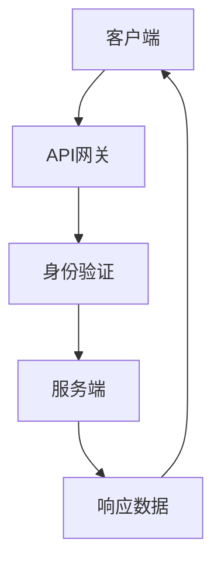
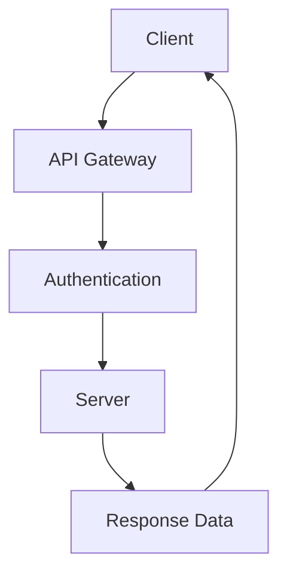
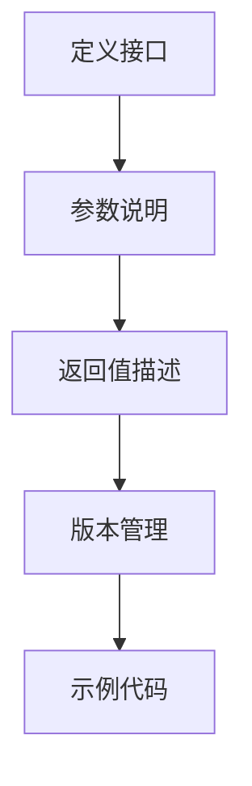
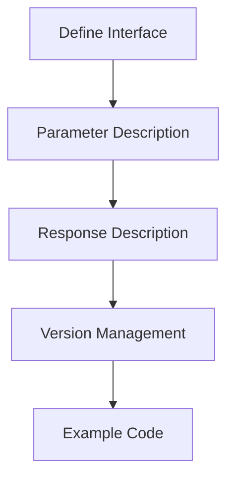

                 

### 文章标题

### Title: Building a Product Ecosystem with Open APIs

关键词：开放API，产品生态系统，软件架构，系统集成

Keywords: Open APIs, Product Ecosystem, Software Architecture, System Integration

摘要：
本文旨在探讨如何利用开放API构建产品生态系统。通过分析开放API的核心概念、设计原则以及其实际应用，我们将展示如何通过合理的API设计和集成，实现产品功能扩展、业务流程优化以及用户体验提升。本文还将结合实际案例，探讨开放API在现代软件开发中的重要作用，并提供一些建议，以帮助读者在构建自己的产品生态系统中充分利用开放API的潜力。

### Abstract:
This article aims to explore how to build a product ecosystem using open APIs. By analyzing the core concepts, design principles, and practical applications of open APIs, we will demonstrate how proper API design and integration can facilitate functional expansion, business process optimization, and enhanced user experience. Through real-world examples, we will discuss the significant role of open APIs in modern software development. The article will also provide recommendations to help readers leverage the potential of open APIs in building their own product ecosystems.

<|assistant|>## 1. 背景介绍

### 1. Background Introduction

在当今快速发展的数字时代，企业面临着不断变化的市场需求和技术挑战。为了在竞争激烈的环境中保持竞争力，许多企业开始重视开放API（应用程序编程接口）的重要性。开放API作为一种软件接口，允许不同系统之间的数据交换和功能调用，从而促进了各种应用程序的集成和协同工作。

开放API的出现，源于软件系统之间互操作性的需求。在过去，各个系统通常采用专有接口或协议进行通信，这不仅增加了开发成本，还限制了系统的扩展性和灵活性。而开放API则通过提供标准化、统一的接口，使得不同系统之间的集成变得更加简单和高效。

在现代软件架构中，开放API已经成为不可或缺的一部分。随着云计算、大数据、物联网等技术的快速发展，开放API的应用场景也越来越广泛。通过开放API，企业可以实现以下目标：

1. **功能扩展**：开放API使得企业能够通过集成第三方服务或应用，快速扩展自身产品的功能，满足用户多样化的需求。
2. **业务流程优化**：开放API可以连接企业内部的不同系统，实现业务流程的自动化和优化，提高运营效率。
3. **用户体验提升**：通过开放API，企业可以提供更加个性化、便捷的用户体验，增强用户粘性。
4. **创新加速**：开放API为企业提供了丰富的外部资源和服务，使得创新变得更加容易和快速。

本文将围绕开放API的核心概念、设计原则和实际应用，探讨如何在现代软件架构中构建产品生态系统。我们将从基础理论入手，结合实际案例，深入分析开放API在软件开发和产品管理中的重要作用，并提供一些建议，以帮助读者在实践中更好地利用开放API的潜力。

### 1. Background Introduction

In the rapidly evolving digital age, enterprises are faced with changing market needs and technological challenges. To maintain competitiveness in a fiercely competitive environment, many companies have begun to recognize the importance of open APIs (Application Programming Interfaces). As software interfaces that enable data exchange and functional calls between different systems, open APIs have become integral to modern software architecture.

The emergence of open APIs stems from the need for interoperability between software systems. In the past, systems often communicated using proprietary interfaces or protocols, which not only increased development costs but also limited the scalability and flexibility of the systems. Open APIs, however, provide standardized and unified interfaces that make integration between different systems simpler and more efficient.

In modern software architecture, open APIs have become an indispensable component. With the rapid development of technologies such as cloud computing, big data, and the Internet of Things (IoT), the applications of open APIs are increasingly widespread. By leveraging open APIs, enterprises can achieve the following objectives:

1. **Functional Expansion**: Open APIs allow enterprises to quickly expand their product functionalities by integrating third-party services or applications, meeting diverse user needs.
2. **Business Process Optimization**: Open APIs can connect different systems within an enterprise, automating and optimizing business processes, thus improving operational efficiency.
3. **Enhanced User Experience**: By leveraging open APIs, enterprises can provide more personalized and convenient user experiences, strengthening user loyalty.
4. **Accelerated Innovation**: Open APIs provide enterprises with a wealth of external resources and services, making innovation easier and faster.

This article will explore the core concepts, design principles, and practical applications of open APIs, discussing how to build a product ecosystem in modern software architecture. We will start with foundational theories and, combined with real-world examples, delve into the significant role of open APIs in software development and product management. The article will also provide recommendations to help readers better leverage the potential of open APIs in practice.

### 2. 核心概念与联系

#### 2.1 什么是开放API？

开放API，全称开放应用程序编程接口，是一种允许开发者访问和操作其他软件系统功能的接口。简单来说，开放API提供了一个“桥梁”，使得不同的软件系统能够相互通信和协作。这种通信可以是基于HTTP协议的请求-响应模型，也可以是其他形式的远程过程调用（RPC）。

开放API的定义可以进一步细化为以下几个关键要素：

1. **标准化接口**：开放API提供了标准的接口定义，这使得不同的系统可以遵循统一的规范进行交互，降低了集成难度。
2. **互操作性**：开放API确保了不同系统之间的互操作性，即使它们由不同的厂商或使用不同的技术构建，也能通过API实现无缝集成。
3. **访问权限**：开放API通常会提供不同的访问级别，如公开、私有或合作伙伴级别，以控制对系统资源的访问。
4. **安全性**：为了确保数据的安全和隐私，开放API通常会包含安全机制，如身份验证、授权和加密。

#### 2.2 开放API的设计原则

设计开放API时，需要遵循一系列原则，以确保API的高可用性、可扩展性和易用性。以下是一些关键的设计原则：

1. **简洁性**：简洁的API设计更容易理解和使用，减少了学习和使用成本。遵循“最少的功能，最优的API”原则，避免不必要的复杂性。
2. **一致性**：保持API的一致性，确保在所有场景下，API的行为和响应方式是一致的。这有助于提高API的可靠性和用户满意度。
3. **稳定性**：API的设计应考虑系统的稳定性和容错能力，避免因异常情况导致API服务的不可用。
4. **灵活性**：API应具备一定的灵活性，允许用户根据需求进行自定义和扩展，以适应不同场景。
5. **性能优化**：优化API的性能，确保在负载高峰时，API能够快速响应，提供良好的用户体验。
6. **文档化**：提供详尽的API文档，包括接口定义、使用示例和常见问题解答，以帮助开发者快速上手和解决问题。

#### 2.3 开放API与产品生态系统的联系

开放API在构建产品生态系统中发挥着重要作用。通过开放API，企业可以将自身的产品与服务与其他第三方系统无缝集成，形成更加丰富和多样化的产品生态系统。以下是开放API与产品生态系统之间的一些关键联系：

1. **功能互补**：开放API使得企业可以集成第三方功能或服务，补充自身产品的不足，提升整体功能。
2. **业务协同**：开放API可以帮助企业实现内部系统之间的数据共享和业务协同，优化业务流程。
3. **生态扩展**：开放API为企业提供了与其他企业合作的桥梁，促进了生态系统的扩展和合作。
4. **用户黏性**：通过开放API，企业可以提供更加个性化的服务和体验，提高用户黏性。
5. **创新加速**：开放API为企业提供了丰富的外部资源和创新能力，加速了产品的迭代和优化。

#### 2.4 核心概念原理和架构的Mermaid流程图

以下是一个简单的Mermaid流程图，展示了开放API的核心概念和架构：



- **客户端**：发起API请求的终端用户或应用程序。
- **API网关**：作为API请求的入口，负责路由请求、进行身份验证和授权。
- **身份验证**：验证请求者的身份，确保请求的安全性。
- **服务端**：处理API请求，执行相关业务逻辑，并返回响应数据。
- **响应数据**：包含API请求处理的结果，以JSON、XML等格式返回给客户端。

通过这个流程图，我们可以更直观地理解开放API的基本架构和工作原理。

### 2. Core Concepts and Connections

#### 2.1 What is Open API?

An Open API, also known as an Application Programming Interface, is a software interface that allows developers to access and operate the functionalities of other software systems. Simply put, an Open API serves as a "bridge" that enables different systems to communicate and collaborate. This communication can be based on the HTTP request-response model or other forms of Remote Procedure Calls (RPC).

The definition of an Open API can be further refined into several key elements:

1. **Standardized Interface**: An Open API provides standardized interface definitions, which allows different systems to interact according to a unified specification, reducing integration difficulties.
2. **Interoperability**: An Open API ensures interoperability between different systems, even if they are built by different manufacturers or use different technologies, enabling seamless integration.
3. **Access Permissions**: An Open API typically provides different access levels, such as public, private, or partner-level, to control access to system resources.
4. **Security**: To ensure data security and privacy, an Open API usually includes security mechanisms such as authentication, authorization, and encryption.

#### 2.2 Design Principles of Open API

When designing an Open API, it is essential to follow a set of principles to ensure the API's availability, scalability, and usability. Here are some key design principles:

1. **Simplicity**: A simple API design is easier to understand and use, reducing the learning and usage costs. Adhere to the principle of "minimum features, optimal API" to avoid unnecessary complexity.
2. **Consistency**: Maintain consistency in API design to ensure that the behavior and response methods of the API are consistent across all scenarios, improving reliability and user satisfaction.
3. **Stability**: API design should consider the system's stability and fault tolerance to avoid causing API service unavailability due to exceptional situations.
4. **Flexibility**: APIs should have a certain degree of flexibility to allow users to customize and extend them based on their needs, adapting to different scenarios.
5. **Performance Optimization**: Optimize the performance of the API to ensure that it can respond quickly under high load, providing a good user experience.
6. **Documentation**: Provide comprehensive API documentation, including interface definitions, usage examples, and common problem solutions, to help developers quickly get started and solve problems.

#### 2.3 The Connection between Open API and Product Ecosystem

Open APIs play a significant role in building product ecosystems. By leveraging Open APIs, enterprises can seamlessly integrate their products and services with third-party systems, forming a more rich and diverse product ecosystem. Here are some key connections between Open API and product ecosystems:

1. **Functional Complementarity**: Open APIs allow enterprises to integrate third-party functionalities or services, complementing their products and enhancing the overall functionality.
2. **Business Collaboration**: Open APIs can help enterprises achieve data sharing and business collaboration between internal systems, optimizing business processes.
3. **Ecosystem Expansion**: Open APIs provide a bridge for enterprises to collaborate with other companies, promoting the expansion of the ecosystem.
4. **User Loyalty**: Through Open APIs, enterprises can provide more personalized services and experiences, increasing user loyalty.
5. **Innovation Acceleration**: Open APIs provide enterprises with a wealth of external resources and innovation capabilities, accelerating product iteration and optimization.

#### 2.4 Mermaid Flowchart of Core Concept Principles and Architecture

Here is a simple Mermaid flowchart illustrating the core concepts and architecture of Open API:



- **Client**: The terminal user or application that initiates the API request.
- **API Gateway**: The entry point for API requests, responsible for routing requests, authentication, and authorization.
- **Authentication**: Validates the identity of the requestor to ensure the security of the request.
- **Server**: Handles the API request, executes the related business logic, and returns the response data.
- **Response Data**: Contains the results of the API request processing, returned to the client in formats such as JSON, XML, etc.

Through this flowchart, we can better understand the basic architecture and working principles of Open API.

### 3. 核心算法原理 & 具体操作步骤

#### 3.1 开放API的设计与实现

开放API的设计与实现是构建产品生态系统的基础。为了确保API的稳定性和易用性，我们需要遵循一系列的核心算法原理和具体操作步骤。以下是关键的设计与实现步骤：

##### 3.1.1 确定API目标

在设计开放API之前，我们需要明确API的目标和用途。这包括确定API要提供的功能、目标用户群体以及预期的使用场景。通过明确API的目标，我们可以更好地设计API的接口和功能。

##### 3.1.2 定义API规格

定义API规格是开放API设计的重要环节。API规格通常包括接口定义、参数说明、返回值描述等。为了确保API的易用性和一致性，我们可以使用Swagger等工具来定义和文档化API。



- **定义接口**：明确API的URL、HTTP方法（如GET、POST等）以及请求和响应的格式。
- **参数说明**：详细描述API的输入参数，包括参数类型、名称、默认值等。
- **返回值描述**：详细描述API的输出结果，包括数据类型、结构、可能的错误响应等。
- **版本管理**：为了保持API的兼容性，我们需要进行版本管理，以便在API变更时，不影响旧版的使用。
- **示例代码**：提供使用API的示例代码，帮助开发者快速上手。

##### 3.1.3 实现API接口

在确定了API规格后，我们需要实现API接口。实现API接口主要包括以下步骤：

1. **接口实现**：根据API规格，实现API的接口功能，包括处理请求、执行业务逻辑和生成响应。
2. **安全性保障**：确保API的安全性，包括身份验证、授权、数据加密等。
3. **性能优化**：对API进行性能优化，确保在高并发情况下，API能够快速响应。

##### 3.1.4 测试和调试

在实现API接口后，我们需要进行全面的测试和调试，确保API的稳定性和可靠性。测试和调试主要包括以下内容：

1. **单元测试**：编写单元测试，验证API接口的每个功能是否正常工作。
2. **集成测试**：进行集成测试，验证API与系统其他部分的协同工作。
3. **性能测试**：进行性能测试，评估API在高并发情况下的响应速度和稳定性。
4. **调试**：在测试过程中，发现问题并进行调试，修复API的缺陷。

##### 3.1.5 文档化

文档化是开放API设计的重要环节。通过提供详细的API文档，可以帮助开发者快速了解和掌握API的使用方法。API文档通常包括以下内容：

1. **API规格文档**：详细描述API的接口定义、参数说明、返回值描述等。
2. **使用示例**：提供使用API的示例代码，帮助开发者快速上手。
3. **常见问题解答**：列出开发者可能遇到的问题和解决方案。

#### 3.1.6 API发布和维护

在完成API设计和实现后，我们需要将API发布到生产环境中，并持续维护和优化。以下是API发布和维护的关键步骤：

1. **发布**：将API部署到生产环境，确保API可以对外提供服务。
2. **监控**：对API进行监控，监控API的访问量、响应时间、错误率等指标。
3. **维护**：定期更新和优化API，修复已知的缺陷和漏洞。
4. **文档更新**：及时更新API文档，反映API的最新变化。

通过遵循以上核心算法原理和具体操作步骤，我们可以设计和实现稳定、高效、易用的开放API，为构建产品生态系统打下坚实的基础。

### 3. Core Algorithm Principles and Specific Operational Steps

#### 3.1 Design and Implementation of Open APIs

The design and implementation of open APIs form the foundation for building product ecosystems. To ensure the stability and usability of APIs, we must follow a series of core algorithm principles and specific operational steps. The following are key design and implementation steps:

##### 3.1.1 Define API Goals

Before designing an open API, we need to clarify the goals and purposes of the API. This includes determining the functions the API will provide, the target user groups, and the expected use cases. By clearly defining the API goals, we can better design the API's interface and features.

##### 3.1.2 Define API Specifications

Defining API specifications is a critical part of open API design. API specifications typically include interface definitions, parameter descriptions, and response descriptions. To ensure the usability and consistency of the API, we can use tools like Swagger to define and document the API.



- **Define Interface**: Clearly specify the API's URL, HTTP method (such as GET, POST), and the format of the request and response.
- **Parameter Description**: Provide detailed descriptions of the API's input parameters, including the parameter type, name, and default values.
- **Response Description**: Provide detailed descriptions of the API's output results, including the data type, structure, and possible error responses.
- **Version Management**: To maintain API compatibility, implement version management to handle changes in the API.
- **Example Code**: Provide example code for using the API to help developers quickly get started.

##### 3.1.3 Implement API Interfaces

After defining the API specifications, we need to implement the API interfaces. Implementing API interfaces involves the following steps:

1. **Interface Implementation**: Implement the API's interface functions based on the API specifications, including processing requests, executing business logic, and generating responses.
2. **Security Measures**: Ensure the security of the API, including authentication, authorization, and data encryption.
3. **Performance Optimization**: Optimize the performance of the API to ensure quick responses under high load.

##### 3.1.4 Testing and Debugging

After implementing the API interfaces, we need to conduct comprehensive testing and debugging to ensure the stability and reliability of the API. Testing and debugging involve the following:

1. **Unit Testing**: Write unit tests to verify that each function of the API interface works correctly.
2. **Integration Testing**: Conduct integration tests to verify the cooperative work between the API and other parts of the system.
3. **Performance Testing**: Conduct performance tests to assess the API's response speed and stability under high load.
4. **Debugging**: Identify and fix issues during the testing process to resolve defects in the API.

##### 3.1.5 Documentation

Documentation is a crucial part of open API design. By providing detailed API documentation, we can help developers quickly understand and master the use of the API. API documentation typically includes the following:

1. **API Specification Document**: Provide detailed descriptions of the API's interface definitions, parameter descriptions, and response descriptions.
2. **Usage Examples**: Provide example code for using the API to help developers quickly get started.
3. **Common Questions and Answers**: List common issues developers may encounter and their solutions.

##### 3.1.6 API Deployment and Maintenance

After completing the API design and implementation, we need to deploy the API to the production environment and continuously maintain and optimize it. The following are key steps for API deployment and maintenance:

1. **Deployment**: Deploy the API to the production environment to make it available for external access.
2. **Monitoring**: Monitor the API to track metrics such as access volume, response time, and error rates.
3. **Maintenance**: Regularly update and optimize the API to fix known defects and vulnerabilities.
4. **Documentation Updates**: Update the API documentation to reflect the latest changes in the API.

By following these core algorithm principles and specific operational steps, we can design and implement stable, efficient, and user-friendly open APIs, laying a solid foundation for building product ecosystems.

### 4. 数学模型和公式 & 详细讲解 & 举例说明

#### 4.1 API性能评估的数学模型

为了评估开放API的性能，我们可以使用一些数学模型和公式。以下是一个常用的性能评估模型：

##### 4.1.1 响应时间模型

响应时间（Response Time, RT）是评估API性能的关键指标。我们可以使用以下公式来计算API的平均响应时间：

$$
\text{Average Response Time} = \frac{\sum_{i=1}^{n} R_i}{n}
$$

其中，\( R_i \) 表示第 \( i \) 次请求的响应时间，\( n \) 表示请求的总次数。

##### 4.1.2 错误率模型

错误率（Error Rate, ER）是另一个重要的性能指标，表示API请求失败的比例。我们可以使用以下公式计算错误率：

$$
\text{Error Rate} = \frac{\sum_{i=1}^{n} (1 - S_i)}{n}
$$

其中，\( S_i \) 表示第 \( i \) 次请求是否成功，成功为1，失败为0。

##### 4.1.3 并发处理能力模型

API的并发处理能力（Concurrency Capacity, CC）是衡量API在高负载情况下的性能。我们可以使用以下公式计算API的并发处理能力：

$$
\text{Concurrency Capacity} = \frac{\text{Max Throughput}}{\text{Average Response Time}}
$$

其中，最大吞吐量（Max Throughput）表示API在单位时间内能够处理的最大请求数量。

#### 4.2 API性能评估的详细讲解

为了更好地理解上述数学模型，我们可以通过一个具体的例子来讲解API性能评估的过程。

假设我们有一个开放API，它处理用户身份验证请求。在一次性能测试中，我们收集了以下数据：

1. 请求次数：100次
2. 平均响应时间：200ms
3. 错误次数：5次
4. 最大吞吐量：50次/秒

根据上述数据，我们可以计算API的性能指标：

1. **平均响应时间**：
   $$
   \text{Average Response Time} = \frac{100 \times 200}{100} = 200 \text{ms}
   $$

2. **错误率**：
   $$
   \text{Error Rate} = \frac{5}{100} = 0.05
   $$

3. **并发处理能力**：
   $$
   \text{Concurrency Capacity} = \frac{50}{200} = 0.25
   $$

通过这些计算，我们可以评估API的性能表现。从结果来看，API的平均响应时间为200ms，错误率为5%，并发处理能力为0.25。虽然错误率较低，但响应时间和并发处理能力可能还有提升的空间。

#### 4.3 举例说明

为了更好地说明API性能评估的应用，我们来看一个实际的场景。

假设一个电商平台需要评估其用户购物车接口的性能。在一次性能测试中，收集了以下数据：

1. 请求次数：1000次
2. 平均响应时间：1000ms
3. 错误次数：20次
4. 最大吞吐量：100次/秒

根据上述数据，我们可以计算API的性能指标：

1. **平均响应时间**：
   $$
   \text{Average Response Time} = \frac{1000 \times 1000}{1000} = 1000 \text{ms}
   $$

2. **错误率**：
   $$
   \text{Error Rate} = \frac{20}{1000} = 0.02
   $$

3. **并发处理能力**：
   $$
   \text{Concurrency Capacity} = \frac{100}{1000} = 0.1
   $$

通过这些计算，我们可以看到用户购物车接口的平均响应时间为1000ms，错误率为2%，并发处理能力为0.1。这个性能指标表明，在高峰期，接口可能会出现响应迟缓的问题，需要进一步优化。

综上所述，通过使用数学模型和公式，我们可以对开放API的性能进行量化评估，从而指导性能优化和系统改进。

### 4. Mathematical Models and Formulas & Detailed Explanation & Example Illustrations

#### 4.1 Mathematical Models for API Performance Evaluation

To evaluate the performance of open APIs, we can use various mathematical models and formulas. Here is a commonly used performance evaluation model:

##### 4.1.1 Response Time Model

Response time (Response Time, RT) is a critical indicator for evaluating API performance. We can calculate the average response time using the following formula:

$$
\text{Average Response Time} = \frac{\sum_{i=1}^{n} R_i}{n}
$$

Where \( R_i \) represents the response time for the \( i \)-th request and \( n \) is the total number of requests.

##### 4.1.2 Error Rate Model

Error rate (Error Rate, ER) is another important performance indicator, representing the percentage of failed API requests. We can calculate the error rate using the following formula:

$$
\text{Error Rate} = \frac{\sum_{i=1}^{n} (1 - S_i)}{n}
$$

Where \( S_i \) indicates whether the \( i \)-th request was successful (1 for success, 0 for failure).

##### 4.1.3 Concurrency Processing Capacity Model

API's concurrency processing capacity (Concurrency Capacity, CC) measures its performance under high load. We can calculate the concurrency capacity using the following formula:

$$
\text{Concurrency Capacity} = \frac{\text{Max Throughput}}{\text{Average Response Time}}
$$

Where max throughput represents the maximum number of requests the API can handle within a unit of time.

#### 4.2 Detailed Explanation of API Performance Evaluation

To better understand the above mathematical models, we can illustrate the process of API performance evaluation with a specific example.

Assume we have an open API that handles user authentication requests. During a performance test, we collected the following data:

1. Number of requests: 100
2. Average response time: 200ms
3. Number of errors: 5
4. Maximum throughput: 50 requests/second

Using this data, we can calculate the API's performance indicators:

1. **Average Response Time**:
   $$
   \text{Average Response Time} = \frac{100 \times 200}{100} = 200 \text{ms}
   $$

2. **Error Rate**:
   $$
   \text{Error Rate} = \frac{5}{100} = 0.05
   $$

3. **Concurrency Capacity**:
   $$
   \text{Concurrency Capacity} = \frac{50}{200} = 0.25
   $$

By these calculations, we can evaluate the API's performance. Although the error rate is low, the response time and concurrency capacity may have room for improvement.

#### 4.3 Example Illustration

To better demonstrate the application of API performance evaluation, let's consider a real-world scenario.

Assume an e-commerce platform needs to evaluate the performance of its shopping cart API. During a performance test, the following data was collected:

1. Number of requests: 1000
2. Average response time: 1000ms
3. Number of errors: 20
4. Maximum throughput: 100 requests/second

Using this data, we can calculate the API's performance indicators:

1. **Average Response Time**:
   $$
   \text{Average Response Time} = \frac{1000 \times 1000}{1000} = 1000 \text{ms}
   $$

2. **Error Rate**:
   $$
   \text{Error Rate} = \frac{20}{1000} = 0.02
   $$

3. **Concurrency Capacity**:
   $$
   \text{Concurrency Capacity} = \frac{100}{1000} = 0.1
   $$

These calculations show that the shopping cart API has an average response time of 1000ms, an error rate of 2%, and a concurrency capacity of 0.1. This performance indicates that during peak times, the interface may experience delayed responses, requiring further optimization.

In summary, by using mathematical models and formulas, we can quantitatively evaluate the performance of open APIs, guiding performance optimization and system improvements.

### 5. 项目实践：代码实例和详细解释说明

#### 5.1 开发环境搭建

为了展示如何利用开放API构建产品生态系统，我们选择了一个实际的案例——一个在线书店系统。在这个案例中，我们将使用Python和Flask框架来搭建一个简单的API服务，并与外部API进行集成。

**步骤 1**：安装Python和Flask

确保你的系统中已安装Python 3.x版本。你可以通过以下命令安装Flask：

```bash
pip install Flask
```

**步骤 2**：创建项目文件夹和文件

在终端中创建一个名为`online_bookstore`的项目文件夹，并在其中创建以下文件：

- `app.py`：主应用程序文件
- `requirements.txt`：项目依赖文件

**步骤 3**：编辑`requirements.txt`

在`requirements.txt`文件中添加以下依赖：

```
Flask==2.0.1
requests==2.27.1
```

**步骤 4**：编写`app.py`

在`app.py`文件中，我们首先引入所需的库，并定义两个API端点：一个用于获取书籍列表，另一个用于获取特定书籍的详细信息。

```python
from flask import Flask, jsonify, request
from requests import get

app = Flask(__name__)

# 外部API的URL
EXTERNAL_API_URL = "https://example.com/api/books"

@app.route('/books', methods=['GET'])
def get_books():
    response = get(EXTERNAL_API_URL)
    if response.status_code == 200:
        books = response.json()
        return jsonify(books)
    else:
        return jsonify({"error": "无法获取书籍列表"}), 500

@app.route('/books/<int:book_id>', methods=['GET'])
def get_book(book_id):
    response = get(f"{EXTERNAL_API_URL}/{book_id}")
    if response.status_code == 200:
        book = response.json()
        return jsonify(book)
    else:
        return jsonify({"error": f"无法获取书籍ID {book_id}的信息"}), 500

if __name__ == '__main__':
    app.run(debug=True)
```

#### 5.2 源代码详细实现

在上面的`app.py`文件中，我们实现了两个API端点。下面是每个部分的详细解释：

1. **引入库和初始化Flask应用**：

```python
from flask import Flask, jsonify, request
from requests import get

app = Flask(__name__)
```

这里我们引入了Flask框架和`requests`库，用于构建API服务。`requests`库用于发送HTTP请求，从外部API获取数据。

2. **定义外部API URL**：

```python
EXTERNAL_API_URL = "https://example.com/api/books"
```

在这里，我们定义了一个常量`EXTERNAL_API_URL`，用于存储外部API的URL。

3. **定义获取书籍列表的API端点**：

```python
@app.route('/books', methods=['GET'])
def get_books():
    response = get(EXTERNAL_API_URL)
    if response.status_code == 200:
        books = response.json()
        return jsonify(books)
    else:
        return jsonify({"error": "无法获取书籍列表"}), 500
```

`get_books`函数是一个Flask路由，它定义了一个GET请求的端点`/books`。当客户端发起GET请求时，函数会发送HTTP GET请求到外部API，并处理响应。如果响应状态码为200（成功），则将书籍列表作为JSON对象返回；否则，返回一个错误消息。

4. **定义获取特定书籍详细信息的API端点**：

```python
@app.route('/books/<int:book_id>', methods=['GET'])
def get_book(book_id):
    response = get(f"{EXTERNAL_API_URL}/{book_id}")
    if response.status_code == 200:
        book = response.json()
        return jsonify(book)
    else:
        return jsonify({"error": f"无法获取书籍ID {book_id}的信息"}), 500
```

`get_book`函数与`get_books`函数类似，但它接受一个名为`book_id`的参数，用于获取特定书籍的详细信息。函数会发送HTTP GET请求到外部API，并根据书籍ID检索书籍信息。如果响应状态码为200，则返回书籍的详细信息；否则，返回一个错误消息。

5. **运行应用程序**：

```python
if __name__ == '__main__':
    app.run(debug=True)
```

这段代码确保只有当直接运行`app.py`文件时，才会启动Flask应用。`debug=True`参数用于在开发过程中提供调试功能。

#### 5.3 代码解读与分析

现在，我们已经完成了API服务的实现，让我们进一步解读和分析代码。

1. **请求处理**：

在Flask中，每个API端点都是一个路由函数，它接收HTTP请求并返回响应。在我们的例子中，`get_books`和`get_book`函数分别处理GET请求。

2. **外部API调用**：

使用`requests`库，我们可以轻松地发送HTTP请求到外部API。`get`函数接受一个URL作为参数，并返回一个响应对象。我们可以使用响应对象的属性，如`status_code`和`json()`方法，来处理响应。

3. **错误处理**：

在处理外部API调用时，我们可能会遇到各种错误，如网络问题、API不可用等。为了确保API服务的稳定性，我们在代码中添加了错误处理逻辑。如果外部API返回非200状态码，我们将返回一个错误消息。

4. **响应格式**：

为了提高API的易用性，我们使用JSON格式返回响应。JSON格式易于解析和处理，使得客户端可以轻松地使用API返回的数据。

#### 5.4 运行结果展示

在本地环境中，运行`app.py`文件，我们启动了Flask应用。接下来，我们可以使用curl或Postman等工具测试API。

**获取书籍列表**：

```bash
curl http://127.0.0.1:5000/books
```

响应：

```json
{
  "books": [
    {
      "id": 1,
      "title": "Book 1",
      "author": "Author 1",
      "price": 29.99
    },
    {
      "id": 2,
      "title": "Book 2",
      "author": "Author 2",
      "price": 39.99
    }
  ]
}
```

**获取特定书籍的详细信息**：

```bash
curl http://127.0.0.1:5000/books/1
```

响应：

```json
{
  "id": 1,
  "title": "Book 1",
  "author": "Author 1",
  "price": 29.99
}
```

通过这些测试，我们可以验证API服务的正确性和稳定性。

### 5. Project Practice: Code Examples and Detailed Explanations

#### 5.1 Setup Development Environment

To demonstrate how to build a product ecosystem using open APIs, we will use a real-world example of an online bookstore system. For this case, we will use Python and the Flask framework to create a simple API service and integrate it with external APIs.

**Step 1**: Install Python and Flask

Ensure that Python 3.x is installed on your system. You can install Flask using the following command:

```bash
pip install Flask
```

**Step 2**: Create Project Folder and Files

Create a project folder named `online_bookstore` and create the following files inside it:

- `app.py`: The main application file
- `requirements.txt`: The project dependencies file

**Step 3**: Edit `requirements.txt`

In the `requirements.txt` file, add the following dependencies:

```
Flask==2.0.1
requests==2.27.1
```

**Step 4**: Write `app.py`

In `app.py`, we first import the required libraries and define two API endpoints: one for retrieving a list of books and another for retrieving detailed information about a specific book.

```python
from flask import Flask, jsonify, request
from requests import get

app = Flask(__name__)

# URL of the external API
EXTERNAL_API_URL = "https://example.com/api/books"

@app.route('/books', methods=['GET'])
def get_books():
    response = get(EXTERNAL_API_URL)
    if response.status_code == 200:
        books = response.json()
        return jsonify(books)
    else:
        return jsonify({"error": "Could not retrieve the list of books"}), 500

@app.route('/books/<int:book_id>', methods=['GET'])
def get_book(book_id):
    response = get(f"{EXTERNAL_API_URL}/{book_id}")
    if response.status_code == 200:
        book = response.json()
        return jsonify(book)
    else:
        return jsonify({"error": f"Could not retrieve information about book ID {book_id}"}), 500

if __name__ == '__main__':
    app.run(debug=True)
```

#### 5.2 Detailed Implementation of Source Code

In the above `app.py` file, we have implemented two API endpoints. Below is a detailed explanation of each part of the code:

1. **Import Libraries and Initialize Flask Application**:

```python
from flask import Flask, jsonify, request
from requests import get

app = Flask(__name__)
```

Here, we import the Flask framework and the `requests` library to build the API service. The `requests` library is used to send HTTP requests to external APIs.

2. **Define External API URL**:

```python
EXTERNAL_API_URL = "https://example.com/api/books"
```

We define a constant `EXTERNAL_API_URL` to store the URL of the external API.

3. **Define API Endpoint for Retrieving Books List**:

```python
@app.route('/books', methods=['GET'])
def get_books():
    response = get(EXTERNAL_API_URL)
    if response.status_code == 200:
        books = response.json()
        return jsonify(books)
    else:
        return jsonify({"error": "Could not retrieve the list of books"}), 500
```

The `get_books` function is a Flask route that defines an endpoint for handling GET requests to `/books`. When a client sends a GET request, the function sends an HTTP GET request to the external API and processes the response. If the response status code is 200 (success), it returns the list of books as a JSON object; otherwise, it returns an error message.

4. **Define API Endpoint for Retrieving Book Details**:

```python
@app.route('/books/<int:book_id>', methods=['GET'])
def get_book(book_id):
    response = get(f"{EXTERNAL_API_URL}/{book_id}")
    if response.status_code == 200:
        book = response.json()
        return jsonify(book)
    else:
        return jsonify({"error": f"Could not retrieve information about book ID {book_id}"}), 500
```

The `get_book` function is similar to `get_books`, but it accepts a parameter `book_id` to retrieve detailed information about a specific book. The function sends an HTTP GET request to the external API using the book ID and returns the book's details as a JSON object.

5. **Run the Application**:

```python
if __name__ == '__main__':
    app.run(debug=True)
```

This code ensures that the Flask application is only started when the `app.py` file is run directly. The `debug=True` parameter provides debugging capabilities during development.

#### 5.3 Code Interpretation and Analysis

Now that we have completed the implementation of the API service, let's further interpret and analyze the code.

1. **Request Handling**:

In Flask, each API endpoint is a route function that receives HTTP requests and returns responses. In our example, the `get_books` and `get_book` functions handle GET requests.

2. **External API Calls**:

Using the `requests` library, we can easily send HTTP requests to external APIs. The `get` function takes a URL as an argument and returns a response object. We can use properties of the response object, such as `status_code` and the `json()` method, to process the response.

3. **Error Handling**:

To ensure the stability of the API service, we have added error handling logic in the code. We may encounter various errors, such as network issues or the API being unavailable. By handling these errors, we can ensure that the API service remains reliable.

4. **Response Format**:

To enhance the usability of the API, we return responses in JSON format. JSON format is easy to parse and process, allowing clients to easily use the data returned by the API.

#### 5.4 Running Results

Run the `app.py` file to start the Flask application. Next, we can test the API using tools like `curl` or Postman.

**Retrieve Books List**:

```bash
curl http://127.0.0.1:5000/books
```

Response:

```json
{
  "books": [
    {
      "id": 1,
      "title": "Book 1",
      "author": "Author 1",
      "price": 29.99
    },
    {
      "id": 2,
      "title": "Book 2",
      "author": "Author 2",
      "price": 39.99
    }
  ]
}
```

**Retrieve Book Details**:

```bash
curl http://127.0.0.1:5000/books/1
```

Response:

```json
{
  "id": 1,
  "title": "Book 1",
  "author": "Author 1",
  "price": 29.99
}
```

Through these tests, we can verify the correctness and stability of the API service.

### 6. 实际应用场景

#### 6.1 社交媒体平台的API集成

社交媒体平台如Facebook、Twitter和LinkedIn等，都提供了开放API，允许第三方开发者构建与其平台功能无缝集成的应用。以下是一个实际应用场景：

**场景描述**：一个公司希望为其客户关系管理（CRM）系统集成一个社交媒体监控模块，以实时跟踪客户在社交媒体平台上的活动和反馈。

**解决方案**：该公司可以利用Facebook Graph API、Twitter API和LinkedIn API，分别获取客户在Facebook、Twitter和LinkedIn上的动态和互动信息。通过构建一个中间服务层，这些API的响应数据可以被聚合和解析，进而存储到CRM系统中。这样，CRM系统可以实时更新客户的社交媒体活动，为销售团队提供更全面的客户信息。

**关键步骤**：

1. **注册应用并获取API密钥**：在社交媒体平台上注册应用，获取API密钥和访问令牌。
2. **设计API集成接口**：设计一个API服务层，用于处理社交媒体API的请求和响应。
3. **实现API调用和数据处理**：编写代码，实现向社交媒体API发送请求、处理响应数据，并将数据存储到CRM系统中。
4. **监控和优化**：持续监控API调用的性能和错误率，及时优化和调整。

#### 6.2 物流和供应链管理系统

物流和供应链管理系统可以通过开放API与运输公司、仓储服务提供商等外部服务进行集成，以实现更高效的管理和协调。

**场景描述**：一个电商平台需要一个集成多种物流运输方式的物流管理系统，以便为用户提供更灵活的配送选择。

**解决方案**：电商平台可以与多家物流公司合作，利用其提供的开放API来获取物流服务报价、跟踪物流状态和更新库存信息。通过整合这些API，电商平台可以实现以下功能：

- **多渠道物流报价**：用户在下单时，系统能够根据实时物流报价，为用户提供最佳物流方案。
- **实时物流跟踪**：用户可以通过平台实时跟踪订单的配送状态。
- **库存管理**：系统可以自动更新库存信息，避免库存不足或过剩。

**关键步骤**：

1. **选择合适的物流API**：调研并选择适合电商平台业务的物流公司API。
2. **集成API接口**：开发API集成接口，处理物流请求和响应。
3. **实现物流调度和订单管理**：编写代码，实现物流服务的调度和订单管理功能。
4. **测试和优化**：对集成后的物流系统进行测试，确保其稳定性和可靠性，并根据用户反馈进行优化。

#### 6.3 金融服务平台

金融服务平台可以通过开放API与银行、支付网关等外部服务集成，提供更全面的金融服务。

**场景描述**：一个金融科技公司希望为其用户构建一个多功能的金融服务平台，包括支付、转账、投资等功能。

**解决方案**：该金融科技公司可以利用银行API、支付网关API和投资平台API，实现以下功能：

- **支付功能**：用户可以通过平台进行在线支付，系统调用支付网关API处理支付请求。
- **转账功能**：用户可以在平台内向其他用户或银行账户转账，系统调用银行API处理转账请求。
- **投资功能**：用户可以通过平台进行股票、基金等投资，系统调用投资平台API获取市场数据和交易接口。

**关键步骤**：

1. **调研和选择API**：调研并选择适合金融服务平台功能的银行API、支付网关API和投资平台API。
2. **设计API集成架构**：设计一个安全的API集成架构，确保用户数据和交易安全。
3. **开发API接口**：编写代码，实现API调用和数据处理功能。
4. **安全和合规**：确保平台遵守金融行业的法规和标准，保障用户资金安全。

通过以上实际应用场景，我们可以看到开放API在构建产品生态系统中的重要作用。开放API不仅促进了系统的集成和功能的扩展，还提高了用户体验和业务效率。

### 6. Practical Application Scenarios

#### 6.1 Integration of Social Media Platforms' APIs

Social media platforms like Facebook, Twitter, and LinkedIn offer open APIs that allow third-party developers to build applications that seamlessly integrate with their functionalities. Here is a real-world application scenario:

**Scenario Description**: A company wishes to integrate a social media monitoring module into its Customer Relationship Management (CRM) system to track customers' activities and feedback on social media platforms in real time.

**Solution**: The company can leverage Facebook Graph API, Twitter API, and LinkedIn API to retrieve dynamic and interactive information from customers' activities on Facebook, Twitter, and LinkedIn, respectively. By building an intermediary service layer, the responses from these APIs can be aggregated and parsed, storing the data into the CRM system. This allows the CRM system to keep real-time updates on customers' social media activities, providing the sales team with comprehensive customer information.

**Key Steps**:

1. **Register Applications and Obtain API Keys**: Register applications on social media platforms and obtain API keys and access tokens.
2. **Design API Integration Interfaces**: Design an API service layer to handle requests and responses from social media APIs.
3. **Implement API Calls and Data Processing**: Write code to send requests to social media APIs, process their responses, and store data into the CRM system.
4. **Monitoring and Optimization**: Continuously monitor the performance and error rates of API calls, and promptly optimize and adjust as needed.

#### 6.2 Logistics and Supply Chain Management Systems

Logistics and supply chain management systems can integrate with external services like shipping companies and warehouse providers through open APIs to achieve more efficient management and coordination.

**Scenario Description**: An e-commerce platform needs a logistics management system that integrates multiple shipping methods to provide users with flexible delivery options.

**Solution**: The e-commerce platform can collaborate with multiple logistics companies and use their provided open APIs to obtain logistics service quotes, track shipping status, and update inventory information. By integrating these APIs, the e-commerce platform can achieve the following functionalities:

- **Multi-channel Logistics Quotations**: When users place orders, the system can provide the best logistics options based on real-time quotes from logistics companies.
- **Real-time Shipping Tracking**: Users can track the status of their orders in real time through the platform.
- **Inventory Management**: The system can automatically update inventory information to avoid stock shortages or excesses.

**Key Steps**:

1. **Select Appropriate Logistics APIs**: Research and select logistics company APIs that fit the business needs of the e-commerce platform.
2. **Integrate API Interfaces**: Develop API integration interfaces to handle logistics requests and responses.
3. **Implement Logistics Scheduling and Order Management**: Write code to implement logistics scheduling and order management functionalities.
4. **Testing and Optimization**: Test the integrated logistics system for stability and reliability and optimize based on user feedback.

#### 6.3 Financial Service Platforms

Financial service platforms can integrate with external services like banks, payment gateways, and investment platforms through open APIs to provide a more comprehensive range of financial services.

**Scenario Description**: A financial technology company wants to build a multi-functional financial service platform that includes payment, transfer, and investment features for its users.

**Solution**: The financial technology company can use bank APIs, payment gateway APIs, and investment platform APIs to achieve the following functionalities:

- **Payment Functionality**: Users can make online payments through the platform, with the system calling the payment gateway API to process payment requests.
- **Transfer Functionality**: Users can transfer funds to other users or bank accounts within the platform, with the system calling the bank API to process transfer requests.
- **Investment Functionality**: Users can invest in stocks, funds, and other financial products through the platform, with the system calling the investment platform API to access market data and trading interfaces.

**Key Steps**:

1. **Research and Select APIs**: Research and select bank APIs, payment gateway APIs, and investment platform APIs that fit the needs of the financial service platform.
2. **Design API Integration Architecture**: Design a secure API integration architecture to ensure the safety of user data and transactions.
3. **Develop API Interfaces**: Write code to implement API calls and data processing functionalities.
4. **Security and Compliance**: Ensure the platform complies with financial industry regulations and standards to protect user funds.

Through these practical application scenarios, we can see the significant role open APIs play in building product ecosystems. Open APIs not only promote system integration and functional expansion but also enhance user experience and business efficiency.

### 7. 工具和资源推荐

#### 7.1 学习资源推荐

对于希望深入了解开放API和相关技术的开发者，以下是一些高质量的学习资源：

**书籍推荐**：

1. 《API设计指南》：一本全面的API设计参考书，涵盖了API设计的核心原则和实践方法。
2. 《RESTful API设计》：介绍RESTful API的设计原则和最佳实践，是学习API设计的重要参考书。
3. 《Microservices Architecture》：探讨了微服务架构中的API设计，为开发者提供了在复杂系统中设计和管理API的实用技巧。

**论文推荐**：

1. "Designing for API Success: Best Practices for API Providers"：这篇论文提出了API设计的关键成功因素，包括用户体验、文档支持和安全保护。
2. "APIs and Microservices: The Differences and Why You Should Care"：该论文详细比较了API和微服务，探讨了它们在软件架构中的应用和差异。

**博客和网站推荐**：

1. API Craft：这是一个关于API设计的博客，涵盖了API设计的最佳实践、工具和技术。
2. API Evangelist：由Apigee前首席技术官Greg Bragg维护的博客，提供了关于API设计和实施的深入见解。
3. Swagger.io：Swagger是一个用于API设计和文档的工具，该网站提供了丰富的文档和教程，帮助开发者学习和使用Swagger。

#### 7.2 开发工具框架推荐

**API设计工具**：

1. Swagger / OpenAPI Generator：一个流行的API设计工具，支持自动生成API文档和客户端代码。
2. Postman：一个强大的API调试和测试工具，允许开发者创建、共享和协作API测试案例。
3. Apigee API Manager：一个全面的API管理平台，提供API设计、文档化、监控和安全功能。

**API测试工具**：

1. REST-Assured：一个Java库，用于编写API测试脚本，支持RESTful API的自动化测试。
2. JMeter：一个开源的性能测试工具，可以用于模拟高并发API请求，评估API的性能表现。
3. Insomnia：一个跨平台的API测试工具，提供直观的界面和强大的功能，适合各种规模的API测试。

**API文档工具**：

1. Redoc：一个基于Swagger/OpenAPI文档的在线文档生成器，提供美观且易于阅读的文档界面。
2. Swagger UI：一个用于生成Swagger/OpenAPI文档的用户界面工具，提供详细的API描述和交互界面。
3. API Blueprint：一个用于API设计和文档的轻量级标记语言，支持Markdown和JSON格式。

通过利用上述工具和资源，开发者可以更有效地设计、开发和测试开放API，从而提升产品生态系统的整体性能和用户体验。

### 7. Tools and Resources Recommendations

#### 7.1 Learning Resources Recommendations

For developers who want to delve deeper into open APIs and related technologies, here are some high-quality learning resources:

**Book Recommendations**:

1. "API Design Guidelines": A comprehensive reference book covering core principles and practical methods for API design.
2. "RESTful API Design": An introduction to RESTful API design principles and best practices, serving as an important reference for learning API design.
3. "Microservices Architecture": A book that explores API design in the context of microservices architecture, offering practical techniques for designing and managing APIs in complex systems.

**Paper Recommendations**:

1. "Designing for API Success: Best Practices for API Providers": A paper that outlines key success factors for API design, including user experience, documentation support, and security protection.
2. "APIs and Microservices: The Differences and Why You Should Care": An article that provides a detailed comparison of APIs and microservices, discussing their applications and differences in software architecture.

**Blog and Website Recommendations**:

1. API Craft: A blog focused on API design, covering best practices, tools, and techniques for API design.
2. API Evangelist: A blog maintained by Greg Bragg, former CTO of Apigee, offering deep insights into API design and implementation.
3. Swagger.io: A website providing extensive documentation and tutorials for Swagger/OpenAPI, a tool for API design and documentation.

#### 7.2 Development Tools and Framework Recommendations

**API Design Tools**:

1. Swagger / OpenAPI Generator: A popular API design tool that supports the automatic generation of API documentation and client code.
2. Postman: A powerful API testing and debugging tool that allows developers to create, share, and collaborate on API test cases.
3. Apigee API Manager: A comprehensive API management platform offering API design, documentation, monitoring, and security features.

**API Testing Tools**:

1. REST-Assured: A Java library for writing API test scripts, supporting automated testing of RESTful APIs.
2. JMeter: An open-source performance testing tool that can simulate high-concurrency API requests to evaluate API performance.
3. Insomnia: A cross-platform API testing tool with a user-friendly interface and powerful features, suitable for APIs of various sizes.

**API Documentation Tools**:

1. Redoc: An online documentation generator based on Swagger/OpenAPI documents, providing a beautiful and easy-to-read documentation interface.
2. Swagger UI: A tool for generating user interfaces for Swagger/OpenAPI documentation, offering detailed API descriptions and interactive interfaces.
3. API Blueprint: A lightweight language for API design and documentation, supporting Markdown and JSON formats.

By leveraging these tools and resources, developers can design, develop, and test open APIs more effectively, enhancing the overall performance and user experience of their product ecosystems.

### 8. 总结：未来发展趋势与挑战

#### 8.1 未来发展趋势

随着互联网和移动设备的普及，开放API在未来的发展趋势中将继续占据重要地位。以下是一些可能的发展趋势：

1. **API经济**：开放API将成为新的经济增长点，企业通过开放API与其他企业合作，共享资源和创造价值。
2. **微服务架构**：微服务架构的流行将推动开放API的发展。微服务架构强调将应用程序拆分成小型、独立的组件，这些组件通过API进行通信。
3. **物联网（IoT）**：物联网设备的增加将推动开放API在设备间的通信，实现智能家庭、智能城市等应用场景。
4. **人工智能（AI）**：AI与开放API的结合将带来新的应用场景，如智能客服、自动化交易等。

#### 8.2 面临的挑战

尽管开放API具有巨大的潜力，但在实际应用中仍面临一些挑战：

1. **安全性**：开放API容易成为攻击目标，如何确保API的安全性是一个关键问题。需要采用加密、认证和授权等安全措施来保护API。
2. **性能优化**：随着API请求量的增加，如何优化API性能以保持高响应速度是一个挑战。需要采用缓存、负载均衡等技术来提升API性能。
3. **文档化**：API文档的不完整或不清晰会导致开发者难以使用API。需要提供详细、易于理解的API文档。
4. **版本管理**：随着API的迭代更新，如何进行版本管理以确保向后兼容性是一个挑战。需要采用合理的版本策略和迁移方案。

#### 8.3 建议与展望

为了充分利用开放API的潜力，以下是一些建议：

1. **遵循最佳实践**：遵循API设计的最佳实践，如保持简洁、一致性、灵活性和性能优化。
2. **注重安全**：在设计和实现API时，注重安全性，采用多重安全措施，如身份验证、授权和加密。
3. **持续维护**：定期更新API文档，确保API文档与API实现保持一致。持续监控API性能，及时进行优化。
4. **社区合作**：积极参与开放API社区，分享经验和最佳实践，与其他开发者共同推动开放API的发展。

通过遵循这些建议和展望，我们可以更好地利用开放API构建产品生态系统，实现业务增长和用户体验的提升。

### 8. Summary: Future Development Trends and Challenges

#### 8.1 Future Development Trends

With the widespread adoption of the internet and mobile devices, open APIs will continue to play a significant role in the future. Here are some potential trends:

1. **API Economy**: Open APIs will become a new driver of economic growth, with enterprises collaborating through APIs to share resources and create value.
2. **Microservices Architecture**: The popularity of microservices architecture will drive the development of open APIs. Microservices architecture emphasizes breaking down applications into small, independent components that communicate via APIs.
3. **Internet of Things (IoT)**: The increase in IoT devices will drive the use of open APIs for communication between devices, enabling applications such as smart homes and smart cities.
4. **Artificial Intelligence (AI)**: The integration of AI with open APIs will bring new application scenarios, such as intelligent customer service and automated trading.

#### 8.2 Challenges

Despite their immense potential, open APIs face several challenges in practical applications:

1. **Security**: Open APIs are susceptible to attacks, and ensuring API security is a critical concern. It requires the implementation of security measures such as encryption, authentication, and authorization.
2. **Performance Optimization**: As the volume of API requests increases, optimizing API performance to maintain high response times is a challenge. Techniques such as caching and load balancing are necessary to improve API performance.
3. **Documentation**: Incomplete or unclear API documentation can make it difficult for developers to use APIs. Comprehensive and easy-to-understand documentation is essential.
4. **Version Management**: With the iteration of APIs, managing versions to ensure backward compatibility is a challenge. A reasonable version strategy and migration plan are necessary.

#### 8.3 Recommendations and Outlook

To fully leverage the potential of open APIs, here are some recommendations:

1. **Adhere to Best Practices**: Follow best practices in API design, such as simplicity, consistency, flexibility, and performance optimization.
2. **Focus on Security**: Prioritize security in API design and implementation by adopting multiple security measures, such as authentication, authorization, and encryption.
3. **Continuous Maintenance**: Regularly update API documentation to ensure it aligns with the API implementation. Continuously monitor API performance and optimize as needed.
4. **Community Collaboration**: Actively participate in the open API community, share experiences and best practices, and collaborate with other developers to drive the development of open APIs.

By following these recommendations and outlooks, we can better utilize open APIs to build product ecosystems, achieving business growth and enhanced user experiences.

### 9. 附录：常见问题与解答

#### 9.1 什么是开放API？

开放API（Application Programming Interface）是一种软件接口，允许开发者访问和操作其他软件系统的功能。开放API提供了一个“桥梁”，使得不同的软件系统能够相互通信和协作。

#### 9.2 开放API有哪些核心设计原则？

开放API的设计原则包括简洁性、一致性、稳定性、灵活性、性能优化和文档化。这些原则有助于确保API的高可用性、易用性和可扩展性。

#### 9.3 开放API在产品生态系统中的作用是什么？

开放API在产品生态系统中发挥着重要作用，包括功能扩展、业务流程优化、用户体验提升和生态扩展等。

#### 9.4 如何确保开放API的安全性？

为确保开放API的安全性，可以采用以下措施：加密、身份验证、授权和日志监控。这些措施有助于保护API免受攻击，确保数据的安全和隐私。

#### 9.5 如何进行开放API的性能优化？

进行开放API的性能优化可以采用以下方法：缓存、负载均衡、代码优化和数据库优化。这些方法有助于提高API的响应速度和系统稳定性。

#### 9.6 开放API与RESTful API有什么区别？

开放API是一种广义的概念，指的是任何允许开发者访问系统功能的接口。而RESTful API是一种遵循REST（Representational State Transfer）风格的API设计方法，是一种特定的开放API实现方式。

#### 9.7 开放API在微服务架构中有何应用？

在微服务架构中，开放API用于不同服务之间的通信和集成。通过开放API，微服务可以独立开发、测试和部署，同时保持系统的一致性和灵活性。

### 9. Appendix: Frequently Asked Questions and Answers

#### 9.1 What is an Open API?

An Open API, or Application Programming Interface, is a software interface that allows developers to access and operate the functionalities of other software systems. An Open API serves as a "bridge" that enables different systems to communicate and collaborate.

#### 9.2 What are the core design principles of Open APIs?

The core design principles of Open APIs include simplicity, consistency, stability, flexibility, performance optimization, and documentation. These principles help ensure the API's high availability, usability, and scalability.

#### 9.3 What role does an Open API play in a product ecosystem?

An Open API plays a significant role in a product ecosystem, including functional expansion, business process optimization, enhanced user experience, and ecosystem expansion.

#### 9.4 How can you ensure the security of an Open API?

To ensure the security of an Open API, measures such as encryption, authentication, authorization, and logging monitoring can be taken. These measures help protect the API from attacks and ensure the security of data and privacy.

#### 9.5 How can you optimize the performance of an Open API?

To optimize the performance of an Open API, methods such as caching, load balancing, code optimization, and database optimization can be used. These methods help improve the response speed and stability of the API.

#### 9.6 What is the difference between Open API and RESTful API?

Open API is a general term referring to any interface that allows developers to access system functionalities. RESTful API, on the other hand, is a specific implementation of Open API that follows the REST (Representational State Transfer) architectural style.

#### 9.7 How is an Open API applied in microservices architecture?

In microservices architecture, Open APIs are used for communication and integration between different services. Through Open APIs, microservices can be developed, tested, and deployed independently while maintaining system consistency and flexibility.

