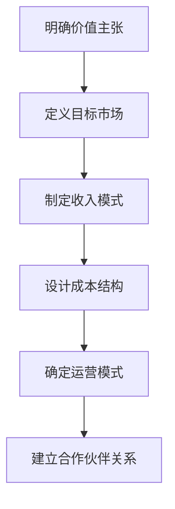
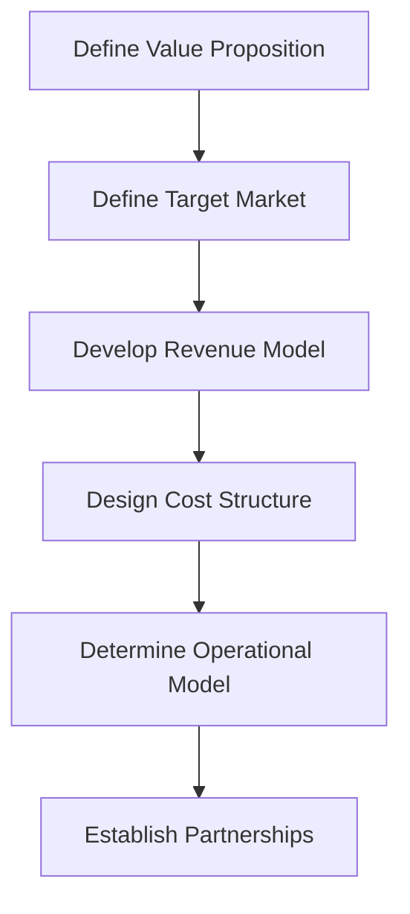

                 

### 文章标题

制定详细的商业计划：确定业务模式

在当今竞争激烈的市场环境中，企业需要精心制定详细的商业计划，以确保其战略目标得以实现。商业计划不仅是一种规划工具，更是企业成功的关键。本文将重点关注商业计划中的一个重要环节——确定业务模式。我们将通过逐步分析推理，详细探讨业务模式的定义、核心要素以及如何制定一个有效的业务模式。

关键词：商业计划、业务模式、战略目标、市场定位、运营模式、盈利模式

Abstract: In today's competitive market environment, businesses need to carefully develop detailed business plans to ensure the achievement of their strategic goals. A business plan is not only a planning tool but also a key to success. This article focuses on a critical aspect of business planning: determining the business model. Through step-by-step analysis and reasoning, we will explore the definition, core components, and the process of developing an effective business model.

### 1. 背景介绍

商业计划是一个全面的文档，它概述了企业的愿景、使命、目标、市场分析、产品或服务描述、营销策略、运营计划和财务预测。商业计划不仅是企业内部沟通和决策的指南，也是对外展示企业价值和吸引投资者的有力工具。商业计划的核心在于其可执行性，即企业能否按照计划实现其既定的目标。

在商业计划中，业务模式是一个至关重要的组成部分。业务模式定义了企业如何创造、传递和获取价值。它涵盖了企业的运营模式、市场定位、收入来源、成本结构以及关键合作伙伴关系等多个方面。一个成功的业务模式不仅能够帮助企业实现盈利，还能够确保企业的长期生存和增长。

本文将按照以下结构展开：

1. **背景介绍**：介绍商业计划的重要性以及业务模式在其中的关键作用。
2. **核心概念与联系**：详细定义业务模式，并探讨其核心要素和组成部分。
3. **核心算法原理 & 具体操作步骤**：解释如何分析和制定一个有效的业务模式。
4. **数学模型和公式 & 详细讲解 & 举例说明**：使用数学模型和公式来分析和优化业务模式。
5. **项目实践：代码实例和详细解释说明**：提供实际案例，展示如何实现业务模式的代码实例。
6. **实际应用场景**：讨论业务模式在不同行业和领域的应用。
7. **工具和资源推荐**：推荐相关工具、资源和文献，以帮助读者深入了解业务模式。
8. **总结：未来发展趋势与挑战**：总结业务模式的发展趋势和面临的挑战。
9. **附录：常见问题与解答**：回答读者可能遇到的一些常见问题。
10. **扩展阅读 & 参考资料**：提供进一步阅读的文献和资源。

### 2. 核心概念与联系

#### 2.1 什么是业务模式？

业务模式是一个商业术语，它描述了企业如何创造、传递和获取价值。业务模式不仅涉及企业的核心产品或服务，还涵盖了企业的运营、市场定位、收入来源、成本结构以及合作伙伴关系等多个方面。一个成功的业务模式应该能够清晰地回答以下问题：

- **价值主张**：企业为客户提供什么价值？
- **目标市场**：企业服务于哪些客户群体？
- **收入模式**：企业如何获得收入？
- **成本结构**：企业如何管理成本？
- **运营模式**：企业如何运营？
- **合作伙伴关系**：企业如何与供应商、客户和其他合作伙伴合作？

#### 2.2 业务模式的核心要素

业务模式的核心要素包括：

1. **价值主张**：价值主张是企业为客户提供的产品或服务的独特卖点。它应该明确地描述客户从产品或服务中获得的价值，并区别于竞争对手。

2. **目标市场**：目标市场是企业希望服务的客户群体。了解目标市场有助于企业制定相应的营销策略和产品定位。

3. **收入模式**：收入模式是企业如何获得收入的方式。常见的收入模式包括销售产品、提供服务、订阅模式、广告收入等。

4. **成本结构**：成本结构是企业运营的成本组成。了解成本结构有助于企业优化成本，提高盈利能力。

5. **运营模式**：运营模式是企业如何运营以实现业务目标的方式。这包括生产、供应链管理、销售和营销、客户服务等。

6. **合作伙伴关系**：合作伙伴关系是企业与其他企业、组织或个人合作的方式。合作伙伴关系有助于企业共享资源、降低成本、扩大市场等。

#### 2.3 业务模式与传统商业计划的关系

业务模式是商业计划的有机组成部分，但它不同于传统的商业计划。传统的商业计划侧重于企业的财务预测、营销策略和运营计划等方面，而业务模式则更加关注企业的价值创造和传递机制。具体来说，业务模式在以下几个方面与商业计划相辅相成：

1. **愿景和使命**：业务模式应该与企业的愿景和使命保持一致，以确保企业长期发展的战略方向。

2. **市场分析**：业务模式需要基于市场分析，了解目标市场的需求和趋势，以制定相应的价值主张和收入模式。

3. **产品或服务描述**：业务模式需要明确企业的核心产品或服务的特点，以吸引目标客户。

4. **营销策略**：业务模式需要与企业的营销策略相结合，以实现市场渗透和品牌建设。

5. **运营计划**：业务模式需要考虑企业的运营模式，以确保高效地实现业务目标。

6. **财务预测**：业务模式需要与财务预测相结合，以评估企业的盈利能力和投资回报。

### 2. Core Concepts and Connections

#### 2.1 What is a Business Model?

A business model is a commercial term that describes how a company creates, delivers, and captures value. A business model encompasses not only the core products or services offered by the company but also various aspects such as operations, market positioning, revenue streams, cost structure, and key partnerships. A successful business model should be able to clearly answer the following questions:

- What value does the company offer to its customers?
- Which customer segments does the company aim to serve?
- How does the company generate revenue?
- How does the company manage costs?
- How does the company operate to achieve its business objectives?
- How does the company collaborate with suppliers, customers, and other partners?

#### 2.2 Core Components of a Business Model

The core components of a business model include:

1. **Value Proposition**: The value proposition is the unique selling proposition of a company's products or services. It should clearly describe the value that customers derive from the offering and differentiate it from competitors.

2. **Target Market**: The target market is the group of customers that a company aims to serve. Understanding the target market helps the company to develop appropriate marketing strategies and product positioning.

3. **Revenue Model**: The revenue model is the way in which the company generates income. Common revenue models include selling products, providing services, subscription models, and advertising revenue.

4. **Cost Structure**: The cost structure is the composition of the company's operational costs. Understanding the cost structure helps the company to optimize costs and improve profitability.

5. **Operational Model**: The operational model is how the company operates to achieve its business objectives. This includes production, supply chain management, sales and marketing, and customer service.

6. **Partnerships**: Partnerships are the ways in which the company collaborates with other companies, organizations, or individuals. Partnerships help the company to share resources, reduce costs, and expand its market reach.

#### 2.3 The Relationship Between Business Models and Traditional Business Plans

A business model is an integral part of a business plan, but it differs from a traditional business plan in several ways. Traditional business plans focus on aspects such as financial forecasts, marketing strategies, and operational plans, while business models focus more on the mechanisms for value creation and delivery. Specifically, business models complement business plans in the following areas:

1. **Vision and Mission**: The business model should align with the company's vision and mission to ensure a consistent strategic direction for long-term growth.

2. **Market Analysis**: The business model should be based on market analysis to understand customer needs and trends, enabling the development of appropriate value propositions and revenue models.

3. **Product or Service Description**: The business model should clarify the features of the company's core products or services to attract target customers.

4. **Marketing Strategies**: The business model should integrate with marketing strategies to achieve market penetration and brand building.

5. **Operational Plans**: The business model should consider the company's operational model to ensure efficient achievement of business objectives.

6. **Financial Forecasts**: The business model should be aligned with financial forecasts to assess the company's profitability and return on investment.

### 3. 核心算法原理 & 具体操作步骤

#### 3.1 业务模式的框架分析

在制定业务模式时，我们需要采用一个系统化的方法来分析企业的核心运营。这个过程通常包括以下几个步骤：

1. **明确价值主张**：首先，我们需要明确企业的价值主张，即企业为客户提供什么独特价值。这通常需要深入市场研究和客户需求分析。

2. **定义目标市场**：接下来，我们需要定义目标市场，这包括细分市场和确定目标客户群体。

3. **制定收入模式**：基于目标市场和客户需求，我们需要制定合适的收入模式。这可以包括产品销售、服务收费、订阅模式、广告收入等。

4. **设计成本结构**：在制定收入模式的同时，我们还需要设计合理的成本结构，以控制成本并确保盈利。

5. **确定运营模式**：企业的运营模式是其业务模式的核心，包括生产、供应链管理、营销、销售和客户服务等。

6. **建立合作伙伴关系**：合作伙伴关系对于业务模式的成功至关重要。我们需要识别并建立与供应商、客户和其他合作伙伴的合作关系。

#### 3.2 业务模式的框架图

为了更清晰地展示业务模式的核心要素，我们可以使用Mermaid流程图来描述业务模式的各个组成部分。以下是业务模式框架图的示例：



在这个框架图中，每个节点代表业务模式的一个核心要素，箭头表示这些要素之间的逻辑关系。

#### 3.3 实际操作步骤

下面我们将具体探讨如何进行业务模式的制定：

1. **明确价值主张**：

   - 进行市场研究，了解目标客户的需求和痛点。
   - 分析竞争对手的价值主张，找出差异化的机会。
   - 制定一个清晰、简洁的价值主张陈述。

2. **定义目标市场**：

   - 通过市场细分，确定目标客户群体。
   - 确定目标市场的规模和增长潜力。
   - 制定目标市场的进入策略。

3. **制定收入模式**：

   - 分析目标市场的收入潜力，选择合适的收入模式。
   - 制定收入模式的定价策略和销售渠道。
   - 评估不同收入模式的风险和回报。

4. **设计成本结构**：

   - 确定企业的固定成本和可变成本。
   - 分析成本结构中的优化机会，如降低库存成本、提高生产效率等。
   - 制定成本控制的措施和策略。

5. **确定运营模式**：

   - 确定企业的生产流程和管理体系。
   - 设计营销和销售策略，确保市场渗透。
   - 建立客户服务和支持体系，提高客户满意度。

6. **建立合作伙伴关系**：

   - 识别潜在的合作伙伴，如供应商、分销商和客户。
   - 确定合作伙伴关系的目标和期望。
   - 制定合作计划和协议，确保合作关系稳定。

通过以上步骤，企业可以系统地制定出一个完整的业务模式，从而为企业的未来发展奠定坚实的基础。

### 3. Core Algorithm Principles & Specific Operational Steps

#### 3.1 Framework Analysis of Business Models

In developing a business model, it is essential to adopt a systematic approach to analyze the core operations of a business. This process typically involves the following steps:

1. **Define the Value Proposition**: First, we need to clarify the unique value that the company offers to its customers. This usually requires in-depth market research and customer needs analysis.

2. **Define the Target Market**: Next, we need to define the target market, which includes segmenting the market and identifying the target customer groups.

3. **Develop the Revenue Model**: Based on the target market and customer needs, we need to develop an appropriate revenue model. This can include selling products, charging for services, subscription models, and advertising revenue.

4. **Design the Cost Structure**: While developing the revenue model, we also need to design a reasonable cost structure to control costs and ensure profitability.

5. **Determine the Operational Model**: The operational model is the core of the business model, including production, supply chain management, marketing, sales, and customer service.

6. **Establish Partnerships**: Partnerships are crucial for the success of a business model. We need to identify and establish collaborations with suppliers, customers, and other partners.

#### 3.2 Business Model Framework Diagram

To more clearly illustrate the core components of a business model, we can use a Mermaid flowchart to describe the various elements. Here is an example of a business model framework diagram:



In this framework diagram, each node represents a core component of the business model, and the arrows indicate the logical relationships between these components.

#### 3.3 Specific Operational Steps

Below, we will delve into how to carry out the development of a business model:

1. **Define the Value Proposition**:

   - Conduct market research to understand the needs and pain points of target customers.
   - Analyze competitors' value propositions to find opportunities for differentiation.
   - Create a clear and concise value proposition statement.

2. **Define the Target Market**:

   - Segment the market to identify target customer groups.
   - Determine the size and growth potential of the target market.
   - Develop strategies for entering the target market.

3. **Develop the Revenue Model**:

   - Analyze the revenue potential of the target market and choose appropriate revenue models.
   - Develop pricing strategies and sales channels for the chosen revenue model.
   - Assess the risks and rewards of different revenue models.

4. **Design the Cost Structure**:

   - Identify fixed and variable costs for the business.
   - Analyze opportunities for optimizing the cost structure, such as reducing inventory costs and improving production efficiency.
   - Implement measures and strategies for cost control.

5. **Determine the Operational Model**:

   - Define the production processes and management systems of the business.
   - Design marketing and sales strategies to ensure market penetration.
   - Establish a customer service and support system to increase customer satisfaction.

6. **Establish Partnerships**:

   - Identify potential partners such as suppliers, distributors, and customers.
   - Determine the goals and expectations of the partnerships.
   - Develop partnership plans and agreements to ensure stable collaborations.

By following these steps, a company can systematically develop a comprehensive business model, laying a solid foundation for its future development.

### 4. 数学模型和公式 & 详细讲解 & 举例说明

#### 4.1 成本-收益分析

在制定业务模式时，成本-收益分析是一个重要的工具，用于评估企业的盈利能力和潜在回报。成本-收益分析的核心是确定企业的总成本（Total Cost, TC）和总收入（Total Revenue, TR），然后计算利润（Profit, P）。

**公式**：

\[ P = TR - TC \]

其中：
- \( P \) 表示利润
- \( TR \) 表示总收入
- \( TC \) 表示总成本

**详细讲解**：

1. **总成本（TC）**：
   总成本包括固定成本（Fixed Cost, FC）和可变成本（Variable Cost, VC）。固定成本是不随生产量变化而变化的成本，如租金、员工工资和设备折旧等。可变成本是随生产量变化而变化的成本，如原材料和直接劳动力成本等。

   \[ TC = FC + VC \]

2. **总收入（TR）**：
   总收入是企业在一定时间内通过销售产品或服务所获得的总金额。

   \[ TR = P \times Q \]

   其中，\( P \) 表示价格，\( Q \) 表示销售量。

3. **利润（P）**：
   利润是总收入减去总成本后的余额，表示企业的盈利情况。

   \[ P = TR - TC \]

**举例说明**：

假设一家制造企业生产产品X，单价为100元，每月固定成本为10,000元，每生产一件产品的可变成本为20元。如果该企业每月生产并销售了500件产品，那么：

- 总收入（TR）= 100元/件 × 500件 = 50,000元
- 总成本（TC）= 10,000元（固定成本）+ 20元/件 × 500件（可变成本）= 10,000元 + 10,000元 = 20,000元
- 利润（P）= 50,000元（总收入）- 20,000元（总成本）= 30,000元

因此，该企业每月的利润为30,000元。

#### 4.2 盈亏平衡分析

盈亏平衡分析是另一个重要的数学模型，用于确定企业在不亏本的情况下需要达到的销售量。

**公式**：

\[ Q_{\text{breakeven}} = \frac{FC}{P - VC} \]

其中：
- \( Q_{\text{breakeven}} \) 表示盈亏平衡点的销售量
- \( FC \) 表示固定成本
- \( P \) 表示价格
- \( VC \) 表示可变成本

**详细讲解**：

1. **盈亏平衡点（Breakeven Point）**：
   盈亏平衡点是指企业的总收入正好覆盖总成本，即利润为零的点。在这个点上，企业既没有盈利也没有亏损。

2. **销售量（Q）**：
   为了达到盈亏平衡点，企业需要达到一定的销售量。通过上述公式，我们可以计算出这个销售量。

**举例说明**：

假设一家餐厅的固定成本为30,000元，每份菜品的价格为50元，每份菜品的可变成本为20元。那么：

- \( Q_{\text{breakeven}} = \frac{30,000}{50 - 20} = \frac{30,000}{30} = 1,000 \)

因此，这家餐厅需要每月销售1,000份菜品才能达到盈亏平衡点。

#### 4.3 价格弹性分析

价格弹性分析是用于评估价格变化对需求量的影响程度。它可以帮助企业确定最合适的定价策略。

**公式**：

\[ E = \frac{\partial Q}{\partial P} \times \frac{P}{Q} \]

其中：
- \( E \) 表示价格弹性
- \( \frac{\partial Q}{\partial P} \) 表示价格变化1%时需求量的变化百分比
- \( P \) 表示价格
- \( Q \) 表示需求量

**详细讲解**：

1. **弹性（Elasticity）**：
   - 当 \( E > 1 \) 时，需求对价格变化敏感，即价格弹性大。这种情况下，价格降低会导致需求量显著增加。
   - 当 \( E < 1 \) 时，需求对价格变化不敏感，即价格弹性小。这种情况下，价格降低对需求量的影响较小。

2. **应用**：
   - 企业可以利用价格弹性分析来决定定价策略。对于价格弹性大的产品，降低价格可能带来更大的需求增长，从而提高收入。

**举例说明**：

假设某产品的需求量对价格的变化敏感度是10%，即价格每降低1%，需求量增加10%。如果当前价格为100元，需求量为1,000件，那么：

- \( E = \frac{\partial Q}{\partial P} \times \frac{P}{Q} = 10\% \times \frac{100}{1,000} = 0.1 \)

因此，该产品的价格弹性为0.1，表明需求对价格变化相对敏感。

### 4. Mathematical Models and Formulas & Detailed Explanation & Examples

#### 4.1 Cost-Benefit Analysis

In developing a business model, cost-benefit analysis is an important tool used to assess a company's profitability and potential returns. The core of cost-benefit analysis is to determine the company's total cost (Total Cost, TC) and total revenue (Total Revenue, TR), and then calculate the profit (Profit, P).

**Formula**:

\[ P = TR - TC \]

Where:
- \( P \) represents profit
- \( TR \) represents total revenue
- \( TC \) represents total cost

**Detailed Explanation**:

1. **Total Cost (TC)**:
   Total cost includes fixed cost (Fixed Cost, FC) and variable cost (Variable Cost, VC). Fixed costs are costs that do not change with the level of production, such as rent, employee wages, and equipment depreciation. Variable costs are costs that change with the level of production, such as raw materials and direct labor costs.

   \[ TC = FC + VC \]

2. **Total Revenue (TR)**:
   Total revenue is the total amount earned by the company through the sale of products or services in a certain period.

   \[ TR = P \times Q \]

   Where, \( P \) represents price, and \( Q \) represents the quantity sold.

3. **Profit (P)**:
   Profit is the surplus after deducting total cost from total revenue, indicating the company's financial performance.

   \[ P = TR - TC \]

**Example**:

Assume a manufacturing company produces product X, with a unit price of 100 yuan, a monthly fixed cost of 10,000 yuan, and a variable cost of 20 yuan per unit. If the company produces and sells 500 units per month, the calculations would be as follows:

- Total Revenue (TR) = 100 yuan/unit × 500 units = 50,000 yuan
- Total Cost (TC) = 10,000 yuan (fixed cost) + 20 yuan/unit × 500 units (variable cost) = 10,000 yuan + 10,000 yuan = 20,000 yuan
- Profit (P) = 50,000 yuan (total revenue) - 20,000 yuan (total cost) = 30,000 yuan

Therefore, the company's monthly profit is 30,000 yuan.

#### 4.2 Break-Even Analysis

Break-even analysis is another important mathematical model used to determine the sales volume at which a company does not incur a loss.

**Formula**:

\[ Q_{\text{breakeven}} = \frac{FC}{P - VC} \]

Where:
- \( Q_{\text{breakeven}} \) represents the breakeven point in sales volume
- \( FC \) represents fixed cost
- \( P \) represents price
- \( VC \) represents variable cost

**Detailed Explanation**:

1. **Breakeven Point**:
   The breakeven point is where the total revenue equals the total cost, resulting in zero profit. At this point, the company neither makes a profit nor incurs a loss.

2. **Sales Volume (Q)**:
   To reach the breakeven point, the company needs to achieve a certain level of sales volume. The above formula can be used to calculate this sales volume.

**Example**:

Assume a restaurant has a fixed cost of 30,000 yuan, a menu price of 50 yuan per dish, and a variable cost of 20 yuan per dish. The calculations would be as follows:

- \( Q_{\text{breakeven}} = \frac{30,000}{50 - 20} = \frac{30,000}{30} = 1,000 \)

Therefore, the restaurant needs to sell 1,000 dishes per month to reach the breakeven point.

#### 4.3 Price Elasticity Analysis

Price elasticity analysis is used to assess the degree of impact of price changes on demand. It helps companies determine the most appropriate pricing strategy.

**Formula**:

\[ E = \frac{\partial Q}{\partial P} \times \frac{P}{Q} \]

Where:
- \( E \) represents price elasticity
- \( \frac{\partial Q}{\partial P} \) represents the percentage change in demand when the price changes by 1%
- \( P \) represents price
- \( Q \) represents demand

**Detailed Explanation**:

1. **Elasticity**:
   - When \( E > 1 \), demand is sensitive to price changes, indicating high price elasticity. In this case, a decrease in price leads to a significant increase in demand.
   - When \( E < 1 \), demand is not sensitive to price changes, indicating low price elasticity. In this case, a decrease in price has a small impact on demand.

2. **Application**:
   - Companies can use price elasticity analysis to decide on pricing strategies. For products with high price elasticity, reducing the price may lead to a greater increase in demand, thus increasing revenue.

**Example**:

Assume a product has a demand sensitivity of 10%, meaning that for every 1% decrease in price, demand increases by 10%. If the current price is 100 yuan and the demand is 1,000 units, the calculations would be as follows:

- \( E = \frac{\partial Q}{\partial P} \times \frac{P}{Q} = 10\% \times \frac{100}{1,000} = 0.1 \)

Therefore, the product's price elasticity is 0.1, indicating that demand is relatively sensitive to price changes.

### 5. 项目实践：代码实例和详细解释说明

在上一部分中，我们介绍了业务模式的核心概念和数学模型。为了更好地理解这些概念和模型在实际应用中的运作，我们将通过一个实际案例来展示如何使用代码来制定和优化业务模式。

#### 5.1 开发环境搭建

首先，我们需要搭建一个开发环境，以便进行业务模式的代码实践。以下是一个基本的开发环境搭建步骤：

1. **安装Python环境**：

   - 使用Python进行业务模式的开发和测试。确保已经安装了Python 3.8或更高版本。

2. **安装相关库**：

   - 使用pip安装以下库：numpy、matplotlib、pandas等。

   ```shell
   pip install numpy matplotlib pandas
   ```

3. **配置代码编辑器**：

   - 选择一个合适的代码编辑器，如Visual Studio Code或PyCharm，并安装相应的插件以支持Python开发。

#### 5.2 源代码详细实现

以下是一个简单的Python代码示例，用于计算和分析业务模式中的成本-收益和盈亏平衡。

```python
import numpy as np
import pandas as pd
import matplotlib.pyplot as plt

# 定义参数
fixed_cost = 10000  # 固定成本
variable_cost_per_unit = 20  # 每单位可变成本
price_per_unit = 100  # 单位价格
breakeven_sales_volume = fixed_cost / (price_per_unit - variable_cost_per_unit)
profitable_sales_volume = 5000

# 计算收入和利润
revenue = price_per_unit * profitable_sales_volume
total_cost = fixed_cost + variable_cost_per_unit * profitable_sales_volume
profit = revenue - total_cost

# 打印结果
print(f"盈亏平衡点销售量：{breakeven_sales_volume}件")
print(f"利润：{profit}元")

# 绘制盈亏平衡图
sales_volume = np.linspace(0, 10000, 1000)
revenue_line = price_per_unit * sales_volume
cost_line = fixed_cost + variable_cost_per_unit * sales_volume
profit_line = revenue_line - cost_line

plt.plot(sales_volume, revenue_line, label='收入')
plt.plot(sales_volume, cost_line, label='成本')
plt.plot(sales_volume, profit_line, label='利润')
plt.axhline(0, color='grey', linewidth=1)
plt.axvline(breakeven_sales_volume, color='red', linewidth=2, label='盈亏平衡点')
plt.axvline(profitable_sales_volume, color='green', linewidth=2, label='利润点')
plt.xlabel('销售量')
plt.ylabel('金额')
plt.title('业务模式分析')
plt.legend()
plt.show()
```

#### 5.3 代码解读与分析

1. **参数定义**：

   - `fixed_cost`：固定成本，例如租金、员工工资等。
   - `variable_cost_per_unit`：每单位产品的可变成本，例如原材料成本、直接劳动成本等。
   - `price_per_unit`：产品单价。
   - `breakeven_sales_volume`：盈亏平衡点的销售量。
   - `profitable_sales_volume`：利润点的销售量。

2. **计算收入和利润**：

   - `revenue`：计算总收入的公式为单价乘以销售量。
   - `total_cost`：计算总成本的公式为固定成本加上可变成本乘以销售量。
   - `profit`：利润为总收入减去总成本。

3. **绘制盈亏平衡图**：

   - 使用matplotlib绘制收入、成本和利润线，以及盈亏平衡点和利润点。

#### 5.4 运行结果展示

运行上述代码后，将显示一个盈亏平衡分析图，其中包含收入线、成本线和利润线。图表中的红色线表示盈亏平衡点，绿色线表示利润点。通过这个图表，我们可以直观地了解在不同销售量下的收入、成本和利润情况，从而更好地制定和优化业务模式。

### 5. Project Practice: Code Examples and Detailed Explanation

In the previous section, we introduced the core concepts and mathematical models of business models. To better understand how these concepts and models operate in practical applications, we will showcase a real-world case through code to develop and optimize business models.

#### 5.1 Setting Up the Development Environment

Firstly, we need to set up a development environment to conduct the code practice for business models. Here is a basic step-by-step guide to setting up the environment:

1. **Install Python Environment**:

   - Use Python for business model development and testing. Ensure that Python 3.8 or higher is installed.

2. **Install Relevant Libraries**:

   - Use `pip` to install the following libraries: numpy, matplotlib, pandas, etc.

   ```shell
   pip install numpy matplotlib pandas
   ```

3. **Configure Code Editor**:

   - Choose a suitable code editor, such as Visual Studio Code or PyCharm, and install the appropriate plugins to support Python development.

#### 5.2 Detailed Implementation of the Source Code

The following is a simple Python code example used to calculate and analyze the cost-benefit and break-even points in a business model.

```python
import numpy as np
import pandas as pd
import matplotlib.pyplot as plt

# Define parameters
fixed_cost = 10000  # Fixed cost
variable_cost_per_unit = 20  # Variable cost per unit
price_per_unit = 100  # Price per unit
breakeven_sales_volume = fixed_cost / (price_per_unit - variable_cost_per_unit)
profitable_sales_volume = 5000

# Calculate revenue and profit
revenue = price_per_unit * profitable_sales_volume
total_cost = fixed_cost + variable_cost_per_unit * profitable_sales_volume
profit = revenue - total_cost

# Print results
print(f"Break-even sales volume: {breakeven_sales_volume} units")
print(f"Profit: {profit} yuan")

# Plot break-even chart
sales_volume = np.linspace(0, 10000, 1000)
revenue_line = price_per_unit * sales_volume
cost_line = fixed_cost + variable_cost_per_unit * sales_volume
profit_line = revenue_line - cost_line

plt.plot(sales_volume, revenue_line, label='Revenue')
plt.plot(sales_volume, cost_line, label='Cost')
plt.plot(sales_volume, profit_line, label='Profit')
plt.axhline(0, color='grey', linewidth=1)
plt.axvline(breakeven_sales_volume, color='red', linewidth=2, label='Break-even Point')
plt.axvline(profitable_sales_volume, color='green', linewidth=2, label='Profit Point')
plt.xlabel('Sales Volume')
plt.ylabel('Amount')
plt.title('Business Model Analysis')
plt.legend()
plt.show()
```

#### 5.3 Code Explanation and Analysis

1. **Parameter Definition**:

   - `fixed_cost`: Fixed costs, such as rent, employee wages, etc.
   - `variable_cost_per_unit`: Variable cost per unit, such as raw material cost, direct labor cost, etc.
   - `price_per_unit`: Unit price.
   - `breakeven_sales_volume`: Sales volume at the break-even point.
   - `profitable_sales_volume`: Sales volume at the profit point.

2. **Calculate Revenue and Profit**:

   - `revenue`: The formula for calculating total revenue is the unit price multiplied by the sales volume.
   - `total_cost`: The formula for calculating total cost is the sum of fixed cost plus the product of variable cost per unit and sales volume.
   - `profit`: Profit is the difference between total revenue and total cost.

3. **Plot Break-Even Chart**:

   - Use `matplotlib` to plot the lines for revenue, cost, and profit, as well as the break-even point and profit point.

#### 5.4 Results Display

After running the above code, a break-even analysis chart will be displayed, showing the revenue line, cost line, and profit line. The red line indicates the break-even point, and the green line indicates the profit point. Through this chart, we can intuitively understand the revenue, cost, and profit at different sales volumes, allowing for better development and optimization of the business model.

### 6. 实际应用场景

业务模式是企业在市场中生存和发展的关键，因此在不同的行业和领域中，业务模式也呈现出多样化的特点。以下是一些典型行业中的业务模式案例：

#### 6.1 互联网行业

在互联网行业，业务模式通常以平台经济为主。例如，阿里巴巴通过建立电子商务平台，连接买家和卖家，实现了商业模式的创新。它的核心要素包括：

- **价值主张**：提供便捷的网上购物体验，降低交易成本。
- **目标市场**：广泛的目标市场，包括消费者、商家和各种服务商。
- **收入模式**：通过广告、交易抽成和云计算等服务获得收入。
- **成本结构**：主要包括技术开发成本、服务器租赁成本和营销费用。
- **运营模式**：通过大数据分析和算法优化提高运营效率。
- **合作伙伴关系**：与供应商、物流公司和支付机构建立紧密的合作关系。

#### 6.2 制造业

制造业的业务模式通常侧重于生产效率和产品质量。例如，丰田公司采用的精益生产模式，通过持续改进和消除浪费，实现了高质量和高效率的生产。其核心要素包括：

- **价值主张**：提供高质量、高效率的产品。
- **目标市场**：全球市场，特别是高端汽车市场。
- **收入模式**：通过销售汽车和提供维修服务获得收入。
- **成本结构**：主要包括生产成本、研发成本和营销费用。
- **运营模式**：采用精益生产、自动化和持续改进的方法。
- **合作伙伴关系**：与供应商、分销商和客户建立长期合作关系。

#### 6.3 餐饮行业

餐饮行业的业务模式通常侧重于顾客体验和服务质量。例如，星巴克通过打造独特的咖啡文化和舒适的消费环境，吸引了大量顾客。其核心要素包括：

- **价值主张**：提供高品质的咖啡和舒适的环境。
- **目标市场**：白领、学生和商务人士。
- **收入模式**：通过销售咖啡、糕点和饮品获得收入。
- **成本结构**：主要包括原材料成本、租金成本和人力成本。
- **运营模式**：通过连锁店模式扩展市场，并采用数据分析和客户关系管理提高运营效率。
- **合作伙伴关系**：与咖啡豆供应商、糕点供应商和装修公司建立合作关系。

#### 6.4 金融行业

金融行业的业务模式通常侧重于风险管理和资产配置。例如，摩根士丹利通过提供全面的金融服务，包括投资银行、证券经纪和资产管理等，实现了多元化收入。其核心要素包括：

- **价值主张**：提供专业的金融服务和投资建议。
- **目标市场**：全球高端客户和企业。
- **收入模式**：通过收取手续费、佣金和管理费获得收入。
- **成本结构**：主要包括人力成本、技术研发成本和运营费用。
- **运营模式**：通过全球网络和先进的金融技术提供高效服务。
- **合作伙伴关系**：与金融机构、企业和投资者建立广泛的合作关系。

通过这些案例，我们可以看到，业务模式在不同的行业和领域中有着不同的表现形式，但核心要素和基本原则是相通的。企业需要根据自身特点和市场需求，制定符合自身发展的业务模式，以实现长期成功。

### 6. Practical Application Scenarios

Business models are the key to a company's survival and growth in various industries and markets. Therefore, business models in different industries and fields exhibit diverse characteristics. Below are some case studies of business models in typical industries:

#### 6.1 Internet Industry

In the internet industry, business models typically focus on platform economies. For example, Alibaba has innovated its business model by building an e-commerce platform that connects buyers and sellers. The core components of its business model include:

- **Value Proposition**: Providing a convenient online shopping experience that reduces transaction costs.
- **Target Market**: A broad market that includes consumers, merchants, and various service providers.
- **Revenue Model**: Generating revenue through advertising, transaction fees, and cloud computing services.
- **Cost Structure**: Mainly including technology development costs, server rental costs, and marketing expenses.
- **Operational Model**: Using big data analysis and algorithm optimization to improve operational efficiency.
- **Partnerships**: Establishing close partnerships with suppliers, logistics companies, and payment institutions.

#### 6.2 Manufacturing Industry

Manufacturing business models typically focus on production efficiency and product quality. For example, Toyota's lean production model, through continuous improvement and waste elimination, has achieved high-quality and efficient production. The core components of its business model include:

- **Value Proposition**: Providing high-quality, high-efficiency products.
- **Target Market**: A global market, particularly the high-end automotive market.
- **Revenue Model**: Generating revenue through the sale of automobiles and providing maintenance services.
- **Cost Structure**: Mainly including production costs, research and development costs, and marketing expenses.
- **Operational Model**: Adopting lean production, automation, and continuous improvement methods.
- **Partnerships**: Establishing long-term relationships with suppliers, distributors, and customers.

#### 6.3 Restaurant Industry

The business model in the restaurant industry typically focuses on customer experience and service quality. For example, Starbucks has attracted a large customer base by creating a unique coffee culture and a comfortable environment. The core components of its business model include:

- **Value Proposition**: Providing high-quality coffee and a comfortable environment.
- **Target Market**: White-collar workers, students, and business people.
- **Revenue Model**: Generating revenue through the sale of coffee, pastries, and beverages.
- **Cost Structure**: Mainly including raw material costs, rental costs, and labor costs.
- **Operational Model**: Expanding the market through a chain of stores and using data analysis and customer relationship management to improve operational efficiency.
- **Partnerships**: Establishing partnerships with coffee bean suppliers, pastry suppliers, and interior design companies.

#### 6.4 Financial Industry

Financial business models typically focus on risk management and asset allocation. For example, Morgan Stanley has diversified its revenue streams by providing comprehensive financial services, including investment banking, securities brokerage, and asset management. The core components of its business model include:

- **Value Proposition**: Providing professional financial services and investment advice.
- **Target Market**: Global high-net-worth individuals and corporations.
- **Revenue Model**: Generating revenue through the collection of fees, commissions, and management fees.
- **Cost Structure**: Mainly including labor costs, technology development costs, and operating expenses.
- **Operational Model**: Providing efficient services through a global network and advanced financial technology.
- **Partnerships**: Establishing extensive partnerships with financial institutions, corporations, and investors.

Through these case studies, we can see that business models in different industries and fields have different manifestations, but the core components and fundamental principles are interconnected. Companies need to develop business models that align with their own characteristics and market demand to achieve long-term success.

### 7. 工具和资源推荐

在制定和优化业务模式的过程中，企业和个人需要借助各种工具和资源来收集数据、分析市场、评估风险和制定策略。以下是一些推荐的工具和资源，以帮助读者深入了解业务模式。

#### 7.1 学习资源推荐

1. **书籍**：

   - 《商业模式新生代》（Business Model Generation）：作者亚历山大·奥斯特瓦尔德（Alexander Osterwalder）和伊夫·皮尼翁（Yves Pigneur）。这本书提供了系统的方法来设计和分析业务模式。

   - 《设计思维》（Design Thinking）：作者蒂姆·布朗（Tim Brown）。这本书介绍了设计思维在创新和业务模式设计中的应用。

2. **在线课程**：

   - Coursera上的《商业模式创新》（Business Model Innovation）：由柏林工业大学（Technical University of Berlin）提供。这个课程涵盖了业务模式创新的理论和实践。

   - Udemy上的《商业计划与融资》：由创业导师Adrian Tan提供。这个课程提供了制定商业计划和融资的实用技巧。

3. **博客和网站**：

   - 商业模式画布（Business Model Canvas）：由亚历山大·奥斯特瓦尔德创立的网站，提供了关于业务模式画布的详细信息和案例分析。

   - 香港科技大学创业中心（Tech Entrepreneurship Center at HKUST）：这个网站提供了关于创业和业务模式的最新研究和实用资源。

#### 7.2 开发工具框架推荐

1. **Miro**：

   - Miro是一个在线协作白板工具，可用于绘制业务模式画布、流程图和其他设计文档。

2. **Tableau**：

   - Tableau是一个数据可视化工具，可用于分析业务数据和市场趋势，帮助制定更有效的业务策略。

3. **Salesforce**：

   - Salesforce是一个客户关系管理（CRM）平台，可用于管理销售、客户服务和市场营销活动，优化业务运营。

#### 7.3 相关论文著作推荐

1. **论文**：

   - “The Business Model: What is it, Who created it, and Why does it matter?”：这篇文章详细介绍了业务模式的起源、定义和重要性。

   - “Platform Business Models: A Systematic Review and Research Agenda”：这篇文章对平台型业务模式进行了系统性综述，并提出了未来的研究方向。

2. **著作**：

   - “Business Models and Innovation”：作者克里斯托弗·梅因茨（Christopher Meyer）和亨利·范·德·哈姆（Henry van der Heijden）。这本书探讨了业务模式创新和业务模式设计的策略。

   - “Business Model Innovation: Releasing the Value of Growth and Innovation for Your Enterprise”：作者林恩·福布斯（Lynn F. Brooks）和查尔斯·拉夫林（Charles A. Holloway）。这本书提供了业务模式创新的实践指南。

通过利用这些工具和资源，企业和个人可以更好地理解业务模式的核心概念和实践方法，从而制定出更具竞争力的业务策略。

### 7. Tools and Resources Recommendations

In the process of developing and optimizing business models, companies and individuals need to rely on various tools and resources to collect data, analyze the market, assess risks, and formulate strategies. Below are some recommended tools and resources to help readers gain a deeper understanding of business models.

#### 7.1 Learning Resources Recommendations

1. **Books**:

   - "Business Model Generation" by Alexander Osterwalder and Yves Pigneur. This book provides a systematic approach to designing and analyzing business models.

   - "Design Thinking" by Tim Brown. This book introduces the application of design thinking in innovation and business model design.

2. **Online Courses**:

   - "Business Model Innovation" on Coursera, offered by Technical University of Berlin. This course covers the theory and practice of business model innovation.

   - "Business Planning and Financing" on Udemy, taught by entrepreneur trainer Adrian Tan. This course provides practical tips for developing business plans and securing financing.

3. **Blogs and Websites**:

   - Business Model Canvas website, founded by Alexander Osterwalder, which offers detailed information and case studies on the Business Model Canvas.

   - Tech Entrepreneurship Center at HKUST, providing the latest research and practical resources on entrepreneurship and business models.

#### 7.2 Development Tool Framework Recommendations

1. **Miro**:

   - Miro is an online collaborative whiteboard tool that can be used to draw Business Model Canvas, flowcharts, and other design documents.

2. **Tableau**:

   - Tableau is a data visualization tool that can be used to analyze business data and market trends, helping to formulate more effective business strategies.

3. **Salesforce**:

   - Salesforce is a Customer Relationship Management (CRM) platform used to manage sales, customer service, and marketing activities, optimizing business operations.

#### 7.3 Recommended Related Papers and Books

1. **Papers**:

   - "The Business Model: What is it, Who created it, and Why does it matter?" which provides a detailed introduction to the origins, definition, and importance of business models.

   - "Platform Business Models: A Systematic Review and Research Agenda," which conducts a systematic overview of platform business models and proposes future research directions.

2. **Books**:

   - "Business Models and Innovation" by Christopher Meyer and Henry van der Heijden, which discusses strategies for business model innovation and design.

   - "Business Model Innovation: Releasing the Value of Growth and Innovation for Your Enterprise" by Lynn F. Brooks and Charles A. Holloway, which provides practical guides for business model innovation.

By utilizing these tools and resources, companies and individuals can better understand the core concepts and practical methods of business models, thereby developing more competitive business strategies.

### 8. 总结：未来发展趋势与挑战

随着科技的不断进步和市场的快速变化，业务模式也在不断演变。以下是一些未来业务模式发展趋势和面临的挑战：

#### 8.1 未来发展趋势

1. **数字化和自动化**：

   - 数字化和自动化技术的普及将极大地改变业务模式。企业将更多地依赖大数据分析、人工智能和自动化流程来优化运营和决策。

2. **可持续性**：

   - 可持续性和环境责任将成为业务模式设计的重要考虑因素。企业需要考虑如何在减少环境负担的同时实现盈利。

3. **平台化**：

   - 平台型业务模式将继续增长，尤其是在共享经济和电子商务领域。平台能够有效地连接供需双方，创造更多的价值和机会。

4. **个性化**：

   - 个性化服务和定制化产品将成为主流。企业需要通过数据分析和技术手段更好地理解客户需求，提供个性化的解决方案。

5. **全球化**：

   - 全球化趋势将进一步加强，企业需要适应不同市场的需求和法规，建立全球化的业务网络。

#### 8.2 面临的挑战

1. **技术变革**：

   - 技术的快速变革带来了不确定性，企业需要不断学习和适应新技术，以保持竞争力。

2. **数据隐私和安全性**：

   - 数据隐私和安全性问题日益突出，企业需要确保客户数据的安全和隐私，以避免法律和声誉风险。

3. **竞争压力**：

   - 竞争日益激烈，企业需要不断创新和优化业务模式，以应对竞争对手的挑战。

4. **监管变化**：

   - 监管环境的不断变化对企业的业务模式提出了新的要求。企业需要密切关注监管政策，及时调整业务策略。

5. **社会和环境责任**：

   - 社会和环境责任对企业提出了更高的要求。企业需要在追求盈利的同时，承担社会责任，实现可持续发展。

总之，未来业务模式的发展将受到多种因素的影响，企业需要具备灵活性和创新精神，以应对不断变化的市场环境和技术变革。通过不断优化和创新，企业可以在竞争激烈的市场中立于不败之地。

### 8. Summary: Future Development Trends and Challenges

With the continuous advancement of technology and rapid changes in the market, business models are constantly evolving. Here are some future trends and challenges in business model development:

#### 8.1 Future Development Trends

1. **Digitalization and Automation**:

   - The widespread adoption of digital and automation technologies will significantly transform business models. Companies will increasingly rely on big data analytics, artificial intelligence, and automated processes to optimize operations and decision-making.

2. **Sustainability**:

   - Sustainability and environmental responsibility will become key considerations in business model design. Companies need to consider how to reduce environmental impact while achieving profitability.

3. **Platformization**:

   - Platform-based business models will continue to grow, particularly in the fields of sharing economy and e-commerce. Platforms can effectively connect supply and demand, creating more value and opportunities.

4. **Personalization**:

   - Personalized services and customized products will become mainstream. Companies need to leverage data analytics and technology to better understand customer needs and provide personalized solutions.

5. **Globalization**:

   - The trend of globalization will further strengthen, requiring companies to adapt to the needs and regulations of different markets and establish a global business network.

#### 8.2 Challenges Ahead

1. **Technological Change**:

   - Rapid technological change brings uncertainty, and companies need to continually learn and adapt to new technologies to remain competitive.

2. **Data Privacy and Security**:

   - Data privacy and security issues are becoming increasingly prominent. Companies need to ensure the security and privacy of customer data to avoid legal and reputational risks.

3. **Competition**:

   - Intense competition requires companies to innovate and optimize their business models continuously to stay ahead of rivals.

4. **Regulatory Changes**:

   - Ongoing changes in the regulatory environment pose new requirements for businesses. Companies need to closely monitor regulatory policies and adjust business strategies accordingly.

5. **Social and Environmental Responsibility**:

   - Social and environmental responsibility imposes higher demands on businesses. Companies need to pursue profitability while also taking on social responsibilities and achieving sustainable development.

In summary, the future development of business models will be influenced by various factors. Companies need to demonstrate flexibility and innovation to navigate the constantly changing market environment and technological advancements. By continuously optimizing and innovating, businesses can maintain a competitive edge in the fiercely competitive market.

### 9. 附录：常见问题与解答

在本文中，我们详细探讨了业务模式的概念、核心要素、制定方法以及实际应用。为了帮助读者更好地理解和应用这些知识，下面我们列举了一些常见问题，并提供相应的解答。

#### 9.1 什么是业务模式？

业务模式是指企业如何创造、传递和获取价值的一种方式。它涵盖了企业的运营、市场定位、收入来源、成本结构以及关键合作伙伴关系等多个方面。

#### 9.2 业务模式的核心要素有哪些？

业务模式的核心要素包括：

- **价值主张**：企业为客户提供的产品或服务的独特卖点。
- **目标市场**：企业希望服务的客户群体。
- **收入模式**：企业如何获得收入。
- **成本结构**：企业运营的成本组成。
- **运营模式**：企业如何运营。
- **合作伙伴关系**：企业与其他企业、组织或个人合作的方式。

#### 9.3 如何制定一个有效的业务模式？

制定一个有效的业务模式需要以下几个步骤：

1. **明确价值主张**：通过市场研究和客户需求分析，确定企业为客户提供的价值。
2. **定义目标市场**：细分市场，确定目标客户群体。
3. **制定收入模式**：基于目标市场和客户需求，选择合适的收入模式。
4. **设计成本结构**：分析成本结构，确保成本可控制。
5. **确定运营模式**：设计高效的运营流程。
6. **建立合作伙伴关系**：与供应商、客户和其他合作伙伴建立合作关系。

#### 9.4 业务模式在互联网行业中有什么特点？

互联网行业的业务模式通常具有以下特点：

- **平台化**：通过建立平台连接供需双方，实现价值的传递。
- **数字化**：依赖数字技术进行运营和数据分析。
- **快速迭代**：不断优化和迭代产品和服务，以适应市场需求。
- **用户参与**：通过用户反馈和参与，不断提升产品和服务质量。

#### 9.5 业务模式设计中的常见错误有哪些？

业务模式设计中的常见错误包括：

- **价值主张不清晰**：没有明确的价值主张，导致客户无法理解企业所提供的产品或服务。
- **目标市场不明确**：没有明确的目标市场，导致无法有效定位和吸引客户。
- **收入模式不稳定**：选择的收入模式不稳定或不可持续，导致企业盈利困难。
- **成本结构不合理**：成本结构不合理，导致企业无法有效控制成本。
- **合作伙伴关系管理不善**：合作伙伴关系管理不善，导致合作不稳定或利益分配不公。

通过避免这些常见错误，企业可以更好地设计和实施业务模式，实现长期成功。

### 9. Appendix: Frequently Asked Questions and Answers

In this article, we have delved into the concepts, core components, development methods, and practical applications of business models. To help readers better understand and apply this knowledge, we will list some frequently asked questions along with their answers below.

#### 9.1 What is a business model?

A business model is a way for a company to create, deliver, and capture value. It encompasses various aspects such as operations, market positioning, revenue streams, cost structure, and key partnerships.

#### 9.2 What are the core components of a business model?

The core components of a business model include:

- **Value Proposition**: The unique selling point of the products or services offered by the company.
- **Target Market**: The group of customers that the company aims to serve.
- **Revenue Model**: How the company generates income.
- **Cost Structure**: The composition of the company's operational costs.
- **Operational Model**: How the company operates to achieve its business objectives.
- **Partnerships**: How the company collaborates with suppliers, customers, and other partners.

#### 9.3 How to develop an effective business model?

Developing an effective business model involves several steps:

1. **Define the Value Proposition**: Conduct market research and customer needs analysis to determine the value that the company offers to its customers.
2. **Define the Target Market**: Segment the market and identify the target customer groups.
3. **Develop the Revenue Model**: Based on the target market and customer needs, choose an appropriate revenue model.
4. **Design the Cost Structure**: Analyze the cost structure to ensure cost control.
5. **Determine the Operational Model**: Design an efficient operational process.
6. **Establish Partnerships**: Collaborate with suppliers, customers, and other partners.

#### 9.4 What are the characteristics of business models in the internet industry?

Business models in the internet industry typically have the following characteristics:

- **Platformization**: Connecting supply and demand through platforms to deliver value.
- **Digitalization**: Reliance on digital technologies for operations and data analysis.
- **Fast Iteration**: Continuously optimizing and iterating products and services to meet market demands.
- **User Involvement**: Leveraging user feedback and participation to continually improve product and service quality.

#### 9.5 What are common mistakes in business model design?

Common mistakes in business model design include:

- **Unclear Value Proposition**: Not having a clear value proposition, making it difficult for customers to understand the company's products or services.
- **Unclear Target Market**: Not having a clear target market, making it difficult to position and attract customers.
- **Unstable Revenue Model**: Choosing a revenue model that is unstable or unsustainable, leading to difficulties in generating profits.
- **Inefficient Cost Structure**: An inefficient cost structure, making it difficult for the company to control costs.
- **Poor Management of Partnerships**: Poor management of partnerships, leading to unstable collaborations or unfair profit sharing.

By avoiding these common mistakes, companies can better design and implement their business models, leading to long-term success.

### 10. 扩展阅读 & 参考资料

为了帮助读者进一步深入了解业务模式的相关知识，本文提供了一系列扩展阅读和参考资料。这些资源涵盖了业务模式的理论基础、实际案例、研究文献以及相关的学习资源。

#### 10.1 书籍推荐

1. **《商业模式新生代》**（Business Model Generation）- 作者：亚历山大·奥斯特瓦尔德（Alexander Osterwalder）和伊夫·皮尼翁（Yves Pigneur）。这本书提供了构建和评估业务模式的实用工具和案例。

2. **《设计思维》**（Design Thinking）- 作者：蒂姆·布朗（Tim Brown）。该书介绍了设计思维的原理，并将其应用于商业创新。

3. **《商业模式创新》**（Business Model Innovation）- 作者：林恩·福布斯（Lynn F. Brooks）和查尔斯·拉夫林（Charles A. Holloway）。这本书探讨了如何通过创新来优化和重塑业务模式。

#### 10.2 论文和期刊

1. **"Platform Business Models: A Systematic Review and Research Agenda"** - 该论文对平台型业务模式进行了系统性综述，并提出了未来的研究方向。

2. **"The Business Model: What is it, Who created it, and Why does it matter?"** - 这篇论文详细介绍了业务模式的起源、定义和重要性。

3. **《管理科学学报》**、《商业经济与管理》、《科技管理研究》等国内外的学术期刊，都发表了大量关于业务模式的研究论文。

#### 10.3 在线课程和教程

1. **Coursera上的《商业模式创新》** - 由柏林工业大学提供，涵盖业务模式创新的理论和实践。

2. **Udemy上的《商业计划与融资》** - 由创业导师Adrian Tan提供，提供了制定商业计划和融资的实用技巧。

3. **edX上的《商业创新与战略管理》** - 由哈佛大学商学院提供，介绍了商业创新和战略管理的基础知识。

#### 10.4 博客和网站

1. **阿里巴巴集团官网** - 阿里巴巴通过其平台商业模式取得了巨大成功，官网提供了丰富的案例分析和业务模式解读。

2. **硅谷动态** - 该网站提供了大量关于互联网行业业务模式创新的最新动态和案例分析。

3. **Business Model Canvas官网** - 亚历山大·奥斯特瓦尔德创建的网站，提供了关于业务模式画布的详细信息和实用工具。

通过这些扩展阅读和参考资料，读者可以进一步深化对业务模式的理解，并从中汲取灵感和实践指导，为自己的业务发展提供有力支持。

### 10. Extended Reading & Reference Materials

To assist readers in gaining a deeper understanding of business models and related knowledge, this article provides a list of extended reading materials and reference resources. These resources cover the theoretical foundations, practical cases, research papers, and learning resources related to business models.

#### 10.1 Recommended Books

1. **"Business Model Generation"** by Alexander Osterwalder and Yves Pigneur. This book offers practical tools and case studies for building and evaluating business models.

2. **"Design Thinking"** by Tim Brown. This book introduces the principles of design thinking and its application in business innovation.

3. **"Business Model Innovation"** by Lynn F. Brooks and Charles A. Holloway. This book explores how to optimize and reshape business models through innovation.

#### 10.2 Recommended Papers and Journals

1. **"Platform Business Models: A Systematic Review and Research Agenda"** - This paper conducts a systematic overview of platform business models and proposes future research directions.

2. **"The Business Model: What is it, Who created it, and Why does it matter?"** - This paper provides a detailed introduction to the origins, definition, and importance of business models.

3. **Academic journals such as "Journal of Management Science," "Journal of Business Strategy," and "Management Science"** both domestically and internationally, which have published numerous research papers on business models.

#### 10.3 Online Courses and Tutorials

1. **"Business Model Innovation" on Coursera** - Offered by Technical University of Berlin, this course covers the theory and practice of business model innovation.

2. **"Business Planning and Financing" on Udemy** - Taught by entrepreneur trainer Adrian Tan, this course provides practical tips for developing business plans and securing financing.

3. **"Business Innovation and Strategic Management" on edX** - Offered by Harvard Business School, this course introduces the fundamentals of business innovation and strategic management.

#### 10.4 Blogs and Websites

1. **Alibaba Group Official Website** - Alibaba's success with its platform business model provides rich case analyses and business model interpretations.

2. **Silicon Valley Trends** - This website offers a wealth of the latest trends and case studies in the internet industry business model innovation.

3. **Business Model Canvas Official Website** - The website created by Alexander Osterwalder, which provides detailed information and practical tools on the Business Model Canvas.

By exploring these extended reading materials and reference resources, readers can further deepen their understanding of business models and gain insights and practical guidance to support their business development.

