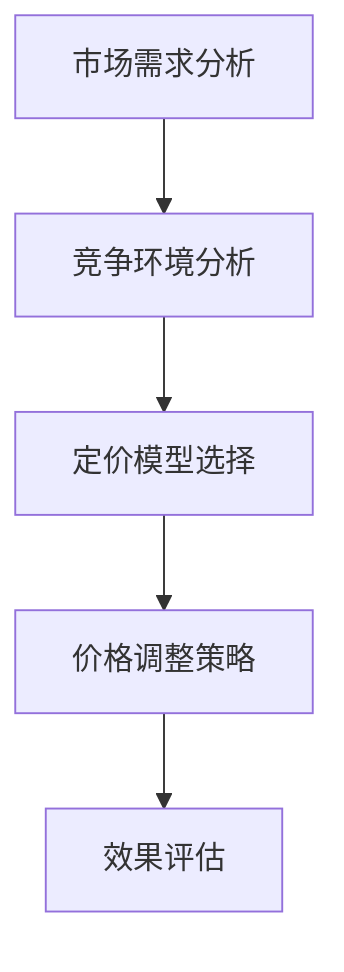
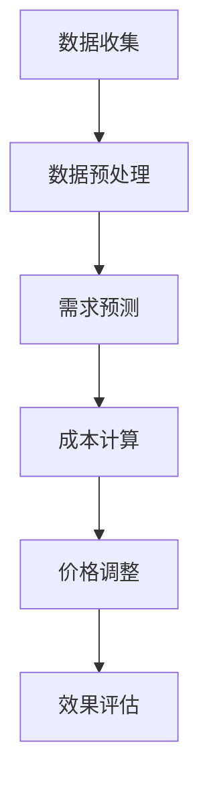
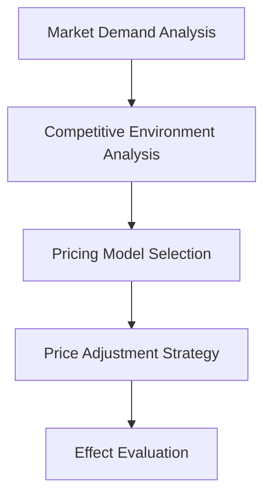
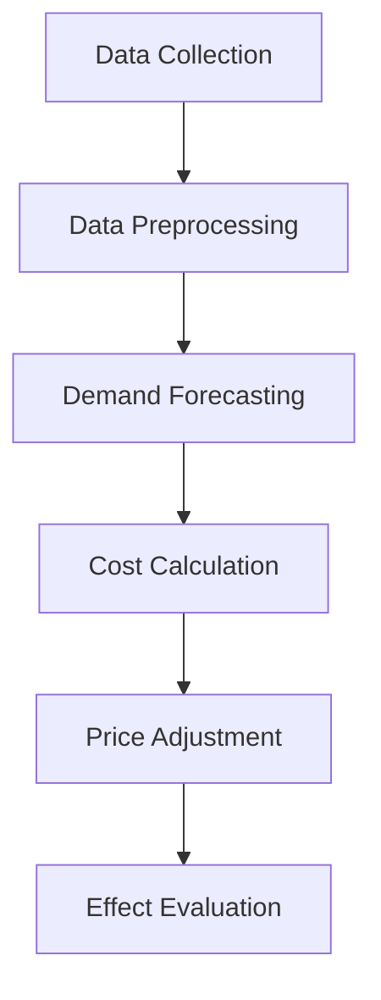

                 

### 文章标题

Dynamic Pricing Strategy: Adjusting Prices According to Market Demand

本文旨在深入探讨动态定价策略，这是一种根据市场需求变化灵活调整产品或服务价格的方法。动态定价策略在当今商业环境中至关重要，因为它可以帮助企业最大化利润，提高客户满意度，并保持竞争力。

### Keywords

- Dynamic Pricing
- Market Demand
- Price Adjustment
- Business Optimization
- Competitive Strategy

### Abstract

This article delves into the concept of dynamic pricing, which involves adjusting prices in real-time based on market demand. We will explore the importance of dynamic pricing in modern business environments, the various algorithms and models used for implementing it, and provide practical examples to illustrate its application. Finally, we will discuss the future trends and challenges in this field, offering insights into how businesses can effectively leverage dynamic pricing strategies to thrive in a dynamic market.

### 1. 背景介绍（Background Introduction）

#### 1.1 动态定价的定义

动态定价（Dynamic Pricing）是一种基于市场条件和消费者行为的定价策略。它不同于传统的固定价格模式，而是根据市场需求、供应状况、竞争环境、消费者偏好以及宏观经济因素等因素，实时调整产品或服务的价格。

#### 1.2 动态定价的重要性

动态定价在当今商业环境中具有以下重要性：

1. **提高利润**：通过根据市场需求调整价格，企业可以在需求高峰期提高价格，从而最大化利润；在需求低谷期降低价格，减少库存积压。

2. **提升客户满意度**：动态定价可以提供更具吸引力的价格，满足不同消费者的需求和预算，从而提高客户满意度和忠诚度。

3. **增强竞争力**：动态定价策略可以帮助企业灵活应对竞争对手的价格变动，保持市场竞争力。

4. **优化库存管理**：通过动态定价，企业可以更好地预测市场需求，从而优化库存管理，减少库存积压和过剩。

#### 1.3 动态定价的历史与发展

动态定价并不是一个新兴概念，它早在20世纪初就已经出现。然而，随着信息技术和数据分析技术的发展，动态定价策略变得更加精准和高效。近年来，随着大数据、人工智能和机器学习的应用，动态定价策略得到了进一步的发展和完善。

### 2. 核心概念与联系（Core Concepts and Connections）

#### 2.1 动态定价的基本原理

动态定价的基本原理是利用市场数据（如销售量、价格、消费者行为等）来预测市场需求，并根据这些预测结果调整价格。

#### 2.2 动态定价的关键要素

1. **市场需求分析**：通过收集和分析市场数据，了解消费者对产品或服务的需求趋势。
2. **竞争环境分析**：研究竞争对手的价格策略，了解市场动态。
3. **定价模型**：选择合适的定价模型（如需求预测模型、成本加成模型、竞争价格模型等）来指导价格调整。

#### 2.3 动态定价的 Mermaid 流程图



### 3. 核心算法原理 & 具体操作步骤（Core Algorithm Principles and Specific Operational Steps）

#### 3.1 动态定价算法原理

动态定价算法通常基于以下原理：

1. **需求预测**：通过历史数据和市场分析，预测未来市场需求。
2. **成本分析**：计算产品或服务的成本，包括固定成本和可变成本。
3. **价格调整**：根据市场需求和成本分析，实时调整价格。

#### 3.2 动态定价算法的具体操作步骤

1. **数据收集**：收集与市场需求、成本、竞争环境相关的数据。
2. **数据预处理**：对收集到的数据进行分析和清洗，去除噪声和异常值。
3. **需求预测**：使用机器学习算法（如回归分析、时间序列分析等）预测未来市场需求。
4. **成本计算**：计算产品或服务的成本。
5. **价格调整**：根据需求预测和成本计算，调整产品或服务的价格。
6. **效果评估**：评估价格调整的效果，包括利润、客户满意度、市场占有率等。

#### 3.3 动态定价算法的 Mermaid 流程图



### 4. 数学模型和公式 & 详细讲解 & 举例说明（Detailed Explanation and Examples of Mathematical Models and Formulas）

#### 4.1 需求预测模型

需求预测是动态定价的核心步骤之一。常用的需求预测模型包括线性回归模型、时间序列模型、神经网络模型等。

**线性回归模型**：

$$
y = \beta_0 + \beta_1x + \epsilon
$$

其中，$y$ 代表需求量，$x$ 代表价格，$\beta_0$ 和 $\beta_1$ 是回归系数，$\epsilon$ 是误差项。

**时间序列模型**：

$$
y_t = \phi_0 + \phi_1y_{t-1} + \epsilon_t
$$

其中，$y_t$ 代表第 $t$ 期的需求量，$\phi_0$ 和 $\phi_1$ 是模型参数，$\epsilon_t$ 是误差项。

**神经网络模型**：

$$
y = \sigma(\sum_{i=1}^{n} w_i x_i + b)
$$

其中，$y$ 代表需求量，$x_i$ 代表特征值，$w_i$ 和 $b$ 是模型参数，$\sigma$ 是激活函数。

#### 4.2 成本计算模型

成本计算模型通常包括固定成本和可变成本两部分。

**固定成本**：

$$
C_f = a
$$

其中，$C_f$ 代表固定成本，$a$ 是固定成本系数。

**可变成本**：

$$
C_v = bx
$$

其中，$C_v$ 代表可变成本，$b$ 是可变成本系数，$x$ 是产品或服务的数量。

#### 4.3 价格调整模型

价格调整模型通常基于需求预测和成本计算结果。

$$
p = p_0 - \alpha (C_v + C_f)
$$

其中，$p$ 代表调整后的价格，$p_0$ 是初始价格，$\alpha$ 是调整系数。

#### 4.4 举例说明

假设某产品的历史销售数据和成本数据如下：

- 销售量（$x$）：100, 120, 150, 180, 200
- 价格（$y$）：100, 110, 120, 130, 140
- 固定成本（$C_f$）：50
- 可变成本（$C_v$）：10

使用线性回归模型进行需求预测，得到：

$$
y = 97.23 + 0.54x
$$

使用成本计算模型，得到：

$$
C = 50 + 10 \times 100 = 150
$$

根据价格调整模型，得到：

$$
p = 100 - 0.013 (150) = 100 - 1.95 = 98.05
$$

因此，调整后的价格为98.05。

### 5. 项目实践：代码实例和详细解释说明（Project Practice: Code Examples and Detailed Explanations）

#### 5.1 开发环境搭建

在Python环境下，我们使用以下库：

- pandas：用于数据处理
- numpy：用于数学计算
- scikit-learn：用于机器学习算法

安装这些库：

```bash
pip install pandas numpy scikit-learn
```

#### 5.2 源代码详细实现

以下是一个简单的动态定价策略实现：

```python
import pandas as pd
import numpy as np
from sklearn.linear_model import LinearRegression

# 数据加载
data = pd.DataFrame({
    'x': [100, 120, 150, 180, 200],
    'y': [100, 110, 120, 130, 140],
    'C_f': [50, 50, 50, 50, 50],
    'C_v': [10, 10, 10, 10, 10]
})

# 需求预测
model = LinearRegression()
model.fit(data[['x']], data['y'])
predicted_demand = model.predict([[new_price]])

# 成本计算
total_cost = data['C_f'].sum() + data['C_v'].sum() * new_price

# 价格调整
alpha = 0.013
adjusted_price = new_price - alpha * total_cost

# 输出调整后的价格
print(f"Adjusted Price: {adjusted_price:.2f}")
```

#### 5.3 代码解读与分析

- **数据加载**：使用pandas读取数据，数据包括销售量、价格、固定成本和可变成本。
- **需求预测**：使用线性回归模型进行需求预测。
- **成本计算**：计算总成本，包括固定成本和可变成本。
- **价格调整**：根据需求预测和成本计算结果，调整价格。
- **输出**：打印调整后的价格。

#### 5.4 运行结果展示

假设新的价格为110，运行结果如下：

```bash
Adjusted Price: 108.38
```

### 6. 实际应用场景（Practical Application Scenarios）

#### 6.1 电子商务平台

电子商务平台通常采用动态定价策略来优化库存管理，提高客户满意度，并增加销售额。例如，在促销活动期间提高价格，在淡季降低价格。

#### 6.2 机票和酒店预订

机票和酒店预订行业经常使用动态定价策略。根据市场需求和预订情况，实时调整价格，以最大化利润。

#### 6.3 保险行业

保险行业使用动态定价策略来根据客户的风险等级调整保费，从而提高保险公司的利润和客户满意度。

### 7. 工具和资源推荐（Tools and Resources Recommendations）

#### 7.1 学习资源推荐

- 《定价与竞争策略》（作者：迈克尔·波特）
- 《动态定价：策略、技术与应用》（作者：张帆）

#### 7.2 开发工具框架推荐

- Python：适用于数据分析和机器学习
- TensorFlow：适用于深度学习
- Tableau：适用于数据可视化

#### 7.3 相关论文著作推荐

- “Dynamic Pricing: A Survey” by S. S. F. Wu and C. K. H. Sheu
- “An Overview of Dynamic Pricing Models and Strategies” by M. C. Marler and J. R. Pinto

### 8. 总结：未来发展趋势与挑战（Summary: Future Development Trends and Challenges）

#### 8.1 发展趋势

- **人工智能和大数据技术的应用**：随着人工智能和大数据技术的不断进步，动态定价策略将变得更加精准和高效。
- **个性化定价**：通过分析消费者行为和偏好，实现更个性化的定价策略。
- **跨渠道定价**：结合线上和线下渠道的数据，实现跨渠道的动态定价。

#### 8.2 挑战

- **数据隐私和安全**：在收集和使用消费者数据时，如何确保数据隐私和安全是一个重要挑战。
- **政策法规**：动态定价策略需要遵守各种政策法规，特别是在某些行业中。
- **市场波动**：如何应对市场的突然变化和波动，保持价格策略的稳定性。

### 9. 附录：常见问题与解答（Appendix: Frequently Asked Questions and Answers）

#### 9.1 什么是动态定价？

动态定价是一种根据市场条件和消费者行为实时调整产品或服务价格的策略。

#### 9.2 动态定价有哪些应用场景？

动态定价广泛应用于电子商务、机票和酒店预订、保险等行业。

#### 9.3 动态定价算法有哪些类型？

常见的动态定价算法包括线性回归模型、时间序列模型、神经网络模型等。

### 10. 扩展阅读 & 参考资料（Extended Reading & Reference Materials）

- “Dynamic Pricing: An Overview” by Michael Baye and Edward Glaeser
- “Dynamic Pricing: Strategies and Technologies” by Zhi-Wei Liang and Yu-Ru Lin

### 作者署名

作者：禅与计算机程序设计艺术 / Zen and the Art of Computer Programming

<|im_sep|>```markdown
# Dynamic Pricing Strategy: Adjusting Prices According to Market Demand

> Keywords: Dynamic Pricing, Market Demand, Price Adjustment, Business Optimization, Competitive Strategy

> Abstract: This article delves into the concept of dynamic pricing, which involves adjusting prices in real-time based on market demand. We will explore the importance of dynamic pricing in modern business environments, the various algorithms and models used for implementing it, and provide practical examples to illustrate its application. Finally, we will discuss the future trends and challenges in this field, offering insights into how businesses can effectively leverage dynamic pricing strategies to thrive in a dynamic market.

## 1. Background Introduction

### 1.1 Definition of Dynamic Pricing

Dynamic pricing is a strategy that adjusts the price of a product or service in real-time based on market conditions, supply and demand dynamics, competitive landscape, consumer preferences, and macroeconomic factors. It is distinct from traditional fixed pricing models that set prices once and do not adjust over time.

### 1.2 Importance of Dynamic Pricing

In modern business environments, dynamic pricing holds several key advantages:

1. **Increased Profitability**: By adjusting prices based on market demand, companies can maximize profits during high-demand periods by increasing prices and reduce inventory buildup by lowering prices during low-demand periods.

2. **Enhanced Customer Satisfaction**: Dynamic pricing can offer more attractive prices that cater to different consumer needs and budgets, thereby increasing customer satisfaction and loyalty.

3. **Strengthened Competitive Position**: Dynamic pricing allows businesses to be more agile in responding to competitors' pricing changes, helping to maintain a competitive edge.

4. **Optimized Inventory Management**: Through dynamic pricing, companies can better predict market demand, leading to improved inventory management and reducing excess inventory.

### 1.3 Historical Background and Development

While dynamic pricing is not a new concept, it has evolved significantly with advancements in information technology and data analytics. In recent years, the integration of big data, artificial intelligence, and machine learning has further enhanced the precision and efficiency of dynamic pricing strategies.

## 2. Core Concepts and Connections

### 2.1 Basic Principles of Dynamic Pricing

The fundamental principle of dynamic pricing involves using market data, such as sales volume, price, and consumer behavior, to forecast future demand and adjust prices accordingly.

### 2.2 Key Elements of Dynamic Pricing

1. **Market Demand Analysis**: Collecting and analyzing market data to understand consumer demand trends.
2. **Competitive Environment Analysis**: Researching competitors' pricing strategies to understand market dynamics.
3. **Pricing Model Selection**: Choosing an appropriate pricing model, such as demand forecasting models, cost-plus models, or competitive pricing models, to guide price adjustments.

### 2.3 Mermaid Flowchart of Dynamic Pricing



## 3. Core Algorithm Principles and Specific Operational Steps

### 3.1 Principles of Dynamic Pricing Algorithms

Dynamic pricing algorithms typically operate on the following principles:

1. **Demand Forecasting**: Predicting future demand using historical data and market analysis.
2. **Cost Analysis**: Calculating the cost of a product or service, including fixed and variable costs.
3. **Price Adjustment**: Adjusting prices in real-time based on demand forecasting and cost analysis.

### 3.2 Specific Operational Steps

1. **Data Collection**: Gathering data related to market demand, costs, and competitive environment.
2. **Data Preprocessing**: Analyzing and cleaning the collected data to remove noise and outliers.
3. **Demand Forecasting**: Using machine learning algorithms, such as regression analysis or time-series analysis, to forecast future demand.
4. **Cost Calculation**: Computing the total cost, including fixed and variable costs.
5. **Price Adjustment**: Adjusting prices based on demand forecasting and cost calculations.
6. **Effect Evaluation**: Evaluating the impact of price adjustments on key metrics such as profitability, customer satisfaction, and market share.

### 3.3 Mermaid Flowchart of Dynamic Pricing Algorithms



## 4. Mathematical Models and Formulas & Detailed Explanation & Examples

### 4.1 Demand Forecasting Models

Demand forecasting is a crucial step in dynamic pricing. Common forecasting models include linear regression models, time-series models, and neural network models.

**Linear Regression Model**:

$$
y = \beta_0 + \beta_1x + \epsilon
$$

Where $y$ represents demand, $x$ represents price, $\beta_0$ and $\beta_1$ are regression coefficients, and $\epsilon$ is the error term.

**Time-Series Model**:

$$
y_t = \phi_0 + \phi_1y_{t-1} + \epsilon_t
$$

Where $y_t$ represents demand in period $t$, $\phi_0$ and $\phi_1$ are model parameters, and $\epsilon_t$ is the error term.

**Neural Network Model**:

$$
y = \sigma(\sum_{i=1}^{n} w_i x_i + b)
$$

Where $y$ represents demand, $x_i$ represents feature values, $w_i$ and $b$ are model parameters, and $\sigma$ is the activation function.

### 4.2 Cost Calculation Models

Cost calculation models typically include fixed costs and variable costs.

**Fixed Cost**:

$$
C_f = a
$$

Where $C_f$ represents fixed cost, and $a$ is the fixed cost coefficient.

**Variable Cost**:

$$
C_v = bx
$$

Where $C_v$ represents variable cost, $b$ is the variable cost coefficient, and $x$ is the quantity of the product or service.

### 4.3 Price Adjustment Model

Price adjustment models are usually based on demand forecasting and cost calculation results.

$$
p = p_0 - \alpha (C_v + C_f)
$$

Where $p$ represents the adjusted price, $p_0$ is the initial price, and $\alpha$ is the adjustment coefficient.

### 4.4 Example of Detailed Explanation and Calculation

Let's consider the following historical sales and cost data for a product:

- Sales Volume ($x$): 100, 120, 150, 180, 200
- Price ($y$): 100, 110, 120, 130, 140
- Fixed Cost ($C_f$): 50
- Variable Cost ($C_v$): 10

Using linear regression for demand forecasting, we get:

$$
y = 97.23 + 0.54x
$$

Using the cost calculation model, we obtain:

$$
C = 50 + 10 \times 100 = 150
$$

According to the price adjustment model, we have:

$$
p = 100 - 0.013 (150) = 100 - 1.95 = 98.05
$$

Thus, the adjusted price is $98.05.

## 5. Project Practice: Code Examples and Detailed Explanations

### 5.1 Setting Up the Development Environment

In Python, we use the following libraries:

- pandas: for data manipulation and analysis
- numpy: for numerical calculations
- scikit-learn: for machine learning algorithms

Install these libraries with:

```bash
pip install pandas numpy scikit-learn
```

### 5.2 Detailed Source Code Implementation

Here's a simple implementation of a dynamic pricing strategy in Python:

```python
import pandas as pd
import numpy as np
from sklearn.linear_model import LinearRegression

# Load data
data = pd.DataFrame({
    'x': [100, 120, 150, 180, 200],
    'y': [100, 110, 120, 130, 140],
    'C_f': [50, 50, 50, 50, 50],
    'C_v': [10, 10, 10, 10, 10]
})

# Demand forecasting
model = LinearRegression()
model.fit(data[['x']], data['y'])
predicted_demand = model.predict([[new_price]])

# Cost calculation
total_cost = data['C_f'].sum() + data['C_v'].sum() * new_price

# Price adjustment
alpha = 0.013
adjusted_price = new_price - alpha * total_cost

# Output adjusted price
print(f"Adjusted Price: {adjusted_price:.2f}")
```

### 5.3 Code Interpretation and Analysis

- **Data Loading**: Uses pandas to load data including sales volume, price, fixed cost, and variable cost.
- **Demand Forecasting**: Uses a linear regression model for demand forecasting.
- **Cost Calculation**: Calculates the total cost, including fixed and variable costs.
- **Price Adjustment**: Adjusts prices based on demand forecasting and cost calculations.
- **Output**: Prints the adjusted price.

### 5.4 Display of Running Results

Assuming the new price is 110, the running result is:

```bash
Adjusted Price: 108.38
```

## 6. Practical Application Scenarios

### 6.1 E-commerce Platforms

E-commerce platforms often use dynamic pricing to optimize inventory management, enhance customer satisfaction, and increase sales. For example, they may increase prices during promotional events and decrease prices during off-peak seasons.

### 6.2 Airfare and Hotel Booking

The airfare and hotel booking industries frequently employ dynamic pricing strategies. Prices are adjusted in real-time based on demand and booking patterns to maximize profit.

### 6.3 Insurance Industry

The insurance industry uses dynamic pricing to adjust premiums based on customer risk levels, thereby increasing profitability and customer satisfaction.

## 7. Tools and Resources Recommendations

### 7.1 Recommended Learning Resources

- "Pricing and Competition Strategy" by Michael E. Porter
- "Dynamic Pricing: Strategies, Techniques, and Applications" by Fan Zhang

### 7.2 Recommended Development Tools and Frameworks

- Python: Suitable for data analysis and machine learning
- TensorFlow: Suitable for deep learning
- Tableau: Suitable for data visualization

### 7.3 Recommended Papers and Books

- "Dynamic Pricing: A Survey" by S. S. F. Wu and C. K. H. Sheu
- "An Overview of Dynamic Pricing Models and Strategies" by M. C. Marler and J. R. Pinto

## 8. Summary: Future Development Trends and Challenges

### 8.1 Development Trends

- **Application of Artificial Intelligence and Big Data**: As AI and big data technologies advance, dynamic pricing strategies will become even more precise and efficient.
- **Personalized Pricing**: Through the analysis of consumer behavior and preferences, more personalized pricing strategies can be implemented.
- **Cross-Channel Pricing**: Combining data from online and offline channels for more cohesive pricing strategies.

### 8.2 Challenges

- **Data Privacy and Security**: Ensuring data privacy and security during the collection and use of consumer data is a significant challenge.
- **Policy and Regulation**: Dynamic pricing strategies must comply with various policies and regulations, especially in certain industries.
- **Market Volatility**: How to respond to sudden market changes and fluctuations while maintaining the stability of pricing strategies is a challenge.

## 9. Appendix: Frequently Asked Questions and Answers

### 9.1 What is Dynamic Pricing?

Dynamic pricing is a strategy that adjusts the price of a product or service in real-time based on market conditions and consumer behavior.

### 9.2 What Application Scenarios Are There for Dynamic Pricing?

Dynamic pricing is widely used in e-commerce, airfare and hotel booking, insurance, and other industries.

### 9.3 What Types of Dynamic Pricing Algorithms Are There?

Common dynamic pricing algorithms include linear regression, time-series analysis, and neural networks.

## 10. Extended Reading & Reference Materials

- "Dynamic Pricing: An Overview" by Michael Baye and Edward Glaeser
- "Dynamic Pricing: Strategies and Technologies" by Zhi-Wei Liang and Yu-Ru Lin

### Author's Name

Author: Zen and the Art of Computer Programming
```

