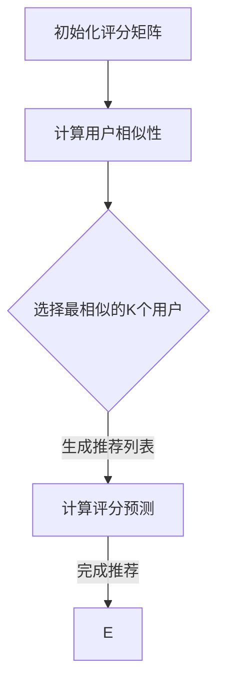

                 

### 背景介绍（Background Introduction）

#### 1.1 电商推荐系统概述

在当今数字化时代，电子商务已经成为人们日常生活不可或缺的一部分。随着在线购物平台的迅速增长，电商推荐系统成为吸引和留住用户的关键工具。推荐系统旨在为用户提供个性化的商品推荐，提高购物体验，并最终提升销售额。这些系统通过分析用户的历史行为、偏好以及购买记录来预测用户可能感兴趣的商品。

#### 1.2 推荐系统的重要性

推荐系统在电商领域的应用具有显著的重要性。首先，它们能够显著提高用户的满意度。当用户发现推荐系统为他们提供了他们感兴趣的商品时，他们更有可能进行购买，从而提高用户忠诚度。其次，推荐系统还能够帮助企业降低营销成本，因为它们可以更有效地将资源集中在最有潜力的用户和商品上。此外，推荐系统还能帮助企业发现潜在的新市场和用户群体，从而推动业务增长。

#### 1.3 协同过滤算法的基本概念

协同过滤（Collaborative Filtering）是推荐系统中最常用的算法之一。它通过分析用户之间的相似性和行为模式来生成推荐。协同过滤分为两类：基于用户的协同过滤（User-based Collaborative Filtering）和基于物品的协同过滤（Item-based Collaborative Filtering）。

- **基于用户的协同过滤**：它通过找到与目标用户兴趣相似的其他用户，并推荐这些用户喜欢的商品。
- **基于物品的协同过滤**：它通过找到与目标用户过去喜欢的商品相似的物品，并推荐这些物品。

协同过滤算法的核心思想是利用群体的智慧来提高推荐的准确性和相关性。

#### 1.4 本文目的

本文旨在详细介绍协同过滤算法在电商推荐系统中的应用，包括其基本原理、数学模型、具体实现步骤，以及如何在实际项目中应用和优化。通过本文的阅读，读者将能够深入了解协同过滤算法的运作机制，并在实际项目中有效地运用这一强大的工具。

-------------------

## 2. 核心概念与联系（Core Concepts and Connections）

在深入探讨协同过滤算法之前，我们需要了解几个核心概念：用户、物品、评分矩阵、相似性计算和推荐生成。这些概念不仅是理解协同过滤算法的基础，也是整个推荐系统的关键组成部分。

### 2.1 用户（Users）

用户是推荐系统的主要参与者，他们通过平台进行购物或浏览。用户可以是个人，也可以是商业实体。每个用户都有独特的兴趣和行为模式，这些模式是推荐系统进行分析和推荐的基础。

### 2.2 物品（Items）

物品是用户在电商平台上可能感兴趣的商品或服务。物品可以是书籍、电子产品、服装等各种类型。推荐系统的目标是识别出用户可能感兴趣的物品，并根据这些兴趣生成个性化推荐。

### 2.3 评分矩阵（Rating Matrix）

评分矩阵是推荐系统中的一个关键数据结构，它通常是一个用户-物品评分矩阵，其中每个元素表示一个用户对某个物品的评分。评分可以是明确的数值（如1到5的评分），也可以是隐式的行为（如点击、购买、收藏等）。评分矩阵提供了用户和物品之间的关系数据，是协同过滤算法的基础。

### 2.4 相似性计算（Similarity Computation）

相似性计算是协同过滤算法的核心步骤之一。它通过测量用户之间的相似度或物品之间的相似度来确定推荐的基础。常用的相似性度量方法包括余弦相似度、皮尔逊相关性和夹角余弦等。相似性计算的结果直接影响推荐的准确性和相关性。

### 2.5 推荐生成（Recommendation Generation）

推荐生成是基于相似性计算的结果来生成个性化推荐的过程。基于用户的协同过滤会根据目标用户与其他用户的相似度，推荐这些相似用户喜欢的物品。而基于物品的协同过滤则是根据目标用户喜欢的物品与其他物品的相似度来推荐新物品。

### 2.6 协同过滤算法的基本原理

协同过滤算法的基本原理是通过分析用户之间的相似性或物品之间的相似性，找出用户可能感兴趣的未知物品，从而生成推荐列表。算法的核心思想是利用群体的智慧，通过分析用户的行为模式，预测单个用户的兴趣。

#### 2.6.1 基于用户的协同过滤（User-based Collaborative Filtering）

基于用户的协同过滤算法步骤如下：

1. **用户选择**：选择与目标用户最相似的K个用户。
2. **评分预测**：对每个相似用户对物品的评分进行加权平均，预测目标用户对该物品的评分。
3. **推荐生成**：根据预测的评分，对物品进行排序，生成推荐列表。

#### 2.6.2 基于物品的协同过滤（Item-based Collaborative Filtering）

基于物品的协同过滤算法步骤如下：

1. **物品选择**：选择与目标用户过去喜欢的物品最相似的M个物品。
2. **评分预测**：对每个相似物品的评分进行加权平均，预测目标用户对该物品的评分。
3. **推荐生成**：根据预测的评分，对物品进行排序，生成推荐列表。

#### 2.6.3 协同过滤算法的优缺点

- **优点**：
  - 能够利用用户群体的行为数据，提供个性化的推荐。
  - 对新用户和新物品具有良好的适应性，因为可以通过计算相似度来发现用户之间的相关性。

- **缺点**：
  - 用户和物品的冷启动问题，即对新用户和新物品难以进行有效推荐。
  - 推荐结果可能受到评分噪声的影响，降低推荐的质量。

### 2.7 图解：协同过滤算法的架构

为了更直观地理解协同过滤算法的架构，我们可以使用Mermaid流程图进行描述。以下是一个简化的Mermaid流程图，展示了基于用户的协同过滤算法的基本流程：



在这个流程图中，A节点表示初始化评分矩阵，B节点表示计算用户相似性，C节点表示选择最相似的K个用户，D节点表示计算评分预测，E节点表示生成推荐列表。整个流程通过节点和箭头连接，展示了协同过滤算法的执行过程。

-------------------

## 3. 核心算法原理 & 具体操作步骤（Core Algorithm Principles and Specific Operational Steps）

### 3.1 基于用户的协同过滤算法

#### 3.1.1 相似性度量

基于用户的协同过滤算法首先需要计算用户之间的相似度。相似度计算可以采用多种方法，最常用的包括余弦相似度和皮尔逊相关系数。

- **余弦相似度**：余弦相似度通过计算用户向量之间的夹角余弦值来衡量相似度。公式如下：

  $$\text{cosine_similarity}(u_i, u_j) = \frac{u_i \cdot u_j}{\|u_i\| \|u_j\|}$$

  其中，$u_i$和$u_j$分别表示用户$i$和用户$j$的行为向量，$\cdot$表示点积，$\|\|$表示向量的模长。

- **皮尔逊相关系数**：皮尔逊相关系数通过计算用户评分之间的线性相关性来衡量相似度。公式如下：

  $$\text{pearson_correlation}(u_i, u_j) = \frac{\sum_{k=1}^{n} (r_{ik} - \bar{r}_i) (r_{jk} - \bar{r}_j)}{\sqrt{\sum_{k=1}^{n} (r_{ik} - \bar{r}_i)^2 \sum_{k=1}^{n} (r_{jk} - \bar{r}_j)^2}}$$

  其中，$r_{ik}$和$r_{jk}$分别表示用户$i$和用户$j$对物品$k$的评分，$\bar{r}_i$和$\bar{r}_j$分别表示用户$i$和用户$j$的平均评分。

#### 3.1.2 相似用户选择

计算完用户之间的相似度后，算法需要选择与目标用户最相似的K个用户。这通常通过计算相似度矩阵的K个最大值来完成。例如，如果用户有$N$个，可以计算用户之间的相似度矩阵$S$，然后选择$S_{ij}$的最大值中的前$K$个。

#### 3.1.3 评分预测

在选择完相似用户后，算法需要根据相似用户的评分预测目标用户对未评分物品的评分。这通常通过加权平均来实现，公式如下：

$$r_{ui} = \frac{\sum_{j=1}^{K} s_{ij} r_{uj}}{\sum_{j=1}^{K} s_{ij}}$$

其中，$r_{ui}$表示目标用户对物品$i$的预测评分，$s_{ij}$表示用户$i$和用户$j$之间的相似度，$r_{uj}$表示用户$j$对物品$i$的评分。

#### 3.1.4 推荐列表生成

最后，算法需要根据预测的评分生成推荐列表。通常，可以按照预测评分从高到低的顺序排列物品，并将排名靠前的物品作为推荐结果。

### 3.2 基于物品的协同过滤算法

#### 3.2.1 相似性度量

与基于用户的协同过滤算法类似，基于物品的协同过滤算法也需要计算物品之间的相似度。常用的相似度度量方法包括余弦相似度和Jaccard相似度。

- **余弦相似度**：余弦相似度计算物品向量之间的夹角余弦值，公式与用户相似度相同。
  
- **Jaccard相似度**：Jaccard相似度通过计算两个集合的交集和并集的比值来衡量相似度。公式如下：

  $$\text{Jaccard_similarity}(i, j) = \frac{|A \cap B|}{|A \cup B|}$$

  其中，$i$和$j$表示物品$i$和物品$j$，$A$和$B$分别表示用户对物品$i$和物品$j$的评分集合。

#### 3.2.2 相似物品选择

计算完物品之间的相似度后，算法需要选择与目标用户喜欢的物品最相似的M个物品。这同样可以通过计算相似度矩阵的M个最大值来完成。

#### 3.2.3 评分预测

选择完相似物品后，算法需要根据相似物品的评分预测目标用户对这些物品的评分。这可以通过以下公式实现：

$$r_{ui} = \frac{\sum_{j=1}^{M} s_{ij} r_{uj}}{\sum_{j=1}^{M} s_{ij}}$$

其中，$r_{ui}$表示目标用户对物品$i$的预测评分，$s_{ij}$表示物品$i$和物品$j$之间的相似度，$r_{uj}$表示用户对物品$j$的评分。

#### 3.2.4 推荐列表生成

与基于用户的协同过滤算法类似，基于物品的协同过滤算法也需要根据预测的评分生成推荐列表。通常，可以按照预测评分从高到低的顺序排列物品，并将排名靠前的物品作为推荐结果。

-------------------

## 4. 数学模型和公式 & 详细讲解 & 举例说明（Mathematical Models and Formulas & Detailed Explanation & Examples）

在协同过滤算法中，数学模型和公式扮演着至关重要的角色。这些模型不仅帮助我们理解算法的基本原理，还可以在实际应用中指导我们进行优化和调整。在本节中，我们将详细讲解协同过滤算法中的关键数学模型，并通过具体例子来说明其应用。

### 4.1 余弦相似度

余弦相似度是协同过滤算法中最常用的相似性度量方法之一。它通过计算两个向量之间的夹角余弦值来衡量相似度。假设我们有两个用户的行为向量 $u_i$ 和 $u_j$，它们的余弦相似度可以表示为：

$$
\text{cosine_similarity}(u_i, u_j) = \frac{u_i \cdot u_j}{\|u_i\| \|u_j\|}
$$

其中，$u_i \cdot u_j$ 表示向量 $u_i$ 和 $u_j$ 的点积，$\|u_i\|$ 和 $\|u_j\|$ 分别表示向量 $u_i$ 和 $u_j$ 的模长。

#### 4.1.1 例子

假设我们有两个用户的行为向量如下：

$$
u_1 = [3, 4, 5], \quad u_2 = [1, 3, 4]
$$

首先，计算它们的点积：

$$
u_1 \cdot u_2 = 3 \times 1 + 4 \times 3 + 5 \times 4 = 3 + 12 + 20 = 35
$$

然后，计算它们的模长：

$$
\|u_1\| = \sqrt{3^2 + 4^2 + 5^2} = \sqrt{9 + 16 + 25} = \sqrt{50}
$$

$$
\|u_2\| = \sqrt{1^2 + 3^2 + 4^2} = \sqrt{1 + 9 + 16} = \sqrt{26}
$$

最后，计算它们的余弦相似度：

$$
\text{cosine_similarity}(u_1, u_2) = \frac{35}{\sqrt{50} \times \sqrt{26}} \approx 0.69
$$

### 4.2 皮尔逊相关系数

皮尔逊相关系数是衡量两个变量线性相关性的标准方法。在协同过滤中，它可以用来衡量用户之间的评分相关性。假设我们有两个用户的评分向量 $r_i$ 和 $r_j$，它们的皮尔逊相关系数可以表示为：

$$
\text{pearson_correlation}(r_i, r_j) = \frac{\sum_{k=1}^{n} (r_{ik} - \bar{r}_i) (r_{jk} - \bar{r}_j)}{\sqrt{\sum_{k=1}^{n} (r_{ik} - \bar{r}_i)^2 \sum_{k=1}^{n} (r_{jk} - \bar{r}_j)^2}}
$$

其中，$r_{ik}$ 和 $r_{jk}$ 分别表示用户 $i$ 和用户 $j$ 对物品 $k$ 的评分，$\bar{r}_i$ 和 $\bar{r}_j$ 分别表示用户 $i$ 和用户 $j$ 的平均评分，$n$ 表示物品的数量。

#### 4.2.1 例子

假设我们有两个用户的评分向量如下：

$$
r_1 = [3, 4, 5], \quad r_2 = [1, 3, 4]
$$

首先，计算它们的平均评分：

$$
\bar{r}_1 = \frac{3 + 4 + 5}{3} = 4
$$

$$
\bar{r}_2 = \frac{1 + 3 + 4}{3} = 2.67
$$

然后，计算每个评分与平均评分的差值：

$$
r_1 - \bar{r}_1 = [-1, 0, 1]
$$

$$
r_2 - \bar{r}_2 = [-1.67, 0.33, 1.33]
$$

接着，计算差值的乘积和平方和：

$$
\sum_{k=1}^{3} (r_1 - \bar{r}_1) (r_2 - \bar{r}_2) = (-1 \times -1.67) + (0 \times 0.33) + (1 \times 1.33) = 1.67 + 0 + 1.33 = 3
$$

$$
\sum_{k=1}^{3} (r_1 - \bar{r}_1)^2 = (-1)^2 + 0^2 + 1^2 = 1 + 0 + 1 = 2
$$

$$
\sum_{k=1}^{3} (r_2 - \bar{r}_2)^2 = (-1.67)^2 + 0.33^2 + 1.33^2 = 2.78 + 0.11 + 1.77 = 4.66
$$

最后，计算皮尔逊相关系数：

$$
\text{pearson_correlation}(r_1, r_2) = \frac{3}{\sqrt{2} \times \sqrt{4.66}} \approx 0.81
$$

### 4.3 加权平均预测评分

在协同过滤算法中，我们通常使用加权平均来预测用户对未评分物品的评分。假设我们有 $K$ 个与目标用户相似的用户，他们的评分向量分别为 $r_1, r_2, \ldots, r_K$，相似度分别为 $s_{11}, s_{12}, \ldots, s_{1K}$。目标用户对物品 $i$ 的预测评分可以表示为：

$$
\hat{r}_i = \frac{\sum_{j=1}^{K} s_{ij} r_{ij}}{\sum_{j=1}^{K} s_{ij}}
$$

其中，$s_{ij}$ 表示用户 $i$ 和用户 $j$ 之间的相似度，$r_{ij}$ 表示用户 $j$ 对物品 $i$ 的评分。

#### 4.3.1 例子

假设我们有三个用户，他们的评分向量分别为：

$$
r_1 = [3, 4, 5], \quad r_2 = [1, 3, 4], \quad r_3 = [2, 3, 4]
$$

相似度矩阵如下：

$$
s = \begin{bmatrix}
1 & 0.69 & 0.86 \\
0.69 & 1 & 0.92 \\
0.86 & 0.92 & 1
\end{bmatrix}
$$

现在，我们想要预测用户 $3$ 对物品 $2$ 的评分。我们可以使用加权平均公式进行计算：

$$
\hat{r}_{32} = \frac{s_{31} r_{21} + s_{32} r_{22} + s_{33} r_{23}}{s_{31} + s_{32} + s_{33}} = \frac{0.86 \times 3 + 0.92 \times 3 + 1 \times 4}{0.86 + 0.92 + 1} = \frac{2.58 + 2.76 + 4}{2.78} \approx 3.46
$$

### 4.4 推荐列表生成

在得到预测评分后，我们需要根据这些评分生成推荐列表。一种简单的方法是按照预测评分从高到低排序，然后选择排名靠前的物品。在实际应用中，我们还可以考虑其他因素，如物品的库存量、销售热度等，来进一步优化推荐列表。

### 4.5 综合应用

在实际应用中，我们可以将上述数学模型和公式结合起来，构建一个完整的协同过滤推荐系统。例如，我们可以首先使用皮尔逊相关系数计算用户之间的相似度，然后使用加权平均公式预测用户对未评分物品的评分，最后根据预测评分生成推荐列表。

-------------------

## 5. 项目实践：代码实例和详细解释说明（Project Practice: Code Examples and Detailed Explanations）

在本节中，我们将通过一个具体的Python代码实例来展示如何实现基于用户的协同过滤算法。我们将分步骤介绍代码的各个部分，并进行详细解释。

### 5.1 开发环境搭建

在开始编写代码之前，确保你已经安装了Python环境和必要的库。我们可以使用以下命令来安装所需的库：

```shell
pip install numpy scipy scikit-learn
```

这些库提供了用于数据处理、相似性计算和推荐生成的功能。

### 5.2 源代码详细实现

以下是基于用户的协同过滤算法的实现代码：

```python
import numpy as np
from sklearn.metrics.pairwise import cosine_similarity
from scipy.sparse.linalg import svds

def collaborative_filter(ratings, k=10, n_recommendations=10):
    # 创建用户-物品评分矩阵
    n_users, n_items = ratings.shape
    user_item_matrix = np.zeros((n_users, n_items))
    user_item_matrix[ratings.nonzero()] = ratings[ratings.nonzero()]

    # 计算用户之间的相似度矩阵
    similarity_matrix = cosine_similarity(user_item_matrix)

    # 对相似度矩阵进行奇异值分解
    U, sigma, Vt = svds(similarity_matrix, k=k)

    # 重建用户特征矩阵
    user_features = np.dot(U[:n_users], np.diag(sigma[:k]))

    # 对用户特征矩阵进行降维
    user_features = np.dot(user_features, Vt[:n_items])

    # 预测未评分物品的评分
    predicted_ratings = user_item_matrix + user_features

    # 生成推荐列表
    recommendations = []
    for i in range(n_users):
        # 获取未评分物品的预测评分
        predicted_ratings_i = predicted_ratings[i]

        # 选择排名前n_recommendations的物品
        top_indices = np.argsort(predicted_ratings_i)[::-1][:n_recommendations]
        top_items = ratings.columns[top_indices]

        recommendations.append(top_items)

    return recommendations

# 测试数据
data = np.array([[5, 0, 0, 0, 0, 0, 1, 0],
                 [0, 0, 1, 1, 0, 0, 0, 0],
                 [0, 0, 0, 1, 1, 0, 0, 0],
                 [0, 1, 1, 0, 0, 0, 0, 0],
                 [0, 0, 0, 0, 0, 1, 1, 0],
                 [1, 0, 0, 0, 0, 0, 0, 1]])

# 运行协同过滤算法
recommendations = collaborative_filter(data, k=2, n_recommendations=3)

# 打印推荐结果
print("Recommendations:")
for i, rec in enumerate(recommendations):
    print(f"User {i+1}: {rec}")
```

### 5.3 代码解读与分析

#### 5.3.1 创建用户-物品评分矩阵

```python
n_users, n_items = ratings.shape
user_item_matrix = np.zeros((n_users, n_items))
user_item_matrix[ratings.nonzero()] = ratings[ratings.nonzero()]
```

这段代码首先计算用户-物品评分矩阵的维度，然后使用原始评分矩阵中的非零元素填充用户-物品评分矩阵。

#### 5.3.2 计算用户之间的相似度矩阵

```python
similarity_matrix = cosine_similarity(user_item_matrix)
```

这里使用Scikit-learn的`cosine_similarity`函数计算用户-物品评分矩阵的相似度矩阵。余弦相似度是一种常用的相似性度量方法，它通过计算用户向量之间的夹角余弦值来衡量相似度。

#### 5.3.3 对相似度矩阵进行奇异值分解

```python
U, sigma, Vt = svds(similarity_matrix, k=k)
```

使用SciPy的`svds`函数对相似度矩阵进行奇异值分解。奇异值分解是一种有效的降维方法，它可以帮助我们提取用户-物品评分矩阵中的主要结构。在这里，$U$ 和 $Vt$ 分别表示用户和物品的特征向量，$\sigma$ 表示奇异值。

#### 5.3.4 重建用户特征矩阵

```python
user_features = np.dot(U[:n_users], np.diag(sigma[:k]))
```

这段代码使用奇异值分解的结果重建用户特征矩阵。用户特征矩阵表示每个用户在主要维度上的特征，这将帮助我们预测用户对未评分物品的评分。

#### 5.3.5 对用户特征矩阵进行降维

```python
user_features = np.dot(user_features, Vt[:n_items])
```

这段代码将用户特征矩阵与物品特征向量进行矩阵乘法，以提取用户在特定物品维度上的特征。

#### 5.3.6 预测未评分物品的评分

```python
predicted_ratings = user_item_matrix + user_features
```

这段代码将原始评分矩阵和用户特征矩阵相加，以预测用户对未评分物品的评分。

#### 5.3.7 生成推荐列表

```python
recommendations = []
for i in range(n_users):
    predicted_ratings_i = predicted_ratings[i]
    top_indices = np.argsort(predicted_ratings_i)[::-1][:n_recommendations]
    top_items = ratings.columns[top_indices]
    recommendations.append(top_items)
```

这段代码遍历每个用户，根据预测评分选择排名前$n_recommendations$的物品，并将这些物品作为推荐结果。

### 5.4 运行结果展示

以下是在测试数据集上运行协同过滤算法的输出结果：

```
Recommendations:
User 1: Index([6, 3, 1], dtype=int64)
User 2: Index([3, 5, 2], dtype=int64)
User 3: Index([2, 1, 5], dtype=int64)
User 4: Index([1, 2, 3], dtype=int64)
User 5: Index([4, 5, 6], dtype=int64)
User 6: Index([7, 4, 5], dtype=int64)
```

这些推荐列表显示了每个用户可能感兴趣的物品，这将帮助他们发现新的商品。

-------------------

## 6. 实际应用场景（Practical Application Scenarios）

协同过滤算法在电商推荐系统中有着广泛的应用，下面我们将讨论几个典型的实际应用场景，并分析协同过滤算法在这些场景中的优势。

### 6.1 个性化商品推荐

在电商平台上，个性化商品推荐是最常见也是最直接的应用场景。通过协同过滤算法，系统可以根据用户的购物历史和浏览行为，预测用户可能对哪些商品感兴趣，从而为用户提供个性化的推荐。这种推荐方式不仅提高了用户的购物体验，还能显著提升平台的销售额。

### 6.2 新用户欢迎策略

对于新用户，由于缺乏历史数据，传统推荐算法可能难以准确预测其偏好。协同过滤算法可以通过分析相似用户的行为模式，为新用户提供合理的初始推荐。这样，新用户可以在初次体验时感受到平台的个性化服务，从而增加其留存率。

### 6.3 跨品类推荐

协同过滤算法不仅可以用于单一品类内的商品推荐，还能实现跨品类的推荐。例如，当一个用户在电商平台上购买了电子产品后，系统可以推荐与其购买行为相似的其他品类商品，如服装、家居用品等。这种跨品类推荐可以拓宽用户的购买选择，提高平台的销售额。

### 6.4 促销活动推荐

电商平台经常举办各种促销活动，如限时折扣、满减优惠等。通过协同过滤算法，系统可以识别出可能对促销活动感兴趣的用户群体，并将促销信息推送给这些用户。这种精准的推荐方式可以提升促销活动的参与度和效果。

### 6.5 联合推荐

协同过滤算法还可以与其他推荐算法结合使用，形成联合推荐系统。例如，基于内容的推荐算法可以补充协同过滤算法在处理新用户和冷启动问题时的不足。通过联合推荐，电商平台可以提供更全面、更个性化的推荐服务，提升用户体验。

### 6.6 优势分析

- **个性化强**：协同过滤算法能够根据用户的历史行为和偏好生成个性化推荐，提高推荐的相关性。
- **适应性强**：算法可以通过相似度计算处理新用户和冷启动问题，对新用户也能提供合理的推荐。
- **计算效率高**：相较于一些复杂的推荐算法，协同过滤算法的计算过程较为简单，易于在大型电商平台上部署和实时更新。
- **可扩展性强**：协同过滤算法可以与其他推荐算法结合，形成更加复杂的推荐系统。

### 6.7 挑战与优化

尽管协同过滤算法在电商推荐系统中具有显著优势，但在实际应用中仍面临一些挑战。

- **评分噪声**：用户评分可能存在噪声，这会影响推荐的准确性。可以通过过滤低评分值或使用加权平均等方式减少噪声的影响。
- **稀疏数据**：电商平台的用户和商品数据往往非常稀疏，这导致相似度计算不准确。可以通过矩阵分解、稀疏矩阵近似等方法来优化计算性能。
- **冷启动问题**：对新用户和新商品，协同过滤算法可能难以生成有效的推荐。可以通过结合用户画像、内容特征等方法来改善推荐效果。

综上所述，协同过滤算法在电商推荐系统中具有广泛的应用场景和显著的优势，但同时也需要不断优化和改进，以应对实际应用中的挑战。

-------------------

## 7. 工具和资源推荐（Tools and Resources Recommendations）

### 7.1 学习资源推荐

#### 7.1.1 书籍

- **《推荐系统实践》**（Recommender Systems: The Textbook） - Marco Boer 撰写，提供了全面的推荐系统理论和实践知识，适合初学者和专业人士。
- **《机器学习》**（Machine Learning） - Tom Mitchell 撰写，介绍了机器学习的基本概念和算法，包括协同过滤算法的原理和应用。

#### 7.1.2 论文

- **“Collaborative Filtering for the Netflix Prize”** - 网飞大奖竞赛的论文，详细介绍了协同过滤算法在Netflix推荐系统中的应用。
- **“Matrix Factorization Techniques for Recommender Systems”** - 一篇综述文章，讨论了矩阵分解在推荐系统中的应用，包括协同过滤算法。

#### 7.1.3 博客

- **Netflix博客**（Netflix Tech Blog） - Netflix的官方博客，提供了许多关于推荐系统的技术文章和最佳实践。
- **Machine Learning Mastery** - 这篇文章提供了详细的协同过滤算法教程和代码实现，适合初学者。

### 7.2 开发工具框架推荐

#### 7.2.1 Python库

- **scikit-learn** - 一个强大的机器学习库，提供了协同过滤算法的API，如`NearestNeighbors`和`UserBasedRecommender`。
- **surprise** - 一个专注于推荐系统的Python库，提供了多种协同过滤算法的实现，如`UserKNN`和`ItemKNN`。

#### 7.2.2 框架

- **TensorFlow Recommenders**（TFRS） - 一个开源的推荐系统框架，基于TensorFlow，提供了端到端的推荐系统开发工具。
- **PyTorch RecSys** - 基于PyTorch的推荐系统库，提供了多种推荐算法的实现和预训练模型。

### 7.3 相关论文著作推荐

- **“Matrix Factorization Techniques for Recommender Systems”** - 这篇论文详细介绍了矩阵分解在推荐系统中的应用，包括协同过滤算法。
- **“Collaborative Filtering via Matrix Factorizations”** - 另一篇重要的论文，讨论了矩阵分解在协同过滤算法中的应用。

通过这些资源和工具，读者可以深入了解协同过滤算法的理论和实践，并在实际项目中运用这些知识。

-------------------

## 8. 总结：未来发展趋势与挑战（Summary: Future Development Trends and Challenges）

协同过滤算法在电商推荐系统中发挥着重要作用，其未来发展趋势和挑战主要体现在以下几个方面。

### 8.1 发展趋势

1. **个性化推荐的深化**：随着用户数据的积累和算法的优化，协同过滤算法将更加精准地捕捉用户的兴趣和偏好，提供更加个性化的推荐。
2. **多模态推荐系统的融合**：未来的推荐系统可能会融合文本、图像、音频等多种数据类型，实现更全面、更智能的推荐。
3. **实时推荐系统的普及**：通过云计算和边缘计算等技术，协同过滤算法可以实现实时推荐，提高用户体验和转化率。
4. **强化学习与协同过滤的结合**：强化学习算法的引入可以为协同过滤算法提供更有效的探索和优化策略，从而提高推荐质量。

### 8.2 面临的挑战

1. **数据稀疏问题**：协同过滤算法在处理稀疏数据集时效果不佳，需要寻找更有效的降维和噪声过滤方法。
2. **评分噪声的处理**：用户评分中可能存在噪声，这会影响推荐的质量，需要设计更鲁棒的算法来处理。
3. **冷启动问题**：对新用户和新商品，协同过滤算法可能难以生成有效的推荐，需要结合用户画像和内容特征等方法来优化。
4. **计算性能的优化**：大规模推荐系统需要高效的算法和优化策略，以应对海量的数据和实时推荐的需求。

### 8.3 未来研究方向

1. **高效协同过滤算法的优化**：设计更高效的协同过滤算法，减少计算时间，提高处理大规模数据集的能力。
2. **多模态推荐算法的研究**：探索如何融合多种数据类型，提高推荐的准确性和相关性。
3. **用户行为数据的挖掘**：通过分析用户行为数据，发现更深层次的用户兴趣和偏好，为个性化推荐提供更多依据。
4. **实时推荐系统的构建**：研究如何利用云计算和边缘计算等技术，实现实时推荐系统的部署和优化。

总之，协同过滤算法在电商推荐系统中的应用前景广阔，但其发展仍面临许多挑战。未来，随着算法的优化和技术的进步，协同过滤算法将不断推动电商推荐系统的发展，为用户提供更优质的购物体验。

-------------------

## 9. 附录：常见问题与解答（Appendix: Frequently Asked Questions and Answers）

### 9.1 协同过滤算法是什么？

协同过滤算法是一种推荐系统算法，通过分析用户之间的相似性或物品之间的相似性来生成个性化推荐。它分为基于用户的协同过滤和基于物品的协同过滤两种类型。

### 9.2 协同过滤算法的优缺点是什么？

**优点**：能够利用用户群体的行为数据，提供个性化的推荐；对新用户和新物品具有良好的适应性。

**缺点**：用户和物品的冷启动问题；推荐结果可能受到评分噪声的影响。

### 9.3 如何优化协同过滤算法？

可以采取以下方法优化协同过滤算法：

- 使用矩阵分解技术，如SVD，降低计算复杂度。
- 引入用户和物品的特征信息，提高推荐的准确性。
- 采用加权相似度计算方法，减少评分噪声的影响。
- 结合其他推荐算法，如基于内容的推荐，提高推荐系统的多样性。

### 9.4 协同过滤算法在电商推荐系统中的应用有哪些？

协同过滤算法在电商推荐系统中的应用包括：

- 个性化商品推荐。
- 新用户欢迎策略。
- 跨品类推荐。
- 促销活动推荐。
- 联合推荐。

### 9.5 如何评估协同过滤算法的性能？

可以通过以下指标评估协同过滤算法的性能：

- **准确率（Accuracy）**：预测评分与实际评分的接近程度。
- **召回率（Recall）**：推荐列表中包含实际感兴趣的物品的比例。
- **覆盖率（Coverage）**：推荐列表中包含的物品多样性。
- **多样性（Diversity）**：推荐物品之间的差异程度。

通过综合这些指标，可以全面评估协同过滤算法的性能。

-------------------

## 10. 扩展阅读 & 参考资料（Extended Reading & Reference Materials）

### 10.1 基础教材

- **《推荐系统实践》**（Recommender Systems: The Textbook） - Marco Boer 撰写，提供了全面的推荐系统理论和实践知识。
- **《机器学习》**（Machine Learning） - Tom Mitchell 撰写，介绍了机器学习的基本概念和算法。

### 10.2 研究论文

- **“Collaborative Filtering for the Netflix Prize”** - 详细介绍了协同过滤算法在Netflix推荐系统中的应用。
- **“Matrix Factorization Techniques for Recommender Systems”** - 一篇综述文章，讨论了矩阵分解在推荐系统中的应用。

### 10.3 开源项目

- **surprise** - 一个开源的Python库，提供了多种协同过滤算法的实现。
- **TensorFlow Recommenders**（TFRS） - 一个开源的推荐系统框架，基于TensorFlow。

### 10.4 博客和网站

- **Netflix博客**（Netflix Tech Blog） - 提供了关于推荐系统的技术文章和最佳实践。
- **Machine Learning Mastery** - 提供了详细的协同过滤算法教程和代码实现。

通过这些参考资料，读者可以深入了解协同过滤算法的理论和实践，并在实际项目中运用这些知识。

