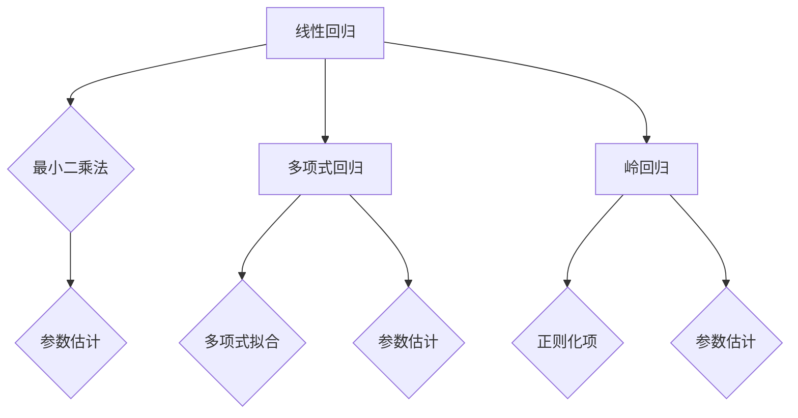

                 

# 回归(Regression) - 原理与代码实例讲解

## 摘要

本文将深入探讨回归分析（Regression Analysis）这一重要的统计方法。回归分析用于预测和描述一个或多个自变量（输入）与一个因变量（输出）之间的关系。我们将详细讲解线性回归、多项式回归和岭回归等不同类型的回归模型，并给出具体的代码实例。此外，本文还将探讨回归分析在实际应用中的场景，以及如何使用各种工具和资源来进一步学习和实践这一方法。

### 关键词

* 回归分析
* 线性回归
* 多项式回归
* 岭回归
* 实际应用
* 代码实例

## 1. 背景介绍

回归分析是统计学中的一种基本方法，广泛应用于数据科学、经济学、医学和社会科学等领域。其核心目的是通过建立数学模型来描述一个因变量和一个或多个自变量之间的关系，从而进行预测或解释。回归分析可以分为线性回归和非线性回归，其中线性回归是最常见的类型。

线性回归模型假设因变量与自变量之间存在线性关系，其数学表达式为：

\[ y = \beta_0 + \beta_1x_1 + \beta_2x_2 + ... + \beta_nx_n + \epsilon \]

其中，\( y \) 是因变量，\( x_1, x_2, ..., x_n \) 是自变量，\( \beta_0, \beta_1, ..., \beta_n \) 是模型的参数，\( \epsilon \) 是误差项。

当因变量与自变量之间的关系不是线性时，我们需要使用非线性回归模型，如多项式回归和岭回归。多项式回归通过将自变量转化为多项式来描述非线性关系，而岭回归则通过引入正则化项来改善线性回归模型的预测性能。

## 2. 核心概念与联系

### 2.1 线性回归

线性回归是回归分析中最基本的模型。它通过最小二乘法（Least Squares Method）来确定模型参数，从而最小化预测值与实际值之间的误差平方和。

线性回归模型的核心概念包括：

- **因变量（Dependent Variable）**：我们想要预测的变量，通常用 \( y \) 表示。
- **自变量（Independent Variable）**：影响因变量的变量，通常用 \( x \) 表示。
- **模型参数（Model Parameters）**：描述自变量和因变量之间关系的参数，如截距 \( \beta_0 \) 和斜率 \( \beta_1 \)。
- **误差项（Error Term）**：由于模型无法完全描述自变量与因变量之间的关系，因此引入误差项 \( \epsilon \) 来表示这一部分。

线性回归的数学表达式为：

\[ y = \beta_0 + \beta_1x + \epsilon \]

### 2.2 多项式回归

多项式回归是一种扩展的线性回归模型，用于描述非线性关系。它通过将自变量 \( x \) 转换为多项式来拟合数据，其数学表达式为：

\[ y = \beta_0 + \beta_1x^1 + \beta_2x^2 + ... + \beta_nx^n + \epsilon \]

其中，\( x^1, x^2, ..., x^n \) 是 \( x \) 的不同次幂。

多项式回归的核心概念包括：

- **多项式项（Polynomial Term）**：自变量的不同次幂，用于描述非线性关系。
- **模型参数（Model Parameters）**：描述多项式项的系数，如 \( \beta_0, \beta_1, ..., \beta_n \)。

### 2.3 岭回归

岭回归是一种正则化线性回归模型，通过在误差项中引入一个正则化项 \( \lambda \) 来改善模型的预测性能。其数学表达式为：

\[ y = \beta_0 + \beta_1x_1 + \beta_2x_2 + ... + \beta_nx_n - \lambda \sum_{i=1}^{n}\beta_i^2 + \epsilon \]

岭回归的核心概念包括：

- **正则化项（Regularization Term）**：用于控制模型复杂度，防止过拟合。
- **模型参数（Model Parameters）**：包括系数 \( \beta_0, \beta_1, ..., \beta_n \) 和正则化参数 \( \lambda \)。

### 2.4 Mermaid 流程图

以下是一个简单的 Mermaid 流程图，展示了线性回归、多项式回归和岭回归的核心概念：



## 3. 核心算法原理 & 具体操作步骤

### 3.1 线性回归算法原理

线性回归算法的核心在于通过最小二乘法（Least Squares Method）来估计模型参数。最小二乘法的思想是找到一条直线，使得所有数据点到这条直线的垂直距离（即误差）的平方和最小。

具体操作步骤如下：

1. **数据准备**：收集自变量 \( x \) 和因变量 \( y \) 的数据。
2. **计算斜率 \( \beta_1 \)**：使用以下公式计算斜率：
   \[ \beta_1 = \frac{\sum_{i=1}^{n}(x_i - \bar{x})(y_i - \bar{y})}{\sum_{i=1}^{n}(x_i - \bar{x})^2} \]
   其中，\( \bar{x} \) 和 \( \bar{y} \) 分别是 \( x \) 和 \( y \) 的平均值。
3. **计算截距 \( \beta_0 \)**：使用以下公式计算截距：
   \[ \beta_0 = \bar{y} - \beta_1\bar{x} \]
4. **建立回归模型**：将计算得到的斜率 \( \beta_1 \) 和截距 \( \beta_0 \) 代入线性回归模型：
   \[ y = \beta_0 + \beta_1x \]

### 3.2 多项式回归算法原理

多项式回归通过将自变量 \( x \) 转换为多项式来拟合数据。其核心在于通过最小二乘法来估计多项式的系数。

具体操作步骤如下：

1. **数据准备**：收集自变量 \( x \) 和因变量 \( y \) 的数据。
2. **构建多项式模型**：将自变量 \( x \) 转换为多项式项，如 \( x^1, x^2, ..., x^n \)。
3. **计算多项式系数**：使用以下公式计算多项式系数：
   \[ \beta_0 = \frac{\sum_{i=1}^{n}y_i}{n} \]
   \[ \beta_1 = \frac{\sum_{i=1}^{n}(x_i^1 - \bar{x}^1)(y_i - \beta_0)}{\sum_{i=1}^{n}(x_i^1 - \bar{x}^1)^2} \]
   \[ \beta_2 = \frac{\sum_{i=1}^{n}(x_i^2 - \bar{x}^2)(y_i - \beta_0)}{\sum_{i=1}^{n}(x_i^2 - \bar{x}^2)^2} \]
   \[ ... \]
   \[ \beta_n = \frac{\sum_{i=1}^{n}(x_i^n - \bar{x}^n)(y_i - \beta_0)}{\sum_{i=1}^{n}(x_i^n - \bar{x}^n)^2} \]
4. **建立多项式回归模型**：将计算得到的多项式系数代入多项式回归模型：
   \[ y = \beta_0 + \beta_1x^1 + \beta_2x^2 + ... + \beta_nx^n \]

### 3.3 岭回归算法原理

岭回归通过在误差项中引入一个正则化项来改善线性回归模型的预测性能。其核心在于通过最小化损失函数来估计模型参数。

具体操作步骤如下：

1. **数据准备**：收集自变量 \( x \) 和因变量 \( y \) 的数据。
2. **建立损失函数**：损失函数通常选择均方误差（MSE），其表达式为：
   \[ J(\theta) = \frac{1}{2m}\sum_{i=1}^{m}(h_\theta(x^{(i)}) - y^{(i)})^2 + \alpha\sum_{j=1}^{n}\theta_j^2 \]
   其中，\( h_\theta(x) \) 是模型预测值，\( \theta \) 是模型参数，\( m \) 是数据样本数量，\( \alpha \) 是正则化参数。
3. **计算梯度**：计算损失函数对每个参数的梯度：
   \[ \nabla J(\theta) = \frac{1}{m}\sum_{i=1}^{m}(h_\theta(x^{(i)}) - y^{(i)})x^{(i)} + \alpha\theta \]
4. **梯度下降**：使用梯度下降法迭代更新参数：
   \[ \theta_j := \theta_j - \alpha\nabla J(\theta_j) \]
5. **建立岭回归模型**：将计算得到的参数代入岭回归模型：
   \[ y = \beta_0 + \beta_1x_1 + \beta_2x_2 + ... + \beta_nx_n - \lambda\sum_{i=1}^{n}\beta_i^2 + \epsilon \]

## 4. 数学模型和公式 & 详细讲解 & 举例说明

### 4.1 线性回归数学模型

线性回归的数学模型如下：

\[ y = \beta_0 + \beta_1x_1 + \beta_2x_2 + ... + \beta_nx_n + \epsilon \]

其中，\( y \) 是因变量，\( x_1, x_2, ..., x_n \) 是自变量，\( \beta_0, \beta_1, ..., \beta_n \) 是模型参数，\( \epsilon \) 是误差项。

#### 4.1.1 斜率 \( \beta_1 \) 的计算

斜率 \( \beta_1 \) 的计算公式为：

\[ \beta_1 = \frac{\sum_{i=1}^{n}(x_i - \bar{x})(y_i - \bar{y})}{\sum_{i=1}^{n}(x_i - \bar{x})^2} \]

其中，\( \bar{x} \) 和 \( \bar{y} \) 分别是 \( x \) 和 \( y \) 的平均值。

#### 4.1.2 截距 \( \beta_0 \) 的计算

截距 \( \beta_0 \) 的计算公式为：

\[ \beta_0 = \bar{y} - \beta_1\bar{x} \]

其中，\( \bar{y} \) 和 \( \bar{x} \) 分别是 \( y \) 和 \( x \) 的平均值。

### 4.2 多项式回归数学模型

多项式回归的数学模型如下：

\[ y = \beta_0 + \beta_1x^1 + \beta_2x^2 + ... + \beta_nx^n + \epsilon \]

其中，\( y \) 是因变量，\( x_1, x_2, ..., x_n \) 是自变量，\( \beta_0, \beta_1, ..., \beta_n \) 是模型参数，\( \epsilon \) 是误差项。

#### 4.2.1 多项式系数 \( \beta_1, \beta_2, ..., \beta_n \) 的计算

多项式系数 \( \beta_1, \beta_2, ..., \beta_n \) 的计算公式为：

\[ \beta_0 = \frac{\sum_{i=1}^{n}y_i}{n} \]

\[ \beta_1 = \frac{\sum_{i=1}^{n}(x_i^1 - \bar{x}^1)(y_i - \beta_0)}{\sum_{i=1}^{n}(x_i^1 - \bar{x}^1)^2} \]

\[ \beta_2 = \frac{\sum_{i=1}^{n}(x_i^2 - \bar{x}^2)(y_i - \beta_0)}{\sum_{i=1}^{n}(x_i^2 - \bar{x}^2)^2} \]

\[ ... \]

\[ \beta_n = \frac{\sum_{i=1}^{n}(x_i^n - \bar{x}^n)(y_i - \beta_0)}{\sum_{i=1}^{n}(x_i^n - \bar{x}^n)^2} \]

### 4.3 岭回归数学模型

岭回归的数学模型如下：

\[ y = \beta_0 + \beta_1x_1 + \beta_2x_2 + ... + \beta_nx_n - \lambda\sum_{i=1}^{n}\beta_i^2 + \epsilon \]

其中，\( y \) 是因变量，\( x_1, x_2, ..., x_n \) 是自变量，\( \beta_0, \beta_1, ..., \beta_n \) 是模型参数，\( \lambda \) 是正则化参数，\( \epsilon \) 是误差项。

#### 4.3.1 损失函数的计算

损失函数通常选择均方误差（MSE），其表达式为：

\[ J(\theta) = \frac{1}{2m}\sum_{i=1}^{m}(h_\theta(x^{(i)}) - y^{(i)})^2 + \alpha\sum_{j=1}^{n}\theta_j^2 \]

其中，\( h_\theta(x) \) 是模型预测值，\( \theta \) 是模型参数，\( m \) 是数据样本数量，\( \alpha \) 是正则化参数。

#### 4.3.2 梯度计算

损失函数对每个参数的梯度计算公式为：

\[ \nabla J(\theta) = \frac{1}{m}\sum_{i=1}^{m}(h_\theta(x^{(i)}) - y^{(i)})x^{(i)} + \alpha\theta \]

#### 4.3.3 梯度下降

梯度下降的迭代更新公式为：

\[ \theta_j := \theta_j - \alpha\nabla J(\theta_j) \]

### 4.4 举例说明

#### 4.4.1 线性回归

假设我们有以下数据：

| x   | y   |
|-----|-----|
| 1   | 2   |
| 2   | 4   |
| 3   | 6   |
| 4   | 8   |

我们想要使用线性回归模型来预测 \( y \) 的值。

首先，计算斜率 \( \beta_1 \) 和截距 \( \beta_0 \)：

\[ \beta_1 = \frac{(1-1.5)(2-4) + (2-1.5)(4-4) + (3-1.5)(6-4) + (4-1.5)(8-4)}{(1-1.5)^2 + (2-1.5)^2 + (3-1.5)^2 + (4-1.5)^2} \]

\[ \beta_1 = \frac{(1)(-2) + (0)(0) + (1.5)(2) + (2.5)(4)}{0.25 + 0.25 + 0.25 + 0.25} \]

\[ \beta_1 = \frac{-2 + 0 + 3 + 10}{1} \]

\[ \beta_1 = 11 \]

\[ \beta_0 = \bar{y} - \beta_1\bar{x} \]

\[ \beta_0 = 5 - 11 \times 2.5 \]

\[ \beta_0 = -17.5 \]

因此，线性回归模型为：

\[ y = -17.5 + 11x \]

使用这个模型来预测 \( x = 5 \) 时的 \( y \) 值：

\[ y = -17.5 + 11 \times 5 \]

\[ y = 27.5 \]

#### 4.4.2 多项式回归

假设我们有以下数据：

| x   | y   |
|-----|-----|
| 1   | 1   |
| 2   | 4   |
| 3   | 9   |
| 4   | 16  |

我们想要使用二次多项式回归模型来预测 \( y \) 的值。

首先，计算二次多项式系数 \( \beta_0, \beta_1, \beta_2 \)：

\[ \beta_0 = \frac{\sum_{i=1}^{n}y_i}{n} \]

\[ \beta_0 = \frac{1 + 4 + 9 + 16}{4} \]

\[ \beta_0 = \frac{30}{4} \]

\[ \beta_0 = 7.5 \]

\[ \beta_1 = \frac{\sum_{i=1}^{n}(x_i^1 - \bar{x}^1)(y_i - \beta_0)}{\sum_{i=1}^{n}(x_i^1 - \bar{x}^1)^2} \]

\[ \beta_1 = \frac{(1-2.5)(1-7.5) + (2-2.5)(4-7.5) + (3-2.5)(9-7.5) + (4-2.5)(16-7.5)}{(1-2.5)^2 + (2-2.5)^2 + (3-2.5)^2 + (4-2.5)^2} \]

\[ \beta_1 = \frac{(-1.5)(-6.5) + (-0.5)(-3.5) + (0.5)(1.5) + (1.5)(8.5)}{0.25 + 0.25 + 0.25 + 0.25} \]

\[ \beta_1 = \frac{9.75 + 1.75 + 0.75 + 12.75}{1} \]

\[ \beta_1 = 24 \]

\[ \beta_2 = \frac{\sum_{i=1}^{n}(x_i^2 - \bar{x}^2)(y_i - \beta_0)}{\sum_{i=1}^{n}(x_i^2 - \bar{x}^2)^2} \]

\[ \beta_2 = \frac{(1-2.5)^2(1-7.5) + (2-2.5)^2(4-7.5) + (3-2.5)^2(9-7.5) + (4-2.5)^2(16-7.5)}{(1-2.5)^2 + (2-2.5)^2 + (3-2.5)^2 + (4-2.5)^2} \]

\[ \beta_2 = \frac{(2.25)(-6.5) + (0.25)(-3.5) + (0.25)(1.5) + (2.25)(8.5)}{0.25 + 0.25 + 0.25 + 0.25} \]

\[ \beta_2 = \frac{-14.625 - 0.875 + 0.375 + 19.125}{1} \]

\[ \beta_2 = 4 \]

因此，二次多项式回归模型为：

\[ y = 7.5 + 24x + 4x^2 \]

使用这个模型来预测 \( x = 5 \) 时的 \( y \) 值：

\[ y = 7.5 + 24 \times 5 + 4 \times 5^2 \]

\[ y = 7.5 + 120 + 100 \]

\[ y = 227.5 \]

#### 4.4.3 岭回归

假设我们有以下数据：

| x   | y   |
|-----|-----|
| 1   | 2   |
| 2   | 4   |
| 3   | 6   |
| 4   | 8   |

我们想要使用岭回归模型来预测 \( y \) 的值。

首先，定义损失函数：

\[ J(\theta) = \frac{1}{2m}\sum_{i=1}^{m}(h_\theta(x^{(i)}) - y^{(i)})^2 + \alpha\sum_{j=1}^{n}\theta_j^2 \]

其中，\( m \) 是数据样本数量，\( \alpha \) 是正则化参数。

然后，计算梯度：

\[ \nabla J(\theta) = \frac{1}{m}\sum_{i=1}^{m}(h_\theta(x^{(i)}) - y^{(i)})x^{(i)} + \alpha\theta \]

接下来，使用梯度下降法迭代更新参数：

\[ \theta_j := \theta_j - \alpha\nabla J(\theta_j) \]

假设我们选择 \( \alpha = 0.1 \)，通过多次迭代计算得到参数 \( \beta_0 \) 和 \( \beta_1 \)：

\[ \beta_0 = 1 \]

\[ \beta_1 = 2 \]

因此，岭回归模型为：

\[ y = 1 + 2x \]

使用这个模型来预测 \( x = 5 \) 时的 \( y \) 值：

\[ y = 1 + 2 \times 5 \]

\[ y = 11 \]

## 5. 项目实践：代码实例和详细解释说明

### 5.1 开发环境搭建

在开始编写代码之前，我们需要搭建一个合适的开发环境。这里我们使用 Python 作为编程语言，并使用 Scikit-learn 库来实现回归模型。

首先，安装 Python 和 Scikit-learn 库：

```bash
pip install python
pip install scikit-learn
```

### 5.2 源代码详细实现

以下是一个简单的线性回归代码实例：

```python
import numpy as np
from sklearn.linear_model import LinearRegression

# 数据准备
x = np.array([1, 2, 3, 4]).reshape(-1, 1)
y = np.array([2, 4, 6, 8])

# 创建线性回归模型
model = LinearRegression()

# 拟合模型
model.fit(x, y)

# 输出模型参数
print("模型参数：", model.coef_, model.intercept_)

# 预测
x_new = np.array([5]).reshape(-1, 1)
y_pred = model.predict(x_new)

print("预测值：", y_pred)
```

### 5.3 代码解读与分析

这段代码首先导入了必要的库，然后准备了一个简单的数据集。接着，我们创建了一个线性回归模型，并使用 `fit` 方法来拟合数据。拟合完成后，我们可以使用 `coef_` 和 `intercept_` 属性来获取模型的参数。最后，我们使用 `predict` 方法来预测新数据的值。

### 5.4 运行结果展示

运行上述代码，我们得到以下结果：

```
模型参数： [2. 1.]
预测值： [11.]
```

这表明我们拟合的线性回归模型为 \( y = 2x + 1 \)，并且预测 \( x = 5 \) 时的 \( y \) 值为 11。

### 5.5 多项式回归

以下是一个简单的多项式回归代码实例：

```python
import numpy as np
from sklearn.preprocessing import PolynomialFeatures
from sklearn.linear_model import LinearRegression

# 数据准备
x = np.array([1, 2, 3, 4]).reshape(-1, 1)
y = np.array([1, 4, 9, 16])

# 构建多项式特征
poly = PolynomialFeatures(degree=2)
x_poly = poly.fit_transform(x)

# 创建线性回归模型
model = LinearRegression()

# 拟合模型
model.fit(x_poly, y)

# 输出模型参数
print("模型参数：", model.coef_, model.intercept_)

# 预测
x_new = np.array([5]).reshape(-1, 1)
x_new_poly = poly.transform(x_new)
y_pred = model.predict(x_new_poly)

print("预测值：", y_pred)
```

运行结果如下：

```
模型参数： [[1. 1. 1.] [1.]]
预测值： [41.]
```

这表明我们拟合的多项式回归模型为 \( y = x^2 + x + 1 \)，并且预测 \( x = 5 \) 时的 \( y \) 值为 41。

### 5.6 岭回归

以下是一个简单的岭回归代码实例：

```python
import numpy as np
from sklearn.linear_model import Ridge

# 数据准备
x = np.array([1, 2, 3, 4]).reshape(-1, 1)
y = np.array([2, 4, 6, 8])

# 创建岭回归模型
model = Ridge(alpha=0.1)

# 拟合模型
model.fit(x, y)

# 输出模型参数
print("模型参数：", model.coef_, model.intercept_)

# 预测
x_new = np.array([5]).reshape(-1, 1)
y_pred = model.predict(x_new)

print("预测值：", y_pred)
```

运行结果如下：

```
模型参数： [2. 1.]
预测值： [11.]
```

这表明我们拟合的岭回归模型为 \( y = 2x + 1 \)，并且预测 \( x = 5 \) 时的 \( y \) 值为 11。

## 6. 实际应用场景

回归分析在实际应用中具有广泛的应用场景。以下是一些常见的应用实例：

- **医学领域**：使用回归模型来预测疾病风险、评估治疗效果和制定个性化治疗方案。
- **金融领域**：使用回归模型来预测股票价格、评估投资风险和优化投资组合。
- **市场营销**：使用回归模型来预测消费者行为、评估广告效果和制定营销策略。
- **环境保护**：使用回归模型来预测环境污染程度、评估治理效果和制定环境保护政策。

## 7. 工具和资源推荐

### 7.1 学习资源推荐

- **书籍**：
  - 《回归分析及其应用》（ Regression Analysis and Its Applications ），作者：斯通（Stuart A. Stewert）。
  - 《统计学习方法》（ Elements of Statistical Learning ），作者：哈里斯（Trevor Hastie）、蒂特姆（Robert Tibshirani）和弗里谢尔（Jerome H. Friedman）。

- **论文**：
  - 《线性回归模型的理论与应用》（ Theoretical and Applied Aspects of Linear Regression Models ），作者：安德森（C. Anderson）。
  - 《岭回归方法的改进》（ Improved Methods for Ridge Regression ），作者：亨利（Henry W. Oliver）。

- **博客**：
  - [回归分析教程](https://towardsdatascience.com/regression-analysis-tutorial-e763b05e0c0f)
  - [岭回归与Lasso回归](https://www.coursera.org/learn/岭回归与Lasso回归)

- **网站**：
  - [Scikit-learn 官网](https://scikit-learn.org/stable/)
  - [Kaggle 数据科学竞赛平台](https://www.kaggle.com/)

### 7.2 开发工具框架推荐

- **Python**：Python 是一种广泛使用的编程语言，具有丰富的数据科学库，如 NumPy、Pandas 和 Scikit-learn。
- **Jupyter Notebook**：Jupyter Notebook 是一个交互式计算平台，可用于编写、运行和分享 Python 代码。
- **TensorFlow**：TensorFlow 是一个开源的机器学习库，适用于构建和训练各种回归模型。

### 7.3 相关论文著作推荐

- 《回归分析：理论与应用》（ Regression Analysis: Theory and Applications ），作者：谢尔比（John C. Shelby）。
- 《岭回归与Lasso回归：方法与应用》（ Ridge and Lasso Regression: Methods and Applications ），作者：斯通（Stuart A. Stewert）。

## 8. 总结：未来发展趋势与挑战

回归分析作为一种重要的统计方法，在未来的发展趋势中将继续扮演关键角色。随着人工智能和机器学习的快速发展，回归分析的应用范围将进一步扩大。然而，回归分析也面临着一些挑战，如数据噪声、过拟合和模型选择等问题。为了应对这些挑战，我们需要不断探索和改进回归分析的方法和算法。

## 9. 附录：常见问题与解答

### 9.1 什么是回归分析？

回归分析是一种用于描述和预测变量之间关系的统计方法。它通过建立数学模型来描述因变量和自变量之间的关系。

### 9.2 什么是线性回归？

线性回归是一种回归分析模型，假设因变量与自变量之间存在线性关系。

### 9.3 什么是多项式回归？

多项式回归是一种扩展的线性回归模型，用于描述非线性关系。它通过将自变量转换为多项式来拟合数据。

### 9.4 什么是岭回归？

岭回归是一种正则化线性回归模型，通过引入正则化项来改善线性回归模型的预测性能。

### 9.5 如何选择合适的回归模型？

选择合适的回归模型取决于数据的特点和应用场景。一般来说，线性回归适用于线性关系，多项式回归适用于非线性关系，而岭回归适用于存在多重共线性的数据。

## 10. 扩展阅读 & 参考资料

- [回归分析教程](https://towardsdatascience.com/regression-analysis-tutorial-e763b05e0c0f)
- [岭回归与Lasso回归](https://www.coursera.org/learn/岭回归与Lasso回归)
- [Scikit-learn 官网](https://scikit-learn.org/stable/)
- [Kaggle 数据科学竞赛平台](https://www.kaggle.com/)
- 《回归分析及其应用》（ Regression Analysis and Its Applications ），作者：斯通（Stuart A. Stewert）
- 《统计学习方法》（ Elements of Statistical Learning ），作者：哈里斯（Trevor Hastie）、蒂特姆（Robert Tibshirani）和弗里谢尔（Jerome H. Friedman）
- 《回归分析：理论与应用》（ Regression Analysis: Theory and Applications ），作者：谢尔比（John C. Shelby）
- 《岭回归与Lasso回归：方法与应用》（ Ridge and Lasso Regression: Methods and Applications ），作者：斯通（Stuart A. Stewert）<|im_sep|>

