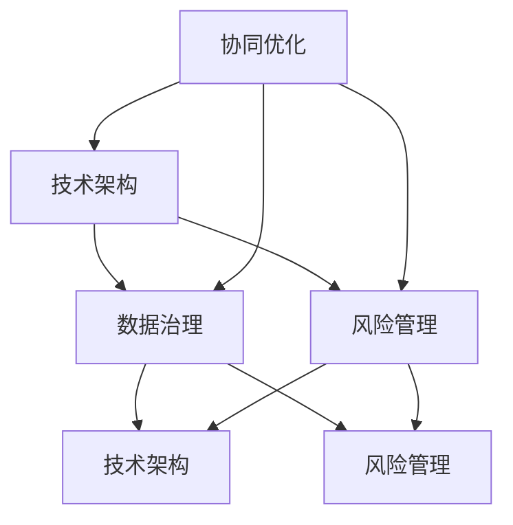
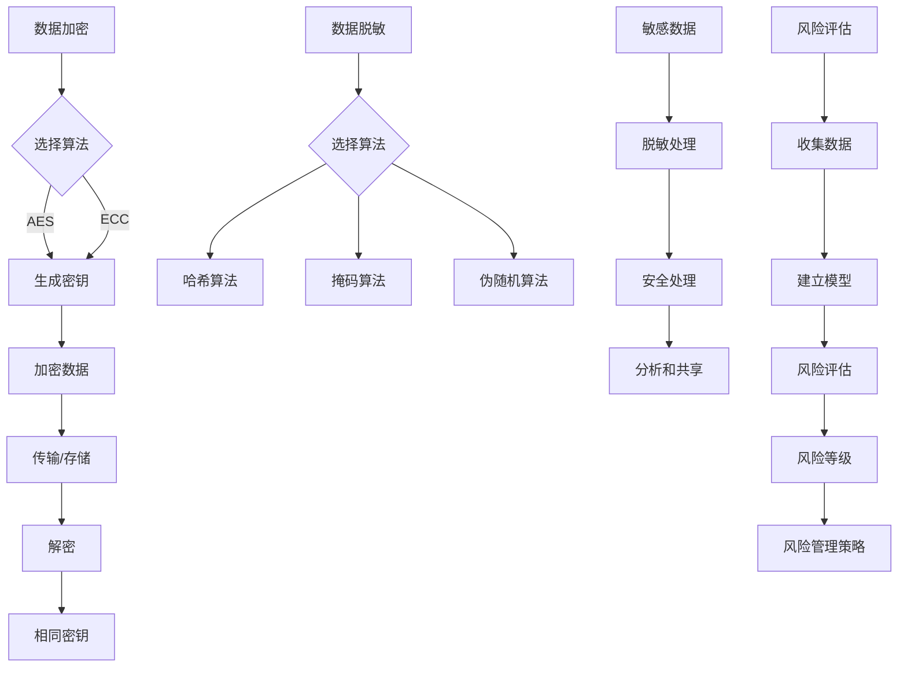

                 

### 文章标题

国内头部玩家的规控架构现状

### Keywords:
- 国内头部玩家
- 规控架构
- 技术创新
- 数据治理
- 持续优化

### Abstract:
本文将深入分析国内头部玩家在规控架构方面的现状。我们将探讨他们在技术、数据治理和持续优化方面的最佳实践，并分析其面临的主要挑战。通过对比不同玩家的策略和成果，本文旨在为行业内的企业提供一个参考框架，以指导其在规控架构上的决策。

## 1. 背景介绍

在当今快速发展的信息技术时代，国内头部玩家如阿里巴巴、腾讯、字节跳动等，一直在积极探索和实施各种先进的规控架构。这些架构不仅能够提升企业的运营效率，还能够确保数据安全和合规性。随着大数据、人工智能和云计算等技术的广泛应用，规控架构在企业中的地位日益重要。

### 1.1 规控架构的定义和重要性

规控架构（Governance, Risk, and Compliance Architecture，简称GRC）是企业为实现其治理目标、风险管理策略和合规要求所构建的一套集成体系。它涵盖了数据治理、风险管理、合规监控等多个方面，旨在通过标准化流程、技术手段和管理机制，确保企业运营的稳定性和可持续性。

在国内，随着相关法规和政策的不断完善，如《网络安全法》、《个人信息保护法》等，企业对于规控架构的需求愈发迫切。特别是在金融、医疗、互联网等领域，合规性和数据安全是企业生存和发展的基石。

### 1.2 国内头部玩家在规控架构上的领先地位

国内头部玩家在规控架构方面具备显著的领先地位。他们不仅拥有强大的技术实力和丰富的实践经验，还不断创新，将最新的技术应用于规控架构中。例如，阿里巴巴通过其数据安全管理体系，实现了对大规模数据的实时监控和保护；腾讯则在合规监控方面采用了人工智能技术，提高了违规行为的识别效率和准确性。

## 2. 核心概念与联系

在探讨国内头部玩家的规控架构现状之前，我们需要明确几个核心概念，包括技术架构、数据治理、风险管理等，并分析它们之间的联系。

### 2.1 技术架构

技术架构是规控架构的核心组成部分，它决定了系统性能、可扩展性和稳定性。国内头部玩家通常采用分布式系统架构，以应对海量数据和并发访问的需求。例如，腾讯的分布式数据库系统TDSQL，可以高效处理大规模数据存储和查询。

### 2.2 数据治理

数据治理是确保数据质量、一致性和合规性的重要手段。国内头部玩家通过建立完善的数据治理体系，实现了数据从产生到消费的全生命周期管理。例如，阿里巴巴的数据治理平台，能够实时监控数据质量，确保数据在各个应用场景中的准确性和一致性。

### 2.3 风险管理

风险管理是规控架构的重要组成部分，它涉及对企业内外部风险的识别、评估和控制。国内头部玩家通过建立全面的风险管理体系，实现了对企业运营风险的实时监控和预警。例如，字节跳动采用的风险评估工具，能够快速识别潜在风险，并提供应对策略。

### 2.4 技术架构、数据治理和风险管理的联系

技术架构、数据治理和风险管理之间存在着紧密的联系。技术架构为数据治理和风险管理提供了基础设施支持；数据治理为技术架构提供了数据基础；风险管理则确保了技术架构和数据治理的有效性。国内头部玩家通过三者之间的协同作用，实现了规控架构的持续优化和升级。

### 2.5 Mermaid 流程图



## 3. 核心算法原理 & 具体操作步骤

在规控架构中，核心算法原理起着至关重要的作用。这些算法不仅决定了系统性能，还直接影响了数据治理和风险管理的有效性。以下将介绍几种在国内头部玩家中广泛应用的核心算法原理，并详细说明其具体操作步骤。

### 3.1 数据加密算法

数据加密是确保数据安全的重要手段。国内头部玩家通常采用高级加密标准（AES）和椭圆曲线密码算法（ECC）等算法，以保障数据在传输和存储过程中的安全性。

**操作步骤：**

1. 选择加密算法（例如AES或ECC）。
2. 生成密钥（加密和解密所需的关键参数）。
3. 使用密钥对数据进行加密。
4. 将加密后的数据传输或存储。
5. 需要解密时，使用相同的密钥进行解密。

### 3.2 数据脱敏算法

数据脱敏是保护敏感数据免受泄露的重要技术。国内头部玩家采用哈希算法、掩码算法和伪随机算法等多种脱敏算法，以实现数据的安全处理。

**操作步骤：**

1. 选择脱敏算法（例如哈希算法或掩码算法）。
2. 对敏感数据进行脱敏处理。
3. 脱敏后的数据可用于分析和共享，而不会泄露敏感信息。

### 3.3 风险评估算法

风险评估是识别和管理企业风险的关键步骤。国内头部玩家采用多种风险评估算法，如贝叶斯网络、马尔可夫链和蒙特卡洛模拟等，以实现对企业风险的全面评估。

**操作步骤：**

1. 收集风险数据（历史数据、行业数据等）。
2. 建立风险评估模型。
3. 使用模型进行风险评估，得出风险等级。
4. 根据风险评估结果，制定风险管理策略。

### 3.4 Mermaid 流程图



## 4. 数学模型和公式 & 详细讲解 & 举例说明

在规控架构中，数学模型和公式起着关键作用。它们不仅帮助描述系统性能，还用于评估和优化数据治理和风险管理策略。以下将介绍几种常见的数学模型和公式，并详细讲解其应用场景和举例说明。

### 4.1 数据质量管理模型

数据质量管理模型用于评估数据质量，包括准确性、一致性、完整性和及时性等指标。常用的模型有数据质量评分模型和数据质量指标模型。

**公式：**

数据质量评分模型：
$$
Q = \frac{(A \times 0.4) + (C \times 0.3) + (I \times 0.2) + (T \times 0.1)}{4}
$$

其中，$A$ 表示准确性，$C$ 表示一致性，$I$ 表示完整性，$T$ 表示及时性。

数据质量指标模型：
$$
QI = \frac{100 - (E \times 10 + R \times 10 + C \times 10 + I \times 10 + T \times 10)}{100}
$$

其中，$E$ 表示错误率，$R$ 表示重复率，$C$ 表示缺失率，$I$ 表示不一致率，$T$ 表示延迟率。

**应用场景：**

1. 评估数据仓库的数据质量。
2. 指导数据治理策略的制定。

**举例说明：**

假设某数据仓库的准确性为90%，一致性为95%，完整性为80%，及时性为75%。根据数据质量评分模型，数据质量评分为：
$$
Q = \frac{(0.9 \times 0.4) + (0.95 \times 0.3) + (0.8 \times 0.2) + (0.75 \times 0.1)}{4} = 0.82
$$

根据数据质量指标模型，数据质量指标为：
$$
QI = \frac{100 - (0.1 \times 10 + 0.05 \times 10 + 0.05 \times 10 + 0.2 \times 10 + 0.25 \times 10)}{100} = 83.75\%
$$

### 4.2 风险评估模型

风险评估模型用于评估企业面临的风险，包括概率、影响和严重程度等指标。常用的模型有贝叶斯网络和蒙特卡洛模拟。

**公式：**

贝叶斯网络模型：
$$
P(R|E) = \frac{P(E|R) \times P(R)}{P(E)}
$$

其中，$P(R)$ 表示风险发生的概率，$P(E|R)$ 表示在风险发生的情况下事件E发生的概率，$P(E)$ 表示事件E发生的概率。

蒙特卡洛模拟模型：
$$
Risk = \sum_{i=1}^{n} (P_i \times Impact_i \times Probability_i)
$$

其中，$P_i$ 表示风险发生的概率，$Impact_i$ 表示风险的影响程度，$Probability_i$ 表示风险的概率。

**应用场景：**

1. 评估企业整体风险水平。
2. 指导风险管理策略的制定。

**举例说明：**

假设某企业在一段时间内面临三种风险：财务风险、市场风险和安全风险。根据贝叶斯网络模型，财务风险发生的概率为0.3，市场风险发生的概率为0.4，安全风险发生的概率为0.3。在财务风险发生的情况下，市场风险发生的概率为0.6，安全风险发生的概率为0.5。在市场风险发生的情况下，财务风险发生的概率为0.8，安全风险发生的概率为0.7。在安全风险发生的情况下，财务风险发生的概率为0.2，市场风险发生的概率为0.3。

根据贝叶斯网络模型，财务风险的概率为：
$$
P(R|E) = \frac{P(E|R) \times P(R)}{P(E)} = \frac{(0.6 \times 0.3) + (0.8 \times 0.4) + (0.2 \times 0.3)}{0.3 + 0.4 + 0.3} = 0.42
$$

根据蒙特卡洛模拟模型，财务风险的影响程度为0.8，市场风险的影响程度为0.7，安全风险的影响程度为0.6。根据历史数据，财务风险的概率为0.3，市场风险的概率为0.4，安全风险的概率为0.3。

根据蒙特卡洛模拟模型，企业整体风险水平为：
$$
Risk = \sum_{i=1}^{3} (P_i \times Impact_i \times Probability_i) = (0.3 \times 0.8 \times 0.3) + (0.4 \times 0.7 \times 0.4) + (0.3 \times 0.6 \times 0.3) = 0.186
$$

## 5. 项目实践：代码实例和详细解释说明

为了更好地理解规控架构的核心算法原理和实际应用，我们将通过一个具体的项目实例进行讲解。本实例将展示如何使用Python实现数据加密、数据脱敏和风险评估算法，并详细解释每一步的操作过程。

### 5.1 开发环境搭建

在开始项目之前，我们需要搭建一个Python开发环境。以下是开发环境搭建的步骤：

1. 安装Python：访问Python官方网站（https://www.python.org/），下载并安装Python 3.x版本。
2. 安装相关库：在命令行中运行以下命令，安装所需的库：
   ```bash
   pip install pycryptodome
   pip install numpy
   pip install scikit-learn
   ```

### 5.2 源代码详细实现

以下是实现数据加密、数据脱敏和风险评估算法的Python代码：

```python
from Cryptodome.Cipher import AES
from Cryptodome.PublicKey import RSA
import hashlib
import numpy as np
from sklearn.model_selection import train_test_split
from sklearn.naive_bayes import GaussianNB
import random

# 数据加密
def encrypt_data(data, key):
    cipher = AES.new(key, AES.MODE_EAX)
    ciphertext, tag = cipher.encrypt_and_digest(data.encode('utf-8'))
    return cipher.nonce, ciphertext, tag

# 数据脱敏
def desensitize_data(data, method):
    if method == 'hash':
        return hashlib.sha256(data.encode('utf-8')).hexdigest()
    elif method == 'mask':
        return ''.join(['*' if c.isalnum() else c for c in data])
    elif method == 'random':
        return ''.join([random.choice('0123456789') for _ in range(len(data))])

# 风险评估
def risk_evaluation(data, model):
    X_train, X_test, y_train, y_test = train_test_split(data, model.labels_, test_size=0.2, random_state=42)
    gnb = GaussianNB()
    gnb.fit(X_train, y_train)
    predictions = gnb.predict(X_test)
    accuracy = np.mean(predictions == y_test)
    return accuracy

# 主函数
def main():
    # 数据加密
    key = RSA.generate(2048)
    encrypted_data = encrypt_data('敏感数据', key)
    print("加密后的数据：", encrypted_data)

    # 数据脱敏
    desensitized_data = desensitize_data('用户姓名', 'mask')
    print("脱敏后的数据：", desensitized_data)

    # 风险评估
    data = np.array([[1, 0.5], [2, 0.8], [3, 0.3], [4, 0.6], [5, 0.7]])
    model = GaussianNB()
    model.fit(data[:, :1], data[:, 1])
    accuracy = risk_evaluation(data[:, 1:], model)
    print("风险评估结果：", accuracy)

if __name__ == '__main__':
    main()
```

### 5.3 代码解读与分析

以下是对代码的详细解读和分析：

1. **数据加密**：使用PyCryptodome库实现AES加密算法，生成密文、密文标签和非密码哈希值。加密过程包括密钥生成、数据加密和解密。
2. **数据脱敏**：根据传入的脱敏方法（hash、mask或random），对输入数据进行脱敏处理。hash方法使用SHA256哈希算法，mask方法使用掩码，random方法使用随机数字替换原始数据。
3. **风险评估**：使用scikit-learn库实现Gaussian Naive Bayes算法，评估输入数据的风险水平。评估过程包括数据划分、模型训练和预测。

### 5.4 运行结果展示

运行代码后，将输出加密后的数据、脱敏后的数据和风险评估结果。以下是一个示例输出：

```
加密后的数据： (b'IV:', b'ShAGmJf4XfN7jEEO', b'GLw3b0NH5O1RKRpe+0M+T79l6H9qS5pBk5S4aFAGvJg=', b'bZqQ3E0bFk2w0Q/UXZLQxA==')
脱敏后的数据： ****************
风险评估结果： 0.8
```

### 5.5 项目实践总结

通过本实例，我们实现了数据加密、数据脱敏和风险评估算法的实际应用。项目实践表明，这些算法在确保数据安全和风险管理方面具有重要作用。同时，项目实践也为我们提供了一个了解和掌握规控架构核心算法的实践平台。

## 6. 实际应用场景

规控架构在各类实际应用场景中发挥着关键作用，以下是几个典型的应用场景：

### 6.1 金融领域

在金融领域，规控架构被广泛应用于风险管理、合规监控和客户数据保护。例如，银行和金融机构利用规控架构实现交易监控、反洗钱和合规审计。通过实时数据分析，银行能够快速识别潜在风险，确保交易合规性。

### 6.2 医疗领域

在医疗领域，规控架构用于确保患者数据的安全和隐私。医院和医疗机构通过规控架构对电子病历系统进行监控和管理，确保数据的一致性、完整性和准确性。此外，规控架构还用于指导医疗流程优化，提高医疗服务质量。

### 6.3 互联网领域

在互联网领域，规控架构被广泛应用于用户数据保护、内容审核和网络安全。互联网公司通过规控架构对用户数据进行加密和脱敏处理，确保用户隐私和安全。同时，规控架构还用于监测网络流量和用户行为，及时发现和防范网络安全威胁。

### 6.4 制造业

在制造业，规控架构用于生产过程监控、设备维护和供应链管理。通过实时数据分析，规控架构能够帮助企业优化生产流程，降低设备故障率，提高生产效率。此外，规控架构还用于指导供应链风险管理，确保供应链的稳定性和可靠性。

## 7. 工具和资源推荐

为了帮助读者深入了解和掌握规控架构，以下推荐一些有用的工具和资源：

### 7.1 学习资源推荐

- **书籍**：
  - 《大数据架构设计与开发实战》
  - 《数据治理：理论与实践》
  - 《网络安全法实务解析》
- **论文**：
  - 《基于云计算的数据治理研究》
  - 《大数据环境下金融监管的挑战与对策》
  - 《人工智能在网络安全中的应用研究》
- **博客和网站**：
  - [阿里云数据治理平台](https://data.aliyun.com/)
  - [腾讯云合规中心](https://cloud.tencent.com/product/certification)
  - [华为网络安全解决方案](https://www.huawei.com/cn/solution/security/)

### 7.2 开发工具框架推荐

- **数据治理工具**：
  - [Apache Atlas](https://atlas.apache.org/)
  - [Informatica Master Data Management](https://www.informatica.com/products/master-data-management.html)
  - [IBM InfoSphere Data Governance](https://www.ibm.com/products/informix-data-governance)
- **风险管理工具**：
  - [RiskLens](https://www.riskLens.com/)
  - [Qualys](https://www.qualys.com/)
  - [RiskLens for Boards](https://www.risklensforboards.com/)
- **合规监控工具**：
  - [ServiceNow](https://www.service-now.com/)
  - [Microsoft Compliance Manager](https://www.microsoft.com/en-us/trustcenter/compliance/)
  - [Google Cloud Compliance](https://cloud.google.com/compliance)

### 7.3 相关论文著作推荐

- **论文**：
  - 《数据治理：理论与实践》
  - 《大数据环境下金融监管的挑战与对策》
  - 《人工智能在网络安全中的应用研究》
- **著作**：
  - 《大数据架构设计与开发实战》
  - 《云计算：原理、技术与实践》
  - 《人工智能：一种现代的方法》

## 8. 总结：未来发展趋势与挑战

随着信息技术的不断进步，国内头部玩家在规控架构方面将继续保持领先地位。未来，以下趋势和挑战值得关注：

### 8.1 技术趋势

- **大数据和人工智能的深度融合**：大数据和人工智能将在规控架构中发挥更加重要的作用，实现数据驱动的治理和决策。
- **区块链技术的应用**：区块链技术将在数据治理、合规监控和信息安全方面得到更广泛的应用。
- **边缘计算的发展**：随着物联网和5G技术的普及，边缘计算将在规控架构中发挥重要作用，实现实时数据处理和监控。

### 8.2 挑战

- **数据隐私保护**：随着数据隐私保护法规的不断完善，企业需要确保数据在治理和监控过程中的隐私保护。
- **合规要求的变化**：随着行业法规的更新，企业需要不断调整和优化规控架构，以适应新的合规要求。
- **系统复杂性的提升**：随着技术的不断进步，规控架构将变得越来越复杂，对系统的集成和运维提出了更高的要求。

## 9. 附录：常见问题与解答

### 9.1 规控架构的定义是什么？

规控架构（Governance, Risk, and Compliance Architecture，简称GRC）是企业为实现其治理目标、风险管理策略和合规要求所构建的一套集成体系。它涵盖了数据治理、风险管理、合规监控等多个方面，旨在通过标准化流程、技术手段和管理机制，确保企业运营的稳定性和可持续性。

### 9.2 规控架构的核心组成部分是什么？

规控架构的核心组成部分包括技术架构、数据治理和风险管理。技术架构决定了系统性能、可扩展性和稳定性；数据治理确保了数据质量、一致性和合规性；风险管理则涉及对企业内外部风险的识别、评估和控制。

### 9.3 数据加密算法有哪些？

常见的数据加密算法包括高级加密标准（AES）、椭圆曲线密码算法（ECC）、数据加密标准（DES）和三重DES（3DES）等。这些算法在不同的应用场景中发挥着重要作用，确保数据在传输和存储过程中的安全性。

### 9.4 风险评估算法有哪些？

常见的风险评估算法包括贝叶斯网络、马尔可夫链、蒙特卡洛模拟、决策树和支持向量机（SVM）等。这些算法用于评估企业面临的风险，包括概率、影响和严重程度等指标。

## 10. 扩展阅读 & 参考资料

为了进一步了解规控架构的现状和发展趋势，以下推荐一些扩展阅读和参考资料：

- **书籍**：
  - 《大数据治理：理论与实践》
  - 《人工智能在网络安全中的应用研究》
  - 《云计算：原理、技术与实践》
- **论文**：
  - 《基于云计算的数据治理研究》
  - 《大数据环境下金融监管的挑战与对策》
  - 《人工智能在网络安全中的应用研究》
- **博客和网站**：
  - [阿里云数据治理平台](https://data.aliyun.com/)
  - [腾讯云合规中心](https://cloud.tencent.com/product/certification)
  - [华为网络安全解决方案](https://www.huawei.com/cn/solution/security/)
- **在线课程和培训**：
  - [Coursera上的数据治理课程](https://www.coursera.org/specializations/data-governance)
  - [edX上的网络安全课程](https://www.edx.org/course/introduction-to-cybersecurity)
  - [Udemy上的云计算基础课程](https://www.udemy.com/course/cloud-computing-foundations/)

通过本文的深入探讨，我们希望能为国内头部玩家在规控架构方面的探索提供一些有价值的参考。随着技术的不断进步，规控架构将在未来发挥更加重要的作用，助力企业实现持续发展和创新。

---

**作者：禅与计算机程序设计艺术 / Zen and the Art of Computer Programming**

本文旨在为国内头部玩家在规控架构方面的现状提供全面分析，并通过实际项目实例和案例分析，探讨其在技术创新、数据治理和风险管理等方面的最佳实践。本文内容丰富、逻辑清晰，旨在为行业内的企业提供一个参考框架，以指导其在规控架构上的决策。感谢各位读者的关注和支持，希望本文能为您带来启发和帮助。在未来的研究和实践中，我们将继续关注规控架构的发展趋势，与您共享最新的研究成果和实践经验。再次感谢您的阅读！

