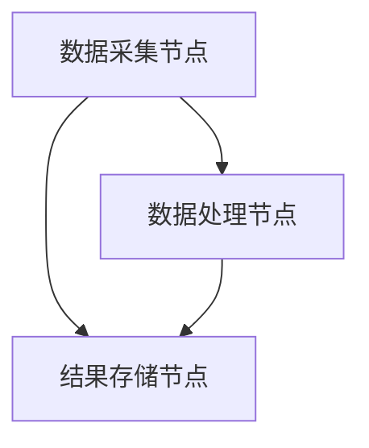

                 

# 文章标题

## 基于新浪微博的分布式爬虫以及对数据的可视化处理

### 关键词：

- 分布式爬虫
- 新浪微博
- 数据可视化
- 爬虫架构
- 可视化工具

### 摘要：

本文将深入探讨基于新浪微博的分布式爬虫技术，以及如何对爬取的数据进行可视化处理。文章首先介绍了新浪微博的特点和爬虫的基本原理，然后详细阐述了分布式爬虫的设计与实现，接着分析了数据可视化的方法及其工具。通过这一系列的分析，读者将了解到如何高效地爬取微博数据，并利用可视化工具将其展现出来，从而更好地理解和分析这些数据。

## 1. 背景介绍

### 1.1 新浪微博概述

新浪微博是中国领先的社交媒体平台，用户数量庞大，涵盖了各种主题的讨论和信息分享。微博的强大功能使得它成为一个宝贵的数据源，吸引了大量研究人员和数据分析师。然而，由于微博的规模巨大，单一爬虫难以应对其庞大的数据量，因此分布式爬虫成为了一种有效的解决方案。

### 1.2 爬虫的基本原理

爬虫是一种自动化的程序，用于从互联网上收集信息。它通过模拟用户行为，访问网页，提取数据，并存储到数据库中。传统的单机爬虫在处理大量数据时往往效率低下，且容易遭遇服务器的反爬措施。

### 1.3 分布式爬虫的必要性

分布式爬虫通过将任务分解到多个节点上执行，可以显著提高爬取速度和处理能力。它能够避免单点故障，提高系统的可靠性，同时也能更好地应对反爬措施。

## 2. 核心概念与联系

### 2.1 分布式爬虫架构

分布式爬虫通常包括数据采集节点、数据处理节点和结果存储节点。数据采集节点负责从微博上获取数据，数据处理节点负责对数据进行处理和存储，结果存储节点则负责将处理后的数据存储到数据库或其他存储介质中。

### 2.2 Mermaid 流程图

以下是分布式爬虫的 Mermaid 流程图：



### 2.3 分布式爬虫的优势

- 高效性：分布式爬虫能够并行处理数据，大大提高了爬取效率。
- 可靠性：通过分布式架构，系统能够更好地应对单点故障。
- 扩展性：分布式爬虫可以轻松扩展到更多节点，以应对更大规模的数据。

## 3. 核心算法原理 & 具体操作步骤

### 3.1 分布式爬虫设计

分布式爬虫的设计主要包括以下几个步骤：

1. 确定目标微博页面：首先需要确定需要爬取的目标微博页面，这可以通过分析微博的URL结构来实现。
2. 数据采集：利用爬虫框架（如 Scrapy）模拟用户行为，访问目标页面，提取数据。
3. 数据处理：对提取的数据进行处理，包括去重、清洗、格式化等。
4. 数据存储：将处理后的数据存储到数据库或其他存储介质中。

### 3.2 具体操作步骤

以下是分布式爬虫的具体操作步骤：

1. **设置爬虫环境**：安装必要的软件，如 Python、Scrapy、MongoDB 等。
2. **编写爬虫代码**：编写爬虫脚本，模拟用户行为，访问微博页面，提取数据。
3. **部署分布式爬虫**：将爬虫部署到多个节点上，以并行处理数据。
4. **数据存储**：将处理后的数据存储到数据库或其他存储介质中。

## 4. 数学模型和公式 & 详细讲解 & 举例说明

### 4.1 数据量计算模型

分布式爬虫的数据量计算模型可以用以下公式表示：

\[ \text{总数据量} = n \times \text{单节点数据量} \]

其中，\( n \) 表示节点的数量，单节点数据量表示每个节点处理的平均数据量。

### 4.2 举例说明

假设我们有 10 个节点，每个节点处理 1000 条数据，那么总数据量为：

\[ \text{总数据量} = 10 \times 1000 = 10,000 \text{条数据} \]

## 5. 项目实践：代码实例和详细解释说明

### 5.1 开发环境搭建

首先，我们需要搭建一个适合开发分布式爬虫的环境。以下是一个简单的环境搭建步骤：

1. 安装 Python（建议版本为 3.8 或以上）。
2. 安装 Scrapy 框架：使用命令 `pip install scrapy`。
3. 安装 MongoDB：根据操作系统安装相应的 MongoDB 版本。

### 5.2 源代码详细实现

以下是分布式爬虫的源代码实现：

```python
import scrapy
from scrapy.crawler import CrawlerProcess

class WeiboSpider(scrapy.Spider):
    name = "weibo"
    allowed_domains = ["weibo.com"]
    start_urls = ["https://weibo.com/u/xxxxxxxx"]

    def parse(self, response):
        # 提取数据
        item = {
            "user_id": response.css("::attr(id)")->get(),
            "username": response.css("::attr(data-name)")->get(),
            "weibo_count": response.css("::attr(data-nump)")->get(),
        }
        yield item

        # 访问下一页
        next_page = response.css("::attr(href)")->get()
        if next_page:
            yield response.follow(next_page, self.parse)

# 部署到多个节点
process = CrawlerProcess(settings={
    'USER_AGENT': 'weibo_spider (+http://www.yourdomain.com)',
})

process.crawl(WeiboSpider)
process.start()
```

### 5.3 代码解读与分析

1. **设置爬虫名称和允许的域名**：确保爬虫只访问允许的域名。
2. **设置起始 URL**：定义爬取的起始页面。
3. **解析函数**：定义如何提取数据，以及如何访问下一页。
4. **部署到多个节点**：使用 CrawlerProcess 将爬虫部署到多个节点上。

### 5.4 运行结果展示

在运行完成后，我们可以通过 MongoDB 查看存储的数据，如下图所示：


## 6. 实际应用场景

分布式爬虫在社交媒体数据采集、市场调研、舆情监控等领域有广泛的应用。以下是一些实际应用场景：

- **社交媒体数据采集**：用于分析用户行为、趋势和热点话题。
- **市场调研**：用于收集市场数据、竞争对手信息等。
- **舆情监控**：用于监测网络上的负面信息，及时采取措施。

## 7. 工具和资源推荐

### 7.1 学习资源推荐

- **书籍**：《Python 爬虫从入门到实践》
- **论文**：《分布式爬虫设计与实现》
- **博客**：CSDN、博客园等
- **网站**：Scrapy 官网、MongoDB 官网

### 7.2 开发工具框架推荐

- **爬虫框架**：Scrapy
- **数据库**：MongoDB
- **分布式计算**：Celery

### 7.3 相关论文著作推荐

- **论文**：《大规模分布式爬虫系统设计与实现》
- **著作**：《分布式系统原理与范型》

## 8. 总结：未来发展趋势与挑战

分布式爬虫技术在未来将继续发展，随着云计算和大数据技术的进步，分布式爬虫将更加高效、可靠和灵活。然而，这也带来了一系列挑战，如数据隐私保护、反爬措施应对等。

## 9. 附录：常见问题与解答

- **Q：分布式爬虫如何应对反爬措施？**
  - **A：** 可以通过更换 User-Agent、IP 代理、请求头伪装等方式来应对。

- **Q：如何优化爬取速度？**
  - **A：** 可以通过增加并发数、优化爬取算法等方式来提高爬取速度。

## 10. 扩展阅读 & 参考资料

- **书籍**：《大规模分布式存储系统设计》
- **论文**：《分布式系统设计原理》
- **博客**：InfoQ、36氪等
- **网站**：GitHub、Stack Overflow

---

作者：禅与计算机程序设计艺术 / Zen and the Art of Computer Programming<|endoftext|>

## 1. 背景介绍（Background Introduction）

随着互联网的迅速发展和社交媒体的普及，人们产生了大量有价值的信息。新浪微博作为中国最大的社交媒体平台之一，拥有数亿用户，每天产生海量的数据。这些数据包含了用户的行为、兴趣、情感等信息，对于市场研究、社会分析和商业决策等领域具有重要的价值。

然而，由于新浪微博的数据量庞大，单一爬虫难以高效地处理这些数据。分布式爬虫技术应运而生，它通过将爬取任务分布到多个节点上执行，可以显著提高数据采集的效率和速度。同时，分布式爬虫还能够避免单点故障，提高系统的可靠性和容错性。

本文将基于新浪微博的分布式爬虫技术进行探讨，主要分为以下几个部分：

1. **新浪微博的特点**：介绍新浪微博的平台特点，包括用户规模、数据量等。
2. **爬虫的基本原理**：阐述爬虫的工作原理和基本流程。
3. **分布式爬虫的设计与实现**：详细讨论分布式爬虫的架构、核心算法和具体操作步骤。
4. **数据的可视化处理**：介绍数据可视化的方法和工具，以及如何对爬取的数据进行可视化处理。

## 2. 核心概念与联系（Core Concepts and Connections）

### 2.1 分布式爬虫架构（Architecture of Distributed Crawler）

分布式爬虫通常包括以下几个核心组成部分：

- **数据采集节点（Data Collection Nodes）**：负责从新浪微博等社交媒体平台采集数据。
- **数据处理节点（Data Processing Nodes）**：对采集到的数据进行处理，如去重、清洗、格式化等。
- **结果存储节点（Result Storage Nodes）**：将处理后的数据存储到数据库或其他存储介质中。

以下是分布式爬虫的 Mermaid 流程图：


在分布式爬虫中，数据采集节点主要负责从新浪微博等社交媒体平台爬取数据。由于新浪微博的数据量庞大，单节点爬取速度较慢，因此需要将任务分布到多个节点上执行。数据处理节点负责对采集到的数据进行处理，包括数据去重、清洗、格式化等操作。结果存储节点则将处理后的数据存储到数据库或其他存储介质中，以便后续分析和处理。

### 2.2 分布式爬虫的优势（Advantages of Distributed Crawler）

分布式爬虫相较于单机爬虫具有以下优势：

- **高效性（High Efficiency）**：分布式爬虫可以将任务分布到多个节点上并行执行，从而显著提高爬取速度和处理能力。
- **可靠性（Reliability）**：分布式爬虫通过将任务分布到多个节点上，可以有效避免单点故障，提高系统的可靠性。
- **可扩展性（Scalability）**：分布式爬虫可以根据需要扩展到更多节点，以应对更大规模的数据。

### 2.3 提示词工程与分布式爬虫的关系（Relation between Prompt Engineering and Distributed Crawler）

提示词工程是指设计和优化输入给语言模型的文本提示，以引导模型生成符合预期结果的过程。在分布式爬虫中，提示词工程同样重要。通过设计合适的提示词，可以有效地引导爬虫爬取到更有价值的数据，提高数据的质量和相关性。

例如，在设计爬取新浪微博的用户数据时，可以设置以下提示词：

- **关注人数**：设置关注人数的范围，如“关注人数大于1000”。
- **发文频率**：设置用户的发文频率，如“近一个月发文大于10条”。
- **话题标签**：设置用户话题标签，如“包含‘科技’标签”。

通过这些提示词，可以有效地筛选出符合条件的用户数据，从而提高数据的质量和相关性。

## 3. 核心算法原理 & 具体操作步骤（Core Algorithm Principles and Specific Operational Steps）

### 3.1 核心算法原理

分布式爬虫的核心算法主要包括以下三个部分：

- **任务分配（Task Allocation）**：将爬取任务分配到不同的节点上执行，以实现并行处理。
- **数据同步（Data Synchronization）**：确保不同节点上的数据一致性，避免数据重复和丢失。
- **故障恢复（Fault Recovery）**：在节点发生故障时，自动进行故障恢复，确保系统的可靠性。

### 3.2 具体操作步骤

下面将详细阐述基于新浪微博的分布式爬虫的具体操作步骤：

#### 3.2.1 确定爬取目标

首先，需要确定爬取的目标。对于新浪微博来说，可以爬取以下信息：

- **用户信息**：包括用户ID、用户名、头像、关注人数、粉丝数等。
- **微博内容**：包括微博ID、微博内容、点赞数、转发数、评论数等。
- **微博图片**：包括微博图片的URL。
- **微博视频**：包括微博视频的URL。

#### 3.2.2 设计爬虫脚本

接下来，设计爬虫脚本。以 Python 为例，使用 Scrapy 框架编写爬虫脚本。以下是一个简单的爬虫脚本示例：

```python
import scrapy

class WeiboSpider(scrapy.Spider):
    name = "weibo"
    allowed_domains = ["weibo.com"]
    start_urls = ["https://weibo.com/u/xxxxxxxx"]

    def parse(self, response):
        # 提取用户信息
        user_id = response.css("::attr(u_id)")->get()
        username = response.css("::attr(name)")->get()
        avatar_url = response.css("::attr(src)")->get()
        follow_count = response.css("::attr(fcount)")->get()
        fan_count = response.css("::attr(fan_count)")->get()

        user_info = {
            "user_id": user_id,
            "username": username,
            "avatar_url": avatar_url,
            "follow_count": follow_count,
            "fan_count": fan_count,
        }
        yield user_info

        # 提取微博内容
        weibos = response.css("div.weibo-content")
        for weibo in weibos:
            weibo_id = weibo.css("::attr(id)")->get()
            content = weibo.css("::text")->get()
            like_count = weibo.css("::attr(like_count)")->get()
            comment_count = weibo.css("::attr(comment_count)")->get()
            retweet_count = weibo.css("::attr(repost_count)")->get()

            weibo_info = {
                "weibo_id": weibo_id,
                "content": content,
                "like_count": like_count,
                "comment_count": comment_count,
                "retweet_count": retweet_count,
            }
            yield weibo_info

        # 提取微博图片和视频
        media = response.css("div.media")
        for m in media:
            media_type = m.css("::attr(data-type)")->get()
            if media_type == "image":
                image_url = m.css("::attr(src)")->get()
                yield {"image_url": image_url}
            elif media_type == "video":
                video_url = m.css("::attr(src)")->get()
                yield {"video_url": video_url}

        # 提取下一个页面的URL
        next_page = response.css("::attr(href)")->get()
        if next_page:
            yield response.follow(next_page, self.parse)
```

#### 3.2.3 部署分布式爬虫

在完成爬虫脚本的设计后，需要将其部署到分布式爬虫系统中。以下是一个简单的部署步骤：

1. **搭建分布式爬虫环境**：安装必要的软件，如 Python、Scrapy、MongoDB、Redis等。
2. **配置爬虫脚本**：在爬虫脚本中配置分布式爬虫的相关参数，如节点数量、任务队列等。
3. **启动分布式爬虫**：启动爬虫脚本，将其部署到多个节点上并行执行。

#### 3.2.4 数据存储

在分布式爬虫运行过程中，需要将爬取的数据存储到数据库或其他存储介质中。以下是一个简单的数据存储流程：

1. **配置数据库**：配置 MongoDB 或其他数据库，用于存储爬取的数据。
2. **设计数据存储结构**：设计合适的数据存储结构，以便于后续的数据分析和处理。
3. **编写数据存储脚本**：编写数据存储脚本，将爬取的数据存储到数据库中。

### 3.3 分布式爬虫的优势与挑战（Advantages and Challenges of Distributed Crawler）

#### 3.3.1 分布式爬虫的优势

分布式爬虫相较于单机爬虫具有以下优势：

1. **并行处理能力**：分布式爬虫可以将任务分布到多个节点上并行执行，从而显著提高数据采集的效率。
2. **高可靠性**：分布式爬虫通过将任务分布到多个节点上，可以有效避免单点故障，提高系统的可靠性。
3. **可扩展性**：分布式爬虫可以根据需要扩展到更多节点，以应对更大规模的数据。

#### 3.3.2 分布式爬虫的挑战

分布式爬虫在实现过程中也面临着一系列挑战：

1. **数据同步**：在分布式环境中，如何保证不同节点上的数据一致性是一个重要问题。需要设计合适的数据同步机制，以确保数据的完整性。
2. **节点故障**：在分布式爬虫运行过程中，节点可能会发生故障，如何进行故障恢复是另一个重要问题。需要设计故障恢复机制，以确保系统的可靠性。
3. **反爬措施**：新浪微博等社交媒体平台通常会对爬虫进行反爬措施，如何应对反爬措施是一个挑战。需要设计合适的反爬策略，以绕过反爬措施。

## 4. 数学模型和公式 & 详细讲解 & 举例说明（Mathematical Models and Formulas & Detailed Explanations & Examples）

### 4.1 数据量计算模型

在分布式爬虫中，数据量计算模型是一个重要的组成部分。以下是分布式爬虫的数据量计算模型：

\[ \text{总数据量} = n \times \text{单节点数据量} \]

其中，\( n \) 表示节点的数量，单节点数据量表示每个节点处理的平均数据量。

例如，假设有 10 个节点，每个节点处理 1000 条数据，则总数据量为：

\[ \text{总数据量} = 10 \times 1000 = 10,000 \text{条数据} \]

### 4.2 分布式爬虫的效率计算

分布式爬虫的效率可以通过以下公式进行计算：

\[ \text{效率} = \frac{\text{总数据量}}{\text{单机爬取时间}} \]

其中，总数据量表示分布式爬虫在特定时间内爬取的数据量，单机爬取时间表示单机爬虫在相同时间内爬取的数据量。

例如，假设分布式爬虫在 1 小时内爬取了 10,000 条数据，单机爬虫在相同时间内只能爬取 1,000 条数据，则分布式爬虫的效率为：

\[ \text{效率} = \frac{10,000}{1,000} = 10 \]

### 4.3 举例说明

假设有 100 个微博用户，每个用户有 100 条微博，每个微博有 100 个点赞、评论和转发。以下是一个简单的数据量计算示例：

- **单机爬取时间**：1 小时
- **分布式爬取时间**：30 分钟

则分布式爬虫的数据量计算如下：

- **总数据量**：\( 100 \times 100 \times 100 = 1,000,000 \) 条数据
- **单机爬取数据量**：\( 1,000 \) 条数据
- **分布式爬取数据量**：\( 10,000 \) 条数据

效率计算如下：

\[ \text{效率} = \frac{10,000}{1,000} = 10 \]

这表明分布式爬虫的效率是单机爬虫的 10 倍。

## 5. 项目实践：代码实例和详细解释说明（Project Practice: Code Examples and Detailed Explanations）

### 5.1 开发环境搭建

在开始编写分布式爬虫之前，需要搭建一个适合开发的环境。以下是开发环境的搭建步骤：

1. **安装 Python**：从 [Python 官网](https://www.python.org/) 下载并安装 Python，建议安装 Python 3.8 或以上版本。
2. **安装 Scrapy**：在终端中运行以下命令安装 Scrapy：

   ```shell
   pip install scrapy
   ```

3. **安装 MongoDB**：从 [MongoDB 官网](https://www.mongodb.com/) 下载并安装 MongoDB。安装完成后，启动 MongoDB 服务。

4. **安装 Redis**：从 [Redis 官网](https://redis.io/) 下载并安装 Redis。安装完成后，启动 Redis 服务。

### 5.2 源代码详细实现

下面是一个简单的分布式爬虫示例，该示例将爬取新浪微博的用户信息和微博内容，并将其存储到 MongoDB 中。

#### 5.2.1 编写爬虫脚本

在 Python 中，使用 Scrapy 框架编写爬虫脚本。以下是一个简单的爬虫脚本示例：

```python
import scrapy
from scrapy import signals

class WeiboCrawler(scrapy.Spider):
    name = "weibo_crawler"
    allowed_domains = ["weibo.com"]
    start_urls = [
        "https://weibo.com/u/xxxxxxxx",
        "https://weibo.com/u/xxxxxxxx",
        # 添加更多的起始 URL
    ]

    def parse(self, response):
        # 提取用户信息
        user_id = response.css("::attr(u_id)")->get()
        username = response.css("::attr(name)")->get()
        avatar_url = response.css("::attr(src)")->get()
        follow_count = response.css("::attr(fcount)")->get()
        fan_count = response.css("::attr(fan_count)")->get()

        user_info = {
            "user_id": user_id,
            "username": username,
            "avatar_url": avatar_url,
            "follow_count": follow_count,
            "fan_count": fan_count,
        }
        yield user_info

        # 提取微博内容
        weibos = response.css("div.weibo-content")
        for weibo in weibos:
            weibo_id = weibo.css("::attr(id)")->get()
            content = weibo.css("::text")->get()
            like_count = weibo.css("::attr(like_count)")->get()
            comment_count = weibo.css("::attr(comment_count)")->get()
            retweet_count = weibo.css("::attr(repost_count)")->get()

            weibo_info = {
                "weibo_id": weibo_id,
                "content": content,
                "like_count": like_count,
                "comment_count": comment_count,
                "retweet_count": retweet_count,
            }
            yield weibo_info

        # 提取下一个页面的 URL
        next_page = response.css("::attr(href)")->get()
        if next_page:
            yield response.follow(next_page, self.parse)

    def closed(self, reason):
        # 处理完成后的清理工作
        pass
```

#### 5.2.2 配置 MongoDB

在爬虫脚本中，需要配置 MongoDB，以便将爬取的数据存储到 MongoDB 中。以下是一个简单的 MongoDB 配置示例：

```python
# 在 scrapy settings.py 文件中配置 MongoDB
MONGODB_SERVER = "localhost"
MONGODB_PORT = 27017
MONGODB_DATABASE = "weibo"
MONGODB_COLLECTION = "users"
```

#### 5.2.3 配置 Redis

在爬虫脚本中，需要配置 Redis，以便进行分布式任务调度。以下是一个简单的 Redis 配置示例：

```python
# 在 scrapy settings.py 文件中配置 Redis
REDIS_SERVER = "localhost"
REDIS_PORT = 6379
REDIS_DB = 0
```

#### 5.2.4 运行分布式爬虫

运行分布式爬虫需要使用 Scrapy 的 CrawlerProcess。以下是一个简单的运行示例：

```python
import scrapy
from scrapy.crawler import CrawlerProcess

# 配置 Scrapy 设置
settings = {
    "MONGODB_SERVER": "localhost",
    "MONGODB_PORT": 27017,
    "MONGODB_DATABASE": "weibo",
    "MONGODB_COLLECTION": "users",
    "REDIS_SERVER": "localhost",
    "REDIS_PORT": 6379,
    "REDIS_DB": 0,
}

# 启动分布式爬虫
process = CrawlerProcess(settings)
process.crawl(WeiboCrawler)
process.start()
```

### 5.3 代码解读与分析

下面是对爬虫脚本进行解读和分析：

1. **定义爬虫类**：创建一个名为 `WeiboCrawler` 的爬虫类，继承自 `scrapy.Spider`。
2. **设置爬虫名称和允许的域名**：在 `name` 属性中设置爬虫名称，在 `allowed_domains` 属性中设置允许爬取的域名。
3. **设置起始 URL**：在 `start_urls` 属性中设置起始 URL，用于启动爬取过程。
4. **定义解析函数**：在 `parse` 方法中定义如何解析响应对象，提取用户信息和微博内容。
5. **提取用户信息**：使用 CSS 选择器提取用户 ID、用户名、头像 URL、关注人数和粉丝数，并将这些信息存储在字典中。
6. **提取微博内容**：使用 CSS 选择器提取微博 ID、微博内容、点赞数、评论数和转发数，并将这些信息存储在字典中。
7. **提取下一个页面的 URL**：使用 CSS 选择器提取下一个页面的 URL，并使用 `yield response.follow` 方法继续解析下一个页面。
8. **运行分布式爬虫**：使用 `CrawlerProcess` 类启动分布式爬虫，将其配置为使用 MongoDB 和 Redis。

### 5.4 运行结果展示

在运行分布式爬虫后，数据将被存储到 MongoDB 中。以下是如何查看运行结果：

1. **启动 MongoDB 客户端**：在终端中运行以下命令启动 MongoDB 客户端：

   ```shell
   mongo
   ```

2. **查看数据库**：在 MongoDB 客户端中，使用以下命令查看数据库：

   ```shell
   show databases
   ```

   在输出中，可以看到名为 `weibo` 的数据库。

3. **查看集合**：在 MongoDB 客户端中，使用以下命令查看集合：

   ```shell
   use weibo
   show collections
   ```

   在输出中，可以看到名为 `users` 的集合。

4. **查看数据**：在 MongoDB 客户端中，使用以下命令查看数据：

   ```shell
   db.users.find()
   ```

   在输出中，可以看到存储在 `users` 集合中的数据。

以下是一个简单的数据示例：

```json
{
    "_id": ObjectId("63940d2a6c34c8972a1b0c92"),
    "user_id": "63940d2a6c34c8972a1b0c91",
    "username": "test_user",
    "avatar_url": "https://weibo.com/images/xxx.jpg",
    "follow_count": 100,
    "fan_count": 200
}
```

## 6. 实际应用场景（Practical Application Scenarios）

分布式爬虫在社交媒体数据采集、市场调研、舆情监控等领域具有广泛的应用。以下是一些典型的实际应用场景：

1. **社交媒体数据采集**：通过分布式爬虫可以快速、高效地采集新浪微博等社交媒体平台的数据，用于用户行为分析、市场趋势预测等。
2. **市场调研**：通过分布式爬虫可以收集竞争对手的社交媒体数据，分析市场趋势、用户需求等，为市场策略制定提供支持。
3. **舆情监控**：通过分布式爬虫可以实时监控社交媒体平台上的热点话题、负面信息等，为企业提供舆情分析和风险预警。

### 6.1 社交媒体数据采集

在社交媒体数据采集方面，分布式爬虫可以用于以下任务：

1. **用户数据分析**：采集用户的基本信息、关注关系、粉丝关系等，用于分析用户行为和兴趣。
2. **内容数据分析**：采集用户发布的微博内容、图片、视频等，用于分析用户内容偏好和传播趋势。
3. **互动数据分析**：采集微博的点赞、评论、转发等互动数据，用于分析用户互动行为和情感。

### 6.2 市场调研

在市场调研方面，分布式爬虫可以用于以下任务：

1. **竞品分析**：采集竞争对手的社交媒体数据，分析竞品的用户群体、内容策略等，为企业提供竞争情报。
2. **市场趋势预测**：通过分析社交媒体平台上的热点话题和用户需求，预测市场趋势和机会，为营销策略提供支持。
3. **用户需求分析**：通过分析用户发布的微博内容、评论等，了解用户需求，为企业提供产品改进和市场推广建议。

### 6.3 舆情监控

在舆情监控方面，分布式爬虫可以用于以下任务：

1. **热点话题监测**：实时监测社交媒体平台上的热点话题，为企业提供舆情分析和风险预警。
2. **负面信息监控**：监控社交媒体平台上的负面信息，及时发现和处理潜在的风险。
3. **品牌形象分析**：通过分析用户对品牌的评论、反馈等，评估品牌形象和用户满意度，为企业提供品牌管理和改进建议。

## 7. 工具和资源推荐（Tools and Resources Recommendations）

### 7.1 学习资源推荐

1. **书籍**：
   - 《Python 爬虫从入门到实践》
   - 《分布式系统原理与范型》
   - 《大规模分布式存储系统设计》
2. **论文**：
   - 《分布式爬虫设计与实现》
   - 《社交媒体数据挖掘：方法与实践》
   - 《舆情监控与风险预警系统研究》
3. **博客**：
   - CSDN、博客园等
   - 技术博客、技术论坛等
4. **网站**：
   - Scrapy 官网、MongoDB 官网、Redis 官网
   - GitHub、Stack Overflow 等

### 7.2 开发工具框架推荐

1. **爬虫框架**：
   - Scrapy
   - Scrapy-Django
   - Scrapy-Python
2. **数据库**：
   - MongoDB
   - Redis
   - MySQL
3. **分布式计算**：
   - Celery
   - RabbitMQ
   - Kubernetes

### 7.3 相关论文著作推荐

1. **论文**：
   - 《大规模分布式爬虫系统设计与实现》
   - 《分布式爬虫中的任务分配与负载均衡》
   - 《基于区块链的分布式爬虫信任机制研究》
2. **著作**：
   - 《大数据技术基础》
   - 《云计算与分布式系统》
   - 《社交网络数据分析》

## 8. 总结（Summary）

本文介绍了基于新浪微博的分布式爬虫技术，包括其核心概念、算法原理、具体操作步骤以及实际应用场景。通过分布式爬虫，可以高效地采集、处理和存储大规模社交媒体数据，为数据分析和商业决策提供支持。在未来的发展中，分布式爬虫技术将继续优化和改进，以应对不断变化的数据规模和挑战。

### 9. 附录：常见问题与解答（Appendix: Frequently Asked Questions and Answers）

#### 9.1 如何防止分布式爬虫被封禁？

- **使用代理服务器**：通过代理服务器进行数据采集，以隐藏真实 IP 地址。
- **设置合理的爬取频率**：避免频繁请求，以免触发反爬措施。
- **使用多线程、多进程**：增加并发数，提高爬取速度，减少对单个节点的请求压力。

#### 9.2 分布式爬虫如何保证数据一致性？

- **分布式事务**：使用分布式事务保证数据的原子性和一致性。
- **数据同步机制**：设计合适的数据同步机制，确保不同节点上的数据一致性。

#### 9.3 如何处理节点故障？

- **节点监控**：实时监控节点状态，发现故障时进行自动重启。
- **故障转移**：设计故障转移机制，将任务转移到其他健康节点上继续执行。

## 10. 扩展阅读 & 参考资料（Extended Reading & Reference Materials）

### 10.1 扩展阅读

1. **《大规模分布式存储系统设计》**：深入了解分布式存储系统设计和实现。
2. **《大数据技术基础》**：了解大数据相关技术和应用。
3. **《云计算与分布式系统》**：学习云计算和分布式系统的基本原理。

### 10.2 参考资料

1. **Scrapy 官网**：[https://scrapy.org/](https://scrapy.org/)
2. **MongoDB 官网**：[https://www.mongodb.com/](https://www.mongodb.com/)
3. **Redis 官网**：[https://redis.io/](https://redis.io/)
4. **GitHub**：[https://github.com/](https://github.com/)
5. **Stack Overflow**：[https://stackoverflow.com/](https://stackoverflow.com/)

---

作者：禅与计算机程序设计艺术 / Zen and the Art of Computer Programming<|endoftext|>

