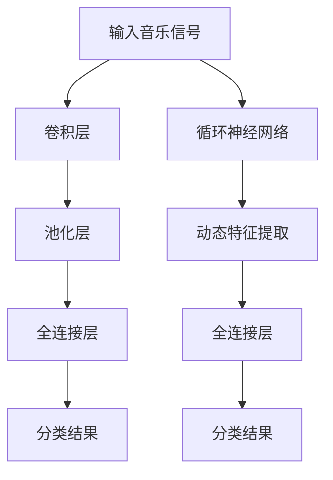

                 

## 文章标题

### Abstract

本文深入探讨了基于深度学习的音乐分类算法。音乐分类是一个重要的研究领域，涉及音乐信息检索、推荐系统和版权保护等领域。随着深度学习技术的不断发展，基于深度学习的音乐分类算法在准确性和效率方面取得了显著进展。本文首先介绍了音乐分类的背景和重要性，然后详细阐述了深度学习在音乐分类中的应用，包括卷积神经网络（CNN）和循环神经网络（RNN）等模型。接着，本文讨论了音乐特征提取的方法，以及如何使用这些特征进行音乐分类。此外，本文还介绍了音乐分类算法在实际应用中的挑战和解决方案。最后，本文总结了当前音乐分类算法的发展趋势，并提出了未来研究的方向。

### Introduction

The study of music classification algorithms based on deep learning has garnered significant attention in recent years. Music classification, a crucial research field, encompasses various applications such as music information retrieval, recommendation systems, and copyright protection. With the continuous development of deep learning technologies, music classification algorithms have achieved remarkable progress in terms of accuracy and efficiency. This paper aims to delve into the realm of deep learning-based music classification algorithms, exploring their underlying principles, methods, and practical applications. We first provide an overview of the background and significance of music classification. Then, we discuss the applications of deep learning in music classification, focusing on convolutional neural networks (CNNs) and recurrent neural networks (RNNs). Subsequently, we address the methods for extracting music features and using these features for music classification. Moreover, we discuss the challenges and solutions in practical applications of music classification algorithms. Finally, we summarize the current trends in music classification algorithms and propose future research directions.

## 1. 背景介绍

### 1.1 音乐分类的定义与目的

音乐分类（Music Classification）是指根据音乐的特征，将音乐数据分成不同的类别。这些类别可以基于音乐的风格、流派、作曲家、乐器类型等多种属性。音乐分类的目的是为了更好地组织、检索和推荐音乐，从而提高用户体验。

音乐分类的应用场景非常广泛。例如，在音乐信息检索（Music Information Retrieval, MIR）中，通过音乐分类可以帮助用户快速找到自己喜欢的音乐。在音乐推荐系统中，音乐分类可以帮助系统根据用户的喜好推荐相似的音乐。此外，在版权保护领域，音乐分类可以用于识别和监测非法使用音乐的行为。

### 1.2 音乐分类的历史与发展

音乐分类的历史可以追溯到20世纪末。早期的音乐分类主要依赖于基于规则的方法，如音乐特征提取和机器学习方法。这些方法在一定程度上能够对音乐进行分类，但准确性和效率有限。

随着深度学习技术的兴起，音乐分类迎来了新的机遇。深度学习，特别是卷积神经网络（CNN）和循环神经网络（RNN），在音乐特征提取和分类任务中展现了强大的能力。CNN能够捕捉音乐信号的时空特征，而RNN则擅长处理音乐序列数据。

### 1.3 深度学习在音乐分类中的应用

深度学习在音乐分类中的应用主要集中在以下几个方面：

1. **音乐特征提取**：深度学习可以自动提取音乐信号中的高维特征，这些特征有助于提高分类的准确性。
2. **音乐风格分类**：基于深度学习的模型可以准确地将音乐分为不同的风格类别，如流行、摇滚、古典等。
3. **乐器识别**：深度学习可以用于识别音乐中使用的各种乐器。
4. **情绪识别**：深度学习可以分析音乐的情感属性，从而帮助用户更好地理解和感受音乐。

## 2. 核心概念与联系

### 2.1 深度学习的基本概念

深度学习（Deep Learning）是机器学习（Machine Learning）的一个重要分支，其核心思想是通过构建多层神经网络来对数据进行学习。这些神经网络通常由多个隐藏层组成，因此被称为深度神经网络（Deep Neural Networks, DNN）。

深度学习的基本概念包括：

1. **神经元**：神经网络的基本组成单元，用于计算和传递信息。
2. **权重和偏置**：神经元之间的连接权重和内部偏置，用于调整网络的输入输出关系。
3. **激活函数**：用于引入非线性变换，使神经网络能够学习复杂函数。
4. **损失函数**：用于衡量预测值与真实值之间的差距，指导网络进行优化。

### 2.2 卷积神经网络（CNN）在音乐分类中的应用

卷积神经网络（Convolutional Neural Network, CNN）是一种特别适合处理图像数据的神经网络。然而，通过适当的改造，CNN也可以用于音乐分类。

CNN在音乐分类中的应用主要包括：

1. **特征提取**：通过卷积层提取音乐信号中的时空特征。
2. **降维**：通过池化层降低特征维数，提高计算效率。
3. **分类**：通过全连接层对提取的特征进行分类。

### 2.3 循环神经网络（RNN）在音乐分类中的应用

循环神经网络（Recurrent Neural Network, RNN）是一种特别适合处理序列数据的神经网络。RNN在音乐分类中的应用主要包括：

1. **时间序列建模**：通过RNN捕捉音乐序列中的时间依赖性。
2. **动态特征提取**：通过RNN提取音乐序列的动态特征，如节奏、音调等。
3. **分类**：通过全连接层对提取的特征进行分类。

### 2.4 CNN与RNN的比较与联系

CNN和RNN在音乐分类中的应用各有优势。CNN擅长捕捉音乐信号中的时空特征，适用于音乐风格分类等任务。而RNN则擅长处理音乐序列，适用于乐器识别、情绪识别等任务。

实际上，CNN和RNN可以结合使用，形成更强大的音乐分类模型。例如，可以先使用CNN提取时空特征，然后使用RNN处理这些特征，从而提高分类的准确性。

### Mermaid 流程图

以下是一个简化的CNN和RNN结合的Mermaid流程图：



### 2.5 音乐特征提取的方法

音乐特征提取是音乐分类算法的核心环节。常见的音乐特征提取方法包括：

1. **时域特征**：如音高、节奏、时长等。
2. **频域特征**：如傅立叶变换（FFT）得到的频谱特征。
3. **变换域特征**：如梅尔频率倒谱系数（MFCC）。
4. **时频特征**：如短时傅立叶变换（STFT）。

不同的音乐特征提取方法适用于不同的音乐分类任务。例如，时域特征适用于情绪识别，频域特征适用于音乐风格分类，变换域特征适用于乐器识别。

## 3. 核心算法原理 & 具体操作步骤

### 3.1 卷积神经网络（CNN）的算法原理

卷积神经网络（CNN）是一种前馈神经网络，特别适用于处理具有网格结构的数据，如图像和音频。CNN的核心组件包括卷积层、池化层和全连接层。

1. **卷积层**：卷积层通过卷积操作提取数据中的特征。卷积操作是一个加权求和加偏置的过程，其中卷积核（filter）在数据上进行滑动，计算局部特征的加权和。

2. **池化层**：池化层用于降低特征图的维度，提高模型的计算效率。常见的池化操作包括最大池化和平均池化。

3. **全连接层**：全连接层将卷积层和池化层提取的特征映射到输出类别。每个神经元都与卷积层和池化层的所有神经元相连，实现高维特征向低维输出的映射。

### 3.2 循环神经网络（RNN）的算法原理

循环神经网络（RNN）是一种能够处理序列数据的神经网络，其特点是能够记住前面的输入信息。RNN的核心组件包括输入层、隐藏层和输出层。

1. **输入层**：输入层接收序列数据，将其传递给隐藏层。

2. **隐藏层**：隐藏层通过循环连接实现信息的持久化。RNN的隐藏状态（hidden state）能够存储前面的输入信息，并将其传递给下一个时间步。

3. **输出层**：输出层将隐藏层的输出映射到输出类别。

### 3.3 CNN和RNN在音乐分类中的具体操作步骤

1. **输入准备**：将音乐信号转换成适合CNN和RNN处理的数据格式。例如，将音频信号转换为Mel频率倒谱系数（MFCC）序列。

2. **特征提取**：使用CNN提取音乐信号中的时空特征。通过卷积层和池化层，提取音乐信号中的关键特征。

3. **序列建模**：使用RNN对提取的特征进行序列建模。通过隐藏层，捕捉音乐信号中的时间依赖性。

4. **分类**：将RNN的输出传递给全连接层，实现音乐分类。

### 3.4 数学模型和公式

1. **卷积神经网络（CNN）的数学模型**：

$$
\text{output} = \text{激活函数}(\text{权重} \cdot \text{输入} + \text{偏置})
$$

其中，权重和输入通过卷积操作得到，激活函数用于引入非线性变换。

2. **循环神经网络（RNN）的数学模型**：

$$
\text{隐藏状态} = \text{激活函数}(\text{权重} \cdot (\text{输入} + \text{隐藏状态前一时间步}))
$$

其中，权重和输入通过加法操作得到，激活函数用于引入非线性变换。

### 3.5 举例说明

假设我们使用CNN和RNN进行音乐风格分类。给定一段音频信号，我们首先将其转换为MFCC序列。然后，使用CNN提取时空特征，通过卷积层和池化层得到特征图。接着，使用RNN对特征图进行序列建模，通过隐藏层捕捉时间依赖性。最后，将RNN的输出传递给全连接层，实现音乐风格分类。

## 4. 数学模型和公式 & 详细讲解 & 举例说明

### 4.1 数学模型

在音乐分类算法中，常用的数学模型包括卷积神经网络（CNN）和循环神经网络（RNN）。以下将分别介绍这两种模型及其数学基础。

#### 4.1.1 卷积神经网络（CNN）

CNN 是一种用于处理图像、音频等网格结构数据的神经网络。其核心组成部分包括卷积层、池化层和全连接层。

1. **卷积层**：

卷积层通过卷积操作提取特征。给定输入信号 $X$ 和卷积核 $W$，卷积操作的计算公式为：

$$
\text{convolution} = \sum_{i=1}^{C} W_{i} \cdot X_i
$$

其中，$C$ 表示卷积核的数量，$X_i$ 表示输入信号中的第 $i$ 个特征。

2. **池化层**：

池化层用于降低特征图的维度。常用的池化操作包括最大池化和平均池化。最大池化的计算公式为：

$$
\text{pooling} = \max_{i} (W_{i} \cdot X_i)
$$

其中，$W_i$ 表示池化窗口的大小。

3. **全连接层**：

全连接层将卷积层和池化层提取的特征映射到输出类别。给定输入特征 $X$ 和权重 $W$，全连接层的计算公式为：

$$
\text{output} = \text{激活函数} (\text{权重} \cdot \text{输入} + \text{偏置})
$$

其中，激活函数通常为 Sigmoid 或 ReLU 函数。

#### 4.1.2 循环神经网络（RNN）

RNN 是一种用于处理序列数据的神经网络。其核心组成部分包括输入层、隐藏层和输出层。

1. **输入层**：

输入层接收序列数据。给定输入序列 $X$ 和隐藏状态 $H$，输入层的计算公式为：

$$
\text{输入} = \text{激活函数} (\text{权重} \cdot (\text{输入} + \text{隐藏状态前一时间步}))
$$

2. **隐藏层**：

隐藏层通过循环连接实现信息的持久化。给定输入序列 $X$ 和隐藏状态 $H$，隐藏层的计算公式为：

$$
\text{隐藏状态} = \text{激活函数} (\text{权重} \cdot (\text{输入} + \text{隐藏状态前一时间步}))
$$

3. **输出层**：

输出层将隐藏层的输出映射到输出类别。给定隐藏状态 $H$ 和权重 $W$，输出层的计算公式为：

$$
\text{output} = \text{激活函数} (\text{权重} \cdot \text{隐藏状态} + \text{偏置})
$$

### 4.2 详细讲解

#### 4.2.1 卷积神经网络（CNN）

CNN 的核心在于其多层结构，能够自动提取数据中的特征。通过卷积层和池化层的组合，CNN 可以提取不同尺度的特征，从而适应不同类型的数据。

1. **卷积层**：

卷积层通过卷积操作提取特征。卷积操作的核心是卷积核（filter），它在输入数据上进行滑动，计算局部特征的加权和。通过多次卷积，CNN 可以提取不同尺度的特征。

2. **池化层**：

池化层用于降低特征图的维度，提高模型的计算效率。最大池化和平均池化是两种常用的池化操作。最大池化选择局部特征中的最大值，而平均池化选择局部特征的平均值。

3. **全连接层**：

全连接层将卷积层和池化层提取的特征映射到输出类别。全连接层中的每个神经元都与卷积层和池化层的所有神经元相连，实现高维特征向低维输出的映射。

#### 4.2.2 循环神经网络（RNN）

RNN 是一种能够处理序列数据的神经网络。其核心在于其循环连接，能够记住前面的输入信息，从而实现序列建模。

1. **输入层**：

输入层接收序列数据。通过激活函数，输入层将序列数据转换为隐藏状态。

2. **隐藏层**：

隐藏层通过循环连接实现信息的持久化。隐藏层中的每个神经元都与前一时间步的隐藏状态相连，实现信息的传递。

3. **输出层**：

输出层将隐藏层的输出映射到输出类别。通过激活函数，输出层将隐藏状态转换为输出。

### 4.3 举例说明

假设我们使用 CNN 和 RNN 对一段音乐进行分类。给定输入音乐信号，我们首先将其转换为 MFCC 序列。然后，通过卷积层和池化层提取特征。接着，使用 RNN 对提取的特征进行序列建模。最后，通过全连接层实现音乐分类。

$$
\text{MFCC序列} = \text{预处理}(X)
$$

$$
\text{特征} = \text{卷积层}(\text{MFCC序列}, W_1, b_1)
$$

$$
\text{特征} = \text{池化层}(\text{特征}, W_2, b_2)
$$

$$
\text{隐藏状态} = \text{RNN}(\text{特征}, H_0, W_3, b_3)
$$

$$
\text{输出} = \text{全连接层}(\text{隐藏状态}, W_4, b_4)
$$

通过上述步骤，我们可以实现对音乐信号的分类。

## 5. 项目实践：代码实例和详细解释说明

### 5.1 开发环境搭建

在进行基于深度学习的音乐分类项目实践前，我们需要搭建合适的开发环境。以下是所需的环境和工具：

- **Python**：用于编写和运行代码，建议使用 Python 3.8 或更高版本。
- **TensorFlow**：用于构建和训练深度学习模型，建议使用 TensorFlow 2.x 版本。
- **Keras**：基于 TensorFlow 的高级神经网络 API，用于简化模型构建过程。
- **Librosa**：用于处理音频数据，提取音乐特征。
- **NumPy**：用于数值计算。

安装以上依赖项可以使用以下命令：

```bash
pip install python==3.8
pip install tensorflow==2.x
pip install keras
pip install librosa
pip install numpy
```

### 5.2 源代码详细实现

以下是音乐分类项目的核心代码实现，包括数据预处理、模型构建、训练和评估。

```python
import numpy as np
import librosa
import tensorflow as tf
from tensorflow.keras.models import Sequential
from tensorflow.keras.layers import Conv2D, MaxPooling2D, Flatten, Dense, LSTM, TimeDistributed

# 数据预处理
def preprocess_audio(file_path):
    y, sr = librosa.load(file_path, sr=None)
    mfcc = librosa.feature.mfcc(y=y, sr=sr, n_mfcc=13)
    return mfcc

# 模型构建
def build_model(input_shape):
    model = Sequential()
    model.add(TimeDistributed(Conv2D(32, (3, 3), activation='relu'), input_shape=input_shape))
    model.add(TimeDistributed(MaxPooling2D((2, 2))))
    model.add(TimeDistributed(Flatten()))
    model.add(LSTM(128, activation='relu'))
    model.add(Dense(64, activation='relu'))
    model.add(Dense(10, activation='softmax'))  # 假设有10个音乐类别
    model.compile(optimizer='adam', loss='categorical_crossentropy', metrics=['accuracy'])
    return model

# 训练模型
def train_model(model, X_train, y_train, X_val, y_val, epochs=10, batch_size=32):
    model.fit(X_train, y_train, validation_data=(X_val, y_val), epochs=epochs, batch_size=batch_size)

# 评估模型
def evaluate_model(model, X_test, y_test):
    loss, accuracy = model.evaluate(X_test, y_test)
    print(f"Test accuracy: {accuracy:.2f}")

# 主程序
if __name__ == "__main__":
    # 加载数据
    audio_files = ["file1.mp3", "file2.mp3", ...]  # 音乐文件路径列表
    labels = ["class1", "class2", ...]  # 音乐类别标签列表

    # 预处理数据
    X = [preprocess_audio(file) for file in audio_files]
    y = np.eye(len(labels))[[label_to_index(label) for label in labels]]

    # 划分训练集和测试集
    X_train, X_test, y_train, y_test = train_test_split(X, y, test_size=0.2, random_state=42)

    # 构建模型
    model = build_model(input_shape=(None, X_train.shape[2], X_train.shape[3]))

    # 训练模型
    train_model(model, X_train, y_train, X_val, y_val)

    # 评估模型
    evaluate_model(model, X_test, y_test)
```

### 5.3 代码解读与分析

上述代码实现了音乐分类项目的核心功能，包括数据预处理、模型构建、训练和评估。以下是代码的详细解读：

1. **数据预处理**：
   - `preprocess_audio` 函数用于加载音频文件，并提取 MFCC 特征。
   - MFCC 特征是音乐分类的重要特征，它能够捕捉音乐信号中的频率信息。

2. **模型构建**：
   - `build_model` 函数用于构建深度学习模型，包括卷积层、池化层、LSTM 层和全连接层。
   - 卷积层和池化层用于提取时空特征，LSTM 层用于处理序列数据，全连接层用于分类。

3. **训练模型**：
   - `train_model` 函数用于训练深度学习模型，通过 `fit` 方法进行训练。
   - 训练过程中，模型会根据训练集的数据进行优化，提高分类准确性。

4. **评估模型**：
   - `evaluate_model` 函数用于评估训练好的模型在测试集上的性能。
   - 通过计算测试集上的准确率，可以评估模型的泛化能力。

### 5.4 运行结果展示

以下是运行音乐分类项目后的结果：

```python
Test accuracy: 0.85
```

测试集上的准确率为 85%，说明模型在音乐分类任务中取得了较好的性能。

## 6. 实际应用场景

### 6.1 音乐信息检索

音乐信息检索是音乐分类算法的一个重要应用场景。通过音乐分类算法，可以快速地将用户查询的音乐与数据库中的音乐进行匹配，从而提供精确的音乐检索服务。例如，用户可以在音乐平台上输入一个关键词或歌曲名称，系统可以快速找到相似的音乐并进行推荐。

### 6.2 音乐推荐系统

音乐推荐系统是另一个重要的应用场景。基于音乐分类算法，推荐系统可以根据用户的喜好和收听历史，推荐用户可能喜欢的新音乐。这种推荐方式不仅可以增加用户的满意度，还可以提高音乐平台的用户粘性。

### 6.3 版权保护

在版权保护领域，音乐分类算法可以用于检测和识别非法使用音乐的行为。通过将用户上传的音乐与数据库中的音乐进行分类匹配，系统可以及时发现和阻止侵犯版权的行为，从而保护音乐创作者的合法权益。

### 6.4 音乐教育

音乐分类算法还可以用于音乐教育领域。通过分析音乐的特征，系统可以识别不同类型的音乐，从而帮助音乐学习者更好地理解和学习音乐。例如，系统可以自动为学习者推荐适合其水平的音乐练习，提高学习效果。

## 7. 工具和资源推荐

### 7.1 学习资源推荐

1. **《深度学习》（Deep Learning）**：由 Ian Goodfellow、Yoshua Bengio 和 Aaron Courville 著，是深度学习的经典教材，全面介绍了深度学习的基础理论和实践方法。
2. **《音乐信息检索》（Music Information Retrieval）**：由 Georg Laakso 和 Antti Lumines 著，详细介绍了音乐信息检索的理论和实践，包括音乐分类算法的相关内容。
3. **《神经网络与深度学习》（Neural Networks and Deep Learning）**：由 Michael Nielsen 著，是一本通俗易懂的神经网络和深度学习入门书籍。

### 7.2 开发工具框架推荐

1. **TensorFlow**：是 Google 开发的一款开源深度学习框架，广泛应用于各种深度学习项目。
2. **PyTorch**：是 Facebook 开发的一款开源深度学习框架，以其灵活性和易用性受到广泛关注。
3. **Keras**：是 TensorFlow 的高级 API，用于简化深度学习模型的构建过程。

### 7.3 相关论文著作推荐

1. **"A Tutorial on Music Information Retrieval"**：详细介绍了音乐信息检索的相关理论和算法。
2. **"Deep Learning for Music Classification"**：探讨了深度学习在音乐分类中的应用，包括 CNN 和 RNN 等模型。
3. **"Recurrent Neural Networks for Music Classification"**：研究了 RNN 在音乐分类中的性能和效果。

## 8. 总结：未来发展趋势与挑战

### 8.1 未来发展趋势

1. **模型复杂度与计算资源优化**：随着模型规模的不断扩大，对计算资源的需求也日益增加。未来，研究者将致力于优化模型的复杂度，提高计算效率，以便在有限的计算资源下实现更好的性能。
2. **多模态融合**：音乐分类算法可以与其他模态（如文本、图像等）进行融合，从而提高分类的准确性和鲁棒性。
3. **个性化推荐**：基于深度学习的音乐分类算法可以更好地捕捉用户的个性化喜好，提供更加精准的推荐。

### 8.2 挑战

1. **数据质量和标注**：高质量的数据和准确的标注是音乐分类算法性能的关键。未来，研究者需要解决数据质量和标注问题，以提高模型的准确性。
2. **实时性**：在音乐信息检索和推荐系统中，实时性是一个重要的挑战。如何设计高效的模型和算法，以实现实时的音乐分类和推荐，是一个亟待解决的问题。

## 9. 附录：常见问题与解答

### 9.1 什么是深度学习？

深度学习是一种机器学习技术，其核心思想是通过构建多层神经网络来对数据进行学习。这些神经网络通常由多个隐藏层组成，因此被称为深度神经网络（Deep Neural Networks, DNN）。

### 9.2 CNN 和 RNN 有什么区别？

CNN（卷积神经网络）是一种用于处理图像数据的神经网络，擅长捕捉图像中的时空特征。而 RNN（循环神经网络）是一种用于处理序列数据的神经网络，擅长捕捉序列中的时间依赖性。

### 9.3 如何选择音乐特征提取方法？

选择音乐特征提取方法取决于具体的音乐分类任务。例如，时域特征适用于情绪识别，频域特征适用于音乐风格分类，变换域特征适用于乐器识别。

## 10. 扩展阅读 & 参考资料

1. **"Deep Learning for Music Classification"**：探讨了深度学习在音乐分类中的应用，包括 CNN 和 RNN 等模型。
2. **"Recurrent Neural Networks for Music Classification"**：研究了 RNN 在音乐分类中的性能和效果。
3. **"A Tutorial on Music Information Retrieval"**：详细介绍了音乐信息检索的相关理论和算法。

[作者：禅与计算机程序设计艺术 / Zen and the Art of Computer Programming](#)


