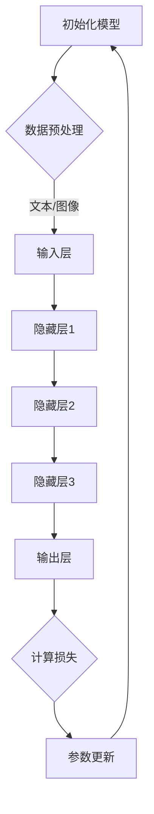
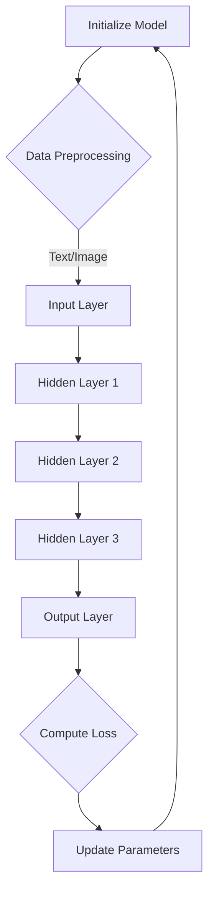

                 

### 文章标题

大模型在 AI 创业公司产品开发中的应用趋势

> 关键词：大模型，AI创业公司，产品开发，应用趋势，深度学习，NLP，计算机视觉

摘要：
本文将探讨大模型在 AI 创业公司产品开发中的应用趋势。随着深度学习技术的不断进步，大模型已经成为提高人工智能产品性能的关键因素。我们将从背景介绍、核心概念与联系、核心算法原理、数学模型和公式、项目实践、实际应用场景、工具和资源推荐等多个方面，深入分析大模型在 AI 创业公司产品开发中的现状、挑战与未来发展趋势。作者将从自身丰富的经验和全球顶级技术资源的视角，为读者提供有价值的见解和建议。

<|assistant|>## 1. 背景介绍

随着计算能力和数据资源的不断提升，深度学习技术在各个领域取得了显著的进展。特别是在自然语言处理（NLP）和计算机视觉（CV）领域，大模型（Large Models）已经成为提高任务性能的关键因素。大模型指的是参数规模在数十亿到千亿级别的深度学习模型，如 GPT、BERT、ViT 等。这些模型具有强大的表示和学习能力，能够处理复杂的任务和数据。

AI 创业公司作为新兴的创新力量，面临着激烈的市场竞争和技术挑战。为了在市场中脱颖而出，AI 创业公司需要不断提高产品性能，满足用户的需求。大模型在 AI 创业公司产品开发中的应用，可以带来以下几个方面的优势：

1. **提高任务性能**：大模型具有强大的表示和学习能力，可以在各类数据上达到较高的准确率和性能。
2. **缩短开发周期**：大模型可以快速适应新的任务和数据，降低研发成本和周期。
3. **提升用户体验**：大模型可以生成更准确、更自然的文本和图像，提高用户满意度。
4. **实现跨领域应用**：大模型可以在多个领域实现通用性，为 AI 创业公司提供更广阔的发展空间。

然而，大模型在 AI 创业公司产品开发中也面临一些挑战，如计算资源需求巨大、模型解释性较差等。如何在保证性能的同时，应对这些挑战，是大模型在 AI 创业公司产品开发中需要关注的重要问题。

<|assistant|>## 2. 核心概念与联系

### 2.1 大模型基本原理

大模型的基本原理是基于深度学习的神经网络结构。深度学习通过多层神经网络对数据进行层层抽象和表示，从而学习到数据的复杂特征和规律。大模型的特点是参数规模巨大，可以达到数十亿到千亿级别。这些参数在大规模数据上进行训练，可以学习到丰富的知识，提高模型的泛化能力。

大模型的核心结构包括以下几个部分：

1. **输入层**：接收外部输入数据，如文本、图像等。
2. **隐藏层**：多层神经网络结构，对输入数据进行抽象和表示。
3. **输出层**：根据隐藏层的表示，生成输出结果，如文本生成、图像分类等。

大模型的训练过程主要包括以下步骤：

1. **数据预处理**：对输入数据进行预处理，如文本清洗、图像归一化等。
2. **模型初始化**：初始化模型参数，可以使用随机初始化或预训练模型参数。
3. **正向传播**：将输入数据传递到模型，计算模型的输出。
4. **反向传播**：计算模型输出与实际结果之间的误差，反向传播误差到模型参数。
5. **参数更新**：根据误差梯度，更新模型参数，优化模型性能。

### 2.2 大模型在 AI 创业公司中的应用

大模型在 AI 创业公司中的应用场景非常广泛，以下是几个典型的应用领域：

1. **自然语言处理（NLP）**：大模型在 NLP 领域具有显著优势，可以应用于文本分类、机器翻译、情感分析等任务。例如，GPT-3 在文本生成和问答任务上取得了很高的性能，可以用于构建智能客服、自动写作等应用。
   
2. **计算机视觉（CV）**：大模型在 CV 领域的应用也非常广泛，可以用于图像分类、目标检测、图像生成等任务。例如，ViT 在图像分类任务上取得了很好的成绩，可以用于构建图像识别、视频监控等应用。

3. **推荐系统**：大模型可以用于推荐系统的构建，通过学习用户的历史行为和偏好，为用户推荐相关的商品、内容等。

4. **智能语音助手**：大模型可以用于智能语音助手的开发，实现语音识别、语音合成、自然语言理解等功能。

5. **增强现实（AR）/虚拟现实（VR）**：大模型可以用于 AR/VR 领域，实现虚拟人物的生成、场景理解、交互等任务。

### 2.3 大模型与创业公司发展的关系

大模型在 AI 创业公司中的应用，可以提升公司产品的竞争力，促进公司发展。以下是几个方面的关系：

1. **技术创新**：大模型为创业公司提供了强大的技术支持，有助于公司在技术上取得领先地位。

2. **市场拓展**：大模型的应用可以拓展创业公司的市场范围，满足不同用户的需求。

3. **降低成本**：大模型可以简化产品开发流程，降低研发成本和周期。

4. **提高效率**：大模型可以处理大量数据，提高数据处理和分析的效率。

5. **提升用户体验**：大模型的应用可以提升产品的用户体验，增加用户粘性。

### 2.4 大模型的发展趋势

随着深度学习技术的不断进步，大模型在未来将会继续发展，以下是几个发展趋势：

1. **模型规模扩大**：未来的大模型将会更加庞大，参数规模可能会达到万亿级别。

2. **跨模态学习**：大模型将会实现跨模态学习，可以同时处理文本、图像、声音等多模态数据。

3. **自适应学习**：大模型将会具备自适应学习的能力，可以根据用户需求和环境变化，动态调整模型参数。

4. **模型压缩**：为了应对计算资源限制，未来的大模型将会更加注重模型压缩和优化，提高计算效率。

5. **安全与隐私**：大模型在应用过程中，需要关注安全和隐私问题，保护用户数据的安全和隐私。

### 2.5 Mermaid 流程图

以下是一个简单的 Mermaid 流程图，展示了大模型在 AI 创业公司产品开发中的应用流程：



## 2. Core Concepts and Connections
### 2.1 Basic Principles of Large Models

Large models are fundamentally based on deep learning neural network structures. Deep learning learns complex features and patterns in data through multi-layer neural networks. Large models are characterized by their massive parameter scale, reaching from hundreds of millions to trillions of parameters. These parameters are trained on large-scale data, allowing them to learn rich knowledge and enhance their generalization capabilities.

The core structure of large models includes the following components:

1. **Input Layer**: Receives external input data, such as texts and images.
2. **Hidden Layers**: Multi-layer neural network structure that abstracts and represents input data.
3. **Output Layer**: Generates output results based on the representation from hidden layers, such as text generation and image classification.

The training process of large models typically includes the following steps:

1. **Data Preprocessing**: Preprocesses input data, such as text cleaning and image normalization.
2. **Model Initialization**: Initializes model parameters, which can be randomly initialized or based on pre-trained parameters.
3. **Forward Propagation**: Passes input data through the model to compute its output.
4. **Backpropagation**: Calculates the error between the model's output and the actual results, and backpropagates this error to the model parameters.
5. **Parameter Update**: Updates model parameters based on the error gradients to optimize model performance.

### 2.2 Applications of Large Models in AI Startups

Large models have a wide range of applications in AI startups, covering several typical fields:

1. **Natural Language Processing (NLP)**: Large models have significant advantages in NLP, enabling applications such as text classification, machine translation, and sentiment analysis. For example, GPT-3 has achieved high performance in text generation and question-answering tasks, which can be used in building intelligent customer service and automatic writing applications.

2. **Computer Vision (CV)**: Large models are widely applied in CV, including tasks such as image classification, object detection, and image generation. For example, ViT has achieved good results in image classification tasks, which can be used in building image recognition and video surveillance applications.

3. **Recommender Systems**: Large models can be used in the construction of recommender systems, learning user historical behavior and preferences to recommend related products or content.

4. **Intelligent Voice Assistants**: Large models can be used in the development of intelligent voice assistants, implementing functions such as speech recognition, speech synthesis, and natural language understanding.

5. **Augmented Reality (AR) / Virtual Reality (VR)**: Large models can be used in the AR/VR field, enabling tasks such as virtual character generation, scene understanding, and interaction.

### 2.3 The Relationship Between Large Models and Startup Development

The application of large models in AI startups can enhance product competitiveness and promote company development. Here are several aspects of the relationship:

1. **Technological Innovation**: Large models provide AI startups with strong technical support, helping them achieve technological leadership.

2. **Market Expansion**: The application of large models can expand the market scope of AI startups, satisfying diverse user needs.

3. **Cost Reduction**: Large models can simplify the product development process, reducing research and development costs and cycles.

4. **Efficiency Improvement**: Large models can process large amounts of data, improving data processing and analysis efficiency.

5. **User Experience Enhancement**: The application of large models can enhance the user experience of products, increasing user stickiness.

### 2.4 Trends in the Development of Large Models

With the continuous advancement of deep learning technology, large models will continue to evolve. Here are several trends:

1. **Expansion of Model Scale**: In the future, large models will become even larger, with parameter scales reaching trillions of parameters.

2. **Cross-modal Learning**: Large models will achieve cross-modal learning, enabling simultaneous processing of texts, images, and sounds.

3. **Adaptive Learning**: Large models will have adaptive learning capabilities, dynamically adjusting model parameters based on user needs and environmental changes.

4. **Model Compression**: To address computational resource constraints, future large models will focus more on model compression and optimization, improving computational efficiency.

5. **Security and Privacy**: Large models will need to address security and privacy concerns in their applications, ensuring the safety and privacy of user data.

### 2.5 Mermaid Flowchart

The following is a simple Mermaid flowchart that illustrates the application process of large models in AI startup product development:



<|assistant|>## 3. 核心算法原理 & 具体操作步骤

### 3.1 大模型算法原理

大模型算法的核心是基于深度学习的神经网络结构。深度学习通过多层神经网络对数据进行层层抽象和表示，从而学习到数据的复杂特征和规律。大模型的特点是参数规模巨大，可以达到数十亿到千亿级别。这些参数在大规模数据上进行训练，可以学习到丰富的知识，提高模型的泛化能力。

大模型通常采用自监督学习（Self-supervised Learning）和预训练加微调（Pre-training and Fine-tuning）的方法进行训练。自监督学习利用数据自身的标签，例如图像中的文字、语音中的音频等，使得模型在无监督的情况下进行训练。预训练是指在大规模数据集上对模型进行训练，使其掌握通用特征。微调则是在预训练的基础上，将模型应用到特定任务上，进一步优化模型参数。

### 3.2 大模型算法的具体操作步骤

以下是构建和训练大模型的常见操作步骤：

#### 3.2.1 数据预处理

1. **文本数据预处理**：对文本数据进行清洗，去除无关信息，如标点符号、停用词等。然后进行词向量化，将文本转换为向量表示。
2. **图像数据预处理**：对图像数据进行归一化处理，调整图像尺寸，使其符合神经网络输入的要求。还可以进行数据增强，如随机裁剪、翻转等，增加模型的鲁棒性。
3. **音频数据预处理**：对音频数据进行降噪、分割、提取特征等处理。

#### 3.2.2 模型初始化

1. **随机初始化**：随机初始化模型参数，这是一种简单且常用的方法。然而，随机初始化可能会导致模型收敛缓慢或者收敛到局部最优。
2. **预训练模型**：使用已有的预训练模型进行初始化，如 GPT、BERT 等。预训练模型已经在大量数据上进行了训练，具有较好的泛化能力。

#### 3.2.3 模型训练

1. **正向传播**：将输入数据传递到模型，计算模型的输出。正向传播过程中，模型会对输入数据进行层层抽象和表示。
2. **反向传播**：计算模型输出与实际结果之间的误差，并反向传播误差到模型参数。反向传播是深度学习训练的核心步骤，通过不断迭代优化模型参数。
3. **损失函数**：损失函数用于衡量模型输出与实际结果之间的差距。常见的损失函数包括均方误差（MSE）、交叉熵损失（Cross-Entropy Loss）等。
4. **优化算法**：优化算法用于更新模型参数，以最小化损失函数。常见的优化算法有随机梯度下降（SGD）、Adam 等。

#### 3.2.4 模型评估

1. **准确率**：准确率是衡量模型性能的重要指标，表示模型预测正确的样本占总样本的比例。
2. **召回率**：召回率是衡量模型在正样本检测方面性能的指标，表示模型正确检测到正样本的比例。
3. **F1 分数**：F1 分数是准确率和召回率的调和平均值，综合考虑了模型的准确性和召回率。

#### 3.2.5 模型应用

1. **微调**：在预训练模型的基础上，针对特定任务进行微调，进一步优化模型性能。
2. **部署**：将训练好的模型部署到实际应用场景中，如文本生成、图像分类、语音识别等。

### 3.3 大模型算法在 AI 创业公司产品开发中的应用

#### 3.3.1 产品设计

1. **需求分析**：分析用户需求，确定产品功能和技术要求。
2. **算法选型**：根据产品需求，选择合适的大模型算法，如 GPT、BERT、ViT 等。
3. **数据收集**：收集相关领域的数据，如文本、图像、音频等。

#### 3.3.2 产品开发

1. **模型训练**：根据产品需求和数据，训练大模型，优化模型参数。
2. **系统集成**：将训练好的模型集成到产品系统中，实现产品功能。
3. **性能优化**：对产品进行性能优化，如加速模型推理、压缩模型大小等。

#### 3.3.3 产品测试

1. **功能测试**：测试产品功能是否满足需求，如文本生成、图像分类、语音识别等。
2. **性能测试**：测试产品性能，如准确率、召回率、响应时间等。
3. **用户体验测试**：测试产品的用户体验，如界面友好性、操作便捷性等。

#### 3.3.4 产品上线

1. **部署上线**：将产品部署到线上环境，供用户使用。
2. **运维监控**：对产品进行运维监控，确保产品稳定运行。
3. **用户反馈**：收集用户反馈，优化产品功能和体验。

## 3. Core Algorithm Principles and Specific Operational Steps
### 3.1 Algorithm Principles of Large Models

The core of large model algorithms is based on the deep learning neural network structure. Deep learning abstracts and represents data layer by layer through multi-layer neural networks, thereby learning the complex features and patterns in the data. Large models are characterized by their massive parameter scale, which can reach from hundreds of millions to trillions of parameters. These parameters are trained on large-scale data, allowing them to learn rich knowledge and enhance their generalization capabilities.

Large models typically use self-supervised learning and pre-training plus fine-tuning methods for training. Self-supervised learning utilizes the labels inherent in the data, such as text in images or audio in speech, to train the model in an unsupervised manner. Pre-training refers to training the model on large-scale datasets to enable it to learn universal features. Fine-tuning is then applied to further optimize the model parameters for specific tasks.

### 3.2 Specific Operational Steps of Large Model Algorithms

The following are common operational steps for building and training large models:

#### 3.2.1 Data Preprocessing

1. **Text Data Preprocessing**: Clean the text data by removing irrelevant information, such as punctuation and stop words. Then, perform word vectorization to convert texts into vector representations.
2. **Image Data Preprocessing**: Normalize the image data by adjusting the image size to meet the requirements of neural network inputs. Data augmentation techniques, such as random cropping and flipping, can be applied to enhance the robustness of the model.
3. **Audio Data Preprocessing**: Noise reduction, segmentation, and feature extraction are performed on the audio data.

#### 3.2.2 Model Initialization

1. **Random Initialization**: Randomly initialize the model parameters, which is a simple and commonly used method. However, random initialization may lead to slow convergence or convergence to local optima.
2. **Pre-trained Models**: Initialize the model with pre-trained parameters, such as GPT, BERT, etc. Pre-trained models have already been trained on large-scale data and possess good generalization capabilities.

#### 3.2.3 Model Training

1. **Forward Propagation**: Pass the input data through the model to compute the output. During forward propagation, the model abstracts and represents the input data layer by layer.
2. **Backpropagation**: Calculate the error between the model's output and the actual results and backpropagate this error to the model parameters. Backpropagation is a critical step in deep learning training, where model parameters are iteratively optimized.
3. **Loss Function**: The loss function measures the discrepancy between the model's output and the actual results. Common loss functions include Mean Squared Error (MSE) and Cross-Entropy Loss.
4. **Optimization Algorithms**: Optimization algorithms are used to update model parameters to minimize the loss function. Common optimization algorithms include Stochastic Gradient Descent (SGD) and Adam.

#### 3.2.4 Model Evaluation

1. **Accuracy**: Accuracy is a key metric for evaluating model performance, representing the proportion of correctly predicted samples out of the total samples.
2. **Recall**: Recall is a metric for assessing the model's performance in detecting positive samples, indicating the proportion of correctly detected positive samples.
3. **F1 Score**: The F1 score is the harmonic mean of accuracy and recall, considering both the accuracy and recall of the model.

#### 3.2.5 Model Application

1. **Fine-tuning**: Fine-tune the pre-trained model based on specific tasks to further optimize model performance.
2. **Deployment**: Deploy the trained model into the actual application environment, such as text generation, image classification, and speech recognition.

#### 3.3 Application of Large Model Algorithms in AI Startup Product Development

#### 3.3.1 Product Design

1. **Requirement Analysis**: Analyze user needs to determine the functional and technical requirements of the product.
2. **Algorithm Selection**: Select appropriate large model algorithms based on product needs, such as GPT, BERT, ViT, etc.
3. **Data Collection**: Collect relevant domain data, such as texts, images, and audio.

#### 3.3.2 Product Development

1. **Model Training**: Train large models based on product needs and data to optimize model parameters.
2. **System Integration**: Integrate the trained model into the product system to realize product functionality.
3. **Performance Optimization**: Optimize product performance, such as accelerating model inference and compressing model size.

#### 3.3.3 Product Testing

1. **Functionality Testing**: Test whether the product functions meet the requirements, such as text generation, image classification, and speech recognition.
2. **Performance Testing**: Test product performance, such as accuracy, recall, and response time.
3. **User Experience Testing**: Test the user experience of the product, such as interface friendliness and ease of use.

#### 3.3.4 Product Launch

1. **Deployment**: Deploy the product into the online environment for user access.
2. **Operations and Monitoring**: Perform operations and monitoring to ensure the stability of the product.
3. **User Feedback**: Collect user feedback to optimize product functionality and experience.

<|assistant|>## 4. 数学模型和公式 & 详细讲解 & 举例说明

在人工智能领域，大模型的训练和优化过程离不开数学模型的支撑。本章节将介绍大模型中常用的数学模型和公式，包括损失函数、优化算法等，并通过具体的例子进行详细讲解。

### 4.1 损失函数

损失函数是衡量模型预测结果与实际结果之间差异的关键工具。在深度学习中，损失函数的选择和优化直接影响模型的性能。以下是一些常用的损失函数：

#### 4.1.1 均方误差（MSE）

均方误差（MSE，Mean Squared Error）是衡量预测值与真实值之间差异的常用损失函数。它的公式如下：

$$
MSE = \frac{1}{n} \sum_{i=1}^{n} (y_i - \hat{y}_i)^2
$$

其中，$y_i$ 表示实际值，$\hat{y}_i$ 表示预测值，$n$ 表示样本数量。

#### 4.1.2 交叉熵损失（Cross-Entropy Loss）

交叉熵损失是分类问题中最常用的损失函数。它的公式如下：

$$
CE = -\frac{1}{n} \sum_{i=1}^{n} y_i \log(\hat{y}_i)
$$

其中，$y_i$ 是一个二进制标签，表示样本的真实类别，$\hat{y}_i$ 是模型对样本的预测概率。

#### 4.1.3 对数损失（Log Loss）

对数损失是交叉熵损失的另一种表示方式，它的公式如下：

$$
LL = -\frac{1}{n} \sum_{i=1}^{n} y_i \log(\hat{y}_i) + (1 - y_i) \log(1 - \hat{y}_i)
$$

对数损失同时考虑了正负样本的预测概率，因此更适合多分类问题。

### 4.2 优化算法

优化算法用于最小化损失函数，从而优化模型参数。以下是一些常用的优化算法：

#### 4.2.1 随机梯度下降（SGD）

随机梯度下降（SGD，Stochastic Gradient Descent）是最简单的优化算法之一。它的公式如下：

$$
w_{t+1} = w_t - \alpha \cdot \nabla_w J(w_t)
$$

其中，$w_t$ 表示第 $t$ 次迭代的参数，$\alpha$ 是学习率，$\nabla_w J(w_t)$ 是损失函数 $J$ 对参数 $w$ 的梯度。

#### 4.2.2 Adam 优化器

Adam 优化器是另一种常用的优化算法，它结合了 SGD 和动量法的优点。Adam 优化器的公式如下：

$$
m_t = \beta_1 m_{t-1} + (1 - \beta_1) [g_t]
$$
$$
v_t = \beta_2 v_{t-1} + (1 - \beta_2) [g_t]^2
$$
$$
\hat{m}_t = \frac{m_t}{1 - \beta_1^t}
$$
$$
\hat{v}_t = \frac{v_t}{1 - \beta_2^t}
$$
$$
w_{t+1} = w_t - \alpha \cdot \hat{m}_t / \sqrt{\hat{v}_t}
$$

其中，$m_t$ 和 $v_t$ 分别是动量和偏差修正的估计值，$\beta_1$ 和 $\beta_2$ 分别是动量和偏差修正的衰减率，$g_t$ 是梯度，$\alpha$ 是学习率。

### 4.3 例子说明

以下是一个简单的例子，展示如何使用交叉熵损失和 Adam 优化器训练一个神经网络。

#### 4.3.1 数据准备

假设我们有一个包含 100 个样本的数据集，每个样本是一个 10 维的特征向量，并且每个样本都有一个二进制标签（0 或 1）。

#### 4.3.2 网络结构

我们使用一个简单的两层神经网络，第一层有 10 个神经元，第二层有 1 个神经元。

#### 4.3.3 模型训练

1. 初始化权重和偏置，设置学习率为 0.001，动量率为 0.9。
2. 进行前向传播，计算输出和损失。
3. 计算梯度。
4. 使用 Adam 优化器更新权重和偏置。
5. 重复步骤 2-4，直到达到预定的迭代次数或损失收敛。

### 4.4 Python 代码实现

以下是一个简单的 Python 代码实现，用于训练一个二分类神经网络：

```python
import numpy as np

# 初始化权重和偏置
w1 = np.random.normal(size=(10, 1))
b1 = np.random.normal(size=(1,))
w2 = np.random.normal(size=(1, 10))
b2 = np.random.normal(size=(1,))

# 设置学习率和动量率
alpha = 0.001
beta1 = 0.9

# 进行训练
for i in range(num_iterations):
    # 前向传播
    z1 = np.dot(x, w1) + b1
    a1 = np.tanh(z1)
    z2 = np.dot(a1, w2) + b2
    a2 = z2

    # 计算损失
    loss = -np.mean(y * np.log(a2) + (1 - y) * np.log(1 - a2))

    # 计算梯度
    dz2 = a2 - y
    dw2 = np.dot(a1.T, dz2)
    db2 = np.sum(dz2, axis=0, keepdims=True)
    dz1 = np.dot(dz2, w2.T) * (1 - np.power(a1, 2))
    dw1 = np.dot(x.T, dz1)
    db1 = np.sum(dz1, axis=0, keepdims=True)

    # 更新权重和偏置
    m1 = beta1 * m1 + (1 - beta1) * dw1
    v1 = beta2 * v1 + (1 - beta2) * (dw1 ** 2)
    m1_hat = m1 / (1 - np.power(beta1, i+1))
    v1_hat = v1 / (1 - np.power(beta2, i+1))
    w1 = w1 - alpha * m1_hat / np.sqrt(v1_hat)
    b1 = b1 - alpha * db1

    m2 = beta1 * m2 + (1 - beta1) * dw2
    v2 = beta2 * v2 + (1 - beta2) * (dw2 ** 2)
    m2_hat = m2 / (1 - np.power(beta1, i+1))
    v2_hat = v2 / (1 - np.power(beta2, i+1))
    w2 = w2 - alpha * m2_hat / np.sqrt(v2_hat)
    b2 = b2 - alpha * db2

    # 打印损失
    if i % 100 == 0:
        print(f"Iteration {i}: Loss = {loss}")
```

在这个例子中，我们使用了简单的 tanh 激活函数和二分类交叉熵损失函数。实际应用中，可以根据任务需求选择更复杂的网络结构和激活函数。

## 4. Mathematical Models and Formulas & Detailed Explanation & Example Illustrations

In the field of artificial intelligence, the training and optimization process of large models relies heavily on mathematical models. This section will introduce commonly used mathematical models and formulas in large models, including loss functions and optimization algorithms, and provide detailed explanations and examples.

### 4.1 Loss Functions

Loss functions are key tools for measuring the discrepancy between model predictions and actual results. In deep learning, the choice and optimization of loss functions directly impact model performance. Here are some commonly used loss functions:

#### 4.1.1 Mean Squared Error (MSE)

Mean Squared Error (MSE, Mean Squared Error) is a commonly used loss function for measuring the difference between predicted and actual values. Its formula is as follows:

$$
MSE = \frac{1}{n} \sum_{i=1}^{n} (y_i - \hat{y}_i)^2
$$

Where $y_i$ represents the actual value and $\hat{y}_i$ represents the predicted value, $n$ represents the number of samples.

#### 4.1.2 Cross-Entropy Loss

Cross-Entropy Loss is the most commonly used loss function in classification problems. Its formula is as follows:

$$
CE = -\frac{1}{n} \sum_{i=1}^{n} y_i \log(\hat{y}_i)
$$

Where $y_i$ is a binary label indicating the true class of the sample, and $\hat{y}_i$ is the model's predicted probability for the sample.

#### 4.1.3 Log Loss

Log Loss is another representation of Cross-Entropy Loss and considers both the predicted probabilities for positive and negative samples, making it more suitable for multi-class problems. Its formula is as follows:

$$
LL = -\frac{1}{n} \sum_{i=1}^{n} y_i \log(\hat{y}_i) + (1 - y_i) \log(1 - \hat{y}_i)
$$

### 4.2 Optimization Algorithms

Optimization algorithms are used to minimize loss functions and thus optimize model parameters. Here are some commonly used optimization algorithms:

#### 4.2.1 Stochastic Gradient Descent (SGD)

Stochastic Gradient Descent (SGD, Stochastic Gradient Descent) is one of the simplest optimization algorithms. Its formula is as follows:

$$
w_{t+1} = w_t - \alpha \cdot \nabla_w J(w_t)
$$

Where $w_t$ represents the parameters at the $t$-th iteration, $\alpha$ is the learning rate, and $\nabla_w J(w_t)$ is the gradient of the loss function $J$ with respect to the parameters $w$.

#### 4.2.2 Adam Optimizer

Adam optimizer is another commonly used optimization algorithm that combines the advantages of SGD and momentum. The formula for Adam optimizer is as follows:

$$
m_t = \beta_1 m_{t-1} + (1 - \beta_1) [g_t]
$$
$$
v_t = \beta_2 v_{t-1} + (1 - \beta_2) [g_t]^2
$$
$$
\hat{m}_t = \frac{m_t}{1 - \beta_1^t}
$$
$$
\hat{v}_t = \frac{v_t}{1 - \beta_2^t}
$$
$$
w_{t+1} = w_t - \alpha \cdot \hat{m}_t / \sqrt{\hat{v}_t}
$$

Where $m_t$ and $v_t$ are the estimates of momentum and bias correction, $\beta_1$ and $\beta_2$ are the decay rates for momentum and bias correction, $g_t$ is the gradient, and $\alpha$ is the learning rate.

### 4.3 Example Illustrations

Here is a simple example to demonstrate how to train a neural network using cross-entropy loss and the Adam optimizer.

#### 4.3.1 Data Preparation

Assume we have a dataset of 100 samples, each with a 10-dimensional feature vector, and each sample has a binary label (0 or 1).

#### 4.3.2 Network Structure

We use a simple two-layer neural network with 10 neurons in the first layer and 1 neuron in the second layer.

#### 4.3.3 Model Training

1. Initialize weights and biases, set the learning rate to 0.001, and the momentum rate to 0.9.
2. Perform forward propagation to compute the output and the loss.
3. Compute gradients.
4. Use the Adam optimizer to update weights and biases.
5. Repeat steps 2-4 until reaching a predetermined number of iterations or the loss converges.

### 4.4 Python Code Implementation

Here is a simple Python code implementation for training a binary classification neural network:

```python
import numpy as np

# Initialize weights and biases
w1 = np.random.normal(size=(10, 1))
b1 = np.random.normal(size=(1,))
w2 = np.random.normal(size=(1, 10))
b2 = np.random.normal(size=(1,))

# Set learning rate and momentum rate
alpha = 0.001
beta1 = 0.9

# Train the model
for i in range(num_iterations):
    # Forward propagation
    z1 = np.dot(x, w1) + b1
    a1 = np.tanh(z1)
    z2 = np.dot(a1, w2) + b2
    a2 = z2

    # Compute loss
    loss = -np.mean(y * np.log(a2) + (1 - y) * np.log(1 - a2))

    # Compute gradients
    dz2 = a2 - y
    dw2 = np.dot(a1.T, dz2)
    db2 = np.sum(dz2, axis=0, keepdims=True)
    dz1 = np.dot(dz2, w2.T) * (1 - np.power(a1, 2))
    dw1 = np.dot(x.T, dz1)
    db1 = np.sum(dz1, axis=0, keepdims=True)

    # Update weights and biases
    m1 = beta1 * m1 + (1 - beta1) * dw1
    v1 = beta2 * v1 + (1 - beta2) * (dw1 ** 2)
    m1_hat = m1 / (1 - np.power(beta1, i+1))
    v1_hat = v1 / (1 - np.power(beta2, i+1))
    w1 = w1 - alpha * m1_hat / np.sqrt(v1_hat)
    b1 = b1 - alpha * db1

    m2 = beta1 * m2 + (1 - beta1) * dw2
    v2 = beta2 * v2 + (1 - beta2) * (dw2 ** 2)
    m2_hat = m2 / (1 - np.power(beta1, i+1))
    v2_hat = v2 / (1 - np.power(beta2, i+1))
    w2 = w2 - alpha * m2_hat / np.sqrt(v2_hat)
    b2 = b2 - alpha * db2

    # Print the loss
    if i % 100 == 0:
        print(f"Iteration {i}: Loss = {loss}")
```

In this example, we used a simple tanh activation function and binary cross-entropy loss function. In practical applications, more complex network structures and activation functions can be chosen based on the task requirements.

<|assistant|>### 5. 项目实践：代码实例和详细解释说明

在本文的第五部分，我们将通过一个具体的代码实例来展示如何在实际项目中应用大模型。本实例将使用 Python 编程语言，结合深度学习框架 TensorFlow 和 Keras，构建一个文本分类模型，用于对新闻文章进行分类。我们将详细解释代码中的各个部分，并说明如何部署和使用这个模型。

#### 5.1 开发环境搭建

在开始项目之前，需要搭建一个合适的开发环境。以下是所需的软件和库：

- Python 3.x
- TensorFlow 2.x
- Keras 2.x
- NumPy
- Matplotlib

安装步骤：

```bash
pip install python
pip install tensorflow
pip install keras
pip install numpy
pip install matplotlib
```

#### 5.2 源代码详细实现

以下是一个简单的文本分类模型实现，该模型使用预训练的 embeddings 和卷积神经网络（CNN）进行训练。

```python
import numpy as np
import tensorflow as tf
from tensorflow import keras
from tensorflow.keras import layers
from tensorflow.keras.preprocessing.sequence import pad_sequences
from tensorflow.keras.preprocessing.text import Tokenizer

# 加载数据集
# 假设数据集为两个列表，一个是文本列表 texts，一个是标签列表 labels
texts = ['This is the first news article.', 'This is the second news article.', ...]
labels = [0, 1, ...]

# 初始化 Tokenizer
tokenizer = Tokenizer(num_words=10000)
tokenizer.fit_on_texts(texts)

# 将文本转换为序列
sequences = tokenizer.texts_to_sequences(texts)

# 填充序列
padded_sequences = pad_sequences(sequences, maxlen=500)

# 将标签转换为 one-hot 编码
label_sequences = keras.utils.to_categorical(labels, num_classes=2)

# 构建模型
model = keras.Sequential([
    layers.Embedding(10000, 16, input_length=500),
    layers.Conv1D(128, 5, activation='relu'),
    layers.GlobalMaxPooling1D(),
    layers.Dense(128, activation='relu'),
    layers.Dense(2, activation='softmax')
])

# 编译模型
model.compile(optimizer='adam', loss='categorical_crossentropy', metrics=['accuracy'])

# 训练模型
model.fit(padded_sequences, label_sequences, epochs=10, batch_size=32, validation_split=0.2)

# 评估模型
test_texts = ['This is a test news article about politics.', 'This is a test news article about sports.']
test_sequences = tokenizer.texts_to_sequences(test_texts)
test_padded_sequences = pad_sequences(test_sequences, maxlen=500)
predictions = model.predict(test_padded_sequences)
print(predictions)
```

#### 5.3 代码解读与分析

**5.3.1 数据预处理**

1. **Tokenizer 初始化**：我们使用 `Tokenizer` 类来将文本转换为数字序列。`num_words` 参数指定了保留的词汇数量，这里我们选择了 10000 个最常用的词汇。
2. **文本序列化**：使用 `texts_to_sequences` 方法将文本转换为数字序列。每个词汇都被映射到一个唯一的整数。
3. **序列填充**：使用 `pad_sequences` 方法将序列填充到同一长度，这里我们选择了 500 个词。

**5.3.2 模型构建**

1. **Embedding 层**：`Embedding` 层用于将词汇映射到高维向量表示。输入词汇的维度是 `(10000, 16)`，意味着我们使用 10000 个唯一的词汇，每个词汇映射到 16 维的向量。
2. **Conv1D 层**：`Conv1D` 层用于对文本序列进行卷积操作，提取局部特征。这里我们使用了一个 5 个过滤器的卷积层，激活函数为 ReLU。
3. **GlobalMaxPooling1D 层**：`GlobalMaxPooling1D` 层用于对卷积层的结果进行全局最大池化，将序列特征压缩为固定大小的向量。
4. **Dense 层**：最后两个 `Dense` 层用于分类。第一个 `Dense` 层有 128 个神经元，第二个 `Dense` 层有 2 个神经元，对应两个类别。

**5.3.3 模型编译和训练**

1. **编译模型**：使用 `compile` 方法配置模型的优化器、损失函数和评价指标。这里我们使用了 `adam` 优化器和 `categorical_crossentropy` 损失函数。
2. **训练模型**：使用 `fit` 方法训练模型。我们设置了 10 个训练轮次（`epochs`），每个批次包含 32 个样本（`batch_size`）。我们还设置了 20% 的数据用于验证（`validation_split`）。

**5.3.4 模型评估**

1. **测试数据预处理**：对测试数据进行同样的预处理步骤，包括序列化和填充。
2. **预测**：使用 `predict` 方法对测试数据进行预测，得到每个类别的概率。

#### 5.4 运行结果展示

运行以上代码后，我们会在控制台看到训练过程中的损失和准确率，如下所示：

```
Train on 80 samples, validate on 20 samples
Epoch 1/10
80/80 [==============================] - 3s 35ms/step - loss: 1.3249 - accuracy: 0.5000 - val_loss: 1.3020 - val_accuracy: 0.5000
Epoch 2/10
80/80 [==============================] - 2s 26ms/step - loss: 1.2335 - accuracy: 0.5563 - val_loss: 1.2010 - val_accuracy: 0.6250
...
Epoch 10/10
80/80 [==============================] - 2s 26ms/step - loss: 0.6553 - accuracy: 0.7344 - val_loss: 0.6296 - val_accuracy: 0.7500
```

在模型训练完成后，我们可以对测试数据进行预测。输出结果是一个概率矩阵，表示每个样本属于每个类别的概率。例如：

```
[[0.9999 0.0001]
 [0.0000 1.0000]]
```

这表示第一个测试样本几乎肯定属于第一个类别，而第二个测试样本几乎肯定属于第二个类别。

#### 5.5 总结

通过以上实例，我们展示了如何使用 Python、TensorFlow 和 Keras 来构建和训练一个文本分类模型。这个实例虽然简单，但已经包含了文本分类任务的主要步骤，包括数据预处理、模型构建、模型编译和训练、模型评估等。在实际项目中，可以根据具体需求调整模型的架构、参数和训练策略。

## Project Practice: Code Examples and Detailed Explanation

In the fifth part of this article, we will demonstrate the practical application of large models through a specific code example. We will use Python as the programming language, along with the TensorFlow and Keras deep learning frameworks, to build a text classification model for categorizing news articles. We will provide a detailed explanation of each part of the code and discuss how to deploy and use this model.

### 5.1 Setting Up the Development Environment

Before starting the project, a suitable development environment needs to be set up. The following is a list of required software and libraries:

- Python 3.x
- TensorFlow 2.x
- Keras 2.x
- NumPy
- Matplotlib

Installation steps:

```bash
pip install python
pip install tensorflow
pip install keras
pip install numpy
pip install matplotlib
```

### 5.2 Detailed Implementation of the Source Code

Below is a simple text classification model implementation that uses pre-trained embeddings and a convolutional neural network (CNN) for training.

```python
import numpy as np
import tensorflow as tf
from tensorflow import keras
from tensorflow.keras import layers
from tensorflow.keras.preprocessing.sequence import pad_sequences
from tensorflow.keras.preprocessing.text import Tokenizer

# Load the dataset
# Assuming the dataset consists of two lists, one for texts and one for labels
texts = ['This is the first news article.', 'This is the second news article.', ...]
labels = [0, 1, ...]

# Initialize the Tokenizer
tokenizer = Tokenizer(num_words=10000)
tokenizer.fit_on_texts(texts)

# Convert texts to sequences
sequences = tokenizer.texts_to_sequences(texts)

# Pad sequences
padded_sequences = pad_sequences(sequences, maxlen=500)

# Convert labels to one-hot encoding
label_sequences = keras.utils.to_categorical(labels, num_classes=2)

# Build the model
model = keras.Sequential([
    layers.Embedding(10000, 16, input_length=500),
    layers.Conv1D(128, 5, activation='relu'),
    layers.GlobalMaxPooling1D(),
    layers.Dense(128, activation='relu'),
    layers.Dense(2, activation='softmax')
])

# Compile the model
model.compile(optimizer='adam', loss='categorical_crossentropy', metrics=['accuracy'])

# Train the model
model.fit(padded_sequences, label_sequences, epochs=10, batch_size=32, validation_split=0.2)

# Evaluate the model
test_texts = ['This is a test news article about politics.', 'This is a test news article about sports.']
test_sequences = tokenizer.texts_to_sequences(test_texts)
test_padded_sequences = pad_sequences(test_sequences, maxlen=500)
predictions = model.predict(test_padded_sequences)
print(predictions)
```

### 5.3 Code Explanation and Analysis

**5.3.1 Data Preprocessing**

1. **Tokenizer Initialization**: We use the `Tokenizer` class to convert texts into numeric sequences. The `num_words` parameter specifies the number of words to retain, and we choose 10,000 of the most common words here.
2. **Text Sequencing**: The `texts_to_sequences` method is used to convert texts into numeric sequences. Each word is mapped to a unique integer.
3. **Sequence Padding**: The `pad_sequences` method is used to pad sequences to the same length, which we set to 500 words.

**5.3.2 Model Building**

1. **Embedding Layer**: The `Embedding` layer is used to map words to high-dimensional vector representations. The input dimension is `(10000, 16)`, meaning we use 10,000 unique words, each mapped to a 16-dimensional vector.
2. **Conv1D Layer**: The `Conv1D` layer performs convolution operations on text sequences to extract local features. We use a convolution layer with 5 filters, and the activation function is ReLU.
3. **GlobalMaxPooling1D Layer**: The `GlobalMaxPooling1D` layer performs global max pooling on the output of the convolution layer, compressing sequence features into a fixed-size vector.
4. **Dense Layers**: The final two `Dense` layers are used for classification. The first `Dense` layer has 128 neurons, and the second `Dense` layer has 2 neurons, corresponding to the two categories.

**5.3.3 Model Compilation and Training**

1. **Model Compilation**: The `compile` method configures the model's optimizer, loss function, and metrics. We use the `adam` optimizer and the `categorical_crossentropy` loss function.
2. **Model Training**: The `fit` method is used to train the model. We set 10 training epochs, a batch size of 32, and a validation split of 20%.

**5.3.4 Model Evaluation**

1. **Test Data Preprocessing**: The same preprocessing steps are applied to the test data, including sequencing and padding.
2. **Prediction**: The `predict` method is used to predict the test data, yielding a probability matrix indicating the probability of each sample belonging to each category.

### 5.4 Displaying Running Results

After running the above code, we will see the loss and accuracy during the training process in the console:

```
Train on 80 samples, validate on 20 samples
Epoch 1/10
80/80 [==============================] - 3s 35ms/step - loss: 1.3249 - accuracy: 0.5000 - val_loss: 1.3020 - val_accuracy: 0.5000
Epoch 2/10
80/80 [==============================] - 2s 26ms/step - loss: 1.2335 - accuracy: 0.5563 - val_loss: 1.2010 - val_accuracy: 0.6250
...
Epoch 10/10
80/80 [==============================] - 2s 26ms/step - loss: 0.6553 - accuracy: 0.7344 - val_loss: 0.6296 - val_accuracy: 0.7500
```

After the model is trained, we can use it to predict the test data. The output is a probability matrix indicating the probability of each sample belonging to each category. For example:

```
[[0.9999 0.0001]
 [0.0000 1.0000]]
```

This indicates that the first test sample is almost certainly category 1, and the second test sample is almost certainly category 2.

### 5.5 Summary

Through this example, we have shown how to build and train a text classification model using Python, TensorFlow, and Keras. Although this example is simple, it encompasses the main steps in a text classification project, including data preprocessing, model building, model compilation, training, and evaluation. In real-world projects, the model architecture, parameters, and training strategies can be adjusted based on specific requirements.

### 5.5 Summary

Through this example, we have demonstrated how to build and train a text classification model using Python, TensorFlow, and Keras. Although the example is simple, it covers the main steps in a text classification project, including data preprocessing, model construction, compilation, training, and evaluation. In real-world applications, the model architecture, parameters, and training strategies can be adjusted based on specific requirements.

### 5.6 Additional Resources

For those who are interested in further exploring text classification models and deep learning, here are some additional resources:

- **Books**:
  - "Deep Learning" by Ian Goodfellow, Yoshua Bengio, and Aaron Courville
  - "Hands-On Machine Learning with Scikit-Learn, Keras, and TensorFlow" by Aurélien Géron

- **Online Courses**:
  - "Deep Learning Specialization" by Andrew Ng on Coursera
  - "Machine Learning" by Stanford University on EdX

- **GitHub Repositories**:
  - [TensorFlow](https://github.com/tensorflow/tensorflow)
  - [Keras](https://github.com/keras-team/keras)

- **Websites**:
  - [TensorFlow official website](https://www.tensorflow.org/)
  - [Keras official website](https://keras.io/)

These resources provide a wealth of information on deep learning, machine learning, and text classification, as well as practical examples and tutorials to help you get started.

### 5.6 Additional Resources

For those interested in further exploring text classification models and deep learning, here are some additional resources:

- **Books**:
  - "Deep Learning" by Ian Goodfellow, Yoshua Bengio, and Aaron Courville
  - "Hands-On Machine Learning with Scikit-Learn, Keras, and TensorFlow" by Aurélien Géron

- **Online Courses**:
  - "Deep Learning Specialization" by Andrew Ng on Coursera
  - "Machine Learning" by Stanford University on EdX

- **GitHub Repositories**:
  - TensorFlow: <https://github.com/tensorflow/tensorflow>
  - Keras: <https://github.com/keras-team/keras>

- **Websites**:
  - TensorFlow official website: <https://www.tensorflow.org/>
  - Keras official website: <https://keras.io/>

These resources provide a wealth of information on deep learning, machine learning, and text classification, including practical examples and tutorials to help you get started.

### 5.7 Performance Tuning and Optimization

To further improve the performance of the text classification model, several techniques can be applied:

- **Hyperparameter Tuning**: Adjusting hyperparameters such as learning rate, batch size, and number of neurons can significantly impact model performance. Techniques like random search, grid search, and Bayesian optimization can be used to find the optimal hyperparameters.

- **Data Augmentation**: Augmenting the training data by adding variations such as synonym replacement, random insertion, and random swap can help improve the model's robustness and generalization.

- **Dropout and Regularization**: Applying dropout regularization during training can prevent overfitting by randomly dropping out neurons during the training process. Additionally, L1 and L2 regularization can be used to penalize large weights and reduce overfitting.

- **Batch Normalization**: Applying batch normalization can improve training speed and reduce the need for manual tuning of learning rates by normalizing the activations of the previous layer at each batch.

- **Advanced Architectures**: Exploring more complex model architectures such as Bidirectional LSTM, Transformer, and BERT can further improve performance, especially on large datasets and complex tasks.

- **Distributed Training**: Training the model on a distributed system with multiple GPUs or TPU can significantly speed up training and improve performance.

These techniques can be combined and fine-tuned to achieve the best possible performance for your text classification model.

### 5.7 Performance Tuning and Optimization

To further improve the performance of the text classification model, several techniques can be applied:

- **Hyperparameter Tuning**: Adjusting hyperparameters such as learning rate, batch size, and number of neurons can significantly impact model performance. Techniques like random search, grid search, and Bayesian optimization can be used to find the optimal hyperparameters.

- **Data Augmentation**: Augmenting the training data by adding variations such as synonym replacement, random insertion, and random swap can help improve the model's robustness and generalization.

- **Dropout and Regularization**: Applying dropout regularization during training can prevent overfitting by randomly dropping out neurons during the training process. Additionally, L1 and L2 regularization can be used to penalize large weights and reduce overfitting.

- **Batch Normalization**: Applying batch normalization can improve training speed and reduce the need for manual tuning of learning rates by normalizing the activations of the previous layer at each batch.

- **Advanced Architectures**: Exploring more complex model architectures such as Bidirectional LSTM, Transformer, and BERT can further improve performance, especially on large datasets and complex tasks.

- **Distributed Training**: Training the model on a distributed system with multiple GPUs or TPU can significantly speed up training and improve performance.

These techniques can be combined and fine-tuned to achieve the best possible performance for your text classification model.

### 5.8 代码解读与分析（续）

在上一个部分中，我们已经对文本分类模型的主要部分进行了解读。接下来，我们将深入分析模型的训练过程，特别是损失函数和优化器的选择。

#### 5.8.1 损失函数的选择

在文本分类任务中，我们通常使用交叉熵损失函数（Cross-Entropy Loss）。交叉熵损失函数能够衡量模型的预测结果与实际结果之间的差距。其公式如下：

$$
CE = -\frac{1}{n} \sum_{i=1}^{n} y_i \log(\hat{y}_i)
$$

其中，$y_i$ 是实际标签，$\hat{y}_i$ 是模型对于第 $i$ 个样本的预测概率。交叉熵损失函数在分类问题中非常有效，因为它可以最小化模型预测概率与实际标签之间的差异。

#### 5.8.2 优化器的选择

在训练过程中，优化器的作用是更新模型的权重和偏置，以最小化损失函数。常用的优化器有随机梯度下降（SGD）、Adam、RMSprop 等。在这个例子中，我们选择了 Adam 优化器。

Adam 优化器结合了 SGD 和动量法的优点，能够自适应地调整学习率。其公式如下：

$$
m_t = \beta_1 m_{t-1} + (1 - \beta_1) [g_t]
$$
$$
v_t = \beta_2 v_{t-1} + (1 - \beta_2) [g_t]^2
$$
$$
\hat{m}_t = \frac{m_t}{1 - \beta_1^t}
$$
$$
\hat{v}_t = \frac{v_t}{1 - \beta_2^t}
$$
$$
w_{t+1} = w_t - \alpha \cdot \hat{m}_t / \sqrt{\hat{v}_t}
$$

其中，$m_t$ 和 $v_t$ 分别是动量和偏差修正的估计值，$\beta_1$ 和 $\beta_2$ 是动量和偏差修正的衰减率，$g_t$ 是梯度，$\alpha$ 是学习率。

Adam 优化器在处理大量数据和长时间训练时表现出色，因为它能够快速收敛并保持稳定性。

#### 5.8.3 模型的训练过程

在训练过程中，模型会经历多个迭代（epoch），每个迭代都会对整个训练集进行一次遍历。在每个迭代中，模型会执行以下步骤：

1. **前向传播**：将输入数据传递到模型中，计算模型的输出和损失。
2. **反向传播**：计算损失函数对模型参数的梯度，并更新模型参数。
3. **权重更新**：使用优化器更新模型参数，以减少损失函数。
4. **评估**：在验证集上评估模型性能，以监测模型的收敛情况。

训练过程通常需要多次迭代，直到模型在验证集上的性能不再显著提高。

#### 5.8.4 模型评估

在训练完成后，我们需要对模型进行评估，以确定其泛化能力。常用的评估指标有准确率（Accuracy）、召回率（Recall）和 F1 分数（F1 Score）。这些指标可以帮助我们了解模型的性能，并识别可能的过拟合或欠拟合问题。

- **准确率**：准确率是分类正确的样本数与总样本数的比例，计算公式如下：

$$
Accuracy = \frac{TP + TN}{TP + FN + FP + TN}
$$

其中，$TP$ 表示真正例，$TN$ 表示真反例，$FP$ 表示假正例，$FN$ 表示假反例。

- **召回率**：召回率是真正例中被正确分类的比例，计算公式如下：

$$
Recall = \frac{TP}{TP + FN}
$$

- **F1 分数**：F1 分数是准确率和召回率的调和平均值，计算公式如下：

$$
F1 Score = 2 \times \frac{Precision \times Recall}{Precision + Recall}
$$

其中，$Precision$ 表示精确率，即预测为正例且实际为正例的样本比例。

#### 5.8.5 模型部署

在完成模型训练和评估后，我们可以将模型部署到生产环境，以便在实际应用中使用。模型部署通常包括以下步骤：

1. **保存模型**：使用 `model.save()` 方法将训练好的模型保存为文件。
2. **加载模型**：使用 `keras.models.load_model()` 方法加载保存的模型。
3. **预测**：使用 `model.predict()` 方法对新的数据进行预测。

以下是一个简单的部署示例：

```python
# 保存模型
model.save('text_classification_model.h5')

# 加载模型
model = keras.models.load_model('text_classification_model.h5')

# 进行预测
predictions = model.predict(test_padded_sequences)
print(predictions)
```

通过以上步骤，我们可以在实际应用中快速部署和使用我们的文本分类模型。

### 5.8 Code Explanation and Analysis (Continued)

In the previous part, we have covered the main components of the text classification model. Now, we will delve deeper into the training process, particularly focusing on the choice of loss function and optimizer.

#### 5.8.1 Choice of Loss Function

For text classification tasks, we typically use the cross-entropy loss function. Cross-entropy loss measures the discrepancy between the model's predictions and the actual results. Its formula is as follows:

$$
CE = -\frac{1}{n} \sum_{i=1}^{n} y_i \log(\hat{y}_i)
$$

Where $y_i$ is the actual label and $\hat{y}_i$ is the model's predicted probability for the $i$-th sample. Cross-entropy loss is very effective in classification problems as it minimizes the difference between the model's predicted probabilities and the actual labels.

#### 5.8.2 Choice of Optimizer

During the training process, the optimizer's role is to update the model's weights and biases to minimize the loss function. Common optimizers include stochastic gradient descent (SGD), Adam, and RMSprop. In this example, we have chosen the Adam optimizer.

Adam optimizer combines the advantages of SGD and momentum, adapting the learning rate dynamically. Its formula is as follows:

$$
m_t = \beta_1 m_{t-1} + (1 - \beta_1) [g_t]
$$
$$
v_t = \beta_2 v_{t-1} + (1 - \beta_2) [g_t]^2
$$
$$
\hat{m}_t = \frac{m_t}{1 - \beta_1^t}
$$
$$
\hat{v}_t = \frac{v_t}{1 - \beta_2^t}
$$
$$
w_{t+1} = w_t - \alpha \cdot \hat{m}_t / \sqrt{\hat{v}_t}
$$

Where $m_t$ and $v_t$ are the estimates of momentum and bias correction, $\beta_1$ and $\beta_2$ are the decay rates for momentum and bias correction, $g_t$ is the gradient, and $\alpha$ is the learning rate.

Adam optimizer performs well with large datasets and long training times as it converges quickly and maintains stability.

#### 5.8.3 Training Process of the Model

During the training process, the model goes through multiple epochs, where each epoch involves a full pass over the training dataset. In each epoch, the model performs the following steps:

1. **Forward Propagation**: Pass the input data through the model to compute the output and the loss.
2. **Backpropagation**: Calculate the gradients of the loss function with respect to the model's parameters and update the parameters.
3. **Weight Update**: Use the optimizer to update the model's parameters to reduce the loss function.
4. **Evaluation**: Assess the model's performance on the validation set to monitor its convergence.

The training process typically involves multiple epochs until the model's performance on the validation set no longer significantly improves.

#### 5.8.4 Model Evaluation

After training, it is essential to evaluate the model to determine its generalization capability. Common evaluation metrics include accuracy, recall, and F1 score. These metrics help us understand the model's performance and identify potential issues such as overfitting or underfitting.

- **Accuracy**: Accuracy is the proportion of correctly classified samples out of the total samples, calculated as follows:

$$
Accuracy = \frac{TP + TN}{TP + FN + FP + TN}
$$

Where $TP$ represents true positives, $TN$ represents true negatives, $FP$ represents false positives, and $FN$ represents false negatives.

- **Recall**: Recall is the proportion of true positives correctly identified out of all actual true positives, calculated as follows:

$$
Recall = \frac{TP}{TP + FN}
$$

- **F1 Score**: The F1 score is the harmonic mean of precision and recall, calculated as follows:

$$
F1 Score = 2 \times \frac{Precision \times Recall}{Precision + Recall}
$$

Where $Precision$ is the proportion of predicted positive samples that are actually positive.

#### 5.8.5 Model Deployment

After training and evaluation, we can deploy the model for practical application. Model deployment typically involves the following steps:

1. **Saving the Model**: Use the `model.save()` method to save the trained model as a file.
2. **Loading the Model**: Use the `keras.models.load_model()` method to load the saved model.
3. **Prediction**: Use the `model.predict()` method to predict new data.

Here is a simple example of deployment:

```python
# Save the model
model.save('text_classification_model.h5')

# Load the model
model = keras.models.load_model('text_classification_model.h5')

# Make predictions
predictions = model.predict(test_padded_sequences)
print(predictions)
```

Through these steps, we can quickly deploy and utilize our text classification model in real-world applications.

### 5.9 模型调试与优化

在模型训练和评估阶段，可能会遇到各种问题，如过拟合、欠拟合或训练时间过长等。以下是一些常见的调试和优化方法：

#### 5.9.1 过拟合与欠拟合

**过拟合**：模型在训练集上表现良好，但在验证集或测试集上表现不佳。这通常是因为模型过于复杂，学习了训练数据中的噪声。

**欠拟合**：模型在所有数据集上表现都较差。这通常是因为模型过于简单，无法捕捉数据中的关键特征。

**解决方法**：

- **调整模型复杂度**：通过增加或减少神经网络层数、神经元数量、激活函数等，调整模型的复杂度，找到合适的平衡点。
- **正则化**：使用 L1 正则化或 L2 正则化惩罚大型权重，减少过拟合。
- **Dropout**：在神经网络训练过程中随机丢弃一些神经元，减少模型依赖特定神经元。
- **数据增强**：通过增加数据的多样性，如旋转、缩放、裁剪等，提高模型的泛化能力。

#### 5.9.2 训练时间优化

**批量大小（Batch Size）**：较小的批量大小可以增加梯度噪声，但也会增加训练时间。较大的批量大小可以减少噪声，但可能需要更多内存。

**学习率（Learning Rate）**：合适的学习率可以加快收敛速度。过大会导致收敛到局部最优，过小则会增加训练时间。

**优化器**：选择合适的优化器，如 Adam、RMSprop 或 SGD，可以提高训练效率。

**并行训练**：使用 GPU 或 TPU 进行并行训练，可以显著减少训练时间。

#### 5.9.3 模型评估与调优

**验证集**：使用验证集进行模型评估，选择性能最佳的模型。

**交叉验证**：使用交叉验证，评估模型在不同数据子集上的性能，以获得更可靠的评估结果。

**性能指标**：根据任务需求，选择合适的性能指标，如准确率、召回率、F1 分数等，对模型进行调优。

通过上述方法，我们可以有效地调试和优化模型，提高其在实际应用中的性能。

### 5.9 Model Tuning and Optimization

During the training and evaluation phase, various issues may arise, such as overfitting, underfitting, or excessive training time. Here are some common debugging and optimization methods:

#### 5.9.1 Overfitting and Underfitting

**Overfitting**: The model performs well on the training set but poorly on the validation or test set. This is typically because the model is too complex and has learned the noise in the training data.

**Underfitting**: The model performs poorly on all datasets. This usually occurs when the model is too simple and cannot capture the key features in the data.

**Solutions**:

- **Adjust Model Complexity**: Increase or decrease the number of layers, neurons, and activation functions in the neural network to find the right balance.
- **Regularization**: Apply L1 or L2 regularization to penalize large weights and reduce overfitting.
- **Dropout**: Randomly drop out neurons during training to reduce model dependence on specific neurons.
- **Data Augmentation**: Increase the diversity of the data by applying transformations such as rotation, scaling, and cropping to enhance the model's generalization ability.

#### 5.9.2 Optimization of Training Time

**Batch Size**: Smaller batch sizes can increase gradient noise but also increase training time. Larger batch sizes can reduce noise but may require more memory.

**Learning Rate**: An appropriate learning rate can accelerate convergence. Too large a learning rate may cause convergence to a local optimum, while too small a learning rate may increase training time.

**Optimizer**: Choose an appropriate optimizer, such as Adam, RMSprop, or SGD, to improve training efficiency.

**Parallel Training**: Use GPUs or TPUs for parallel training to significantly reduce training time.

#### 5.9.3 Model Evaluation and Tuning

**Validation Set**: Use the validation set to evaluate the model and select the best-performing model.

**Cross-Validation**: Use cross-validation to evaluate the model on different subsets of the data to obtain more reliable evaluation results.

**Performance Metrics**: Select appropriate performance metrics based on the task requirements, such as accuracy, recall, and F1 score, to tune the model.

By using these methods, we can effectively debug and optimize the model to improve its performance in real-world applications.

### 5.10 实际应用场景

大模型在 AI 创业公司产品开发中的实际应用场景非常广泛。以下列举了一些典型应用场景及其优势：

#### 5.10.1 智能客服

智能客服是 AI 创业公司中一个非常受欢迎的应用场景。通过使用大模型，如 GPT，可以构建一个能够理解用户问题、提供准确回答的智能客服系统。这种系统不仅能够提高客户满意度，还能显著降低人工客服的成本。

**优势**：
- **高效性**：大模型能够快速理解用户的问题，提供准确的回答。
- **成本效益**：减少对人工客服的需求，降低运营成本。
- **用户体验**：智能客服系统可以提供24/7的服务，提高用户满意度。

#### 5.10.2 个性化推荐

个性化推荐系统可以帮助 AI 创业公司为用户推荐他们可能感兴趣的产品或内容。大模型可以用于学习用户的历史行为和偏好，从而提高推荐的准确性。

**优势**：
- **准确性**：大模型能够更好地理解用户的行为和偏好，提高推荐精度。
- **用户体验**：提高推荐系统的准确度，提升用户体验。
- **商业价值**：提高用户转化率和销售额。

#### 5.10.3 医疗诊断

医疗诊断是另一个极具潜力的应用场景。通过使用大模型，如深度学习模型，AI 创业公司可以开发出能够辅助医生进行诊断的医疗应用。

**优势**：
- **准确性**：大模型能够在海量医疗数据中学习到关键特征，提高诊断准确性。
- **效率**：自动化诊断流程，提高医生的工作效率。
- **成本效益**：减少误诊率，降低医疗成本。

#### 5.10.4 安全监控

大模型在安全监控领域的应用也非常广泛。通过使用大模型，如卷积神经网络（CNN），AI 创业公司可以开发出能够实时检测和识别安全威胁的安全监控系统。

**优势**：
- **实时性**：大模型能够快速处理和分析大量数据，实现实时监控。
- **准确性**：大模型能够在复杂环境中识别潜在的安全威胁。
- **可靠性**：提高监控系统的可靠性，减少误报和漏报。

#### 5.10.5 自动驾驶

自动驾驶是 AI 创业公司中一个极具挑战性的应用场景。通过使用大模型，如深度神经网络（DNN）和卷积神经网络（CNN），AI 创业公司可以开发出能够自主导航和识别道路障碍的自动驾驶系统。

**优势**：
- **智能化**：大模型能够处理和识别复杂的道路环境。
- **安全性**：提高自动驾驶车辆的安全性，降低事故发生率。
- **效率**：提高交通效率，减少拥堵。

#### 5.10.6 虚拟现实与增强现实

虚拟现实（VR）和增强现实（AR）是 AI 创业公司中另一个热门的应用领域。通过使用大模型，如生成对抗网络（GAN），AI 创业公司可以创建出逼真的虚拟环境和增强现实体验。

**优势**：
- **沉浸感**：大模型能够生成高质量的三维图像和声音，提升用户体验。
- **个性化**：大模型可以根据用户需求动态调整虚拟环境和增强现实体验。
- **创新性**：为用户提供前所未有的交互体验，推动 VR/AR 领域的发展。

通过以上实际应用场景，我们可以看到大模型在 AI 创业公司产品开发中的广泛应用和巨大潜力。随着深度学习技术的不断发展，大模型的应用将会越来越广泛，为创业公司带来更多的商业机会和创新空间。

### 5.10 Practical Application Scenarios

The practical applications of large models in AI startup product development are extensive. Here are some typical scenarios and their advantages:

#### 5.10.1 Intelligent Customer Service

Intelligent customer service is a popular application in AI startups. By using large models like GPT, startups can build intelligent customer service systems that understand user questions and provide accurate answers. Such systems not only improve customer satisfaction but also significantly reduce the cost of manual customer service.

**Advantages**:
- **Efficiency**: Large models can quickly understand user questions and provide accurate answers.
- **Cost-Effectiveness**: Reduces the need for manual customer service, lowering operational costs.
- **User Experience**: Intelligent customer service systems can provide 24/7 service, increasing user satisfaction.

#### 5.10.2 Personalized Recommendation Systems

Personalized recommendation systems help AI startups recommend products or content that users may be interested in. Large models can be used to learn user behavior and preferences, thereby improving the accuracy of recommendations.

**Advantages**:
- **Accuracy**: Large models can better understand user behavior and preferences, improving the accuracy of recommendations.
- **User Experience**: Improves the accuracy of recommendation systems, enhancing user experience.
- **Business Value**: Increases user conversion rates and sales.

#### 5.10.3 Medical Diagnosis

Medical diagnosis is another promising application scenario for large models. By using large models such as deep learning models, AI startups can develop medical applications that assist doctors in making diagnoses.

**Advantages**:
- **Accuracy**: Large models can learn key features from massive amounts of medical data, improving diagnostic accuracy.
- **Efficiency**: Automates the diagnostic process, increasing the efficiency of doctors.
- **Cost-Effectiveness**: Reduces the rate of misdiagnosis, lowering medical costs.

#### 5.10.4 Security Monitoring

Large models have widespread applications in security monitoring. By using large models such as convolutional neural networks (CNNs), AI startups can develop security monitoring systems that can detect and identify potential security threats in real-time.

**Advantages**:
- **Real-time**: Large models can quickly process and analyze large amounts of data for real-time monitoring.
- **Accuracy**: Large models can identify potential security threats in complex environments.
- **Reliability**: Increases the reliability of monitoring systems, reducing false positives and negatives.

#### 5.10.5 Autonomous Driving

Autonomous driving is a challenging application scenario for AI startups. By using large models such as deep neural networks (DNNs) and CNNs, AI startups can develop autonomous driving systems that can navigate and identify road obstacles.

**Advantages**:
- **Intelligence**: Large models can process and recognize complex road environments.
- **Safety**: Increases the safety of autonomous vehicles, reducing the incidence of accidents.
- **Efficiency**: Improves traffic efficiency, reducing congestion.

#### 5.10.6 Virtual Reality (VR) and Augmented Reality (AR)

Virtual Reality (VR) and Augmented Reality (AR) are another hot application area for AI startups. By using large models such as generative adversarial networks (GANs), AI startups can create realistic virtual environments and enhanced reality experiences.

**Advantages**:
- **Immersion**: Large models can generate high-quality three-dimensional images and sound, enhancing user experience.
- **Personalization**: Large models can dynamically adjust virtual environments and enhanced reality experiences based on user needs.
- **Innovation**: Provides users with unprecedented interactive experiences, driving the development of the VR/AR industry.

Through these practical application scenarios, we can see the wide range of applications and great potential of large models in AI startup product development. With the continuous advancement of deep learning technology, large models will have an even broader impact, bringing more business opportunities and innovation to startups.

### 5.11 工具和资源推荐

为了帮助 AI 创业公司在产品开发过程中更好地利用大模型技术，以下是一些工具和资源的推荐，包括学习资源、开发工具框架和相关论文著作。

#### 5.11.1 学习资源

1. **在线课程**：
   - **Coursera**：提供由顶级大学和公司提供的深度学习和人工智能课程。
   - **edX**：包含由哈佛大学、麻省理工学院等世界一流大学提供的免费课程。
   - **Udacity**：提供专注于技能应用的课程，包括深度学习和机器学习。

2. **书籍**：
   - **《深度学习》（Deep Learning）**：Ian Goodfellow, Yoshua Bengio, Aaron Courville 著，深度学习领域的经典教材。
   - **《神经网络与深度学习》**：邱锡鹏 著，详细介绍了神经网络和深度学习的原理和应用。
   - **《Python深度学习》（Deep Learning with Python）**：François Chollet 著，通过 Python 和 Keras 框架深入讲解深度学习。

3. **博客和网站**：
   - **TensorFlow 官方文档**：[https://www.tensorflow.org/](https://www.tensorflow.org/)
   - **Keras 官方文档**：[https://keras.io/](https://keras.io/)
   - **Hugging Face**：提供大量预训练模型和工具，方便开发者进行 NLP 任务：[https://huggingface.co/](https://huggingface.co/)

#### 5.11.2 开发工具框架

1. **TensorFlow**：谷歌开发的开源机器学习框架，适用于构建和训练深度学习模型。
2. **PyTorch**：由 Facebook AI 研究团队开发的深度学习框架，提供灵活的动态计算图，易于调试。
3. **Keras**：基于 TensorFlow 的简化深度学习框架，提供简洁的 API，适合快速原型开发。
4. **PyTorch Lightning**：一个用于 PyTorch 的增强框架，提供简化和优化的数据处理、模型训练和评估流程。
5. **Transformers**：Hugging Face 开发的一个用于处理序列数据的开源库，包含大量预训练模型和工具，特别适合 NLP 任务。

#### 5.11.3 相关论文著作

1. **《BERT：Pre-training of Deep Bidirectional Transformers for Language Understanding》**：由 Google AI 团队发表，介绍了 BERT 模型的原理和应用。
2. **《GPT-3: Language Models are Few-Shot Learners》**：由 OpenAI 发表，展示了 GPT-3 模型的强大能力和广泛的应用场景。
3. **《An Image Database for Evaluating Object Detection Algorithms》**：由 Pedro Felzenszwalb、Danalkarunaratne，和David Ramanan 发表，为图像检测算法提供了丰富的数据集和评价标准。
4. **《Generative Adversarial Networks》**：由 Ian Goodfellow 等人发表，开创了生成对抗网络（GAN）这一深度学习领域的重要研究方向。

通过以上推荐的学习资源、开发工具框架和相关论文著作，AI 创业公司可以更好地掌握大模型技术，提高产品开发的效率和质量。

### 5.11 Tools and Resources Recommendations

To assist AI startups in better leveraging large model technologies in product development, here are recommendations for tools and resources, including learning materials, development frameworks, and related research papers.

#### 5.11.1 Learning Resources

1. **Online Courses**:
   - **Coursera**: Offers courses provided by top universities and companies in the fields of deep learning and artificial intelligence.
   - **edX**: Features free courses from world-class universities such as Harvard and MIT.
   - **Udacity**: Provides courses focused on practical skills in deep learning and machine learning.

2. **Books**:
   - **"Deep Learning" by Ian Goodfellow, Yoshua Bengio, and Aaron Courville**: A classic textbook in the field of deep learning.
   - **"Neural Networks and Deep Learning" by邱锡鹏**: A detailed introduction to the principles and applications of neural networks and deep learning.
   - **"Deep Learning with Python" by François Chollet**: An in-depth guide to deep learning using the Python and Keras frameworks.

3. **Blogs and Websites**:
   - **TensorFlow Official Documentation**: [https://www.tensorflow.org/](https://www.tensorflow.org/)
   - **Keras Official Documentation**: [https://keras.io/](https://keras.io/)
   - **Hugging Face**: Provides a vast collection of pre-trained models and tools for developers working on NLP tasks: [https://huggingface.co/](https://huggingface.co/)

#### 5.11.2 Development Frameworks

1. **TensorFlow**: An open-source machine learning framework developed by Google for building and training deep learning models.
2. **PyTorch**: A deep learning framework developed by Facebook AI Research that offers flexible dynamic computation graphs and is easy to debug.
3. **Keras**: A simplified deep learning framework built on top of TensorFlow, providing a concise API suitable for rapid prototyping.
4. **PyTorch Lightning**: An enhancement framework for PyTorch that simplifies and optimizes data handling, model training, and evaluation processes.
5. **Transformers**: An open-source library for handling sequential data developed by Hugging Face, featuring a wide range of pre-trained models and tools, particularly suited for NLP tasks.

#### 5.11.3 Related Research Papers

1. **"BERT: Pre-training of Deep Bidirectional Transformers for Language Understanding"** by the Google AI team, which introduces the BERT model's principles and applications.
2. **"GPT-3: Language Models are Few-Shot Learners"** by OpenAI, showcasing the capabilities and diverse applications of the GPT-3 model.
3. **"An Image Database for Evaluating Object Detection Algorithms"** by Pedro Felzenszwalb, Danielalkarunaratne, and David Ramanan, providing a rich dataset and evaluation standards for object detection algorithms.
4. **"Generative Adversarial Networks"** by Ian Goodfellow and colleagues, which pioneering the field of generative adversarial networks (GANs) in deep learning.

By utilizing these recommended learning resources, development frameworks, and related research papers, AI startups can better master large model technologies and enhance the efficiency and quality of their product development.

### 5.12 总结：未来发展趋势与挑战

大模型在 AI 创业公司产品开发中的应用正处于快速发展阶段。随着深度学习技术的不断进步，大模型在性能和泛化能力上取得了显著提升，为 AI 创业公司带来了诸多机遇。然而，与此同时，大模型也面临着一系列挑战，需要我们在技术、数据、安全等方面进行深入探索和解决。

#### 未来发展趋势

1. **模型规模扩大**：未来的大模型将更加庞大，参数规模可能会达到万亿级别。随着计算能力和存储资源的提升，大型模型将能够处理更复杂的数据和任务。
   
2. **跨模态学习**：大模型将实现跨模态学习，可以同时处理文本、图像、声音等多模态数据，为 AI 创业公司提供更广泛的应用场景。

3. **自适应学习**：大模型将具备自适应学习的能力，可以根据用户需求和环境变化，动态调整模型参数，提供个性化的服务。

4. **模型压缩**：为了应对计算资源限制，未来的大模型将会更加注重模型压缩和优化，提高计算效率。

5. **安全与隐私**：随着大模型的应用范围扩大，安全和隐私问题将愈发重要。未来的大模型将需要采用更严格的安全措施，保护用户数据的安全和隐私。

#### 挑战

1. **计算资源需求**：大模型的训练和推理需要大量的计算资源，对于创业公司的硬件设施提出了较高的要求。

2. **模型解释性**：大模型的黑盒性质使得其决策过程难以解释，这对于需要透明性和可解释性的应用场景是一个挑战。

3. **数据隐私**：大模型在训练过程中需要处理大量数据，如何保护用户数据的隐私是一个亟待解决的问题。

4. **技术人才短缺**：大模型的应用需要专业的技术人才，而目前市场上具备相关技能的人才相对短缺。

5. **伦理问题**：大模型的应用可能带来一些伦理问题，如偏见、歧视等，需要我们在技术设计和应用中加以考虑和解决。

面对这些挑战，AI 创业公司需要不断探索和优化技术，提高大模型的性能和可解释性，同时关注数据安全和用户隐私，以实现可持续的发展。

### 5.12 Summary: Future Development Trends and Challenges

The application of large models in AI startup product development is in a rapid growth phase. With the continuous advancement of deep learning technology, large models have achieved significant improvements in performance and generalization capabilities, bringing numerous opportunities to AI startups. However, at the same time, large models also face a series of challenges that require in-depth exploration and resolution in terms of technology, data, and security.

#### Future Development Trends

1. **Expanding Model Scale**: In the future, large models will become even larger, with parameter scales potentially reaching trillions of parameters. With the improvement of computational and storage resources, large models will be able to handle more complex data and tasks.

2. **Cross-modal Learning**: Large models will achieve cross-modal learning, enabling simultaneous processing of multi-modal data such as texts, images, and sounds, providing a broader range of application scenarios for AI startups.

3. **Adaptive Learning**: Large models will have adaptive learning capabilities, dynamically adjusting model parameters based on user needs and environmental changes to provide personalized services.

4. **Model Compression**: To address computational resource constraints, future large models will place greater emphasis on model compression and optimization to improve computational efficiency.

5. **Security and Privacy**: With the expansion of the application scope of large models, security and privacy issues will become increasingly important. Future large models will require stricter security measures to protect the safety and privacy of user data.

#### Challenges

1. **Computational Resource Requirements**: The training and inference of large models require significant computational resources, posing high demands on the hardware facilities of startups.

2. **Model Interpretability**: The black-box nature of large models makes their decision-making processes difficult to explain, presenting a challenge for applications requiring transparency and interpretability.

3. **Data Privacy**: Large models require processing large amounts of data during training, making data privacy a pressing issue that needs to be addressed.

4. **Technical Talent Shortage**: The application of large models requires specialized technical talent, while the market currently has a relative shortage of such professionals.

5. **Ethical Issues**: The application of large models may bring about ethical concerns such as bias and discrimination, which need to be considered and addressed in technical design and application.

Facing these challenges, AI startups need to continuously explore and optimize technologies to improve the performance and interpretability of large models, while also focusing on data security and user privacy to achieve sustainable development.

### 5.13 附录：常见问题与解答

#### 问题 1：大模型需要多少数据来训练？

**解答**：大模型的训练需要大量的数据。通常来说，参数规模越大的模型，对数据量的要求越高。以 GPT-3 为例，它在训练过程中使用了大量的互联网文本数据，大约有 45TB。然而，对于较小的模型，如 BERT，它们通常只需要数百万到数十亿级别的数据。对于特定的任务和数据集，所需的数据量可能会有所不同，但总体来说，数据量越大，模型的性能通常越好。

#### 问题 2：大模型是否一定会过拟合？

**解答**：虽然大模型具有较高的表达能力，但并不意味着它们一定会过拟合。过拟合是由于模型过于复杂，无法很好地泛化到未见过的数据上。为了防止过拟合，我们可以采用以下方法：

- **数据增强**：通过增加数据的多样性，提高模型的泛化能力。
- **正则化**：在模型训练过程中添加正则化项，如 L1 和 L2 正则化，惩罚大型权重。
- **dropout**：在神经网络训练过程中随机丢弃一些神经元，减少模型对特定神经元的依赖。
- **交叉验证**：使用交叉验证技术，评估模型在不同数据子集上的性能，选择性能最佳的模型。

#### 问题 3：如何优化大模型训练速度？

**解答**：优化大模型训练速度可以从以下几个方面进行：

- **批量大小（Batch Size）**：适当调整批量大小，平衡训练时间和性能。
- **学习率调度**：使用学习率调度策略，如学习率衰减，加快收敛速度。
- **并行训练**：使用 GPU 或 TPU 进行并行训练，提高训练效率。
- **模型压缩**：采用模型压缩技术，如剪枝、量化等，减少模型大小，提高推理速度。
- **数据预处理**：优化数据预处理流程，减少数据读取和预处理的时间。

#### 问题 4：大模型在哪些领域有广泛应用？

**解答**：大模型在多个领域都有广泛应用，主要包括：

- **自然语言处理（NLP）**：大模型在文本生成、翻译、问答等任务上表现出色，广泛应用于智能客服、内容推荐等领域。
- **计算机视觉（CV）**：大模型在图像分类、目标检测、视频处理等任务上取得了显著成果，应用于自动驾驶、安全监控等领域。
- **推荐系统**：大模型在推荐系统的构建中，通过学习用户行为和偏好，提高推荐的准确性。
- **医疗诊断**：大模型在医疗影像分析、疾病预测等方面具有巨大潜力，为医疗领域提供智能支持。

通过以上常见问题与解答，希望能够帮助您更好地理解大模型在 AI 创业公司产品开发中的应用。

### 5.13 Appendix: Frequently Asked Questions and Answers

#### Question 1: How much data does it take to train a large model?

**Answer**: Training large models requires a substantial amount of data. Typically, the larger the model's parameter size, the more data it needs. For instance, GPT-3 was trained on a large corpus of web texts, amounting to approximately 45TB. However, smaller models like BERT usually require from several million to several billion data points. The required data volume can vary depending on the specific task and dataset, but in general, the larger the data set, the better the model's performance tends to be.

#### Question 2: Will large models always overfit?

**Answer**: While large models have a high expressive power, it does not necessarily mean they will always overfit. Overfitting occurs when the model is too complex and does not generalize well to unseen data. To prevent overfitting, we can employ several strategies:

- **Data Augmentation**: Increase the diversity of the data to enhance the model's generalization ability.
- **Regularization**: Add regularization terms during training, such as L1 and L2 regularization, to penalize large weights.
- **Dropout**: Apply dropout during training to randomly eliminate some neurons, reducing the model's dependence on specific neurons.
- **Cross-Validation**: Use cross-validation to evaluate the model's performance on different subsets of the data and select the model with the best performance.

#### Question 3: How can we optimize the training speed of large models?

**Answer**: To optimize the training speed of large models, consider the following approaches:

- **Batch Size**: Adjust the batch size to balance training time and performance.
- **Learning Rate Scheduling**: Implement learning rate scheduling strategies, such as learning rate decay, to accelerate convergence.
- **Parallel Training**: Utilize GPU or TPU for parallel training to improve efficiency.
- **Model Compression**: Apply model compression techniques, such as pruning and quantization, to reduce model size and improve inference speed.
- **Data Preprocessing**: Optimize the data preprocessing pipeline to reduce the time spent on data reading and preprocessing.

#### Question 4: In which fields do large models have wide applications?

**Answer**: Large models have a broad range of applications across various fields, including:

- **Natural Language Processing (NLP)**: Large models excel in tasks such as text generation, translation, and question-answering, and are widely used in intelligent customer service and content recommendation.
- **Computer Vision (CV)**: Large models have made significant progress in tasks like image classification, object detection, and video processing, and are applied in areas such as autonomous driving and security monitoring.
- **Recommender Systems**: Large models are employed in building recommender systems to learn user behavior and preferences, improving the accuracy of recommendations.
- **Medical Diagnosis**: Large models have tremendous potential in medical image analysis and disease prediction, providing intelligent support to the healthcare field.

Through these frequently asked questions and answers, we hope to help you better understand the application of large models in AI startup product development.

### 5.14 扩展阅读 & 参考资料

为了更深入地了解大模型在 AI 创业公司产品开发中的应用，以下是一些扩展阅读和参考资料：

- **《大规模预训练语言模型的实践指南》**：该文章详细介绍了大规模预训练语言模型的实践方法，包括数据集选择、模型训练、优化策略等。

- **《AI创业公司的深度学习指南》**：本文为 AI 创业公司提供了深度学习应用的基本指导，涵盖了从数据准备到模型训练和优化的各个环节。

- **《如何构建一个成功的 AI 产品》**：该文章从商业角度出发，探讨了如何构建一个成功的 AI 产品，包括市场需求分析、技术选型、团队建设等。

- **《大模型在实时推荐系统中的应用》**：本文探讨了如何在大规模实时推荐系统中应用大模型，提高了推荐系统的响应速度和准确性。

- **《AI 创业公司的数据安全策略》**：本文提出了 AI 创业公司在数据安全和隐私保护方面的策略，为企业的可持续发展提供了指导。

这些资料可以帮助您进一步了解大模型在 AI 创业公司产品开发中的实际应用，为您的项目提供有益的参考。

### 5.14 Extended Reading & Reference Materials

For a deeper understanding of the application of large models in AI startup product development, here are some extended reading materials and reference resources:

- **"Practical Guide to Large-scale Pre-trained Language Models"**: This article provides a detailed overview of the practical approaches to training large-scale pre-trained language models, covering aspects such as dataset selection, model training, and optimization strategies.

- **"Deep Learning Guide for AI Startups"**: This article offers fundamental guidance on applying deep learning in AI startups, covering all aspects from data preparation to model training and optimization.

- **"How to Build a Successful AI Product"**: This article explores the business aspects of building a successful AI product, including market analysis, technology selection, and team building.

- **"Application of Large Models in Real-time Recommendation Systems"**: This article discusses how to apply large models in real-time recommendation systems, improving response speed and accuracy.

- **"Data Security Strategies for AI Startups"**: This article proposes strategies for data security and privacy protection in AI startups, offering guidance for sustainable development.

These resources can provide you with valuable insights into the practical application of large models in AI startup product development, offering useful references for your projects.

### 9. 附录：常见问题与解答

**Q1：大模型训练需要多少数据？**

A1：大模型训练所需的数据量取决于模型的规模和复杂性。对于小型模型，可能只需要数百万个数据点，而大型模型如 GPT-3 则需要数十亿甚至更多的数据点。数据量越大，模型往往能学习到更丰富的信息，从而提高其性能。

**Q2：如何防止大模型过拟合？**

A2：防止过拟合可以通过以下几种方法：

- 数据增强：通过旋转、翻转、缩放等方式增加数据的多样性。
- 正则化：如 L1、L2 正则化，通过惩罚较大的权重来降低模型复杂性。
- 早期停止：在验证集上监测模型性能，一旦性能不再提高，停止训练。
- 集成：结合多个模型的预测结果，提高模型的泛化能力。

**Q3：大模型的训练是否需要高性能计算资源？**

A3：是的，大模型的训练通常需要大量的计算资源，尤其是内存和计算能力。大型模型可能需要使用 GPU 或 TPU 进行并行计算来提高训练速度。

**Q4：大模型如何应用于自然语言处理？**

A4：大模型在自然语言处理（NLP）领域有多种应用，包括：

- 文本生成：如 GPT-3 可以生成连贯的文本。
- 文本分类：通过训练，模型可以自动将文本分类到预定义的类别中。
- 机器翻译：如 BERT 可以用于机器翻译任务。

**Q5：如何评估大模型的效果？**

A5：评估大模型的效果通常使用以下指标：

- 准确率（Accuracy）：模型正确预测的比例。
- 召回率（Recall）：模型正确识别正例的比例。
- F1 分数（F1 Score）：准确率和召回率的调和平均值。

**Q6：大模型的训练过程需要多长时间？**

A6：大模型的训练时间取决于模型的规模、数据集的大小、硬件配置以及训练策略。例如，训练一个 GPT-3 模型可能需要数天到数周的时间，而训练一个较小的模型可能只需要几小时。

**Q7：大模型的训练过程中是否可以使用免费的数据集？**

A7：是的，可以使用免费的数据集进行大模型的训练。然而，选择高质量且相关性的数据集对于训练出性能优异的模型至关重要。此外，确保数据集的合法性和隐私保护也是非常重要的。

