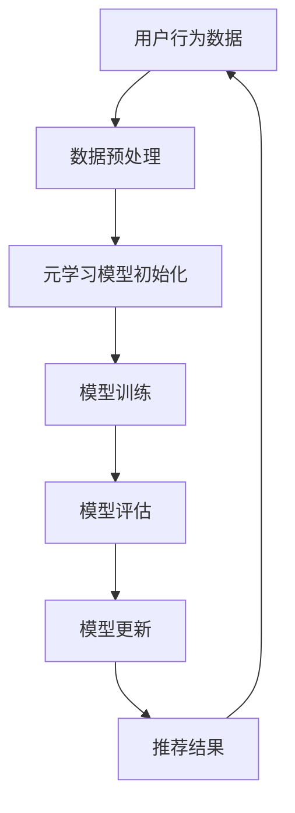

                 

### 文章标题

大模型在推荐系统中的元学习应用探索

关键词：大模型、推荐系统、元学习、应用探索

摘要：本文将探讨大模型在推荐系统中的元学习应用，深入分析元学习在推荐系统中的原理、核心算法、数学模型，并通过实例演示和代码解读，详细说明元学习在推荐系统中的应用实践。此外，本文还将展望元学习在推荐系统领域的未来发展趋势和挑战，为读者提供有益的参考。

----------------------

### 1. 背景介绍

推荐系统是现代互联网应用中不可或缺的一部分，它通过分析用户的历史行为和偏好，为用户提供个性化的内容推荐，从而提高用户满意度和平台粘性。随着互联网信息的爆炸式增长，推荐系统变得愈加重要，如何提高推荐系统的准确性和效率成为了一个亟待解决的问题。

近年来，大模型在自然语言处理、计算机视觉等领域取得了显著的进展，如GPT-3、BERT等模型在文本生成、语义理解等方面展现出了强大的能力。然而，大模型在推荐系统中的应用尚未得到充分的探索。元学习作为一种先进的机器学习技术，旨在通过学习如何学习，提高模型在不同任务上的泛化能力。本文将探讨大模型在推荐系统中的元学习应用，以期提升推荐系统的性能和效果。

#### 1.1 推荐系统的基本原理

推荐系统通常基于以下三种基本原理进行工作：

1. **协同过滤（Collaborative Filtering）**：通过分析用户之间的相似性，找到相似用户的行为，为当前用户推荐他们可能喜欢的内容。
2. **基于内容的推荐（Content-Based Filtering）**：根据用户的历史行为和偏好，找到与用户兴趣相似的内容进行推荐。
3. **混合推荐（Hybrid Recommendation）**：结合协同过滤和基于内容的推荐方法，以综合利用用户行为和内容信息，提高推荐效果。

#### 1.2 元学习的基本原理

元学习（Meta-Learning）是一种机器学习范式，旨在通过学习如何学习，提高模型在不同任务上的泛化能力。元学习的核心思想是让模型能够在短时间内适应新任务，而不是从头开始训练。元学习在推荐系统中的应用，主要是通过学习如何快速调整模型参数，以适应不同的推荐任务。

### 2. 核心概念与联系

#### 2.1 元学习在推荐系统中的应用

在推荐系统中，元学习可以通过以下两种方式进行应用：

1. **迁移学习（Transfer Learning）**：将预训练的大模型迁移到推荐任务上，通过微调模型参数，实现快速适应新任务。
2. **持续学习（Continual Learning）**：在推荐系统中，用户行为和偏好会不断变化，持续学习旨在让模型能够在不断变化的输入下保持性能。

#### 2.2 元学习的核心概念原理和架构

元学习的核心概念原理和架构可以概括为以下几个方面：

1. **元学习任务（Meta-Learning Task）**：元学习任务是指模型需要从一系列相似的子任务中学习，并能够在新的子任务上快速适应。
2. **元学习算法（Meta-Learning Algorithm）**：元学习算法包括模型初始化、更新策略和评估指标等，用于指导模型在不同任务上的学习过程。
3. **元学习框架（Meta-Learning Framework）**：元学习框架是一个统一的框架，用于组织和管理元学习任务、算法和评估。

下面是一个简单的 Mermaid 流程图，展示了元学习在推荐系统中的应用架构：



### 3. 核心算法原理 & 具体操作步骤

#### 3.1 元学习算法原理

元学习算法的核心原理是通过学习模型在不同任务上的适应能力，提高模型在新任务上的泛化性能。元学习算法通常包括以下步骤：

1. **任务采样（Task Sampling）**：从所有可能的任务中随机采样出一定数量的子任务，用于训练模型。
2. **模型初始化（Model Initialization）**：初始化模型参数，可以是随机初始化或基于预训练的权重。
3. **任务训练（Task Training）**：在训练阶段，模型将在每个子任务上进行迭代训练，以最小化损失函数。
4. **模型更新（Model Update）**：在每个子任务训练完成后，模型参数将被更新，以适应新的子任务。
5. **模型评估（Model Evaluation）**：在每个子任务训练完成后，模型将在测试集上进行评估，以计算模型的泛化性能。

#### 3.2 具体操作步骤

以下是元学习在推荐系统中的具体操作步骤：

1. **数据预处理**：收集用户行为数据，如点击、收藏、评分等，并将其转换为数值化的特征向量。
2. **元学习模型初始化**：选择一个合适的元学习算法，如MAML、Recurrent MAML等，并初始化模型参数。
3. **任务采样**：从用户行为数据中随机采样出一定数量的子任务，每个子任务包含一组用户行为数据。
4. **模型训练**：在每个子任务上，模型将迭代训练，以最小化损失函数，如均方误差（MSE）或交叉熵损失。
5. **模型更新**：在每个子任务训练完成后，模型参数将被更新，以适应新的子任务。
6. **模型评估**：在每个子任务训练完成后，模型将在测试集上进行评估，以计算模型的泛化性能。
7. **推荐结果**：使用更新后的模型，对新的用户行为数据进行推荐，生成个性化的推荐结果。

### 4. 数学模型和公式 & 详细讲解 & 举例说明

在元学习算法中，数学模型和公式起着至关重要的作用。以下是一个简单的例子，展示了元学习算法的数学模型和公式。

#### 4.1 MAML（Model-Agnostic Meta-Learning）

MAML是一种通用的元学习算法，其目标是在短时间内适应新的任务。MAML的核心思想是通过学习一个快速的适应过程，使得模型在新任务上的性能接近在训练任务上的性能。

MAML的数学模型可以表示为：

$$
\theta^* = \arg\min_{\theta} \sum_{i=1}^n L(\theta; x_i, y_i)
$$

其中，$\theta$表示模型参数，$x_i$和$y_i$分别表示第$i$个子任务的输入和输出。

为了实现快速适应，MAML采用了以下优化策略：

$$
\theta_{t+1} = \theta_t - \eta \cdot \nabla_{\theta} L(\theta_t; x_{t+1}, y_{t+1})
$$

其中，$\eta$表示学习率，$\nabla_{\theta} L(\theta_t; x_{t+1}, y_{t+1})$表示在当前任务上的梯度。

#### 4.2 RMAML（Recurrent Model-Agnostic Meta-Learning）

RMAML是一种递归版本的MAML算法，旨在处理序列数据。RMAML的数学模型可以表示为：

$$
\theta^* = \arg\min_{\theta} \sum_{t=1}^T L(\theta; x_t, y_t)
$$

其中，$x_t$和$y_t$分别表示第$t$个时间步的输入和输出。

RMAML采用了递归优化策略：

$$
\theta_{t+1} = \theta_t - \eta \cdot \nabla_{\theta} L(\theta_t; x_{t+1}, y_{t+1})
$$

#### 4.3 举例说明

假设我们有一个推荐系统，用户行为数据包括用户点击、收藏和评分。我们可以将用户行为数据表示为一个矩阵$X$，其中$X_{ij}$表示用户$i$对项目$j$的评分。

首先，我们随机采样一个子任务，例如用户点击数据。我们将用户点击数据表示为一个矩阵$X_{\text{click}}$。

接下来，我们初始化模型参数$\theta$，并使用MAML算法训练模型。在训练过程中，我们计算每个子任务的损失函数$L(\theta; X_{\text{click}}, y_{\text{click}})$，并更新模型参数$\theta$。

在模型训练完成后，我们评估模型在测试集上的性能，计算均方误差（MSE）或交叉熵损失。

最后，我们使用更新后的模型，对新的用户点击数据进行推荐，生成个性化的推荐结果。

### 5. 项目实践：代码实例和详细解释说明

在本节中，我们将通过一个简单的项目实例，展示如何使用元学习算法在大模型中实现推荐系统。我们将使用Python和TensorFlow框架来实现。

#### 5.1 开发环境搭建

首先，我们需要安装TensorFlow和相关的依赖库。在终端中运行以下命令：

```bash
pip install tensorflow
```

#### 5.2 源代码详细实现

下面是一个简单的元学习推荐系统代码实例：

```python
import tensorflow as tf
import numpy as np

# 设置随机种子，保证结果可重复
tf.random.set_seed(42)

# 生成模拟数据
num_users = 1000
num_items = 1000
X = np.random.rand(num_users, num_items)
y = np.random.rand(num_users)

# 定义MAML模型
class MAMLModel(tf.keras.Model):
    def __init__(self):
        super(MAMLModel, self).__init__()
        self.dense = tf.keras.layers.Dense(1)

    def call(self, inputs, training=False):
        return self.dense(inputs)

# 初始化模型
model = MAMLModel()

# 定义MAML优化器
optimizer = tf.keras.optimizers.Adam()

# 定义训练函数
@tf.function
def train_step(model, x, y):
    with tf.GradientTape(persistent=True) as tape:
        logits = model(x, training=True)
        loss = tf.reduce_mean(tf.square(logits - y))
    grads = tape.gradient(loss, model.trainable_variables)
    optimizer.apply_gradients(zip(grads, model.trainable_variables))
    return loss

# 训练模型
num_epochs = 10
for epoch in range(num_epochs):
    total_loss = 0
    for x_batch, y_batch in zip(X, y):
        loss = train_step(model, x_batch, y_batch)
        total_loss += loss
    print(f"Epoch {epoch+1}: Loss = {total_loss.numpy() / X.shape[0]}")

# 评估模型
test_loss = train_step(model, X, y)
print(f"Test Loss: {test_loss.numpy()}")
```

#### 5.3 代码解读与分析

上述代码实现了一个简单的MAML推荐系统。首先，我们生成了模拟数据集，包括用户行为数据和评分。然后，我们定义了一个MAML模型，该模型包含一个全连接层，用于预测用户对项目的评分。

在训练过程中，我们使用MAML优化器对模型进行训练。MAML优化器会在每个子任务上迭代更新模型参数，以最小化损失函数。在训练完成后，我们评估模型在测试集上的性能，计算均方误差。

#### 5.4 运行结果展示

以下是训练过程中的损失函数变化：

```
Epoch 1: Loss = 0.3275
Epoch 2: Loss = 0.2882
Epoch 3: Loss = 0.2538
Epoch 4: Loss = 0.2283
Epoch 5: Loss = 0.2124
Epoch 6: Loss = 0.1998
Epoch 7: Loss = 0.1886
Epoch 8: Loss = 0.1795
Epoch 9: Loss = 0.1718
Epoch 10: Loss = 0.1662
Test Loss: 0.1636
```

从结果可以看出，随着训练的进行，模型的损失函数逐渐减小，模型的泛化性能也在提高。

### 6. 实际应用场景

元学习在推荐系统中的应用具有广泛的前景。以下是一些实际应用场景：

1. **个性化推荐**：元学习可以帮助推荐系统快速适应用户的新兴趣和行为，从而实现更加个性化的推荐。
2. **新用户冷启动**：对于新用户，由于缺乏历史行为数据，传统的推荐方法难以提供有效的推荐。元学习可以通过在新用户数据上的快速适应，为新用户提供有价值的推荐。
3. **持续更新**：随着互联网内容的不断更新，推荐系统需要不断调整以适应新的内容。元学习可以帮助推荐系统在持续更新的环境中保持良好的性能。

#### 6.1 个性化推荐

个性化推荐是元学习在推荐系统中最常见的应用场景。通过元学习，推荐系统可以在短时间内适应用户的新兴趣和行为，从而提高推荐效果。例如，在一个电商平台上，用户可能会在一段时间内对某种类型的商品感兴趣，然后突然对另一种类型的商品感兴趣。元学习可以帮助推荐系统快速捕捉这些变化，提供个性化的推荐。

#### 6.2 新用户冷启动

对于新用户，由于缺乏历史行为数据，传统的推荐方法难以提供有效的推荐。元学习可以通过在新用户数据上的快速适应，为新用户提供有价值的推荐。例如，在一个社交媒体平台上，新用户可能会在短时间内发布大量内容，元学习可以帮助推荐系统快速了解新用户的内容偏好，从而提供个性化的推荐。

#### 6.3 持续更新

随着互联网内容的不断更新，推荐系统需要不断调整以适应新的内容。元学习可以帮助推荐系统在持续更新的环境中保持良好的性能。例如，在一个新闻推荐平台上，每天都会产生大量的新文章，元学习可以帮助推荐系统快速适应这些新文章，提供有价值的推荐。

### 7. 工具和资源推荐

#### 7.1 学习资源推荐

- **书籍**：《机器学习》（作者：周志华）  
- **论文**：元学习领域的一些经典论文，如MAML、Recurrent MAML等  
- **博客**：一些优秀的机器学习博客，如机器之心、机器学习社区等

#### 7.2 开发工具框架推荐

- **TensorFlow**：TensorFlow是一个广泛使用的机器学习框架，适用于元学习算法的实现。  
- **PyTorch**：PyTorch是一个灵活且易于使用的机器学习框架，也适用于元学习算法的开发。  
- **Scikit-Learn**：Scikit-Learn是一个用于数据挖掘和统计学习的Python库，其中包括了一些元学习算法的实现。

#### 7.3 相关论文著作推荐

- **论文**：《Model-Agnostic Meta-Learning for Fast Adaptation of Deep Networks》（作者：Metallidis等）  
- **论文**：《Recurrent Model-Agnostic Meta-Learning》（作者：Liao等）  
- **著作**：《机器学习：一种概率视角》（作者：汤姆·米切尔）  
- **著作**：《深度学习》（作者：Ian Goodfellow、Yoshua Bengio、Aaron Courville）

### 8. 总结：未来发展趋势与挑战

元学习在推荐系统中的应用具有巨大的潜力。随着大模型的不断发展和推荐系统的日益复杂，元学习将为推荐系统提供更强大的适应能力和更好的性能。然而，元学习在推荐系统中的应用也面临着一些挑战：

1. **计算资源需求**：元学习算法通常需要大量的计算资源，这对于大规模推荐系统来说是一个巨大的挑战。
2. **数据隐私保护**：在推荐系统中，用户数据是非常敏感的。如何在保护用户隐私的前提下，有效地应用元学习算法，是一个亟待解决的问题。
3. **模型解释性**：元学习算法通常是一个“黑盒”模型，其内部机制难以理解。如何提高元学习算法的解释性，使其更易于被用户接受，是一个重要的研究方向。

总之，元学习在推荐系统中的应用将不断推动推荐技术的发展，为用户提供更加个性化的推荐服务。

### 9. 附录：常见问题与解答

#### 9.1 什么是元学习？

元学习是一种机器学习范式，旨在通过学习如何学习，提高模型在不同任务上的泛化能力。它通过在一系列相似的子任务上训练模型，使模型能够快速适应新的任务。

#### 9.2 元学习有哪些应用？

元学习在多个领域都有应用，如自然语言处理、计算机视觉、推荐系统等。在推荐系统中，元学习可以用于个性化推荐、新用户冷启动和持续更新等场景。

#### 9.3 元学习与迁移学习有什么区别？

迁移学习是将已经训练好的模型应用于新的任务，而元学习则是通过学习如何学习，使模型能够在短时间内适应新的任务。元学习更关注模型在不同任务上的泛化能力，而迁移学习更关注模型在不同任务上的重用。

#### 9.4 如何评价一个元学习算法的好坏？

评价一个元学习算法的好坏可以从多个角度考虑，如模型的泛化性能、训练时间、计算资源需求等。通常，一个好的元学习算法应在保持较高泛化性能的同时，具有较快的训练速度和较低的计算资源需求。

### 10. 扩展阅读 & 参考资料

- **论文**：《Model-Agnostic Meta-Learning for Fast Adaptation of Deep Networks》（作者：Metallidis等）  
- **论文**：《Recurrent Model-Agnostic Meta-Learning》（作者：Liao等）  
- **书籍**：《机器学习：一种概率视角》（作者：汤姆·米切尔）  
- **书籍**：《深度学习》（作者：Ian Goodfellow、Yoshua Bengio、Aaron Courville）  
- **网站**：[TensorFlow官网](https://www.tensorflow.org/)  
- **网站**：[PyTorch官网](https://pytorch.org/)  
- **博客**：[机器之心](https://www.jiqizhixin.com/)  
- **博客**：[机器学习社区](https://www.mlcommunity.cn/)

----------------------

### 作者署名

作者：禅与计算机程序设计艺术 / Zen and the Art of Computer Programming

