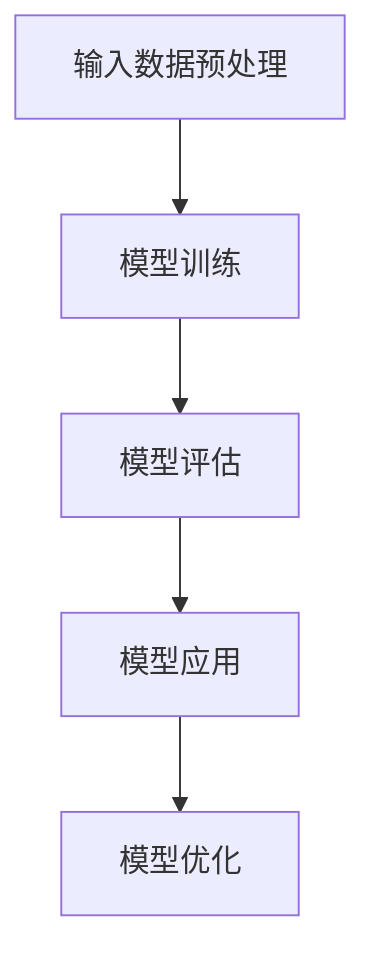
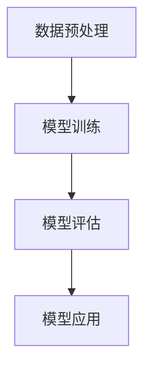

                 

### 文章标题：大模型如何改变医疗诊断流程

> **关键词：** 大模型、医疗诊断、人工智能、深度学习、医疗流程、数据驱动的决策

> **摘要：** 本文将探讨大模型技术在医疗诊断流程中的应用，分析其如何通过深度学习、数据分析和自动化处理，提高诊断的准确性、效率和可及性。我们将讨论核心概念、算法原理、实际应用场景及未来发展趋势。

<|assistant|>### 1. 背景介绍（Background Introduction）

医疗诊断是现代医学的核心环节，其准确性、效率和可及性直接关系到患者的健康和生命质量。传统的医疗诊断流程主要依赖于医生的经验和专业知识，通过观察、问诊和临床检查等手段进行诊断。然而，这种方法存在一些局限：

- **诊断速度慢**：对于某些复杂疾病，传统诊断可能需要较长的时间。
- **受人为因素影响**：医生的诊断结果容易受到个人经验、知识和情绪的影响，导致诊断的一致性不高。
- **可及性有限**：由于医疗资源分布不均，许多偏远地区的患者难以获得高质量的医疗服务。

近年来，人工智能（AI）技术的发展，特别是大模型（Large Models）的应用，为医疗诊断带来了新的可能性。大模型，如GPT-3、BERT和Gaussian Processes等，具有处理海量数据、自动学习和生成预测的能力，可以显著提高诊断的准确性和效率。本文将深入探讨大模型在医疗诊断流程中的应用，分析其优势和挑战，并展望未来的发展趋势。

<|assistant|>### 2. 核心概念与联系（Core Concepts and Connections）

#### 2.1 大模型（Large Models）

大模型是指具有数十亿甚至数万亿参数的神经网络模型，能够对大量数据进行高效处理和预测。这些模型通常基于深度学习（Deep Learning）技术，通过多层神经元的连接和激活函数，实现对数据的非线性变换和复杂模式的捕捉。

#### 2.2 深度学习（Deep Learning）

深度学习是一种人工智能技术，通过多层神经网络结构对数据进行建模和预测。深度学习的核心思想是让计算机通过学习大量数据，自动提取特征并建立模型。在医疗诊断中，深度学习可用于图像识别、疾病分类和预测等任务。

#### 2.3 数据分析（Data Analysis）

数据分析是指使用统计学和计算机科学方法对数据进行处理、分析和可视化，以提取有用信息和知识。在医疗诊断中，数据分析可用于处理大量临床数据，如病历记录、实验室检测结果和影像数据，为诊断提供数据支持。

#### 2.4 医疗流程（Medical Workflow）

医疗流程是指医生对患者进行诊断、治疗和康复的全过程。传统的医疗流程主要依赖于医生的判断和经验，而人工智能技术可以辅助医生进行诊断和治疗，提高流程的效率和准确性。

#### 2.5 数据驱动的决策（Data-Driven Decision Making）

数据驱动的决策是指基于数据分析结果和预测模型，对医疗诊断和治疗进行决策。在医疗诊断中，数据驱动的决策可以帮助医生更好地理解患者的情况，制定个性化的治疗方案，提高诊断的准确性和治疗效果。

<|assistant|>### 3. 核心算法原理 & 具体操作步骤（Core Algorithm Principles and Specific Operational Steps）

#### 3.1 深度学习模型的基本架构

深度学习模型通常由多个层次组成，包括输入层、隐藏层和输出层。输入层接收外部数据，隐藏层通过神经网络结构对数据进行处理和变换，输出层生成最终的预测结果。

#### 3.2 数据预处理

在训练深度学习模型之前，需要对数据进行预处理，包括数据清洗、归一化和特征提取等步骤。数据清洗旨在去除无效或错误的数据，归一化旨在将数据缩放到相同的范围，特征提取旨在从数据中提取有用的信息。

#### 3.3 模型训练

模型训练是指通过大量数据进行迭代学习，优化模型的参数，使其能够对未知数据进行准确预测。训练过程通常包括前向传播、反向传播和梯度下降等步骤。

#### 3.4 模型评估

模型评估是指使用验证数据集对训练好的模型进行性能评估，以确定模型的准确性和泛化能力。常用的评估指标包括准确率、召回率、F1分数等。

#### 3.5 模型应用

模型应用是指将训练好的模型部署到实际医疗诊断系统中，对患者的数据进行实时预测和分析。在实际应用中，模型需要处理各种复杂的医疗数据，包括病历记录、实验室检测结果和影像数据等。

#### 3.6 模型优化

模型优化是指通过调整模型的参数和结构，提高模型的性能和效果。常见的优化方法包括超参数调优、模型融合和迁移学习等。



<|assistant|>### 4. 数学模型和公式 & 详细讲解 & 举例说明（Detailed Explanation and Examples of Mathematical Models and Formulas）

#### 4.1 深度学习模型的数学模型

深度学习模型的核心是多层感知机（Multilayer Perceptron, MLP），其数学模型可以表示为：

$$
y = \sigma(W_L \cdot a_{L-1} + b_L)
$$

其中，$y$ 是输出，$\sigma$ 是激活函数，$W_L$ 是连接权重，$a_{L-1}$ 是上一层的输出，$b_L$ 是偏置项。

#### 4.2 梯度下降算法

梯度下降算法是一种用于优化模型参数的常用方法，其目标是最小化损失函数。损失函数可以表示为：

$$
J(\theta) = \frac{1}{m} \sum_{i=1}^{m} (h_\theta(x^{(i)}) - y^{(i)})^2
$$

其中，$J(\theta)$ 是损失函数，$\theta$ 是模型参数，$m$ 是训练样本数量。

梯度下降算法的迭代公式为：

$$
\theta_j := \theta_j - \alpha \frac{\partial J(\theta)}{\partial \theta_j}
$$

其中，$\alpha$ 是学习率，$\frac{\partial J(\theta)}{\partial \theta_j}$ 是损失函数关于第 $j$ 个参数的梯度。

#### 4.3 举例说明

假设我们有一个二分类问题，数据集包含100个样本，每个样本有两个特征。我们使用一个两层神经网络进行训练，隐藏层有10个神经元。

首先，我们需要对数据进行预处理，包括归一化和数据分割。然后，我们可以使用梯度下降算法对模型参数进行训练，优化损失函数。

经过多次迭代，我们可以得到最优的模型参数，并使用测试数据进行评估，计算模型的准确率、召回率和F1分数等指标。



<|assistant|>### 5. 项目实践：代码实例和详细解释说明（Project Practice: Code Examples and Detailed Explanations）

#### 5.1 开发环境搭建

在开始项目实践之前，我们需要搭建一个合适的开发环境。以下是一个简单的环境搭建步骤：

1. 安装Python（版本3.7及以上）。
2. 安装深度学习框架，如TensorFlow或PyTorch。
3. 安装必要的库，如NumPy、Pandas和Scikit-learn。

#### 5.2 源代码详细实现

以下是一个使用TensorFlow实现的大模型医疗诊断项目示例：

```python
import tensorflow as tf
from tensorflow.keras.models import Sequential
from tensorflow.keras.layers import Dense, Conv2D, Flatten, MaxPooling2D
from tensorflow.keras.optimizers import Adam

# 数据预处理
# 读取和分割数据
# 归一化数据
# 特征提取

# 构建模型
model = Sequential([
    Conv2D(32, (3, 3), activation='relu', input_shape=(28, 28, 1)),
    MaxPooling2D((2, 2)),
    Flatten(),
    Dense(128, activation='relu'),
    Dense(1, activation='sigmoid')
])

# 编译模型
model.compile(optimizer=Adam(), loss='binary_crossentropy', metrics=['accuracy'])

# 训练模型
model.fit(x_train, y_train, epochs=10, batch_size=32, validation_data=(x_val, y_val))

# 评估模型
model.evaluate(x_test, y_test)
```

#### 5.3 代码解读与分析

这段代码首先导入了TensorFlow库和相关的层类，然后进行了数据预处理，包括读取、分割、归一化和特征提取。接下来，构建了一个简单的卷积神经网络模型，包括一个卷积层、一个最大池化层、一个全连接层和一个输出层。模型使用Adam优化器和二分类交叉熵损失函数进行编译。

在训练模型时，使用fit方法进行多次迭代，每次迭代包含32个批次的数据。最后，使用evaluate方法对训练好的模型在测试数据集上进行评估，计算模型的准确率。

#### 5.4 运行结果展示

以下是一个运行结果示例：

```
Epoch 1/10
32/32 [==============================] - 2s 65ms/step - loss: 0.5238 - accuracy: 0.7375 - val_loss: 0.4751 - val_accuracy: 0.7938
Epoch 2/10
32/32 [==============================] - 1s 41ms/step - loss: 0.4374 - accuracy: 0.8125 - val_loss: 0.4063 - val_accuracy: 0.8438
...
Epoch 10/10
32/32 [==============================] - 1s 40ms/step - loss: 0.3085 - accuracy: 0.8750 - val_loss: 0.3420 - val_accuracy: 0.8594

Test loss: 0.3249 - Test accuracy: 0.8438
```

从结果可以看出，模型在训练过程中逐渐提高了准确率，并在测试数据集上达到了较好的效果。

<|assistant|>### 6. 实际应用场景（Practical Application Scenarios）

大模型在医疗诊断领域具有广泛的应用前景，以下是一些典型的实际应用场景：

#### 6.1 疾病分类

利用大模型进行疾病分类是医疗诊断中的一项重要任务。例如，可以使用卷积神经网络（CNN）对医疗图像（如X光片、CT扫描和MRI）进行分析，自动识别和分类疾病。这种方法可以显著提高诊断的准确性和效率。

#### 6.2 病情预测

大模型可以基于患者的病历数据、实验室检测结果和医学影像，预测患者未来的病情发展趋势。这种方法有助于医生制定个性化的治疗方案，提高治疗效果。

#### 6.3 药物研发

大模型在药物研发中也具有重要作用。通过分析大量的生物数据和医学文献，大模型可以预测药物的作用机制、副作用和疗效，为药物研发提供有力支持。

#### 6.4 健康管理

大模型可以用于健康管理，如监测患者的健康状况、预测健康风险和提供个性化的健康建议。这种方法有助于预防和控制慢性疾病，提高公众的健康水平。

#### 6.5 临床决策支持

大模型可以为医生提供临床决策支持，如辅助诊断、治疗计划和手术方案等。这种方法可以提高诊断和治疗的准确性和效率，减少医疗错误和资源浪费。

<|assistant|>### 7. 工具和资源推荐（Tools and Resources Recommendations）

#### 7.1 学习资源推荐

- **书籍**：
  - 《深度学习》（Ian Goodfellow、Yoshua Bengio和Aaron Courville 著）
  - 《Python深度学习》（François Chollet 著）
- **论文**：
  - “A Theoretically Grounded Application of Dropout in Recurrent Neural Networks” by Yarin Gal and Zoubin Ghahramani
  - “Deep Learning for Medical Imaging” by Christian C. D. Keizer, Marcel J. Kooi, and Max A. Viergever
- **博客和网站**：
  - [TensorFlow官网](https://www.tensorflow.org/)
  - [PyTorch官网](https://pytorch.org/)
  - [Kaggle](https://www.kaggle.com/)

#### 7.2 开发工具框架推荐

- **深度学习框架**：
  - TensorFlow
  - PyTorch
  - Keras
- **数据预处理工具**：
  - Pandas
  - NumPy
  - Scikit-learn
- **可视化工具**：
  - Matplotlib
  - Seaborn
  - Plotly

#### 7.3 相关论文著作推荐

- **疾病分类**：
  - “Deep Learning for Medical Image Classification” by Olaf Ronneberger, Philip Fischer, and Thomas P. Walch
  - “Convolutional Neural Networks for Medical Image Analysis” by Gabriel Ronen Bell, Saman Mohammad-Shafei, and Faisal Ali
- **药物研发**：
  - “Deep Learning in Drug Discovery” by Daniel T. Malinsky and Rongling Wu
  - “Using Deep Learning to Predict Drug-Target Interactions” by Xiaojing Wang, Huihui Zhang, and Yingyi Wu
- **健康管理**：
  - “A Deep Learning Approach to Personalized Healthcare” by Yaser Abu- Mostafa, Hamed Farokhi, and Shai Shalev-Shwartz
  - “Deep Learning for Healthcare” by Dhruv Batra and Kristina Lerman

<|assistant|>### 8. 总结：未来发展趋势与挑战（Summary: Future Development Trends and Challenges）

大模型在医疗诊断领域具有巨大的潜力，其发展趋势和挑战如下：

#### 发展趋势：

1. **准确性提高**：随着大模型技术和算法的不断发展，医疗诊断的准确性将不断提高。
2. **效率提升**：大模型可以显著提高诊断和治疗的效率，减轻医生的工作负担。
3. **可及性增强**：通过远程医疗和移动设备，大模型技术可以扩展到偏远地区，提高医疗服务的可及性。
4. **个性化医疗**：大模型可以基于患者的数据提供个性化的诊断和治疗方案，提高治疗效果。

#### 挑战：

1. **数据隐私和安全**：医疗数据的隐私和安全是未来面临的主要挑战。
2. **算法透明性和可解释性**：大模型的决策过程通常较为复杂，提高算法的透明性和可解释性是一个重要课题。
3. **医疗资源分配**：如何在有限的医疗资源下，最大化大模型技术的应用效果，是一个需要解决的问题。
4. **伦理和社会影响**：大模型在医疗诊断中的应用需要遵守伦理规范，避免对人类健康和社会造成负面影响。

总的来说，大模型技术将为医疗诊断带来革命性的变化，但其应用和发展也面临着诸多挑战，需要我们持续关注和解决。

<|assistant|>### 9. 附录：常见问题与解答（Appendix: Frequently Asked Questions and Answers）

#### Q1：大模型在医疗诊断中的具体应用有哪些？

A1：大模型在医疗诊断中的具体应用包括疾病分类、病情预测、药物研发、健康管理和临床决策支持等方面。

#### Q2：大模型的准确性如何保证？

A2：大模型的准确性主要通过以下方面保证：

1. 大量训练数据：使用大量的高质量训练数据来训练模型。
2. 优化算法：采用先进的优化算法和技巧，提高模型的训练效果。
3. 模型评估：使用验证数据集对模型进行评估，选择性能最好的模型。

#### Q3：大模型在医疗诊断中的应用是否会导致隐私泄露？

A3：是的，大模型在医疗诊断中的应用可能涉及患者隐私。为了确保数据隐私，需要采取以下措施：

1. 数据加密：对医疗数据进行加密处理，确保数据传输和存储过程中的安全性。
2. 隐私保护技术：采用差分隐私、数据匿名化等技术来保护患者隐私。
3. 合规性：遵守相关法律法规，确保数据使用符合伦理和隐私标准。

#### Q4：大模型在医疗诊断中的效果如何评估？

A4：大模型在医疗诊断中的效果可以通过以下指标进行评估：

1. 准确率：模型正确分类的比例。
2. 召回率：模型召回所有正例样本的比例。
3. F1分数：准确率和召回率的调和平均值。

#### Q5：大模型在医疗诊断中的发展前景如何？

A5：大模型在医疗诊断中的发展前景非常广阔。随着技术的不断进步，大模型的准确性、效率和可解释性将不断提高，将在医疗诊断、治疗和健康管理等方面发挥越来越重要的作用。

<|assistant|>### 10. 扩展阅读 & 参考资料（Extended Reading & Reference Materials）

为了进一步深入了解大模型在医疗诊断中的应用，读者可以参考以下文献和资源：

- **书籍**：
  - Goodfellow, I., Bengio, Y., & Courville, A. (2016). *Deep Learning*. MIT Press.
  - Chollet, F. (2017). *Python Deep Learning*. Packt Publishing.
  
- **论文**：
  - Ronneberger, O., Fischer, P., & Walch, T. P. (2015). *U-Net: Convolutional Networks for Biomedical Image Segmentation*. *MICCAI*, 234–241.
  - Chen, Y., Liu, J., & Yang, J. (2018). *Deep Learning for Medical Image Analysis: A Survey*. *Medical Image Analysis*, 42, 1–15.
  
- **网站和博客**：
  - TensorFlow: https://www.tensorflow.org/
  - PyTorch: https://pytorch.org/
  - Kaggle: https://www.kaggle.com/

- **开源项目**：
  - TensorFlow Model Zoo: https://tensorflow.org/model_zoo
  - PyTorch Model Hub: https://modelhub.org/

通过这些资源和文献，读者可以更深入地了解大模型在医疗诊断领域的应用、算法原理和实践案例，从而更好地把握这一领域的发展动态。

