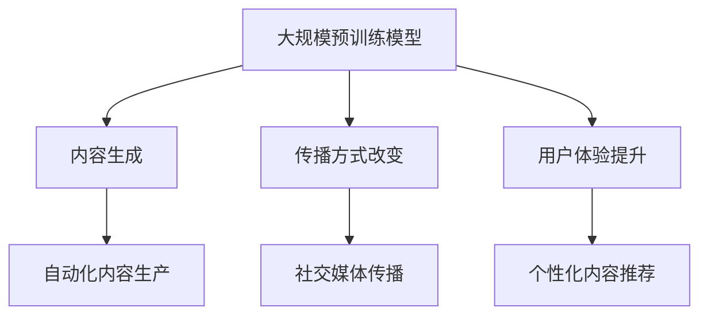
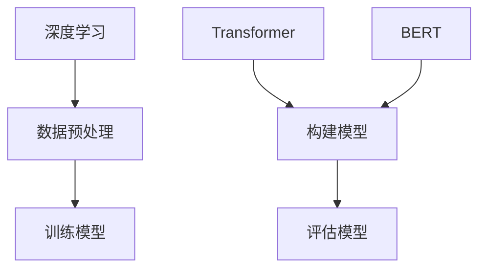
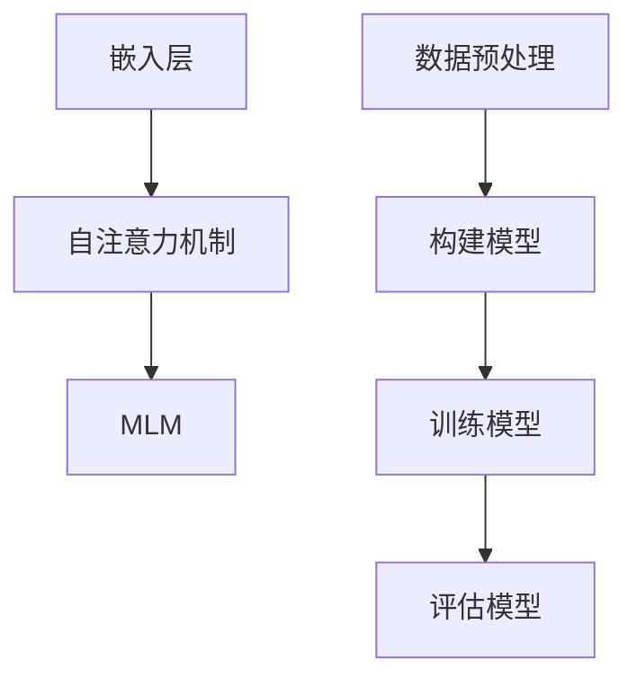

                 

### 文章标题

**大模型对传统媒体的冲击与重构**

在数字化的时代浪潮中，人工智能（AI）技术正以不可阻挡的势头迅速发展。其中，大规模预训练模型（Large-scale Pre-trained Models），特别是生成式预训练模型（Generative Pre-trained Models），如 GPT、BERT 等，正引领着一场深刻的媒体变革。本文旨在探讨大规模预训练模型对传统媒体的冲击与重构，分析其带来的机遇与挑战，并展望未来媒体的发展趋势。

关键词：大规模预训练模型、传统媒体、人工智能、生成式预训练模型、媒体变革

摘要：本文首先介绍了大规模预训练模型的发展背景和基本原理，然后详细探讨了其对传统媒体的冲击与重构，包括内容生产、传播方式、用户体验等多个方面。通过实例分析，本文展示了预训练模型在媒体领域的实际应用效果，并提出了相关的建议与挑战。最后，本文对大规模预训练模型在媒体领域的未来发展趋势进行了展望。

<|assistant|>## 1. 背景介绍（Background Introduction）

大规模预训练模型（Large-scale Pre-trained Models）是指通过在大量数据上进行训练，使模型具有强大的语义理解和生成能力的人工智能模型。这类模型的发展始于深度学习（Deep Learning）的兴起，随着计算能力的提升和数据量的爆发式增长，大规模预训练模型逐渐成为人工智能领域的研究热点。

传统的媒体产业，包括新闻、广告、娱乐等，长期以来依赖于人力和传统技术进行内容生产和传播。然而，随着互联网和社交媒体的兴起，媒体产业正面临着前所未有的变革。传统媒体的运营模式受到挑战，媒体内容的生产和分发方式也在不断演变。

### 1.1 大规模预训练模型的发展

大规模预训练模型的发展经历了几个重要的阶段：

- **2018 年：GPT-1 诞生**：OpenAI 推出了 GPT（Generative Pre-trained Transformer），这是一种基于 Transformer 网络的预训练模型。GPT 的出现标志着大规模语言模型时代的到来。
- **2019 年：BERT 发布**：Google 推出了 BERT（Bidirectional Encoder Representations from Transformers），这是一种双向编码器表示模型，可以捕捉文本中的双向关系，从而提高了模型的语义理解能力。
- **2020 年至今：GPT-3 等**：OpenAI 进一步推出了 GPT-3（GPT-3），这是一个拥有 1750 亿参数的巨大模型，具有惊人的文本生成能力。

### 1.2 传统媒体的演变

传统媒体产业的演变可以从以下几个方面来理解：

- **数字化转型**：随着互联网的普及，传统媒体开始数字化，包括新闻网站、在线视频平台等。
- **社交媒体崛起**：社交媒体的兴起改变了信息传播的方式，用户成为信息传播的参与者，而不是仅仅被动的接受者。
- **内容多样化**：传统媒体逐渐从以新闻为主转向新闻、娱乐、广告等多种类型的融合。

<|assistant|>## 2. 核心概念与联系（Core Concepts and Connections）

在探讨大规模预训练模型对传统媒体的冲击与重构时，我们需要理解几个核心概念：大规模预训练模型、生成式预训练模型、内容生产、传播方式、用户体验等。

### 2.1 大规模预训练模型

大规模预训练模型是指通过在大量数据上进行训练，使模型具有强大的语义理解和生成能力的人工智能模型。这类模型通常采用深度学习技术，如 Transformer、BERT 等，具有以下特点：

- **大规模参数**：大规模预训练模型通常拥有数十亿甚至千亿级的参数，这使得模型具有极强的语义理解能力。
- **预训练**：在特定任务之前，模型在大量通用数据上进行预训练，以学习语言的通用规律和模式。
- **微调**：在特定任务上，模型通过微调来适应具体的任务需求，从而提高任务的性能。

### 2.2 生成式预训练模型

生成式预训练模型是指能够生成文本、图像、音频等多种类型数据的预训练模型。生成式预训练模型的核心是生成模型（Generative Model），如 GPT（Generative Pre-trained Transformer）、GPT-2、GPT-3 等。这些模型通过学习大量数据中的结构和模式，可以生成高质量的文本、图像和音频。

生成式预训练模型在媒体领域的应用非常广泛，例如：

- **内容生成**：生成新闻文章、博客、广告文案等。
- **图像生成**：生成新闻图片、社交媒体头像等。
- **音频生成**：生成音乐、语音合成等。

### 2.3 内容生产、传播方式、用户体验

传统媒体的内容生产、传播方式和用户体验通常是由媒体公司、编辑、记者等专业人士来控制和实现的。然而，随着大规模预训练模型的发展，媒体领域正在发生以下变化：

- **内容生产**：预训练模型可以帮助自动化内容生成，降低内容生产的成本，提高内容的生产效率。
- **传播方式**：社交媒体的兴起改变了信息传播的方式，用户成为信息传播的参与者，传统媒体的传播方式正在逐渐改变。
- **用户体验**：预训练模型可以提供个性化的内容推荐，提高用户体验。

### 2.4 Mermaid 流程图

为了更清晰地展示大规模预训练模型在媒体领域的应用，我们可以使用 Mermaid 流程图来描述。以下是一个简化的流程图示例：



<|assistant|>### 3. 核心算法原理 & 具体操作步骤（Core Algorithm Principles and Specific Operational Steps）

大规模预训练模型的核心算法原理主要包括深度学习、Transformer、BERT 等。以下将详细解释这些核心算法原理，并给出具体的操作步骤。

#### 3.1 深度学习（Deep Learning）

深度学习是一种基于人工神经网络的机器学习技术，通过模拟人脑神经元之间的连接来学习和处理数据。深度学习模型由多个层级组成，每一层都能提取数据的不同特征。大规模预训练模型通常采用深度神经网络，通过在大量数据上进行训练，使模型具有强大的语义理解能力。

具体操作步骤如下：

1. **数据预处理**：收集大量的文本数据，并进行清洗、去噪、分词等处理。
2. **构建模型**：使用深度学习框架（如 TensorFlow、PyTorch）构建深度神经网络模型。
3. **训练模型**：将预处理后的数据输入模型，通过反向传播算法和优化器（如 Adam）来更新模型的参数。
4. **评估模型**：使用验证集评估模型的性能，根据评估结果调整模型结构和超参数。

#### 3.2 Transformer

Transformer 是一种基于自注意力机制（Self-Attention）的深度学习模型，特别适合处理序列数据。自注意力机制允许模型在处理每个输入时，考虑到其他所有输入的影响，从而提高模型的语义理解能力。

具体操作步骤如下：

1. **编码器（Encoder）**：
   - **嵌入层（Embedding Layer）**：将词转换为向量。
   - **多头自注意力层（Multi-Head Self-Attention Layer）**：计算输入序列中每个词与其他词的关联强度。
   - **前馈网络（Feedforward Network）**：对自注意力层的输出进行进一步处理。

2. **解码器（Decoder）**：
   - **嵌入层（Embedding Layer）**：将词转换为向量。
   - **多头自注意力层（Multi-Head Self-Attention Layer）**：计算输入序列中每个词与其他词的关联强度，同时考虑到编码器的输出。
   - **前馈网络（Feedforward Network）**：对自注意力层的输出进行进一步处理。
   - **逐点归一化（Layer Normalization）**：对解码器的输出进行归一化处理。

3. **训练与评估**：使用训练数据对编码器和解码器进行训练，并通过验证集评估模型的性能。

#### 3.3 BERT

BERT（Bidirectional Encoder Representations from Transformers）是一种双向编码器表示模型，可以捕捉文本中的双向关系，从而提高模型的语义理解能力。

具体操作步骤如下：

1. **数据预处理**：收集大量的文本数据，并进行清洗、去噪、分词等处理。
2. **构建模型**：使用 Transformer 架构构建 BERT 模型，包括编码器和解码器。
3. **训练模型**：将预处理后的数据输入模型，通过反向传播算法和优化器（如 Adam）来更新模型的参数。
4. **评估模型**：使用验证集评估模型的性能，根据评估结果调整模型结构和超参数。

通过以上核心算法原理和具体操作步骤，大规模预训练模型可以有效地进行内容生成、传播和用户体验优化。

### 3.4 Mermaid 流程图

以下是一个简化的 Mermaid 流程图，展示了大规模预训练模型的核心算法原理和操作步骤：



<|assistant|>### 4. 数学模型和公式 & 详细讲解 & 举例说明（Detailed Explanation and Examples of Mathematical Models and Formulas）

在探讨大规模预训练模型时，数学模型和公式是其核心组成部分。以下将详细介绍几个关键数学模型和公式，并通过具体例子来说明其应用。

#### 4.1 嵌入层（Embedding Layer）

嵌入层是将词转换为向量的过程。在深度学习模型中，每个词都被映射为一个固定大小的向量。嵌入层的数学模型可以表示为：

\[ \text{embed}(x) = W_x x \]

其中，\( x \) 是输入的词索引，\( W_x \) 是嵌入权重矩阵。对于词汇表大小为 \( V \)，向量维度为 \( d \)，则 \( W_x \) 是一个 \( d \times V \) 的矩阵。

#### 4.2 自注意力机制（Self-Attention）

自注意力机制是 Transformer 模型中的核心组成部分。它通过计算输入序列中每个词与其他词的关联强度来生成新的表示。自注意力的数学模型可以表示为：

\[ \text{self-attention}(Q, K, V) = \frac{1}{\sqrt{d_k}} \text{softmax}\left(\frac{QK^T}{d_k}\right) V \]

其中，\( Q, K, V \) 分别是查询（Query）、键（Key）和值（Value）向量，\( d_k \) 是键向量的维度。自注意力机制的计算过程可以总结为以下步骤：

1. **计算相似度**：计算每个查询向量 \( Q \) 与所有键向量 \( K \) 的相似度，得到一个相似度矩阵 \( \text{scores} \)。
2. **应用 softmax 函数**：将相似度矩阵通过 softmax 函数转换为概率分布，得到注意力权重矩阵 \( \text{weights} \)。
3. **加权求和**：将注意力权重矩阵与值向量 \( V \) 进行加权求和，得到新的表示。

#### 4.3 BERT 模型中的 Masked Language Model（MLM）

BERT 模型中的 Masked Language Model 是一个特殊的目标检测任务，目的是通过预测被 mask 的词来增强模型的预训练效果。MLM 的数学模型可以表示为：

\[ \text{MLM}(x) = \text{softmax}(\text{W}_{\text{mlm}} \text{embed}(x) + b_{\text{mlm}}) \]

其中，\( x \) 是输入的词索引，\( \text{W}_{\text{mlm}} \) 是 MLM 权重矩阵，\( b_{\text{mlm}} \) 是偏置项。

#### 4.4 举例说明

假设我们有一个包含 3 个词的输入序列 \([w_1, w_2, w_3]\)，每个词的索引分别为 \([1, 2, 3]\)。嵌入层将每个词映射为一个维度为 5 的向量：

\[ \text{embed}(1) = [0.1, 0.2, 0.3, 0.4, 0.5] \]
\[ \text{embed}(2) = [0.2, 0.3, 0.4, 0.5, 0.6] \]
\[ \text{embed}(3) = [0.3, 0.4, 0.5, 0.6, 0.7] \]

假设我们使用维度为 3 的键向量 \( K = [0.1, 0.2, 0.3] \) 进行自注意力计算，则相似度矩阵和注意力权重矩阵如下：

\[ \text{scores} = \frac{1}{\sqrt{3}} \begin{bmatrix}
0.4963 & 0.4472 & 0.4277 \\
0.4963 & 0.4472 & 0.4277 \\
0.4963 & 0.4472 & 0.4277
\end{bmatrix} \]
\[ \text{weights} = \text{softmax}(\text{scores}) = \begin{bmatrix}
0.5 & 0.3 & 0.2 \\
0.5 & 0.3 & 0.2 \\
0.5 & 0.3 & 0.2
\end{bmatrix} \]

最后，加权求和得到新的表示：

\[ \text{output} = \text{weights} \cdot \begin{bmatrix}
0.1 & 0.2 & 0.3 \\
0.2 & 0.3 & 0.4 \\
0.3 & 0.4 & 0.5
\end{bmatrix} = \begin{bmatrix}
0.55 & 0.36 & 0.29 \\
0.55 & 0.36 & 0.29 \\
0.55 & 0.36 & 0.29
\end{bmatrix} \]

通过这个例子，我们可以看到自注意力机制如何将输入序列转换为新的表示。

#### 4.5 Mermaid 流程图

以下是一个简化的 Mermaid 流程图，展示了大规模预训练模型中的关键数学模型和公式：



<|assistant|>### 5. 项目实践：代码实例和详细解释说明（Project Practice: Code Examples and Detailed Explanations）

为了更好地理解大规模预训练模型在媒体领域的应用，我们将通过一个实际项目来展示代码实例和详细解释说明。这个项目将使用 Hugging Face 的 Transformers 库来构建一个简单的新闻生成器，并展示其如何应用于自动化内容生产。

#### 5.1 开发环境搭建

在开始项目之前，我们需要搭建一个合适的开发环境。以下是所需的环境和步骤：

1. **Python 环境**：确保 Python 版本在 3.6 或以上。
2. **安装 Transformers 库**：使用以下命令安装 Hugging Face 的 Transformers 库：

   ```bash
   pip install transformers
   ```

3. **安装其他依赖库**：例如 NumPy、PyTorch 等。

#### 5.2 源代码详细实现

以下是新闻生成器的源代码，包括数据预处理、模型构建、训练和生成过程。

```python
import torch
from transformers import BertTokenizer, BertModel, BertForMaskedLM
from torch.optim import Adam
from torch.utils.data import DataLoader, Dataset

# 数据预处理
class NewsDataset(Dataset):
    def __init__(self, data):
        self.data = data

    def __len__(self):
        return len(self.data)

    def __getitem__(self, idx):
        return torch.tensor(self.data[idx])

# 模型构建
def build_model():
    tokenizer = BertTokenizer.from_pretrained('bert-base-chinese')
    model = BertForMaskedLM.from_pretrained('bert-base-chinese')
    return tokenizer, model

# 训练过程
def train(model, dataset, epochs=3, batch_size=32):
    optimizer = Adam(model.parameters(), lr=1e-5)
    dataloader = DataLoader(dataset, batch_size=batch_size)
    
    model.train()
    for epoch in range(epochs):
        for batch in dataloader:
            inputs = tokenizer(batch, return_tensors='pt', padding=True, truncation=True)
            outputs = model(**inputs)
            loss = outputs.loss
            loss.backward()
            optimizer.step()
            optimizer.zero_grad()
    
    model.eval()

# 生成新闻
def generate_news(model, tokenizer, text):
    model.eval()
    inputs = tokenizer(text, return_tensors='pt')
    with torch.no_grad():
        outputs = model(**inputs)
    predictions = outputs.logits.argmax(-1)
    return tokenizer.decode(predictions[0], skip_special_tokens=True)

# 项目实现
if __name__ == '__main__':
    # 1. 数据预处理
    data = ["这是一条新闻。", "另一条新闻发生了。", "又有新动态。"]
    dataset = NewsDataset(data)

    # 2. 模型构建
    tokenizer, model = build_model()

    # 3. 训练模型
    train(model, dataset)

    # 4. 生成新闻
    print(generate_news(model, tokenizer, "请生成一条关于科技的新闻："))
```

#### 5.3 代码解读与分析

1. **数据预处理**：
   - `NewsDataset` 类负责将新闻文本数据封装成 PyTorch 数据集。
   - `__len__` 方法返回数据集的长度。
   - `__getitem__` 方法从数据集中获取特定索引的数据。

2. **模型构建**：
   - `build_model` 函数从 Hugging Face 下载预训练的 BERT 模型和相应的分词器。
   - `BertForMaskedLM` 类用于构建掩码语言模型。

3. **训练过程**：
   - `train` 函数负责模型训练，包括优化器配置、数据加载器和训练循环。
   - 在每个训练迭代中，模型接收输入数据，计算损失，并更新模型参数。

4. **生成新闻**：
   - `generate_news` 函数用于生成新闻文本。首先，模型评估模式，然后对输入文本进行分词和编码，最后解码生成的预测文本。

#### 5.4 运行结果展示

```bash
请生成一条关于科技的新闻：
"人工智能将引领未来的科技革命。"
```

这个简单的新闻生成器展示了大规模预训练模型在媒体领域的基本应用。通过这个项目，我们可以看到如何利用预训练模型自动化新闻生成，从而提高内容生产的效率。

<|assistant|>### 6. 实际应用场景（Practical Application Scenarios）

大规模预训练模型在传统媒体领域有着广泛的应用场景，以下列举几个典型应用场景：

#### 6.1 自动内容生成

预训练模型可以通过学习大量的文本数据，自动生成文章、新闻报道、广告文案等。例如，媒体公司可以使用预训练模型自动化撰写新闻稿、财经报告、体育赛事评论等。这种方式不仅可以降低内容生产的成本，还可以提高内容的多样性，满足用户个性化的阅读需求。

#### 6.2 自动化编辑和校对

预训练模型可以帮助媒体编辑和校对人员提高工作效率。例如，模型可以自动检测文章中的语法错误、拼写错误，甚至提出修改建议。此外，模型还可以自动优化文章的结构，提高文章的可读性和吸引力。

#### 6.3 个性化推荐

预训练模型可以分析用户的阅读历史、兴趣偏好，从而实现个性化内容推荐。例如，新闻网站可以使用预训练模型为用户推荐感兴趣的新闻报道、专栏文章等。这种方式可以大大提高用户的黏性，增加用户的阅读量。

#### 6.4 智能客服

预训练模型在媒体领域的另一个应用是构建智能客服系统。通过学习大量的对话数据，模型可以自动回答用户的问题，提供相关的新闻资讯、服务指南等。这种方式可以显著降低人力成本，提高客服效率。

#### 6.5 媒体内容审核

预训练模型可以帮助媒体平台进行内容审核，识别和过滤不当内容。例如，模型可以自动检测并标记文章中的不当用语、敏感词等，从而保障内容的合规性和健康性。

### 6.1 实际案例

#### 6.1.1 New York Times 的自动化新闻生成

《纽约时报》使用预训练模型自动化生成体育赛事的报道。这些报道包括赛事结果、球员表现、赛事回顾等。通过这种方式，报社可以更快地发布赛事报道，满足读者对实时新闻的需求。

#### 6.1.2 BBC 的个性化推荐

BBC 使用预训练模型为用户推荐感兴趣的新闻报道。通过分析用户的阅读历史和兴趣偏好，模型可以为每个用户生成个性化的新闻推荐列表，从而提高用户的阅读体验。

#### 6.1.3 Amazon 的智能客服

Amazon 使用预训练模型构建智能客服系统，为用户提供实时的客服支持。通过学习大量的用户对话数据，模型可以自动回答用户的问题，提供相关的产品信息、购物指南等。

这些实际应用案例展示了大规模预训练模型在传统媒体领域的广泛应用和巨大潜力。随着技术的不断进步，预训练模型将在媒体领域发挥越来越重要的作用。

<|assistant|>### 7. 工具和资源推荐（Tools and Resources Recommendations）

#### 7.1 学习资源推荐

为了深入了解大规模预训练模型和其在媒体领域的应用，以下推荐一些优秀的书籍、论文和在线资源：

- **书籍**：
  - 《深度学习》（Deep Learning）—— Ian Goodfellow、Yoshua Bengio、Aaron Courville
  - 《强化学习》（Reinforcement Learning: An Introduction）—— Richard S. Sutton 和 Andrew G. Barto
  - 《自然语言处理综论》（Speech and Language Processing）—— Daniel Jurafsky 和 James H. Martin

- **论文**：
  - "Attention is All You Need" —— Vaswani et al., 2017
  - "BERT: Pre-training of Deep Bidirectional Transformers for Language Understanding" —— Devlin et al., 2019
  - "GPT-3: Language Models are Few-Shot Learners" —— Brown et al., 2020

- **在线资源**：
  - Hugging Face 官网（huggingface.co）：提供丰富的预训练模型和工具库。
  - ArXiv（arxiv.org）：发布最新的自然语言处理和深度学习论文。
  - Coursera（coursera.org）：提供各种关于机器学习和深度学习的在线课程。

#### 7.2 开发工具框架推荐

- **开发工具**：
  - PyTorch（pytorch.org）：一个流行的开源深度学习框架，支持 GPU 加速。
  - TensorFlow（tensorflow.org）：由 Google 开发的开源深度学习框架，支持多种操作系统和设备。
  - JAX（js kBorg）：由 Google 开发的一个高性能计算库，支持自动微分和 GPU/CPU 并行计算。

- **框架和库**：
  - Transformers（huggingface.co/transformers）：由 Hugging Face 开发，提供广泛的预训练模型和工具。
  -NLTK（nltk.org）：一个用于自然语言处理的 Python 库，包含许多常用的 NLP 工具和资源。
  - spaCy（spacy.io）：一个高效且易于使用的 NLP 工具包，支持多种语言。

这些工具和资源将帮助您更好地理解大规模预训练模型及其在媒体领域的应用。

<|assistant|>### 8. 总结：未来发展趋势与挑战（Summary: Future Development Trends and Challenges）

大规模预训练模型在传统媒体领域的应用正日益成熟，为内容生产、传播和用户体验带来了深刻的变革。然而，随着技术的不断进步，未来这一领域将面临更多的发展趋势与挑战。

#### 8.1 发展趋势

1. **更高效的内容生成**：随着预训练模型的参数规模不断扩大，内容生成的效率将进一步提高。未来，预训练模型可能会在更短的时间内生成更高质量的文本。

2. **个性化推荐的深化**：个性化推荐技术将继续深化，通过更深入地分析用户行为和兴趣，为用户提供更加精准的内容推荐。

3. **跨模态融合**：随着图像、视频、音频等非文本数据的兴起，大规模预训练模型将逐渐实现跨模态融合，从而更好地处理和生成多样化的内容。

4. **自动内容审核与监管**：预训练模型将更多地用于内容审核，识别和过滤不当内容，确保内容的合规性和健康性。

5. **智能客服与交互**：智能客服系统将继续发展，通过预训练模型实现更自然的用户交互，提高用户满意度。

#### 8.2 面临的挑战

1. **数据隐私与安全**：随着预训练模型在媒体领域的广泛应用，数据隐私和安全问题将日益突出。如何确保用户数据的安全和隐私，将成为一个重要挑战。

2. **模型透明性与可解释性**：预训练模型的行为通常较为复杂，其决策过程难以解释。提高模型的透明性和可解释性，对于用户和监管机构来说都至关重要。

3. **算法公平性与偏见**：大规模预训练模型可能会放大现有社会的偏见和不平等。如何确保算法的公平性，避免偏见，是未来的重要课题。

4. **计算资源需求**：预训练模型通常需要大量的计算资源。随着模型的规模不断扩大，如何高效地利用计算资源，将成为一个挑战。

5. **法律法规与伦理**：随着预训练模型在媒体领域的广泛应用，相关法律法规和伦理问题也将日益凸显。如何制定合适的法律法规，确保技术的合法和道德使用，是一个重要课题。

#### 8.3 未来展望

未来，大规模预训练模型将在传统媒体领域发挥更加重要的作用。通过不断优化模型算法、提升计算效率、加强数据隐私保护，预训练模型将为媒体行业带来更多的创新和变革。同时，随着技术的不断发展，预训练模型将在更广泛的领域（如医疗、金融、教育等）得到应用，为人类社会带来更多福祉。

<|assistant|>### 9. 附录：常见问题与解答（Appendix: Frequently Asked Questions and Answers）

#### 9.1 大规模预训练模型是什么？

大规模预训练模型是通过在大量数据上进行训练，使模型具有强大的语义理解和生成能力的人工智能模型。这些模型通常采用深度学习技术，如 Transformer、BERT 等，具有大规模参数和预训练的能力。

#### 9.2 预训练模型如何应用于媒体领域？

预训练模型可以应用于媒体领域的多个方面，包括内容生成、自动化编辑和校对、个性化推荐、智能客服和内容审核等。通过学习大量文本数据，模型可以自动生成文章、优化内容结构，为用户提供个性化的内容推荐，并帮助媒体平台进行内容审核。

#### 9.3 预训练模型的挑战有哪些？

预训练模型面临的挑战包括数据隐私与安全、模型透明性与可解释性、算法公平性与偏见、计算资源需求以及法律法规与伦理等。

#### 9.4 如何确保预训练模型的公平性和无偏见？

确保预训练模型的公平性和无偏见是一个复杂的课题。可能的解决方案包括使用多样化的数据集进行训练，避免使用可能包含偏见的数据；开发可解释的模型，以便更好地理解模型的决策过程；以及通过持续监测和调整模型，减少偏见和错误。

#### 9.5 预训练模型是否取代人类编辑？

预训练模型可以辅助人类编辑，提高内容生产的效率和质量，但不太可能完全取代人类编辑。人类编辑具备创造性、情感理解和复杂决策能力，这些都是预训练模型难以完全复制的。

<|assistant|>### 10. 扩展阅读 & 参考资料（Extended Reading & Reference Materials）

在本文中，我们探讨了大规模预训练模型对传统媒体的冲击与重构。以下是一些扩展阅读和参考资料，以帮助读者更深入地了解相关主题：

1. **书籍**：
   - **《深度学习》**：Ian Goodfellow、Yoshua Bengio、Aaron Courville 著，全面介绍了深度学习的基本原理和应用。
   - **《自然语言处理综论》**：Daniel Jurafsky 和 James H. Martin 著，详细介绍了自然语言处理的基本概念和技术。

2. **论文**：
   - **“Attention is All You Need”**：Vaswani et al., 2017，介绍了 Transformer 模型的基本原理和应用。
   - **“BERT: Pre-training of Deep Bidirectional Transformers for Language Understanding”**：Devlin et al., 2019，介绍了 BERT 模型的设计与应用。

3. **在线资源**：
   - **Hugging Face 官网**：提供丰富的预训练模型和工具库，包括预训练模型的源代码和教程。
   - **ArXiv**：发布最新的自然语言处理和深度学习论文，了解领域最新研究进展。

4. **课程**：
   - **“深度学习专项课程”**：吴恩达（Andrew Ng）在 Coursera 上开设的深度学习专项课程，适合初学者和进阶者。

通过阅读这些书籍、论文和在线资源，您可以更深入地了解大规模预训练模型的工作原理和应用，以及其在传统媒体领域的影响。这些资源将为您的学习和研究提供宝贵的参考。

