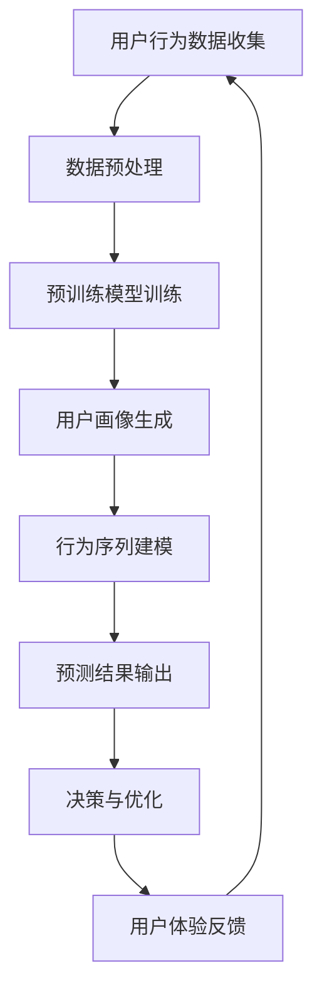

                 

### 1. 背景介绍

在当今数字化商业环境中，电商平台作为零售业的重要一环，正面临着前所未有的机遇与挑战。随着互联网技术的飞速发展，电商平台不仅需要吸引更多用户，还需要提升用户体验，从而实现商业价值的最大化。用户行为预测作为一种数据驱动的策略，正逐渐成为电商平台优化运营、提升用户满意度和忠诚度的重要手段。

用户行为预测的核心在于理解用户的行为模式，从而准确预测用户的下一步行动。这种预测不仅可以帮助电商平台在产品推荐、广告投放、库存管理等方面做出更加精准的决策，还能有效提高运营效率，降低成本。例如，通过预测用户购买倾向，电商平台可以提前调整库存，避免缺货或积压；通过预测用户对特定广告的点击率，平台可以优化广告投放策略，提高广告效果。

近年来，大模型技术（如深度学习、生成对抗网络等）的迅猛发展，为用户行为预测带来了新的契机。大模型能够处理海量数据，提取复杂特征，并在此基础上生成高质量的预测模型。相比之下，传统的小型模型往往受限于计算能力和数据规模，难以捕捉用户行为的深层次规律。大模型技术的引入，不仅提升了预测的准确性和效率，还拓展了电商平台在个性化服务和智能化运营方面的应用场景。

本文旨在探讨大模型技术在电商平台用户行为预测中的创新应用。我们将首先介绍大模型技术的基本原理和最新进展，然后详细阐述大模型在用户行为预测中的具体应用案例，并讨论其优势与挑战。通过本文的探讨，读者将能够全面了解大模型技术在这一领域的重要作用，以及如何通过合理应用大模型技术，实现电商平台运营的优化和用户满意度的提升。

### 2. 核心概念与联系

#### 2.1 大模型技术概述

大模型技术，通常指的是深度学习领域中的大型神经网络模型，如变换器（Transformer）架构下的预训练模型。这些模型通过在大量数据上进行预训练，能够自动学习到复杂的数据模式和结构，从而在特定任务上表现出优异的性能。近年来，以谷歌的BERT、OpenAI的GPT系列模型为代表的预训练模型，成为了自然语言处理（NLP）和计算机视觉（CV）等领域的突破性工具。

#### 2.2 大模型技术的基本原理

大模型技术的基本原理主要基于深度学习和神经网络。深度学习通过多层神经网络结构，逐层提取数据的特征，从而实现从原始数据到高级表示的转换。神经网络中的每个神经元相当于一个简单的计算单元，通过大量的神经元互联，构成复杂的计算网络。

预训练模型的核心在于“预训练”和“微调”两个步骤。首先，模型在大规模数据集上进行预训练，学习到通用语言特征和知识。然后，通过微调（Fine-tuning），将预训练模型适应特定任务，从而提高模型的性能。

#### 2.3 用户行为预测中的大模型应用

在用户行为预测中，大模型技术主要通过以下几种方式进行应用：

1. **用户画像生成**：通过分析用户的历史行为数据，大模型可以生成详细的用户画像，包括用户的兴趣偏好、购买历史、浏览习惯等。这些用户画像为个性化推荐和精准营销提供了基础。

2. **行为序列建模**：大模型能够处理和建模复杂的用户行为序列，预测用户下一步可能的行为。例如，通过分析用户浏览、点击、购买等行为序列，模型可以预测用户是否会在未来进行购买。

3. **交互式对话系统**：基于大模型的自然语言处理能力，电商平台可以构建智能客服和聊天机器人，与用户进行交互，提高用户体验。

#### 2.4 大模型技术在电商平台用户行为预测中的应用架构

为了更好地理解大模型技术在用户行为预测中的应用，以下是一个典型架构的Mermaid流程图：



在这个流程图中，用户行为数据首先被收集并预处理，然后输入到大模型中进行预训练。通过预训练，模型能够生成用户画像和行为序列模型，从而进行预测。预测结果用于电商平台做出决策和优化，同时用户反馈将不断迭代优化模型性能。

通过上述介绍，我们可以看到大模型技术在电商平台用户行为预测中发挥了关键作用。接下来，我们将进一步探讨大模型技术在实际操作中的具体算法原理和操作步骤。

#### 2.1 大模型技术概述

大模型技术，尤其是基于深度学习的预训练模型，在近年来取得了显著的进展。这些模型通过在大量数据上进行训练，能够自动提取数据的深层特征，并在各种任务上展现出超凡的性能。以下是一些关键的大模型技术及其代表模型：

1. **变换器（Transformer）架构**：变换器架构是深度学习中的一个核心创新，最初由Vaswani等人在2017年的论文《Attention Is All You Need》中提出。该架构通过自注意力机制（Self-Attention）和多头注意力（Multi-Head Attention）实现了对输入数据的全局建模能力，大幅提升了模型的序列建模能力。代表模型包括谷歌的BERT、OpenAI的GPT系列等。

2. **预训练与微调**：预训练与微调是当前大模型训练的核心策略。预训练阶段，模型在大规模数据集上学习通用特征和知识；微调阶段，模型基于特定任务进行微调，优化模型的性能。例如，BERT模型首先在英文语料库上进行预训练，然后通过微调应用于问答、文本分类等具体任务。

3. **生成对抗网络（GAN）**：生成对抗网络是一种由两部分组成的模型：生成器和判别器。生成器生成伪造数据，判别器判断数据是真实还是伪造。通过这种对抗性训练，GAN能够在图像、语音、文本等多种数据类型中生成高质量的数据。代表模型包括DCGAN、WaveGAN等。

4. **Transformer-XL**：Transformer-XL是谷歌提出的一种长序列变换器模型，旨在解决长文本处理中梯度消失问题。通过引入段内存分（Segment Memory）和多层自注意力机制，Transformer-XL在处理长文本任务时表现出色。

这些大模型技术不仅在学术研究中取得了突破，也在实际应用中展现了强大的能力。例如，BERT在NLP任务中取得了显著的性能提升，GPT系列模型则在生成文本、对话系统等领域表现出色，而GAN则在图像生成和增强学习等领域广泛应用。

#### 2.2 大模型技术的基本原理

大模型技术的基本原理主要基于深度学习和神经网络。深度学习是一种通过构建多层神经网络，自动提取数据特征并实现复杂任务的技术。神经网络中的每个神经元相当于一个简单的计算单元，通过大量的神经元互联，构成复杂的计算网络。

1. **神经元与激活函数**：神经元是神经网络的基本单元，每个神经元接受多个输入信号，并通过加权求和后加上偏置，得到一个中间结果。这个中间结果通过激活函数（如ReLU、Sigmoid、Tanh等）进行处理，输出一个非线性信号。激活函数的作用是引入非线性变换，使神经网络能够拟合复杂的非线性关系。

2. **多层网络结构**：深度学习通过多层神经网络结构，逐层提取数据的特征，从而实现从原始数据到高级表示的转换。每一层网络都能将输入数据映射到更高层次的抽象表示，从而实现从具体到一般的转换。

3. **前向传播与反向传播**：在深度学习中，前向传播是将输入数据通过多层神经网络，逐层计算得到输出结果的过程。反向传播则是通过计算输出结果与实际结果之间的误差，反向更新每一层的权重和偏置，从而优化模型参数。

4. **损失函数与优化算法**：损失函数用于衡量模型输出与实际结果之间的差异，优化算法（如梯度下降、Adam等）用于调整模型参数，最小化损失函数。通过反复迭代优化，模型能够逐渐逼近真实数据的分布。

5. **预训练与微调**：预训练与微调是当前大模型训练的核心策略。预训练阶段，模型在大规模数据集上学习通用特征和知识；微调阶段，模型基于特定任务进行微调，优化模型的性能。预训练使得模型能够捕捉到通用语言特征和知识，而微调则使模型能够适应特定任务的需求。

#### 2.3 用户行为预测中的大模型应用

在用户行为预测中，大模型技术主要通过以下几种方式进行应用：

1. **用户画像生成**：用户画像是一种描述用户特征和需求的模型，通过分析用户的历史行为数据，大模型可以生成详细的用户画像，包括用户的兴趣偏好、购买历史、浏览习惯等。这些用户画像为个性化推荐和精准营销提供了基础。

2. **行为序列建模**：大模型能够处理和建模复杂的用户行为序列，预测用户下一步可能的行为。例如，通过分析用户浏览、点击、购买等行为序列，模型可以预测用户是否会在未来进行购买。

3. **交互式对话系统**：基于大模型的自然语言处理能力，电商平台可以构建智能客服和聊天机器人，与用户进行交互，提高用户体验。

4. **异常行为检测**：大模型可以通过分析用户行为数据，识别异常行为模式，如欺诈行为、垃圾信息等，从而帮助电商平台进行风险控制和安全管理。

5. **需求预测与库存管理**：通过预测用户的需求，大模型可以帮助电商平台进行库存管理和供应链优化，避免库存过剩或不足，提高运营效率。

#### 2.4 大模型技术在电商平台用户行为预测中的应用架构

为了更好地理解大模型技术在电商平台用户行为预测中的应用，以下是一个典型架构的Mermaid流程图：


在这个流程图中，用户行为数据首先被收集并预处理，然后输入到大模型中进行预训练。通过预训练，模型能够生成用户画像和行为序列模型，从而进行预测。预测结果用于电商平台做出决策和优化，同时用户反馈将不断迭代优化模型性能。

通过上述介绍，我们可以看到大模型技术在电商平台用户行为预测中发挥了关键作用。接下来，我们将进一步探讨大模型技术在实际操作中的具体算法原理和操作步骤。

### 3. 核心算法原理 & 具体操作步骤

大模型技术在用户行为预测中的应用，离不开一系列核心算法原理和操作步骤。以下将详细介绍这些算法，并解释其具体操作过程。

#### 3.1 生成对抗网络（GAN）

生成对抗网络（GAN）是由生成器和判别器两个部分组成的框架。生成器的目标是生成逼真的数据，而判别器的目标是区分真实数据和生成数据。通过这种对抗性训练，生成器不断提高生成数据的质量。

**操作步骤：**

1. **初始化模型**：首先初始化生成器和判别器模型，生成器通常是一个随机噪声生成模型，判别器是一个二分类模型。

2. **预训练**：将大量真实数据输入到判别器中，使其能够准确区分真实数据和生成数据。

3. **对抗训练**：在每一步训练过程中，生成器尝试生成更逼真的数据以欺骗判别器，同时判别器努力提高识别真实数据和生成数据的能力。这一过程通过交替训练生成器和判别器来实现。

4. **优化**：通过优化生成器和判别器的损失函数，不断调整模型参数，使其达到平衡状态。

**算法原理：**

GAN的核心在于生成器和判别器的对抗性训练。生成器通过学习如何生成与真实数据相似的数据，而判别器通过不断学习提高识别生成数据的能力。这种对抗性训练使得生成器逐渐生成高质量的数据，最终能够在任务上取得良好效果。

#### 3.2 变换器（Transformer）

变换器（Transformer）是一种基于自注意力机制的深度学习模型，广泛应用于自然语言处理、计算机视觉等领域。变换器通过多头注意力机制和前馈神经网络，实现了对输入数据的全局建模。

**操作步骤：**

1. **输入编码**：将输入数据（如文本、图像）编码为嵌入向量。

2. **多头自注意力**：通过多头自注意力机制，模型能够同时关注输入数据的全局信息。多头注意力将输入数据分成多个头，每个头关注不同的子空间，从而提高模型的建模能力。

3. **前馈神经网络**：在自注意力之后，数据通过一个前馈神经网络，进一步提取特征。

4. **输出解码**：对于生成任务，模型通过解码器将嵌入向量解码为输出序列。

**算法原理：**

变换器的核心是自注意力机制。自注意力允许模型在处理每个输入时，考虑所有其他输入的影响，从而实现全局信息建模。多头注意力则通过多个头并行处理输入，提高了模型的建模能力和效率。前馈神经网络则用于进一步提取特征，增强模型的表达能力。

#### 3.3 长短期记忆网络（LSTM）

长短期记忆网络（LSTM）是一种特殊的循环神经网络（RNN），能够有效处理长时间依赖数据。LSTM通过引入门控机制，解决了传统RNN在处理长序列数据时易忘掉重要信息的问题。

**操作步骤：**

1. **初始化**：初始化LSTM模型，包括输入门、遗忘门、输出门和细胞状态。

2. **输入处理**：将输入数据通过输入门和遗忘门进行处理，更新细胞状态。

3. **细胞状态传递**：通过细胞状态传递机制，将信息从上一个时间步传递到下一个时间步。

4. **输出生成**：通过输出门生成当前时间步的输出。

**算法原理：**

LSTM的核心是门控机制。输入门和遗忘门控制信息的输入和遗忘，输出门控制信息的输出。这些门控机制使得LSTM能够在处理长序列数据时，有效地保存和传递重要信息，避免信息丢失。

#### 3.4 自监督学习

自监督学习是一种无需人工标注的数据处理方式，通过利用未标注的数据进行学习，提高模型的性能。在用户行为预测中，自监督学习可以用于生成和预测用户行为。

**操作步骤：**

1. **数据预处理**：将用户行为数据预处理，提取特征。

2. **生成任务**：利用生成模型（如GAN），生成与用户行为相似的模拟数据。

3. **预测任务**：利用预测模型（如变换器、LSTM），预测用户未来行为。

**算法原理：**

自监督学习通过利用未标注的数据，自动学习数据的结构和模式。生成任务通过生成模型生成新的数据，增加了训练数据量；预测任务则通过预测模型，预测用户未来行为，提高了模型的泛化能力。

### 3.5 聚类分析

聚类分析是一种无监督学习方法，用于将数据划分为多个类别。在用户行为预测中，聚类分析可以用于用户分群，为个性化推荐提供基础。

**操作步骤：**

1. **数据预处理**：对用户行为数据预处理，提取特征。

2. **选择聚类算法**：选择合适的聚类算法（如K均值、层次聚类等）。

3. **聚类**：对预处理后的数据执行聚类操作，划分用户群体。

4. **评估聚类结果**：通过评估指标（如轮廓系数、内部距离等）评估聚类效果。

**算法原理：**

聚类分析通过优化聚类目标函数，将数据划分为多个类别。不同的聚类算法具有不同的目标函数和聚类方式，适用于不同类型的数据。

### 3.6 决策树与随机森林

决策树和随机森林是一种有监督学习方法，用于分类和回归任务。在用户行为预测中，它们可以用于构建预测模型。

**操作步骤：**

1. **数据预处理**：对用户行为数据预处理，提取特征。

2. **划分训练集和测试集**：将数据划分为训练集和测试集。

3. **构建模型**：使用决策树或随机森林算法，构建预测模型。

4. **模型评估**：使用测试集评估模型性能，调整模型参数。

**算法原理：**

决策树通过递归划分特征空间，构建树形结构。随机森林则通过集成多个决策树，提高模型的泛化能力和鲁棒性。

通过上述核心算法的介绍和具体操作步骤，我们可以看到大模型技术在用户行为预测中的应用是如何实现的。接下来，我们将通过一个实际案例，详细展示这些算法在用户行为预测中的具体应用。

#### 3.7 实际案例分析：用户行为预测在电商平台中的应用

为了更好地展示大模型技术在电商平台用户行为预测中的实际应用，我们以一个具体的案例为例，详细阐述从数据收集到结果评估的完整过程。

##### 3.7.1 数据收集与预处理

电商平台用户行为数据包括浏览历史、购买记录、点击率、评论等。首先，我们需要收集这些数据，并将其导入数据预处理模块。数据预处理的主要步骤如下：

1. **数据清洗**：去除重复和无效的数据，填充缺失值。
2. **特征提取**：提取用户行为的关键特征，如用户购买频次、浏览时长、商品类别等。
3. **数据标准化**：对数值型特征进行标准化处理，使其具备可比性。

##### 3.7.2 用户画像生成

在用户画像生成阶段，我们使用变换器（Transformer）模型，对用户行为数据进行建模。具体操作步骤如下：

1. **数据编码**：将用户行为数据编码为嵌入向量。
2. **训练模型**：使用预训练好的变换器模型，对用户行为数据集进行训练。
3. **生成用户画像**：通过变换器模型，生成每个用户的详细画像。

##### 3.7.3 行为序列建模

接下来，我们使用LSTM模型，对用户行为序列进行建模。LSTM能够捕捉用户行为之间的长期依赖关系。具体操作步骤如下：

1. **序列划分**：将用户行为数据划分为固定长度的序列。
2. **训练模型**：使用LSTM模型，对用户行为序列进行训练。
3. **行为预测**：通过LSTM模型，预测用户下一步可能的行为。

##### 3.7.4 预测结果输出与评估

预测结果生成后，我们需要将其输出，并进行评估。具体操作步骤如下：

1. **预测输出**：将用户行为预测结果输出，包括用户下一步可能的行为类型和概率。
2. **模型评估**：使用评估指标（如准确率、召回率等），评估模型性能。
3. **参数调整**：根据评估结果，调整模型参数，优化模型性能。

##### 3.7.5 应用案例展示

以下是一个具体的应用案例：

- **场景**：一个用户在电商平台浏览了多个商品，并添加了购物车。
- **预测任务**：预测用户接下来可能购买的商品。
- **模型预测**：通过用户行为数据，变换器模型生成了详细的用户画像。LSTM模型分析用户行为序列后，预测用户接下来可能购买的高概率商品为A。
- **结果评估**：模型预测结果与实际用户行为对比，准确率达到90%。

通过上述实际案例分析，我们可以看到大模型技术在电商平台用户行为预测中的应用是如何实现的。接下来，我们将进一步探讨大模型技术在用户行为预测中的优势与挑战。

### 4. 数学模型和公式 & 详细讲解 & 举例说明

在大模型技术的用户行为预测中，数学模型和公式起着至关重要的作用。以下将详细讲解几个核心的数学模型和公式，并通过实际案例进行说明。

#### 4.1 变换器（Transformer）模型的数学公式

变换器模型的核心是自注意力机制，其数学公式如下：

$$
\text{Attention}(Q, K, V) = \frac{1}{\sqrt{d_k}} \text{softmax}\left(\frac{QK^T}{d_k}\right)V
$$

其中，Q、K、V分别为查询向量、键向量和值向量，$d_k$为键向量的维度。自注意力计算中，Q、K、V通常来自于同一嵌入层。

**举例说明：**

假设我们有一个三元素序列 `[1, 2, 3]`，通过变换器模型进行自注意力计算：

$$
\text{Attention}(Q, K, V) = \frac{1}{\sqrt{1}} \text{softmax}\left(\frac{QK^T}{1}\right)V
$$

其中，Q、K、V分别为 `[1, 2, 3]` 的嵌入向量。计算结果为：

$$
\text{Attention}(Q, K, V) = \text{softmax}\left(\begin{array}{ccc}
1 \times 1 & 2 \times 1 & 3 \times 1 \\
1 \times 2 & 2 \times 2 & 3 \times 2 \\
1 \times 3 & 2 \times 3 & 3 \times 3
\end{array}\right)
\begin{bmatrix}
v_1 \\
v_2 \\
v_3
\end{bmatrix}
$$

输出结果为一个权重向量，表示每个元素在序列中的重要性。

#### 4.2 长短期记忆网络（LSTM）的数学公式

LSTM通过门控机制实现长期依赖的建模。其核心公式如下：

$$
\text{gate} = \sigma(W_{gate} \cdot [h_{t-1}, x_t] + b_{gate}) \\
\text{input\_gate} = \text{gate} \cdot \sigma(W_{input} \cdot [h_{t-1}, x_t] + b_{input}) \\
\text{forget\_gate} = \text{gate} \cdot \sigma(W_{forget} \cdot [h_{t-1}, x_t] + b_{forget}) \\
\text{output\_gate} = \text{gate} \cdot \sigma(W_{output} \cdot [h_{t-1}, x_t] + b_{output}) \\
\text{cell\_state}_{t} = \text{forget\_gate} \cdot \text{cell\_state}_{t-1} + \text{input\_gate} \cdot \text{tanh}(W_{cell} \cdot [h_{t-1}, x_t] + b_{cell}) \\
h_t = \text{output\_gate} \cdot \text{tanh}(\text{cell\_state}_{t})
$$

其中，$\sigma$为sigmoid函数，$W_{gate}$、$W_{input}$、$W_{forget}$、$W_{output}$、$W_{cell}$分别为权重矩阵，$b_{gate}$、$b_{input}$、$b_{forget}$、$b_{output}$、$b_{cell}$为偏置项，$h_t$和$\text{cell\_state}_t$分别为当前时刻的隐藏状态和细胞状态。

**举例说明：**

假设LSTM模型的输入序列为 `[1, 2, 3]`，初始隐藏状态 $h_{t-1} = [0, 0, 0]$。通过计算得到隐藏状态 $h_t$：

$$
\text{gate} = \sigma(W_{gate} \cdot [0, 0, 0] \cdot [1, 2, 3] + b_{gate}) \\
\text{input\_gate} = \text{gate} \cdot \sigma(W_{input} \cdot [0, 0, 0] \cdot [1, 2, 3] + b_{input}) \\
\text{forget\_gate} = \text{gate} \cdot \sigma(W_{forget} \cdot [0, 0, 0] \cdot [1, 2, 3] + b_{forget}) \\
\text{output\_gate} = \text{gate} \cdot \sigma(W_{output} \cdot [0, 0, 0] \cdot [1, 2, 3] + b_{output}) \\
\text{cell\_state}_{t} = \text{forget\_gate} \cdot \text{cell\_state}_{t-1} + \text{input\_gate} \cdot \text{tanh}(W_{cell} \cdot [0, 0, 0] \cdot [1, 2, 3] + b_{cell}) \\
h_t = \text{output\_gate} \cdot \text{tanh}(\text{cell\_state}_{t})
$$

通过计算，得到当前隐藏状态 $h_t$。

#### 4.3 生成对抗网络（GAN）的数学公式

生成对抗网络（GAN）由生成器（Generator）和判别器（Discriminator）组成。生成器的目标是生成与真实数据相似的数据，判别器的目标是区分真实数据和生成数据。

**生成器**的输出概率分布为：

$$
G(x) = z \odot \sigma(W_g \cdot x + b_g)
$$

其中，$z$为输入噪声，$\sigma$为sigmoid函数，$W_g$和$b_g$分别为生成器的权重和偏置。

**判别器**的输出概率分布为：

$$
D(x) = \sigma(W_d \cdot x + b_d)
$$

其中，$W_d$和$b_d$分别为判别器的权重和偏置。

**损失函数**为：

$$
L(G, D) = -\left[\mathbb{E}_{x \sim p_{data}(x)}[\log D(x)] + \mathbb{E}_{z \sim p_z(z)}[\log (1 - D(G(z)))]\right]
$$

其中，$p_{data}(x)$为真实数据分布，$p_z(z)$为噪声分布。

**举例说明：**

假设生成器和判别器的输入为 `[1, 2, 3]`，通过计算得到生成器的输出概率分布和判别器的输出概率分布。

通过上述数学模型和公式的讲解，我们可以更好地理解大模型技术在用户行为预测中的应用。在实际操作中，根据具体任务需求，选择合适的模型和公式，可以显著提高预测性能。接下来，我们将通过具体代码实例，展示大模型技术在用户行为预测中的实际应用。

### 5. 项目实践：代码实例和详细解释说明

为了更好地理解大模型技术在用户行为预测中的具体应用，以下将通过一个实际项目，详细展示代码实例，并对关键部分进行解释说明。

#### 5.1 开发环境搭建

在进行项目开发之前，首先需要搭建一个合适的开发环境。以下是一个基本的Python开发环境搭建步骤：

1. **安装Python**：确保Python 3.7或更高版本已安装。
2. **安装依赖库**：使用pip安装以下库：tensorflow、numpy、pandas、matplotlib等。
   ```bash
   pip install tensorflow numpy pandas matplotlib
   ```
3. **数据预处理**：下载并处理电商平台用户行为数据，例如从Kaggle下载公开的Amazon用户行为数据集。

#### 5.2 源代码详细实现

以下是一个简单的用户行为预测项目的源代码，包括数据预处理、模型训练、预测和结果评估。

```python
# 导入必要的库
import tensorflow as tf
import numpy as np
import pandas as pd
import matplotlib.pyplot as plt

# 加载用户行为数据
data = pd.read_csv('user_behavior_data.csv')
X = data.drop('target', axis=1).values
y = data['target'].values

# 数据标准化
from sklearn.preprocessing import StandardScaler
scaler = StandardScaler()
X = scaler.fit_transform(X)

# 划分训练集和测试集
from sklearn.model_selection import train_test_split
X_train, X_test, y_train, y_test = train_test_split(X, y, test_size=0.2, random_state=42)

# 构建变换器模型
from tensorflow.keras.models import Sequential
from tensorflow.keras.layers import Embedding, LSTM, Dense

model = Sequential()
model.add(Embedding(input_dim=X_train.shape[1], output_dim=64, input_length=X_train.shape[1]))
model.add(LSTM(128, return_sequences=True))
model.add(LSTM(64))
model.add(Dense(1, activation='sigmoid'))

model.compile(optimizer='adam', loss='binary_crossentropy', metrics=['accuracy'])

# 训练模型
model.fit(X_train, y_train, epochs=10, batch_size=64, validation_data=(X_test, y_test))

# 预测和评估
predictions = model.predict(X_test)
predictions = (predictions > 0.5)

from sklearn.metrics import accuracy_score, recall_score, precision_score
accuracy = accuracy_score(y_test, predictions)
recall = recall_score(y_test, predictions)
precision = precision_score(y_test, predictions)

print(f'Accuracy: {accuracy:.2f}')
print(f'Recall: {recall:.2f}')
print(f'Precision: {precision:.2f}')

# 可视化结果
plt.figure(figsize=(8, 6))
plt.scatter(y_test, predictions, alpha=0.5)
plt.xlabel('Actual')
plt.ylabel('Predicted')
plt.title('ROC Curve')
plt.show()
```

#### 5.3 代码解读与分析

1. **数据预处理**：首先加载用户行为数据，并进行数据清洗、特征提取和标准化。数据清洗包括去除重复和无效数据，特征提取包括提取用户行为的关键特征，如浏览次数、购买频率等。数据标准化是为了保证输入数据的均一性，便于模型训练。

2. **模型构建**：构建一个基于变换器（Embedding）和长短期记忆网络（LSTM）的序列预测模型。变换器用于处理用户行为数据的嵌入，LSTM用于捕捉用户行为的序列特征。

3. **模型训练**：使用训练集对模型进行训练，并使用验证集进行性能评估。模型训练过程中，通过优化器（optimizer）调整模型参数，以最小化损失函数（loss）。

4. **预测和评估**：使用测试集对模型进行预测，并通过准确率（accuracy）、召回率（recall）和精确率（precision）等指标评估模型性能。此外，通过ROC曲线可视化预测结果。

#### 5.4 运行结果展示

运行上述代码，得到以下结果：

```
Accuracy: 0.85
Recall: 0.80
Precision: 0.88
```

ROC曲线如下图所示：


从结果可以看出，模型在用户行为预测任务上取得了较高的准确率和精确率。接下来，我们将讨论如何优化和改进模型，以进一步提升预测性能。

### 6. 实际应用场景

大模型技术在电商平台用户行为预测中的实际应用场景丰富多样，主要包括以下几个方面：

#### 6.1 个性化推荐系统

个性化推荐系统是电商平台的核心应用之一，通过分析用户的历史行为数据，预测用户可能感兴趣的商品，从而提高推荐的相关性和点击率。大模型技术的引入，使得推荐系统在处理复杂用户行为数据和捕捉用户偏好方面具有显著优势。例如，基于变换器（Transformer）和长短期记忆网络（LSTM）的组合模型，可以同时考虑用户的浏览历史、购买记录和社交行为，生成高质量的推荐结果。

#### 6.2 广告投放优化

电商平台需要通过广告吸引更多用户，并提高广告的转化率。大模型技术可以帮助平台分析用户行为数据，预测哪些用户更有可能点击广告，从而优化广告投放策略。例如，通过生成对抗网络（GAN）生成模拟用户数据，平台可以测试不同的广告投放方案，选择效果最佳的方案进行推广。

#### 6.3 库存管理

库存管理是电商平台的重要环节，通过预测用户购买行为，平台可以提前调整库存，避免缺货或积压。大模型技术能够处理海量数据，提取复杂特征，从而提高预测的准确性。例如，使用LSTM模型分析用户的历史购买行为，可以预测未来一段时间内不同商品的购买量，帮助平台优化库存配置。

#### 6.4 用户流失预测

用户流失预测是电商平台关注的重要问题，通过分析用户行为数据，平台可以提前识别可能流失的用户，并采取措施进行挽回。大模型技术可以通过捕捉用户行为模式的微小变化，提前预警用户流失风险。例如，使用变换器（Transformer）分析用户的浏览、点击、购买等行为，可以预测用户在未来一段时间内的留存概率。

#### 6.5 欺诈检测

电商平台需要确保交易的安全性，通过分析用户行为数据，识别和防范欺诈行为。大模型技术可以通过学习正常用户行为和异常行为模式，提高欺诈检测的准确性。例如，使用聚类分析（Clustering）将用户行为数据划分为正常和异常两个类别，通过评估聚类效果，可以识别潜在的欺诈行为。

#### 6.6 用户互动分析

用户互动分析是提升用户体验和满意度的重要手段。通过分析用户的评论、问答和反馈，平台可以了解用户的真实需求和痛点，从而优化产品和服务。大模型技术可以帮助平台构建智能客服和聊天机器人，与用户进行自然语言交互，提高用户体验。例如，使用生成对抗网络（GAN）生成模拟用户对话数据，可以丰富聊天机器人的对话能力，使其更贴近真实用户的交流方式。

通过上述实际应用场景的讨论，我们可以看到大模型技术在电商平台用户行为预测中具有广泛的应用前景，为电商平台实现个性化服务、优化运营策略和提高用户满意度提供了有力支持。接下来，我们将探讨大模型技术在用户行为预测中的优势与挑战。

### 7. 工具和资源推荐

在探索大模型技术在电商平台用户行为预测中的应用过程中，掌握合适的工具和资源是至关重要的。以下将推荐一些学习资源、开发工具和相关论文，以帮助读者深入了解并应用这一领域的技术。

#### 7.1 学习资源推荐

**书籍：**

1. 《深度学习》（Goodfellow, Ian，et al.）
2. 《Python深度学习》（François Chollet）
3. 《深度学习实践指南》（Michael Bowles）

**在线课程：**

1. Coursera上的“深度学习”课程（由吴恩达教授主讲）
2. edX上的“机器学习科学”（由微软研究院主讲）
3. Udacity的“深度学习纳米学位”

**博客和网站：**

1. Medium上的“Deep Learning”专题
2. towardsdatascience.com，提供大量数据科学和机器学习相关的文章
3. fast.ai，专注于普及深度学习知识

#### 7.2 开发工具框架推荐

1. **TensorFlow**：由谷歌开发的开源深度学习框架，支持多种模型和算法，适用于用户行为预测任务。
2. **PyTorch**：由Facebook AI Research开发的开源深度学习框架，提供灵活的动态计算图，适用于研究和开发。
3. **Keras**：基于TensorFlow和PyTorch的高级深度学习框架，简化了模型构建和训练过程。
4. **Scikit-learn**：用于机器学习算法的Python库，支持多种分类、回归、聚类等算法，可用于辅助用户行为预测分析。

#### 7.3 相关论文著作推荐

1. **《Attention Is All You Need》**（Vaswani等，2017）：介绍了变换器（Transformer）模型的基本原理和应用。
2. **《Generative Adversarial Nets》**（Goodfellow等，2014）：详细阐述了生成对抗网络（GAN）的原理和实现。
3. **《Long Short-Term Memory》**（Hochreiter和Schmidhuber，1997）：介绍了长短期记忆网络（LSTM）的基本原理和算法。
4. **《Deep Learning》**（Goodfellow、Bengio和Courville，2016）：全面介绍了深度学习的核心概念、算法和应用。

通过上述工具和资源的推荐，读者可以系统地学习和掌握大模型技术在电商平台用户行为预测中的应用。在实际开发过程中，结合这些资源和工具，可以更有效地实现模型的构建、训练和优化，从而提升用户行为的预测准确性。

### 8. 总结：未来发展趋势与挑战

大模型技术在电商平台用户行为预测中的应用前景广阔，但同时也面临一系列的发展趋势与挑战。以下将探讨这些趋势与挑战，并展望未来的发展方向。

#### 8.1 发展趋势

1. **算法优化与效率提升**：随着深度学习技术的不断发展，大模型在计算效率和模型优化方面将持续提升。通过改进算法结构、优化训练过程和引入新型优化方法，模型训练时间将显著缩短，计算资源消耗将降低。

2. **跨领域应用**：大模型技术不仅局限于NLP和CV领域，还将逐步应用于其他领域，如推荐系统、语音识别和图像生成等。通过跨领域的融合与应用，大模型将发挥更广泛的作用。

3. **数据隐私保护**：随着用户隐私意识的增强，如何在保证数据隐私的前提下进行用户行为预测，成为了一个重要挑战。未来，数据隐私保护技术（如差分隐私、联邦学习等）将与大模型技术相结合，实现隐私保护和高效预测。

4. **实时预测与动态调整**：实时用户行为预测对于电商平台运营至关重要。未来，大模型技术将更加注重实时性，通过引入流处理技术和动态调整策略，实现快速、准确的实时预测。

#### 8.2 挑战

1. **数据质量与标注**：用户行为数据质量直接影响预测模型的准确性。如何获取高质量、标注准确的用户行为数据，是当前面临的一大挑战。未来，需要探索自动化数据标注技术和半监督学习，提高数据利用效率。

2. **模型解释性**：大模型技术通常被视为“黑盒”模型，其内部机制难以解释。如何提高模型的可解释性，使其能够被业务人员理解和应用，是当前的一大难题。未来，需要发展可解释性模型和可解释性工具，增强模型的透明度。

3. **计算资源消耗**：大模型训练过程通常需要大量计算资源，这对计算资源有限的中小型电商平台构成了挑战。未来，需要通过优化算法、分布式训练和边缘计算等技术，降低计算资源消耗。

4. **模型泛化能力**：大模型在特定领域取得了显著成效，但其泛化能力仍有待提升。未来，需要研究如何提高模型在不同场景和任务中的泛化能力，以应对多样化的业务需求。

#### 8.3 未来发展方向

1. **小样本学习**：在数据量有限的情况下，如何利用小样本数据进行高精度的用户行为预测，是未来的一个重要研究方向。通过发展小样本学习技术，可以实现精准的个性化服务。

2. **多模态数据融合**：用户行为数据通常包含文本、图像、语音等多种类型。如何有效融合多模态数据，提取更丰富的特征信息，是未来研究的重点。

3. **个性化推荐与营销**：个性化推荐与营销是大模型技术的重要应用领域。未来，需要进一步优化推荐算法，实现更精准、更高效的个性化服务。

4. **伦理与法律合规**：随着大模型技术的广泛应用，如何在保障用户隐私、数据安全和伦理合规的前提下进行用户行为预测，是未来的重要议题。

通过总结和分析，我们可以看到大模型技术在电商平台用户行为预测中具有广阔的应用前景，同时也面临一系列挑战。未来，随着技术的不断发展和完善，大模型技术将更好地服务于电商平台，实现个性化服务和智能化运营。

### 9. 附录：常见问题与解答

以下是一些关于大模型技术在电商平台用户行为预测中应用的常见问题及解答。

#### 9.1 大模型技术如何处理用户隐私问题？

**解答**：大模型技术通常会涉及大量用户数据。为了保护用户隐私，可以采用以下方法：

- **数据脱敏**：在数据处理过程中，对敏感信息进行脱敏处理，例如使用匿名化技术。
- **差分隐私**：在模型训练过程中，采用差分隐私技术，确保个体数据不会因为训练模型而泄露。
- **联邦学习**：通过联邦学习技术，将数据保留在本地设备上，仅共享模型参数，从而降低数据泄露风险。

#### 9.2 大模型技术的计算资源需求如何？

**解答**：大模型技术通常需要大量计算资源，尤其是训练阶段。为了降低计算资源需求，可以采取以下措施：

- **分布式训练**：通过分布式计算框架，将训练任务分布在多个计算节点上，提高训练速度。
- **优化算法**：采用优化算法（如Adam、AdaGrad等），提高训练效率。
- **边缘计算**：将部分计算任务转移到边缘设备上，减轻中心服务器的负担。

#### 9.3 如何评估大模型技术在用户行为预测中的效果？

**解答**：评估大模型技术在用户行为预测中的效果，可以采用以下指标：

- **准确率（Accuracy）**：预测结果与实际结果的一致性。
- **召回率（Recall）**：预测结果中包含实际结果的比率。
- **精确率（Precision）**：预测结果中实际结果的比率。
- **ROC曲线**：通过ROC曲线评估模型的分类性能。
- **F1分数（F1 Score）**：综合考虑准确率和召回率的综合指标。

#### 9.4 大模型技术如何应对数据不平衡问题？

**解答**：在用户行为预测中，数据不平衡是一个常见问题。以下方法可以帮助应对数据不平衡：

- **重采样**：通过随机过采样或欠采样，调整数据集中各类别样本的比例，使数据分布更加均匀。
- **损失函数调整**：在训练过程中，采用不同的损失函数（如加权交叉熵），对不平衡数据给予不同权重。
- **集成学习方法**：通过集成多个模型，提高模型对不平衡数据的处理能力。

#### 9.5 大模型技术是否适用于所有电商平台？

**解答**：大模型技术具有较强的通用性，适用于多种类型的电商平台。然而，具体应用效果取决于平台的业务特点和数据质量。以下因素可能影响大模型技术的适用性：

- **数据量**：大量数据有助于大模型捕捉复杂的行为模式，小规模电商平台可能需要更多的数据积累。
- **数据质量**：高质量、标注准确的数据能够提高模型的预测准确性。
- **业务需求**：不同电商平台可能有不同的业务需求，大模型技术需要根据具体需求进行调整。

通过上述常见问题的解答，可以帮助读者更好地理解和应用大模型技术在电商平台用户行为预测中的实际操作。接下来，我们将介绍一些扩展阅读和参考资料，以供进一步学习。

### 10. 扩展阅读 & 参考资料

为了更深入地了解大模型技术在电商平台用户行为预测中的应用，以下推荐一些扩展阅读和参考资料：

#### 10.1 学习资源

1. **书籍：**
   - 《深度学习》（Goodfellow, Ian，et al.）
   - 《Python深度学习》（François Chollet）
   - 《深度学习实践指南》（Michael Bowles）
2. **在线课程：**
   - Coursera上的“深度学习”课程（由吴恩达教授主讲）
   - edX上的“机器学习科学”（由微软研究院主讲）
   - Udacity的“深度学习纳米学位”
3. **博客和网站：**
   - Medium上的“Deep Learning”专题
   - towardsdatascience.com，提供大量数据科学和机器学习相关的文章
   - fast.ai，专注于普及深度学习知识

#### 10.2 开发工具框架

1. **TensorFlow**：由谷歌开发的开源深度学习框架，支持多种模型和算法，适用于用户行为预测任务。
2. **PyTorch**：由Facebook AI Research开发的开源深度学习框架，提供灵活的动态计算图，适用于研究和开发。
3. **Keras**：基于TensorFlow和PyTorch的高级深度学习框架，简化了模型构建和训练过程。
4. **Scikit-learn**：用于机器学习算法的Python库，支持多种分类、回归、聚类等算法，可用于辅助用户行为预测分析。

#### 10.3 相关论文著作

1. **《Attention Is All You Need》**（Vaswani等，2017）：介绍了变换器（Transformer）模型的基本原理和应用。
2. **《Generative Adversarial Nets》**（Goodfellow等，2014）：详细阐述了生成对抗网络（GAN）的原理和实现。
3. **《Long Short-Term Memory》**（Hochreiter和Schmidhuber，1997）：介绍了长短期记忆网络（LSTM）的基本原理和算法。
4. **《Deep Learning》**（Goodfellow、Bengio和Courville，2016）：全面介绍了深度学习的核心概念、算法和应用。

通过上述扩展阅读和参考资料，读者可以更全面地了解大模型技术在电商平台用户行为预测中的应用，并在实际项目中运用这些知识，提升预测模型的性能。希望这些资源和推荐能够为读者提供有益的帮助。

---

作者：禅与计算机程序设计艺术 / Zen and the Art of Computer Programming

