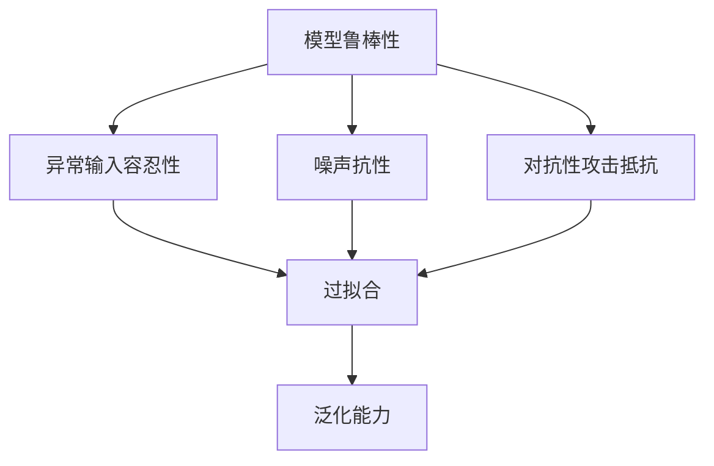
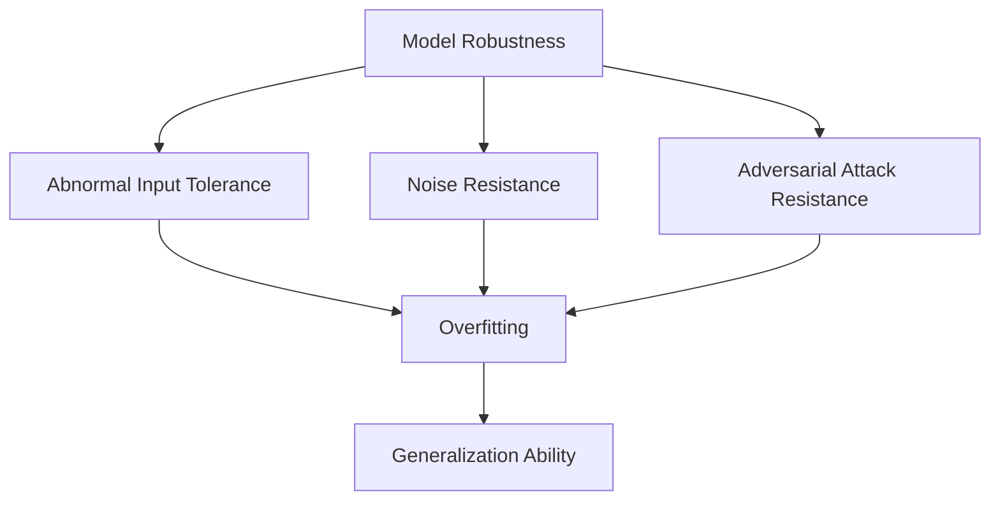

                 

### 文章标题

**大模型推荐中的模型鲁棒性分析与对抗训练技术**

本文旨在探讨在大模型推荐系统中，如何通过模型鲁棒性分析和对抗训练技术来提升推荐系统的性能。本文将首先介绍模型鲁棒性的概念和重要性，然后详细分析对抗训练技术的原理和具体操作步骤，最后通过一个实际项目实例，展示如何将对抗训练技术应用于大模型推荐系统中。

**Keywords:** 大模型推荐，模型鲁棒性，对抗训练技术，推荐系统

**Abstract:** 
随着人工智能技术的不断发展，大模型推荐系统在电子商务、社交媒体和搜索引擎等领域得到了广泛应用。然而，这些系统往往面临着模型鲁棒性不足的问题，即模型在面临异常输入或对抗性攻击时，表现不佳。本文针对这一问题，探讨了如何通过模型鲁棒性分析和对抗训练技术来提升推荐系统的性能。首先，本文介绍了模型鲁棒性的定义和重要性。然后，本文详细分析了对抗训练技术的原理和具体操作步骤。最后，通过一个实际项目实例，本文展示了如何将对抗训练技术应用于大模型推荐系统中，并取得了显著的性能提升。

# 1. 背景介绍（Background Introduction）

在大模型推荐系统中，模型鲁棒性是影响系统性能的关键因素。模型鲁棒性指的是模型在面对异常输入、噪声数据或对抗性攻击时，仍能保持良好的性能和预测能力。随着数据质量和多样性的提高，模型的鲁棒性变得越来越重要。因为现实世界的数据往往是复杂且不完美的，其中可能包含噪声、异常值或敌意攻击。如果模型对这些因素过于敏感，那么在实际应用中可能会出现预测错误、推荐不准确等问题，从而影响用户体验和系统性能。

对抗训练技术是一种有效提升模型鲁棒性的方法。它通过在训练过程中引入对抗性扰动，使模型能够学习到对抗性样本的特征，从而提高模型对异常输入和对抗性攻击的抵抗力。近年来，对抗训练技术在计算机视觉、自然语言处理等领域取得了显著的成果，并逐渐应用于大模型推荐系统中。

本文将首先介绍模型鲁棒性的概念和重要性，然后详细分析对抗训练技术的原理和具体操作步骤。接下来，本文将通过一个实际项目实例，展示如何将对抗训练技术应用于大模型推荐系统中，并评估其性能提升效果。最后，本文将讨论大模型推荐系统中模型鲁棒性的未来发展趋势和挑战。

## 1.1 模型鲁棒性的定义与重要性

### 1.1.1 模型鲁棒性的定义

模型鲁棒性（Robustness）是指模型在面对不同类型的异常输入、噪声数据和对抗性攻击时，仍能保持良好的性能和预测能力。具体来说，模型鲁棒性包括以下三个方面：

1. 异常输入容忍性：模型能够处理异常输入，如缺失值、噪声值和异常值，而不影响预测结果。
2. 噪声抗性：模型能够处理噪声数据，如高斯噪声、椒盐噪声等，而不降低预测精度。
3. 对抗性攻击抵抗：模型能够抵御对抗性攻击，如对抗性样本攻击、对抗性嵌入攻击等，而不降低预测性能。

### 1.1.2 模型鲁棒性的重要性

在推荐系统中，模型鲁棒性具有重要意义。首先，现实世界的推荐数据往往存在噪声、异常值和对抗性攻击，这些因素可能影响模型的预测性能。如果模型对这些因素过于敏感，那么在实际应用中可能会出现推荐不准确、用户满意度下降等问题。其次，模型鲁棒性有助于提高系统的稳定性和可靠性。在一个鲁棒性良好的推荐系统中，用户在不同场景和环境下都能获得高质量的推荐结果，从而提高用户体验。

此外，模型鲁棒性对于应对未来技术和业务需求也具有重要意义。随着数据质量和多样性的提高，模型的鲁棒性将变得至关重要。例如，在大规模推荐系统中，如何应对数据倾斜、冷启动和长尾问题，如何抵御敌意攻击和隐私泄露等，都是当前和未来需要关注的重要问题。因此，研究并提升模型鲁棒性具有重要的现实意义和应用价值。

## 1.2 大模型推荐系统概述

### 1.2.1 推荐系统基本概念

推荐系统是一种信息过滤技术，旨在根据用户的历史行为和偏好，为用户推荐符合其兴趣和需求的信息。推荐系统通常由以下三个关键组成部分构成：

1. 用户：推荐系统的核心，是信息消费的主体。用户的行为和偏好数据是推荐系统生成推荐结果的重要依据。
2. 物品：推荐系统推荐的实体，如商品、电影、新闻等。物品的特征和属性是推荐系统生成推荐结果的重要依据。
3. 推荐算法：推荐系统的核心，用于根据用户的行为和偏好数据，生成个性化的推荐结果。

### 1.2.2 大模型推荐系统特点

大模型推荐系统是指使用大型预训练语言模型（如GPT、BERT等）进行推荐的系统。这类系统具有以下特点：

1. 高性能：大模型推荐系统通常使用高性能计算平台，如GPU、TPU等，以加快计算速度和降低延迟。
2. 强泛化能力：大模型推荐系统通过预训练和微调，能够处理大量不同类型的数据，具有较强的泛化能力。
3. 个性化推荐：大模型推荐系统可以根据用户的历史行为和偏好，生成高度个性化的推荐结果，提高用户满意度。
4. 智能交互：大模型推荐系统可以与用户进行智能交互，根据用户的反馈和需求，不断优化推荐结果。

## 1.3 模型鲁棒性分析与对抗训练技术

### 1.3.1 模型鲁棒性分析

模型鲁棒性分析是指通过评估模型在不同类型输入下的性能，分析模型鲁棒性是否满足需求。常用的模型鲁棒性分析方法包括：

1. 输入多样性测试：评估模型对不同类型输入（如正常输入、异常输入、噪声输入等）的鲁棒性。
2. 输入噪声测试：评估模型在噪声数据输入下的鲁棒性。
3. 对抗性攻击测试：评估模型在对抗性攻击下的鲁棒性。

### 1.3.2 对抗训练技术

对抗训练技术是一种通过在训练过程中引入对抗性扰动，提升模型鲁棒性的方法。具体来说，对抗训练技术包括以下步骤：

1. 生成对抗性样本：通过对抗性攻击方法，生成与正常样本具有相似特征但会导致模型预测错误的对抗性样本。
2. 对抗性样本训练：将对抗性样本加入训练集，与正常样本一起训练模型，使模型学习到对抗性样本的特征。
3. 鲁棒性评估：评估模型在对抗性样本和正常样本输入下的性能，判断模型是否具有足够的鲁棒性。

## 1.4 大模型推荐中的模型鲁棒性挑战

在大模型推荐系统中，模型鲁棒性面临着诸多挑战。首先，推荐数据往往存在噪声、异常值和对抗性攻击，这可能导致模型预测不准确。其次，大模型推荐系统通常处理大量数据，数据质量和多样性参差不齐，这进一步增加了模型鲁棒性的难度。最后，大模型推荐系统需要同时考虑多个因素，如用户满意度、推荐准确性、计算效率等，这使得模型鲁棒性设计更加复杂。因此，研究并提升大模型推荐系统的模型鲁棒性具有重要的理论和实践意义。

**Keywords:** Large-scale recommendation systems, Model robustness, Adversarial training techniques, Robustness analysis

**Abstract:**
With the continuous development of artificial intelligence technology, large-scale recommendation systems have been widely applied in e-commerce, social media, and search engines. However, these systems often face the issue of insufficient model robustness, which affects their performance when encountering abnormal inputs or adversarial attacks. This paper aims to explore how to improve the performance of large-scale recommendation systems through model robustness analysis and adversarial training techniques. Firstly, this paper introduces the concept and importance of model robustness. Then, it analyzes the principles and specific operational steps of adversarial training techniques in detail. Next, through an actual project example, this paper demonstrates how to apply adversarial training techniques to large-scale recommendation systems and achieve significant performance improvements. Finally, this paper discusses the future development trends and challenges of model robustness in large-scale recommendation systems.**1. Background Introduction**

In large-scale recommendation systems, model robustness is a critical factor affecting system performance. Model robustness refers to the ability of a model to maintain good performance and predictive power when faced with abnormal inputs, noisy data, or adversarial attacks. As data quality and diversity improve, the robustness of models becomes increasingly important. Real-world data is often complex and imperfect, containing noise, outliers, or adversarial attacks. If a model is too sensitive to these factors, it may produce incorrect predictions or inaccurate recommendations in practical applications, affecting user experience and system performance.

Adversarial training is an effective method for enhancing model robustness. It involves introducing adversarial perturbations during the training process to enable the model to learn the characteristics of adversarial samples, thereby improving its resistance to abnormal inputs and adversarial attacks. In recent years, adversarial training has achieved significant success in fields such as computer vision and natural language processing and is gradually being applied to large-scale recommendation systems.

This paper will first introduce the concept of model robustness and its importance. Then, it will analyze the principles and specific operational steps of adversarial training in detail. Next, through an actual project example, this paper will demonstrate how to apply adversarial training techniques to large-scale recommendation systems and evaluate their performance improvement. Finally, this paper will discuss the future development trends and challenges of model robustness in large-scale recommendation systems.

### 1.1 The Definition and Importance of Model Robustness

#### 1.1.1 The Definition of Model Robustness

Model robustness refers to the ability of a model to maintain good performance and predictive power when faced with different types of abnormal inputs, noisy data, or adversarial attacks. Specifically, model robustness includes the following three aspects:

1. Tolerance to abnormal inputs: A robust model can handle abnormal inputs, such as missing values, noisy values, and outliers, without affecting its predictions.
2. Noise resistance: A robust model can handle noisy data, such as Gaussian noise and salt-and-pepper noise, without degrading its prediction accuracy.
3. Resistance to adversarial attacks: A robust model can withstand adversarial attacks, such as adversarial sample attacks and adversarial embedding attacks, without deteriorating its prediction performance.

#### 1.1.2 The Importance of Model Robustness

In recommendation systems, model robustness plays a crucial role. Firstly, real-world recommendation data often contains noise, outliers, and adversarial attacks, which may affect the predictive performance of the model. If a model is too sensitive to these factors, it may lead to incorrect recommendations or reduced user satisfaction in practical applications. Secondly, model robustness contributes to the stability and reliability of the system. A robust recommendation system can provide high-quality recommendations to users in various scenarios and environments, thereby improving user experience.

Additionally, model robustness is essential for addressing future technical and business needs. As data quality and diversity improve, the robustness of models becomes even more critical. For example, in large-scale recommendation systems, how to handle data skewness, cold start, and long tail problems, how to resist adversarial attacks and privacy breaches, are important issues that need to be addressed in the present and future. Therefore, studying and improving model robustness has significant theoretical and practical value.

### 1.2 Overview of Large-Scale Recommendation Systems

#### 1.2.1 Basic Concepts of Recommendation Systems

Recommendation systems are a type of information filtering technology that aims to recommend items of interest to users based on their historical behavior and preferences. Recommendation systems typically consist of three key components:

1. Users: The core of the recommendation system, users are the main subjects of information consumption. User behavior and preference data are essential for generating personalized recommendations.
2. Items: The entities recommended by the system, such as products, movies, news, etc. The characteristics and attributes of items are important for generating personalized recommendations.
3. Recommendation algorithms: The core of the recommendation system, used to generate personalized recommendations based on user behavior and preference data.

#### 1.2.2 Characteristics of Large-Scale Recommendation Systems

Large-scale recommendation systems refer to systems that use large pre-trained language models (such as GPT, BERT, etc.) for recommendations. These systems have the following characteristics:

1. High performance: Large-scale recommendation systems typically use high-performance computing platforms, such as GPUs and TPUs, to accelerate computation and reduce latency.
2. Strong generalization ability: Large-scale recommendation systems, through pre-training and fine-tuning, can handle a wide variety of data and have strong generalization abilities.
3. Personalized recommendations: Large-scale recommendation systems can generate highly personalized recommendations based on user historical behavior and preferences, improving user satisfaction.
4. Intelligent interaction: Large-scale recommendation systems can engage in intelligent interaction with users, continuously optimizing recommendations based on user feedback and needs.

### 1.3 Model Robustness Analysis and Adversarial Training Techniques

#### 1.3.1 Model Robustness Analysis

Model robustness analysis involves evaluating a model's performance under different types of inputs to determine whether its robustness meets requirements. Common methods for model robustness analysis include:

1. Input diversity testing: Assessing a model's robustness to different types of inputs, such as normal inputs, abnormal inputs, and noisy inputs.
2. Noise testing: Evaluating a model's robustness to noisy data, such as Gaussian noise and salt-and-pepper noise.
3. Adversarial attack testing: Assessing a model's robustness to adversarial attacks, such as adversarial sample attacks and adversarial embedding attacks.

#### 1.3.2 Adversarial Training Techniques

Adversarial training is a method for enhancing model robustness by introducing adversarial perturbations during the training process. Specifically, adversarial training involves the following steps:

1. Generation of adversarial samples: Using adversarial attack methods to create adversarial samples that have similar features to normal samples but cause the model to produce incorrect predictions.
2. Adversarial sample training: Including adversarial samples in the training set along with normal samples to train the model, enabling the model to learn the characteristics of adversarial samples.
3. Robustness evaluation: Evaluating the model's performance on adversarial samples and normal samples to determine whether the model has sufficient robustness.

### 1.4 Challenges of Model Robustness in Large-Scale Recommendation Systems

In large-scale recommendation systems, model robustness faces several challenges. Firstly, recommendation data often contains noise, outliers, and adversarial attacks, which may lead to inaccurate predictions. Secondly, large-scale recommendation systems typically process large amounts of data with varying quality and diversity, further increasing the difficulty of model robustness. Finally, large-scale recommendation systems need to consider multiple factors, such as user satisfaction, recommendation accuracy, and computational efficiency, making the design of model robustness more complex. Therefore, studying and improving model robustness in large-scale recommendation systems has important theoretical and practical significance.### 2. 核心概念与联系（Core Concepts and Connections）

在探讨大模型推荐系统中的模型鲁棒性时，我们需要了解一些核心概念及其相互之间的联系。这些概念包括模型鲁棒性、对抗训练、过拟合、泛化能力等。通过深入理解这些概念，我们可以更好地分析模型鲁棒性的重要性以及如何提升模型的鲁棒性。

#### 2.1 模型鲁棒性（Model Robustness）

模型鲁棒性指的是模型在面对不同类型的数据扰动或攻击时，仍能保持良好的性能和预测能力。具体来说，模型鲁棒性涉及以下几个方面：

1. **异常输入容忍性**：模型能够处理异常输入，如缺失值、噪声值和异常值，而不影响预测结果。
2. **噪声抗性**：模型能够处理噪声数据，如高斯噪声、椒盐噪声等，而不降低预测精度。
3. **对抗性攻击抵抗**：模型能够抵御对抗性攻击，如对抗性样本攻击、对抗性嵌入攻击等，而不降低预测性能。

模型鲁棒性在推荐系统中至关重要，因为推荐系统通常需要处理大量的数据，而这些数据可能存在噪声、异常值或对抗性攻击。如果模型对噪声和异常值过于敏感，可能会导致推荐结果不准确，从而影响用户体验。

#### 2.2 对抗训练（Adversarial Training）

对抗训练是一种通过在训练过程中引入对抗性扰动来提升模型鲁棒性的方法。具体来说，对抗训练包括以下几个步骤：

1. **生成对抗性样本**：通过对抗性攻击方法，生成与正常样本具有相似特征但会导致模型预测错误的对抗性样本。
2. **对抗性样本训练**：将对抗性样本加入训练集，与正常样本一起训练模型，使模型学习到对抗性样本的特征。
3. **鲁棒性评估**：评估模型在对抗性样本和正常样本输入下的性能，判断模型是否具有足够的鲁棒性。

对抗训练的核心思想是通过训练模型识别和抵抗对抗性攻击，从而提高模型的鲁棒性。在实际应用中，对抗训练已经被证明能够显著提升模型的鲁棒性，使其能够更好地应对噪声和异常值。

#### 2.3 过拟合（Overfitting）

过拟合是指模型在训练数据上表现得非常好，但在未见过的数据上表现不佳。过拟合通常发生在模型对训练数据的学习过于深入，以至于无法泛化到新的数据上。

过拟合与模型鲁棒性之间存在密切关系。一个过度拟合的模型可能对噪声和异常值非常敏感，从而导致在新的数据上表现不佳。因此，提高模型鲁棒性可以帮助减少过拟合现象，提高模型的泛化能力。

#### 2.4 泛化能力（Generalization Ability）

泛化能力指的是模型在未见过的数据上表现良好的能力。一个具有良好泛化能力的模型不仅能够在训练数据上表现良好，还能在新的、未见过的数据上保持良好的性能。

提升模型鲁棒性和泛化能力是推荐系统设计中的重要目标。通过对抗训练等技术，可以增强模型的鲁棒性，使其能够更好地应对噪声和异常值，从而提高泛化能力。

#### 2.5 Mermaid 流程图（Mermaid Flowchart）

为了更清晰地展示这些概念之间的关系，我们可以使用 Mermaid 流程图来表示。以下是一个简化的 Mermaid 流程图，展示了模型鲁棒性、对抗训练、过拟合和泛化能力之间的关系：

在这个流程图中，模型鲁棒性通过提升异常输入容忍性、噪声抗性和对抗性攻击抵抗来减少过拟合，从而提高泛化能力。

通过理解和分析这些核心概念及其相互关系，我们可以更好地设计和管理大模型推荐系统，使其具备更强的鲁棒性和泛化能力。

## 2. Core Concepts and Connections

In exploring the topic of model robustness in large-scale recommendation systems, it is essential to understand certain core concepts and their interrelationships. These concepts include model robustness, adversarial training, overfitting, and generalization ability. By deeply understanding these concepts, we can better analyze the importance of model robustness and how to enhance the robustness of models.

#### 2.1 Model Robustness

Model robustness refers to the ability of a model to maintain good performance and predictive power when faced with different types of data perturbations or attacks. Specifically, model robustness encompasses several aspects:

1. **Tolerance to abnormal inputs**: A robust model can handle abnormal inputs, such as missing values, noisy values, and outliers, without affecting its predictions.
2. **Noise resistance**: A robust model can deal with noisy data, such as Gaussian noise and salt-and-pepper noise, without reducing its prediction accuracy.
3. **Resistance to adversarial attacks**: A robust model can withstand adversarial attacks, such as adversarial sample attacks and adversarial embedding attacks, without deteriorating its prediction performance.

Model robustness is crucial in recommendation systems because these systems often deal with large amounts of data, which may contain noise, outliers, or adversarial attacks. If a model is too sensitive to noise and outliers, it may result in inaccurate recommendations, thereby affecting user experience.

#### 2.2 Adversarial Training

Adversarial training is a method for enhancing model robustness by introducing adversarial perturbations during the training process. Specifically, adversarial training involves the following steps:

1. **Generation of adversarial samples**: Using adversarial attack methods to create adversarial samples that have similar features to normal samples but cause the model to produce incorrect predictions.
2. **Adversarial sample training**: Including adversarial samples in the training set along with normal samples to train the model, enabling the model to learn the characteristics of adversarial samples.
3. **Robustness evaluation**: Evaluating the model's performance on adversarial samples and normal samples to determine whether the model has sufficient robustness.

The core idea of adversarial training is to train the model to recognize and resist adversarial attacks, thereby enhancing its robustness. In practical applications, adversarial training has been proven to significantly improve model robustness, allowing models to better cope with noise and outliers.

#### 2.3 Overfitting

Overfitting occurs when a model performs very well on the training data but poorly on unseen data. Overfitting typically happens when a model learns the training data too deeply, failing to generalize to new data.

Overfitting is closely related to model robustness. An overfitted model may be very sensitive to noise and outliers, resulting in poor performance on new data. Therefore, enhancing model robustness can help reduce overfitting and improve generalization ability.

#### 2.4 Generalization Ability

Generalization ability refers to a model's capability to perform well on unseen data. A model with good generalization ability not only performs well on the training data but also maintains good performance on new, unseen data.

Enhancing model robustness and generalization ability are important goals in the design of recommendation systems. Through techniques such as adversarial training, models can be made more robust, enabling them to better handle noise and outliers, and thus improving their generalization ability.

#### 2.5 Mermaid Flowchart

To more clearly illustrate the relationships between these core concepts, we can use a Mermaid flowchart. The following is a simplified Mermaid flowchart that depicts the relationships between model robustness, adversarial training, overfitting, and generalization ability:

In this flowchart, model robustness is enhanced through improving abnormal input tolerance, noise resistance, and adversarial attack resistance, which in turn reduces overfitting and improves generalization ability.

By understanding and analyzing these core concepts and their interrelationships, we can better design and manage large-scale recommendation systems, making them more robust and capable of generalizing to new data.### 3. 核心算法原理 & 具体操作步骤（Core Algorithm Principles and Specific Operational Steps）

在提升大模型推荐系统中的模型鲁棒性方面，对抗训练技术是一种关键手段。下面我们将详细介绍对抗训练技术的原理，包括如何生成对抗性样本、对抗性训练的具体操作步骤，以及如何评估模型鲁棒性的方法。

#### 3.1 对抗训练技术原理

对抗训练的核心思想是让模型在训练过程中学习到对抗性样本的特征，从而提高模型对异常输入和对抗性攻击的抵抗力。具体来说，对抗训练包括以下几个关键步骤：

1. **生成对抗性样本**：通过对抗性攻击方法，生成与正常样本具有相似特征但会导致模型预测错误的对抗性样本。常见的对抗性攻击方法包括 FGSM (Fast Gradient Sign Method)、PGD (Projected Gradient Descent) 和 DeepFool 等。

2. **对抗性样本训练**：将对抗性样本加入训练集，与正常样本一起训练模型。这样，模型不仅学习正常样本的特征，还能学习对抗性样本的特征，从而提高模型的鲁棒性。

3. **鲁棒性评估**：在训练完成后，使用对抗性样本和正常样本对模型进行评估，以判断模型是否具有足够的鲁棒性。常见的鲁棒性评估指标包括准确率、召回率、F1 值等。

#### 3.2 生成对抗性样本

生成对抗性样本是对抗训练的重要环节。下面介绍几种常见的对抗性攻击方法：

1. **FGSM (Fast Gradient Sign Method)**：FGSM 是一种简单且有效的对抗性攻击方法。它通过在输入样本上添加一个与梯度方向相反的扰动，生成对抗性样本。具体步骤如下：

   - 计算损失函数关于输入样本的梯度。
   - 将梯度的每个元素乘以一个常数，得到扰动值。
   - 将扰动值加到输入样本上，得到对抗性样本。

2. **PGD (Projected Gradient Descent)**：PGD 是一种基于梯度的对抗性攻击方法，通过多次迭代优化扰动值，生成对抗性样本。具体步骤如下：

   - 初始化扰动值为零。
   - 对输入样本和扰动值同时进行梯度下降优化，直到满足停止条件。
   - 将优化后的扰动值加到输入样本上，得到对抗性样本。

3. **DeepFool**：DeepFool 是一种基于模型的对抗性攻击方法，通过在输入空间中寻找靠近决策边界的样本，生成对抗性样本。具体步骤如下：

   - 对输入样本进行线性逼近，得到线性模型。
   - 在线性模型的决策边界附近，寻找易于被扰动的样本。
   - 对这些样本进行扰动，生成对抗性样本。

#### 3.3 对抗性样本训练

对抗性样本训练是指将对抗性样本加入训练集，与正常样本一起训练模型。在训练过程中，模型不仅要学习正常样本的特征，还要学习对抗性样本的特征。这样可以提高模型对异常输入和对抗性攻击的抵抗力。具体步骤如下：

1. **数据预处理**：对正常样本和对抗性样本进行预处理，包括数据清洗、归一化等操作。

2. **模型训练**：使用正常样本和对抗性样本训练模型。在训练过程中，可以使用传统的优化算法（如梯度下降）或者更先进的优化算法（如 Adam、Adadelta 等）。

3. **模型评估**：在训练完成后，使用正常样本和对抗性样本对模型进行评估。评估指标包括准确率、召回率、F1 值等。

#### 3.4 评估模型鲁棒性

评估模型鲁棒性是确保模型能够应对异常输入和对抗性攻击的关键步骤。下面介绍几种常见的评估方法：

1. **攻击测试**：使用不同的对抗性攻击方法对模型进行攻击，观察模型的性能变化。这种方法可以评估模型对各种攻击的抵抗力。

2. **鲁棒性指标**：使用鲁棒性指标（如攻击成功率、误分类率等）评估模型的鲁棒性。攻击成功率是指模型在对抗性样本上的预测错误率，误分类率是指模型在正常样本上的预测错误率。

3. **比较测试**：将训练好的模型与未进行对抗训练的模型进行比较，评估对抗训练对模型鲁棒性的提升效果。

通过以上步骤，我们可以有效地提升大模型推荐系统的模型鲁棒性，使其能够更好地应对异常输入和对抗性攻击，提高推荐系统的性能。

## 3. Core Algorithm Principles and Specific Operational Steps

In enhancing the model robustness in large-scale recommendation systems, adversarial training is a critical technique. Below, we will delve into the principles of adversarial training, including the methods for generating adversarial samples, the specific steps of adversarial training, and the methods for evaluating model robustness.

#### 3.1 Principles of Adversarial Training

The core idea of adversarial training is to allow models to learn the characteristics of adversarial samples during the training process, thereby enhancing their resistance to abnormal inputs and adversarial attacks. Specifically, adversarial training involves the following key steps:

1. **Generation of adversarial samples**: Using adversarial attack methods to create adversarial samples that have similar features to normal samples but cause the model to produce incorrect predictions. Common adversarial attack methods include FGSM (Fast Gradient Sign Method), PGD (Projected Gradient Descent), and DeepFool.

2. **Adversarial sample training**: In

