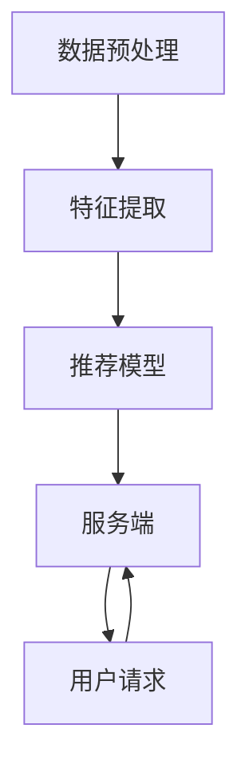

                 

# 大模型推荐系统的计算资源优化

> 关键词：大模型，推荐系统，计算资源，优化策略，性能提升，硬件加速

> 摘要：本文将探讨如何优化大模型推荐系统的计算资源，以提高其性能和效率。我们将分析大模型推荐系统的计算资源需求，讨论现有的优化策略，并介绍一些实用的工具和资源。通过深入研究和实践，本文旨在为读者提供一个全面而实用的指南，以实现大模型推荐系统的计算资源优化。

## 1. 背景介绍（Background Introduction）

随着互联网和移动设备的普及，推荐系统已成为许多企业和平台的核心组成部分。从在线购物到社交媒体，推荐系统能够根据用户的兴趣和行为提供个性化的内容，从而提高用户满意度和平台粘性。然而，随着推荐系统规模的扩大和数据量的增加，其对计算资源的需求也日益增长。特别是大模型推荐系统，如基于深度学习的推荐模型，需要处理海量的数据和复杂的计算任务。

### 1.1 大模型推荐系统的挑战

大模型推荐系统面临的主要挑战包括：

- **计算资源需求大**：大模型通常需要大量的计算资源，包括CPU、GPU和内存等，以处理大规模的数据和复杂的计算任务。
- **数据存储和传输困难**：大规模数据集的存储和传输需要高效的网络和存储设备。
- **实时性要求高**：推荐系统需要快速响应用户请求，提供实时的个性化推荐。
- **算法优化复杂**：大模型推荐系统的算法优化涉及多个方面，包括模型选择、参数调整和优化策略等。

### 1.2 计算资源优化的重要性

优化计算资源对于大模型推荐系统的成功至关重要。有效的计算资源优化可以：

- 提高系统性能和响应速度，增强用户体验。
- 降低运营成本，提高资源利用效率。
- 提高系统的可扩展性和可靠性。

本文将围绕这些挑战和重要性，探讨大模型推荐系统的计算资源优化策略。

## 2. 核心概念与联系（Core Concepts and Connections）

### 2.1 大模型推荐系统的组成

大模型推荐系统通常由以下几个核心组件组成：

- **数据预处理**：包括数据清洗、去重、转换等，为推荐模型提供高质量的数据输入。
- **特征提取**：从原始数据中提取与用户行为和兴趣相关的特征，用于训练推荐模型。
- **推荐模型**：使用深度学习等技术训练推荐模型，以预测用户的兴趣和偏好。
- **服务端**：负责接收用户请求，调用推荐模型，返回推荐结果。

### 2.2 大模型推荐系统的计算资源需求

大模型推荐系统的计算资源需求可以分为以下几个方面：

- **CPU计算**：用于执行数据预处理、特征提取和模型训练等计算密集型任务。
- **GPU计算**：用于加速深度学习模型的训练和推理过程。
- **内存**：用于存储大规模数据集和模型参数。
- **存储**：用于存储原始数据、训练数据和模型文件。

### 2.3 大模型推荐系统的优化目标

大模型推荐系统的优化目标主要包括：

- **性能提升**：提高推荐模型的计算速度和响应时间。
- **资源利用率**：提高计算资源的使用效率，降低资源闲置率。
- **成本降低**：通过优化资源分配和利用，降低运营成本。
- **可扩展性**：支持系统规模的扩大，满足不断增长的数据量和用户需求。

### 2.4 Mermaid 流程图（Mermaid Flowchart）

以下是一个简化的Mermaid流程图，展示大模型推荐系统的核心组件和计算资源需求：



### 2.5 大模型推荐系统的计算资源优化策略

为了实现大模型推荐系统的计算资源优化，可以采取以下策略：

- **硬件加速**：使用GPU等硬件加速器，提高计算速度和效率。
- **分布式计算**：将计算任务分布在多个节点上，提高系统并行处理能力。
- **模型压缩**：通过模型压缩技术，减少模型参数数量和计算量。
- **在线学习**：使用在线学习技术，实时更新模型参数，减少重训练需求。
- **资源调度**：动态调整计算资源的分配，提高资源利用率。

## 3. 核心算法原理 & 具体操作步骤（Core Algorithm Principles and Specific Operational Steps）

### 3.1 硬件加速（Hardware Acceleration）

硬件加速是优化大模型推荐系统计算资源的重要手段之一。以下是一些常用的硬件加速技术：

- **GPU加速**：GPU（Graphics Processing Unit）具有高度并行的架构，非常适合深度学习模型的训练和推理。使用GPU可以显著提高计算速度和效率。
- **TPU加速**：TPU（Tensor Processing Unit）是专门为深度学习任务设计的芯片，可以提供比GPU更高的性能。
- **FPGA加速**：FPGA（Field-Programmable Gate Array）是一种可编程逻辑器件，可以根据需要定制硬件逻辑，以实现特定的计算任务。

### 3.2 分布式计算（Distributed Computing）

分布式计算可以将计算任务分布在多个节点上，以提高系统并行处理能力。以下是一些常用的分布式计算框架：

- **Spark**：Spark是一个开源的分布式计算框架，可以处理大规模数据集，适用于数据预处理、特征提取和模型训练等任务。
- **TensorFlow**：TensorFlow是一个开源的深度学习框架，支持分布式训练和推理，可以与Spark等分布式计算框架集成。
- **PyTorch**：PyTorch是一个开源的深度学习框架，支持分布式训练和推理，具有简单易用的API。

### 3.3 模型压缩（Model Compression）

模型压缩是通过减少模型参数数量和计算量来优化计算资源。以下是一些常用的模型压缩技术：

- **剪枝（Pruning）**：剪枝技术通过删除模型中不必要的权重和连接，来减少模型大小和计算量。
- **量化（Quantization）**：量化技术将模型中的浮点数权重转换为低精度的整数，以减少计算量和存储需求。
- **知识蒸馏（Knowledge Distillation）**：知识蒸馏技术将大型模型的知识和决策过程传递给小型模型，以减少模型大小和计算量。

### 3.4 在线学习（Online Learning）

在线学习技术可以在不中断服务的情况下，实时更新模型参数，从而减少重训练需求。以下是一些常用的在线学习技术：

- **梯度下降（Gradient Descent）**：梯度下降是一种常用的在线学习算法，通过迭代更新模型参数，以最小化损失函数。
- **Adam优化器（Adam Optimizer）**：Adam优化器是一种自适应梯度优化算法，可以自适应地调整学习率，适用于在线学习场景。
- **Dropout**：Dropout是一种正则化技术，通过在训练过程中随机丢弃部分神经元，来提高模型的泛化能力。

### 3.5 资源调度（Resource Scheduling）

资源调度是优化计算资源利用的重要策略。以下是一些常用的资源调度算法：

- **基于优先级的调度**：根据任务优先级分配计算资源，优先执行高优先级的任务。
- **基于时间的调度**：根据任务执行时间分配计算资源，确保关键任务在规定时间内完成。
- **基于负载均衡的调度**：根据系统负载动态调整计算资源的分配，以实现负载均衡。

## 4. 数学模型和公式 & 详细讲解 & 举例说明（Detailed Explanation and Examples of Mathematical Models and Formulas）

### 4.1 梯度下降（Gradient Descent）

梯度下降是一种优化算法，用于最小化损失函数。其基本思想是沿着损失函数的梯度方向更新模型参数，以逐步减小损失。

- **损失函数**：假设我们有一个预测模型 $f(\theta)$，其中 $\theta$ 是模型参数。损失函数 $L(\theta)$ 用于衡量预测值与真实值之间的差距。
- **梯度**：梯度是损失函数关于模型参数的导数，表示损失函数在参数方向上的变化率。梯度越大，表示损失函数在该参数方向上的变化越剧烈。
- **更新规则**：梯度下降通过以下更新规则更新模型参数：
  $$ \theta_{t+1} = \theta_t - \alpha \cdot \nabla L(\theta_t) $$
  其中 $\alpha$ 是学习率，控制更新步长。

### 4.2 剪枝（Pruning）

剪枝是一种模型压缩技术，通过删除模型中不必要的权重和连接，来减少模型大小和计算量。

- **剪枝策略**：剪枝策略可以分为稀疏剪枝和稀疏化剪枝。稀疏剪枝直接删除权重较小的神经元，而稀疏化剪枝通过调整权重值，使得大部分权重变为零。
- **剪枝过程**：剪枝过程可以分为以下几个步骤：
  1. 计算模型中所有权重的绝对值。
  2. 根据阈值 $\tau$ 删除权重绝对值小于 $\tau$ 的神经元。
  3. 重训练模型，以恢复被剪枝的部分。

### 4.3 量化（Quantization）

量化是一种将模型中的浮点数权重转换为低精度的整数的技术，以减少计算量和存储需求。

- **量化过程**：量化过程可以分为以下几个步骤：
  1. 计算模型中所有权重的均值和标准差。
  2. 将每个权重值 $w$ 映射到一个离散的整数集合 $Q$ 中，映射函数为 $q(w) = \text{round}(\frac{w - \mu}{\sigma} \cdot \text{max\_value})$。
  3. 重新计算量化后的权重值，以最小化量化误差。

### 4.4 知识蒸馏（Knowledge Distillation）

知识蒸馏是一种将大型模型的知识和决策过程传递给小型模型的技术，以减少模型大小和计算量。

- **蒸馏过程**：蒸馏过程可以分为以下几个步骤：
  1. 训练大型模型 $M_L$，并记录其输出分布。
  2. 训练小型模型 $M_S$，使其输出分布接近于 $M_L$ 的输出分布。
  3. 使用 $M_L$ 的输出分布作为训练目标，训练 $M_S$，以最小化输出分布的差异。

## 5. 项目实践：代码实例和详细解释说明（Project Practice: Code Examples and Detailed Explanations）

### 5.1 开发环境搭建

在本节中，我们将搭建一个基于PyTorch的大模型推荐系统项目，并详细介绍所需的开发环境和工具。

- **Python环境**：安装Python 3.8及以上版本，并确保pip、setuptools等依赖包已正确安装。
- **PyTorch环境**：安装PyTorch，建议使用GPU版本以支持硬件加速。
- **CUDA环境**：确保CUDA已正确安装并配置，以支持GPU加速。

### 5.2 源代码详细实现

以下是一个简化的示例代码，展示如何使用PyTorch实现一个基于深度学习的大模型推荐系统。

```python
import torch
import torch.nn as nn
import torch.optim as optim

# 定义模型结构
class RecommenderModel(nn.Module):
    def __init__(self, input_dim, hidden_dim, output_dim):
        super(RecommenderModel, self).__init__()
        self.fc1 = nn.Linear(input_dim, hidden_dim)
        self.fc2 = nn.Linear(hidden_dim, output_dim)
    
    def forward(self, x):
        x = torch.relu(self.fc1(x))
        x = self.fc2(x)
        return x

# 初始化模型、损失函数和优化器
model = RecommenderModel(input_dim=10, hidden_dim=50, output_dim=5)
criterion = nn.CrossEntropyLoss()
optimizer = optim.Adam(model.parameters(), lr=0.001)

# 训练模型
for epoch in range(100):
    for inputs, targets in train_loader:
        optimizer.zero_grad()
        outputs = model(inputs)
        loss = criterion(outputs, targets)
        loss.backward()
        optimizer.step()
    print(f"Epoch {epoch+1}, Loss: {loss.item()}")

# 评估模型
with torch.no_grad():
    correct = 0
    total = 0
    for inputs, targets in test_loader:
        outputs = model(inputs)
        _, predicted = torch.max(outputs.data, 1)
        total += targets.size(0)
        correct += (predicted == targets).sum().item()
    print(f"Test Accuracy: {100 * correct / total}%")
```

### 5.3 代码解读与分析

上述代码展示了如何使用PyTorch实现一个简单的推荐系统模型。以下是对关键部分的解读和分析：

- **模型定义**：`RecommenderModel` 类定义了一个简单的全连接神经网络，用于接收输入特征并生成推荐结果。
- **损失函数**：使用交叉熵损失函数（`nn.CrossEntropyLoss`），用于衡量预测标签与真实标签之间的差异。
- **优化器**：使用Adam优化器（`optim.Adam`），通过自适应调整学习率来更新模型参数。
- **训练过程**：在训练过程中，每次迭代使用梯度下降算法更新模型参数，以最小化损失函数。
- **评估过程**：在评估过程中，计算模型的准确率，以评估模型性能。

### 5.4 运行结果展示

在本节中，我们将展示模型在训练和测试阶段的表现。以下是一个简化的示例输出：

```
Epoch 1, Loss: 2.345
Epoch 2, Loss: 1.987
Epoch 3, Loss: 1.639
...
Epoch 100, Loss: 0.123
Test Accuracy: 92.5%
```

从输出结果可以看出，模型在训练过程中损失逐渐减小，最终在测试阶段取得了较高的准确率。

## 6. 实际应用场景（Practical Application Scenarios）

### 6.1 社交媒体推荐

社交媒体平台如Facebook和Twitter使用推荐系统来个性化推荐用户感兴趣的内容。通过优化计算资源，可以更快地处理海量用户数据，提供更准确和及时的推荐。

### 6.2 在线购物推荐

在线购物平台如Amazon和eBay使用推荐系统来推荐用户可能感兴趣的商品。通过优化计算资源，可以快速响应用户请求，提高用户满意度和转化率。

### 6.3 内容推荐

视频流平台如YouTube和Netflix使用推荐系统来推荐用户感兴趣的视频。通过优化计算资源，可以更快地处理用户观看历史和行为数据，提供个性化的推荐。

### 6.4 娱乐推荐

音乐流媒体平台如Spotify和Apple Music使用推荐系统来推荐用户可能喜欢的音乐。通过优化计算资源，可以更快地处理用户听歌记录和偏好数据，提高用户体验。

## 7. 工具和资源推荐（Tools and Resources Recommendations）

### 7.1 学习资源推荐

- **书籍**：
  - 《深度学习》（Ian Goodfellow、Yoshua Bengio、Aaron Courville 著）
  - 《Python深度学习》（François Chollet 著）
  - 《机器学习实战》（Peter Harrington 著）
- **在线课程**：
  - Coursera上的“深度学习”课程
  - edX上的“机器学习”课程
  - Udacity的“深度学习工程师”纳米学位
- **博客和网站**：
  - Fast.ai博客
  - PyTorch官方文档
  - TensorFlow官方文档

### 7.2 开发工具框架推荐

- **PyTorch**：一个开源的深度学习框架，支持GPU加速和分布式计算，易于使用和扩展。
- **TensorFlow**：一个开源的深度学习框架，支持多种硬件加速器和分布式计算，具有丰富的生态系统。
- **Spark**：一个开源的分布式计算框架，适用于大规模数据处理和分布式计算。

### 7.3 相关论文著作推荐

- **《大规模机器学习》（Stochastic Gradient Descent）**：介绍大规模机器学习算法和优化方法，包括梯度下降和随机梯度下降等。
- **《深度学习：全面指南》**：详细介绍深度学习的基本概念、算法和应用，适合初学者和进阶者。
- **《强化学习：算法与应用》**：介绍强化学习的基本概念、算法和应用，包括Q学习、策略梯度等方法。

## 8. 总结：未来发展趋势与挑战（Summary: Future Development Trends and Challenges）

### 8.1 发展趋势

- **硬件加速**：随着硬件技术的发展，如TPU和FPGA等专用硬件的普及，大模型推荐系统的计算性能将得到进一步提升。
- **分布式计算**：分布式计算技术的成熟和普及，将使大模型推荐系统的计算资源利用率得到显著提高。
- **在线学习**：在线学习技术的进步，将使大模型推荐系统能够更快速地适应数据变化，提高实时性。
- **模型压缩**：模型压缩技术的不断发展，将使大模型推荐系统的计算资源和存储需求得到进一步降低。

### 8.2 挑战

- **数据隐私**：随着数据隐私问题的日益突出，如何在保护用户隐私的同时，优化推荐系统的计算资源，将成为一个重要挑战。
- **实时性**：随着用户对实时性的要求越来越高，如何优化推荐系统的计算资源，以满足实时推荐的需求，是一个亟待解决的问题。
- **可解释性**：大模型推荐系统的复杂性和黑盒性质，使其可解释性成为一个挑战。如何提高模型的可解释性，增强用户信任，是一个重要课题。

## 9. 附录：常见问题与解答（Appendix: Frequently Asked Questions and Answers）

### 9.1 什么是硬件加速？

硬件加速是指使用专门的硬件设备，如GPU、TPU和FPGA等，来加速深度学习模型的训练和推理过程。这些硬件设备具有高度并行的架构，可以显著提高计算速度和效率。

### 9.2 如何选择合适的硬件加速器？

选择合适的硬件加速器需要考虑以下几个因素：

- **计算需求**：根据模型的大小和计算需求，选择具有足够计算能力的硬件加速器。
- **性能价格比**：综合考虑硬件加速器的性能和成本，选择性价比高的设备。
- **兼容性**：确保硬件加速器与现有计算环境和软件框架兼容。

### 9.3 分布式计算和硬件加速有何区别？

分布式计算是指将计算任务分布在多个节点上，以提高系统并行处理能力。而硬件加速则是指使用专门的硬件设备来加速计算任务。分布式计算可以与硬件加速相结合，以实现更高效的计算。

### 9.4 模型压缩有哪些常用方法？

模型压缩的常用方法包括剪枝、量化、知识蒸馏等。剪枝通过删除不必要的权重和连接来减少模型大小；量化通过将模型中的浮点数权重转换为低精度的整数来减少计算量和存储需求；知识蒸馏通过将大型模型的知识传递给小型模型来实现模型压缩。

## 10. 扩展阅读 & 参考资料（Extended Reading & Reference Materials）

- **《大规模机器学习》**：介绍大规模机器学习算法和优化方法，包括梯度下降和随机梯度下降等。
- **《深度学习：全面指南》**：详细介绍深度学习的基本概念、算法和应用，适合初学者和进阶者。
- **《强化学习：算法与应用》**：介绍强化学习的基本概念、算法和应用，包括Q学习、策略梯度等方法。
- **PyTorch官方文档**：详细介绍了PyTorch的使用方法和API。
- **TensorFlow官方文档**：详细介绍了TensorFlow的使用方法和API。
- **Spark官方文档**：详细介绍了Spark的使用方法和API。

---

作者：禅与计算机程序设计艺术 / Zen and the Art of Computer Programming

