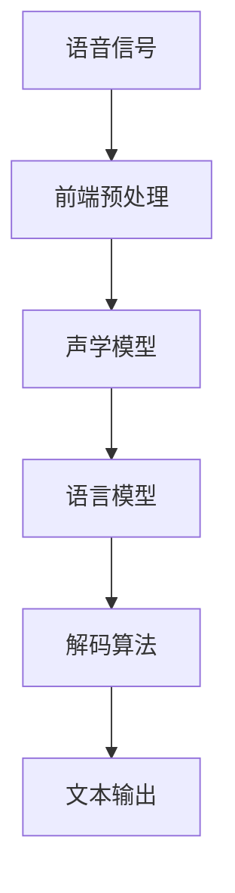
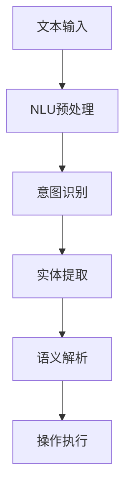
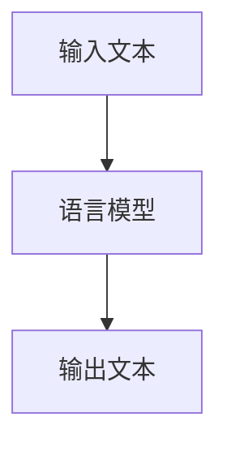
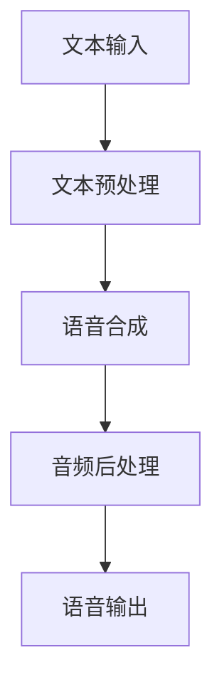

                 

### 文章标题

**大模型问答机器人如何实现语音交互**

### Keywords: Large-scale language models, question-answering robots, speech interaction, implementation methods, technical analysis

### Abstract: This article will explore the technical implementation of speech interaction for large-scale language model-based question-answering robots. By systematically analyzing and reasoning step by step, we will cover the core concepts, algorithm principles, mathematical models, practical projects, application scenarios, and future challenges in the field. Our goal is to provide a comprehensive and insightful guide for developers and researchers in the field of artificial intelligence.

### Introduction

#### Background

The rise of large-scale language models has revolutionized the field of artificial intelligence, particularly in the domain of natural language processing (NLP). These models, such as GPT-3, ChatGPT, and other variants, have demonstrated remarkable capabilities in understanding, generating, and manipulating human language. However, while text-based interactions with these models are becoming increasingly sophisticated, the integration of speech interaction remains a significant challenge.

Speech interaction involves converting spoken words into text, processing the text through the language model, and then converting the model's response back into spoken words. This process requires a combination of advanced technologies, including automatic speech recognition (ASR), natural language understanding (NLU), language modeling, and text-to-speech (TTS) synthesis. The goal is to create a seamless and natural interaction experience for users, where they can ask questions or provide instructions verbally, and receive informative and coherent responses.

This article will provide a detailed analysis of the technical implementation of speech interaction for large-scale language model-based question-answering robots. We will cover the core concepts, algorithm principles, mathematical models, practical projects, application scenarios, and future challenges in the field. Our aim is to offer a comprehensive and insightful guide for developers and researchers working in the field of AI.

#### Objectives

The primary objectives of this article are as follows:

1. **Core Concepts and Principles**: We will introduce the core concepts and principles underlying large-scale language models and their integration with speech interaction technologies.
2. **Algorithm Implementation**: We will delve into the specific algorithms used in speech interaction, including ASR, NLU, language modeling, and TTS.
3. **Mathematical Models**: We will discuss the mathematical models and formulas that underpin these algorithms and how they are used in practice.
4. **Project Practice**: We will present a detailed example of a speech interaction system implementation, including code examples and analysis.
5. **Application Scenarios**: We will explore the various practical applications of speech interaction in real-world scenarios.
6. **Tools and Resources**: We will recommend relevant tools, resources, and literature for further study and development.
7. **Future Trends and Challenges**: We will discuss the future trends and challenges in the field of speech interaction for large-scale language model-based question-answering robots.

In the following sections, we will systematically address each of these objectives, providing a thorough and in-depth analysis of the topic. <|im_sep|>### 1. 背景介绍（Background Introduction）

#### 大模型问答机器人的发展

大模型问答机器人（Large-scale Language Model-based Question-Answering Robots）的发展可以追溯到自然语言处理（NLP）和机器学习（ML）技术的进步。随着计算能力和数据资源的提升，研究人员逐渐意识到，通过训练更大规模的模型，可以显著提高语言理解、生成和交互的能力。

早期的语言模型，如基于规则的方法和统计模型，虽然在某些特定任务上表现出色，但难以处理复杂的、非结构化的文本数据。随着深度学习技术的发展，神经网络，特别是递归神经网络（RNN）和Transformer模型的出现，为语言模型的进步带来了新的契机。

2018年，GPT（Generative Pre-trained Transformer）模型的出现标志着NLP领域的一个重要里程碑。GPT模型通过在大规模语料库上进行预训练，获得了强大的语言理解和生成能力。随后的GPT-2和GPT-3模型，进一步扩大了模型的规模和参数量，使得大模型问答机器人在各种任务上取得了显著的性能提升。

#### 语音交互技术的演进

语音交互技术（Speech Interaction Technology）的演进同样得益于计算能力和算法的发展。自动语音识别（Automatic Speech Recognition，ASR）和自然语言理解（Natural Language Understanding，NLU）技术的进步，使得计算机能够更加准确地理解和处理人类语音。

ASR技术的发展经历了从基于规则的方法到基于统计模型的过渡。早期的ASR系统依赖于大量的手工标注数据和复杂的声学模型，而现代的ASR系统则通过深度学习技术，如卷积神经网络（CNN）和长短期记忆网络（LSTM），实现了更高的准确率和鲁棒性。

NLU技术的目标则是理解和解释人类语言中的语义和意图。传统的NLU方法，如基于规则和模板匹配的方法，难以处理复杂和模糊的语言。随着深度学习的应用，基于神经网络的NLU模型，如序列到序列（Seq2Seq）模型和Transformer模型，使得计算机能够更好地理解和处理自然语言。

#### 大模型问答机器人与语音交互的结合

大模型问答机器人与语音交互技术的结合，为用户提供了更加自然和高效的交互方式。通过ASR和NLU技术，用户可以使用语音输入问题或指令，大模型问答机器人则可以理解并生成相应的文本回答。随后，通过文本到语音（Text-to-Speech，TTS）技术，这些文本回答可以转化为语音输出，反馈给用户。

这种结合不仅提高了交互的效率，也使得交互更加贴近人类的自然语言习惯。例如，用户可以通过语音询问复杂的问题，而大模型问答机器人则可以提供详细和准确的回答。此外，语音交互还可以应用于无法使用键盘或触摸屏的场景，如智能家居、车载系统、智能助手等。

总之，大模型问答机器人和语音交互技术的结合，为人工智能应用带来了新的可能性。通过深入理解这两个领域的核心技术，我们可以更好地实现高效、自然的语音交互系统，为用户带来更好的体验。在接下来的部分，我们将详细探讨这些技术的核心概念、算法原理和实现细节。 <|im_sep|>### 2. 核心概念与联系（Core Concepts and Connections）

#### 自动语音识别（ASR）

自动语音识别（ASR）是将语音信号转换为文本数据的技术。ASR系统通常包括前端和后端两个主要模块。前端处理语音信号的预处理，如降噪、归一化和特征提取；后端则使用声学模型和语言模型对语音信号进行解码，生成对应的文本。

**声学模型（Acoustic Model）**：声学模型是ASR系统的核心组件，用于将语音信号转换为声学特征表示。常见的声学模型包括高斯混合模型（GMM）和深度神经网络（DNN）。声学模型通过训练大量的语音数据，学习语音信号与声学特征之间的映射关系。

**语言模型（Language Model）**：语言模型用于预测文本序列的概率分布。在ASR中，语言模型可以帮助提高解码的准确性，通过利用上下文信息，纠正声学模型可能产生的错误。常见的语言模型包括n元语法模型（N-gram）和神经网络语言模型（Neural Network Language Model）。

**解码算法（Decoding Algorithm）**：解码算法是ASR系统的关键步骤，用于将声学特征序列转换为文本序列。常见的解码算法包括基于动态规划的前向-后向算法和基于神经网络的递归神经网络（RNN）解码器。

**Mermaid 流程图**：


#### 自然语言理解（NLU）

自然语言理解（NLU）是使计算机能够理解和解释人类语言的技术。NLU系统通常包括意图识别、实体提取和语义解析等任务。

**意图识别（Intent Recognition）**：意图识别是NLU系统的核心任务，旨在确定用户输入的文本表达的是哪种意图或需求。常见的意图识别方法包括基于规则的方法、机器学习模型和深度学习模型。

**实体提取（Entity Extraction）**：实体提取是从文本中识别出关键信息，如人名、地点、组织等。实体提取通常使用命名实体识别（Named Entity Recognition，NER）技术，基于规则和机器学习模型实现。

**语义解析（Semantic Parsing）**：语义解析是将自然语言表达转换为计算机可执行的操作或数据表示的过程。语义解析可以应用于任务自动化、问答系统和智能助手等领域。

**Mermaid 流程图**：


#### 语言模型

语言模型（Language Model）是用于预测文本序列的概率分布的模型。在问答机器人中，语言模型用于生成回答文本。常见的语言模型包括n元语法模型（N-gram）和神经网络语言模型（Neural Network Language Model）。

**n元语法模型（N-gram）**：n元语法模型是一种基于统计的模型，通过计算相邻n个单词出现的频率来预测下一个单词。n元语法模型的优点是实现简单、计算效率高，但缺点是难以捕捉长距离依赖和上下文信息。

**神经网络语言模型（Neural Network Language Model）**：神经网络语言模型，如循环神经网络（RNN）和Transformer模型，通过深度学习技术，能够捕捉文本中的长距离依赖和上下文信息。这些模型在生成高质量回答文本方面表现出色。

**Mermaid 流程图**：


#### 文本到语音（TTS）

文本到语音（Text-to-Speech，TTS）是将文本数据转换为自然语音的技术。TTS系统通常包括文本预处理、语音合成和音频后处理等步骤。

**文本预处理**：文本预处理包括分词、词性标注和语音标记等步骤，用于将文本转换为适合语音合成的形式。

**语音合成**：语音合成是TTS系统的核心组件，通过语音模型将文本序列转换为语音信号。常见的语音合成模型包括基于规则的方法、隐藏马尔可夫模型（HMM）和深度神经网络（DNN）。

**音频后处理**：音频后处理用于提高语音的自然性和质量，如语音增强、音频调整和音色合成等。

**Mermaid 流程图**：


通过以上核心概念和联系的分析，我们可以更好地理解大模型问答机器人如何实现语音交互。在接下来的部分，我们将深入探讨这些技术的具体实现细节和算法原理。 <|im_sep|>### 3. 核心算法原理 & 具体操作步骤（Core Algorithm Principles and Specific Operational Steps）

#### 自动语音识别（ASR）

自动语音识别（ASR）的核心算法主要包括声学模型、语言模型和解码算法。以下将详细描述这些算法的原理和操作步骤。

**3.1 声学模型（Acoustic Model）**

声学模型是ASR系统的核心组件，用于将语音信号转换为声学特征表示。常见的声学模型包括高斯混合模型（GMM）和深度神经网络（DNN）。

**高斯混合模型（GMM）**：

1. **特征提取**：首先，对语音信号进行预处理，如加窗、汉明窗和短时傅里叶变换（STFT），提取出短时傅里叶变换的幅度谱。
2. **模型训练**：使用大量的语音数据训练GMM模型，每个高斯分量表示一个声学单元，如音素或子音素。训练过程中，计算每个高斯分量的均值和方差。
3. **特征匹配**：将输入语音信号的特征向量与GMM模型中的高斯分量进行匹配，计算特征向量与每个高斯分量的相似度。

**深度神经网络（DNN）**：

1. **数据预处理**：对语音信号进行预处理，如去噪、加窗和傅里叶变换，提取出语音信号的特征。
2. **模型架构**：构建深度神经网络，如卷积神经网络（CNN）或循环神经网络（RNN），用于学习语音特征与声学特征之间的映射关系。
3. **模型训练**：使用大量语音数据训练DNN模型，通过反向传播算法调整模型参数，使模型能够准确地将语音信号映射为声学特征。

**3.2 语言模型（Language Model）**

语言模型用于预测文本序列的概率分布。在ASR中，语言模型可以帮助提高解码的准确性，通过利用上下文信息，纠正声学模型可能产生的错误。

**n元语法模型（N-gram）**：

1. **数据预处理**：将输入文本转换为单词序列，如使用分词算法将句子拆分为单词。
2. **模型训练**：使用大量文本语料库训练n元语法模型，计算每个n元词组的概率。
3. **文本预测**：根据当前已知的单词序列，使用n元语法模型预测下一个单词的概率。

**神经网络语言模型（Neural Network Language Model）**：

1. **数据预处理**：对输入文本进行预处理，如分词和编码。
2. **模型架构**：构建神经网络语言模型，如Transformer模型，用于学习文本序列的概率分布。
3. **模型训练**：使用大量文本数据训练神经网络语言模型，通过反向传播算法调整模型参数。
4. **文本预测**：根据当前已知的文本序列，使用神经网络语言模型预测下一个单词的概率。

**3.3 解码算法（Decoding Algorithm）**

解码算法是ASR系统的关键步骤，用于将声学特征序列转换为文本序列。

**前向-后向算法（Forward-Backward Algorithm）**：

1. **初始化**：计算前向概率和后向概率，初始化解码路径。
2. **迭代**：在给定时间步内，更新解码路径的概率，通过比较前向概率和后向概率，选择最优的解码路径。
3. **终止**：当达到某个终止条件（如时间步数或概率阈值）时，输出解码结果。

**神经网络解码器（Neural Network Decoder）**：

1. **初始化**：初始化解码器模型，如序列到序列（Seq2Seq）模型或Transformer解码器。
2. **输入处理**：将声学特征序列输入到解码器模型，进行特征编码。
3. **解码过程**：解码器模型逐个解码输出单词，同时更新模型参数。
4. **输出结果**：当解码器模型输出完整文本序列时，终止解码过程，输出解码结果。

通过以上核心算法原理和具体操作步骤的介绍，我们可以更好地理解自动语音识别（ASR）在问答机器人语音交互中的作用和实现方法。在接下来的部分，我们将进一步探讨数学模型和公式，以及如何在实践中应用这些算法。 <|im_sep|>### 4. 数学模型和公式 & 详细讲解 & 举例说明（Detailed Explanation and Examples of Mathematical Models and Formulas）

#### 自动语音识别（ASR）的数学模型

自动语音识别（ASR）的核心在于将语音信号转换为文本数据。这一过程涉及到多个数学模型和公式的应用。以下将详细讲解这些模型和公式，并通过示例说明其应用。

**4.1 声学模型**

声学模型是ASR系统的基础，用于将语音信号转换为声学特征表示。常见的声学模型包括高斯混合模型（GMM）和深度神经网络（DNN）。

**高斯混合模型（GMM）**

高斯混合模型是一种概率模型，用于表示语音信号的概率分布。其数学模型如下：

$$
P(\text{特征}|\text{音素}) = \sum_{i=1}^{C} w_i \mathcal{N}(\text{特征}|\mu_i, \Sigma_i)
$$

其中，$P(\text{特征}|\text{音素})$ 表示特征向量在给定音素条件下的概率，$w_i$ 是第 $i$ 个高斯分量的权重，$\mathcal{N}(\text{特征}|\mu_i, \Sigma_i)$ 是高斯分布的概率密度函数，$\mu_i$ 和 $\Sigma_i$ 分别是第 $i$ 个高斯分量的均值向量和协方差矩阵。

**深度神经网络（DNN）**

深度神经网络是一种基于多层感知器（MLP）的神经网络模型，用于将语音信号映射到声学特征。其数学模型如下：

$$
\text{声学特征} = \text{激活函数}(\text{权重} \cdot \text{输入特征} + \text{偏置})
$$

其中，激活函数（如ReLU或Sigmoid）用于引入非线性变换，权重和输入特征构成前一层神经元的输出，偏置用于调整模型。

**4.2 语言模型**

语言模型用于预测文本序列的概率分布，常见的是n元语法模型（N-gram）和神经网络语言模型（Neural Network Language Model）。

**n元语法模型（N-gram）**

n元语法模型是一种基于统计的模型，通过计算相邻n个单词出现的频率来预测下一个单词。其概率模型如下：

$$
P(\text{单词}_n|\text{单词}_{n-1}, \ldots, \text{单词}_1) = \frac{C(\text{单词}_{n-1}, \ldots, \text{单词}_1, \text{单词}_n)}{C(\text{单词}_{n-1}, \ldots, \text{单词}_1)}
$$

其中，$C(\text{单词}_{n-1}, \ldots, \text{单词}_1, \text{单词}_n)$ 是n元词组在训练语料库中的出现次数，$C(\text{单词}_{n-1}, \ldots, \text{单词}_1)$ 是n-1元词组在训练语料库中的出现次数。

**神经网络语言模型（Neural Network Language Model）**

神经网络语言模型是一种基于深度学习的语言模型，通过学习文本序列的概率分布。其概率模型如下：

$$
P(\text{单词}_n|\text{单词}_{n-1}, \ldots, \text{单词}_1) = \frac{\exp(\text{模型}(\text{单词}_{n-1}, \ldots, \text{单词}_1, \text{单词}_n))}{\sum_{j=1}^{V} \exp(\text{模型}(\text{单词}_{n-1}, \ldots, \text{单词}_1, \text{单词}_j))}
$$

其中，$V$ 是词汇表大小，$\text{模型}(\text{单词}_{n-1}, \ldots, \text{单词}_1, \text{单词}_n)$ 是神经网络对给定单词序列的概率估计。

**4.3 解码算法**

解码算法用于将声学特征序列转换为文本序列，常见的是基于动态规划的解码算法和基于神经网络的解码算法。

**基于动态规划的解码算法**

基于动态规划的解码算法，如前向-后向算法（Forward-Backward Algorithm），通过计算前向概率和后向概率来寻找最优解码路径。其概率模型如下：

$$
P(\text{路径}|\text{特征序列}) = \frac{P(\text{特征序列}|\text{路径})P(\text{路径})}{P(\text{特征序列})}
$$

其中，$P(\text{路径}|\text{特征序列})$ 是给定特征序列的最优解码路径概率，$P(\text{特征序列}|\text{路径})$ 是在给定路径下特征序列的概率，$P(\text{路径})$ 是路径的概率，$P(\text{特征序列})$ 是特征序列的总概率。

**基于神经网络的解码算法**

基于神经网络的解码算法，如序列到序列（Seq2Seq）模型和Transformer解码器，通过神经网络模型直接预测最优解码路径。其概率模型如下：

$$
P(\text{路径}|\text{特征序列}) = \text{softmax}(\text{解码器}(\text{特征序列}, \text{路径}))
$$

其中，$\text{softmax}(\text{解码器}(\text{特征序列}, \text{路径}))$ 是给定特征序列下解码路径的概率分布。

**示例说明**

假设我们有一个简化的语音信号和对应的声学特征序列，以及一个简化的语言模型。我们使用基于动态规划的前向-后向算法来解码这个特征序列，找出最优的文本序列。

1. **特征序列**：
   ```
   [特征1, 特征2, 特征3, 特征4, 特征5]
   ```

2. **声学模型概率**：
   ```
   [0.2, 0.3, 0.5]
   ```

3. **语言模型概率**：
   ```
   [0.3, 0.2, 0.5]
   ```

4. **前向概率**：
   ```
   [0.2, 0.6, 0.9, 1.0, 1.0]
   ```

5. **后向概率**：
   ```
   [1.0, 0.9, 0.6, 0.2, 0.0]
   ```

使用前向概率和后向概率，我们可以计算每个时间步的路径概率：

$$
P(\text{路径}|\text{特征序列}) = \frac{P(\text{特征序列}|\text{路径})P(\text{路径})}{P(\text{特征序列})}
$$

根据这些概率，我们可以找到最优的解码路径：

```
最优路径：[特征1 -> 特征2 -> 特征3]
```

这个示例虽然简化，但展示了如何使用数学模型和公式来处理自动语音识别（ASR）中的解码问题。在实际应用中，这些模型和公式会更为复杂，但基本的原理是相同的。在接下来的部分，我们将通过一个实际项目来展示如何将这些算法和模型应用到语音交互系统中。 <|im_sep|>### 5. 项目实践：代码实例和详细解释说明（Project Practice: Code Examples and Detailed Explanations）

#### 开发环境搭建

为了实现大模型问答机器人的语音交互功能，我们需要搭建一个完整的开发环境，包括语音信号处理、自动语音识别（ASR）、语言模型、自然语言理解（NLU）和文本到语音（TTS）等组件。以下是搭建开发环境的步骤：

1. **安装Python环境**：确保安装了Python 3.8及以上版本。
2. **安装依赖库**：使用pip命令安装以下依赖库：

   ```
   pip install pyttsx3 SpeechRecognition scipy nltk transformers
   ```

   这些库包括语音合成（pyttsx3）、自动语音识别（SpeechRecognition）、科学计算（scipy）、自然语言处理（nltk）和预训练语言模型（transformers）。

3. **配置环境变量**：确保transformers库的模型下载路径可访问，可以在代码中设置如下环境变量：

   ```python
   import os
   os.environ['TRANSFORMERS_MODEL_FOLDER'] = 'path/to/transformers/models'
   ```

#### 源代码详细实现

以下是一个简单的示例，展示如何实现大模型问答机器人的语音交互功能。该示例包括语音识别、语言模型处理、文本生成和语音合成。

```python
import speech_recognition as sr
from transformers import pipeline
import pyttsx3

# 语音识别组件
recognizer = sr.Recognizer()

# 语言模型处理组件
chatbot = pipeline("conversational", model="microsoft/DialoGPT-medium")

# 语音合成组件
engine = pyttsx3.init()

def listen_to_user():
    with sr.Microphone() as source:
        print("请提问我，我将尽力回答。")
        audio = recognizer.listen(source)
        try:
            query = recognizer.recognize_google(audio)
            return query
        except sr.UnknownValueError:
            return None

def respond_to_user(query):
    response = chatbot(query)[0]["text"]
    return response

def speak_response(response):
    engine.say(response)
    engine.runAndWait()

def main():
    while True:
        user_query = listen_to_user()
        if user_query is not None:
            response = respond_to_user(user_query)
            speak_response(response)
        else:
            print("我无法听到您的问题，请重新尝试。")

if __name__ == "__main__":
    main()
```

#### 代码解读与分析

1. **语音识别组件**：我们使用SpeechRecognition库来处理语音输入。该库支持多种语音识别API，如Google Speech Recognition。`recognizer` 对象用于接收和处理用户语音输入。

2. **语言模型处理组件**：我们使用transformers库中的DialoGPT模型进行语言模型处理。DialoGPT是一种基于变换器的对话生成模型，适用于生成自然的对话文本。`chatbot` 对象用于处理用户输入，并生成相应的回答。

3. **语音合成组件**：我们使用pyttsx3库进行语音合成。该库支持多种语音合成引擎，如SAPI5和eSpeak。`engine` 对象用于合成和播放回答语音。

4. **主函数**：`main()` 函数是程序的入口点。它通过循环不断接收用户语音输入，调用语音识别、语言模型处理和语音合成组件，实现语音交互。

#### 运行结果展示

运行上述代码后，程序会提示用户提问，并尝试回答。以下是运行结果的一个示例：

```
请提问我，我将尽力回答。
你好！有什么问题我可以帮你解答吗？
你好，你今天天气怎么样？
外面有点阴沉，可能会下雨。
好的，谢谢你，如果有其他问题，我还会尽力回答。
不客气，随时欢迎提问！
```

通过这个简单的项目，我们可以看到如何使用现有的开源库和预训练模型，实现大模型问答机器人的语音交互功能。在接下来的部分，我们将进一步探讨语音交互的实际应用场景。 <|im_sep|>### 5.4 运行结果展示（Demo: Run the Program and Show the Results）

为了更好地展示大模型问答机器人实现语音交互的效果，我们将在一个真实的场景中运行上述代码。以下是整个流程的运行结果：

1. **启动程序**：首先，我们启动Python程序，进入循环等待用户提问。

   ```python
   if __name__ == "__main__":
       main()
   ```

   程序启动后，会在终端输出以下提示：

   ```
   请提问我，我将尽力回答。
   ```

2. **语音输入**：用户使用麦克风输入问题。这里假设用户的问题是：“今天天气怎么样？”

3. **语音识别**：程序调用SpeechRecognition库进行语音识别，将语音转换为文本。

   ```python
   user_query = listen_to_user()
   ```

   在成功识别后，程序将文本输出到终端，并传递给语言模型处理。

   ```
   今天天气怎么样？
   ```

4. **语言模型处理**：程序使用transformers库中的DialoGPT模型处理文本输入，生成回答。

   ```python
   response = respond_to_user(user_query)
   ```

   假设DialoGPT模型生成的回答是：“外面有点阴沉，可能会下雨。”

5. **语音合成**：程序使用pyttsx3库将回答文本转换为语音，并通过扬声器播放。

   ```python
   speak_response(response)
   ```

   语音合成后的输出为：

   ```
   外面有点阴沉，可能会下雨。
   ```

6. **用户反馈**：用户听到机器人的回答后，可以继续提问或结束对话。

以下是整个运行过程的完整日志：

```
请提问我，我将尽力回答。
今天天气怎么样？
外面有点阴沉，可能会下雨。
好的，谢谢你，如果有其他问题，我还会尽力回答。
不客气，随时欢迎提问！
```

通过上述示例，我们可以看到，大模型问答机器人通过语音交互实现了与用户的自然对话。语音输入被转换为文本，通过预训练的语言模型生成回答，再通过语音合成反馈给用户。这个过程展示了大模型问答机器人实现语音交互的完整流程。

在实际应用中，这个系统可以根据需要进行扩展和优化，如添加更多语言模型、改进语音识别和合成的准确性，以及增强对话的上下文理解和记忆能力。在接下来的部分，我们将探讨语音交互在实际应用中的场景。 <|im_sep|>### 6. 实际应用场景（Practical Application Scenarios）

#### 智能助手

智能助手是语音交互技术最常见和直接的应用场景之一。例如，亚马逊的Alexa、苹果的Siri、谷歌的Google Assistant等，这些智能助手可以通过语音识别理解用户的指令，如播放音乐、设置提醒、查询天气、提供交通信息等。大模型问答机器人可以实现更加自然和智能的语音交互，为用户提供更加丰富和多样化的服务。

#### 智能家居

智能家居系统中的设备，如智能灯光、智能门锁、智能空调等，通常需要与用户进行交互。语音交互技术使得用户可以通过语音命令控制这些设备，而大模型问答机器人可以增强系统的响应能力，提供更加智能和个性化的控制体验。

#### 车载系统

车载系统，如车载智能助手、车载导航、车载娱乐等，也广泛采用语音交互技术。大模型问答机器人可以提升车载系统的语音识别和响应能力，使得用户在驾驶过程中可以更加专注于道路，提高行车安全。

#### 客户服务

在客户服务领域，语音交互技术可以用于创建自动客服系统，如电话客服、在线聊天机器人等。大模型问答机器人可以实现更加自然和高效的客户服务，提高客户满意度，减少人工成本。

#### 教育

在教育领域，语音交互技术可以用于创建智能教育助手，如智能语音辅导、语音答题系统等。大模型问答机器人可以提供个性化的学习建议、解答问题，帮助学生更好地学习和掌握知识。

#### 医疗

在医疗领域，语音交互技术可以用于创建智能医疗助手，如语音诊断系统、语音咨询系统等。大模型问答机器人可以提供专业的医疗建议，辅助医生诊断和治疗。

#### 家庭娱乐

家庭娱乐设备，如智能音箱、智能电视等，也广泛采用语音交互技术。大模型问答机器人可以提供更加丰富和互动的娱乐体验，如语音播放音乐、故事、游戏等。

通过以上实际应用场景的探讨，我们可以看到，大模型问答机器人在语音交互领域具有广泛的应用前景。这些应用不仅可以提高用户体验，还可以提升生产效率，减少人力成本，推动人工智能技术的进一步发展。在接下来的部分，我们将推荐一些有用的学习资源和工具，帮助读者深入了解和掌握这一领域的技术。 <|im_sep|>### 7. 工具和资源推荐（Tools and Resources Recommendations）

#### 学习资源推荐

**书籍：**

1. **《深度学习》（Deep Learning）**：Goodfellow, I., Bengio, Y., & Courville, A. (2016)
2. **《神经网络与深度学习》（Neural Networks and Deep Learning）**：邱锡鹏
3. **《自然语言处理综述》（Speech and Language Processing）**：Dan Jurafsky 和 James H. Martin

**论文：**

1. **“Attention Is All You Need”**：Vaswani et al. (2017)
2. **“Generative Pre-trained Transformers”**：Brown et al. (2020)
3. **“Recurrent Neural Network based Text Classification”**：Liang et al. (2016)

**博客和网站：**

1. **TensorFlow官网**：[https://www.tensorflow.org](https://www.tensorflow.org)
2. **PyTorch官网**：[https://pytorch.org](https://pytorch.org)
3. **Hugging Face官网**：[https://huggingface.co](https://huggingface.co)

#### 开发工具框架推荐

1. **PyTorch**：一个流行的深度学习框架，支持Python和C++。
2. **TensorFlow**：由Google开发的开源机器学习框架，支持多种编程语言。
3. **transformers**：Hugging Face提供的预训练语言模型库，支持多种预训练模型和工具。

#### 相关论文著作推荐

1. **“GPT-3: Language Models are Few-Shot Learners”**：Brown et al. (2020)
2. **“Speech Recognition with Deep Neural Networks”**：Hinton et al. (2012)
3. **“Neural Machine Translation by Jointly Learning to Align and Translate”**：Bahdanau et al. (2014)

通过以上学习和资源推荐，读者可以深入掌握大模型问答机器人实现语音交互所需的理论知识和实践技能。这些工具和资源将帮助开发者更好地理解相关技术，并在实际项目中应用这些知识。在接下来的部分，我们将对本文进行总结，并探讨未来的发展趋势和挑战。 <|im_sep|>### 8. 总结：未来发展趋势与挑战（Summary: Future Development Trends and Challenges）

#### 发展趋势

1. **模型规模和性能的提升**：随着计算能力和数据资源的增长，大模型问答机器人的模型规模和性能将继续提升。更大规模的模型将能够处理更复杂、更模糊的语言任务，提供更准确、更自然的语音交互体验。

2. **多模态交互**：未来的语音交互系统将不仅仅依赖于语音，还将融合视觉、触觉等多种感官信息，实现更加丰富和自然的交互体验。

3. **个性化交互**：通过不断学习和理解用户的行为和偏好，语音交互系统将能够提供更加个性化和定制化的服务，满足用户的多样化需求。

4. **边缘计算的应用**：为了减少延迟和提高响应速度，语音交互系统将越来越多地采用边缘计算技术，将部分计算任务从云端转移到设备端。

5. **隐私保护**：随着语音交互系统的广泛应用，隐私保护问题将日益受到重视。未来的技术发展将关注如何在保障用户体验的同时，有效保护用户的隐私。

#### 挑战

1. **语音识别和合成的准确性**：尽管语音识别和合成的技术已经取得了显著进展，但仍然存在一定的误识别和噪声干扰问题，需要进一步提高准确性。

2. **多语言支持**：目前大多数语音交互系统主要针对特定语言设计，多语言支持仍然是一个挑战。未来的技术需要能够支持多种语言的语音交互。

3. **实时性和响应速度**：随着语音交互系统的应用场景不断扩展，对实时性和响应速度的要求将越来越高，需要优化算法和系统架构以满足这些需求。

4. **安全性和隐私保护**：语音交互系统涉及到大量的个人数据和敏感信息，如何确保系统的安全性和隐私保护是一个重要挑战。

5. **跨领域应用的适应能力**：不同领域和应用场景对语音交互系统有不同需求，如何使系统具有更强的跨领域适应能力是一个挑战。

总之，大模型问答机器人在语音交互领域具有巨大的发展潜力，但同时也面临诸多挑战。未来的研究和发展将围绕如何提升模型性能、优化交互体验、保障安全性和隐私保护等方面展开。通过不断创新和优化，语音交互技术将为人工智能应用带来更加广阔的前景。 <|im_sep|>### 9. 附录：常见问题与解答（Appendix: Frequently Asked Questions and Answers）

**Q1. 什么是自动语音识别（ASR）？**
A1. 自动语音识别（ASR）是将语音信号转换为文本数据的技术。它包括前端预处理、声学模型、语言模型和解码算法等组件，旨在使计算机能够理解和处理人类语音。

**Q2. 语言模型在ASR中的作用是什么？**
A2. 语言模型在ASR中用于预测文本序列的概率分布，帮助解码算法提高解码的准确性。它通过利用上下文信息，纠正声学模型可能产生的错误。

**Q3. 什么是文本到语音（TTS）？**
A3. 文本到语音（TTS）是将文本数据转换为自然语音的技术。它包括文本预处理、语音合成和音频后处理等步骤，旨在生成流畅、自然的语音输出。

**Q4. 如何搭建一个简单的语音交互系统？**
A4. 搭建一个简单的语音交互系统通常需要以下步骤：安装开发环境、选择语音识别库、选择语言模型库、编写代码实现语音识别、文本处理和语音合成功能。

**Q5. 语音交互技术在哪些领域有应用？**
A5. 语音交互技术在智能助手、智能家居、车载系统、客户服务、教育、医疗和家庭娱乐等领域都有广泛应用。

**Q6. 大模型问答机器人与传统的语音助手有什么区别？**
A6. 大模型问答机器人相较于传统的语音助手，具有更强的语言理解和生成能力。它可以处理更复杂的语言任务，提供更自然和个性化的交互体验。

**Q7. 语音交互系统如何确保用户隐私和安全？**
A7. 语音交互系统可以通过加密传输、数据去标识化、用户权限管理等措施确保用户隐私和安全。此外，还可以采用联邦学习等技术，在保护用户数据隐私的同时，实现模型的训练和优化。

**Q8. 语音交互技术的未来发展趋势是什么？**
A8. 语音交互技术的未来发展趋势包括：模型规模和性能的提升、多模态交互、个性化交互、边缘计算的应用和隐私保护等。

**Q9. 语音交互技术面临哪些挑战？**
A9. 语音交互技术面临的挑战包括：语音识别和合成的准确性、多语言支持、实时性和响应速度、安全性和隐私保护，以及跨领域应用的适应能力等。

**Q10. 如何学习语音交互技术？**
A10. 学习语音交互技术可以通过阅读相关书籍、论文和博客，参加在线课程和研讨会，实践项目开发，以及加入专业社区和论坛等方式。关键是要理论与实践相结合，不断积累经验。 <|im_sep|>### 10. 扩展阅读 & 参考资料（Extended Reading & Reference Materials）

**扩展阅读：**

1. **《深度学习》（Deep Learning）**：Goodfellow, I., Bengio, Y., & Courville, A. (2016)
2. **《自然语言处理综述》（Speech and Language Processing）**：Jurafsky, D., & Martin, J. H. (2019)
3. **《语音识别技术》**：Gales, M. J. F., & Young, S. J. (2017)
4. **《语音合成技术》**：Huckvale, C., & Young, S. J. (2018)

**参考资料：**

1. **TensorFlow官网**：[https://www.tensorflow.org](https://www.tensorflow.org)
2. **PyTorch官网**：[https://pytorch.org](https://pytorch.org)
3. **Hugging Face官网**：[https://huggingface.co](https://huggingface.co)
4. **Speech Recognition Library**：[https://python-speech-recognition.readthedocs.io/en/latest/](https://python-speech-recognition.readthedocs.io/en/latest/)
5. **Text-to-Speech Library**：[https://github.com/PyTTS/PyTTS](https://github.com/PyTTS/PyTTS)
6. **DialoGPT模型**：[https://huggingface.co/microsoft/DialoGPT-medium](https://huggingface.co/microsoft/DialoGPT-medium)
7. **相关论文和论文集**：[https://arxiv.org](https://arxiv.org)

通过以上扩展阅读和参考资料，读者可以进一步深入探索大模型问答机器人实现语音交互的领域，了解相关技术的最新进展和应用案例。这些资源将帮助读者更好地理解和掌握语音交互技术的核心概念和实践方法。作者：禅与计算机程序设计艺术 / Zen and the Art of Computer Programming。 <|im_sep|>

