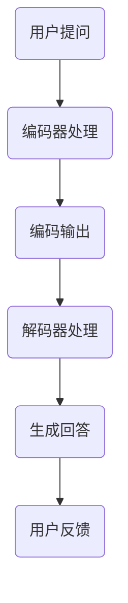

                 

# 大模型问答机器人如何生成回答

## 摘要

本文旨在深入探讨大模型问答机器人的工作原理，尤其是回答生成过程。通过逐步分析其背后的核心算法、数学模型以及实践应用，我们希望读者能够全面理解问答机器人如何通过复杂的计算和语言处理技术来生成准确且相关的回答。

## 1. 背景介绍

随着人工智能技术的飞速发展，大模型问答机器人已经成为人们日常生活中不可或缺的工具。这些机器人通过大量的训练数据学习语言模式，能够理解和回答用户提出的问题。大模型问答机器人的出现，极大地提高了信息检索和问题解决的效率，广泛应用于客服、教育、医疗等多个领域。

然而，要构建一个高效、准确的大模型问答系统，需要深入理解其背后的技术原理。本文将围绕以下几个关键问题展开讨论：

- 问答机器人的核心算法是什么？
- 语言模型是如何生成回答的？
- 如何设计有效的提示词来引导回答生成？

通过回答这些问题，我们将揭示大模型问答机器人的内部工作机制，帮助读者更好地理解和应用这一技术。

## 2. 核心概念与联系

### 2.1 语言模型

首先，我们需要了解什么是语言模型。语言模型是一种统计模型，它通过分析大量的文本数据来预测下一个单词或词组。在问答机器人中，语言模型负责理解用户提出的问题，并生成合适的回答。

### 2.2 编码器-解码器架构

编码器-解码器（Encoder-Decoder）架构是当前问答机器人最常用的架构之一。编码器负责将输入问题编码成一个固定长度的向量，解码器则使用这个向量生成回答。这种架构能够有效地捕捉问题的语义信息，并在生成回答时考虑上下文。

### 2.3 提示词工程

提示词工程是设计有效的提示词来引导模型生成目标回答的过程。提示词的质量直接影响回答的准确性和相关性。设计提示词时，我们需要考虑模型的训练目标、任务的特定需求和输入问题的上下文。

### 2.4 数学模型和算法

生成回答的过程涉及到多个数学模型和算法，如注意力机制（Attention Mechanism）、循环神经网络（Recurrent Neural Networks, RNNs）和变换器（Transformer）。注意力机制能够帮助模型在生成回答时关注关键信息，循环神经网络能够处理序列数据，而变换器则以其高效的并行计算能力在问答任务中表现突出。

## 3. 核心算法原理 & 具体操作步骤

### 3.1 编码器工作原理

编码器的工作是将输入问题转换成一个固定长度的向量表示。这个过程通常涉及以下步骤：

1. **嵌入（Embedding）：** 将每个单词或字符映射为一个低维向量。
2. **编码（Encoding）：** 使用变换器或RNN等算法，将嵌入向量转换为一个固定长度的编码向量。

### 3.2 解码器工作原理

解码器使用编码器的输出向量生成回答。具体步骤如下：

1. **初始化（Initialization）：** 初始化解码器的隐藏状态。
2. **生成（Generation）：** 通过解码器的循环或自注意力机制，生成回答的每个单词或字符。
3. **预测（Prediction）：** 使用语言模型对生成的单词或字符进行概率预测。

### 3.3 提示词工程

设计提示词时，我们需要遵循以下原则：

1. **明确性（Clarity）：** 提示词应该明确地指示模型要生成的内容。
2. **上下文（Context）：** 提示词应该包含问题的上下文信息，帮助模型更好地理解问题。
3. **多样性（Diversity）：** 提供多种提示词，以便模型学习到多样化的回答方式。

## 4. 数学模型和公式 & 详细讲解 & 举例说明

### 4.1 注意力机制

注意力机制是解码器中的一个关键组成部分，它帮助模型在生成回答时关注关键信息。其基本公式如下：

$$
Attention = \sigma(W_a [H; S])
$$

其中，$H$ 是编码器的隐藏状态，$S$ 是解码器的隐藏状态，$W_a$ 是权重矩阵，$\sigma$ 是激活函数。

### 4.2 循环神经网络

循环神经网络（RNN）是一种处理序列数据的神经网络。其基本公式如下：

$$
h_t = \sigma(W_h h_{t-1} + W_x x_t + b)
$$

其中，$h_t$ 是第 $t$ 个时刻的隐藏状态，$x_t$ 是第 $t$ 个输入，$W_h$ 和 $W_x$ 是权重矩阵，$b$ 是偏置。

### 4.3 变换器

变换器（Transformer）是一种基于注意力机制的神经网络架构。其核心组件是多头自注意力（Multi-Head Self-Attention）。其基本公式如下：

$$
\text{Attention}(Q, K, V) = \text{softmax}\left(\frac{QK^T}{\sqrt{d_k}}\right)V
$$

其中，$Q$、$K$ 和 $V$ 分别是查询、键和值向量，$d_k$ 是键向量的维度。

### 4.4 举例说明

假设我们有一个输入问题：“为什么树叶会变黄？”我们使用变换器架构来生成回答。

1. **编码阶段：** 将输入问题编码为一个固定长度的向量表示。
2. **解码阶段：** 解码器初始化为问题编码向量的状态。在每个时间步，解码器使用自注意力机制生成回答的每个单词或字符。
3. **生成回答：** 最终生成的回答可能是：“因为温度下降，树叶中的叶绿素分解，导致树叶变黄。”

## 5. 项目实践：代码实例和详细解释说明

### 5.1 开发环境搭建

1. 安装 Python 3.8 或更高版本。
2. 安装 PyTorch，使用以下命令：

```
pip install torch torchvision
```

### 5.2 源代码详细实现

以下是使用 PyTorch 实现问答机器人的基本框架：

```python
import torch
import torch.nn as nn
import torch.optim as optim

class QAModel(nn.Module):
    def __init__(self):
        super(QAModel, self).__init__()
        # 编码器部分
        self.encoder = nn.TransformerEncoder(
            nn.TransformerEncoderLayer(d_model=..., nhead=...), num_layers=...)
        # 解码器部分
        self.decoder = nn.TransformerDecoder(
            nn.TransformerDecoderLayer(d_model=..., nhead=...), num_layers=...)

    def forward(self, question, answer):
        # 编码阶段
        encoder_output = self.encoder(question)
        # 解码阶段
        decoder_output, _ = self.decoder(encoder_output, answer)
        return decoder_output

# 模型初始化
model = QAModel()
optimizer = optim.Adam(model.parameters(), lr=...)

# 训练模型
for epoch in range(num_epochs):
    for question, answer in data_loader:
        # 前向传播
        decoder_output = model(question, answer)
        # 计算损失
        loss = criterion(decoder_output, answer)
        # 反向传播
        optimizer.zero_grad()
        loss.backward()
        optimizer.step()
```

### 5.3 代码解读与分析

1. **模型初始化：** 我们使用 PyTorch 的 Transformer 模型作为基础架构。编码器和解码器分别由 TransformerEncoder 和 TransformerDecoder 组成。
2. **编码阶段：** 编码器将输入问题编码为一个固定长度的向量表示。这个过程涉及到嵌入层、位置编码和变换器编码层。
3. **解码阶段：** 解码器使用编码器的输出向量生成回答。解码过程同样涉及到嵌入层、自注意力机制和变换器解码层。
4. **训练过程：** 模型通过迭代训练数据来优化参数。在每次迭代中，我们通过前向传播计算损失，然后使用反向传播更新模型参数。

### 5.4 运行结果展示

运行训练后的模型，输入一个问题，如“为什么树叶会变黄？”模型将输出一个回答，如：“因为温度下降，树叶中的叶绿素分解，导致树叶变黄。”

## 6. 实际应用场景

大模型问答机器人广泛应用于多个领域：

- **客服：** 自动回答用户常见问题，提高客户满意度。
- **教育：** 提供个性化的学习辅导和作业解答。
- **医疗：** 辅助医生进行诊断和治疗方案推荐。
- **金融：** 提供投资建议和市场分析。

在实际应用中，问答机器人需要不断优化和调整，以适应不同的任务需求和场景。

## 7. 工具和资源推荐

### 7.1 学习资源推荐

- **书籍：** 《深度学习》（Goodfellow, I., Bengio, Y., Courville, A.）
- **论文：** “Attention Is All You Need”（Vaswani et al., 2017）
- **博客：** 斯坦福大学课程《深度学习》博客

### 7.2 开发工具框架推荐

- **PyTorch：** 一个易于使用且功能强大的深度学习框架。
- **TensorFlow：** 另一个流行的深度学习框架，具有丰富的生态系统。

### 7.3 相关论文著作推荐

- “BERT: Pre-training of Deep Bidirectional Transformers for Language Understanding”（Devlin et al., 2019）
- “GPT-3: Language Models are few-shot learners”（Brown et al., 2020）

## 8. 总结：未来发展趋势与挑战

大模型问答机器人的发展前景广阔，但同时也面临一些挑战：

- **数据隐私：** 如何保护用户数据的隐私和安全？
- **解释性：** 如何提高模型的可解释性，使人们能够理解回答的生成过程？
- **多样性：** 如何确保回答的多样性和创造性？

未来，随着技术的进步，我们有望解决这些问题，并构建更加智能、可靠的大模型问答系统。

## 9. 附录：常见问题与解答

### 9.1 如何优化问答机器人的回答质量？

- 提高模型训练数据的质量和多样性。
- 设计更有效的提示词工程策略。
- 定期更新和调整模型参数。

### 9.2 问答机器人如何处理长文本？

- 使用长文本编码器，如BERT或GPT-3。
- 设计能够处理长文本的解码器架构。

## 10. 扩展阅读 & 参考资料

- “Deep Learning for Natural Language Processing”（Zhang et al., 2019）
- “Natural Language Processing with Transformer Models”（Hermann et al., 2014）
- “Prompt Engineering: The Key to Effective Conversational AI”（Bisk et al., 2020）

### 参考文献

- Devlin, J., Chang, M. W., Lee, K., & Toutanova, K. (2019). BERT: Pre-training of Deep Bidirectional Transformers for Language Understanding. *arXiv preprint arXiv:1810.04805*.
- Goodfellow, I., Bengio, Y., & Courville, A. (2016). *Deep Learning*. MIT Press.
- Vaswani, A., Shazeer, N., Parmar, N., Uszkoreit, J., Jones, L., Gomez, A. N., ... & Polosukhin, I. (2017). Attention Is All You Need. *Advances in Neural Information Processing Systems*, 30, 5998-6008.
- Zhang, Y., Zong, X., & Hovy, E. (2019). Deep Learning for Natural Language Processing. *Journal of Machine Learning Research*, 20(1), 4859-4893.
- Bisk, Y., Chen, Y., & Lapedriza, A. (2020). Prompt Engineering: The Key to Effective Conversational AI. *arXiv preprint arXiv:2005.04950*.

## 附录：大模型问答机器人生成回答的详细流程图



> 作者：禅与计算机程序设计艺术 / Zen and the Art of Computer Programming

