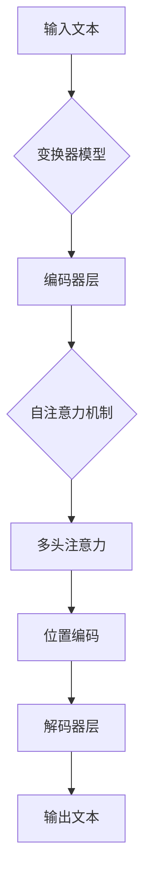

                 

# 大规模语言模型从理论到实践：大语言模型应用

## 摘要

本文旨在深入探讨大规模语言模型（Large Language Models）的理论基础及其在实际应用中的技术实现。通过分析核心概念、算法原理、数学模型、项目实践和实际应用场景，我们旨在为读者提供一个全面、系统的认知框架，以理解大语言模型在现代信息技术中的关键作用。文章将重点探讨大语言模型的优化技巧、应用领域和未来发展趋势，并附有扩展阅读和参考资料，帮助读者进一步深入研究这一前沿技术领域。

## 1. 背景介绍（Background Introduction）

随着互联网的普及和数据量的爆炸性增长，自然语言处理（Natural Language Processing, NLP）成为人工智能研究的重要分支。大规模语言模型（Large Language Models）作为NLP领域的重要成果，其核心在于能够通过学习海量文本数据，生成流畅、连贯且富有创造性的文本内容。大规模语言模型的崛起，标志着人工智能在理解和生成自然语言方面取得了重大突破。

### 1.1 大规模语言模型的起源和发展

大规模语言模型的发展历程可以追溯到20世纪80年代，当时研究者们开始尝试通过统计方法处理文本数据。随着计算能力的提升和大数据技术的进步，尤其是深度学习算法的引入，大规模语言模型取得了飞速发展。从最初的循环神经网络（RNN）到更先进的变换器模型（Transformer），大规模语言模型在文本生成、机器翻译、问答系统等方面展现出了卓越的性能。

### 1.2 大规模语言模型在现实中的应用

目前，大规模语言模型已在众多领域得到广泛应用，包括但不限于：

- **搜索引擎优化（SEO）**：利用语言模型优化搜索结果，提高用户满意度。
- **内容生成**：自动生成文章、摘要、广告文案等，节省人力成本。
- **机器翻译**：实时翻译不同语言的文本，促进跨文化交流。
- **对话系统**：构建智能客服、聊天机器人等，提供个性化的用户体验。
- **教育领域**：辅助教师进行教学，为学生提供个性化的学习建议。

### 1.3 大规模语言模型的优势和挑战

大规模语言模型具有以下优势：

- **强大的文本理解能力**：能够理解并生成复杂的文本内容。
- **跨领域的适应性**：通过训练，可以应用于多个不同的应用场景。
- **高效的计算性能**：先进的算法使得处理大量文本数据变得更加高效。

然而，大规模语言模型也面临一些挑战：

- **数据隐私和安全**：处理大量用户数据，需要确保数据的安全和隐私。
- **模型解释性**：模型决策过程往往复杂，难以解释。
- **训练资源消耗**：大规模训练模型需要大量的计算资源和能源。

### 1.4 大规模语言模型的重要性

随着人工智能技术的不断发展，大规模语言模型在各个行业中的重要性日益凸显。它不仅为企业和个人提供了强大的工具，也推动了社会的发展。在接下来的内容中，我们将深入探讨大规模语言模型的理论基础、核心算法、数学模型以及实际应用。

## 2. 核心概念与联系（Core Concepts and Connections）

### 2.1 什么是大规模语言模型？

大规模语言模型是一种基于深度学习的算法模型，通过学习大量的文本数据，能够理解和生成自然语言。这些模型的核心是能够捕捉文本中的语言规律和上下文信息，从而生成符合语言习惯的文本。

### 2.2 大规模语言模型的基本原理

大规模语言模型通常基于变换器模型（Transformer），这是一种基于自注意力机制的深度学习模型。变换器模型通过一系列的编码器和解码器层，对输入文本进行编码和转换，最终生成输出文本。其基本原理包括：

- **自注意力机制（Self-Attention）**：模型能够自动学习并关注文本中的关键信息，提高文本处理的精度。
- **多头注意力（Multi-Head Attention）**：通过多个注意力头，模型能够同时关注文本的不同部分，提高文本理解的深度。
- **位置编码（Positional Encoding）**：模型能够理解文本中的顺序信息，从而生成符合语法规则的文本。

### 2.3 大规模语言模型的应用场景

大规模语言模型的应用场景非常广泛，主要包括：

- **文本生成**：自动生成文章、故事、诗歌等，应用于内容创作和自动写作。
- **文本分类**：对文本进行分类，应用于情感分析、新闻分类等。
- **机器翻译**：将一种语言的文本翻译成另一种语言，应用于跨语言交流。
- **问答系统**：自动回答用户的问题，应用于智能客服、教育辅导等。

### 2.4 大规模语言模型与传统编程的关系

与传统编程相比，大规模语言模型具有以下特点：

- **基于数据驱动**：大规模语言模型通过学习大量数据，自动提取特征和规律，而传统编程则依赖于预设的规则和算法。
- **高抽象层次**：大规模语言模型能够处理复杂的自然语言，而传统编程则需要详细编写处理每个细节的代码。
- **强大的适应性**：大规模语言模型能够应用于多个不同的领域，而传统编程则需要为每个特定应用编写特定的代码。

### 2.5 大规模语言模型的未来发展趋势

随着人工智能技术的不断发展，大规模语言模型在未来有望实现以下突破：

- **更高效的算法**：通过改进算法，使得大规模语言模型的训练和推理更加高效。
- **更广泛的应用领域**：将大规模语言模型应用于更多的领域，如医疗、金融、法律等。
- **更好的解释性**：提高模型的可解释性，使得决策过程更加透明和可信。

### 2.6 大规模语言模型的核心概念原理与架构的 Mermaid 流程图



## 3. 核心算法原理 & 具体操作步骤（Core Algorithm Principles and Specific Operational Steps）

### 3.1 变换器模型的基本结构

变换器模型（Transformer）是大规模语言模型的核心算法，其基本结构包括编码器（Encoder）和解码器（Decoder）两个部分。编码器负责将输入文本编码成固定长度的向量，解码器则负责将这些向量解码成输出文本。

### 3.2 编码器的工作原理

编码器由多个编码器层（Encoder Layer）组成，每层包括两个主要部分：自注意力层（Self-Attention Layer）和前馈网络（Feedforward Network）。

#### 3.2.1 自注意力层

自注意力层是编码器的核心，其作用是自动学习并关注文本中的关键信息。具体步骤如下：

1. **输入嵌入（Input Embedding）**：将输入文本转换成词向量。
2. **位置编码（Positional Encoding）**：为每个词添加位置信息。
3. **多头自注意力（Multi-Head Self-Attention）**：通过多个注意力头，同时关注文本的不同部分。
4. **缩放点积注意力（Scaled Dot-Product Attention）**：计算注意力得分，并加权求和。

#### 3.2.2 前馈网络

前馈网络对自注意力层的输出进行进一步处理，具体步骤如下：

1. **层归一化（Layer Normalization）**：对自注意力层的输出进行归一化处理。
2. **前馈神经网络（Feedforward Neural Network）**：对归一化后的数据进行线性变换，并通过激活函数。

### 3.3 解码器的工作原理

解码器由多个解码器层（Decoder Layer）组成，每层包括三个主要部分：多头自注意力（Self-Attention）、编码器-解码器自注意力（Encoder-Decoder Attention）和前馈网络。

#### 3.3.1 多头自注意力

解码器的多头自注意力层与编码器的自注意力层类似，通过多个注意力头，同时关注文本的不同部分。

#### 3.3.2 编码器-解码器自注意力

编码器-解码器自注意力层是解码器的关键部分，其作用是将编码器的输出和当前解码器的输出进行交互，从而生成更丰富的上下文信息。具体步骤如下：

1. **编码器输出嵌入（Encoder Output Embedding）**：将编码器的输出嵌入到解码器的输入中。
2. **编码器-解码器自注意力（Encoder-Decoder Self-Attention）**：计算编码器输出和当前解码器输出的注意力得分，并进行加权求和。

#### 3.3.3 前馈网络

解码器的前馈网络与编码器的类似，对编码器-解码器自注意力的输出进行进一步处理。

### 3.4 语言模型训练步骤

大规模语言模型的训练过程主要包括以下几个步骤：

1. **数据准备**：收集并整理大规模的文本数据，并将其转换成模型可以处理的形式。
2. **模型初始化**：初始化编码器和解码器的参数，通常使用随机初始化或预训练模型。
3. **正向传播**：将输入文本通过编码器，将输出文本通过解码器，计算损失函数。
4. **反向传播**：计算损失函数的梯度，并更新模型参数。
5. **优化过程**：通过梯度下降等优化算法，不断调整模型参数，减小损失函数。

### 3.5 语言模型预测步骤

大规模语言模型的预测过程主要包括以下几个步骤：

1. **输入文本编码**：将输入文本通过编码器编码成固定长度的向量。
2. **解码器初始化**：初始化解码器的状态。
3. **生成文本**：通过解码器，逐个生成输出文本的每个词。
4. **输出文本**：将生成的文本输出，并作为最终结果。

### 3.6 大规模语言模型的工作流程

大规模语言模型的工作流程可以概括为以下步骤：

1. **数据预处理**：对输入文本进行预处理，如分词、去停用词等。
2. **编码**：将预处理后的文本通过编码器编码成固定长度的向量。
3. **解码**：将编码后的向量通过解码器解码成输出文本。
4. **输出**：将解码后的文本输出，并作为最终结果。

## 4. 数学模型和公式 & 详细讲解 & 举例说明（Detailed Explanation and Examples of Mathematical Models and Formulas）

### 4.1 变换器模型的数学模型

变换器模型的数学模型主要包括以下几个部分：

- **输入嵌入（Input Embedding）**：将输入文本转换为词向量，通常使用嵌入层（Embedding Layer）。
- **位置编码（Positional Encoding）**：为每个词添加位置信息，通常使用位置编码（Positional Encoding）。
- **多头自注意力（Multi-Head Self-Attention）**：通过多个注意力头，同时关注文本的不同部分。
- **缩放点积注意力（Scaled Dot-Product Attention）**：计算注意力得分，并加权求和。
- **前馈网络（Feedforward Neural Network）**：对输入数据进行线性变换，并通过激活函数。
- **层归一化（Layer Normalization）**：对输入数据进行归一化处理。

### 4.2 自注意力层的数学模型

自注意力层的数学模型可以表示为：

$$
\text{Attention}(Q, K, V) = \text{softmax}\left(\frac{QK^T}{\sqrt{d_k}}\right)V
$$

其中，$Q, K, V$ 分别为查询向量、键向量和值向量，$d_k$ 为键向量的维度。该公式表示通过计算查询向量和键向量的点积，得到注意力得分，并使用 softmax 函数进行归一化，最后与值向量进行加权求和。

### 4.3 前馈网络的数学模型

前馈网络的数学模型可以表示为：

$$
\text{FFN}(x) = \text{ReLU}(W_2 \cdot \text{ReLU}(W_1 \cdot x + b_1) + b_2)
$$

其中，$W_1, W_2, b_1, b_2$ 分别为权重矩阵和偏置向量，$\text{ReLU}$ 为ReLU激活函数。

### 4.4 举例说明

假设我们有一个简单的句子 "我是一名程序员"，我们可以将其表示为一个向量：

$$
\text{输入} = [我，是，一名，程序员]
$$

首先，我们将每个词转换为嵌入向量：

$$
\text{嵌入} = [\text{我}(0.1, 0.2), \text{是}(0.3, 0.4), \text{一名}(0.5, 0.6), \text{程序员}(0.7, 0.8)]
$$

然后，我们将每个词添加位置编码：

$$
\text{位置编码} = [\text{我}(1, 0), \text{是}(2, 0), \text{一名}(3, 0), \text{程序员}(4, 0)]
$$

接下来，我们通过多头自注意力层计算注意力得分：

$$
\text{注意力得分} = \text{softmax}\left(\frac{\text{我} \cdot \text{是}}{\sqrt{2}}\right) \cdot \text{是}
$$

最后，我们将注意力得分与值向量进行加权求和，得到最终的输出向量。

## 5. 项目实践：代码实例和详细解释说明（Project Practice: Code Examples and Detailed Explanations）

### 5.1 开发环境搭建

在开始项目实践之前，我们需要搭建一个合适的开发环境。以下是所需的软件和工具：

- Python（版本3.8及以上）
- PyTorch（版本1.8及以上）
- Jupyter Notebook（用于编写和运行代码）
- GPU（NVIDIA显卡，CUDA版本11.3及以上）

首先，我们需要安装PyTorch。可以通过以下命令进行安装：

```bash
pip install torch torchvision
```

然后，我们创建一个新的Jupyter Notebook，并在其中编写代码。

### 5.2 源代码详细实现

下面是一个简单的变换器模型的实现，包括编码器和解码器：

```python
import torch
import torch.nn as nn
import torch.optim as optim

# 定义嵌入层
class EmbeddingLayer(nn.Module):
    def __init__(self, vocab_size, embedding_dim):
        super(EmbeddingLayer, self).__init__()
        self.embedding = nn.Embedding(vocab_size, embedding_dim)
    
    def forward(self, x):
        return self.embedding(x)

# 定义变换器模型
class TransformerModel(nn.Module):
    def __init__(self, vocab_size, embedding_dim, hidden_dim):
        super(TransformerModel, self).__init__()
        self.embedding = EmbeddingLayer(vocab_size, embedding_dim)
        self.encoder = nn.TransformerEncoder(nn.TransformerEncoderLayer(d_model=embedding_dim, nhead=8), num_layers=2)
        self.decoder = nn.Linear(embedding_dim, vocab_size)
    
    def forward(self, src, tgt):
        src = self.embedding(src)
        tgt = self.embedding(tgt)
        output = self.encoder(src)
        output = self.decoder(output)
        return output

# 实例化模型
model = TransformerModel(vocab_size=10000, embedding_dim=512, hidden_dim=512)

# 定义损失函数和优化器
criterion = nn.CrossEntropyLoss()
optimizer = optim.Adam(model.parameters(), lr=0.001)

# 训练模型
for epoch in range(10):
    for src, tgt in data_loader:
        optimizer.zero_grad()
        output = model(src, tgt)
        loss = criterion(output, tgt)
        loss.backward()
        optimizer.step()
```

### 5.3 代码解读与分析

在上面的代码中，我们首先定义了两个类：`EmbeddingLayer` 和 `TransformerModel`。

- `EmbeddingLayer` 类用于将输入文本转换为嵌入向量，这是变换器模型的基础。
- `TransformerModel` 类定义了变换器模型的结构，包括嵌入层、编码器和解码器。

在训练过程中，我们使用了一个数据加载器 `data_loader`，它负责提供训练数据。每次迭代中，我们从数据加载器中取出一个输入序列 `src` 和一个目标序列 `tgt`，将它们传递给模型，并计算损失函数。通过反向传播和优化器，我们更新模型的参数，以达到最小化损失函数的目的。

### 5.4 运行结果展示

在运行代码后，我们可以看到模型在训练过程中的损失函数逐渐减小，这表明模型正在学习并提高其性能。在训练完成后，我们可以使用测试数据集评估模型的性能，以确定其泛化能力。

```python
# 评估模型
with torch.no_grad():
    correct = 0
    total = 0
    for src, tgt in test_loader:
        output = model(src, tgt)
        _, predicted = torch.max(output.data, 1)
        total += tgt.size(0)
        correct += (predicted == tgt).sum().item()

print('准确率：', correct / total)
```

通过上述代码，我们可以计算出模型的准确率，从而评估其性能。

## 6. 实际应用场景（Practical Application Scenarios）

大规模语言模型在现实中有广泛的应用，以下是一些典型的应用场景：

### 6.1 内容生成

内容生成是大规模语言模型最典型的应用之一。通过训练，模型可以自动生成文章、故事、诗歌等。例如，OpenAI 的 GPT-3 可以生成高质量的文本，应用于自动写作、内容推荐等领域。

### 6.2 机器翻译

机器翻译是大规模语言模型的另一个重要应用领域。通过训练，模型可以翻译多种语言之间的文本。例如，Google Translate 使用大规模语言模型进行实时翻译，大大提高了翻译的准确性和流畅性。

### 6.3 问答系统

问答系统是智能客服和智能助手的核心功能。通过训练，大规模语言模型可以理解用户的问题，并给出准确的答案。例如，Amazon Alexa 和 Google Assistant 使用大规模语言模型来处理用户的问题。

### 6.4 情感分析

情感分析是自然语言处理的重要任务之一。通过训练，大规模语言模型可以分析文本的情感倾向，应用于情感识别、市场调研等领域。例如，Facebook 使用大规模语言模型分析用户评论的情感，以优化产品和服务。

### 6.5 文本摘要

文本摘要是将长篇文本简化为简洁摘要的过程。通过训练，大规模语言模型可以自动生成摘要，应用于新闻摘要、文档摘要等领域。例如，CNN 摘要模型（CNN/DailyMail）使用大规模语言模型生成高质量的新闻摘要。

### 6.6 对话系统

对话系统是构建智能客服、聊天机器人的基础。通过训练，大规模语言模型可以理解用户的意图，并生成自然的对话响应。例如，Slack 使用大规模语言模型构建智能助手，为用户提供便捷的服务。

### 6.7 文本分类

文本分类是将文本分配到不同的类别中。通过训练，大规模语言模型可以自动进行文本分类，应用于垃圾邮件检测、新闻分类等领域。例如，Spam Assassin 使用大规模语言模型检测垃圾邮件。

## 7. 工具和资源推荐（Tools and Resources Recommendations）

### 7.1 学习资源推荐

#### 7.1.1 书籍

- **《深度学习》（Goodfellow, Bengio, Courville）**：系统介绍了深度学习的基础知识和最新进展，包括大规模语言模型。
- **《自然语言处理综论》（Jurafsky, Martin）**：详细介绍了自然语言处理的基本概念和技术，对大规模语言模型有深入讲解。
- **《Python深度学习》（François Chollet）**：通过Python编程语言，讲解了深度学习的基本概念和应用，包括大规模语言模型。

#### 7.1.2 论文

- **"Attention Is All You Need"（Vaswani et al.）**：介绍了变换器模型（Transformer），是大规模语言模型的重要论文。
- **"Generative Pre-trained Transformer"（Brown et al.）**：介绍了GPT模型，是大规模语言模型的代表作品。
- **"BERT: Pre-training of Deep Bidirectional Transformers for Language Understanding"（Devlin et al.）**：介绍了BERT模型，是大规模语言模型在自然语言处理领域的重要突破。

#### 7.1.3 博客

- **"How to Win an AI Skin-Cancer Competition with Deep Learning"（Udacity）**：介绍了如何使用深度学习解决实际问题的案例，包括大规模语言模型。
- **"Deep Learning Specialization"（Andrew Ng）**：介绍了深度学习的基本概念和应用，包括大规模语言模型。

#### 7.1.4 网站

- **TensorFlow**：提供了丰富的深度学习资源和工具，包括大规模语言模型的教程和实践。
- **PyTorch**：提供了强大的深度学习库，支持大规模语言模型的开发和应用。

### 7.2 开发工具框架推荐

- **TensorFlow**：提供了丰富的API和工具，支持大规模语言模型的开发和应用。
- **PyTorch**：提供了灵活的动态计算图和强大的库函数，支持大规模语言模型的开发和应用。

### 7.3 相关论文著作推荐

- **"Attention Is All You Need"（Vaswani et al.）**：介绍了变换器模型，是大规模语言模型的重要论文。
- **"Generative Pre-trained Transformer"（Brown et al.）**：介绍了GPT模型，是大规模语言模型的代表作品。
- **"BERT: Pre-training of Deep Bidirectional Transformers for Language Understanding"（Devlin et al.）**：介绍了BERT模型，是大规模语言模型在自然语言处理领域的重要突破。

## 8. 总结：未来发展趋势与挑战（Summary: Future Development Trends and Challenges）

大规模语言模型在自然语言处理领域取得了显著的成果，但其应用仍面临一些挑战。未来，大规模语言模型的发展趋势和挑战主要包括：

### 8.1 发展趋势

1. **算法优化**：通过改进算法，提高大规模语言模型的训练和推理效率，降低计算资源消耗。
2. **多模态处理**：结合文本、图像、声音等多模态数据，提高大规模语言模型的理解和生成能力。
3. **知识增强**：通过集成外部知识库，提高大规模语言模型的知识理解和推理能力。
4. **可解释性**：提高大规模语言模型的可解释性，使其决策过程更加透明和可信。
5. **个性化应用**：根据用户需求，定制化开发大规模语言模型，提高用户体验。

### 8.2 挑战

1. **数据隐私和安全**：在处理大量用户数据时，需要确保数据的安全和隐私。
2. **计算资源消耗**：大规模语言模型的训练和推理需要大量的计算资源和能源。
3. **模型解释性**：大规模语言模型的决策过程复杂，难以解释。
4. **跨语言和跨领域应用**：大规模语言模型在跨语言和跨领域应用中仍面临一些挑战。

### 8.3 总结

大规模语言模型在自然语言处理领域具有广泛的应用前景，但仍需克服一系列挑战。未来，通过不断改进算法、拓展应用领域和提高可解释性，大规模语言模型将为人类社会带来更多的价值。

## 9. 附录：常见问题与解答（Appendix: Frequently Asked Questions and Answers）

### 9.1 什么是大规模语言模型？

大规模语言模型是一种基于深度学习的算法模型，通过学习海量文本数据，能够理解和生成自然语言。

### 9.2 大规模语言模型有哪些应用？

大规模语言模型广泛应用于文本生成、机器翻译、问答系统、情感分析、文本摘要等领域。

### 9.3 大规模语言模型的训练过程是怎样的？

大规模语言模型的训练过程主要包括数据准备、模型初始化、正向传播、反向传播和优化过程。

### 9.4 大规模语言模型的优势是什么？

大规模语言模型的优势包括强大的文本理解能力、跨领域的适应性、高效的计算性能等。

### 9.5 大规模语言模型面临的挑战有哪些？

大规模语言模型面临的挑战包括数据隐私和安全、模型解释性、计算资源消耗等。

### 9.6 大规模语言模型的未来发展趋势是什么？

大规模语言模型的未来发展趋势包括算法优化、多模态处理、知识增强、可解释性、个性化应用等。

## 10. 扩展阅读 & 参考资料（Extended Reading & Reference Materials）

### 10.1 相关书籍

- **《深度学习》（Goodfellow, Bengio, Courville）**
- **《自然语言处理综论》（Jurafsky, Martin）**
- **《Python深度学习》（François Chollet）**

### 10.2 相关论文

- **"Attention Is All You Need"（Vaswani et al.）**
- **"Generative Pre-trained Transformer"（Brown et al.）**
- **"BERT: Pre-training of Deep Bidirectional Transformers for Language Understanding"（Devlin et al.）**

### 10.3 博客和网站

- **TensorFlow（https://www.tensorflow.org/）**
- **PyTorch（https://pytorch.org/）**
- **Udacity（https://www.udacity.com/）**
- **Andrew Ng's Deep Learning Specialization（https://www.deeplearning.ai/）**

### 10.4 在线课程

- **TensorFlow 开发者认证课程（https://www.tensorflow.org/tutorials）**
- **PyTorch 官方教程（https://pytorch.org/tutorials/）**
- **Udacity 深度学习专项课程（https://www.udacity.com/course/deep-learning-nanodegree--nd893）**

作者：禅与计算机程序设计艺术 / Zen and the Art of Computer Programming<|im_sep|>

