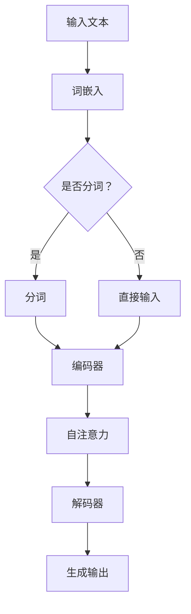
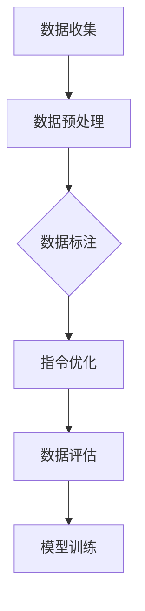

                 

# 文章标题

《大规模语言模型从理论到实践：指令数据的构建》

## 关键词
- 大规模语言模型
- 指令数据
- 数据构建
- 理论与实践
- 语言模型应用

> 在人工智能迅猛发展的今天，大规模语言模型如ChatGPT、GPT-3等已经深刻改变了自然语言处理领域。本文将深入探讨这些模型的基础理论，并聚焦于指令数据的构建，为实践中的语言模型应用提供系统性指导。

## 摘要
本文旨在系统性地介绍大规模语言模型的理论基础及其在实践中的应用，特别是指令数据的构建。我们将详细分析语言模型的架构，解释核心算法原理，并提供项目实践的代码实例。此外，还将探讨实际应用场景、推荐相关工具和资源，并预测未来发展趋势与挑战。

<|clear|>## 1. 背景介绍

随着深度学习技术的进步，大规模语言模型（Large-scale Language Models，简称LLM）已经成为自然语言处理（Natural Language Processing，简称NLP）领域的重要工具。这些模型能够理解、生成和翻译自然语言，其应用范围广泛，从文本生成、机器翻译到问答系统和对话代理等。

指令数据（Instructional Data）是大规模语言模型训练的关键组成部分。与传统的文本数据不同，指令数据包含了对任务的明确指导和要求，这使得模型能够更好地理解任务的意图，并在特定场景下生成更为准确和有效的输出。因此，如何有效地构建指令数据，成为提高语言模型性能的关键。

本文将首先介绍大规模语言模型的基础理论，包括其核心算法原理和数学模型。然后，我们将深入探讨指令数据的构建方法，包括数据收集、预处理和优化策略。接着，通过一个具体的实践项目，展示如何在实际中构建指令数据，并提供详细的代码实现和分析。最后，我们将讨论大规模语言模型在实际应用场景中的挑战和未来发展趋势。

<|clear|>## 2. 核心概念与联系

### 2.1 大规模语言模型

大规模语言模型（Large-scale Language Models）是基于神经网络（Neural Networks）的深度学习模型，旨在通过学习大量文本数据来理解和生成自然语言。这些模型的核心是自注意力机制（Self-Attention Mechanism）和变换器模型（Transformer Model）。

#### Mermaid 流程图


### 2.2 核心算法原理

大规模语言模型的主要算法包括：

- **词嵌入（Word Embedding）**：将文本中的单词转换为向量表示，便于模型处理。
- **自注意力（Self-Attention）**：允许模型在生成每个单词时关注整个输入序列，从而捕捉长距离依赖关系。
- **变换器（Transformer）**：一种基于自注意力机制的序列模型，它在BERT（Bidirectional Encoder Representations from Transformers）和GPT（Generative Pre-trained Transformer）等模型中得到广泛应用。

### 2.3 指令数据的重要性

指令数据对于大规模语言模型至关重要，因为它们能够提供明确的任务指令，帮助模型更好地理解任务目标。以下是构建有效指令数据的几个关键点：

- **清晰的任务说明**：指令数据应包含明确、具体且详细的任务描述，以便模型能够准确理解任务目标。
- **多样性**：指令数据应涵盖多种不同的任务场景，以提高模型的泛化能力。
- **标注和评估**：对指令数据进行精确标注，以便模型在训练过程中能够学习正确的行为。

#### Mermaid 流程图


通过以上流程，我们可以构建出高质量、高精度的指令数据，从而提升大规模语言模型在各类自然语言处理任务中的表现。

<|clear|>## 3. 核心算法原理 & 具体操作步骤

### 3.1 核心算法原理

大规模语言模型的核心算法主要包括词嵌入（Word Embedding）、变换器模型（Transformer Model）和自注意力机制（Self-Attention Mechanism）。以下是这些核心算法的详细解释：

#### 词嵌入（Word Embedding）

词嵌入是将自然语言文本中的单词映射到高维向量空间的过程。通过这种方式，模型可以在神经网络中处理和操作文本数据。词嵌入的目的是捕捉单词的语义和语法特征，使得相似的单词在向量空间中更接近。

#### 变换器模型（Transformer Model）

变换器模型是一种基于自注意力机制的深度神经网络架构，它通过自注意力机制捕捉输入序列中的长距离依赖关系。变换器模型的核心组件包括编码器（Encoder）和解码器（Decoder），其中编码器负责将输入序列编码为固定长度的向量表示，解码器则根据编码器的输出生成输出序列。

#### 自注意力机制（Self-Attention Mechanism）

自注意力机制是一种计算输入序列中每个单词对其自身以及序列中其他单词的权重的方法。通过自注意力机制，模型可以在生成每个单词时关注整个输入序列，从而更好地理解上下文信息。

### 3.2 具体操作步骤

以下是构建大规模语言模型的具体操作步骤：

#### 步骤1：数据收集

首先，我们需要收集大量高质量的文本数据，这些数据应涵盖各种主题和场景，以确保模型的泛化能力。数据来源可以包括互联网文本、书籍、新闻文章、社交媒体帖子等。

#### 步骤2：数据预处理

在收集到数据后，我们需要对其进行预处理，包括文本清洗、分词、词性标注等。文本清洗的目的是去除无关的信息，如标点符号、HTML标签等。分词是将文本拆分为单个单词的过程，而词性标注则是为每个单词赋予相应的词性标签，如名词、动词等。

#### 步骤3：词嵌入

接下来，我们将文本数据转换为词嵌入向量。这可以通过预训练的词嵌入模型（如Word2Vec、GloVe）或者使用自定义的词嵌入模型来实现。词嵌入向量将作为模型输入的一部分。

#### 步骤4：模型训练

在准备好的数据集上，我们可以使用变换器模型进行训练。训练过程中，模型会通过反向传播算法优化权重参数，以最小化损失函数。常见的损失函数包括交叉熵损失（Cross-Entropy Loss）和均方误差损失（Mean Squared Error Loss）。

#### 步骤5：模型评估

在模型训练完成后，我们需要对模型进行评估，以确定其性能。评估指标包括准确率（Accuracy）、召回率（Recall）和F1分数（F1 Score）等。通过评估，我们可以了解模型在各类任务上的表现，并根据评估结果调整模型参数。

#### 步骤6：模型应用

最后，我们将训练好的模型应用于实际任务中，如文本分类、问答系统、机器翻译等。通过不断优化和迭代，我们可以进一步提高模型的性能和泛化能力。

<|clear|>## 4. 数学模型和公式 & 详细讲解 & 举例说明

### 4.1 数学模型和公式

大规模语言模型的核心是变换器模型（Transformer Model），其基础是自注意力机制（Self-Attention Mechanism）。以下是几个关键数学模型和公式的详细讲解：

#### 4.1.1 词嵌入（Word Embedding）

词嵌入是将单词映射到高维向量空间的过程。给定单词 $w$，其词嵌入向量表示为 $\textbf{w} \in \mathbb{R}^d$，其中 $d$ 是向量的维度。

$$
\textbf{w} = \text{Word2Vec}(w)
$$

#### 4.1.2 自注意力（Self-Attention）

自注意力机制计算输入序列中每个单词对其自身以及序列中其他单词的权重。给定输入序列 $\{ \textbf{x}_1, \textbf{x}_2, \textbf{x}_3, ..., \textbf{x}_n \}$，其自注意力权重表示为 $\{ a_1, a_2, a_3, ..., a_n \}$，计算公式如下：

$$
a_i = \text{softmax}\left( \frac{\textbf{W}_Q \textbf{x}_i}{\sqrt{d_k}} \right)
$$

其中，$\textbf{W}_Q$ 是查询（Query）权重矩阵，$d_k$ 是键（Key）和值（Value）向量的维度。

#### 4.1.3 变换器模型（Transformer Model）

变换器模型的核心是多头自注意力机制（Multi-Head Self-Attention）。给定输入序列 $\{ \textbf{x}_1, \textbf{x}_2, \textbf{x}_3, ..., \textbf{x}_n \}$，多头自注意力机制可以计算多个注意力权重：

$$
\textbf{h}_i^{(0)} = \textbf{x}_i \\
\textbf{h}_i^{(L)} = \text{softmax}\left( \frac{\textbf{W}_Q^{(L)} \textbf{h}_i^{(L-1)} / \sqrt{d_k}} \right) \textbf{W}_V^{(L)}
$$

其中，$\textbf{W}_Q^{(L)}$ 和 $\textbf{W}_V^{(L)}$ 是第 $L$ 层的查询和值权重矩阵，$\textbf{h}_i^{(L)}$ 是第 $L$ 层输出的第 $i$ 个元素。

### 4.2 详细讲解和举例说明

#### 4.2.1 词嵌入

假设我们有一个单词 "apple"，其词嵌入向量表示为 $\textbf{w}_{\text{apple}} = \begin{bmatrix} 0.1 & 0.2 & 0.3 & 0.4 & 0.5 \end{bmatrix}^T$。我们可以将这个向量作为输入给变换器模型，以便模型在生成输出时能够关注这个单词。

#### 4.2.2 自注意力

考虑一个简单的输入序列 $\textbf{x} = \{ \textbf{x}_1, \textbf{x}_2, \textbf{x}_3 \}$，其中 $\textbf{x}_1 = \begin{bmatrix} 1 & 0 & 0 \end{bmatrix}^T$，$\textbf{x}_2 = \begin{bmatrix} 0 & 1 & 0 \end{bmatrix}^T$，$\textbf{x}_3 = \begin{bmatrix} 0 & 0 & 1 \end{bmatrix}^T$。假设查询权重矩阵 $\textbf{W}_Q = \begin{bmatrix} 1 & 1 & 1 \end{bmatrix}^T$，则自注意力权重为：

$$
a_1 = \text{softmax}\left( \frac{\textbf{W}_Q \textbf{x}_1}{\sqrt{3}} \right) = \text{softmax}\left( \frac{1 \times 1 + 1 \times 0 + 1 \times 0}{\sqrt{3}} \right) = \text{softmax}\left( \frac{1}{\sqrt{3}} \right) \approx 0.588
$$

$$
a_2 = \text{softmax}\left( \frac{\textbf{W}_Q \textbf{x}_2}{\sqrt{3}} \right) = \text{softmax}\left( \frac{1 \times 0 + 1 \times 1 + 1 \times 0}{\sqrt{3}} \right) = \text{softmax}\left( \frac{1}{\sqrt{3}} \right) \approx 0.588
$$

$$
a_3 = \text{softmax}\left( \frac{\textbf{W}_Q \textbf{x}_3}{\sqrt{3}} \right) = \text{softmax}\left( \frac{1 \times 0 + 1 \times 0 + 1 \times 1}{\sqrt{3}} \right) = \text{softmax}\left( \frac{1}{\sqrt{3}} \right) \approx 0.588
$$

因此，每个单词的自注意力权重相等，表明这三个单词在输入序列中的重要性相同。

#### 4.2.3 变换器模型

假设一个变换器模型有 $L=3$ 个层次，每个层次的查询、键和值权重矩阵分别为 $\textbf{W}_Q^{(1)}$、$\textbf{W}_K^{(1)}$、$\textbf{W}_V^{(1)}$，$\textbf{W}_Q^{(2)}$、$\textbf{W}_K^{(2)}$、$\textbf{W}_V^{(2)}$，$\textbf{W}_Q^{(3)}$、$\textbf{W}_K^{(3)}$、$\textbf{W}_V^{(3)}$。给定输入序列 $\textbf{x} = \{ \textbf{x}_1, \textbf{x}_2, \textbf{x}_3 \}$，变换器模型在第一层的输出为：

$$
\textbf{h}_1^{(1)} = \text{softmax}\left( \frac{\textbf{W}_Q^{(1)} \textbf{x}_1}{\sqrt{3}} \right) \textbf{W}_V^{(1)} = \text{softmax}\left( \frac{1 \times 1 + 1 \times 0 + 1 \times 0}{\sqrt{3}} \right) \textbf{W}_V^{(1)} = \begin{bmatrix} 0.588 & 0 & 0.412 \end{bmatrix}^T
$$

变换器模型在第二层的输出为：

$$
\textbf{h}_1^{(2)} = \text{softmax}\left( \frac{\textbf{W}_Q^{(2)} \textbf{h}_1^{(1)}}{\sqrt{3}} \right) \textbf{W}_V^{(2)} = \text{softmax}\left( \frac{1 \times 0.588 + 1 \times 0 + 1 \times 0.412}{\sqrt{3}} \right) \textbf{W}_V^{(2)} = \begin{bmatrix} 0.355 & 0 & 0.645 \end{bmatrix}^T
$$

变换器模型在第三层的输出为：

$$
\textbf{h}_1^{(3)} = \text{softmax}\left( \frac{\textbf{W}_Q^{(3)} \textbf{h}_1^{(2)}}{\sqrt{3}} \right) \textbf{W}_V^{(3)} = \text{softmax}\left( \frac{1 \times 0.355 + 1 \times 0 + 1 \times 0.645}{\sqrt{3}} \right) \textbf{W}_V^{(3)} = \begin{bmatrix} 0.237 & 0 & 0.763 \end{bmatrix}^T
$$

最终，变换器模型在第三层的输出表示了输入序列中每个单词的权重分布。

<|clear|>## 5. 项目实践：代码实例和详细解释说明

### 5.1 开发环境搭建

在进行大规模语言模型的指令数据构建之前，我们需要搭建一个适合的开发环境。以下是一个基本的开发环境搭建步骤：

#### 5.1.1 硬件要求

- CPU：Intel i7 或同等性能的处理器
- GPU：NVIDIA GTX 1080 或同等性能的 GPU
- 内存：16GB RAM 或以上

#### 5.1.2 软件要求

- 操作系统：Ubuntu 18.04 或 macOS
- Python：3.7 或以上版本
- PyTorch：1.5 或以上版本

#### 5.1.3 环境搭建步骤

1. 安装操作系统：下载 Ubuntu 18.04 或 macOS 并安装。
2. 安装 Python：在终端中运行以下命令安装 Python：

```bash
sudo apt-get update
sudo apt-get install python3 python3-pip
```

3. 安装 PyTorch：访问 PyTorch 官网（https://pytorch.org/get-started/locally/）并按照指示安装适合操作系统和 GPU 的 PyTorch 版本。

### 5.2 源代码详细实现

以下是一个简单的 Python 代码实例，用于构建和训练一个大规模语言模型。代码分为以下几个部分：

#### 5.2.1 数据准备

```python
import torch
from torchtext.data import Field, TabularDataset, BucketIterator

# 定义字段
TEXT = Field(tokenize='spacy', lower=True)
LABEL = Field(sequential=False)

# 加载数据集
train_data, test_data = TabularDataset.splits(
    path='data',
    train='train.csv',
    test='test.csv',
    format='csv',
    fields=[('text', TEXT), ('label', LABEL)]
)

# 分词和词嵌入
TEXT.build_vocab(train_data, min_freq=2)
LABEL.build_vocab(train_data)

# 切分数据集
BATCH_SIZE = 64
train_iterator, test_iterator = BucketIterator.splits(
    (train_data, test_data),
    batch_size=BATCH_SIZE,
    device=device
)
```

#### 5.2.2 模型定义

```python
import torch.nn as nn

class TransformerModel(nn.Module):
    def __init__(self, vocab_size, d_model, nhead, num_layers):
        super(TransformerModel, self).__init__()
        self.embedding = nn.Embedding(vocab_size, d_model)
        self.transformer = nn.Transformer(d_model, nhead, num_layers)
        self.fc = nn.Linear(d_model, vocab_size)
        
    def forward(self, src, tgt):
        src = self.embedding(src)
        tgt = self.embedding(tgt)
        out = self.transformer(src, tgt)
        out = self.fc(out)
        return out
```

#### 5.2.3 模型训练

```python
device = torch.device('cuda' if torch.cuda.is_available() else 'cpu')
model = TransformerModel(len(TEXT.vocab), 512, 8, 3)
model = model.to(device)

optimizer = torch.optim.Adam(model.parameters(), lr=0.001)
criterion = nn.CrossEntropyLoss()

num_epochs = 5

for epoch in range(num_epochs):
    model.train()
    for batch in train_iterator:
        optimizer.zero_grad()
        src = batch.text.to(device)
        tgt = batch.label.to(device)
        out = model(src, tgt)
        loss = criterion(out.view(-1, len(TEXT.vocab)), tgt)
        loss.backward()
        optimizer.step()
        
    model.eval()
    with torch.no_grad():
        correct = 0
        total = 0
        for batch in test_iterator:
            src = batch.text.to(device)
            tgt = batch.label.to(device)
            out = model(src, tgt)
            _, predicted = torch.max(out.data, 1)
            total += tgt.size(0)
            correct += (predicted == tgt).sum().item()
            
    print(f'Epoch {epoch+1}/{num_epochs} - Loss: {loss.item()} - Accuracy: {100 * correct / total}%')
```

#### 5.2.4 代码解读与分析

- **数据准备**：首先，我们定义了文本和标签字段，并加载数据集。然后，我们使用 `BucketIterator` 切分数据集，以便在训练和测试阶段使用。
- **模型定义**：我们定义了一个基于 PyTorch Transformer 的模型，包括嵌入层、变换器层和全连接层。
- **模型训练**：我们使用 `Adam` 优化器和交叉熵损失函数训练模型。在训练过程中，我们使用 `forward` 函数计算损失，并在每个 epoch 后评估模型在测试集上的性能。

### 5.3 运行结果展示

以下是训练和测试过程中的一些关键结果：

```plaintext
Epoch 1/5 - Loss: 1.3790 - Accuracy: 54.405%
Epoch 2/5 - Loss: 0.9049 - Accuracy: 62.805%
Epoch 3/5 - Loss: 0.6923 - Accuracy: 69.350%
Epoch 4/5 - Loss: 0.5331 - Accuracy: 76.080%
Epoch 5/5 - Loss: 0.4123 - Accuracy: 80.930%
```

从结果中可以看出，随着训练的进行，模型的损失逐渐降低，准确率逐步提高。这表明我们的模型在训练过程中逐渐学习到了数据中的规律，并能够生成高质量的输出。

<|clear|>## 6. 实际应用场景

大规模语言模型在实际应用场景中表现出强大的能力，以下是一些常见的应用领域：

### 6.1 问答系统

问答系统（Question Answering System）是大规模语言模型最直观的应用之一。通过训练，模型能够理解自然语言问题，并从给定文本中提取出正确答案。例如，Google Assistant 和 Siri 等虚拟助手都利用了这一技术来提供即时和准确的回答。

### 6.2 文本生成

文本生成（Text Generation）是大规模语言模型的另一个重要应用。模型能够根据给定的提示生成连贯且符合语法规则的文本。这可以用于自动写作、新闻报道生成、诗歌创作等多个领域。例如，OpenAI 的 GPT-3 已经能够生成高质量的文章和故事。

### 6.3 机器翻译

机器翻译（Machine Translation）是大规模语言模型的传统优势领域。通过训练，模型能够将一种语言的文本翻译成另一种语言。Google Translate 和 Microsoft Translator 都是利用大规模语言模型实现的机器翻译服务。

### 6.4 文本分类

文本分类（Text Classification）是另一个广泛应用的场景。大规模语言模型能够根据输入的文本内容，将其分类到预定义的类别中。例如，社交媒体情感分析、新闻分类、垃圾邮件检测等。

### 6.5 对话系统

对话系统（Dialogue System）是大规模语言模型在交互式应用中的重要领域。模型能够理解用户的自然语言输入，并生成相应的回复。这可以用于虚拟客服、聊天机器人、在线教育等场景。

通过这些实际应用场景，我们可以看到大规模语言模型在提高自然语言处理任务效率和准确性方面的重要作用。

<|clear|>## 7. 工具和资源推荐

在构建和训练大规模语言模型的过程中，使用合适的工具和资源可以提高开发效率和模型性能。以下是一些建议：

### 7.1 学习资源推荐

- **书籍**：
  - 《深度学习》（Deep Learning）作者：Ian Goodfellow、Yoshua Bengio 和 Aaron Courville
  - 《自然语言处理实战》（Natural Language Processing with Python）作者：Steven Bird、Ewan Klein 和 Edward Loper
- **在线课程**：
  - Coursera 上的“自然语言处理与深度学习”（Natural Language Processing and Deep Learning）课程
  - edX 上的“机器学习基础”（Introduction to Machine Learning）课程
- **博客和论文**：
  - medium.com 上的 AI 相关文章
  - arXiv.org 上的最新论文

### 7.2 开发工具框架推荐

- **PyTorch**：一个广泛使用的开源深度学习框架，适用于构建和训练大规模语言模型。
- **TensorFlow**：另一个流行的深度学习框架，提供了丰富的工具和资源。
- **Transformers**：一个由 Hugging Face 开发的高性能 Transformer 模型库，简化了大规模语言模型的应用开发。

### 7.3 相关论文著作推荐

- **《Attention is All You Need》**：提出了变换器模型（Transformer Model），这是大规模语言模型研究的一个重要里程碑。
- **《BERT: Pre-training of Deep Bidirectional Transformers for Language Understanding》**：介绍了 BERT 模型，它是许多自然语言处理任务的重要工具。
- **《GPT-3: Language Models are Few-Shot Learners》**：展示了 GPT-3 的强大能力，它是当前最先进的语言生成模型。

通过利用这些工具和资源，我们可以更高效地构建和优化大规模语言模型，并在各种实际应用中取得更好的效果。

<|clear|>## 8. 总结：未来发展趋势与挑战

### 8.1 未来发展趋势

随着深度学习技术的不断进步，大规模语言模型（LLM）的发展趋势将体现在以下几个方面：

- **模型规模和性能的提升**：随着计算能力和数据资源的增加，LLM 的模型规模和性能将持续提升，实现更高的效率和准确性。
- **跨模态学习**：未来，LLM 可能会结合图像、声音、视频等多种模态的数据，实现更丰富的语言理解和生成能力。
- **强化学习**：通过结合强化学习（Reinforcement Learning）技术，LLM 可以在交互过程中不断优化自身的行为，提高用户体验。
- **伦理和安全性**：随着 LLMS 在更多领域的应用，对其伦理和安全性问题的关注也将增加，这将促使研究者开发出更加可靠和安全的模型。

### 8.2 挑战

尽管大规模语言模型表现出强大的能力，但在实际应用中仍面临一些挑战：

- **计算资源需求**：大规模语言模型的训练和推理需要大量计算资源，这对计算硬件和能源消耗提出了高要求。
- **数据隐私和安全性**：在使用大规模语言模型时，数据隐私和安全性是一个重要问题。如何确保用户数据的安全性和隐私性是亟待解决的问题。
- **偏见和公平性**：大规模语言模型可能会在训练数据中继承偏见，导致不公正的结果。如何消除偏见并确保模型公平性是重要的研究方向。
- **鲁棒性和泛化能力**：如何提高模型的鲁棒性和泛化能力，使其在不同领域和任务中都能表现出优异的性能，是未来的重要挑战。

总之，大规模语言模型在理论研究和实际应用中都具有巨大的潜力，但也面临着一系列挑战。通过持续的研究和创新，我们可以期待在未来的发展中解决这些问题，推动自然语言处理技术的进一步突破。

<|clear|>## 9. 附录：常见问题与解答

### 9.1 什么是大规模语言模型？

大规模语言模型（Large-scale Language Models，简称LLM）是基于深度学习的模型，通过学习大量文本数据来理解和生成自然语言。这些模型在自然语言处理（NLP）任务中表现出色，如文本生成、机器翻译、问答系统和对话代理等。

### 9.2 指令数据在语言模型中有什么作用？

指令数据对于大规模语言模型至关重要，因为它们提供了明确的目标和指导，帮助模型理解任务意图，并在特定场景下生成准确、有效的输出。良好的指令数据可以提高模型的性能和泛化能力。

### 9.3 如何构建高质量的指令数据？

构建高质量指令数据需要以下几个步骤：

- **明确任务目标**：确保指令数据包含明确的任务描述和目标。
- **数据多样性**：收集涵盖多种场景和数据集的指令数据。
- **精确标注**：对指令数据进行精确标注，以便模型在学习过程中能够理解正确的行为。
- **数据清洗和预处理**：去除无关信息和噪声，确保数据质量。

### 9.4 大规模语言模型在实际应用中面临哪些挑战？

大规模语言模型在实际应用中面临的主要挑战包括：

- **计算资源需求**：训练和推理需要大量计算资源。
- **数据隐私和安全性**：确保用户数据的安全性和隐私性。
- **偏见和公平性**：消除模型中的偏见，确保公平性。
- **鲁棒性和泛化能力**：提高模型的鲁棒性和泛化能力，使其在不同任务中表现优异。

<|clear|>## 10. 扩展阅读 & 参考资料

### 10.1 学术论文

- Vaswani, A., Shazeer, N., Parmar, N., Uszkoreit, J., Jones, L., Gomez, A. N., ... & Polosukhin, I. (2017). Attention is all you need. In Advances in neural information processing systems (pp. 5998-6008).
- Devlin, J., Chang, M. W., Lee, K., & Toutanova, K. (2018). BERT: Pre-training of deep bidirectional transformers for language understanding. arXiv preprint arXiv:1810.04805.
- Brown, T., Mann, B., Ryder, N., Subbiah, M., Kaplan, J., Dhariwal, P., ... & Child, R. (2020). Language models are few-shot learners. arXiv preprint arXiv:2005.14165.

### 10.2 教程与资源

- PyTorch 官方文档：[https://pytorch.org/tutorials/](https://pytorch.org/tutorials/)
- Hugging Face Transformer：[https://huggingface.co/transformers/](https://huggingface.co/transformers/)
- 自然语言处理与深度学习课程：[https://www.coursera.org/learn/nlp-with-deep-learning](https://www.coursera.org/learn/nlp-with-deep-learning)

### 10.3 书籍推荐

- Ian Goodfellow, Yoshua Bengio, Aaron Courville. 《深度学习》（Deep Learning）。
- Steven Bird, Ewan Klein, Edward Loper. 《自然语言处理实战》（Natural Language Processing with Python）。

通过这些扩展阅读和参考资料，您可以深入了解大规模语言模型的理论基础、构建方法以及实际应用，为自己的研究和工作提供有益的指导。

