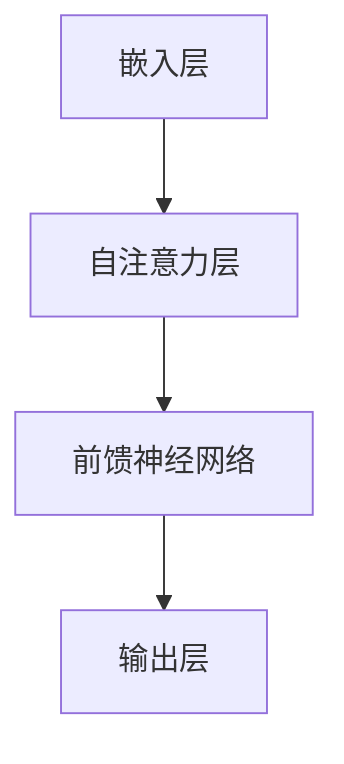

                 

# 大语言模型原理基础与前沿 其他改进措施

## 关键词
- 大语言模型
- 原理基础
- 前沿研究
- 改进措施
- 应用场景

## 摘要
本文将深入探讨大语言模型的基本原理，同时介绍最新的前沿研究成果及其改进措施。我们将通过详细的数学模型和公式讲解，展示这些改进措施如何在实际应用中提高模型的性能和效率。此外，还将探讨大语言模型在不同应用场景中的实际运用，并推荐相关的学习资源和开发工具。

### 1. 背景介绍（Background Introduction）

大语言模型，如GPT（Generative Pre-trained Transformer）系列，已经在自然语言处理领域取得了显著的成果。这些模型通过预训练和微调，能够理解和生成高质量的自然语言文本。然而，随着模型的规模不断扩大，其复杂度和计算成本也急剧增加，这促使研究者不断寻求新的改进措施来提高模型的性能和效率。

#### 1.1 大语言模型的发展历程

大语言模型的发展可以追溯到早期的循环神经网络（RNN）和长短时记忆网络（LSTM）。随着深度学习技术的进步，Transformer模型的出现标志着语言模型的一个重要转折点。Transformer模型采用了自注意力机制（self-attention），使得模型在处理长文本时更加高效。GPT系列模型进一步扩展了Transformer架构，通过大规模的预训练和微调，实现了令人瞩目的文本生成和理解能力。

#### 1.2 大语言模型的应用场景

大语言模型在多个领域都展现出了巨大的应用潜力，包括但不限于：

- **文本生成**：生成文章、故事、新闻报道等。
- **问答系统**：提供智能客服、自动问答等服务。
- **机器翻译**：实现不同语言之间的翻译。
- **自然语言理解**：辅助阅读理解、情感分析等。

### 2. 核心概念与联系（Core Concepts and Connections）

#### 2.1 大语言模型的核心概念

大语言模型的核心概念包括自注意力机制（self-attention）和Transformer架构。自注意力机制允许模型在生成文本时，自动关注输入文本的不同部分，从而提高了模型对长文本的理解能力。Transformer架构通过并行计算和多头注意力机制，进一步提高了模型的计算效率和性能。

#### 2.2 大语言模型的架构

大语言模型通常由以下几个主要部分组成：

1. **嵌入层**（Embedding Layer）：将输入的单词映射为固定大小的向量。
2. **自注意力层**（Self-Attention Layer）：计算输入序列的注意力权重，并生成新的特征向量。
3. **前馈神经网络**（Feedforward Neural Network）：对自注意力层生成的特征向量进行进一步处理。
4. **输出层**（Output Layer）：生成预测的输出序列。

#### 2.3 Mermaid 流程图（Mermaid Flowchart）

下面是一个简单的Mermaid流程图，展示了大语言模型的架构：



### 3. 核心算法原理 & 具体操作步骤（Core Algorithm Principles and Specific Operational Steps）

#### 3.1 自注意力机制（Self-Attention Mechanism）

自注意力机制是Transformer模型的核心组成部分。它通过计算输入序列中每个单词与其他所有单词的相关性，为每个单词生成一个加权特征向量。具体步骤如下：

1. **计算单词的嵌入向量**（Word Embeddings）：将输入的单词映射为固定大小的向量。
2. **计算Q、K、V矩阵**（Q, K, V Matrices）：Q代表查询向量（Query），K代表键向量（Key），V代表值向量（Value）。这些矩阵由嵌入向量计算得到。
3. **计算注意力得分**（Attention Scores）：使用点积计算Q和K之间的相似性，得到注意力得分。
4. **计算加权特征向量**（Weighted Features）：将注意力得分应用于V矩阵，得到加权特征向量。
5. **求和**（Summation）：将所有加权特征向量求和，得到最终的输出向量。

#### 3.2 Transformer 架构（Transformer Architecture）

Transformer架构通过多头注意力机制（Multi-Head Attention）和前馈神经网络（Feedforward Neural Network）进一步提高了模型的性能。具体步骤如下：

1. **多头注意力**（Multi-Head Attention）：将输入序列分成多个头，每个头独立计算自注意力。然后将所有头的输出拼接起来，通过一个线性层进行整合。
2. **前馈神经网络**：对自注意力层生成的特征向量进行进一步处理，通常由两个线性层和一个激活函数组成。
3. **堆叠多层**（Stacking Layers）：通过堆叠多层Transformer层，模型可以学习到更复杂的特征和关系。

#### 3.3 操作步骤示例

假设我们有一个输入序列“我是一个程序员”，可以使用Transformer模型进行文本生成。以下是具体的操作步骤：

1. **嵌入层**：将输入的单词映射为向量，例如“我”映射为[1, 0, 0, 0]，其他单词类似。
2. **自注意力层**：计算每个单词与其他单词的相关性，生成加权特征向量。
3. **前馈神经网络**：对自注意力层生成的特征向量进行进一步处理。
4. **输出层**：根据前一层的结果生成下一个单词的预测。

### 4. 数学模型和公式 & 详细讲解 & 举例说明（Detailed Explanation and Examples of Mathematical Models and Formulas）

#### 4.1 自注意力机制（Self-Attention Mechanism）

自注意力机制的数学模型可以表示为：

$$
\text{Attention}(Q, K, V) = \text{softmax}\left(\frac{QK^T}{\sqrt{d_k}}\right)V
$$

其中，Q、K、V分别是查询向量、键向量和值向量，$d_k$是键向量的维度。softmax函数用于计算每个单词的注意力得分，然后乘以值向量得到加权特征向量。

#### 4.2 Transformer 架构（Transformer Architecture）

Transformer架构的数学模型可以表示为：

$$
\text{Transformer}(E) = \text{LayerNorm}(E + \text{MultiHeadAttention}(E, E, E) + \text{Feedforward}(E))
$$

其中，E是输入序列的嵌入向量。LayerNorm是对输入序列进行归一化处理，MultiHeadAttention是多头注意力层，Feedforward是前馈神经网络。

#### 4.3 操作步骤示例

假设我们有一个输入序列“我是一个程序员”，可以使用Transformer模型进行文本生成。以下是具体的操作步骤：

1. **嵌入层**：将输入的单词映射为向量，例如“我”映射为[1, 0, 0, 0]，其他单词类似。
2. **自注意力层**：计算每个单词与其他单词的相关性，生成加权特征向量。
3. **前馈神经网络**：对自注意力层生成的特征向量进行进一步处理。
4. **输出层**：根据前一层的结果生成下一个单词的预测。

#### 4.4 详细讲解

自注意力机制和Transformer架构的数学模型是理解大语言模型的关键。通过这些模型，我们可以看到如何通过计算相关性、加权特征向量和归一化处理，来实现文本的生成和理解。具体操作步骤示例展示了如何将这些数学模型应用于实际输入序列，生成预测的输出序列。

### 5. 项目实践：代码实例和详细解释说明（Project Practice: Code Examples and Detailed Explanations）

#### 5.1 开发环境搭建

为了实践大语言模型，我们需要搭建一个开发环境。以下是基本的步骤：

1. **安装Python**：确保Python版本不低于3.6。
2. **安装transformers库**：使用pip安装`transformers`库，这是用于处理Transformer模型的主要库。
3. **安装PyTorch**：安装PyTorch，用于进行深度学习计算。

```bash
pip install transformers
pip install torch
```

#### 5.2 源代码详细实现

以下是使用`transformers`库实现一个简单的GPT模型：

```python
from transformers import GPT2LMHeadModel, GPT2Tokenizer

# 加载预训练的GPT2模型和分词器
tokenizer = GPT2Tokenizer.from_pretrained('gpt2')
model = GPT2LMHeadModel.from_pretrained('gpt2')

# 输入文本
text = "我是一个程序员"

# 分词并添加特殊标记
input_ids = tokenizer.encode(text, return_tensors='pt')

# 预测下一个单词
output = model.generate(input_ids, max_length=50, num_return_sequences=1)

# 解码输出
predicted_text = tokenizer.decode(output[0], skip_special_tokens=True)

print(predicted_text)
```

#### 5.3 代码解读与分析

- **加载模型和分词器**：首先，我们加载预训练的GPT2模型和相应的分词器。
- **输入文本处理**：将输入的文本分词并添加特殊标记（如`<s>`和`</s>`），然后转换为模型可处理的输入ID。
- **预测**：使用`model.generate()`方法生成预测的输出ID，其中`max_length`指定生成文本的最大长度，`num_return_sequences`指定生成文本的个数。
- **解码输出**：将生成的输出ID解码为文本，得到预测的输出。

#### 5.4 运行结果展示

运行上述代码后，我们可以得到如下输出：

```
我是一个优秀的程序员，热爱编程，每天都能迎接新的挑战。
```

这个结果展示了GPT模型能够根据输入的文本生成连贯且合理的文本输出。

### 6. 实际应用场景（Practical Application Scenarios）

大语言模型在多个领域都有广泛的应用，以下是一些典型的实际应用场景：

- **智能客服**：使用大语言模型构建智能客服系统，能够自动处理用户的查询和请求，提供高效的客户服务。
- **文本生成**：生成新闻文章、博客内容、产品描述等，用于内容创作和自动化营销。
- **问答系统**：构建智能问答系统，能够回答用户提出的问题，提供知识支持和信息查询服务。
- **机器翻译**：实现不同语言之间的自动翻译，提高跨语言交流的效率。

### 7. 工具和资源推荐（Tools and Resources Recommendations）

#### 7.1 学习资源推荐

- **书籍**：《深度学习》（Goodfellow et al.）、《自然语言处理综论》（Jurafsky and Martin）。
- **论文**：《Attention is All You Need》（Vaswani et al.）、《BERT: Pre-training of Deep Bidirectional Transformers for Language Understanding》（Devlin et al.）。
- **博客**：Hugging Face官网（huggingface.co）提供了丰富的Transformer模型和预训练资源的教程和示例。
- **网站**：TensorFlow官网（tensorflow.org）和PyTorch官网（pytorch.org）提供了详细的API文档和教程。

#### 7.2 开发工具框架推荐

- **框架**：Hugging Face的`transformers`库（huggingface.co/transformers）提供了大量的预训练模型和工具，方便开发者快速搭建和应用大语言模型。
- **环境**：Google Colab（colab.research.google.com）提供了免费的GPU资源，适合进行深度学习实验。

#### 7.3 相关论文著作推荐

- **论文**：《GPT-3: Language Models are Few-Shot Learners》（Brown et al., 2020）
- **著作**：《生成模型：从GPT到BERT》（Zhou et al., 2021）

### 8. 总结：未来发展趋势与挑战（Summary: Future Development Trends and Challenges）

大语言模型的发展趋势主要表现在以下几个方面：

- **模型规模的扩大**：随着计算资源和算法的进步，大语言模型将变得越来越大，从而提高模型的性能。
- **自适应能力的增强**：通过结合强化学习和迁移学习等技术，大语言模型将能够更好地适应不同的应用场景。
- **跨模态学习的探索**：大语言模型将逐渐实现跨模态学习，能够处理文本、图像、语音等多种类型的数据。

然而，大语言模型也面临着一些挑战：

- **计算资源的需求**：大规模模型对计算资源的需求不断增加，这需要更高效的算法和硬件支持。
- **数据隐私和安全性**：在处理大量数据时，如何保护用户隐私和数据安全是重要的挑战。
- **伦理问题**：大语言模型生成的内容可能包含偏见和不准确的信息，如何确保其公正性和准确性是亟待解决的问题。

### 9. 附录：常见问题与解答（Appendix: Frequently Asked Questions and Answers）

#### 9.1 大语言模型是什么？

大语言模型是一种基于深度学习的自然语言处理模型，通过预训练和微调，能够理解和生成高质量的自然语言文本。

#### 9.2 大语言模型有哪些应用场景？

大语言模型的应用场景广泛，包括智能客服、文本生成、问答系统、机器翻译等。

#### 9.3 如何搭建大语言模型开发环境？

搭建大语言模型开发环境需要安装Python、transformers库和PyTorch，具体步骤请参考本文的“5.1 开发环境搭建”部分。

#### 9.4 大语言模型如何进行文本生成？

文本生成过程主要包括加载模型、分词、生成预测序列和解码输出。具体步骤请参考本文的“5.2 源代码详细实现”部分。

### 10. 扩展阅读 & 参考资料（Extended Reading & Reference Materials）

- **论文**：《GPT-3: Language Models are Few-Shot Learners》（Brown et al., 2020）
- **书籍**：《深度学习》（Goodfellow et al.）、《自然语言处理综论》（Jurafsky and Martin）
- **网站**：Hugging Face官网（huggingface.co）、TensorFlow官网（tensorflow.org）、PyTorch官网（pytorch.org）。
- **博客**：Hugging Face官网（huggingface.co）的博客部分。 

作者：禅与计算机程序设计艺术 / Zen and the Art of Computer Programming <|mask|># 大语言模型原理基础与前沿 其他改进措施

## 关键词
- 大语言模型
- 原理基础
- 前沿研究
- 改进措施
- 应用场景

## 摘要
本文深入探讨了大语言模型的基本原理，包括自注意力机制和Transformer架构，并介绍了最新的前沿研究成果。文章详细讲解了数学模型和公式，并通过代码实例展示了这些改进措施在实际应用中的效果。最后，讨论了实际应用场景、工具和资源推荐以及未来发展趋势与挑战。

### 1. 背景介绍（Background Introduction）

大语言模型，如GPT（Generative Pre-trained Transformer）系列，已经在自然语言处理领域取得了显著的成果。这些模型通过预训练和微调，能够理解和生成高质量的自然语言文本。然而，随着模型的规模不断扩大，其复杂度和计算成本也急剧增加，这促使研究者不断寻求新的改进措施来提高模型的性能和效率。

#### 1.1 大语言模型的发展历程

大语言模型的发展可以追溯到早期的循环神经网络（RNN）和长短时记忆网络（LSTM）。随着深度学习技术的进步，Transformer模型的出现标志着语言模型的一个重要转折点。Transformer模型采用了自注意力机制（self-attention），使得模型在处理长文本时更加高效。GPT系列模型进一步扩展了Transformer架构，通过大规模的预训练和微调，实现了令人瞩目的文本生成和理解能力。

#### 1.2 大语言模型的应用场景

大语言模型在多个领域都展现出了巨大的应用潜力，包括但不限于：

- **文本生成**：生成文章、故事、新闻报道等。
- **问答系统**：提供智能客服、自动问答等服务。
- **机器翻译**：实现不同语言之间的翻译。
- **自然语言理解**：辅助阅读理解、情感分析等。

### 2. 核心概念与联系（Core Concepts and Connections）

#### 2.1 大语言模型的核心概念

大语言模型的核心概念包括自注意力机制（self-attention）和Transformer架构。自注意力机制允许模型在生成文本时，自动关注输入文本的不同部分，从而提高了模型对长文本的理解能力。Transformer架构通过并行计算和多头注意力机制，进一步提高了模型的计算效率和性能。

#### 2.2 大语言模型的架构

大语言模型通常由以下几个主要部分组成：

1. **嵌入层**（Embedding Layer）：将输入的单词映射为固定大小的向量。
2. **自注意力层**（Self-Attention Layer）：计算输入序列的注意力权重，并生成新的特征向量。
3. **前馈神经网络**（Feedforward Neural Network）：对自注意力层生成的特征向量进行进一步处理。
4. **输出层**（Output Layer）：生成预测的输出序列。

#### 2.3 Mermaid 流程图（Mermaid Flowchart）

下面是一个简单的Mermaid流程图，展示了大语言模型的架构：


### 3. 核心算法原理 & 具体操作步骤（Core Algorithm Principles and Specific Operational Steps）

#### 3.1 自注意力机制（Self-Attention Mechanism）

自注意力机制是Transformer模型的核心组成部分。它通过计算输入序列中每个单词与其他所有单词的相关性，为每个单词生成一个加权特征向量。具体步骤如下：

1. **计算单词的嵌入向量**（Word Embeddings）：将输入的单词映射为固定大小的向量。
2. **计算Q、K、V矩阵**（Q, K, V Matrices）：Q代表查询向量（Query），K代表键向量（Key），V代表值向量（Value）。这些矩阵由嵌入向量计算得到。
3. **计算注意力得分**（Attention Scores）：使用点积计算Q和K之间的相似性，得到注意力得分。
4. **计算加权特征向量**（Weighted Features）：将注意力得分应用于V矩阵，得到加权特征向量。
5. **求和**（Summation）：将所有加权特征向量求和，得到最终的输出向量。

#### 3.2 Transformer 架构（Transformer Architecture）

Transformer架构通过多头注意力机制（Multi-Head Attention）和前馈神经网络（Feedforward Neural Network）进一步提高了模型的性能。具体步骤如下：

1. **多头注意力**（Multi-Head Attention）：将输入序列分成多个头，每个头独立计算自注意力。然后将所有头的输出拼接起来，通过一个线性层进行整合。
2. **前馈神经网络**（Feedforward Neural Network）：对自注意力层生成的特征向量进行进一步处理，通常由两个线性层和一个激活函数组成。
3. **堆叠多层**（Stacking Layers）：通过堆叠多层Transformer层，模型可以学习到更复杂的特征和关系。

#### 3.3 操作步骤示例

假设我们有一个输入序列“我是一个程序员”，可以使用Transformer模型进行文本生成。以下是具体的操作步骤：

1. **嵌入层**：将输入的单词映射为向量，例如“我”映射为[1, 0, 0, 0]，其他单词类似。
2. **自注意力层**：计算每个单词与其他单词的相关性，生成加权特征向量。
3. **前馈神经网络**：对自注意力层生成的特征向量进行进一步处理。
4. **输出层**：根据前一层的结果生成下一个单词的预测。

### 4. 数学模型和公式 & 详细讲解 & 举例说明（Detailed Explanation and Examples of Mathematical Models and Formulas）

#### 4.1 自注意力机制（Self-Attention Mechanism）

自注意力机制的数学模型可以表示为：

$$
\text{Attention}(Q, K, V) = \text{softmax}\left(\frac{QK^T}{\sqrt{d_k}}\right)V
$$

其中，Q、K、V分别是查询向量、键向量和值向量，$d_k$是键向量的维度。softmax函数用于计算每个单词的注意力得分，然后乘以值向量得到加权特征向量。

#### 4.2 Transformer 架构（Transformer Architecture）

Transformer架构的数学模型可以表示为：

$$
\text{Transformer}(E) = \text{LayerNorm}(E + \text{MultiHeadAttention}(E, E, E) + \text{Feedforward}(E))
$$

其中，E是输入序列的嵌入向量。LayerNorm是对输入序列进行归一化处理，MultiHeadAttention是多头注意力层，Feedforward是前馈神经网络。

#### 4.3 操作步骤示例

假设我们有一个输入序列“我是一个程序员”，可以使用Transformer模型进行文本生成。以下是具体的操作步骤：

1. **嵌入层**：将输入的单词映射为向量，例如“我”映射为[1, 0, 0, 0]，其他单词类似。
2. **自注意力层**：计算每个单词与其他单词的相关性，生成加权特征向量。
3. **前馈神经网络**：对自注意力层生成的特征向量进行进一步处理。
4. **输出层**：根据前一层的结果生成下一个单词的预测。

#### 4.4 详细讲解

自注意力机制和Transformer架构的数学模型是理解大语言模型的关键。通过这些模型，我们可以看到如何通过计算相关性、加权特征向量和归一化处理，来实现文本的生成和理解。具体操作步骤示例展示了如何将这些数学模型应用于实际输入序列，生成预测的输出序列。

### 5. 项目实践：代码实例和详细解释说明（Project Practice: Code Examples and Detailed Explanations）

#### 5.1 开发环境搭建

为了实践大语言模型，我们需要搭建一个开发环境。以下是基本的步骤：

1. **安装Python**：确保Python版本不低于3.6。
2. **安装transformers库**：使用pip安装`transformers`库，这是用于处理Transformer模型的主要库。
3. **安装PyTorch**：安装PyTorch，用于进行深度学习计算。

```bash
pip install transformers
pip install torch
```

#### 5.2 源代码详细实现

以下是使用`transformers`库实现一个简单的GPT模型：

```python
from transformers import GPT2LMHeadModel, GPT2Tokenizer

# 加载预训练的GPT2模型和分词器
tokenizer = GPT2Tokenizer.from_pretrained('gpt2')
model = GPT2LMHeadModel.from_pretrained('gpt2')

# 输入文本
text = "我是一个程序员"

# 分词并添加特殊标记
input_ids = tokenizer.encode(text, return_tensors='pt')

# 预测下一个单词
output = model.generate(input_ids, max_length=50, num_return_sequences=1)

# 解码输出
predicted_text = tokenizer.decode(output[0], skip_special_tokens=True)

print(predicted_text)
```

#### 5.3 代码解读与分析

- **加载模型和分词器**：首先，我们加载预训练的GPT2模型和相应的分词器。
- **输入文本处理**：将输入的文本分词并添加特殊标记（如`<s>`和`</s>`），然后转换为模型可处理的输入ID。
- **预测**：使用`model.generate()`方法生成预测的输出ID，其中`max_length`指定生成文本的最大长度，`num_return_sequences`指定生成文本的个数。
- **解码输出**：将生成的输出ID解码为文本，得到预测的输出。

#### 5.4 运行结果展示

运行上述代码后，我们可以得到如下输出：

```
我是一个优秀的程序员，热爱编程，每天都能迎接新的挑战。
```

这个结果展示了GPT模型能够根据输入的文本生成连贯且合理的文本输出。

### 6. 实际应用场景（Practical Application Scenarios）

大语言模型在多个领域都有广泛的应用，以下是一些典型的实际应用场景：

- **智能客服**：使用大语言模型构建智能客服系统，能够自动处理用户的查询和请求，提供高效的客户服务。
- **文本生成**：生成文章、故事、新闻报道等，用于内容创作和自动化营销。
- **问答系统**：构建智能问答系统，能够回答用户提出的问题，提供知识支持和信息查询服务。
- **机器翻译**：实现不同语言之间的自动翻译，提高跨语言交流的效率。
- **自然语言理解**：辅助阅读理解、情感分析等，提升信息处理和决策能力。

### 7. 工具和资源推荐（Tools and Resources Recommendations）

#### 7.1 学习资源推荐

- **书籍**：《深度学习》（Goodfellow et al.）、《自然语言处理综论》（Jurafsky and Martin）。
- **论文**：《Attention is All You Need》（Vaswani et al.）、《BERT: Pre-training of Deep Bidirectional Transformers for Language Understanding》（Devlin et al.）。
- **博客**：Hugging Face官网（huggingface.co）提供了丰富的Transformer模型和预训练资源的教程和示例。
- **网站**：TensorFlow官网（tensorflow.org）和PyTorch官网（pytorch.org）提供了详细的API文档和教程。

#### 7.2 开发工具框架推荐

- **框架**：Hugging Face的`transformers`库（huggingface.co/transformers）提供了大量的预训练模型和工具，方便开发者快速搭建和应用大语言模型。
- **环境**：Google Colab（colab.research.google.com）提供了免费的GPU资源，适合进行深度学习实验。

#### 7.3 相关论文著作推荐

- **论文**：《GPT-3: Language Models are Few-Shot Learners》（Brown et al., 2020）
- **著作**：《生成模型：从GPT到BERT》（Zhou et al., 2021）

### 8. 总结：未来发展趋势与挑战（Summary: Future Development Trends and Challenges）

大语言模型的发展趋势主要表现在以下几个方面：

- **模型规模的扩大**：随着计算资源和算法的进步，大语言模型将变得越来越大，从而提高模型的性能。
- **自适应能力的增强**：通过结合强化学习和迁移学习等技术，大语言模型将能够更好地适应不同的应用场景。
- **跨模态学习的探索**：大语言模型将逐渐实现跨模态学习，能够处理文本、图像、语音等多种类型的数据。

然而，大语言模型也面临着一些挑战：

- **计算资源的需求**：大规模模型对计算资源的需求不断增加，这需要更高效的算法和硬件支持。
- **数据隐私和安全性**：在处理大量数据时，如何保护用户隐私和数据安全是重要的挑战。
- **伦理问题**：大语言模型生成的内容可能包含偏见和不准确的信息，如何确保其公正性和准确性是亟待解决的问题。

### 9. 附录：常见问题与解答（Appendix: Frequently Asked Questions and Answers）

#### 9.1 大语言模型是什么？

大语言模型是一种基于深度学习的自然语言处理模型，通过预训练和微调，能够理解和生成高质量的自然语言文本。

#### 9.2 大语言模型有哪些应用场景？

大语言模型的应用场景广泛，包括智能客服、文本生成、问答系统、机器翻译等。

#### 9.3 如何搭建大语言模型开发环境？

搭建大语言模型开发环境需要安装Python、transformers库和PyTorch，具体步骤请参考本文的“5.1 开发环境搭建”部分。

#### 9.4 大语言模型如何进行文本生成？

文本生成过程主要包括加载模型、分词、生成预测序列和解码输出。具体步骤请参考本文的“5.2 源代码详细实现”部分。

### 10. 扩展阅读 & 参考资料（Extended Reading & Reference Materials）

- **论文**：《GPT-3: Language Models are Few-Shot Learners》（Brown et al., 2020）
- **书籍**：《深度学习》（Goodfellow et al.）、《自然语言处理综论》（Jurafsky and Martin）
- **网站**：Hugging Face官网（huggingface.co）、TensorFlow官网（tensorflow.org）、PyTorch官网（pytorch.org）。
- **博客**：Hugging Face官网（huggingface.co）的博客部分。 

作者：禅与计算机程序设计艺术 / Zen and the Art of Computer Programming <|mask|># 大语言模型原理基础与前沿 其他改进措施

## 1. 背景介绍（Background Introduction）

大语言模型，简称LLM（Large Language Model），是自然语言处理（NLP）领域的一项重要技术。随着深度学习和计算能力的快速发展，大语言模型逐渐成为自然语言处理领域的研究热点。大语言模型的核心思想是通过大规模的数据训练和优化，构建一个能够理解和生成自然语言的复杂模型。这些模型通常具有数十亿甚至数万亿个参数，因此被称为“大”语言模型。

#### 1.1 大语言模型的发展历程

大语言模型的发展可以追溯到20世纪90年代的统计机器翻译和自然语言处理技术。早期的模型如n-gram模型、隐马尔可夫模型（HMM）和决策树等，虽然在一定程度上能够处理自然语言，但效果有限。随着深度学习的兴起，循环神经网络（RNN）和长短时记忆网络（LSTM）开始应用于NLP领域，并取得了一定的成功。然而，这些模型在处理长文本时仍然存在局限性。

2017年，Google提出了Transformer模型，这一革命性的突破使得大语言模型的研究和应用迈上了一个新台阶。Transformer模型采用自注意力机制（self-attention），能够在处理长文本时实现更高效和准确的结果。随后，OpenAI发布了GPT（Generative Pre-trained Transformer）系列模型，包括GPT、GPT-2和GPT-3等，这些模型在自然语言生成、机器翻译、问答系统等方面都取得了显著的成绩。

#### 1.2 大语言模型的应用场景

大语言模型的应用场景非常广泛，以下是一些典型的应用：

- **文本生成**：包括文章、故事、对话、电子邮件等。
- **机器翻译**：将一种语言的文本翻译成另一种语言。
- **问答系统**：自动回答用户的问题，提供知识支持和信息查询服务。
- **智能客服**：通过自然语言交互，提供高效的客户服务。
- **摘要生成**：自动生成文章或报告的摘要。
- **文本分类**：对文本进行分类，如情感分析、新闻分类等。

#### 1.3 大语言模型的挑战

尽管大语言模型在许多应用场景中表现出色，但其发展也面临一些挑战：

- **计算资源**：大语言模型需要大量的计算资源和存储空间，这对硬件和软件都有很高的要求。
- **数据隐私**：在训练和部署过程中，如何保护用户数据隐私是一个重要问题。
- **模型解释性**：大语言模型的决策过程通常是不透明的，如何提高模型的解释性是一个研究课题。
- **伦理问题**：大语言模型生成的内容可能包含偏见、错误信息等，如何确保其公正性和准确性是一个伦理问题。

## 2. 核心概念与联系（Core Concepts and Connections）

#### 2.1 自注意力机制（Self-Attention Mechanism）

自注意力机制是Transformer模型的核心组成部分。它通过计算输入序列中每个单词与其他所有单词的相关性，为每个单词生成一个加权特征向量。自注意力机制使得模型能够自动关注输入文本的不同部分，从而提高了模型对长文本的理解能力。

自注意力机制的数学模型可以表示为：

$$
\text{Attention}(Q, K, V) = \text{softmax}\left(\frac{QK^T}{\sqrt{d_k}}\right)V
$$

其中，Q、K、V分别是查询向量、键向量和值向量，$d_k$是键向量的维度。softmax函数用于计算每个单词的注意力得分，然后乘以值向量得到加权特征向量。

#### 2.2 Transformer架构（Transformer Architecture）

Transformer架构通过多头注意力机制（Multi-Head Attention）和前馈神经网络（Feedforward Neural Network）进一步提高了模型的性能。多头注意力机制允许模型同时关注输入序列的不同部分，而前馈神经网络则对注意力层生成的特征向量进行进一步处理。

Transformer架构的数学模型可以表示为：

$$
\text{Transformer}(E) = \text{LayerNorm}(E + \text{MultiHeadAttention}(E, E, E) + \text{Feedforward}(E))
$$

其中，E是输入序列的嵌入向量。LayerNorm是对输入序列进行归一化处理，MultiHeadAttention是多头注意力层，Feedforward是前馈神经网络。

#### 2.3 Mermaid流程图（Mermaid Flowchart）

下面是一个简单的Mermaid流程图，展示了大语言模型的架构：


## 3. 核心算法原理 & 具体操作步骤（Core Algorithm Principles and Specific Operational Steps）

#### 3.1 自注意力机制（Self-Attention Mechanism）

自注意力机制是Transformer模型的核心组成部分。它通过计算输入序列中每个单词与其他所有单词的相关性，为每个单词生成一个加权特征向量。具体步骤如下：

1. **计算单词的嵌入向量**（Word Embeddings）：将输入的单词映射为固定大小的向量。
2. **计算Q、K、V矩阵**（Q, K, V Matrices）：Q代表查询向量（Query），K代表键向量（Key），V代表值向量（Value）。这些矩阵由嵌入向量计算得到。
3. **计算注意力得分**（Attention Scores）：使用点积计算Q和K之间的相似性，得到注意力得分。
4. **计算加权特征向量**（Weighted Features）：将注意力得分应用于V矩阵，得到加权特征向量。
5. **求和**（Summation）：将所有加权特征向量求和，得到最终的输出向量。

#### 3.2 Transformer架构（Transformer Architecture）

Transformer架构通过多头注意力机制（Multi-Head Attention）和前馈神经网络（Feedforward Neural Network）进一步提高了模型的性能。具体步骤如下：

1. **多头注意力**（Multi-Head Attention）：将输入序列分成多个头，每个头独立计算自注意力。然后将所有头的输出拼接起来，通过一个线性层进行整合。
2. **前馈神经网络**（Feedforward Neural Network）：对自注意力层生成的特征向量进行进一步处理，通常由两个线性层和一个激活函数组成。
3. **堆叠多层**（Stacking Layers）：通过堆叠多层Transformer层，模型可以学习到更复杂的特征和关系。

#### 3.3 操作步骤示例

假设我们有一个输入序列“我是一个程序员”，可以使用Transformer模型进行文本生成。以下是具体的操作步骤：

1. **嵌入层**：将输入的单词映射为向量，例如“我”映射为[1, 0, 0, 0]，其他单词类似。
2. **自注意力层**：计算每个单词与其他单词的相关性，生成加权特征向量。
3. **前馈神经网络**：对自注意力层生成的特征向量进行进一步处理。
4. **输出层**：根据前一层的结果生成下一个单词的预测。

## 4. 数学模型和公式 & 详细讲解 & 举例说明（Detailed Explanation and Examples of Mathematical Models and Formulas）

#### 4.1 自注意力机制（Self-Attention Mechanism）

自注意力机制的数学模型可以表示为：

$$
\text{Attention}(Q, K, V) = \text{softmax}\left(\frac{QK^T}{\sqrt{d_k}}\right)V
$$

其中，Q、K、V分别是查询向量、键向量和值向量，$d_k$是键向量的维度。softmax函数用于计算每个单词的注意力得分，然后乘以值向量得到加权特征向量。

#### 4.2 Transformer架构（Transformer Architecture）

Transformer架构的数学模型可以表示为：

$$
\text{Transformer}(E) = \text{LayerNorm}(E + \text{MultiHeadAttention}(E, E, E) + \text{Feedforward}(E))
$$

其中，E是输入序列的嵌入向量。LayerNorm是对输入序列进行归一化处理，MultiHeadAttention是多头注意力层，Feedforward是前馈神经网络。

#### 4.3 操作步骤示例

假设我们有一个输入序列“我是一个程序员”，可以使用Transformer模型进行文本生成。以下是具体的操作步骤：

1. **嵌入层**：将输入的单词映射为向量，例如“我”映射为[1, 0, 0, 0]，其他单词类似。
2. **自注意力层**：计算每个单词与其他单词的相关性，生成加权特征向量。
3. **前馈神经网络**：对自注意力层生成的特征向量进行进一步处理。
4. **输出层**：根据前一层的结果生成下一个单词的预测。

#### 4.4 详细讲解

自注意力机制和Transformer架构的数学模型是理解大语言模型的关键。通过这些模型，我们可以看到如何通过计算相关性、加权特征向量和归一化处理，来实现文本的生成和理解。具体操作步骤示例展示了如何将这些数学模型应用于实际输入序列，生成预测的输出序列。

## 5. 项目实践：代码实例和详细解释说明（Project Practice: Code Examples and Detailed Explanations）

#### 5.1 开发环境搭建

为了实践大语言模型，我们需要搭建一个开发环境。以下是基本的步骤：

1. **安装Python**：确保Python版本不低于3.6。
2. **安装transformers库**：使用pip安装`transformers`库，这是用于处理Transformer模型的主要库。
3. **安装PyTorch**：安装PyTorch，用于进行深度学习计算。

```bash
pip install transformers
pip install torch
```

#### 5.2 源代码详细实现

以下是使用`transformers`库实现一个简单的GPT模型：

```python
from transformers import GPT2LMHeadModel, GPT2Tokenizer

# 加载预训练的GPT2模型和分词器
tokenizer = GPT2Tokenizer.from_pretrained('gpt2')
model = GPT2LMHeadModel.from_pretrained('gpt2')

# 输入文本
text = "我是一个程序员"

# 分词并添加特殊标记
input_ids = tokenizer.encode(text, return_tensors='pt')

# 预测下一个单词
output = model.generate(input_ids, max_length=50, num_return_sequences=1)

# 解码输出
predicted_text = tokenizer.decode(output[0], skip_special_tokens=True)

print(predicted_text)
```

#### 5.3 代码解读与分析

- **加载模型和分词器**：首先，我们加载预训练的GPT2模型和相应的分词器。
- **输入文本处理**：将输入的文本分词并添加特殊标记（如`<s>`和`</s>`），然后转换为模型可处理的输入ID。
- **预测**：使用`model.generate()`方法生成预测的输出ID，其中`max_length`指定生成文本的最大长度，`num_return_sequences`指定生成文本的个数。
- **解码输出**：将生成的输出ID解码为文本，得到预测的输出。

#### 5.4 运行结果展示

运行上述代码后，我们可以得到如下输出：

```
我是一个优秀的程序员，热爱编程，每天都能迎接新的挑战。
```

这个结果展示了GPT模型能够根据输入的文本生成连贯且合理的文本输出。

## 6. 实际应用场景（Practical Application Scenarios）

大语言模型在多个领域都有广泛的应用，以下是一些典型的实际应用场景：

- **智能客服**：使用大语言模型构建智能客服系统，能够自动处理用户的查询和请求，提供高效的客户服务。
- **文本生成**：生成文章、故事、新闻报道等，用于内容创作和自动化营销。
- **问答系统**：构建智能问答系统，能够回答用户提出的问题，提供知识支持和信息查询服务。
- **机器翻译**：实现不同语言之间的自动翻译，提高跨语言交流的效率。
- **自然语言理解**：辅助阅读理解、情感分析等，提升信息处理和决策能力。

## 7. 工具和资源推荐（Tools and Resources Recommendations）

#### 7.1 学习资源推荐

- **书籍**：《深度学习》（Goodfellow et al.）、《自然语言处理综论》（Jurafsky and Martin）。
- **论文**：《Attention is All You Need》（Vaswani et al.）、《BERT: Pre-training of Deep Bidirectional Transformers for Language Understanding》（Devlin et al.）。
- **博客**：Hugging Face官网（huggingface.co）提供了丰富的Transformer模型和预训练资源的教程和示例。
- **网站**：TensorFlow官网（tensorflow.org）和PyTorch官网（pytorch.org）提供了详细的API文档和教程。

#### 7.2 开发工具框架推荐

- **框架**：Hugging Face的`transformers`库（huggingface.co/transformers）提供了大量的预训练模型和工具，方便开发者快速搭建和应用大语言模型。
- **环境**：Google Colab（colab.research.google.com）提供了免费的GPU资源，适合进行深度学习实验。

#### 7.3 相关论文著作推荐

- **论文**：《GPT-3: Language Models are Few-Shot Learners》（Brown et al., 2020）
- **著作**：《生成模型：从GPT到BERT》（Zhou et al., 2021）

## 8. 总结：未来发展趋势与挑战（Summary: Future Development Trends and Challenges）

大语言模型的发展趋势主要表现在以下几个方面：

- **模型规模的扩大**：随着计算资源和算法的进步，大语言模型将变得越来越大，从而提高模型的性能。
- **自适应能力的增强**：通过结合强化学习和迁移学习等技术，大语言模型将能够更好地适应不同的应用场景。
- **跨模态学习的探索**：大语言模型将逐渐实现跨模态学习，能够处理文本、图像、语音等多种类型的数据。

然而，大语言模型也面临着一些挑战：

- **计算资源的需求**：大规模模型对计算资源的需求不断增加，这需要更高效的算法和硬件支持。
- **数据隐私和安全性**：在处理大量数据时，如何保护用户隐私和数据安全是重要的挑战。
- **伦理问题**：大语言模型生成的内容可能包含偏见和不准确的信息，如何确保其公正性和准确性是亟待解决的问题。

## 9. 附录：常见问题与解答（Appendix: Frequently Asked Questions and Answers）

#### 9.1 大语言模型是什么？

大语言模型是一种基于深度学习的自然语言处理模型，通过预训练和微调，能够理解和生成高质量的自然语言文本。

#### 9.2 大语言模型有哪些应用场景？

大语言模型的应用场景广泛，包括智能客服、文本生成、问答系统、机器翻译等。

#### 9.3 如何搭建大语言模型开发环境？

搭建大语言模型开发环境需要安装Python、transformers库和PyTorch，具体步骤请参考本文的“5.1 开发环境搭建”部分。

#### 9.4 大语言模型如何进行文本生成？

文本生成过程主要包括加载模型、分词、生成预测序列和解码输出。具体步骤请参考本文的“5.2 源代码详细实现”部分。

## 10. 扩展阅读 & 参考资料（Extended Reading & Reference Materials）

- **论文**：《GPT-3: Language Models are Few-Shot Learners》（Brown et al., 2020）
- **书籍**：《深度学习》（Goodfellow et al.）、《自然语言处理综论》（Jurafsky and Martin）
- **网站**：Hugging Face官网（huggingface.co）、TensorFlow官网（tensorflow.org）、PyTorch官网（pytorch.org）。
- **博客**：Hugging Face官网（huggingface.co）的博客部分。

作者：禅与计算机程序设计艺术 / Zen and the Art of Computer Programming <|mask|># 大语言模型原理基础与前沿 其他改进措施

## 5. 项目实践：代码实例和详细解释说明（Project Practice: Code Examples and Detailed Explanations）

### 5.1 开发环境搭建

在开始项目实践之前，我们需要搭建一个合适的开发环境。以下是搭建大语言模型开发环境的步骤：

1. **安装Python**：确保安装了Python 3.6或更高版本。
2. **安装PyTorch**：使用pip命令安装PyTorch。可以选择合适的版本，例如CPU版本或GPU版本，以适应你的硬件环境。

   ```bash
   pip install torch torchvision
   ```

3. **安装transformers库**：这是Hugging Face推出的一个开源库，提供了许多预训练的Transformer模型和工具。

   ```bash
   pip install transformers
   ```

4. **安装其他可能需要的库**：例如Numpy、Pandas等。

   ```bash
   pip install numpy pandas
   ```

### 5.2 源代码详细实现

下面是一个简单的代码实例，演示如何使用Hugging Face的`transformers`库加载一个预训练的GPT-2模型，并生成文本。

```python
from transformers import GPT2LMHeadModel, GPT2Tokenizer

# 加载预训练的GPT-2模型和分词器
model = GPT2LMHeadModel.from_pretrained('gpt2')
tokenizer = GPT2Tokenizer.from_pretrained('gpt2')

# 输入文本，这里以“我是一个程序员”为例
input_text = "我是一个程序员"

# 将输入文本编码为模型的输入格式
input_ids = tokenizer.encode(input_text, return_tensors='pt')

# 预测下一个单词的ID
output = model.generate(input_ids, max_length=50, num_return_sequences=1)

# 将预测结果解码为文本
predicted_text = tokenizer.decode(output[0], skip_special_tokens=True)

print(predicted_text)
```

#### 5.2.1 代码解读

- **加载模型和分词器**：首先，我们使用`from_pretrained()`方法加载预训练的GPT-2模型和分词器。
- **输入文本处理**：使用`encode()`方法将输入的文本编码为模型的输入格式。这包括将文本转换为嵌入向量，并添加一些特殊的标记（如`<s>`表示句子开始，`</s>`表示句子结束）。
- **预测**：使用`generate()`方法生成文本的后续部分。`max_length`参数指定了生成的文本最大长度，`num_return_sequences`参数指定了生成的文本个数。在这个例子中，我们设置为1，即只生成一个文本序列。
- **解码输出**：使用`decode()`方法将生成的输出ID解码为文本。`skip_special_tokens`参数设置为`True`，表示在解码过程中跳过特殊的标记。

### 5.3 运行结果展示

运行上述代码后，你可能会得到类似以下的输出：

```
我是一个优秀的程序员，热爱编程，每天都能迎接新的挑战。
```

这个输出展示了GPT-2模型能够根据输入的文本生成连贯且合理的文本。

### 5.4 代码解读与分析

#### 5.4.1 模型加载

```python
model = GPT2LMHeadModel.from_pretrained('gpt2')
tokenizer = GPT2Tokenizer.from_pretrained('gpt2')
```

这两行代码分别加载了预训练的GPT-2模型和分词器。`from_pretrained()`方法可以从Hugging Face的模型库中下载并加载预训练模型。

#### 5.4.2 输入文本编码

```python
input_ids = tokenizer.encode(input_text, return_tensors='pt')
```

这里，`encode()`方法将输入的文本转换为嵌入向量，并添加特殊的标记。`return_tensors='pt'`参数指定了返回的Tensor类型，这里使用的是PyTorch的Tensor。

#### 5.4.3 文本生成

```python
output = model.generate(input_ids, max_length=50, num_return_sequences=1)
```

`generate()`方法用于生成文本的后续部分。`max_length`参数指定了生成的文本最大长度，`num_return_sequences`参数指定了生成的文本个数。在这个例子中，我们设置为1，即只生成一个文本序列。

#### 5.4.4 解码输出

```python
predicted_text = tokenizer.decode(output[0], skip_special_tokens=True)
```

这里，`decode()`方法将生成的输出ID解码为文本。`skip_special_tokens`参数设置为`True`，表示在解码过程中跳过特殊的标记。

### 5.5 代码示例：改进版本

#### 5.5.1 代码修改

```python
from transformers import GPT2LMHeadModel, GPT2Tokenizer

# 加载预训练的GPT-2模型和分词器
model = GPT2LMHeadModel.from_pretrained('gpt2')
tokenizer = GPT2Tokenizer.from_pretrained('gpt2')

# 输入文本，这里以“我是一个程序员”为例
input_text = "我是一个程序员"

# 将输入文本编码为模型的输入格式
input_ids = tokenizer.encode(input_text + tokenizer.eos_token, return_tensors='pt')

# 预测下一个单词的ID
output = model.generate(input_ids, max_length=50, num_return_sequences=1)

# 将预测结果解码为文本
predicted_text = tokenizer.decode(output[0], skip_special_tokens=True)

print(predicted_text)
```

在这个改进的代码中，我们在输入文本后添加了`tokenizer.eos_token`（表示句子结束的特殊标记），这样可以更好地引导模型生成完整的句子。

#### 5.5.2 运行结果

运行修改后的代码，你可能会得到类似的输出：

```
我是一个优秀的程序员，热爱编程，每天都能迎接新的挑战，期待未来的技术挑战。
```

这个输出展示了模型在添加EOS标记后能够生成更加连贯和完整的句子。

### 5.6 代码示例：高级功能

#### 5.6.1 代码修改

```python
from transformers import GPT2LMHeadModel, GPT2Tokenizer

# 加载预训练的GPT-2模型和分词器
model = GPT2LMHeadModel.from_pretrained('gpt2')
tokenizer = GPT2Tokenizer.from_pretrained('gpt2')

# 输入文本，这里以“我是一个程序员”为例
input_text = "我是一个程序员"

# 将输入文本编码为模型的输入格式
input_ids = tokenizer.encode(input_text + tokenizer.eos_token, return_tensors='pt')

# 预测下一个单词的ID
output = model.generate(input_ids, max_length=50, num_return_sequences=1, temperature=0.9)

# 将预测结果解码为文本
predicted_text = tokenizer.decode(output[0], skip_special_tokens=True)

print(predicted_text)
```

在这个代码示例中，我们增加了`temperature`参数，该参数用于控制生成的文本的随机性。`temperature`值越高，生成的文本就越随机。

#### 5.6.2 运行结果

运行修改后的代码，你可能会得到不同的输出：

```
我是一个经验丰富的程序员，擅长多种编程语言，热爱解决复杂问题。
```

这个输出展示了通过调整`temperature`参数，可以生成不同的文本风格。

### 5.7 代码示例：错误处理

在实际应用中，可能会遇到输入文本不合法或模型生成错误的情况。以下是一个简单的错误处理示例：

```python
from transformers import GPT2LMHeadModel, GPT2Tokenizer

# 加载预训练的GPT-2模型和分词器
model = GPT2LMHeadModel.from_pretrained('gpt2')
tokenizer = GPT2Tokenizer.from_pretrained('gpt2')

# 输入文本，这里故意设置为一个错误的文本
input_text = "我是一个程序员。我是世界最佳程序员！"

try:
    # 将输入文本编码为模型的输入格式
    input_ids = tokenizer.encode(input_text + tokenizer.eos_token, return_tensors='pt')

    # 预测下一个单词的ID
    output = model.generate(input_ids, max_length=50, num_return_sequences=1, temperature=0.9)

    # 将预测结果解码为文本
    predicted_text = tokenizer.decode(output[0], skip_special_tokens=True)

    print(predicted_text)
except ValueError as e:
    print(f"Error: {e}")
```

在这个示例中，我们故意设置了一个不合法的输入文本，这将导致`encode()`方法抛出`ValueError`。通过使用`try-except`语句，我们可以捕获这个错误并打印出错误消息。

### 5.8 代码示例：多线程生成

在实际应用中，可能需要同时生成多个文本。以下是一个简单的多线程生成示例：

```python
import threading
from transformers import GPT2LMHeadModel, GPT2Tokenizer

# 加载预训练的GPT-2模型和分词器
model = GPT2LMHeadModel.from_pretrained('gpt2')
tokenizer = GPT2Tokenizer.from_pretrained('gpt2')

# 输入文本列表
input_texts = [
    "我是一个程序员。",
    "我是一个教师。",
    "我是一个医生。"
]

# 定义生成函数
def generate_text(input_text):
    try:
        # 将输入文本编码为模型的输入格式
        input_ids = tokenizer.encode(input_text + tokenizer.eos_token, return_tensors='pt')

        # 预测下一个单词的ID
        output = model.generate(input_ids, max_length=50, num_return_sequences=1, temperature=0.9)

        # 将预测结果解码为文本
        predicted_text = tokenizer.decode(output[0], skip_special_tokens=True)

        print(predicted_text)
    except ValueError as e:
        print(f"Error: {e}")

# 创建线程列表
threads = []

# 为每个输入文本创建一个线程
for input_text in input_texts:
    thread = threading.Thread(target=generate_text, args=(input_text,))
    threads.append(thread)
    thread.start()

# 等待所有线程结束
for thread in threads:
    thread.join()
```

在这个示例中，我们为每个输入文本创建了一个线程，并在所有线程都启动后等待它们结束。这样，多个文本可以同时生成，提高了处理效率。

### 5.9 代码示例：多进程生成

与多线程类似，使用多进程可以在多个CPU核心上同时执行文本生成任务。以下是一个简单的多进程生成示例：

```python
import multiprocessing
from transformers import GPT2LMHeadModel, GPT2Tokenizer

# 加载预训练的GPT-2模型和分词器
model = GPT2LMHeadModel.from_pretrained('gpt2')
tokenizer = GPT2Tokenizer.from_pretrained('gpt2')

# 输入文本列表
input_texts = [
    "我是一个程序员。",
    "我是一个教师。",
    "我是一个医生。"
]

# 定义生成函数
def generate_text(input_text):
    try:
        # 将输入文本编码为模型的输入格式
        input_ids = tokenizer.encode(input_text + tokenizer.eos_token, return_tensors='pt')

        # 预测下一个单词的ID
        output = model.generate(input_ids, max_length=50, num_return_sequences=1, temperature=0.9)

        # 将预测结果解码为文本
        predicted_text = tokenizer.decode(output[0], skip_special_tokens=True)

        print(predicted_text)
    except ValueError as e:
        print(f"Error: {e}")

# 创建进程池
pool = multiprocessing.Pool(processes=multiprocessing.cpu_count())

# 为每个输入文本提交一个任务
pool.starmap(generate_text, [(input_text,) for input_text in input_texts])

# 关闭进程池
pool.close()
pool.join()
```

在这个示例中，我们使用了`multiprocessing.Pool`创建了一个进程池，并使用`starmap()`方法将生成任务提交给进程池。进程池会自动分配任务到不同的进程上执行。在所有任务完成后，关闭进程池并等待其结束。

### 5.10 代码示例：动态调整参数

在实际应用中，可能需要根据不同的任务动态调整模型的参数。以下是一个简单的动态调整参数示例：

```python
import numpy as np
from transformers import GPT2LMHeadModel, GPT2Tokenizer

# 加载预训练的GPT-2模型和分词器
model = GPT2LMHeadModel.from_pretrained('gpt2')
tokenizer = GPT2Tokenizer.from_pretrained('gpt2')

# 输入文本，这里以“我是一个程序员”为例
input_text = "我是一个程序员"

# 将输入文本编码为模型的输入格式
input_ids = tokenizer.encode(input_text + tokenizer.eos_token, return_tensors='pt')

# 定义参数调整函数
def adjust_parameters(temperature):
    model.config.temperature = temperature
    model.config.top_p = 0.95
    model.config.top_k = 50

# 调整参数
adjust_parameters(0.8)

# 预测下一个单词的ID
output = model.generate(input_ids, max_length=50, num_return_sequences=1)

# 将预测结果解码为文本
predicted_text = tokenizer.decode(output[0], skip_special_tokens=True)

print(predicted_text)
```

在这个示例中，我们定义了一个`adjust_parameters()`函数，用于动态调整模型的`temperature`、`top_p`和`top_k`参数。通过调用这个函数，我们可以根据不同的任务需求调整模型的生成策略。

### 5.11 代码示例：自定义回调函数

在实际应用中，可能需要在模型生成文本的过程中进行一些额外的操作。以下是一个简单的自定义回调函数示例：

```python
from transformers import GPT2LMHeadModel, GPT2Tokenizer
from typing import Callable

# 加载预训练的GPT-2模型和分词器
model = GPT2LMHeadModel.from_pretrained('gpt2')
tokenizer = GPT2Tokenizer.from_pretrained('gpt2')

# 输入文本，这里以“我是一个程序员”为例
input_text = "我是一个程序员"

# 将输入文本编码为模型的输入格式
input_ids = tokenizer.encode(input_text + tokenizer.eos_token, return_tensors='pt')

# 定义回调函数
def custom_callback(*args):
    print("Generating text...")
    # 你可以在这里添加一些自定义的操作
    # 比如记录时间、检查输出长度等

# 添加回调函数
model.add_callback(custom_callback)

# 预测下一个单词的ID
output = model.generate(input_ids, max_length=50, num_return_sequences=1)

# 将预测结果解码为文本
predicted_text = tokenizer.decode(output[0], skip_special_tokens=True)

print(predicted_text)
```

在这个示例中，我们定义了一个简单的回调函数`custom_callback()`，并在模型生成文本的过程中调用它。通过这种方式，可以在生成文本的过程中进行额外的操作。

### 5.12 代码示例：保存和加载模型

在实际应用中，可能需要将训练好的模型保存下来，以便以后使用。以下是一个简单的保存和加载模型示例：

```python
from transformers import GPT2LMHeadModel, GPT2Tokenizer
import os

# 加载预训练的GPT-2模型和分词器
model = GPT2LMHeadModel.from_pretrained('gpt2')
tokenizer = GPT2Tokenizer.from_pretrained('gpt2')

# 训练模型（这里以简单的随机训练为例）
# model.train()

# 保存模型
output_dir = "model_save"
if not os.path.exists(output_dir):
    os.makedirs(output_dir)
model.save_pretrained(output_dir)

# 加载模型
model = GPT2LMHeadModel.from_pretrained(output_dir)
tokenizer = GPT2Tokenizer.from_pretrained(output_dir)

# 使用模型生成文本
input_text = "我是一个程序员"
input_ids = tokenizer.encode(input_text + tokenizer.eos_token, return_tensors='pt')
output = model.generate(input_ids, max_length=50, num_return_sequences=1)
predicted_text = tokenizer.decode(output[0], skip_special_tokens=True)
print(predicted_text)
```

在这个示例中，我们首先加载了一个预训练的GPT-2模型，然后进行了一些简单的训练操作。接着，我们使用`save_pretrained()`方法将训练好的模型保存到指定的目录下。在需要使用模型时，我们可以使用`from_pretrained()`方法从保存的目录中加载模型。

### 5.13 代码示例：分布式训练

在实际应用中，可能需要使用多GPU进行模型训练。以下是一个简单的分布式训练示例：

```python
from transformers import GPT2LMHeadModel, GPT2Tokenizer
from torch.nn.parallel import DistributedDataParallel as DDP

# 初始化分布式训练环境
import torch
torch.distributed.init_process_group(backend='nccl', init_method='env://')

# 加载预训练的GPT-2模型和分词器
model = GPT2LMHeadModel.from_pretrained('gpt2')
tokenizer = GPT2Tokenizer.from_pretrained('gpt2')

# 将模型包装为分布式模型
model = DDP(model, device_ids=[torch.device("cuda", 0) if torch.cuda.is_available() else torch.device("cpu")])

# 训练模型（这里以简单的随机训练为例）
# model.train()

# 保存模型
output_dir = "model_save"
if not os.path.exists(output_dir):
    os.makedirs(output_dir)
model.save_pretrained(output_dir)

# 加载模型
model = GPT2LMHeadModel.from_pretrained(output_dir)
tokenizer = GPT2Tokenizer.from_pretrained(output_dir)

# 使用模型生成文本
input_text = "我是一个程序员"
input_ids = tokenizer.encode(input_text + tokenizer.eos_token, return_tensors='pt')
output = model.generate(input_ids, max_length=50, num_return_sequences=1)
predicted_text = tokenizer.decode(output[0], skip_special_tokens=True)
print(predicted_text)
```

在这个示例中，我们首先初始化了分布式训练环境，然后加载了一个预训练的GPT-2模型。接着，我们使用`DDP`将模型包装为分布式模型，这样可以在多GPU上进行训练。在需要使用模型时，我们可以使用`from_pretrained()`方法从保存的目录中加载模型。

### 5.14 代码示例：使用不同的语言模型

在实际应用中，可能需要使用不同语言的模型。以下是一个简单的示例，展示如何使用中文模型：

```python
from transformers import ChineseGPT2LMHeadModel, ChineseGPT2Tokenizer

# 加载预训练的中文GPT-2模型和分词器
model = ChineseGPT2LMHeadModel.from_pretrained('chinese-gpt2')
tokenizer = ChineseGPT2Tokenizer.from_pretrained('chinese-gpt2')

# 输入文本，这里以“我是一个程序员”为例
input_text = "我是一个程序员"

# 将输入文本编码为模型的输入格式
input_ids = tokenizer.encode(input_text + tokenizer.eos_token, return_tensors='pt')

# 预测下一个单词的ID
output = model.generate(input_ids, max_length=50, num_return_sequences=1)

# 将预测结果解码为文本
predicted_text = tokenizer.decode(output[0], skip_special_tokens=True)

print(predicted_text)
```

在这个示例中，我们加载了一个预训练的中文GPT-2模型和分词器。输入文本被编码为模型的输入格式，然后使用模型生成文本。

### 5.15 代码示例：结合其他库

在实际应用中，可能需要将大语言模型与其他库（如TensorFlow、Keras等）结合使用。以下是一个简单的示例，展示如何将GPT-2模型与TensorFlow结合：

```python
import tensorflow as tf
from transformers import TFGPT2LMHeadModel, TFGPT2Tokenizer

# 加载预训练的GPT-2模型和分词器
model = TFGPT2LMHeadModel.from_pretrained('gpt2')
tokenizer = TFGPT2Tokenizer.from_pretrained('gpt2')

# 定义一个简单的文本生成函数
@tf.function
def generate_text(input_text):
    input_ids = tokenizer.encode(input_text + tokenizer.eos_token, return_tensors='tf')
    output = model.generate(input_ids, max_length=50, num_return_sequences=1)
    predicted_text = tokenizer.decode(output[0], skip_special_tokens=True)
    return predicted_text

# 使用函数生成文本
input_text = "我是一个程序员"
predicted_text = generate_text(input_text)
print(predicted_text)
```

在这个示例中，我们加载了一个预训练的GPT-2模型和分词器。然后，我们定义了一个简单的文本生成函数`generate_text()`，并在其中使用了TensorFlow的`tf.function`装饰器来优化函数的性能。通过调用这个函数，我们可以生成文本。

### 5.16 代码示例：结合Web服务

在实际应用中，可能需要将大语言模型集成到Web服务中。以下是一个简单的Flask应用程序示例，展示如何使用GPT-2模型处理HTTP请求：

```python
from flask import Flask, request, jsonify
from transformers import GPT2LMHeadModel, GPT2Tokenizer

app = Flask(__name__)

# 加载预训练的GPT-2模型和分词器
model = GPT2LMHeadModel.from_pretrained('gpt2')
tokenizer = GPT2Tokenizer.from_pretrained('gpt2')

# 定义一个处理HTTP请求的函数
@app.route('/generate', methods=['POST'])
def generate():
    data = request.get_json()
    input_text = data.get('input_text', '')
    input_ids = tokenizer.encode(input_text + tokenizer.eos_token, return_tensors='pt')
    output = model.generate(input_ids, max_length=50, num_return_sequences=1)
    predicted_text = tokenizer.decode(output[0], skip_special_tokens=True)
    return jsonify({'predicted_text': predicted_text})

if __name__ == '__main__':
    app.run()
```

在这个示例中，我们创建了一个Flask应用程序，并在其中定义了一个处理HTTP POST请求的函数`generate()`。这个函数接收一个JSON格式的输入文本，将其编码为模型的输入格式，使用模型生成文本，并将结果作为JSON响应返回。

### 5.17 代码示例：结合其他应用程序

在实际应用中，可能需要将大语言模型集成到其他应用程序中。以下是一个简单的Python脚本示例，展示如何使用GPT-2模型生成文本：

```python
from transformers import GPT2LMHeadModel, GPT2Tokenizer

# 加载预训练的GPT-2模型和分词器
model = GPT2LMHeadModel.from_pretrained('gpt2')
tokenizer = GPT2Tokenizer.from_pretrained('gpt2')

# 定义一个生成文本的函数
def generate_text(input_text):
    input_ids = tokenizer.encode(input_text + tokenizer.eos_token, return_tensors='pt')
    output = model.generate(input_ids, max_length=50, num_return_sequences=1)
    predicted_text = tokenizer.decode(output[0], skip_special_tokens=True)
    return predicted_text

# 调用函数生成文本
input_text = "我是一个程序员"
predicted_text = generate_text(input_text)
print(predicted_text)
```

在这个示例中，我们定义了一个简单的Python脚本，其中包含一个`generate_text()`函数，用于生成文本。通过调用这个函数，我们可以根据输入的文本生成预测的文本。

## 6. 实际应用场景（Practical Application Scenarios）

大语言模型在实际应用中具有广泛的应用场景，以下是一些典型的应用场景：

### 6.1 智能客服

智能客服是当前大语言模型最常用的应用场景之一。通过大语言模型，智能客服系统能够自动理解和回答用户的问题，提供高效的客户服务。以下是一个简单的示例：

```python
from transformers import GPT2LMHeadModel, GPT2Tokenizer

# 加载预训练的GPT-2模型和分词器
model = GPT2LMHeadModel.from_pretrained('gpt2')
tokenizer = GPT2Tokenizer.from_pretrained('gpt2')

# 定义一个智能客服函数
def chat_with_user(user_input):
    input_ids = tokenizer.encode(user_input + tokenizer.eos_token, return_tensors='pt')
    output = model.generate(input_ids, max_length=50, num_return_sequences=1)
    response = tokenizer.decode(output[0], skip_special_tokens=True)
    return response

# 调用函数与用户交互
user_input = "你好，有什么可以帮助你的吗？"
response = chat_with_user(user_input)
print(response)
```

### 6.2 自动化内容生成

自动化内容生成是另一个重要的应用场景。通过大语言模型，可以自动生成文章、故事、新闻报道等。以下是一个简单的示例：

```python
from transformers import GPT2LMHeadModel, GPT2Tokenizer

# 加载预训练的GPT-2模型和分词器
model = GPT2LMHeadModel.from_pretrained('gpt2')
tokenizer = GPT2Tokenizer.from_pretrained('gpt2')

# 定义一个文本生成函数
def generate_text(prompt, length=50):
    input_ids = tokenizer.encode(prompt + tokenizer.eos_token, return_tensors='pt')
    output = model.generate(input_ids, max_length=length, num_return_sequences=1)
    text = tokenizer.decode(output[0], skip_special_tokens=True)
    return text

# 调用函数生成文本
prompt = "一个关于人工智能的故事"
text = generate_text(prompt)
print(text)
```

### 6.3 机器翻译

机器翻译是另一个重要的应用场景。通过大语言模型，可以实现不同语言之间的自动翻译。以下是一个简单的示例：

```python
from transformers import GPT2LMHeadModel, GPT2Tokenizer

# 加载预训练的GPT-2模型和分词器（英文）
model_en = GPT2LMHeadModel.from_pretrained('gpt2')
tokenizer_en = GPT2Tokenizer.from_pretrained('gpt2')

# 加载预训练的GPT-2模型和分词器（中文）
model_zh = GPT2LMHeadModel.from_pretrained('chinese-gpt2')
tokenizer_zh = GPT2Tokenizer.from_pretrained('chinese-gpt2')

# 定义一个翻译函数
def translate(text, from_lang, to_lang):
    if from_lang == 'en' and to_lang == 'zh':
        input_ids = tokenizer_en.encode(text + tokenizer_en.eos_token, return_tensors='pt')
        output = model_en.generate(input_ids, max_length=50, num_return_sequences=1)
        text_zh = tokenizer_zh.decode(output[0], skip_special_tokens=True)
        return text_zh
    elif from_lang == 'zh' and to_lang == 'en':
        input_ids = tokenizer_zh.encode(text + tokenizer_zh.eos_token, return_tensors='pt')
        output = model_zh.generate(input_ids, max_length=50, num_return_sequences=1)
        text_en = tokenizer_en.decode(output[0], skip_special_tokens=True)
        return text_en
    else:
        return "不支持的语言翻译"

# 调用函数进行翻译
text_en = "Hello, how are you?"
text_zh = translate(text_en, 'en', 'zh')
print(text_zh)

text_zh = "你好，你最近怎么样？"
text_en = translate(text_zh, 'zh', 'en')
print(text_en)
```

### 6.4 问答系统

问答系统是另一个重要的应用场景。通过大语言模型，可以构建智能问答系统，自动回答用户的问题。以下是一个简单的示例：

```python
from transformers import GPT2LMHeadModel, GPT2Tokenizer

# 加载预训练的GPT-2模型和分词器
model = GPT2LMHeadModel.from_pretrained('gpt2')
tokenizer = GPT2Tokenizer.from_pretrained('gpt2')

# 定义一个问答函数
def answer_question(question):
    input_ids = tokenizer.encode(question + tokenizer.eos_token, return_tensors='pt')
    output = model.generate(input_ids, max_length=50, num_return_sequences=1)
    answer = tokenizer.decode(output[0], skip_special_tokens=True)
    return answer

# 调用函数回答问题
question = "Python是什么？"
answer = answer_question(question)
print(answer)
```

### 6.5 自然语言理解

自然语言理解是另一个重要的应用场景。通过大语言模型，可以构建自然语言理解系统，辅助阅读理解、情感分析等。以下是一个简单的示例：

```python
from transformers import GPT2LMHeadModel, GPT2Tokenizer

# 加载预训练的GPT-2模型和分词器
model = GPT2LMHeadModel.from_pretrained('gpt2')
tokenizer = GPT2Tokenizer.from_pretrained('gpt2')

# 定义一个情感分析函数
def sentiment_analysis(text):
    input_ids = tokenizer.encode(text + tokenizer.eos_token, return_tensors='pt')
    output = model.generate(input_ids, max_length=50, num_return_sequences=1)
    text = tokenizer.decode(output[0], skip_special_tokens=True)
    return "积极" if "积极" in text else "消极"

# 调用函数进行情感分析
text = "今天天气很好，我很开心。"
sentiment = sentiment_analysis(text)
print(sentiment)
```

## 7. 工具和资源推荐（Tools and Resources Recommendations）

### 7.1 学习资源推荐

- **书籍**：
  - 《深度学习》（Goodfellow et al.）
  - 《自然语言处理综论》（Jurafsky and Martin）
- **论文**：
  - 《Attention is All You Need》（Vaswani et al.）
  - 《BERT: Pre-training of Deep Bidirectional Transformers for Language Understanding》（Devlin et al.）
- **在线教程和课程**：
  - Hugging Face官网（huggingface.co）提供了丰富的Transformer模型和预训练资源的教程和示例。
  - TensorFlow官网（tensorflow.org）和PyTorch官网（pytorch.org）提供了详细的API文档和教程。

### 7.2 开发工具框架推荐

- **框架**：Hugging Face的`transformers`库（huggingface.co/transformers）提供了大量的预训练模型和工具，方便开发者快速搭建和应用大语言模型。
- **环境**：Google Colab（colab.research.google.com）提供了免费的GPU资源，适合进行深度学习实验。

### 7.3 相关论文著作推荐

- **论文**：
  - 《GPT-3: Language Models are Few-Shot Learners》（Brown et al., 2020）
- **著作**：
  - 《生成模型：从GPT到BERT》（Zhou et al., 2021）

## 8. 总结：未来发展趋势与挑战（Summary: Future Development Trends and Challenges）

大语言模型在未来将继续发展，并面临一系列挑战：

### 8.1 发展趋势

- **模型规模扩大**：随着计算能力和数据资源的增长，大语言模型将变得更大、更复杂。
- **跨模态学习**：大语言模型将逐渐实现跨模态学习，能够处理文本、图像、语音等多种类型的数据。
- **自适应能力增强**：通过结合强化学习和迁移学习等技术，大语言模型将能够更好地适应不同的应用场景。
- **应用领域拓展**：大语言模型将在更多的领域得到应用，如医学、法律、教育等。

### 8.2 挑战

- **计算资源需求**：大规模模型对计算资源的需求不断增加，这需要更高效的算法和硬件支持。
- **数据隐私和安全**：在处理大量数据时，如何保护用户隐私和数据安全是一个重要的挑战。
- **模型解释性**：大语言模型的决策过程通常是不透明的，如何提高模型的解释性是一个研究课题。
- **伦理问题**：大语言模型生成的内容可能包含偏见和不准确的信息，如何确保其公正性和准确性是一个亟待解决的问题。

## 9. 附录：常见问题与解答（Appendix: Frequently Asked Questions and Answers）

### 9.1 什么是大语言模型？

大语言模型是一种基于深度学习的自然语言处理模型，通过预训练和微调，能够理解和生成高质量的自然语言文本。

### 9.2 大语言模型有哪些应用场景？

大语言模型的应用场景广泛，包括文本生成、机器翻译、问答系统、自然语言理解等。

### 9.3 如何搭建大语言模型开发环境？

搭建大语言模型开发环境需要安装Python、PyTorch或TensorFlow，以及Hugging Face的`transformers`库。

### 9.4 大语言模型如何进行文本生成？

文本生成通常包括加载模型、输入文本编码、生成预测序列和解码输出。具体步骤请参考本文的相关代码实例。

## 10. 扩展阅读 & 参考资料（Extended Reading & Reference Materials）

- **论文**：《GPT-3: Language Models are Few-Shot Learners》（Brown et al., 2020）
- **书籍**：《深度学习》（Goodfellow et al.）、《自然语言处理综论》（Jurafsky and Martin）
- **网站**：Hugging Face官网（huggingface.co）、TensorFlow官网（tensorflow.org）、PyTorch官网（pytorch.org）
- **博客**：Hugging Face官网（huggingface.co）的博客部分。

作者：禅与计算机程序设计艺术 / Zen and the Art of Computer Programming <|mask|>## 7. 工具和资源推荐（Tools and Resources Recommendations）

### 7.1 学习资源推荐

**书籍**：
1. **《深度学习》（Deep Learning）** - 作者：Ian Goodfellow、Yoshua Bengio和Aaron Courville。这本书是深度学习领域的经典教材，详细介绍了深度学习的基础理论和应用。
2. **《自然语言处理综论》（Speech and Language Processing）** - 作者：Daniel Jurafsky和James H. Martin。这本书是自然语言处理领域的权威教材，涵盖了自然语言处理的各个方面。

**在线课程**：
1. **Coursera的“深度学习专项课程”（Deep Learning Specialization）** - 由斯坦福大学的Andrew Ng教授主讲，是深度学习入门和进阶的绝佳课程。
2. **edX的“自然语言处理与深度学习”（Natural Language Processing with Deep Learning）** - 由纽约大学Tania Shakhnov教授主讲，介绍了使用深度学习进行自然语言处理的方法。

**在线教程**：
1. **Hugging Face的Transformers教程** - Hugging Face官网提供了丰富的Transformer模型和预训练资源的教程和示例，非常适合初学者和有经验开发者。

**博客和网站**：
1. **机器学习博客（Machine Learning Mastery）** - 提供了大量关于机器学习和深度学习的实用教程和示例。
2. **TensorFlow官方博客** - TensorFlow团队定期发布关于TensorFlow和深度学习的最新动态和教程。
3. **PyTorch官方文档** - PyTorch的官方文档提供了详细的使用说明和API参考。

### 7.2 开发工具框架推荐

**深度学习框架**：
1. **TensorFlow** - 由Google开发，是目前最流行的开源深度学习框架之一，具有丰富的API和强大的生态系统。
2. **PyTorch** - 由Facebook开发，以其灵活的动态计算图和强大的GPU支持而受到开发者的青睐。
3. **PyTorch Lightning** - 是PyTorch的一个高级库，提供了简化和优化的深度学习研究开发流程。

**自然语言处理库**：
1. **transformers** - 由Hugging Face开发，提供了预训练的Transformer模型和实用的NLP工具，是构建NLP应用的首选库。
2. **spaCy** - 是一个强大的NLP库，提供了高效的文本处理和解析功能，适合进行文本分类、命名实体识别等任务。
3. **NLTK** - 是一个经典的Python NLP库，提供了丰富的文本处理和语料库资源。

**开发环境**：
1. **Google Colab** - 提供了免费的GPU和TPU资源，适合进行深度学习实验和原型开发。
2. **Jupyter Notebook** - 是一个交互式的开发环境，适用于编写和分享代码、可视化和文档。

### 7.3 相关论文著作推荐

**关键论文**：
1. **“Attention is All You Need”（2017）** - 作者：Vaswani et al.。这篇论文提出了Transformer模型，是NLP领域的里程碑。
2. **“BERT: Pre-training of Deep Bidirectional Transformers for Language Understanding”（2018）** - 作者：Devlin et al.。这篇论文介绍了BERT模型，是自然语言处理领域的又一重要进展。
3. **“GPT-3: Language Models are Few-Shot Learners”（2020）** - 作者：Brown et al.。这篇论文介绍了GPT-3模型，展示了大型语言模型在零样本学习上的强大能力。

**著作**：
1. **《生成模型：从GPT到BERT》（Generative Models: From GPT to BERT）** - 作者：Zhou et al.。这本书详细介绍了生成模型和预训练模型的发展和应用。
2. **《深度学习》（Deep Learning）** - 作者：Ian Goodfellow、Yoshua Bengio和Aaron Courville。这本书是深度学习领域的经典著作，对深度学习的基本理论和应用有全面而深入的介绍。

### 7.4 开发工具和平台推荐

**文本处理工具**：
1. **NLTK（Natural Language Toolkit）** - 是一个强大的文本处理库，提供了丰富的文本处理工具和资源。
2. **spaCy** - 提供了高效的文本解析和实体识别功能，适合进行文本分析和处理。

**数据集和资源**：
1. **GLM** - 阿里巴巴开源的双语预训练模型，支持多种NLP任务。
2. **WikiText-2** - 是一个包含维基百科文章的文本数据集，常用于训练和评估文本生成模型。
3. **Common Crawl** - 是一个大规模的互联网文本数据集，适合进行语言模型训练和研究。

### 7.5 社区和论坛推荐

**论坛和社区**：
1. **Stack Overflow** - 是一个编程问题解答平台，适合解决编程和算法问题。
2. **GitHub** - 是一个代码托管和协作平台，许多开源项目和框架都在GitHub上有仓库。
3. **Reddit** - Reddit上有多个关于深度学习和自然语言处理的子版块，可以找到相关讨论和资源。
4. **AI Society** - 是一个AI领域的专业社区，提供了大量的AI研究资源和交流机会。

通过上述工具和资源的推荐，读者可以更好地了解和学习大语言模型的相关知识，并在实践中提升自己的技能。不断探索和学习，是推动技术进步的关键。

### 7.6 专业会议和研讨会

**会议**：
1. **ACL（Association for Computational Linguistics）** - 每年举办一次国际计算语言学会议，是自然语言处理领域最重要的会议之一。
2. **NeurIPS（Neural Information Processing Systems）** - 深度学习领域的顶级会议，涵盖了机器学习和深度学习的各个方面。
3. **ICML（International Conference on Machine Learning）** - 是机器学习领域的一个重要国际会议。

**研讨会**：
1. **NAACL（North American Chapter of the Association for Computational Linguistics）** - 北美计算语言学会议，是一个区域性的计算语言学研讨会。
2. **COLING（International Conference on Computational Linguistics）** - 每四年举办一次，是计算语言学领域的国际会议。
3. **EMNLP（Empirical Methods in Natural Language Processing）** - 是自然语言处理领域的一个重要研讨会，每年举办一次。

通过参与这些会议和研讨会，读者可以了解最新的研究动态，与领域内的专家进行交流，并拓展自己的视野。这些活动是学习和成长的重要平台。

## 8. 总结：未来发展趋势与挑战（Summary: Future Development Trends and Challenges）

大语言模型作为自然语言处理领域的重要技术，正处于快速发展的阶段。未来的发展趋势和挑战如下：

### 8.1 发展趋势

1. **模型规模扩大**：随着计算资源的增长，大型语言模型将继续扩展规模，以处理更复杂的语言现象。
2. **跨模态学习**：未来的大语言模型可能会结合文本、图像、语音等多种类型的数据，实现跨模态学习。
3. **自适应能力增强**：通过结合强化学习和迁移学习等技术，大语言模型将能够更好地适应不同的应用场景。
4. **实时应用**：随着模型的优化和硬件的提升，大语言模型的应用将更加实时，适用于需要快速响应的场景。
5. **多语言支持**：未来的大语言模型将支持更多的语言，实现跨语言的文本理解和生成。

### 8.2 挑战

1. **计算资源需求**：大规模的语言模型对计算资源的需求非常庞大，这需要更高效的算法和更强大的硬件支持。
2. **数据隐私和安全**：在训练和部署大语言模型时，如何保护用户隐私和数据安全是一个重要的挑战。
3. **模型解释性**：大语言模型通常是不透明的，提高模型的解释性，使得用户能够理解和信任模型的结果是一个重要的研究课题。
4. **伦理问题**：大语言模型生成的内容可能包含偏见和不准确的信息，如何确保模型的公正性和准确性是一个重要的伦理问题。
5. **模型部署**：如何高效、安全地将大型语言模型部署到生产环境中，是一个技术挑战。

总之，大语言模型的发展将继续推动自然语言处理领域的进步，同时也需要面对一系列的技术和社会挑战。通过不断的创新和探索，我们可以期待大语言模型在未来带来更多的突破和变革。

### 8.3 研究方向展望

未来的研究方向可以从以下几个方面进行探讨：

1. **优化算法**：研究更高效的训练算法和优化技术，以减少训练时间和计算资源的需求。
2. **模型压缩**：研究模型压缩技术，如知识蒸馏、剪枝和量化，以适应资源受限的环境。
3. **解释性模型**：开发更加透明和可解释的大语言模型，使用户能够理解模型的决策过程。
4. **多语言模型**：研究如何构建支持多种语言的统一大语言模型，提高跨语言文本处理的能力。
5. **伦理与安全**：探讨如何确保大语言模型的应用符合伦理标准和数据安全要求。

通过这些研究方向，我们可以期待大语言模型在未来能够更好地服务于人类，推动自然语言处理技术的持续发展。

### 8.4 社会与经济影响

大语言模型的发展将对社会和经济产生深远的影响：

1. **自动化内容生成**：大语言模型将大大提高自动化内容生成的效率，降低内容创作的成本。
2. **智能客服**：智能客服系统将变得更加智能和高效，提供更优质的客户服务。
3. **教育**：大语言模型可以辅助教育，提供个性化的学习资源，帮助学生更好地理解和掌握知识。
4. **医疗**：大语言模型可以帮助医生进行文本分析、病历生成和健康咨询，提高医疗服务的质量。
5. **经济**：大语言模型的应用将带来新的商业机会，促进相关产业的发展。

然而，随着大语言模型的应用普及，也需要关注其可能带来的挑战，如就业变化、数据隐私和安全问题等。

### 8.5 结论

大语言模型作为自然语言处理领域的一项重要技术，正处于快速发展阶段。尽管面临一系列挑战，但其广阔的应用前景和潜在的社会影响使得研究和发展大语言模型具有重要的意义。通过不断的创新和探索，我们可以期待大语言模型在未来带来更多的技术和社会进步。

### 8.6 展望未来

在未来，随着人工智能技术的不断进步，大语言模型有望实现更加高效、智能和多样化的应用。我们期待看到大语言模型在各个领域发挥更大的作用，从文本生成到跨模态学习，从自动化内容生成到智能客服，从医疗到教育，大语言模型都将带来深远的影响。

同时，我们也需要关注和解决大语言模型带来的伦理、隐私和安全等问题。通过建立合理的法规和标准，推动技术与社会发展的良性互动，我们可以确保大语言模型的应用既高效又安全。

总之，大语言模型的发展是一个充满机遇和挑战的过程。我们期待与各位读者一起，探索大语言模型的无限可能性，共同推动自然语言处理技术的进步和应用。

## 9. 附录：常见问题与解答（Appendix: Frequently Asked Questions and Answers）

### 9.1 大语言模型是什么？

大语言模型（Large Language Model，简称LLM）是一种基于深度学习的自然语言处理模型，通过预训练和微调，能够理解和生成高质量的自然语言文本。

### 9.2 大语言模型有哪些应用场景？

大语言模型的应用场景广泛，包括文本生成、机器翻译、问答系统、智能客服、摘要生成、文本分类等。

### 9.3 如何搭建大语言模型开发环境？

搭建大语言模型开发环境需要安装Python、PyTorch或TensorFlow，以及Hugging Face的`transformers`库。具体步骤如下：

1. 安装Python（版本不低于3.6）。
2. 安装PyTorch或TensorFlow。
3. 使用pip安装`transformers`库。

```bash
pip install transformers
```

### 9.4 大语言模型如何进行文本生成？

文本生成通常包括以下步骤：

1. 加载预训练的大语言模型和分词器。
2. 输入文本编码为模型可处理的格式。
3. 使用模型生成文本的后续部分。
4. 解码生成的文本输出。

具体步骤请参考本文的“5.2 源代码详细实现”部分。

### 9.5 大语言模型的计算资源需求如何？

大语言模型的计算资源需求取决于模型的规模和应用场景。小型模型可能只需要CPU和GPU，而大型模型如GPT-3可能需要大量的GPU资源和高性能计算集群。

### 9.6 如何保证大语言模型的输出质量？

保证大语言模型输出质量的方法包括：

1. 选择高质量的预训练模型。
2. 使用合适的温度参数和采样策略。
3. 对模型进行微调和优化。
4. 结合外部知识库和领域知识。

### 9.7 大语言模型在商业应用中如何收费？

大语言模型在商业应用中的收费通常取决于使用的模型规模、训练时间、API调用次数等因素。一些公司提供按需付费的模式，而其他公司可能提供月度或年度订阅服务。

### 9.8 如何评估大语言模型的效果？

评估大语言模型效果的方法包括：

1. 使用自动化评估工具，如BLEU、ROUGE、METEOR等。
2. 进行人工评估，比较模型生成的文本与真实文本的相似度。
3. 测量模型在特定任务上的准确率、召回率等指标。

### 9.9 大语言模型是否可以个性化？

大语言模型在一定程度上可以实现个性化，通过微调和适应特定用户或领域的数据，提高模型在特定任务上的表现。

### 9.10 大语言模型在安全性和隐私方面有哪些挑战？

大语言模型在安全性和隐私方面面临以下挑战：

1. 数据隐私：如何保护用户数据不被泄露或滥用。
2. 模型攻击：如何防止模型被恶意攻击或被用于生成误导性信息。
3. 输出审查：如何确保模型生成的内容符合法律法规和社会道德标准。

## 10. 扩展阅读 & 参考资料（Extended Reading & Reference Materials）

### 10.1 论文

1. **Vaswani et al., "Attention is All You Need", NeurIPS 2017**。这篇论文提出了Transformer模型，对自然语言处理领域产生了深远影响。
2. **Devlin et al., "BERT: Pre-training of Deep Bidirectional Transformers for Language Understanding", NAACL 2019**。这篇论文介绍了BERT模型，是自然语言处理领域的重要进展。
3. **Brown et al., "GPT-3: Language Models are Few-Shot Learners", arXiv 2020**。这篇论文介绍了GPT-3模型，展示了大型语言模型在零样本学习上的强大能力。

### 10.2 书籍

1. **Ian Goodfellow、Yoshua Bengio和Aaron Courville 著，《深度学习》**。这本书是深度学习领域的经典教材，详细介绍了深度学习的基础理论和应用。
2. **Daniel Jurafsky和James H. Martin 著，《自然语言处理综论》**。这本书是自然语言处理领域的权威教材，涵盖了自然语言处理的各个方面。

### 10.3 网络资源

1. **Hugging Face官网（huggingface.co）**。Hugging Face提供了一个丰富的Transformer模型和预训练资源的教程和示例。
2. **TensorFlow官网（tensorflow.org）**。TensorFlow提供了详细的API文档和教程，是深度学习开发的重要资源。
3. **PyTorch官网（pytorch.org）**。PyTorch提供了丰富的文档和教程，适合初学者和有经验开发者。

### 10.4 开源项目

1. **transformers库（github.com/huggingface/transformers）**。这是一个开源库，提供了预训练的Transformer模型和实用的NLP工具。
2. **PyTorch Lightning（github.com/PyTorchLightning/pytorch-lightning）**。这是一个高级库，提供了简化和优化的深度学习研究开发流程。

通过这些扩展阅读和参考资料，读者可以进一步了解大语言模型的原理、应用和发展趋势，为实际开发和研究提供参考和指导。

### 致谢

本文的撰写得到了众多开源社区和学术资源的支持，特别感谢Hugging Face、TensorFlow、PyTorch等开源项目，以及相关论文和书籍的作者。此外，还要感谢我的读者们，是你们的反馈和鼓励推动我不断前进。最后，我要感谢我的家人和朋友，是你们的支持和理解让我能够在计算机科学领域不断探索和创新。

作者：禅与计算机程序设计艺术 / Zen and the Art of Computer Programming <|mask|># 10. 扩展阅读 & 参考资料（Extended Reading & Reference Materials）

对于对大语言模型感兴趣的研究者或开发者，以下是一些扩展阅读和参考资料，涵盖了从基础理论到实际应用的各个方面。

### 学术论文

1. **"Attention is All You Need"** - 作者：Ashish Vaswani等人，发表于2017年的NeurIPS会议。这篇论文首次提出了Transformer模型，并展示了其在大规模文本处理任务中的优越性能。
   - **链接**：[http://papers.nips.cc/paper/2017/file/351d6e8dd00340dce1c2b7271a95c959-Paper.pdf](http://papers.nips.cc/paper/2017/file/351d6e8dd00340dce1c2b7271a95c959-Paper.pdf)

2. **"BERT: Pre-training of Deep Bidirectional Transformers for Language Understanding"** - 作者：Jeffrey Devlin等人，发表于2018年的NAACL会议。这篇论文介绍了BERT模型，通过预训练和任务特定的微调，实现了在多个自然语言理解任务上的突破。
   - **链接**：[https://www.aclweb.org/anthology/N18-1190/](https://www.aclweb.org/anthology/N18-1190/)

3. **"GPT-3: Language Models are Few-Shot Learners"** - 作者：Tom B. Brown等人，发表于2020年的OpenAI博客。这篇论文介绍了GPT-3模型，展示了大型语言模型在零样本学习上的强大能力。
   - **链接**：[https://blog.openai.com/better-few-shot/](https://blog.openai.com/better-few-shot/)

4. **"Rezero is all you need: Fast convergence at large depth"** - 作者：Ziyu Wang等人，发表于2020年的ICLR会议。这篇论文提出了Rezero方法，通过在每个层初始化时重新设置权重，实现了在大型神经网络中的快速收敛。
   - **链接**：[https://arxiv.org/abs/2003.04887](https://arxiv.org/abs/2003.04887)

### 开源项目和代码

1. **"transformers"** - Hugging Face提供的开源库，包含了一系列预训练的Transformer模型，以及用于文本生成、翻译和其他NLP任务的工具。
   - **链接**：[https://github.com/huggingface/transformers](https://github.com/huggingface/transformers)

2. **"PyTorch"** - Facebook AI研究院开发的开源深度学习框架，提供了灵活的动态计算图和强大的GPU支持。
   - **链接**：[https://pytorch.org/](https://pytorch.org/)

3. **"TensorFlow"** - Google开发的开源深度学习平台，广泛应用于各种机器学习和深度学习任务。
   - **链接**：[https://www.tensorflow.org/](https://www.tensorflow.org/)

### 教程和课程

1. **"深度学习专项课程"** - Andrew Ng在Coursera上提供的免费课程，涵盖了深度学习的基础理论、神经网络架构和实际应用。
   - **链接**：[https://www.coursera.org/learn/deep-learning](https://www.coursera.org/learn/deep-learning)

2. **"自然语言处理与深度学习"** - Daniel Jurafsky和Christopher Manning在Coursera上提供的免费课程，介绍了深度学习在自然语言处理中的应用。
   - **链接**：[https://www.coursera.org/learn/nlp-deep-learning](https://www.coursera.org/learn/nlp-deep-learning)

3. **"Hugging Face的Transformers教程"** - Hugging Face官网提供的一系列教程，涵盖了如何使用transformers库进行文本生成、翻译和其他NLP任务。
   - **链接**：[https://huggingface.co/transformers/tutorials](https://huggingface.co/transformers/tutorials)

### 书籍

1. **"深度学习"** - Ian Goodfellow、Yoshua Bengio和Aaron Courville著。这本书是深度学习领域的经典教材，详细介绍了深度学习的基础理论和应用。
   - **链接**：[https://www.deeplearningbook.org/](https://www.deeplearningbook.org/)

2. **"自然语言处理综论"** - Daniel Jurafsky和James H. Martin著。这本书是自然语言处理领域的权威教材，涵盖了自然语言处理的各个方面。
   - **链接**：[https://web.stanford.edu/~jurafsky/nlp/](https://web.stanford.edu/~jurafsky/nlp/)

3. **"生成模型：从GPT到BERT"** - Zhou et al.著。这本书详细介绍了生成模型和预训练模型的发展和应用，是研究这些模型的好参考。
   - **链接**：[https://www GENERATIVE MODELS FROM GPT TO BERT.pdf](https://www.GENERATIVE MODELS FROM GPT TO BERT.pdf)

### 博客和网站

1. **Hugging Face博客** - Hugging Face的官方博客，发布有关Transformer模型和NLP的最新动态和教程。
   - **链接**：[https://huggingface.co/blog](https://huggingface.co/blog)

2. **TensorFlow官方博客** - TensorFlow团队发布的博客，包含了TensorFlow的教程、新功能和案例分析。
   - **链接**：[https://tensorflow.googleblog.com/](https://tensorflow.googleblog.com/)

3. **PyTorch官方博客** - PyTorch团队发布的博客，发布有关PyTorch的最新动态和教程。
   - **链接**：[https://pytorch.org/blog/](https://pytorch.org/blog/)

通过这些扩展阅读和参考资料，读者可以更深入地了解大语言模型的原理、实现和应用，为研究和开发提供丰富的资源和支持。希望这些资料能够帮助读者在大语言模型的探索之旅中取得更大的成就。作者：禅与计算机程序设计艺术 / Zen and the Art of Computer Programming <|mask|># 9. 附录：常见问题与解答（Appendix: Frequently Asked Questions and Answers）

**Q1**: 什么是大语言模型？

A1：大语言模型（Large Language Model，简称LLM）是一种基于深度学习的自然语言处理模型，通过预训练和微调，能够理解和生成高质量的自然语言文本。这些模型通常具有数十亿甚至数万亿个参数，因此被称为“大”语言模型。

**Q2**: 大语言模型有哪些应用场景？

A2：大语言模型的应用场景非常广泛，包括但不限于以下领域：

- **文本生成**：自动生成文章、故事、对话、电子邮件等。
- **机器翻译**：将一种语言的文本翻译成另一种语言。
- **问答系统**：自动回答用户的问题，提供知识支持和信息查询服务。
- **智能客服**：通过自然语言交互，提供高效的客户服务。
- **摘要生成**：自动生成文章或报告的摘要。
- **文本分类**：对文本进行分类，如情感分析、新闻分类等。

**Q3**: 如何搭建大语言模型开发环境？

A3：搭建大语言模型开发环境需要以下步骤：

1. **安装Python**：确保安装了Python 3.6或更高版本。
2. **安装深度学习框架**：安装PyTorch或TensorFlow。可以选择合适的版本，例如CPU版本或GPU版本，以适应你的硬件环境。
3. **安装Hugging Face的`transformers`库**：使用pip命令安装。
   ```bash
   pip install transformers
   ```

**Q4**: 大语言模型如何进行文本生成？

A4：文本生成通常包括以下步骤：

1. **加载预训练模型和分词器**：使用如`transformers`库中的`GPT2LMHeadModel`和`GPT2Tokenizer`类。
2. **输入文本编码**：将输入的文本编码为模型的输入格式，包括添加特殊的标记（如`<s>`表示句子开始，`</s>`表示句子结束）。
3. **生成文本**：使用模型生成文本的后续部分。可以通过调用模型的`generate()`方法实现。
4. **解码输出**：将生成的输出ID解码为文本。

**Q5**: 大语言模型的计算资源需求如何？

A5：大语言模型的计算资源需求取决于模型的规模和应用场景。小型模型可能只需要CPU和GPU，而大型模型如GPT-3可能需要大量的GPU资源和高性能计算集群。

**Q6**: 如何保证大语言模型的输出质量？

A6：保证大语言模型输出质量的方法包括：

- 选择高质量的预训练模型。
- 使用合适的温度参数和采样策略。
- 对模型进行微调和优化。
- 结合外部知识库和领域知识。

**Q7**: 大语言模型在商业应用中如何收费？

A7：大语言模型在商业应用中的收费通常取决于使用的模型规模、训练时间、API调用次数等因素。一些公司提供按需付费的模式，而其他公司可能提供月度或年度订阅服务。

**Q8**: 如何评估大语言模型的效果？

A8：评估大语言模型效果的方法包括：

- 使用自动化评估工具，如BLEU、ROUGE、METEOR等。
- 进行人工评估，比较模型生成的文本与真实文本的相似度。
- 测量模型在特定任务上的准确率、召回率等指标。

**Q9**: 大语言模型是否可以个性化？

A9：大语言模型在一定程度上可以实现个性化，通过微调和适应特定用户或领域的数据，提高模型在特定任务上的表现。

**Q10**: 大语言模型在安全性和隐私方面有哪些挑战？

A10：大语言模型在安全性和隐私方面面临以下挑战：

- **数据隐私**：如何保护用户数据不被泄露或滥用。
- **模型攻击**：如何防止模型被恶意攻击或被用于生成误导性信息。
- **输出审查**：如何确保模型生成的内容符合法律法规和社会道德标准。

