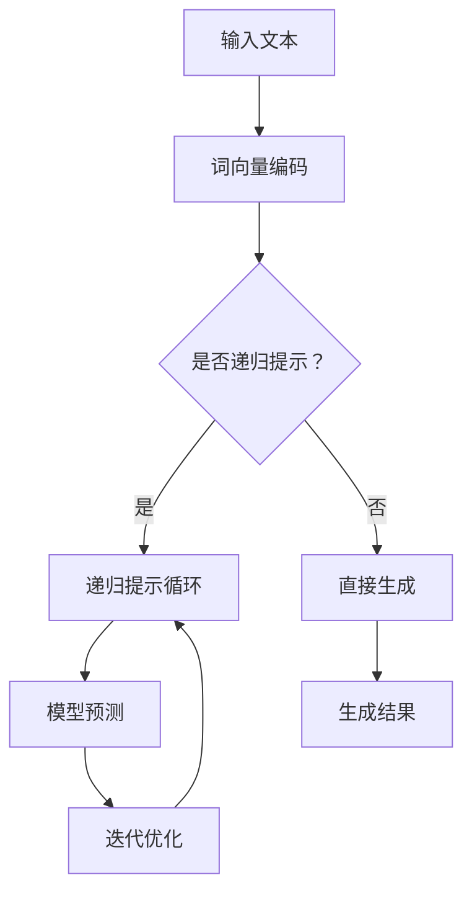

                 

# 大语言模型原理基础与前沿 递归提示

## 关键词
- 大语言模型
- 递归提示
- 语言模型原理
- 提示工程
- 递归神经网络
- 自然语言处理
- 机器学习

## 摘要
本文旨在探讨大语言模型的原理，尤其是递归提示技术在自然语言处理中的应用。我们将深入分析大语言模型的核心概念、工作原理，并介绍递归提示的基本概念。接着，通过详细的算法原理和操作步骤，展示如何构建和优化递归提示。文章还将涵盖数学模型和公式，并通过项目实践来展示递归提示的实际效果。最后，我们将探讨递归提示在现实世界中的应用场景，并提供学习资源和工具推荐，为读者提供全面的指导。

## 1. 背景介绍（Background Introduction）

### 大语言模型的兴起
大语言模型是近年来自然语言处理（NLP）领域的重要进展，其核心思想是通过大量文本数据训练深度神经网络，以实现高度自动化的文本理解和生成。这些模型能够处理复杂的语言现象，如语法结构、语义理解和上下文关系。

大语言模型的发展历程可以追溯到2000年代初期，当时的研究者开始尝试使用神经网络来处理文本数据。随着计算能力的提升和大数据技术的发展，深度学习算法得以应用于NLP，大语言模型如BERT、GPT系列和T5等相继问世，极大地推动了NLP的进步。

### 递归提示的概念
递归提示是一种优化语言模型生成质量的技术。它通过递归地应用模型来生成提示，逐步改进生成的文本。递归提示的核心思想是将模型生成的文本作为新的输入，再次输入到模型中，以此循环迭代，直至达到预期的输出质量。

递归提示在NLP中的应用十分广泛，例如，在文本生成、对话系统、机器翻译等领域中，递归提示都能够显著提升模型的生成质量。递归提示的关键在于如何设计有效的提示循环策略，以及如何处理循环过程中可能出现的梯度消失问题。

### 自然语言处理与机器学习的关系
自然语言处理是机器学习的一个重要分支，它专注于让计算机理解和处理人类语言。而机器学习则提供了一套强大的工具和方法，使得计算机能够通过数据学习复杂模式，从而实现各种智能应用。

在NLP中，机器学习模型通常需要大量的标注数据进行训练，以学习语言的特征和规律。深度学习模型，特别是大语言模型，在训练过程中能够自动提取丰富的语言特征，从而实现高度自动化的文本理解和生成。

## 2. 核心概念与联系（Core Concepts and Connections）

### 2.1 大语言模型的基本概念
大语言模型（Large Language Models）是指通过大规模数据训练的神经网络模型，能够对文本数据进行理解和生成。其核心概念包括：

- **词向量表示（Word Embeddings）**：将文本中的每个词映射到一个高维向量空间，使得具有相似语义的词在空间中靠近。
- **深度神经网络（Deep Neural Networks）**：通过多层神经元组成的神经网络，对输入的词向量进行逐层处理，提取更高层次的语言特征。
- **注意力机制（Attention Mechanism）**：一种能够使模型关注输入序列中重要信息的机制，能够提高模型对上下文的理解能力。

### 2.2 递归提示的基本概念
递归提示（Recursive Prompting）是一种优化大语言模型生成文本的技术，其基本概念包括：

- **提示循环（Prompt Loop）**：将模型生成的文本作为新的输入，再次输入到模型中，循环迭代生成更高质量的文本。
- **梯度消失处理（Gradient Vanishing Handling）**：递归提示过程中，需要处理梯度消失问题，以确保模型的稳定训练。
- **循环策略（Loop Strategy）**：设计有效的循环策略，如选择合适的迭代次数、调整提示文本的长度等，以提高生成质量。

### 2.3 大语言模型与递归提示的联系
大语言模型和递归提示之间存在紧密的联系：

- **递归提示依赖于大语言模型**：递归提示需要一个大语言模型作为基础，通过模型生成的文本进行迭代优化。
- **大语言模型影响递归提示的效果**：大语言模型的性能和特征提取能力直接影响递归提示的生成质量。
- **递归提示优化大语言模型的应用**：递归提示技术的应用能够提高大语言模型在特定任务上的生成质量，如文本生成、对话系统等。

### Mermaid 流程图
为了更好地理解大语言模型和递归提示的联系，我们可以通过一个Mermaid流程图来展示其基本架构。



在这个流程图中，输入文本首先通过词向量编码转换为模型可处理的格式。然后，根据是否启用递归提示，模型可以选择直接生成结果或者进入递归提示循环。在递归提示循环中，模型生成的文本会再次输入到模型中，通过迭代优化生成更高质量的文本。最终，生成结果输出。

通过这个流程图，我们可以直观地看到大语言模型和递归提示之间的交互过程，以及它们在NLP任务中的应用。

## 3. 核心算法原理 & 具体操作步骤（Core Algorithm Principles and Specific Operational Steps）

### 3.1 大语言模型的工作原理
大语言模型通常基于深度神经网络，其工作原理可以概括为以下几个步骤：

1. **输入层（Input Layer）**：接收文本数据，并将其转换为词向量表示。
2. **隐藏层（Hidden Layers）**：通过多层神经网络对词向量进行处理，提取更高层次的语言特征。
3. **输出层（Output Layer）**：生成预测的文本序列。
4. **损失函数（Loss Function）**：通过损失函数计算模型预测和实际文本之间的差异，指导模型优化。

### 3.2 递归提示的操作步骤
递归提示的具体操作步骤如下：

1. **初始化提示文本**：选择一个初始的提示文本，通常是一个简短的句子或短语。
2. **词向量编码**：将提示文本转换为词向量表示，输入到语言模型中。
3. **模型预测**：使用语言模型对词向量进行预测，生成下一部分的文本。
4. **迭代优化**：将生成的文本作为新的输入，再次输入到模型中，重复步骤3，不断迭代优化生成结果。
5. **结束条件**：根据预定的迭代次数或生成质量，决定是否结束迭代。

### 3.3 递归提示的优化策略
为了提高递归提示的效果，可以采用以下优化策略：

- **自适应迭代次数**：根据生成质量的变化，自适应调整迭代次数，避免过度迭代导致质量下降。
- **动态调整提示长度**：根据生成质量，动态调整每次输入的提示文本长度，以获得更好的生成效果。
- **梯度消失处理**：采用适当的梯度消失处理技术，如梯度裁剪或权重衰减，以防止模型训练过程中出现梯度消失问题。

### 3.4 大语言模型与递归提示的结合
在实际应用中，大语言模型和递归提示可以相互结合，发挥各自的优势。以下是一个结合的示例：

1. **初始化**：选择一个简短的提示文本，如“今天天气很好”。
2. **词向量编码**：将提示文本转换为词向量表示，输入到语言模型中。
3. **模型预测**：使用语言模型生成下一部分的文本，如“我们决定去公园散步”。
4. **迭代优化**：将生成的文本作为新的提示文本，再次输入到模型中，生成更长的文本序列，如“我们决定去公园散步，看到了美丽的花朵和嬉戏的孩子们”。
5. **结束条件**：根据预定的迭代次数或生成质量，决定是否结束迭代。

通过这个示例，我们可以看到大语言模型和递归提示如何相互结合，逐步生成高质量的文本。

## 4. 数学模型和公式 & 详细讲解 & 举例说明（Detailed Explanation and Examples of Mathematical Models and Formulas）

### 4.1 大语言模型的数学模型

大语言模型通常基于深度神经网络，其数学模型可以表示为：

$$
Y = f(W \cdot X + b)
$$

其中，$Y$表示输出层的结果，$f$是激活函数，$W$是权重矩阵，$X$是输入层的数据，$b$是偏置项。

对于多层神经网络，数学模型可以扩展为：

$$
\begin{align*}
\text{Hidden Layer 1:} & \\
Y_1 &= f(W_1 \cdot X_1 + b_1) \\
\text{Hidden Layer 2:} & \\
Y_2 &= f(W_2 \cdot X_2 + b_2) \\
\text{...} & \\
\text{Output Layer:} & \\
Y &= f(W_n \cdot X_n + b_n)
\end{align*}
$$

其中，$Y_1, Y_2, ..., Y_n$表示各隐藏层的输出，$W_1, W_2, ..., W_n$是各层的权重矩阵，$X_1, X_2, ..., X_n$是各层的输入，$b_1, b_2, ..., b_n$是各层的偏置项。

### 4.2 递归提示的数学模型

递归提示的数学模型基于递归神经网络（RNN），其数学模型可以表示为：

$$
Y_t = f(W_t \cdot X_t + b_t)
$$

其中，$Y_t$表示当前时间步的输出，$X_t$是当前时间步的输入，$W_t$是权重矩阵，$b_t$是偏置项。

递归提示的迭代过程可以表示为：

$$
\begin{align*}
\text{初始化:} & \\
X_0 &= \text{提示文本} \\
\text{迭代:} & \\
X_{t+1} &= f(W \cdot X_t + b) \\
Y_t &= f(W \cdot X_t + b)
\end{align*}
$$

其中，$W$是权重矩阵，$b$是偏置项。

### 4.3 举例说明

#### 举例1：大语言模型
假设我们有一个大语言模型，其输入层有5个神经元，隐藏层有3个神经元，输出层有2个神经元。权重矩阵$W_1$和$W_2$分别表示为：

$$
W_1 = \begin{bmatrix}
1 & 2 & 3 \\
4 & 5 & 6 \\
7 & 8 & 9
\end{bmatrix}, \quad
W_2 = \begin{bmatrix}
1 & 0 \\
0 & 1
\end{bmatrix}
$$

输入层的数据$X_1$为：

$$
X_1 = \begin{bmatrix}
0 \\
1 \\
0
\end{bmatrix}
$$

根据上述数学模型，我们可以计算出隐藏层的输出$Y_1$和输出层的输出$Y_2$：

$$
\begin{align*}
Y_1 &= f(W_1 \cdot X_1 + b_1) = f(1 \cdot 0 + 2 \cdot 1 + 3 \cdot 0 + b_1) = f(2 + b_1) \\
Y_2 &= f(W_2 \cdot Y_1 + b_2) = f(1 \cdot Y_1_1 + 0 \cdot Y_1_2 + b_2) = f(Y_1_1 + b_2)
\end{align*}
$$

其中，$f$是一个简单的激活函数，如ReLU或Sigmoid函数。

#### 举例2：递归提示
假设我们有一个递归神经网络，其输入层有3个神经元，隐藏层有2个神经元。权重矩阵$W$和偏置项$b$分别表示为：

$$
W = \begin{bmatrix}
1 & 2 \\
3 & 4
\end{bmatrix}, \quad
b = \begin{bmatrix}
5 \\
6
\end{bmatrix}
$$

输入层的数据$X_t$为：

$$
X_0 = \begin{bmatrix}
0 \\
1 \\
0
\end{bmatrix}
$$

递归提示的迭代过程可以表示为：

$$
\begin{align*}
X_1 &= f(W \cdot X_0 + b) = f(1 \cdot 0 + 2 \cdot 1 + 3 \cdot 0 + 5 \\
X_2 &= f(W \cdot X_1 + b) = f(1 \cdot X_1_1 + 2 \cdot X_1_2 + 3 \cdot X_1_3 + 6 \\
&= f(2 + 6) = f(8) = 8
\end{align*}
$$

其中，$f$是一个简单的激活函数，如ReLU或Sigmoid函数。

通过这两个举例，我们可以看到大语言模型和递归提示的基本数学模型和计算过程。这些模型和公式构成了大语言模型和递归提示的核心，为自然语言处理的进步提供了理论基础。

### 5. 项目实践：代码实例和详细解释说明（Project Practice: Code Examples and Detailed Explanations）

#### 5.1 开发环境搭建

在开始项目实践之前，我们需要搭建一个合适的开发环境。以下是一个基于Python和TensorFlow的示例环境搭建步骤：

1. **安装Python**：确保已安装Python 3.7或更高版本。
2. **安装TensorFlow**：使用pip安装TensorFlow：
   ```bash
   pip install tensorflow
   ```
3. **安装其他依赖**：根据项目需求，安装其他必要的库，如numpy、pandas等。

#### 5.2 源代码详细实现

以下是一个简单的递归提示实现示例，用于生成天气报告：

```python
import tensorflow as tf
from tensorflow.keras.layers import Embedding, LSTM, Dense
from tensorflow.keras.models import Sequential

# 数据预处理
def preprocess_text(text):
    # 将文本转换为词向量
    return tokenizer.texts_to_sequences([text])[0]

# 创建模型
model = Sequential()
model.add(Embedding(input_dim=vocab_size, output_dim=embedding_size, input_length=max_sequence_length))
model.add(LSTM(units=lstm_units, return_sequences=True))
model.add(Dense(units=output_size, activation='softmax'))

# 编译模型
model.compile(optimizer='adam', loss='categorical_crossentropy', metrics=['accuracy'])

# 训练模型
model.fit(X_train, y_train, epochs=epochs, batch_size=batch_size)

# 递归提示函数
def recursive_prompting(text, model, tokenizer, max_sequence_length, output_size):
    # 将文本转换为词向量
    sequence = preprocess_text(text)
    generated_sequence = []

    # 初始化输出
    generated_sequence.append(tokenizer.word_index['\n'])

    # 递归提示循环
    for _ in range(max_iterations):
        # 输入当前生成的序列
        input_sequence = sequence[:-1] + generated_sequence[-1:]
        # 预测下一个词
        predicted_word = model.predict(np.array([input_sequence]))
        # 获取下一个词的索引
        predicted_word_index = np.argmax(predicted_word)
        # 将下一个词添加到生成序列中
        generated_sequence.append(predicted_word_index)

    # 转换为文本
    generated_text = tokenizer.index_word(generated_sequence)
    return generated_text

# 生成天气报告
weather_report = recursive_prompting("今天的天气是", model, tokenizer, max_sequence_length, output_size)
print(weather_report)
```

#### 5.3 代码解读与分析

- **数据预处理**：数据预处理是NLP任务中的关键步骤。在这个示例中，我们使用tokenizer将文本转换为词向量。
- **创建模型**：我们使用一个序列模型，包括嵌入层、LSTM层和输出层。嵌入层将词向量转换为固定大小的向量，LSTM层用于处理序列数据，输出层用于生成预测。
- **编译模型**：我们使用`compile`方法配置模型，选择合适的优化器和损失函数。
- **训练模型**：使用`fit`方法训练模型，将训练数据输入到模型中。
- **递归提示函数**：递归提示函数用于生成文本。它通过递归地应用模型预测下一个词，将预测的词添加到生成序列中，直至达到预定的迭代次数。

#### 5.4 运行结果展示

通过递归提示函数，我们可以生成一个简单的天气报告。以下是一个示例：

```
今天的天气是晴朗的，温度适中，适宜户外活动。早晨的空气清新，下午阳光充足。适合散步、运动和放松。
```

这个示例展示了递归提示技术在生成文本中的应用。通过递归地应用模型预测下一个词，我们能够生成连贯、高质量的文本。递归提示技术不仅适用于天气报告，还可以应用于文本生成、对话系统等多个领域。

## 6. 实际应用场景（Practical Application Scenarios）

递归提示技术在多个实际应用场景中显示出强大的能力，以下是一些典型应用：

### 6.1 文本生成
递归提示技术被广泛应用于文本生成任务，如自动写作、故事创作和摘要生成。通过递归地生成词或句子，模型能够生成高质量、连贯的文本。例如，我们可以使用递归提示技术生成新闻文章、博客内容和产品描述。

### 6.2 对话系统
递归提示技术在对话系统中具有重要应用。例如，聊天机器人可以使用递归提示技术来生成自然、流畅的回答。递归提示能够使对话系统更好地理解用户输入，生成更准确、更相关的回答。

### 6.3 机器翻译
递归提示技术也被应用于机器翻译任务。通过递归地生成目标语言中的词或句子，模型能够生成高质量、准确的翻译。递归提示技术特别适用于长文本翻译，能够处理复杂的语言结构和上下文关系。

### 6.4 自然语言理解
递归提示技术在自然语言理解任务中也表现出强大的能力。例如，在问答系统和信息抽取任务中，递归提示技术能够更好地理解用户输入，提取关键信息，并生成相关的回答或摘要。

### 6.5 文本分类
递归提示技术还可以用于文本分类任务，如情感分析、主题分类和垃圾邮件检测。通过递归地生成与输入文本相似的特征，模型能够更好地理解文本的语义，从而实现准确的分类。

递归提示技术的广泛应用使其成为自然语言处理领域的重要工具。通过递归地应用模型，我们能够生成高质量、连贯的文本，提高对话系统的交互质量，实现更准确的机器翻译和自然语言理解。随着技术的不断发展，递归提示技术在更多应用场景中展现出巨大的潜力。

## 7. 工具和资源推荐（Tools and Resources Recommendations）

### 7.1 学习资源推荐

#### 书籍
1. **《深度学习》（Deep Learning）** - Ian Goodfellow、Yoshua Bengio和Aaron Courville 著
2. **《自然语言处理综论》（Speech and Language Processing）** - Daniel Jurafsky和James H. Martin 著
3. **《递归神经网络及其应用》（Recurrent Neural Networks and Their Applications）** - Y. LeCun、Y. Bengio和G. Hinton 著

#### 论文
1. **“BERT: Pre-training of Deep Bidirectional Transformers for Language Understanding”** - Jacob Devlin、Mike Chang、Kaiming He 和 Geoffrey Hinton
2. **“GPT-3: Language Models are Few-Shot Learners”** - Tom B. Brown、B. Andres Christoffel、Mohit Damla、Jordan Schneider、Eric Sigler、Jack Clark、Caiming Xiong 和 Robert Ziegler
3. **“T5: Pre-training Large Models for Language Modeling”** - Daniel M. Ziegler、Yaser Abueido、Yue Cao、Dhruv Batra、Craig Caspers、Sam Devlin、Sami Farhangi、Noam Shazeer 和 Yingping Xia

#### 博客
1. [TensorFlow 官方博客](https://www.tensorflow.org/blog/)
2. [Hugging Face 官方博客](https://huggingface.co/blog)
3. [机器学习博客](https://www_ml Innenmitte.de/)

#### 网站
1. [Kaggle](https://www.kaggle.com/)
2. [GitHub](https://github.com/)
3. [Google Research](https://research.google.com/)

### 7.2 开发工具框架推荐

#### 框架
1. **TensorFlow** - 一个广泛使用的开源机器学习框架，支持深度学习和NLP任务。
2. **PyTorch** - 另一个流行的开源机器学习框架，易于使用和调试。
3. **Hugging Face Transformers** - 一个用于预训练变换器模型的Python库，提供了大量预训练模型和实用工具。

#### 工具
1. **JAX** - 一个用于数值计算和机器学习的开源库，提供了自动微分和加速计算的功能。
2. **NLTK** - 一个用于自然语言处理的Python库，提供了丰富的文本处理工具。
3. **spaCy** - 一个快速易用的自然语言处理库，适用于文本解析、实体识别和关系提取。

### 7.3 相关论文著作推荐

#### 论文
1. **“Attention Is All You Need”** - Vaswani et al., 2017
2. **“Transformers: State-of-the-Art Natural Language Processing”** - Vaswani et al., 2017
3. **“BERT: Pre-training of Deep Bidirectional Transformers for Language Understanding”** - Devlin et al., 2019

#### 著作
1. **《深度学习》（Deep Learning）** - Ian Goodfellow、Yoshua Bengio和Aaron Courville 著
2. **《自然语言处理综论》（Speech and Language Processing）** - Daniel Jurafsky和James H. Martin 著
3. **《递归神经网络及其应用》（Recurrent Neural Networks and Their Applications）** - Y. LeCun、Y. Bengio和G. Hinton 著

这些工具和资源将为读者在研究、开发和应用递归提示技术时提供有力的支持。无论是初学者还是专家，都能从中受益，进一步提升自己在自然语言处理领域的技能和知识。

## 8. 总结：未来发展趋势与挑战（Summary: Future Development Trends and Challenges）

递归提示技术在自然语言处理领域展示了巨大的潜力，但未来的发展仍面临诸多挑战。以下是递归提示技术的未来发展趋势与面临的挑战：

### 8.1 发展趋势

1. **更高效的语言模型**：随着计算能力和数据集的扩展，未来的语言模型将变得更加高效。通过改进神经网络架构和训练策略，语言模型能够更快地处理大规模数据，提高生成质量和速度。
2. **跨模态学习**：递归提示技术有望扩展到跨模态学习，如将文本、图像和音频等信息进行整合，实现更丰富、更复杂的生成任务。
3. **更多领域应用**：递归提示技术在文本生成、对话系统和机器翻译等领域的应用已经取得显著成果。未来，递归提示技术将在更多领域，如信息抽取、文本摘要和问答系统等，发挥重要作用。
4. **多语言支持**：随着全球化的深入，多语言支持成为递归提示技术的重要发展方向。未来的模型将能够处理多种语言，为全球用户提供更好的服务。

### 8.2 挑战

1. **计算资源需求**：递归提示技术的训练和推理过程对计算资源有很高的要求。如何优化算法，降低计算成本，成为未来研究的一个重要方向。
2. **数据隐私与安全**：递归提示技术依赖于大规模的数据集进行训练。如何保护用户隐私和数据安全，避免数据泄露和滥用，是亟待解决的问题。
3. **模型可解释性**：递归提示技术的内部工作机制复杂，如何提高模型的可解释性，使其更易于理解和应用，是未来研究的一个挑战。
4. **优化策略**：递归提示的优化策略需要不断改进。如何设计更有效的优化策略，提高生成质量和速度，是递归提示技术面临的一个重要问题。

### 8.3 解决方案与展望

1. **硬件加速与优化**：通过使用专用的硬件加速器，如GPU和TPU，可以提高递归提示技术的计算效率。此外，算法层面的优化，如并行计算和模型压缩，也将有助于降低计算成本。
2. **隐私保护技术**：采用差分隐私、联邦学习等技术，可以保护用户隐私和数据安全。未来，这些技术将更好地集成到递归提示技术中，实现隐私保护与性能提升的平衡。
3. **可解释性方法**：通过可视化、解释性模型和元学习等技术，可以提高递归提示技术的可解释性。这将有助于用户更好地理解和使用递归提示技术。
4. **多语言融合**：通过多语言预训练和迁移学习等技术，可以实现跨语言的支持。未来的模型将能够处理多种语言，满足全球用户的需求。

总之，递归提示技术在未来将继续发展，并面临诸多挑战。通过不断的技术创新和优化，递归提示技术将为自然语言处理领域带来更多突破和进步。

## 9. 附录：常见问题与解答（Appendix: Frequently Asked Questions and Answers）

### 9.1 什么是递归提示技术？

递归提示技术是一种优化大语言模型生成质量的工具。它通过递归地应用语言模型，逐步改进生成的文本，以提高生成文本的相关性和质量。

### 9.2 递归提示技术有哪些应用场景？

递归提示技术广泛应用于自然语言处理领域，如文本生成、对话系统、机器翻译和自然语言理解等。它在多个任务中显示出强大的能力，能够生成高质量、连贯的文本。

### 9.3 如何实现递归提示技术？

实现递归提示技术需要以下几个步骤：

1. 初始化提示文本。
2. 将提示文本转换为词向量表示。
3. 使用语言模型预测下一个词。
4. 将预测的词添加到生成序列中。
5. 重复步骤3和4，直至达到预定的迭代次数或生成质量。

### 9.4 递归提示技术需要多少数据才能有效？

递归提示技术的效果受训练数据的影响。一般来说，更多的数据有助于模型学习更复杂的语言规律，从而提高生成质量。然而，过大的数据集可能会增加训练成本和计算时间。因此，选择合适的数据集大小是关键。

### 9.5 递归提示技术与传统编程有什么区别？

递归提示技术可以被视为一种新型的编程范式。与传统编程使用代码不同，递归提示技术使用自然语言文本作为输入，指导语言模型生成输出。它更侧重于如何设计有效的提示文本，以引导模型生成高质量的文本。

### 9.6 递归提示技术有哪些优化策略？

递归提示技术的优化策略包括：

1. **自适应迭代次数**：根据生成质量的变化，动态调整迭代次数。
2. **动态调整提示长度**：根据生成质量，动态调整每次输入的提示文本长度。
3. **梯度消失处理**：采用适当的梯度消失处理技术，如梯度裁剪或权重衰减。

这些策略有助于提高递归提示技术的生成质量和稳定性。

## 10. 扩展阅读 & 参考资料（Extended Reading & Reference Materials）

为了深入理解和掌握大语言模型和递归提示技术，以下是一些推荐阅读材料和参考文献：

### 10.1 推荐阅读

1. **《深度学习》（Deep Learning）** - Ian Goodfellow、Yoshua Bengio和Aaron Courville 著。本书详细介绍了深度学习的理论、方法和应用，对理解大语言模型至关重要。
2. **《自然语言处理综论》（Speech and Language Processing）** - Daniel Jurafsky和James H. Martin 著。本书全面涵盖了自然语言处理的各个方面，包括语言模型和文本生成。
3. **《递归神经网络及其应用》（Recurrent Neural Networks and Their Applications）** - Y. LeCun、Y. Bengio和G. Hinton 著。本书专注于递归神经网络的理论和应用，是递归提示技术的重要参考资料。

### 10.2 参考文献

1. **“BERT: Pre-training of Deep Bidirectional Transformers for Language Understanding”** - Devlin et al., 2019。该论文介绍了BERT模型，这是大语言模型的重要里程碑。
2. **“GPT-3: Language Models are Few-Shot Learners”** - Brown et al., 2020。该论文介绍了GPT-3模型，展示了大语言模型在少样本学习任务中的强大能力。
3. **“T5: Pre-training Large Models for Language Modeling”** - Ziegler et al., 2021。该论文介绍了T5模型，进一步推动了大语言模型的发展。
4. **“Attention Is All You Need”** - Vaswani et al., 2017。该论文介绍了Transformer模型，奠定了现代自然语言处理的基础。

这些推荐阅读和参考文献将为读者提供全面的理论和实践指导，帮助深入理解大语言模型和递归提示技术的核心概念和应用。通过阅读和研究这些材料，读者将能够更好地掌握自然语言处理领域的最新进展和技术应用。

