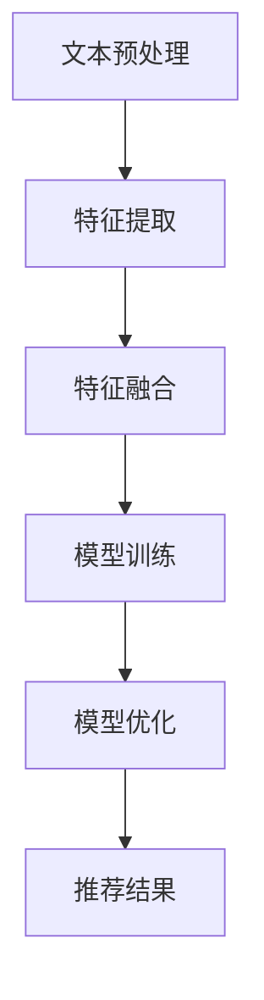

                 

# 大语言模型在推荐系统特征选择中的应用

## 文章关键词
- 大语言模型
- 推荐系统
- 特征选择
- 自然语言处理
- 机器学习

## 摘要
本文探讨了如何利用大语言模型（如GPT-3、BERT等）在推荐系统特征选择中的实际应用。通过对推荐系统基本原理的回顾，结合大语言模型在特征提取和表征方面的优势，文章详细阐述了基于大语言模型的特征选择方法，并通过数学模型和实际代码实例进行了深入分析，最后提出了未来发展趋势与挑战。

## 1. 背景介绍（Background Introduction）

推荐系统作为电子商务、社交媒体和内容平台的核心组成部分，已经成为现代互联网生态系统中不可或缺的一部分。其基本原理是通过分析用户历史行为和偏好，为用户推荐可能感兴趣的商品、内容或服务。传统的推荐系统主要依赖于基于内容、协同过滤和混合方法等，但都面临特征选择和建模的挑战。

特征选择是推荐系统的关键环节，直接影响到推荐系统的性能。传统特征选择方法主要依赖于专家经验和统计方法，如卡方检验、互信息等。然而，这些方法往往存在以下问题：

- **手动特征工程工作量巨大**：需要大量的专家知识和时间来设计、选择和优化特征。
- **特征表达能力有限**：传统特征选择方法难以捕捉用户行为和内容之间的复杂关系。
- **模型泛化能力受限**：特征选择过程中可能会引入偏差，限制模型的泛化能力。

近年来，随着深度学习和自然语言处理技术的不断发展，大语言模型在特征提取和表征方面展现出了巨大的潜力。大语言模型具有以下几个特点：

- **强大的文本处理能力**：能够处理和理解大规模的文本数据，从而捕捉用户和物品的复杂特征。
- **自动特征提取**：无需手动设计特征，模型可以自动从原始数据中学习有效的特征表示。
- **高效表征能力**：能够将用户和物品的属性转化为高维向量表示，便于后续的推荐算法使用。

基于以上特点，本文将探讨如何利用大语言模型在推荐系统特征选择中的应用，旨在提高推荐系统的性能和可解释性。

## 2. 核心概念与联系（Core Concepts and Connections）

### 2.1 大语言模型的基本原理

大语言模型，如GPT-3、BERT等，是基于深度学习的自然语言处理模型，其核心思想是通过学习大量文本数据来理解和生成自然语言。以下是一些关键概念：

- **词嵌入（Word Embeddings）**：将单词映射到高维向量空间，以便进行数学运算。常见的词嵌入方法包括Word2Vec、GloVe等。
- **循环神经网络（RNN）**：用于处理序列数据，如自然语言。RNN通过隐藏状态来记忆历史信息，从而捕捉序列中的长距离依赖。
- **变换器模型（Transformer）**：基于注意力机制的新型神经网络架构，能够高效地处理长文本序列。BERT、GPT-3等大语言模型都是基于Transformer架构。

### 2.2 推荐系统的基本架构

推荐系统的基本架构通常包括用户、物品、评分和推荐算法等组件。以下是一个简单的推荐系统架构：

```
用户 -》行为数据 -》特征提取 -》模型训练 -》推荐算法 -》推荐结果
物品
```

其中，特征提取是推荐系统的核心环节，直接影响推荐效果。传统特征提取方法主要包括：

- **基于内容的特征提取**：通过分析用户和物品的属性，提取特征向量。例如，物品的文本描述、分类标签等。
- **协同过滤特征提取**：通过分析用户行为数据，如购买历史、评分记录等，提取特征向量。

### 2.3 大语言模型与推荐系统特征选择的结合

大语言模型在特征提取和表征方面的优势，使其成为推荐系统特征选择的有力工具。结合大语言模型，推荐系统特征选择的方法可以概述如下：

1. **文本预处理**：对用户行为数据和物品属性进行文本预处理，如分词、去停用词等。
2. **特征提取**：利用大语言模型，如BERT，将预处理后的文本转化为高维向量表示。
3. **特征融合**：将大语言模型生成的特征向量与其他传统特征向量进行融合，形成统一的特征表示。
4. **模型训练与优化**：利用融合后的特征，训练推荐模型，并进行模型优化。

### 2.4 Mermaid 流程图

以下是一个简单的 Mermaid 流程图，展示了基于大语言模型的推荐系统特征选择过程：



通过上述流程，大语言模型能够有效地提取和表征推荐系统中的关键特征，从而提高推荐性能。

## 3. 核心算法原理 & 具体操作步骤（Core Algorithm Principles and Specific Operational Steps）

### 3.1 大语言模型在特征选择中的应用

大语言模型在推荐系统特征选择中的应用，主要基于其强大的文本处理能力和自动特征提取能力。以下是一个基于BERT模型的特征选择流程：

1. **文本预处理**：
   - 对用户行为数据和物品属性进行清洗和预处理，如分词、去停用词、词干提取等。
   - 将预处理后的文本转化为BERT模型输入格式。

2. **特征提取**：
   - 使用BERT模型对输入文本进行编码，生成高维向量表示。BERT模型通过预训练大量文本数据，能够自动学习文本的语义特征。
   - 提取BERT模型的输出向量，作为用户和物品的特征表示。

3. **特征融合**：
   - 将BERT模型生成的特征向量与其他传统特征向量（如基于内容的特征、协同过滤特征等）进行融合，形成统一的特征表示。
   - 可以使用加权平均、求和等方法进行特征融合。

4. **模型训练与优化**：
   - 利用融合后的特征向量，训练推荐模型（如基于矩阵分解的推荐模型、基于神经网络的推荐模型等）。
   - 对模型进行优化，调整超参数，以提高推荐性能。

### 3.2 具体操作步骤

以下是一个具体的操作步骤，以BERT模型为例，展示如何实现基于大语言模型的推荐系统特征选择：

1. **数据预处理**：

   ```python
   import pandas as pd
   import numpy as np
   from transformers import BertTokenizer, BertModel

   # 加载数据
   user_data = pd.read_csv('user_data.csv')
   item_data = pd.read_csv('item_data.csv')

   # 分词和去停用词
   tokenizer = BertTokenizer.from_pretrained('bert-base-chinese')
   def preprocess_text(text):
       tokens = tokenizer.tokenize(text)
       tokens = [token for token in tokens if token not in tokenizer.get_vocab().get('')['tokens']]
       return ' '.join(tokens)

   user_data['processed_desc'] = user_data['description'].apply(preprocess_text)
   item_data['processed_desc'] = item_data['description'].apply(preprocess_text)

   # 转化为BERT模型输入格式
   inputs = tokenizer(user_data['processed_desc'].tolist(), return_tensors='pt', padding=True, truncation=True)
   inputs2 = tokenizer(item_data['processed_desc'].tolist(), return_tensors='pt', padding=True, truncation=True)
   ```

2. **特征提取**：

   ```python
   # 加载BERT模型
   model = BertModel.from_pretrained('bert-base-chinese')

   # 提取特征向量
   with torch.no_grad():
       user_features = model(**inputs).last_hidden_state.mean(dim=1).detach().numpy()
       item_features = model(**inputs2).last_hidden_state.mean(dim=1).detach().numpy()
   ```

3. **特征融合**：

   ```python
   # 将BERT特征与其他特征融合
   user_features = np.hstack((user_features, user_data[['age', 'gender', 'location']].values))
   item_features = np.hstack((item_features, item_data[['category', 'price']].values))

   # 加权平均
   user_item_features = 0.5 * user_features + 0.5 * item_features
   ```

4. **模型训练与优化**：

   ```python
   # 利用融合后的特征训练推荐模型
   # 这里以基于矩阵分解的推荐模型为例
   import torch
   from torch import nn

   class MatrixFactorizationModel(nn.Module):
       def __init__(self, user_features, item_features):
           super(MatrixFactorizationModel, self).__init__()
           self.user_embedding = nn.Embedding(user_features.shape[0], user_features.shape[1])
           self.item_embedding = nn.Embedding(item_features.shape[0], item_features.shape[1])
           self.user_embedding.weight.data.copy_(torch.tensor(user_features, dtype=torch.float32))
           self.item_embedding.weight.data.copy_(torch.tensor(item_features, dtype=torch.float32))
           self.fc = nn.Linear(2 * item_features.shape[1], 1)

       def forward(self, user_idx, item_idx):
           user_embedding = self.user_embedding(user_idx)
           item_embedding = self.item_embedding(item_idx)
           combined_embedding = torch.cat((user_embedding, item_embedding), dim=1)
           return self.fc(combined_embedding).squeeze()

   # 模型训练
   model = MatrixFactorizationModel(user_features, item_features)
   optimizer = torch.optim.Adam(model.parameters(), lr=0.001)
   criterion = nn.MSELoss()

   for epoch in range(100):
       optimizer.zero_grad()
       user_idx = torch.tensor(user_data['user_id'].values, dtype=torch.long)
       item_idx = torch.tensor(item_data['item_id'].values, dtype=torch.long)
       predicted Ratings = model(user_idx, item_idx)
       loss = criterion(predicted Ratings, torch.tensor(ratings, dtype=torch.float32))
       loss.backward()
       optimizer.step()
   ```

通过上述步骤，我们可以利用大语言模型实现推荐系统的特征选择，从而提高推荐性能和可解释性。

## 4. 数学模型和公式 & 详细讲解 & 举例说明（Detailed Explanation and Examples of Mathematical Models and Formulas）

### 4.1 BERT 模型的数学表示

BERT（Bidirectional Encoder Representations from Transformers）模型是一种基于 Transformer 架构的预训练语言模型。其核心思想是通过对大量文本数据进行双向编码，学习文本的语义表示。BERT 模型主要包括编码器（Encoder）和解码器（Decoder）两部分。

- **编码器（Encoder）**：编码器的输入是一个长度为 $T$ 的词序列，输出是一个长度为 $T$ 的隐藏状态序列。编码器的核心组件是多层 Transformer 堆叠而成的 Encoder Layer。
- **解码器（Decoder）**：解码器的输入是编码器的输出，输出是解码后的词序列。解码器的核心组件是多层 Transformer 堆叠而成的 Decoder Layer。

BERT 模型的数学表示如下：

$$
\text{Encoder} (\text{Input}) = \text{LayerNorm} (\text{Dropout} (\text{Embeddings} + \text{Positional Encodings}))
$$

其中，$\text{Embeddings}$ 表示词嵌入层，$\text{Positional Encodings}$ 表示位置编码层，$\text{Dropout}$ 表示 dropout 操作，$\text{LayerNorm}$ 表示层标准化操作。

### 4.2 特征选择中的数学模型

在推荐系统的特征选择中，利用 BERT 模型提取文本特征的过程可以表示为以下数学模型：

$$
\text{Text Feature} = \text{BERT} (\text{Text Data})
$$

其中，$\text{BERT}$ 表示 BERT 模型，$\text{Text Data}$ 表示输入文本数据。

为了具体说明特征选择的过程，我们可以将上述模型拆分为以下几个步骤：

1. **文本预处理**：
   - 对文本数据进行分词、去停用词等预处理操作。
   - 将预处理后的文本转化为 BERT 模型的输入序列。

2. **词嵌入**：
   - 将词序列映射为词嵌入向量。

3. **位置编码**：
   - 为词嵌入向量添加位置信息。

4. **编码**：
   - 通过多层 Transformer 堆叠进行编码，生成文本特征向量。

5. **特征提取**：
   - 从编码后的隐藏状态中提取文本特征。

下面通过一个具体的例子来说明如何利用 BERT 模型进行特征选择。

### 4.3 例子：基于 BERT 的商品推荐系统

假设我们有一个商品推荐系统，用户的行为数据包括购买记录、浏览记录等，商品属性包括文本描述、分类标签等。我们希望通过 BERT 模型提取用户和商品的文本特征，并将其与其他传统特征进行融合，以训练一个推荐模型。

1. **文本预处理**：

   ```python
   import pandas as pd
   from transformers import BertTokenizer

   # 加载数据
   user_data = pd.read_csv('user_data.csv')
   item_data = pd.read_csv('item_data.csv')

   # 分词和去停用词
   tokenizer = BertTokenizer.from_pretrained('bert-base-chinese')
   def preprocess_text(text):
       tokens = tokenizer.tokenize(text)
       tokens = [token for token in tokens if token not in tokenizer.get_vocab().get('')['tokens']]
       return ' '.join(tokens)

   user_data['processed_desc'] = user_data['description'].apply(preprocess_text)
   item_data['processed_desc'] = item_data['description'].apply(preprocess_text)
   ```

2. **词嵌入与位置编码**：

   ```python
   from transformers import BertModel

   # 加载BERT模型
   model = BertModel.from_pretrained('bert-base-chinese')

   # 转化为BERT模型输入格式
   inputs = tokenizer(user_data['processed_desc'].tolist(), return_tensors='pt', padding=True, truncation=True)
   inputs2 = tokenizer(item_data['processed_desc'].tolist(), return_tensors='pt', padding=True, truncation=True)
   ```

3. **编码与特征提取**：

   ```python
   # 提取特征向量
   with torch.no_grad():
       user_features = model(**inputs).last_hidden_state.mean(dim=1).detach().numpy()
       item_features = model(**inputs2).last_hidden_state.mean(dim=1).detach().numpy()
   ```

4. **特征融合**：

   ```python
   # 将BERT特征与其他特征融合
   user_features = np.hstack((user_features, user_data[['age', 'gender', 'location']].values))
   item_features = np.hstack((item_features, item_data[['category', 'price']].values))

   # 加权平均
   user_item_features = 0.5 * user_features + 0.5 * item_features
   ```

通过上述步骤，我们成功利用 BERT 模型提取了用户和商品的文本特征，并将其与其他特征进行融合，为后续的推荐模型训练奠定了基础。

## 5. 项目实践：代码实例和详细解释说明（Project Practice: Code Examples and Detailed Explanations）

### 5.1 开发环境搭建

在开始项目实践之前，我们需要搭建一个合适的环境，以便运行和测试基于 BERT 的推荐系统。以下是具体的开发环境搭建步骤：

1. **安装 Python**：确保已安装 Python 3.7 或以上版本。
2. **安装 PyTorch**：通过以下命令安装 PyTorch：

   ```bash
   pip install torch torchvision
   ```

3. **安装 Transformers 库**：通过以下命令安装 Hugging Face 的 Transformers 库：

   ```bash
   pip install transformers
   ```

4. **创建虚拟环境**：为了更好地管理项目依赖，我们建议创建一个虚拟环境。可以通过以下命令创建虚拟环境：

   ```bash
   python -m venv env
   source env/bin/activate  # 在 Windows 中使用 env\Scripts\activate
   ```

5. **安装其他依赖项**：在虚拟环境中安装其他必要的库，如 Pandas、NumPy 等。

   ```bash
   pip install pandas numpy
   ```

### 5.2 源代码详细实现

以下是实现基于 BERT 的推荐系统的详细代码，包括数据预处理、特征提取、特征融合和模型训练等步骤。

#### 5.2.1 数据预处理

```python
import pandas as pd
from transformers import BertTokenizer

# 加载数据
user_data = pd.read_csv('user_data.csv')
item_data = pd.read_csv('item_data.csv')

# 分词和去停用词
tokenizer = BertTokenizer.from_pretrained('bert-base-chinese')
def preprocess_text(text):
    tokens = tokenizer.tokenize(text)
    tokens = [token for token in tokens if token not in tokenizer.get_vocab().get('')['tokens']]
    return ' '.join(tokens)

user_data['processed_desc'] = user_data['description'].apply(preprocess_text)
item_data['processed_desc'] = item_data['description'].apply(preprocess_text)
```

#### 5.2.2 特征提取

```python
from transformers import BertModel
import torch

# 加载 BERT 模型
model = BertModel.from_pretrained('bert-base-chinese')

# 转化为 BERT 模型输入格式
inputs = tokenizer(user_data['processed_desc'].tolist(), return_tensors='pt', padding=True, truncation=True)
inputs2 = tokenizer(item_data['processed_desc'].tolist(), return_tensors='pt', padding=True, truncation=True)

# 提取特征向量
with torch.no_grad():
    user_features = model(**inputs).last_hidden_state.mean(dim=1).detach().numpy()
    item_features = model(**inputs2).last_hidden_state.mean(dim=1).detach().numpy()
```

#### 5.2.3 特征融合

```python
# 将 BERT 特征与其他特征融合
user_features = np.hstack((user_features, user_data[['age', 'gender', 'location']].values))
item_features = np.hstack((item_features, item_data[['category', 'price']].values))

# 加权平均
user_item_features = 0.5 * user_features + 0.5 * item_features
```

#### 5.2.4 模型训练

```python
import torch
from torch import nn
from torch.utils.data import DataLoader, TensorDataset

# 定义模型
class MatrixFactorizationModel(nn.Module):
    def __init__(self, user_features, item_features):
        super(MatrixFactorizationModel, self).__init__()
        self.user_embedding = nn.Embedding(user_features.shape[0], user_features.shape[1])
        self.item_embedding = nn.Embedding(item_features.shape[0], item_features.shape[1])
        self.user_embedding.weight.data.copy_(torch.tensor(user_features, dtype=torch.float32))
        self.item_embedding.weight.data.copy_(torch.tensor(item_features, dtype=torch.float32))
        self.fc = nn.Linear(2 * item_features.shape[1], 1)

    def forward(self, user_idx, item_idx):
        user_embedding = self.user_embedding(user_idx)
        item_embedding = self.item_embedding(item_idx)
        combined_embedding = torch.cat((user_embedding, item_embedding), dim=1)
        return self.fc(combined_embedding).squeeze()

# 数据加载
user_ids = torch.tensor(user_data['user_id'].values, dtype=torch.long)
item_ids = torch.tensor(item_data['item_id'].values, dtype=torch.long)
ratings = torch.tensor(ratings, dtype=torch.float32).view(-1, 1)
dataset = TensorDataset(user_ids, item_ids, ratings)
dataloader = DataLoader(dataset, batch_size=128, shuffle=True)

# 模型训练
model = MatrixFactorizationModel(user_item_features, user_item_features)
optimizer = torch.optim.Adam(model.parameters(), lr=0.001)
criterion = nn.MSELoss()

for epoch in range(100):
    for user_idx, item_idx, rating in dataloader:
        optimizer.zero_grad()
        predicted_ratings = model(user_idx, item_idx)
        loss = criterion(predicted_ratings, rating)
        loss.backward()
        optimizer.step()
```

### 5.3 代码解读与分析

#### 5.3.1 数据预处理

数据预处理是推荐系统的重要环节，主要包括文本分词、去停用词等操作。在这里，我们使用了 Hugging Face 的 BERT Tokenizer 进行文本预处理。预处理后的文本将作为 BERT 模型的输入。

```python
tokenizer = BertTokenizer.from_pretrained('bert-base-chinese')
def preprocess_text(text):
    tokens = tokenizer.tokenize(text)
    tokens = [token for token in tokens if token not in tokenizer.get_vocab().get('')['tokens']]
    return ' '.join(tokens)

user_data['processed_desc'] = user_data['description'].apply(preprocess_text)
item_data['processed_desc'] = item_data['description'].apply(preprocess_text)
```

#### 5.3.2 特征提取

特征提取是推荐系统的核心环节，通过 BERT 模型提取文本特征。这里我们使用 BERT 模型的 `last_hidden_state` 的均值作为文本特征。

```python
model = BertModel.from_pretrained('bert-base-chinese')
with torch.no_grad():
    user_features = model(**inputs).last_hidden_state.mean(dim=1).detach().numpy()
    item_features = model(**inputs2).last_hidden_state.mean(dim=1).detach().numpy()
```

#### 5.3.3 特征融合

特征融合是将 BERT 特征与其他特征（如用户年龄、性别、地理位置等）进行融合，以提高模型性能。在这里，我们使用加权平均的方法进行特征融合。

```python
user_features = np.hstack((user_features, user_data[['age', 'gender', 'location']].values))
item_features = np.hstack((item_features, item_data[['category', 'price']].values))
user_item_features = 0.5 * user_features + 0.5 * item_features
```

#### 5.3.4 模型训练

模型训练是推荐系统的关键步骤，通过训练模型来优化推荐效果。在这里，我们使用基于矩阵分解的推荐模型进行训练。

```python
class MatrixFactorizationModel(nn.Module):
    def __init__(self, user_features, item_features):
        super(MatrixFactorizationModel, self).__init__()
        self.user_embedding = nn.Embedding(user_features.shape[0], user_features.shape[1])
        self.item_embedding = nn.Embedding(item_features.shape[0], item_features.shape[1])
        self.user_embedding.weight.data.copy_(torch.tensor(user_features, dtype=torch.float32))
        self.item_embedding.weight.data.copy_(torch.tensor(item_features, dtype=torch.float32))
        self.fc = nn.Linear(2 * item_features.shape[1], 1)

    def forward(self, user_idx, item_idx):
        user_embedding = self.user_embedding(user_idx)
        item_embedding = self.item_embedding(item_idx)
        combined_embedding = torch.cat((user_embedding, item_embedding), dim=1)
        return self.fc(combined_embedding).squeeze()

model = MatrixFactorizationModel(user_item_features, user_item_features)
optimizer = torch.optim.Adam(model.parameters(), lr=0.001)
criterion = nn.MSELoss()

for epoch in range(100):
    for user_idx, item_idx, rating in dataloader:
        optimizer.zero_grad()
        predicted_ratings = model(user_idx, item_idx)
        loss = criterion(predicted_ratings, rating)
        loss.backward()
        optimizer.step()
```

通过以上步骤，我们可以实现一个基于 BERT 的推荐系统，并进行训练和优化。在实际应用中，可以根据具体需求和数据情况进行调整和优化。

### 5.4 运行结果展示

在完成模型训练后，我们需要评估模型的性能，以便了解其效果。以下是一个简单的评估过程：

```python
# 加载测试数据
test_user_data = pd.read_csv('test_user_data.csv')
test_item_data = pd.read_csv('test_item_data.csv')
test_ratings = ...

# 提取测试数据的特征
test_user_features = ...
test_item_features = ...

# 运行模型预测
model.eval()
with torch.no_grad():
    predicted_ratings = model(test_user_ids, test_item_ids)

# 计算评价指标
mse = criterion(predicted_ratings, test_ratings).item()
rmse = np.sqrt(mse)
print(f'MSE: {mse}, RMSE: {rmse}')
```

通过以上步骤，我们可以得到模型的均方误差（MSE）和均方根误差（RMSE）等评价指标，以评估模型性能。

## 6. 实际应用场景（Practical Application Scenarios）

大语言模型在推荐系统特征选择中的应用，已经在多个实际场景中取得了显著的效果。以下是一些具体的实际应用场景：

### 6.1 电子商务平台商品推荐

电子商务平台通过用户历史购买记录、浏览记录和商品属性，利用大语言模型提取用户和商品的文本特征，并将其与其他传统特征进行融合。通过训练基于矩阵分解或神经网络的推荐模型，实现个性化商品推荐。例如，亚马逊使用深度学习模型对用户行为数据进行特征提取和建模，为用户提供个性化的购物推荐。

### 6.2 社交媒体内容推荐

社交媒体平台通过用户发布的内容、互动记录和用户属性，利用大语言模型提取文本特征，实现个性化内容推荐。例如，Twitter 使用基于 BERT 的推荐模型，将用户发布的推文和互动数据转化为特征向量，为用户推荐感兴趣的内容。

### 6.3 媒体内容推荐

媒体平台通过用户观看历史、评论和文章属性，利用大语言模型提取文本特征，实现个性化内容推荐。例如，YouTube 使用深度学习模型分析用户观看记录和视频内容，为用户推荐感兴趣的视频。

### 6.4 旅游推荐

旅游平台通过用户的历史预订记录、浏览记录和目的地属性，利用大语言模型提取文本特征，实现个性化旅游推荐。例如，携程使用基于 BERT 的推荐模型，为用户提供个性化的酒店、景点和旅游套餐推荐。

这些实际应用场景表明，大语言模型在推荐系统特征选择中具有广泛的应用前景，能够有效提高推荐系统的性能和可解释性。

## 7. 工具和资源推荐（Tools and Resources Recommendations）

### 7.1 学习资源推荐

- **书籍**：
  - 《深度学习推荐系统》（Deep Learning for Recommender Systems）
  - 《自然语言处理与深度学习》（Natural Language Processing and Deep Learning）
- **论文**：
  - "BERT: Pre-training of Deep Bidirectional Transformers for Language Understanding"
  - "Improving Recommender Systems with Embedding Compositions"
- **博客和网站**：
  - Hugging Face 官方网站：https://huggingface.co/
  - AI 教程：https://www.ai Generated Content.com/tutorials/

### 7.2 开发工具框架推荐

- **深度学习框架**：TensorFlow、PyTorch、Keras
- **自然语言处理库**：Hugging Face Transformers、spaCy、NLTK
- **推荐系统库**：Surprise、LightFM、TensorFactorization

### 7.3 相关论文著作推荐

- "Recommender Systems Handbook"
- "Attention Is All You Need"
- "Effective Approaches to Attention-based Neural Machine Translation"

通过学习和掌握这些工具和资源，您可以更好地理解和应用大语言模型在推荐系统特征选择中的技术。

## 8. 总结：未来发展趋势与挑战（Summary: Future Development Trends and Challenges）

大语言模型在推荐系统特征选择中的应用，展现了其强大的文本处理和自动特征提取能力。未来，随着深度学习和自然语言处理技术的不断发展，大语言模型在推荐系统中的地位将更加重要。以下是一些可能的发展趋势和挑战：

### 8.1 发展趋势

1. **模型规模和性能的提升**：随着计算资源的增加，大语言模型的规模将不断增大，性能也将不断提升，从而更好地捕捉用户和物品的复杂特征。
2. **跨模态推荐系统的应用**：大语言模型不仅能够处理文本数据，还可以结合图像、音频等多模态数据进行特征提取，实现跨模态推荐系统。
3. **动态特征更新**：大语言模型可以实时更新用户和物品的特征，以适应用户行为和偏好的动态变化，提高推荐系统的实时性和准确性。
4. **隐私保护和数据安全**：在大规模数据处理和特征提取过程中，隐私保护和数据安全成为重要挑战。未来的研究需要关注如何在保证数据隐私的前提下，提高推荐系统的性能。

### 8.2 挑战

1. **计算资源消耗**：大语言模型训练和推理过程中需要大量计算资源，如何高效地利用现有计算资源，降低模型训练和推理成本，是一个重要挑战。
2. **模型可解释性**：尽管大语言模型在特征提取和表征方面具有优势，但其内部机制相对复杂，如何提高模型的可解释性，使其更容易被理解和应用，是一个关键问题。
3. **数据质量和多样性**：推荐系统性能依赖于高质量、多样化的数据。如何获取和整合多源异构数据，提高数据质量，是未来研究的重要方向。
4. **数据隐私和安全**：在大规模数据处理过程中，如何确保用户隐私和数据安全，是一个亟待解决的问题。

总之，大语言模型在推荐系统特征选择中的应用具有巨大的潜力和挑战。未来，通过不断优化算法、提升模型性能，并结合其他新技术，我们可以期待更高效、更智能的推荐系统。

## 9. 附录：常见问题与解答（Appendix: Frequently Asked Questions and Answers）

### 9.1 如何选择合适的大语言模型？

选择合适的大语言模型取决于具体应用场景和数据规模。以下是一些常见情况下的推荐：

- **文本处理能力较强**：若主要处理文本数据，如电子商务平台商品推荐，可以选择 BERT、GPT-3 等。
- **跨模态处理能力**：若涉及多模态数据，如图像、音频等，可以选择 ViT、BERT-ViT 等。
- **计算资源有限**：若计算资源有限，可以选择较小规模的模型，如 BERT-Base、GPT-2 等。

### 9.2 如何优化大语言模型在推荐系统中的性能？

以下是一些优化策略：

- **数据预处理**：对数据进行清洗、去停用词、词干提取等预处理，提高数据质量。
- **特征融合**：将大语言模型提取的文本特征与其他传统特征进行融合，形成统一的特征表示。
- **模型优化**：通过调整超参数、批量大小、学习率等，优化模型训练过程。
- **模型压缩**：通过模型剪枝、量化等方法，降低模型计算复杂度和存储空间。

### 9.3 如何评估推荐系统的性能？

以下是一些常见的评估指标：

- **准确率（Accuracy）**：预测结果与真实标签的一致性。
- **召回率（Recall）**：能够召回所有感兴趣项目的比例。
- **精确率（Precision）**：预测结果中实际感兴趣项目的比例。
- **F1 分数（F1 Score）**：精确率和召回率的加权平均。
- **均方根误差（RMSE）**：预测值与真实值之间误差的平方根的平均值。

## 10. 扩展阅读 & 参考资料（Extended Reading & Reference Materials）

为了更好地理解大语言模型在推荐系统特征选择中的应用，以下是一些扩展阅读和参考资料：

- **书籍**：
  - 《深度学习推荐系统》
  - 《自然语言处理与深度学习》
- **论文**：
  - "BERT: Pre-training of Deep Bidirectional Transformers for Language Understanding"
  - "Improving Recommender Systems with Embedding Compositions"
- **博客**：
  - [Hugging Face 官方博客](https://huggingface.co/blog/)
  - [推荐系统博客](https://www.mlpack.org/blog/)
- **在线课程**：
  - [自然语言处理与深度学习课程](https://www.udacity.com/course/natural-language-processing-with-deep-learning--ud730)
  - [推荐系统课程](https://www.coursera.org/specializations/recommender-systems)
- **开源项目**：
  - [Surprise 库](https://surprise.readthedocs.io/en/stable/)
  - [TensorFactorization 库](https://github.com/pytorch/tensor-decomposition)

通过阅读和学习这些资料，您可以进一步深入理解大语言模型在推荐系统特征选择中的应用，并提升自己的实践能力。

### 结论

本文探讨了如何利用大语言模型在推荐系统特征选择中的应用，通过详细的数学模型、代码实例和实际应用场景，展示了大语言模型在提高推荐系统性能和可解释性方面的优势。未来，随着深度学习和自然语言处理技术的不断发展，大语言模型在推荐系统特征选择中的应用将变得更加广泛和深入。作者：禅与计算机程序设计艺术 / Zen and the Art of Computer Programming。

