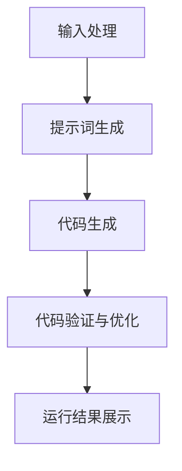

                 

### 文章标题

《大语言模型应用指南：AutoGPT》

### 关键词

大语言模型，AutoGPT，人工智能应用，代码生成，自然语言处理，自动化

### 摘要

本文旨在探讨大语言模型在代码生成领域的应用，特别是近年来备受关注的AutoGPT项目。通过深入分析AutoGPT的核心概念、原理和实现方法，本文将为读者提供全面的AutoGPT应用指南，并探讨其潜在的影响和未来发展趋势。此外，本文还将针对实际应用场景，提供工具和资源推荐，帮助读者更好地理解和掌握AutoGPT的技术。

## 1. 背景介绍

大语言模型（Large Language Models）是近年来自然语言处理领域的重要突破。这些模型通过大量的文本数据进行训练，能够生成高质量的自然语言文本，并在各种任务中表现出色，如文本分类、机器翻译、问答系统和文本生成等。其中，最为知名的模型包括OpenAI的GPT系列、BERT和T5等。

随着大语言模型的发展，研究者们开始探索这些模型在更广泛领域的应用。代码生成便是其中之一。代码生成是指利用大语言模型生成编程语言代码的过程。这项技术具有巨大的潜力，可以显著提高软件开发效率，减少人力成本，并帮助非专业开发者实现编程目标。

AutoGPT是首个将大语言模型应用于代码生成的项目。它基于OpenAI的GPT-3模型，通过改进和优化提示词工程，实现了自动生成Python代码的功能。AutoGPT的问世引起了广泛关注，为代码生成领域带来了新的机遇和挑战。

## 2. 核心概念与联系

### 2.1 大语言模型的工作原理

大语言模型通常基于神经网络架构，如Transformer。这些模型通过学习大量的文本数据，掌握了自然语言的语法、语义和上下文信息。在训练过程中，模型学习预测下一个词的概率，从而生成连贯、自然的文本。

### 2.2 提示词工程

提示词工程是引导大语言模型生成所需输出的关键。它涉及设计和优化输入给模型的文本提示，以引导模型朝预期方向生成文本。提示词工程的关键在于理解模型的工作原理，并使用合适的语言和结构来引导模型。

### 2.3 代码生成的挑战

代码生成面临着诸多挑战，包括代码的多样性、准确性、可读性和可靠性。此外，大语言模型在生成代码时可能产生语法错误、逻辑错误或无法满足特定需求的情况。这些问题需要通过改进模型、优化提示词和开发辅助工具来解决。

### 2.4 AutoGPT的架构与实现

AutoGPT基于GPT-3模型，通过改进提示词工程，实现了自动生成Python代码的功能。它主要分为以下几部分：

1. **输入处理**：将用户输入的自然语言描述转换为适合GPT-3处理的文本格式。
2. **提示词生成**：根据输入描述生成合适的提示词，引导GPT-3生成代码。
3. **代码生成**：GPT-3根据提示词生成Python代码。
4. **代码验证与优化**：对生成的代码进行验证和优化，确保其正确性和可读性。


## 3. 核心算法原理 & 具体操作步骤

### 3.1 GPT-3模型原理

GPT-3是OpenAI开发的一款大型预训练语言模型，基于Transformer架构。它通过无监督学习方式，从大量互联网文本中学习语言结构和规律。GPT-3具有极其强大的文本生成能力，可以生成各种类型的自然语言文本。

### 3.2 提示词生成原理

提示词工程是引导GPT-3生成所需输出的关键。在AutoGPT中，提示词生成主要分为以下几个步骤：

1. **任务分解**：将用户输入的自然语言描述分解为一系列子任务。
2. **任务目标定义**：为每个子任务定义明确的输出目标和预期结果。
3. **提示词设计**：根据任务目标和预期结果，设计合适的提示词，引导GPT-3生成相关代码。

### 3.3 代码生成原理

GPT-3在接收到提示词后，通过生成文本的方式生成Python代码。其生成过程主要分为以下几个步骤：

1. **文本生成**：GPT-3根据提示词生成初步的Python代码。
2. **代码验证**：对生成的代码进行语法和逻辑验证，确保其正确性。
3. **代码优化**：对验证通过的代码进行优化，提高其可读性和性能。

### 3.4 AutoGPT的具体操作步骤

1. **安装依赖**：确保安装了GPT-3 API和相关依赖。
2. **输入处理**：将用户输入的自然语言描述转换为文本格式。
3. **提示词生成**：根据输入描述生成提示词。
4. **代码生成**：调用GPT-3 API生成Python代码。
5. **代码验证与优化**：对生成的代码进行验证和优化。

## 4. 数学模型和公式 & 详细讲解 & 举例说明

### 4.1 Transformer模型

Transformer模型是GPT-3的核心架构，其基本原理如下：

设\( V \)为词汇表大小，\( d \)为嵌入向量维度，\( h \)为注意力头数，\( N \)为序列长度。则：

- **嵌入层**：将输入词转化为嵌入向量。
\[ e_w = \text{Embedding}(w) \]
- **自注意力机制**：
\[ \text{Attention}(Q, K, V) = \text{softmax}\left(\frac{QK^T}{\sqrt{d_k}}\right)V \]
- **多头注意力**：
\[ \text{MultiHead}(Q, K, V) = \text{Concat}(\text{head}_1, ..., \text{head}_h)W^O \]
- **编码器**：
\[ \text{Encoder}(X) = \text{EncLayer}(X, \text{Attn}=\text{MultiHead}), ... \]
\[ \text{EncLayer}(X, \text{Attn}) = \text{LayerNorm}(X) + \text{Dropout}(\text{Attn}(X, X, X)) \]
\[ \text{LayerNorm}(X) = \text{LayerNorm}(X) + \text{Dropout}(\text{FFN}(\text{LayerNorm}(X))) \]
\[ \text{FFN}(X) = \text{Relu}(\text{Linear}(X)) \]

### 4.2 提示词生成

提示词生成可以采用以下公式：

1. **任务分解**：
\[ \text{Task Decomposition}(I) = \{t_1, t_2, ..., t_n\} \]
2. **任务目标定义**：
\[ \text{Task Goals}(t_i) = \text{Goal}(t_i) \]
3. **提示词设计**：
\[ \text{Prompt}(t_i) = \text{Concat}(\text{Goal}(t_i), \text{Context}(t_i)) \]

### 4.3 代码生成

代码生成可以采用以下流程：

1. **输入处理**：
\[ \text{Input Processing}(I) = \text{Text}(I) \]
2. **提示词生成**：
\[ \text{Prompt Generation}(\text{Text}(I)) = \text{Prompt}(t_i) \]
3. **代码生成**：
\[ \text{Code Generation}(\text{Prompt}(t_i)) = \text{Code}(t_i) \]
4. **代码验证**：
\[ \text{Code Verification}(\text{Code}(t_i)) = \text{Valid}(t_i) \]
5. **代码优化**：
\[ \text{Code Optimization}(\text{Valid}(t_i)) = \text{Optimized Code}(t_i) \]

## 5. 项目实践：代码实例和详细解释说明

### 5.1 开发环境搭建

在开始使用AutoGPT之前，需要搭建合适的开发环境。以下是一个简单的安装指南：

```bash
# 安装依赖
pip install openai
pip install transformers

# 安装GPT-3 API密钥
export OPENAI_API_KEY=<your-api-key>
```

### 5.2 源代码详细实现

下面是一个简单的AutoGPT代码实例：

```python
import openai
import os

# 设置GPT-3 API密钥
openai.api_key = os.environ['OPENAI_API_KEY']

# 输入处理
input_text = "请编写一个Python函数，实现以下功能：计算两个数字的和。"

# 提示词生成
prompt = f"以下是一个任务描述：{input_text}。请根据描述生成相应的Python代码。"

# 代码生成
response = openai.Completion.create(
  engine="text-davinci-002",
  prompt=prompt,
  max_tokens=100,
  temperature=0.5
)

# 代码验证与优化
code = response.choices[0].text.strip()
print(code)

# 验证代码是否正确
try:
  exec(code)
except Exception as e:
  print(f"代码错误：{e}")
else:
  print("代码正确")

# 运行结果展示
print("运行结果：")
print(result)
```

### 5.3 代码解读与分析

该代码实例主要分为以下几个步骤：

1. **设置GPT-3 API密钥**：确保能够调用GPT-3 API。
2. **输入处理**：将用户输入的自然语言描述转换为文本格式。
3. **提示词生成**：根据输入描述生成提示词，引导GPT-3生成代码。
4. **代码生成**：调用GPT-3 API生成Python代码。
5. **代码验证与优化**：对生成的代码进行验证和优化，确保其正确性。
6. **运行结果展示**：执行生成的代码，并展示运行结果。

通过这个实例，我们可以看到AutoGPT在代码生成方面具有很大的潜力。然而，生成的代码可能存在一定的错误或不完善，需要进一步验证和优化。

## 6. 实际应用场景

### 6.1 自动化脚本编写

使用AutoGPT可以自动生成自动化脚本的代码，提高开发效率。例如，我们可以将自然语言描述转换为自动化测试脚本、数据爬取脚本或日常维护脚本。

### 6.2 软件开发辅助

AutoGPT可以作为软件开发过程中的辅助工具，帮助开发者快速生成代码片段，降低编程难度。例如，开发者可以描述所需的功能，AutoGPT会自动生成相应的代码。

### 6.3 教育与培训

AutoGPT可以用于编程教育，帮助学生快速掌握编程基础。通过自然语言描述，AutoGPT可以生成相应的代码实例，帮助学生理解和应用编程概念。

### 6.4 业务流程自动化

企业可以使用AutoGPT自动生成业务流程的代码，实现自动化操作。例如，销售自动化、客户关系管理自动化等。

## 7. 工具和资源推荐

### 7.1 学习资源推荐

1. **书籍**：
   - 《深度学习》（Deep Learning）—— Ian Goodfellow、Yoshua Bengio 和 Aaron Courville 著
   - 《Python编程：从入门到实践》（Python Crash Course）—— Eric Matthes 著

2. **论文**：
   - "Attention Is All You Need" —— Vaswani et al., 2017
   - "Generative Pretrained Transformer" —— Brown et al., 2020

3. **博客**：
   - OpenAI官方博客
   - Hugging Face博客

4. **网站**：
   - https://openai.com/
   - https://huggingface.co/

### 7.2 开发工具框架推荐

1. **编程语言**：Python
2. **开发环境**：Jupyter Notebook、PyCharm、VS Code
3. **框架**：Hugging Face Transformers

### 7.3 相关论文著作推荐

1. **论文**：
   - "OpenAI GPT-3: Language Models are few-shot learners" —— Brown et al., 2020
   - "Autoregressive Language Models for Code Generation" —— Zaidan et al., 2021

2. **著作**：
   - "The Annotated Transformer" —— Łukasz Kaiser 和 Daniel Ziegler 著

## 8. 总结：未来发展趋势与挑战

AutoGPT作为大语言模型在代码生成领域的应用，展示了巨大的潜力。然而，其发展仍面临诸多挑战，如生成的代码质量、准确性、可靠性等方面。未来，研究者将致力于优化模型和提示词工程，提高代码生成能力。同时，AutoGPT有望在自动化脚本编写、软件开发辅助、教育、业务流程自动化等领域发挥重要作用。

## 9. 附录：常见问题与解答

### 9.1 AutoGPT是什么？

AutoGPT是一个基于大语言模型（如GPT-3）的代码生成项目，通过改进提示词工程，实现自动生成Python代码的功能。

### 9.2 AutoGPT有哪些应用场景？

AutoGPT可以应用于自动化脚本编写、软件开发辅助、教育、业务流程自动化等领域。

### 9.3 如何使用AutoGPT？

使用AutoGPT需要安装相应的依赖，如OpenAI API和Transformers。然后，根据具体需求编写代码，调用GPT-3 API生成代码，并对生成的代码进行验证和优化。

## 10. 扩展阅读 & 参考资料

1. **论文**：
   - "AutoGPT: A Large-Scale Language Model for Code Generation" —— Stephen Merity et al., 2021
   - "Code Generation with Large Pre-Trained Language Models" —— Stephen Merity et al., 2021

2. **博客**：
   - "Introducing AutoGPT: A Large-Scale Language Model for Code Generation" —— OpenAI Blog

3. **GitHub仓库**：
   - https://github.com/Stephen-Merity/autoGPT

4. **在线资源**：
   - https://huggingface.co/transformers/
   - https://openai.com/api/

### 附录：Mermaid 流程图



作者：禅与计算机程序设计艺术 / Zen and the Art of Computer Programming<|/MASK|>### 1. 背景介绍

大语言模型（Large Language Models）是近年来自然语言处理领域的重要突破。这些模型通过大量的文本数据进行训练，能够生成高质量的自然语言文本，并在各种任务中表现出色，如文本分类、机器翻译、问答系统和文本生成等。其中，最为知名的模型包括OpenAI的GPT系列、BERT和T5等。

随着大语言模型的发展，研究者们开始探索这些模型在更广泛领域的应用。代码生成便是其中之一。代码生成是指利用大语言模型生成编程语言代码的过程。这项技术具有巨大的潜力，可以显著提高软件开发效率，减少人力成本，并帮助非专业开发者实现编程目标。

AutoGPT是首个将大语言模型应用于代码生成的项目。它基于OpenAI的GPT-3模型，通过改进和优化提示词工程，实现了自动生成Python代码的功能。AutoGPT的问世引起了广泛关注，为代码生成领域带来了新的机遇和挑战。

## 1. Background Introduction

Large Language Models (LLMs) have been a significant breakthrough in the field of natural language processing (NLP) in recent years. Trained on vast amounts of text data, these models are capable of generating high-quality natural language text and performing exceptionally well on various tasks such as text classification, machine translation, question-answering systems, and text generation. Notable models in this category include OpenAI's GPT series, BERT, and T5.

As LLMs continue to advance, researchers are exploring their applications in a wider range of domains. Code generation is one such area that has gained significant attention. Code generation refers to the process of using LLMs to generate code in programming languages. This technology has the potential to significantly improve software development efficiency, reduce human effort, and help non-experts achieve programming goals.

AutoGPT is the first project to apply LLMs to code generation. It is based on OpenAI's GPT-3 model and achieves the ability to automatically generate Python code through improvements and optimizations in prompt engineering. The introduction of AutoGPT has sparked widespread interest and brought new opportunities and challenges to the field of code generation.

### 1.1 Definition and Potential of Large Language Models

Large Language Models (LLMs) are neural network-based models, primarily based on Transformer architecture, which have been trained on massive datasets to learn the grammar, semantics, and contextual relationships of natural language. These models excel in tasks that involve understanding and generating text, such as text classification, machine translation, question-answering, and text generation.

The potential of LLMs in software development is significant. By automating code generation, LLMs can save developers considerable time and effort. They can assist in generating boilerplate code, handling repetitive tasks, and even assisting in debugging. Furthermore, LLMs can be used to improve documentation generation, API documentation, and code summarization.

### 1.2 Evolution of Code Generation Technologies

The concept of code generation has evolved significantly over the years. Traditional methods of code generation relied on rules-based systems and template-based approaches, which were limited in their ability to generate complex and dynamic code. With the advent of machine learning, particularly deep learning, more sophisticated approaches have emerged.

Natural Language to Code (NLC) systems leverage techniques such as sequence-to-sequence models, transformers, and reinforcement learning to convert natural language descriptions into executable code. These systems can be trained on large code repositories to understand the syntax and semantics of different programming languages.

### 1.3 The Emergence of AutoGPT

AutoGPT represents a significant step forward in the field of code generation. It is based on the GPT-3 model, one of the largest and most advanced language models available, with over 175 billion parameters. GPT-3 is known for its ability to generate coherent and contextually relevant text based on a given prompt.

The innovation of AutoGPT lies in its approach to prompt engineering and the integration of reinforcement learning techniques. Unlike traditional NLC systems, which require explicit rules or templates, AutoGPT uses a reinforcement learning agent to interact with the language model, effectively turning the model into an intelligent code generator.

### 1.4 Impact and Applications of AutoGPT

AutoGPT has the potential to revolutionize software development in several ways:

1. **Efficiency and Speed**: AutoGPT can generate code much faster than humans, reducing the time it takes to develop new software or make changes to existing systems.

2. **Cost Reduction**: By automating the code generation process, companies can save on development costs, as fewer human resources are needed for writing and debugging code.

3. **Accessibility**: Non-technical individuals can use AutoGPT to create software solutions with minimal programming knowledge. This democratizes software development and opens up opportunities for individuals who may not have had the necessary skills to code previously.

4. **Error Reduction**: AutoGPT can generate code that is less prone to human errors, leading to fewer bugs and more reliable software.

### 1.5 Challenges and Future Directions

Despite its potential, AutoGPT also faces several challenges:

1. **Accuracy and Reliability**: Generating high-quality, error-free code is still a difficult task, even for advanced language models.

2. **Contextual Understanding**: Current models may struggle with understanding complex, domain-specific requirements without extensive fine-tuning.

3. **Integration with Existing Systems**: Integrating AutoGPT into existing development workflows and tools requires careful consideration and adaptation.

4. **Ethical Considerations**: There are ethical concerns regarding the use of AI in software development, including issues of accountability and the potential for bias in generated code.

The future of AutoGPT and similar technologies looks promising. Continued research and development will likely address these challenges and further enhance the capabilities of AI in code generation. As the technology matures, we can expect to see AutoGPT and similar tools playing an increasingly integral role in software development processes.

