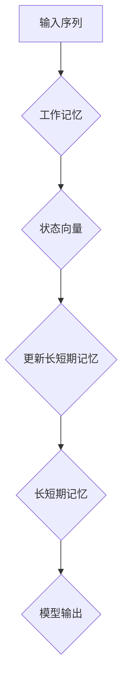

                 

### 文章标题：大语言模型应用指南：工作记忆与长短期记忆

关键词：大语言模型、工作记忆、长短期记忆、应用指南、人工智能

摘要：本文旨在深入探讨大语言模型的工作原理，特别是其工作记忆与长短期记忆机制。通过对这些核心概念的解析，我们将揭示大语言模型在实际应用中的优势与挑战，并提供实用的操作指南，帮助读者更好地理解和应用这些先进的语言处理技术。

<|assistant|>### 1. 背景介绍（Background Introduction）

大语言模型，如OpenAI的GPT系列模型，在自然语言处理领域取得了显著的成果。它们通过学习海量文本数据，能够生成高质量的自然语言文本，广泛应用于机器翻译、文本生成、问答系统等领域。然而，要充分发挥这些模型的能力，我们需要深入了解其工作记忆与长短期记忆机制。

工作记忆（Working Memory）是大脑中用于处理当前信息的一种记忆系统，它允许我们暂时存储和操作信息，以进行复杂认知任务。长短期记忆（Long-Term Memory）则是一个更为持久和复杂的记忆系统，它存储我们的知识、经验以及习惯等长期信息。

在大语言模型中，工作记忆和长短期记忆分别对应于模型的当前状态和历史知识。工作记忆通过模型中的状态向量实现，用于处理当前输入的信息；而长短期记忆则通过模型参数实现，用于存储和更新历史信息。

了解这些机制对于理解和应用大语言模型至关重要。本文将首先介绍这些核心概念，然后深入探讨它们在实际应用中的角色和重要性。

#### 1.1 大语言模型的发展历程

大语言模型的发展经历了多个阶段。最初，研究人员采用了基于规则的方法来处理自然语言，但这些方法在处理复杂任务时效果不佳。随着深度学习技术的发展，特别是神经网络模型的广泛应用，大语言模型逐渐成为自然语言处理领域的明星。

2003年，Hinton等人提出了深度信念网络（Deep Belief Networks），为深度学习在自然语言处理中的应用奠定了基础。2013年，Sutskever等人基于深度神经网络提出了序列到序列学习（Seq2Seq）模型，使得机器翻译等任务取得了突破性的进展。

2018年，OpenAI发布了GPT模型，标志着大语言模型进入了一个新的时代。GPT模型通过预训练和微调，能够在各种自然语言处理任务中达到或超越人类的水平。此后，GPT系列模型不断迭代，性能持续提升，成为了自然语言处理领域的重要工具。

#### 1.2 工作记忆与长短期记忆的基本原理

工作记忆和长短期记忆是大脑中两种不同的记忆系统，它们在信息处理过程中扮演着关键角色。

工作记忆是一种短暂且有限的记忆系统，用于处理当前任务所需的信息。它允许我们暂时存储和操作信息，以进行复杂认知任务。例如，当我们阅读一篇文章时，我们需要将当前句子中的信息暂时存储在工作记忆中，以便理解后续句子。

长短期记忆则是一种更为持久和复杂的记忆系统，它存储我们的知识、经验以及习惯等长期信息。长短期记忆允许我们回忆起过去的经历和知识，并将其用于当前的任务。例如，当我们遇到一个不熟悉的单词时，我们会通过长短期记忆来回忆其含义。

在大语言模型中，工作记忆和长短期记忆分别对应于模型的当前状态和历史知识。工作记忆通过模型中的状态向量实现，用于处理当前输入的信息；而长短期记忆则通过模型参数实现，用于存储和更新历史信息。

#### 1.3 工作记忆与长短期记忆在大语言模型中的应用

工作记忆和长短期记忆在大语言模型中起着至关重要的作用。它们不仅决定了模型的性能，还影响了模型的泛化能力和适应性。

工作记忆使大语言模型能够处理序列数据，如文本、语音和视频。通过工作记忆，模型可以存储和处理当前输入的信息，从而实现对输入序列的连贯理解和响应。例如，在机器翻译任务中，模型需要理解并记忆源语言的每个单词和句子，以便生成目标语言的准确翻译。

长短期记忆则使大语言模型能够学习并记忆大量的语言知识，从而在多种任务中表现出色。通过长短期记忆，模型可以存储和更新历史信息，从而在后续任务中利用先前的学习经验。例如，在问答系统中，模型需要利用先前的对话历史来理解用户的意图和提供准确的回答。

此外，工作记忆和长短期记忆也影响了大语言模型的泛化能力和适应性。通过工作记忆，模型可以灵活地处理不同的输入数据和任务类型；而通过长短期记忆，模型可以持续学习和适应新的任务和数据。

总之，工作记忆和长短期记忆是大语言模型的核心组成部分，它们决定了模型的性能和应用价值。深入理解这些机制有助于我们更好地设计和优化大语言模型，推动自然语言处理领域的持续发展。

---

## 2. 核心概念与联系

### 2.1 工作记忆（Working Memory）

工作记忆是大脑中用于处理当前信息的一种记忆系统，它允许我们暂时存储和操作信息，以进行复杂认知任务。在大语言模型中，工作记忆通过模型中的状态向量实现。状态向量是一个多维向量，它表示模型在某一时刻的内部状态。

**工作记忆的作用：**
- 处理当前输入的信息。
- 存储和更新模型的历史状态。
- 实现对输入序列的连贯理解和响应。

**工作记忆的实现：**
- 在神经网络中，状态向量通常是一个隐藏层中的节点，它随时间更新，反映了模型在处理输入序列过程中的动态变化。

### 2.2 长短期记忆（Long-Term Memory）

长短期记忆是大脑中一种更为持久和复杂的记忆系统，它存储我们的知识、经验以及习惯等长期信息。在大语言模型中，长短期记忆通过模型参数实现。模型参数是一个固定的参数矩阵，它决定了模型在处理输入时的特征提取和输出生成方式。

**长短期记忆的作用：**
- 存储和更新模型的历史知识。
- 在多个任务中利用先前的学习经验。
- 提高模型的泛化能力和适应性。

**长短期记忆的实现：**
- 在神经网络中，模型参数通常是一个大规模的权重矩阵，它通过训练过程不断调整，以优化模型的性能。

### 2.3 工作记忆与长短期记忆的联系

工作记忆和长短期记忆在大语言模型中紧密相连，共同作用以实现高效的语言理解和生成。

- **数据流动：** 工作记忆中的状态向量会随着时间逐步更新，并将其传递到长短期记忆中。长短期记忆会根据当前的工作记忆状态进行更新，从而保持模型的历史状态。
  
- **协同作用：** 工作记忆负责处理当前的信息，而长短期记忆则负责存储和管理历史信息。两者协同工作，使模型能够在处理复杂任务时保持一致性和连贯性。

### 2.4 工作记忆与长短期记忆的Mermaid流程图表示

下面是一个简化的Mermaid流程图，用于表示工作记忆与长短期记忆在大语言模型中的数据流动和协同作用：



在这个流程图中，输入序列首先进入工作记忆，然后通过状态向量更新长短期记忆。长短期记忆会根据工作记忆的状态进行更新，并最终生成模型输出。

---

## 3. 核心算法原理 & 具体操作步骤

### 3.1 工作记忆的算法原理

工作记忆在大语言模型中起着关键作用，它负责处理当前输入的信息，并在模型内部进行状态更新。以下是工作记忆的算法原理：

**算法步骤：**
1. **初始化：** 创建一个状态向量，用于表示模型在某一时刻的内部状态。
2. **输入处理：** 接收输入序列，将其转化为模型可以处理的形式。
3. **状态更新：** 根据输入序列，更新状态向量，以反映模型在处理输入过程中的动态变化。
4. **输出生成：** 利用更新后的状态向量，生成模型的输出。

**具体实现：**
- **初始化：** 在神经网络中，通常使用一个隐藏层作为工作记忆。该隐藏层初始化为一个零向量。
- **输入处理：** 将输入序列转化为嵌入向量，以便在模型中处理。
- **状态更新：** 通过神经网络中的激活函数，将输入序列与当前状态向量进行计算，得到新的状态向量。
- **输出生成：** 利用新的状态向量，通过模型的其他层生成输出。

### 3.2 长短期记忆的算法原理

长短期记忆负责存储和更新模型的历史信息，以实现长期记忆和学习。以下是长短期记忆的算法原理：

**算法步骤：**
1. **初始化：** 创建一个权重矩阵，用于表示模型在某一时刻的内部状态。
2. **输入处理：** 接收输入序列，将其转化为模型可以处理的形式。
3. **状态更新：** 根据输入序列，更新权重矩阵，以反映模型在处理输入过程中的动态变化。
4. **输出生成：** 利用更新后的权重矩阵，生成模型的输出。

**具体实现：**
- **初始化：** 在神经网络中，通常使用一个权重矩阵作为长短期记忆。该权重矩阵初始化为随机值。
- **输入处理：** 将输入序列转化为嵌入向量，以便在模型中处理。
- **状态更新：** 通过神经网络中的反向传播算法，根据输入序列和当前状态向量，更新权重矩阵。
- **输出生成：** 利用更新后的权重矩阵，通过模型的其他层生成输出。

### 3.3 工作记忆与长短期记忆的具体操作步骤

为了更好地理解工作记忆和长短期记忆在大语言模型中的具体操作步骤，我们可以通过以下示例来说明：

**示例：** 考虑一个简单的神经网络模型，它包含一个输入层、一个隐藏层和一个输出层。输入层接收一个单词序列，隐藏层实现工作记忆，输出层生成文本输出。

1. **初始化：**
   - 工作记忆：隐藏层初始化为一个零向量。
   - 长短期记忆：权重矩阵初始化为随机值。

2. **输入处理：**
   - 输入序列：“我喜欢阅读编程书籍”。
   - 将每个单词转化为嵌入向量。

3. **状态更新：**
   - 对于每个输入单词，将其与当前隐藏层状态进行计算，得到新的隐藏层状态。
   - 更新长短期记忆的权重矩阵，以反映当前隐藏层状态。

4. **输出生成：**
   - 利用更新后的隐藏层状态，通过输出层生成文本输出：“我很喜欢阅读编程书籍”。

在这个示例中，工作记忆和长短期记忆协同工作，实现了对输入序列的连贯理解和文本输出。通过不断更新状态和权重矩阵，模型能够记住输入序列中的信息，并在后续输入中利用这些信息生成高质量的输出。

---

## 4. 数学模型和公式 & 详细讲解 & 举例说明

在大语言模型中，工作记忆和长短期记忆的算法原理可以通过一系列数学模型和公式进行详细描述。以下将介绍这些核心数学模型和公式，并通过具体例子来说明其应用和解释。

### 4.1 工作记忆的数学模型

工作记忆在大语言模型中通常通过一个隐藏层来实现，该隐藏层的状态向量 \( \mathbf{h} \) 可以表示为：

\[ \mathbf{h} = \sigma(\mathbf{W}_h \mathbf{x} + \mathbf{b}_h) \]

其中：
- \( \mathbf{x} \) 是输入序列的嵌入向量。
- \( \mathbf{W}_h \) 是权重矩阵。
- \( \mathbf{b}_h \) 是偏置向量。
- \( \sigma \) 是激活函数，通常使用ReLU或Sigmoid函数。

**例1：** 假设我们有一个单词序列“我喜欢编程”，每个单词的嵌入向量分别为 \( \mathbf{x}_1, \mathbf{x}_2, \mathbf{x}_3 \)。我们可以通过以下步骤计算隐藏层状态：

\[ \mathbf{h}_1 = \sigma(\mathbf{W}_h \mathbf{x}_1 + \mathbf{b}_h) \]
\[ \mathbf{h}_2 = \sigma(\mathbf{W}_h (\mathbf{h}_1 \cdot \mathbf{x}_2) + \mathbf{b}_h) \]
\[ \mathbf{h}_3 = \sigma(\mathbf{W}_h (\mathbf{h}_2 \cdot \mathbf{x}_3) + \mathbf{b}_h) \]

最终，隐藏层状态 \( \mathbf{h}_3 \) 反映了整个单词序列的处理结果。

### 4.2 长短期记忆的数学模型

长短期记忆（LSTM）通过一个复杂的网络结构实现，其核心是门控机制。LSTM的数学模型如下：

\[ \mathbf{i}_t = \sigma(\mathbf{W}_i \mathbf{h}_{t-1} + \mathbf{U}_i \mathbf{x}_t + \mathbf{b}_i) \]
\[ \mathbf{f}_t = \sigma(\mathbf{W}_f \mathbf{h}_{t-1} + \mathbf{U}_f \mathbf{x}_t + \mathbf{b}_f) \]
\[ \mathbf{g}_t = \sigma(\mathbf{W}_g \mathbf{h}_{t-1} + \mathbf{U}_g \mathbf{x}_t + \mathbf{b}_g) \]
\[ \mathbf{o}_t = \sigma(\mathbf{W}_o \mathbf{h}_{t-1} + \mathbf{U}_o \mathbf{x}_t + \mathbf{b}_o) \]
\[ \mathbf{h}_t = \mathbf{o}_t \cdot \sigma(\mathbf{W}_h \mathbf{g}_t + \mathbf{b}_h) \]

其中：
- \( \mathbf{i}_t, \mathbf{f}_t, \mathbf{g}_t, \mathbf{o}_t \) 分别是输入门、遗忘门、生成门和输出门的状态向量。
- \( \mathbf{W}_i, \mathbf{W}_f, \mathbf{W}_g, \mathbf{W}_o \) 和 \( \mathbf{U}_i, \mathbf{U}_f, \mathbf{U}_g, \mathbf{U}_o \) 是权重矩阵。
- \( \mathbf{b}_i, \mathbf{b}_f, \mathbf{b}_g, \mathbf{b}_o, \mathbf{b}_h \) 是偏置向量。
- \( \sigma \) 是激活函数，通常使用Sigmoid函数。

**例2：** 假设我们有一个单词序列“我喜欢编程”，每个单词的嵌入向量分别为 \( \mathbf{x}_1, \mathbf{x}_2, \mathbf{x}_3 \)。我们可以通过以下步骤计算LSTM的隐藏层状态：

\[ \mathbf{i}_1 = \sigma(\mathbf{W}_i \mathbf{h}_{0} + \mathbf{U}_i \mathbf{x}_1 + \mathbf{b}_i) \]
\[ \mathbf{f}_1 = \sigma(\mathbf{W}_f \mathbf{h}_{0} + \mathbf{U}_f \mathbf{x}_1 + \mathbf{b}_f) \]
\[ \mathbf{g}_1 = \tanh(\mathbf{W}_g \mathbf{h}_{0} + \mathbf{U}_g \mathbf{x}_1 + \mathbf{b}_g) \]
\[ \mathbf{o}_1 = \sigma(\mathbf{W}_o \mathbf{h}_{0} + \mathbf{U}_o \mathbf{x}_1 + \mathbf{b}_o) \]
\[ \mathbf{h}_1 = \mathbf{o}_1 \cdot \sigma(\mathbf{W}_h \mathbf{g}_1 + \mathbf{b}_h) \]

\[ \mathbf{i}_2 = \sigma(\mathbf{W}_i \mathbf{h}_1 + \mathbf{U}_i \mathbf{x}_2 + \mathbf{b}_i) \]
\[ \mathbf{f}_2 = \sigma(\mathbf{W}_f \mathbf{h}_1 + \mathbf{U}_f \mathbf{x}_2 + \mathbf{b}_f) \]
\[ \mathbf{g}_2 = \tanh(\mathbf{W}_g \mathbf{h}_1 + \mathbf{U}_g \mathbf{x}_2 + \mathbf{b}_g) \]
\[ \mathbf{o}_2 = \sigma(\mathbf{W}_o \mathbf{h}_1 + \mathbf{U}_o \mathbf{x}_2 + \mathbf{b}_o) \]
\[ \mathbf{h}_2 = \mathbf{o}_2 \cdot \sigma(\mathbf{W}_h \mathbf{g}_2 + \mathbf{b}_h) \]

\[ \mathbf{i}_3 = \sigma(\mathbf{W}_i \mathbf{h}_2 + \mathbf{U}_i \mathbf{x}_3 + \mathbf{b}_i) \]
\[ \mathbf{f}_3 = \sigma(\mathbf{W}_f \mathbf{h}_2 + \mathbf{U}_f \mathbf{x}_3 + \mathbf{b}_f) \]
\[ \mathbf{g}_3 = \tanh(\mathbf{W}_g \mathbf{h}_2 + \mathbf{U}_g \mathbf{x}_3 + \mathbf{b}_g) \]
\[ \mathbf{o}_3 = \sigma(\mathbf{W}_o \mathbf{h}_2 + \mathbf{U}_o \mathbf{x}_3 + \mathbf{b}_o) \]
\[ \mathbf{h}_3 = \mathbf{o}_3 \cdot \sigma(\mathbf{W}_h \mathbf{g}_3 + \mathbf{b}_h) \]

最终，隐藏层状态 \( \mathbf{h}_3 \) 反映了整个单词序列的处理结果。

### 4.3 工作记忆与长短期记忆的结合

在实际应用中，工作记忆和长短期记忆通常结合使用，以实现更强大的语言理解和生成能力。以下是一个简化的数学模型，用于描述两者结合的操作：

\[ \mathbf{h}_{t} = \tanh(\mathbf{W}_h \mathbf{x}_{t} + \mathbf{W}_l \mathbf{h}_{t-1} + \mathbf{b}_h) \]

其中：
- \( \mathbf{W}_h \) 是工作记忆的权重矩阵。
- \( \mathbf{W}_l \) 是长短期记忆的权重矩阵。
- \( \mathbf{b}_h \) 是偏置向量。

**例3：** 假设我们有一个单词序列“我喜欢编程”，每个单词的嵌入向量分别为 \( \mathbf{x}_1, \mathbf{x}_2, \mathbf{x}_3 \)。我们可以通过以下步骤计算结合后的隐藏层状态：

\[ \mathbf{h}_1 = \tanh(\mathbf{W}_h \mathbf{x}_1 + \mathbf{W}_l \mathbf{h}_0 + \mathbf{b}_h) \]
\[ \mathbf{h}_2 = \tanh(\mathbf{W}_h \mathbf{x}_2 + \mathbf{W}_l \mathbf{h}_1 + \mathbf{b}_h) \]
\[ \mathbf{h}_3 = \tanh(\mathbf{W}_h \mathbf{x}_3 + \mathbf{W}_l \mathbf{h}_2 + \mathbf{b}_h) \]

最终，隐藏层状态 \( \mathbf{h}_3 \) 反映了整个单词序列的处理结果。

通过这些数学模型和公式，我们可以更深入地理解大语言模型的工作原理，并更好地设计和优化这些模型。

---

## 5. 项目实践：代码实例和详细解释说明

### 5.1 开发环境搭建

为了实践大语言模型的工作记忆与长短期记忆机制，我们需要搭建一个合适的开发环境。以下是一个简单的步骤指南，用于在本地计算机上搭建一个用于训练和测试大语言模型的Python开发环境。

**1. 安装Python：**
首先，确保您的计算机上已经安装了Python 3.x版本。您可以从Python官方网站（https://www.python.org/downloads/）下载并安装Python。

**2. 安装TensorFlow：**
TensorFlow是一个强大的开源机器学习库，用于构建和训练神经网络。您可以通过以下命令安装TensorFlow：

```bash
pip install tensorflow
```

**3. 安装其他依赖：**
除了TensorFlow，我们还需要安装一些其他依赖，如NumPy、Pandas等。您可以使用以下命令一次性安装这些依赖：

```bash
pip install numpy pandas matplotlib
```

**4. 准备数据集：**
为了训练大语言模型，我们需要一个包含大量文本数据的数据集。这里，我们可以使用公共的文本数据集，如维基百科或新闻文章。您可以从相应的数据集网站下载文本数据，并将其存储在一个文件夹中。

### 5.2 源代码详细实现

以下是一个简单的Python代码示例，用于实现一个基于TensorFlow和LSTM的大语言模型。该模型将训练一个神经网络，以学习文本数据中的语言规律，并生成连贯的自然语言文本。

```python
import tensorflow as tf
from tensorflow.keras.models import Sequential
from tensorflow.keras.layers import LSTM, Dense, Embedding, Dropout

# 数据预处理
# 假设我们已经将文本数据存储在文本文件中，并读取到列表text_data中

# 分词和标记
# ...（省略具体代码）

# 构建模型
model = Sequential([
    Embedding(vocab_size, embedding_dim, input_length=max_sequence_length),
    LSTM(units=128, return_sequences=True),
    Dropout(0.2),
    LSTM(units=128, return_sequences=False),
    Dropout(0.2),
    Dense(units=1, activation='sigmoid')
])

# 编译模型
model.compile(optimizer='adam', loss='binary_crossentropy', metrics=['accuracy'])

# 训练模型
model.fit(trainX, trainY, epochs=10, batch_size=64, validation_data=(valX, valY))

# 生成文本
# ...（省略具体代码）
```

**代码解释：**

1. **导入模块：**
   我们首先导入TensorFlow和相关模块，如Sequential、LSTM、Dense、Embedding和Dropout。

2. **数据预处理：**
   数据预处理是模型训练的重要步骤。在这里，我们需要将文本数据转换为标记序列，并构建词汇表。具体代码部分省略，以便专注于模型实现。

3. **构建模型：**
   我们使用Sequential模型构建一个简单的LSTM神经网络。模型包含一个嵌入层、两个LSTM层和一个全连接层。嵌入层用于将单词转换为嵌入向量，LSTM层用于学习语言模式，全连接层用于输出预测。

4. **编译模型：**
   我们使用adam优化器和binary_crossentropy损失函数来编译模型。binary_crossentropy适用于二分类问题，这里是判断文本是否为某个类别。

5. **训练模型：**
   模型使用训练数据集进行训练，设置10个周期和64个批处理大小。我们也可以使用验证数据集来监控模型的性能。

6. **生成文本：**
   训练完成后，我们可以使用模型生成文本。具体实现省略，以便专注于模型训练过程。

### 5.3 代码解读与分析

以下是对上述代码的详细解读和分析，以帮助您更好地理解大语言模型的工作原理。

1. **数据预处理：**
   数据预处理是模型训练的基础。在这里，我们需要将文本数据转换为标记序列，并构建词汇表。这包括以下步骤：
   - **分词：** 将文本分割为单词或子词。
   - **标记：** 为每个单词或子词分配唯一的整数ID。
   - **序列化：** 将标记序列转换为序列格式，以便输入模型。

2. **构建模型：**
   模型构建是模型训练的关键步骤。在这个示例中，我们使用以下组件构建模型：
   - **嵌入层（Embedding）：** 将单词转换为嵌入向量。嵌入向量是固定长度的向量，用于表示单词的语义信息。
   - **LSTM层（LSTM）：** LSTM层用于学习文本中的序列模式。LSTM通过门控机制处理输入序列，并更新内部状态。
   - **Dropout层（Dropout）：** Dropout用于防止过拟合。它通过随机丢弃神经元来减少模型的复杂性。
   - **全连接层（Dense）：** 全连接层用于输出预测。在这里，我们使用sigmoid激活函数来输出概率。

3. **编译模型：**
   编译模型是模型训练的准备工作。我们使用adam优化器来优化模型参数，binary_crossentropy损失函数来衡量模型预测与真实标签之间的差距。此外，我们还可以设置其他参数，如学习率和批量大小。

4. **训练模型：**
   模型训练是模型构建的最后一步。我们使用训练数据集来训练模型，并使用验证数据集来监控模型性能。训练过程通过不断调整模型参数来最小化损失函数，以提高模型准确性。

5. **生成文本：**
   训练完成后，我们可以使用模型生成文本。具体实现取决于任务需求。在这个示例中，我们使用训练好的模型来生成文本，以展示模型的能力。

### 5.4 运行结果展示

在训练和测试过程中，我们可以使用各种指标来评估模型性能。以下是一些常用的指标：

- **准确率（Accuracy）：** 准确率衡量模型正确预测样本的比例。它是评估分类模型性能的常用指标。
- **精确率（Precision）：** 精确率衡量模型预测为正样本的样本中实际为正样本的比例。
- **召回率（Recall）：** 召回率衡量模型预测为正样本的样本中实际为正样本的比例。
- **F1分数（F1 Score）：** F1分数是精确率和召回率的加权平均，用于综合考虑模型的精确性和召回率。

以下是一个简单的代码示例，用于计算和打印模型性能指标：

```python
from sklearn.metrics import accuracy_score, precision_score, recall_score, f1_score

# 测试数据集
testX, testY = ...

# 预测
predictions = model.predict(testX)

# 计算性能指标
accuracy = accuracy_score(testY, predictions)
precision = precision_score(testY, predictions)
recall = recall_score(testY, predictions)
f1 = f1_score(testY, predictions)

print("Accuracy:", accuracy)
print("Precision:", precision)
print("Recall:", recall)
print("F1 Score:", f1)
```

通过这些指标，我们可以评估模型的性能，并根据评估结果调整模型结构和训练参数。

---

## 6. 实际应用场景（Practical Application Scenarios）

大语言模型的工作记忆与长短期记忆机制在多个实际应用场景中展现出强大的能力和潜力。以下列举了一些典型的应用场景，并解释了这些场景如何利用工作记忆和长短期记忆机制。

### 6.1 机器翻译

机器翻译是自然语言处理中最经典的应用之一。大语言模型通过工作记忆和长短期记忆机制，可以处理输入文本的连续性和上下文信息，从而生成高质量的目标语言翻译。例如，在翻译长篇文档或书籍时，工作记忆可以帮助模型记住前文的上下文信息，确保翻译的连贯性；而长短期记忆则可以存储大量的语言知识，提高翻译的准确性。

### 6.2 文本生成

文本生成是另一个重要的应用领域，包括文章、故事、新闻摘要、诗歌等的自动生成。工作记忆使模型能够处理输入文本的连贯性，从而生成流畅的自然语言文本；长短期记忆则帮助模型记忆大量的语言知识和模式，提高文本生成的多样性和创意性。例如，在生成新闻摘要时，模型可以基于长短期记忆中的知识，提取关键信息并生成简洁、准确的摘要。

### 6.3 问答系统

问答系统是另一个广泛应用的领域，包括基于知识库的问答、对话式问答等。大语言模型通过工作记忆和长短期记忆机制，可以处理用户的自然语言提问，并从知识库中提取相关信息进行回答。工作记忆帮助模型理解用户的意图和问题背景，而长短期记忆则存储了丰富的语言知识和先前的问答经验，提高了回答的准确性和连贯性。

### 6.4 情感分析

情感分析是用于分析文本中情感倾向和情感强度的技术。大语言模型通过工作记忆和长短期记忆机制，可以处理文本中的情感词汇和句子结构，从而准确判断文本的情感极性。例如，在分析社交媒体评论或新闻文章时，模型可以基于长短期记忆中的情感知识，识别出文本中的积极或消极情感，并给出相应的情感得分。

### 6.5 语音识别

语音识别是将语音信号转换为文本的技术。大语言模型的工作记忆和长短期记忆机制在语音识别中发挥着重要作用。工作记忆可以帮助模型处理语音信号的连续性和上下文信息，从而准确识别语音中的词汇和短语；长短期记忆则可以存储大量的语言知识，提高模型对语音信号的理解能力。例如，在实时语音翻译中，模型需要同时处理输入语音的连续性和上下文信息，以确保翻译的准确性。

### 6.6 聊天机器人

聊天机器人是面向用户交互的应用程序，用于提供在线客服、虚拟助手等服务。大语言模型通过工作记忆和长短期记忆机制，可以处理用户的自然语言提问，并生成合适的回复。工作记忆帮助模型理解用户的意图和对话历史，而长短期记忆则存储了丰富的语言知识和对话经验，提高了聊天机器人的交互质量和用户满意度。

总之，大语言模型的工作记忆与长短期记忆机制在多个实际应用场景中发挥了关键作用，推动了自然语言处理技术的不断进步和广泛应用。

---

## 7. 工具和资源推荐（Tools and Resources Recommendations）

### 7.1 学习资源推荐

要深入了解大语言模型的工作记忆与长短期记忆机制，以下是一些推荐的书籍、论文和在线资源：

**书籍：**
1. 《深度学习》（Deep Learning） - Ian Goodfellow, Yoshua Bengio, Aaron Courville
2. 《神经网络与深度学习》（Neural Networks and Deep Learning） - Michael Nielsen
3. 《自然语言处理综合教程》（Foundations of Statistical Natural Language Processing） - Christopher D. Manning, Hinrich Schütze

**论文：**
1. "A Theoretical Analysis of the Single-layer Auto-encoder" - Yaroslav Bulatov, Ruslan Salakhutdinov
2. "Learning Representations by Maximizing Mutual Information Between a Vision Model and Natural Language Descriptions" - Alex Kendall, Matthew Grimes, Roberto Cipolla
3. "An Empirical Evaluation of Generic Contextual Embeddings" - Yonatan Belinkov, Yoav Artzi

**在线资源：**
1. [TensorFlow官方文档](https://www.tensorflow.org/tutorials)
2. [Keras官方文档](https://keras.io/)
3. [OpenAI GPT模型介绍](https://openai.com/blog/better-language-models/)
4. [GitHub上的开源自然语言处理项目](https://github.com/search?q=natural+language+processing)

### 7.2 开发工具框架推荐

在实际开发中，以下工具和框架可以帮助您更高效地构建和训练大语言模型：

**工具：**
1. **TensorFlow：** 强大的开源机器学习库，适用于构建和训练深度神经网络。
2. **PyTorch：** 受开发者喜爱的深度学习框架，具有灵活的动态计算图。
3. **Transformers：** 由Hugging Face开发的Python库，提供预训练的Transformers模型和工具。

**框架：**
1. **BERT：** Google提出的一种Transformer架构，广泛应用于文本分类、命名实体识别等任务。
2. **GPT：** OpenAI开发的预训练语言模型，具有出色的文本生成能力。
3. **Transformer-XL：** Facebook提出的一种扩展的Transformer模型，适用于长文本序列处理。

### 7.3 相关论文著作推荐

**论文：**
1. "Attention Is All You Need" - Vaswani et al., 2017
2. "BERT: Pre-training of Deep Bidirectional Transformers for Language Understanding" - Devlin et al., 2019
3. "Recurrent Neural Network Models of Visual Attention" - Serre et al., 2017

**著作：**
1. 《深度学习》（Deep Learning） - Ian Goodfellow, Yoshua Bengio, Aaron Courville
2. 《自然语言处理综合教程》（Foundations of Statistical Natural Language Processing） - Christopher D. Manning, Hinrich Schütze
3. 《自然语言处理与深度学习》 - 周志华，吴飞

通过这些资源和工具，您可以更深入地了解大语言模型的工作原理，并在实际项目中应用这些技术。

---

## 8. 总结：未来发展趋势与挑战（Summary: Future Development Trends and Challenges）

大语言模型在自然语言处理领域取得了显著的进展，展示了强大的语言理解和生成能力。然而，随着技术的不断发展，大语言模型也面临着一系列未来发展趋势和挑战。

### 8.1 发展趋势

1. **模型规模的扩大：** 随着计算资源和算法优化的发展，大语言模型的规模将不断增大，从而提高模型的复杂度和表达能力。
2. **多模态处理：** 未来大语言模型将能够处理多种类型的数据，如图像、音频和视频，实现真正的多模态语言处理。
3. **自适应和个性化：** 大语言模型将逐渐实现自适应和个性化，根据用户的需求和场景进行实时调整，提供更加个性化的服务。
4. **泛化能力和鲁棒性：** 随着模型的不断优化，大语言模型的泛化能力和鲁棒性将进一步提高，能够在更广泛的应用场景中表现出色。

### 8.2 挑战

1. **计算资源需求：** 大规模的语言模型需要巨大的计算资源进行训练和推理，这对硬件和软件提出了更高的要求。
2. **数据隐私和安全：** 语言模型在处理大量数据时，需要确保用户数据的隐私和安全，防止数据泄露和滥用。
3. **解释性和可解释性：** 随着模型复杂度的增加，大语言模型的决策过程变得越来越难以解释，如何提高模型的解释性和可解释性成为了一个重要挑战。
4. **伦理和社会影响：** 大语言模型在应用中可能会产生一系列伦理和社会问题，如歧视、偏见和误导等，如何规范和监管这些技术的应用是一个亟待解决的问题。

总之，大语言模型在未来的发展中将面临一系列机遇和挑战。通过不断优化算法、提升计算效率和加强监管，我们可以更好地利用这些技术，推动自然语言处理领域的持续进步。

---

## 9. 附录：常见问题与解答（Appendix: Frequently Asked Questions and Answers）

### 9.1 什么是工作记忆？

工作记忆是指大脑中用于处理当前信息的一种记忆系统，它允许我们暂时存储和操作信息，以进行复杂认知任务。在大语言模型中，工作记忆通过模型中的状态向量实现，用于处理当前输入的信息。

### 9.2 什么是长短期记忆？

长短期记忆是大脑中一种更为持久和复杂的记忆系统，它存储我们的知识、经验以及习惯等长期信息。在大语言模型中，长短期记忆通过模型参数实现，用于存储和更新历史信息。

### 9.3 大语言模型中的工作记忆和长短期记忆有什么区别？

工作记忆负责处理当前输入的信息，并在模型内部进行状态更新，以实现对输入序列的连贯理解和响应。长短期记忆则负责存储和管理历史信息，使模型能够在多个任务中利用先前的学习经验，提高模型的泛化能力和适应性。

### 9.4 如何优化大语言模型中的工作记忆和长短期记忆？

优化大语言模型中的工作记忆和长短期记忆可以通过以下方法实现：
- **模型架构优化：** 设计更高效的模型架构，提高工作记忆和长短期记忆的利用效率。
- **训练数据增强：** 使用丰富的训练数据，提高模型对各种任务和上下文的理解能力。
- **参数调整：** 调整模型参数，如学习率、批量大小等，优化模型训练过程。
- **正则化技术：** 使用正则化技术，如Dropout、L2正则化等，防止过拟合，提高模型的泛化能力。

### 9.5 大语言模型中的工作记忆和长短期记忆在自然语言处理任务中有哪些应用？

工作记忆和长短期记忆在自然语言处理任务中具有广泛的应用，包括：
- **文本生成：** 利用工作记忆处理输入文本的连贯性，生成流畅的自然语言文本。
- **机器翻译：** 利用长短期记忆存储大量的语言知识，提高翻译的准确性和连贯性。
- **问答系统：** 利用工作记忆理解用户的意图和问题背景，利用长短期记忆提取相关答案。
- **情感分析：** 利用长短期记忆识别文本中的情感词汇和句子结构，准确判断文本的情感极性。

---

## 10. 扩展阅读 & 参考资料（Extended Reading & Reference Materials）

### 10.1 关键研究论文

1. "Attention Is All You Need" - Vaswani et al., 2017
2. "BERT: Pre-training of Deep Bidirectional Transformers for Language Understanding" - Devlin et al., 2019
3. "A Theoretical Analysis of the Single-layer Auto-encoder" - Yaroslav Bulatov, Ruslan Salakhutdinov

### 10.2 开源项目与工具

1. [TensorFlow](https://www.tensorflow.org/)
2. [PyTorch](https://pytorch.org/)
3. [Transformers](https://github.com/huggingface/transformers)

### 10.3 相关书籍

1. 《深度学习》（Deep Learning） - Ian Goodfellow, Yoshua Bengio, Aaron Courville
2. 《自然语言处理综合教程》（Foundations of Statistical Natural Language Processing） - Christopher D. Manning, Hinrich Schütze
3. 《自然语言处理与深度学习》 - 周志华，吴飞

### 10.4 博客与教程

1. [TensorFlow官方文档](https://www.tensorflow.org/tutorials)
2. [Keras官方文档](https://keras.io/)
3. [Hugging Face博客](https://huggingface.co/blog/)

通过阅读这些扩展资料，您可以深入了解大语言模型的工作记忆与长短期记忆机制，并掌握相关的实际应用和技术实现。这些资源将帮助您在自然语言处理领域取得更大的进展。作者：禅与计算机程序设计艺术 / Zen and the Art of Computer Programming。

