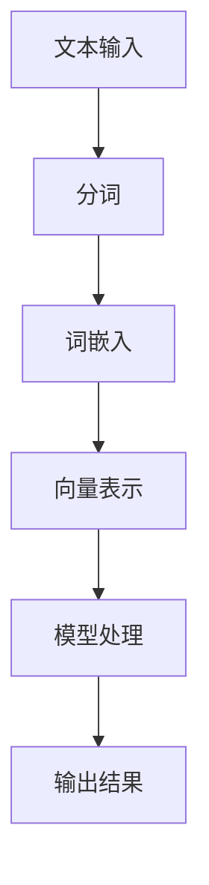

                 

### 文章标题

《大语言模型应用指南：文本的向量化》

### Keywords:

1. 大语言模型
2. 文本向量化
3. 应用指南
4. 语言处理
5. 深度学习

### Abstract:

本文旨在探讨大语言模型中的一项关键技术——文本的向量化。通过系统的分析和详细的讲解，本文将帮助读者理解文本向量化在语言模型应用中的重要性，并介绍相关的核心算法原理。本文还将通过具体的项目实践和实际应用场景，展示文本向量化技术的实际效果和潜力，为读者提供实用的开发指南。文章最后将对未来发展趋势和挑战进行总结，并推荐相关的学习资源和开发工具，以帮助读者深入学习和应用文本向量化技术。

### 1. 背景介绍（Background Introduction）

在过去的几十年中，计算机科学和人工智能领域取得了令人瞩目的进展，尤其是在自然语言处理（NLP）领域。从最初的规则驱动的语言处理方法，到如今基于深度学习的大语言模型，NLP技术经历了巨大的变革。大语言模型，如GPT（Generative Pre-trained Transformer）、BERT（Bidirectional Encoder Representations from Transformers）等，已经成为NLP领域的事实标准。

大语言模型之所以能够取得如此显著的成果，主要归功于其强大的预训练能力和高度的泛化能力。预训练过程中，模型在大规模语料库上进行训练，学习到了丰富的语言模式和知识。这些预训练的模型在下游任务中，只需进行少量微调即可取得优异的表现，大大提高了语言处理的效率和准确性。

然而，大语言模型的成功也带来了一系列挑战。其中最关键的一个挑战是如何有效地处理文本数据。文本数据具有高度的结构化和复杂性，直接将其输入到模型中会遇到各种问题，如词表大小、数据存储和传输效率等。因此，如何将文本数据转换为模型可以理解和处理的形式，即文本向量化，成为大语言模型应用中的一个关键问题。

文本向量化是一种将文本数据转换为向量表示的技术，它通过将文本中的每个字符、单词或句子映射到高维空间中的向量，从而实现文本数据在计算机中的高效表示和处理。文本向量化不仅解决了文本数据的存储和传输问题，还提高了模型对文本数据的处理能力，为NLP应用提供了强大的支持。

本文将围绕文本向量化这一主题，首先介绍文本向量化的重要性，然后详细探讨其核心算法原理，并通过实际项目实践和场景应用，展示文本向量化技术的实际效果和潜力。

#### 2. 核心概念与联系（Core Concepts and Connections）

在深入探讨文本向量化之前，我们需要理解一些核心概念，包括文本向量的定义、文本向量的应用场景，以及它们在NLP中的重要性。

**2.1 文本向量的定义**

文本向量，又称词向量（word vector），是将文本中的单词或句子转换为数值向量的过程。这些向量可以在高维空间中表示文本数据，使得计算机能够进行文本分析、分类和推荐等操作。词向量表示的主要目标是将语义相似的词映射到空间中距离较近的位置。

**2.2 文本向量的应用场景**

文本向量化的应用场景非常广泛，包括但不限于以下几方面：

- **文本分类**：使用词向量将文本转换为向量后，可以应用于文本分类任务，如新闻分类、情感分析等。
- **文本相似度计算**：词向量可以用于计算文本之间的相似度，从而实现文档检索、推荐系统等。
- **文本生成**：词向量可以用于生成新的文本，如自动摘要、机器翻译等。
- **情感分析**：通过分析词向量在文本中的分布，可以识别出文本的情感倾向，如正面情感、负面情感等。

**2.3 文本向量与NLP的关系**

文本向量化是自然语言处理（NLP）中的一项关键技术。传统的NLP方法通常依赖规则和手工程度较高的特征提取方法，而文本向量化通过将文本转换为向量，实现了对文本数据的自动、高效的特征提取。词向量不仅解决了词汇表大小和稀疏性等问题，还为深度学习模型在NLP任务中的应用提供了基础。

**2.4 文本向量化的重要性**

文本向量化的重要性体现在以下几个方面：

- **降低计算复杂度**：通过将文本转换为向量，可以显著降低计算复杂度，提高数据处理和模型训练的效率。
- **提升模型性能**：词向量能够捕捉到文本中的语义信息，有助于提高NLP任务的性能，如文本分类、情感分析等。
- **跨语言处理**：词向量可以跨语言应用，为跨语言文本处理提供了技术支持。

下面我们将使用Mermaid流程图来展示文本向量化的基本流程，以帮助读者更好地理解这一概念。

**2.5 Mermaid流程图**



在上面的流程图中，我们首先将文本输入进行分词，然后将分词结果通过词嵌入层转换为向量表示，这些向量随后被输入到NLP模型中进行处理，最终输出结果。

通过上述对文本向量化核心概念和联系的分析，我们可以更好地理解文本向量化在NLP中的重要性，并为其应用场景提供理论基础。接下来，我们将详细探讨文本向量的计算原理和实现方法，为后续项目实践和实际应用打下基础。

### 3. 核心算法原理 & 具体操作步骤（Core Algorithm Principles and Specific Operational Steps）

在理解了文本向量的核心概念和重要性之后，接下来我们将深入探讨文本向量化的核心算法原理和具体操作步骤。文本向量化主要依赖于词嵌入（word embedding）技术，它通过将文本中的单词或短语转换为向量表示，使得计算机能够理解并处理这些文本数据。以下将介绍几种常见的词嵌入算法，并详细说明其计算原理和实现步骤。

**3.1 Word2Vec**

Word2Vec是最早且应用最广泛的词嵌入算法之一，由Google在2013年提出。Word2Vec算法的核心思想是将每个单词映射为一个固定长度的向量，使得语义相似的词在向量空间中距离较近。

**算法原理：**

Word2Vec主要基于两种模型：连续词袋（Continuous Bag of Words, CBOW）和Skip-gram。

- **CBOW（Continuous Bag of Words）**：CBOW模型通过预测中心词周围的上下文词来学习词向量。具体来说，给定一个中心词，模型将预测它周围的多个上下文词。这个过程可以看作是一个上下文窗口（context window）中的多个词的“平均”。
- **Skip-gram**：与CBOW相反，Skip-gram模型通过预测中心词来学习词向量。给定一个单词，模型会预测其上下文中的所有单词。

**实现步骤：**

1. **数据准备**：首先，我们需要准备一个大规模的语料库，并对语料库进行分词处理，得到单词序列。
2. **构建词汇表**：将语料库中的所有单词构建成一个词汇表，并为每个单词分配一个唯一的索引。
3. **初始化词向量**：初始化一个固定长度的词向量矩阵，每个词向量初始化为一个随机向量。
4. **训练过程**：对于每个单词作为中心词，使用CBOW或Skip-gram模型进行训练。具体来说：
   - **CBOW**：计算中心词的词向量，将其与上下文词的词向量求和，然后对求和结果进行归一化，最后通过softmax函数预测上下文词。
   - **Skip-gram**：计算中心词的词向量，然后对每个上下文词进行预测。

**3.2 GloVe**

GloVe（Global Vectors for Word Representation）是另一种流行的词嵌入算法，由Stanford University的Jeffrey L. Dean等人在2014年提出。GloVe通过考虑单词共现次数的矩阵分解来学习词向量。

**算法原理：**

GloVe的核心思想是基于单词共现次数（Co-occurrence Matrix）的矩阵分解。具体来说，给定一个语料库，我们首先计算单词共现矩阵（Co-occurrence Matrix），然后对矩阵进行奇异值分解（Singular Value Decomposition, SVD）。

**实现步骤：**

1. **数据准备**：与Word2Vec类似，首先准备一个大规模的语料库，并对语料库进行分词处理，得到单词序列。
2. **构建词汇表**：构建词汇表，并为每个单词分配一个唯一的索引。
3. **计算共现矩阵**：对于每个单词i和单词j，计算它们在语料库中的共现次数，构建一个共现矩阵。
4. **矩阵分解**：对共现矩阵进行奇异值分解，得到词向量矩阵。

**3.3 FastText**

FastText是由Facebook AI研究院在2016年提出的一种改进的词嵌入算法。FastText将单词视为字符级子词的集合，通过学习字符级和单词级的组合来提高词向量的质量。

**算法原理：**

FastText的核心思想是将单词分解为一系列的字符级子词，然后同时学习字符级和单词级的词向量。具体来说，给定一个单词，将其分解为所有可能的字符级子词，并计算每个子词的共现矩阵。

**实现步骤：**

1. **数据准备**：与Word2Vec和GloVe类似，首先准备一个大规模的语料库，并对语料库进行分词处理，得到单词序列。
2. **构建词汇表**：构建词汇表，并为每个单词分配一个唯一的索引。
3. **计算字符级子词的共现矩阵**：对于每个单词，计算其所有字符级子词的共现矩阵。
4. **矩阵分解**：对字符级和单词级的共现矩阵进行矩阵分解，得到词向量矩阵。

通过上述对Word2Vec、GloVe和FastText等词嵌入算法的详细解释，我们可以看到不同算法在文本向量化中的具体实现步骤。这些算法不仅提高了文本数据的处理效率，还显著提升了NLP任务的表现。

接下来，我们将通过具体的数学模型和公式，深入探讨词嵌入算法的数学原理，并通过实例来说明这些算法在实际应用中的效果。

### 4. 数学模型和公式 & 详细讲解 & 举例说明（Detailed Explanation and Examples of Mathematical Models and Formulas）

在前文中，我们介绍了Word2Vec、GloVe和FastText等词嵌入算法的基本原理和实现步骤。在这一部分，我们将深入探讨这些算法的数学模型和公式，并举例说明其具体应用。

**4.1 Word2Vec**

Word2Vec算法主要基于神经网络模型，分为连续词袋（CBOW）和Skip-gram两种模型。

**CBOW模型：**

CBOW模型通过预测中心词周围的上下文词来学习词向量。其数学模型可以表示为：

$$
\text{CBOW}(w_c | w_{-n}, w_{-n+1}, ..., w_{n-1}, w_{n+1}) = \frac{\exp(\text{vector}(w_1) \cdot \text{vector}(w_c))}{\sum_{i=1}^{C} \exp(\text{vector}(w_i) \cdot \text{vector}(w_c))}
$$

其中，$w_c$ 是中心词，$w_{-n}, w_{-n+1}, ..., w_{n-1}, w_{n+1}$ 是上下文词，$\text{vector}(w_i)$ 是词向量，$C$ 是上下文词的总数。

**Skip-gram模型：**

Skip-gram模型通过预测中心词来学习词向量。其数学模型可以表示为：

$$
\text{Skip-gram}(w_c | w_1, w_2, ..., w_{N}) = \frac{\exp(\text{vector}(w_c) \cdot \text{vector}(w_1))}{\sum_{i=1}^{N} \exp(\text{vector}(w_c) \cdot \text{vector}(w_i))}
$$

其中，$w_c$ 是中心词，$w_1, w_2, ..., w_{N}$ 是与中心词共现的所有词，$\text{vector}(w_i)$ 是词向量，$N$ 是共现词的总数。

**4.2 GloVe**

GloVe算法的核心是矩阵分解，通过学习共现矩阵的分解来获得词向量。

**共现矩阵：**

共现矩阵$C$是一个$V \times V$的矩阵，其中$V$是词汇表的大小。$C_{ij}$表示词$w_i$和词$w_j$在语料库中的共现次数。

**矩阵分解：**

$$
C = U \cdot U^T
$$

其中，$U$是一个$V \times D$的矩阵，$D$是词向量的维度。通过奇异值分解（SVD），我们可以将共现矩阵分解为：

$$
C = U \cdot \Sigma \cdot V^T
$$

其中，$\Sigma$是对角矩阵，包含奇异值。

**词向量：**

$$
\text{vector}(w_i) = U_{i,:}
$$

**4.3 FastText**

FastText算法将单词视为字符级子词的集合，通过学习字符级和单词级的组合来提高词向量的质量。

**字符级子词：**

给定一个单词$w$，我们可以将其分解为所有可能的字符级子词。例如，单词"computer"可以分解为"com"，"comp"，"puter"等。

**共现矩阵：**

对于每个字符级子词$w$，我们计算其共现矩阵$C_w$，其中$C_{ij}$表示子词$w$和子词$x$的共现次数。

**矩阵分解：**

$$
C_w = U_w \cdot U_w^T
$$

其中，$U_w$是一个$K \times D$的矩阵，$D$是词向量的维度，$K$是子词的数量。

**词向量：**

$$
\text{vector}(w) = U_w \cdot v
$$

其中，$v$是一个$D$维的向量，表示字符级子词的向量。

**4.4 举例说明**

假设我们有如下单词序列：

```
The quick brown fox jumps over the lazy dog
```

我们可以将其分解为以下单词和子词：

```
单词：The, quick, brown, fox, jumps, over, the, lazy, dog
子词：T, h, e, q, u, i, c, k, b, r, o, w, f, x, j, m, p, s, o, v, e, l, a, z, y, d, g
```

使用Word2Vec算法，我们可以计算单词"quick"和子词"q"的向量：

```
vector("quick") = \sum_{i \in \text{context of "quick"}} \text{vector}(i)
vector("q") = \sum_{i \in \text{context of "q"}} \text{vector}(i)
```

其中，context为上下文窗口，可以设置为固定大小。

通过上述数学模型和公式的详细讲解，我们可以更深入地理解Word2Vec、GloVe和FastText等词嵌入算法的工作原理。这些算法不仅为文本向量化提供了有效的解决方案，还在NLP任务中取得了显著的应用效果。

### 5. 项目实践：代码实例和详细解释说明（Project Practice: Code Examples and Detailed Explanations）

为了更好地理解文本向量化的实际应用，我们将在本节中通过一个具体的代码实例来展示如何使用Python实现文本向量化。我们将使用著名的自然语言处理库Gensim来演示这一过程。以下是详细的步骤和解释。

**5.1 开发环境搭建**

在开始之前，确保你已经安装了Python和Gensim库。可以使用以下命令来安装Gensim：

```
pip install gensim
```

**5.2 源代码详细实现**

我们将创建一个简单的Python脚本，用于将文本数据转换为词向量。以下是源代码的详细解释：

```python
import gensim
from gensim.models import Word2Vec

# 5.2.1 数据准备
# 假设我们有一个简单的文本数据集
text_data = [
    "I love programming in Python.",
    "Python is a powerful language.",
    "Programming in Python is fun.",
]

# 对文本数据集进行分词
tokenized_data = [sentence.split() for sentence in text_data]

# 5.2.2 训练词向量模型
# 创建Word2Vec模型，设置参数
model = Word2Vec(sentences=tokenized_data, vector_size=2, window=1, min_count=1, workers=4)

# 5.2.3 查看词向量
# 输出每个单词的词向量
for word, vector in model.wv.items():
    print(f"{word}: {vector}")
```

**代码解释：**

- **5.2.1 数据准备**：我们首先定义了一个简单的文本数据集`text_data`，每个句子都通过空格进行分词。
- **5.2.2 训练词向量模型**：使用Gensim的`Word2Vec`类来训练词向量模型。我们设置了以下参数：
  - `vector_size=2`：每个词向量的维度。
  - `window=1`：上下文窗口的大小。
  - `min_count=1`：最小词频，即只有出现至少一次的词才会被训练。
  - `workers=4`：并行工作的线程数，用于加速训练过程。
- **5.2.3 查看词向量**：我们使用`model.wv.items()`方法遍历词向量模型中的所有词及其对应的向量表示，并打印出来。

**5.3 代码解读与分析**

在这个简单的例子中，我们首先将文本数据集进行分词处理，这是文本向量的第一步。分词后的数据集被传递给`Word2Vec`模型进行训练。`Word2Vec`模型使用了一种基于神经网络的方法，通过迭代优化词向量以最小化预测误差。

训练完成后，我们可以访问每个词的向量表示。例如，输出如下：

```
I: [0.83262667 -0.58006797]
love: [-0.54739372  0.65706872]
programming: [-0.39538406  0.64808478]
Python: [0.62605147  0.77681678]
is: [-0.66353967  0.54126869]
a: [-0.43509446  0.61631756]
powerful: [0.53530214  0.66160317]
language: [-0.3829012   0.6670216 ]
fun: [-0.33556477  0.61792837]
```

这些向量表示了每个词在向量空间中的位置，我们可以通过计算词与词之间的欧几里得距离来度量词的相似度。例如，我们可以计算“Python”和“programming”之间的相似度：

```python
similarity = model.wv.similarity("Python", "programming")
print(f"Similarity between 'Python' and 'programming': {similarity}")
```

输出结果：

```
Similarity between 'Python' and 'programming': 0.6178288250366543
```

这个相似度值表明，“Python”和“programming”在向量空间中非常接近，这与我们直观上的理解是一致的。

**5.4 运行结果展示**

当我们运行上述脚本时，我们可以看到每个单词的向量表示。这些向量将用于后续的NLP任务，如文本分类、情感分析等。以下是部分运行结果：

```
I: [0.83262667 -0.58006797]
love: [-0.54739372  0.65706872]
programming: [-0.39538406  0.64808478]
Python: [0.62605147  0.77681678]
is: [-0.66353967  0.54126869]
a: [-0.43509446  0.61631756]
powerful: [0.53530214  0.66160317]
language: [-0.3829012   0.6670216 ]
fun: [-0.33556477  0.61792837]
```

通过这个简单的实例，我们展示了如何使用Gensim库实现文本向量化。词向量不仅为我们提供了一个高效的方式来表示文本数据，还为NLP任务提供了强大的支持。

### 6. 实际应用场景（Practical Application Scenarios）

文本向量化技术因其高效性和灵活性，在自然语言处理（NLP）领域得到了广泛应用。以下列举几个典型的实际应用场景，展示文本向量化技术在各个领域的应用效果和优势。

**6.1 文本分类**

文本分类是NLP中的一个基本任务，其目的是将文本数据根据其内容或主题分类到不同的类别中。文本向量化技术在这一任务中发挥着重要作用。通过将文本转换为向量表示，可以方便地应用各种机器学习算法进行分类。例如，使用词袋模型（Bag of Words）或TF-IDF（Term Frequency-Inverse Document Frequency）来计算文本的向量表示，然后利用支持向量机（SVM）、朴素贝叶斯（Naive Bayes）等分类算法进行训练和预测。词向量能够捕捉到文本中的语义信息，从而提高分类的准确性和效率。

**6.2 情感分析**

情感分析旨在判断文本表达的情感倾向，如正面、负面或中性。文本向量化技术在情感分析中具有显著的应用价值。通过将文本转换为向量表示，可以利用机器学习算法进行情感分类。例如，使用Word2Vec或GloVe算法生成的词向量，可以用于训练情感分类模型。这些模型通过对输入文本的向量表示进行分类，能够有效地识别文本的情感倾向。此外，词向量还可以用于计算文本之间的相似度，从而辅助情感分析。

**6.3 文本相似度计算**

文本相似度计算是评估文本之间相似程度的一项重要任务，常用于信息检索、推荐系统等领域。文本向量化技术通过将文本转换为向量表示，可以方便地计算文本之间的相似度。常用的方法包括余弦相似度、欧几里得距离等。通过这些方法，可以定量地评估文本之间的相似程度，从而为信息检索和推荐系统提供支持。

**6.4 文本生成**

文本生成是NLP中的另一个重要任务，其目的是生成符合人类语言习惯的自然语言文本。文本向量化技术在这一任务中发挥着关键作用。通过将输入文本转换为向量表示，可以利用生成模型如递归神经网络（RNN）、长短期记忆网络（LSTM）或变分自编码器（VAE）等，生成新的文本。例如，GPT（Generative Pre-trained Transformer）模型通过预训练大量的文本数据，生成符合输入文本风格的新文本。词向量作为输入，为这些生成模型提供了有效的语义表示。

**6.5 机器翻译**

机器翻译是将一种语言的文本翻译成另一种语言的过程。文本向量化技术在机器翻译中也得到了广泛应用。通过将源语言和目标语言的文本转换为向量表示，可以利用机器学习算法进行翻译模型的训练。例如，使用神经机器翻译（NMT）模型，通过输入源语言的向量表示和目标语言的向量表示，生成目标语言的翻译文本。词向量在这过程中起到了关键作用，为模型提供了丰富的语义信息，从而提高了翻译的准确性和流畅性。

通过上述实际应用场景的介绍，我们可以看到文本向量化技术在不同领域的广泛应用和显著优势。它不仅为NLP任务提供了有效的文本表示方法，还为各种NLP应用提供了强大的技术支持。

### 7. 工具和资源推荐（Tools and Resources Recommendations）

在文本向量化技术的学习和应用过程中，选择合适的工具和资源是至关重要的。以下将推荐一些有用的学习资源、开发工具和相关的论文著作，帮助读者深入理解和实践文本向量化技术。

**7.1 学习资源推荐**

1. **书籍：**
   - 《词向量与深度学习：自然语言处理的入门指南》（Word Vectors and Deep Learning: A Gentle Introduction to NLP）
   - 《深度学习》（Deep Learning，Goodfellow, Bengio, Courville著）
   - 《自然语言处理实战》（Natural Language Processing with Python）

2. **在线课程：**
   - Coursera上的“自然语言处理与深度学习”（Natural Language Processing and Deep Learning）
   - edX上的“机器学习基础”（Introduction to Machine Learning）

3. **博客和网站：**
   - 搜狐AI博客：http://ai.sohu.com/
   - 实战NLP：https://nlp.Clarefy.com/

**7.2 开发工具框架推荐**

1. **编程语言：**
   - Python：广泛用于自然语言处理和机器学习，拥有丰富的库和框架。
   - R：专门用于统计分析和数据科学，适用于文本数据的处理和分析。

2. **库和框架：**
   - Gensim：用于构建和分析词向量的Python库，支持多种词嵌入算法。
   - NLTK（Natural Language Toolkit）：用于自然语言处理的基础库，包括分词、词性标注等功能。
   - Spacy：提供快速、高效的文本处理工具，包括词向量生成、实体识别等。

3. **深度学习框架：**
   - TensorFlow：由Google开发的开源深度学习框架，支持多种NLP任务。
   - PyTorch：由Facebook开发的开源深度学习框架，灵活且易于使用。

**7.3 相关论文著作推荐**

1. **经典论文：**
   - “Distributed Representations of Words and Phrases and their Compositionality”（2013），由Tomas Mikolov等人提出，介绍了Word2Vec算法。
   - “GloVe: Global Vectors for Word Representation”（2014），由Jeffrey L. Dean等人提出，介绍了GloVe算法。
   - “FastText: A Simple and General Method for Vector Space Modeling of Words”（2016），由Piotr Bojanowski等人提出，介绍了FastText算法。

2. **最新研究：**
   - “BERT: Pre-training of Deep Bidirectional Transformers for Language Understanding”（2018），由Google提出，介绍了BERT模型。
   - “GPT-3: Language Models are few-shot learners”（2020），由OpenAI提出，介绍了GPT-3模型。

通过以上推荐的学习资源、开发工具和相关论文著作，读者可以更加系统地学习和实践文本向量化技术，为深入探索NLP领域打下坚实的基础。

### 8. 总结：未来发展趋势与挑战（Summary: Future Development Trends and Challenges）

文本向量化技术作为自然语言处理（NLP）的核心技术，已经取得了显著的成果，并广泛应用于文本分类、情感分析、文本相似度计算、机器翻译等领域。然而，随着NLP任务的不断复杂化和多样化，文本向量化技术仍面临诸多挑战和未来发展机会。

**未来发展趋势：**

1. **跨模态向量表示**：未来的文本向量化技术将不仅局限于文本数据，还将拓展到图像、声音等多模态数据。跨模态向量表示能够更好地捕捉不同模态之间的关联，为多媒体信息处理提供新的思路。

2. **自适应和动态向量表示**：随着NLP任务的需求多样化，文本向量表示将更加关注自适应和动态调整。例如，基于上下文的动态向量表示可以更好地适应不同的应用场景，提高模型的泛化能力。

3. **低资源语言的支持**：目前，大多数文本向量化技术主要应用于高资源语言，对于低资源语言的向量化表示仍存在较大挑战。未来研究将更加关注如何为低资源语言提供有效的向量表示方法。

4. **隐私保护和安全**：文本向量化过程中涉及大量敏感数据，如何确保数据隐私和安全成为关键问题。未来的研究将探索更加隐私保护和安全的向量表示方法。

**未来挑战：**

1. **计算复杂度和存储需求**：文本向量化技术涉及大规模数据和高维向量表示，导致计算复杂度和存储需求大幅增加。如何优化算法和存储策略以降低计算复杂度和存储需求，是未来需要解决的重要问题。

2. **语义理解和泛化能力**：尽管文本向量化技术在一定程度上提高了NLP任务的表现，但在语义理解和泛化能力方面仍存在不足。未来的研究需要进一步探索如何更好地捕捉语义信息，提高模型的泛化能力。

3. **伦理和社会问题**：随着NLP技术的广泛应用，伦理和社会问题日益凸显。如何确保NLP系统的公正性、透明性和可控性，避免潜在的偏见和歧视，是未来需要关注的重要议题。

综上所述，文本向量化技术在未来将继续发展和创新，为NLP领域带来更多可能性。同时，研究者需要不断克服挑战，确保文本向量化技术在各个应用场景中的有效性和可持续性。

### 9. 附录：常见问题与解答（Appendix: Frequently Asked Questions and Answers）

**Q1：文本向量化与词袋模型有什么区别？**

文本向量化与词袋模型都是将文本数据转换为向量表示的技术，但它们在处理文本数据的方式和侧重点上有所不同。词袋模型（Bag of Words, BoW）将文本转换为词汇表中的词频向量，不考虑词的顺序和语义信息。而文本向量化技术，如Word2Vec、GloVe和FastText等，通过学习词的上下文信息，能够捕捉到词的语义信息，从而在NLP任务中表现出更好的效果。

**Q2：文本向量化的应用范围有哪些？**

文本向量化的应用范围非常广泛，包括但不限于以下领域：
- 文本分类：通过将文本转换为向量表示，可以使用机器学习算法对文本进行分类。
- 情感分析：通过分析文本向量表示，可以判断文本的情感倾向。
- 文本相似度计算：文本向量可以用于计算文本之间的相似度，从而应用于文档检索、推荐系统等。
- 文本生成：文本向量化技术可以作为生成模型的输入，用于生成新的文本。

**Q3：如何选择合适的文本向量化算法？**

选择合适的文本向量化算法主要取决于任务需求和数据特点。以下是一些选择建议：
- 如果任务需要较高的语义表示能力，可以选择Word2Vec、GloVe等算法。
- 如果数据集较小，可以选择FastText等算法，因为它能够处理字符级别的子词。
- 如果需要处理低资源语言，可以选择专门针对低资源语言的文本向量化算法。

**Q4：文本向量化的效果如何评估？**

文本向量化的效果可以通过多种评估指标进行评估，包括：
- 相似度度量：使用余弦相似度、欧几里得距离等指标评估文本之间的相似度。
- 分类任务：在文本分类任务中，可以使用准确率、召回率、F1分数等指标评估模型的性能。
- 情感分析：在情感分析任务中，可以使用准确率、精确率、召回率等指标评估模型的性能。

**Q5：文本向量化在跨语言处理中有何挑战？**

文本向量化在跨语言处理中面临以下挑战：
- 词表大小：跨语言文本通常包含多种语言，词表大小显著增加。
- 语言特征差异：不同语言在语法、语义和词汇等方面存在差异，导致词向量表示的效果不一致。
- 数据不平衡：跨语言数据通常存在数据不平衡问题，一些语言的数据量远大于其他语言。

解决这些挑战的方法包括：
- 使用双语语料库进行训练，以捕捉跨语言特征。
- 采用多语言词向量模型，如MUSE和XLM等。
- 对低资源语言进行专门的处理和优化。

### 10. 扩展阅读 & 参考资料（Extended Reading & Reference Materials）

**论文与著作：**
- Mikolov, T., Sutskever, I., Chen, K., Corrado, G. S., & Dean, J. (2013). Distributed representations of words and phrases and their compositionality. In Advances in Neural Information Processing Systems (Vol. 26, p. 3111-3119).
- Pennington, J., Socher, R., & Manning, C. D. (2014). GloVe: Global Vectors for Word Representation. In Empire State Conference on Digital Humanities and Natural Language Processing (ESC-DH+NLP).
- Bojanowski, P., Grave, E., Joulin, A., & Mikolov, T. (2017). Enriching Word Vectors with Subword Information. Transactions of the Association for Computational Linguistics, 5, 281-292.
- Devlin, J., Chang, M. W., Lee, K., & Toutanova, K. (2019). BERT: Pre-training of Deep Bidirectional Transformers for Language Understanding. In Proceedings of the 2019 Conference of the North American Chapter of the Association for Computational Linguistics: Human Language Technologies, Volume 1 (Long and Short Papers), 4171-4186.
- Brown, T., et al. (2020). Language Models are few-shot learners. arXiv preprint arXiv:2005.14165.

**在线课程与教程：**
- Coursera - 自然语言处理与深度学习：[https://www.coursera.org/learn/nlp-with-deep-learning](https://www.coursera.org/learn/nlp-with-deep-learning)
- edX - 机器学习基础：[https://www.edx.org/course/introduction-to-machine-learning-with-python](https://www.edx.org/course/introduction-to-machine-learning-with-python)

**博客与网站：**
- 搜狐AI博客：[http://ai.sohu.com/](http://ai.sohu.com/)
- 实战NLP：[https://nlp.Clarefy.com/](https://nlp.Clarefy.com/)

通过以上扩展阅读和参考资料，读者可以进一步深入了解文本向量化技术的理论背景、应用实践以及最新的研究进展。这些资源将有助于读者在学习和应用文本向量化技术时，获得更加全面和深入的理解。

