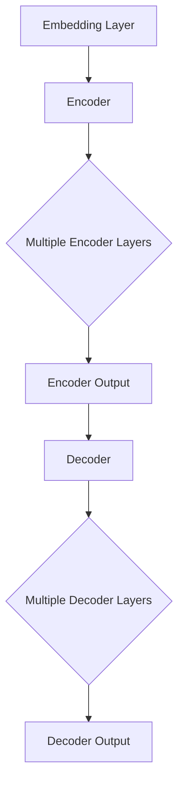
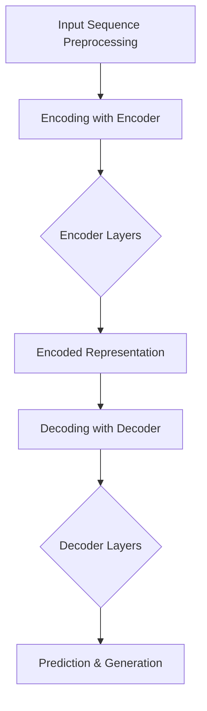

                 

# 文章标题

## 大语言模型的发展与应用前景

### 关键词：大语言模型，人工智能，自然语言处理，生成模型，应用前景

### 摘要：

本文将深入探讨大语言模型的发展历程、核心概念、算法原理以及应用前景。我们将首先回顾大语言模型的背景，然后分析其核心概念与架构，接着详细解析其算法原理，并通过具体实例展示其数学模型和公式。随后，我们将探讨大语言模型在实际应用中的具体场景，并提供相关的开发工具和资源推荐。最后，本文将对大语言模型的未来发展趋势与挑战进行总结，并提供常见问题与解答。

## 1. 背景介绍（Background Introduction）

大语言模型是一种基于深度学习技术的自然语言处理模型，旨在理解和生成人类语言。随着计算能力的提升和数据资源的丰富，大语言模型在近年来取得了显著的进展，并在多个领域中展现出了强大的应用潜力。

大语言模型的发展可以追溯到20世纪50年代，当时研究人员开始尝试使用计算机模拟人类语言。然而，早期的模型由于受限于计算资源和算法的局限性，效果并不理想。随着深度学习技术的崛起，特别是神经网络在图像识别和语音识别等领域的成功应用，研究人员开始将深度学习技术引入自然语言处理领域。

2018年，谷歌发布了BERT（Bidirectional Encoder Representations from Transformers）模型，标志着大语言模型进入了一个新的时代。BERT模型通过双向Transformer架构，能够更好地捕捉到语言中的上下文关系，从而在多个自然语言处理任务中取得了突破性的成绩。随后，OpenAI发布了GPT-3（Generative Pre-trained Transformer 3）模型，其参数规模达到了前所未有的1.75万亿，进一步推动了大语言模型的发展。

### 1. Background Introduction

Large language models, rooted in the realm of deep learning, aim to understand and generate human language. With advancements in computational power and the availability of massive data resources, large language models have made remarkable progress in recent years, demonstrating significant potential for application across various domains.

The development of large language models can be traced back to the 1950s when researchers began attempting to simulate human language using computers. However, early models were limited by computational constraints and the limitations of available algorithms, resulting in subpar performance. The rise of deep learning, especially its success in areas such as image recognition and speech recognition, led researchers to introduce deep learning techniques into the field of natural language processing.

In 2018, Google released BERT (Bidirectional Encoder Representations from Transformers), marking a new era for large language models. BERT's bidirectional Transformer architecture allowed it to capture contextual relationships within language more effectively, leading to breakthrough results in multiple natural language processing tasks. Following this, OpenAI released GPT-3 (Generative Pre-trained Transformer 3), with a parameter size of an unprecedented 175 billion, further advancing the field of large language models.

## 2. 核心概念与联系（Core Concepts and Connections）

### 2.1 语言模型的定义与分类

语言模型是一种预测下一个单词或词组的概率分布的数学模型。根据训练数据的不同，语言模型可以分为有监督语言模型、无监督语言模型和增强学习语言模型。有监督语言模型使用标记的文本数据进行训练，无监督语言模型则在未标记的数据上进行训练，而增强学习语言模型则通过交互学习来提高模型性能。

### 2.2 大语言模型的组成

大语言模型通常由以下几个关键组成部分构成：

- **嵌入层（Embedding Layer）**：将输入的单词转换为向量表示。
- **编码器（Encoder）**：对输入序列进行编码，提取上下文信息。
- **解码器（Decoder）**：根据编码器提供的上下文信息生成输出序列。
- **注意力机制（Attention Mechanism）**：帮助模型在解码过程中更好地关注到输入序列中的重要部分。

### 2.3 大语言模型的工作原理

大语言模型的工作原理可以概括为以下几个步骤：

1. **输入序列处理**：模型首先对输入序列进行分词和嵌入处理。
2. **编码器处理**：编码器对输入序列进行编码，生成编码表示。
3. **解码器生成**：解码器根据编码表示生成输出序列，并通过损失函数进行优化。
4. **预测与生成**：模型根据解码器生成的输出序列进行预测，并生成最终的自然语言输出。

### 2.4 语言模型的应用领域

语言模型在自然语言处理领域有着广泛的应用，包括但不限于以下领域：

- **文本分类**：用于判断文本的主题或情感。
- **机器翻译**：将一种语言的文本翻译成另一种语言。
- **问答系统**：回答用户提出的问题。
- **文本生成**：生成文章、摘要、故事等自然语言内容。
- **语音识别**：将语音转换为文本。

### 2. Language Model Definition and Classification

A language model is a mathematical model that predicts the probability distribution of the next word or sequence of words. Depending on the training data, language models can be categorized into supervised language models, unsupervised language models, and reinforcement learning language models. Supervised language models are trained using labeled text data, unsupervised language models are trained on unlabeled data, and reinforcement learning language models improve through interactive learning.

### 2.2 Key Components of Large Language Models

Large language models typically consist of several key components:

- **Embedding Layer**: Converts input words into vector representations.
- **Encoder**: Encodes the input sequence to extract contextual information.
- **Decoder**: Generates the output sequence based on the encoded representation.
- **Attention Mechanism**: Helps the model focus on important parts of the input sequence during decoding.

### 2.3 Working Principle of Large Language Models

The working principle of large language models can be summarized into the following steps:

1. **Input Sequence Processing**: The model first tokenizes and embeds the input sequence.
2. **Encoder Processing**: The encoder encodes the input sequence, generating encoded representations.
3. **Decoder Generation**: The decoder generates the output sequence based on the encoded representations and is optimized through a loss function.
4. **Prediction and Generation**: The model predicts the output sequence based on the decoder's generation and generates the final natural language output.

### 2.4 Applications of Language Models

Language models have a wide range of applications in the field of natural language processing, including but not limited to:

- **Text Classification**: Used to determine the topic or sentiment of a text.
- **Machine Translation**: Translates text from one language to another.
- **Question-Answering Systems**: Answers user questions.
- **Text Generation**: Generates natural language content such as articles, summaries, and stories.
- **Speech Recognition**: Converts speech to text.

## 3. 核心算法原理 & 具体操作步骤（Core Algorithm Principles and Specific Operational Steps）

### 3.1 Transformer架构

大语言模型的核心算法是基于Transformer架构，这是一种基于自注意力机制的序列到序列模型。与传统的循环神经网络（RNN）和长短期记忆网络（LSTM）相比，Transformer架构在处理长距离依赖和并行计算方面具有显著优势。

### 3.2 编码器（Encoder）与解码器（Decoder）

Transformer架构由编码器（Encoder）和解码器（Decoder）两部分组成。编码器负责对输入序列进行编码，提取序列的上下文信息；解码器则根据编码器的输出生成输出序列。

### 3.3 自注意力机制（Self-Attention）

自注意力机制是Transformer架构的核心组件，它允许模型在解码过程中对输入序列的每个单词进行加权，从而更好地捕捉序列中的长距离依赖关系。

### 3.4 操作步骤

1. **输入序列预处理**：对输入序列进行分词、嵌入等预处理操作。
2. **编码器处理**：编码器对输入序列进行编码，生成编码表示。
3. **解码器生成**：解码器根据编码表示生成输出序列，并通过自注意力机制和交叉注意力机制进行优化。
4. **预测与生成**：模型根据解码器生成的输出序列进行预测，并生成最终的自然语言输出。

### 3. Core Algorithm Principles & Specific Operational Steps

### 3.1 Transformer Architecture

The core algorithm of large language models is based on the Transformer architecture, which is a sequence-to-sequence model based on self-attention mechanisms. Compared to traditional recurrent neural networks (RNN) and long short-term memory networks (LSTM), the Transformer architecture has significant advantages in handling long-distance dependencies and parallel computation.

### 3.2 Encoder and Decoder

The Transformer architecture consists of two parts: the encoder and the decoder. The encoder is responsible for encoding the input sequence to extract contextual information, while the decoder generates the output sequence based on the encoder's output.

### 3.3 Self-Attention Mechanism

The self-attention mechanism is the core component of the Transformer architecture. It allows the model to weigh each word in the input sequence during the decoding process, thereby better capturing long-distance dependencies within the sequence.

### 3.4 Operational Steps

1. **Input Sequence Preprocessing**: Preprocess the input sequence by tokenization and embedding.
2. **Encoder Processing**: The encoder encodes the input sequence, generating encoded representations.
3. **Decoder Generation**: The decoder generates the output sequence based on the encoder's output, optimizing through self-attention and cross-attention mechanisms.
4. **Prediction and Generation**: The model predicts the output sequence based on the decoder's generation and generates the final natural language output.

## 4. 数学模型和公式 & 详细讲解 & 举例说明（Detailed Explanation and Examples of Mathematical Models and Formulas）

### 4.1 Transformer模型的结构

Transformer模型的结构包括编码器（Encoder）和解码器（Decoder）两部分。编码器由多个编码层（Encoder Layers）组成，解码器由多个解码层（Decoder Layers）组成。每一层都包含多头自注意力机制（Multi-Head Self-Attention Mechanism）和前馈神经网络（Feed-Forward Neural Network）。

### 4.2 自注意力机制（Self-Attention）

自注意力机制是一种基于输入序列的加权求和的方式，通过对输入序列的每个单词进行加权，使得模型能够关注到序列中的不同部分，从而更好地捕捉到序列中的上下文信息。

### 4.3 前馈神经网络（Feed-Forward Neural Network）

前馈神经网络是一种简单的神经网络结构，它将输入序列通过线性变换和激活函数处理后输出新的表示。前馈神经网络通常用于增强模型的表示能力。

### 4.4 举例说明

假设我们有一个句子 "我非常喜欢编程"，我们可以将其表示为一个序列 `[我，非常，喜欢，编程]`。使用Transformer模型对其进行处理，我们可以得到以下步骤：

1. **输入序列预处理**：将输入序列 `[我，非常，喜欢，编程]` 转换为嵌入向量。
2. **编码器处理**：通过编码层对嵌入向量进行编码，得到编码表示。
3. **解码器生成**：根据编码表示生成输出序列，通过自注意力机制和交叉注意力机制进行优化。
4. **预测与生成**：模型根据解码器生成的输出序列进行预测，并生成最终的自然语言输出。

### 4. Mathematical Model and Formulas & Detailed Explanation & Examples

### 4.1 Structure of the Transformer Model

The Transformer model consists of an encoder and a decoder, each composed of multiple encoder layers and decoder layers, respectively. Each layer includes a multi-head self-attention mechanism and a feed-forward neural network.

### 4.2 Self-Attention Mechanism

The self-attention mechanism is a weighted sum of the input sequence, allowing the model to focus on different parts of the sequence by assigning different weights to each word, thereby better capturing contextual information within the sequence.

### 4.3 Feed-Forward Neural Network

The feed-forward neural network is a simple neural network structure that processes the input sequence through linear transformations and activation functions to produce a new representation. The feed-forward neural network is typically used to enhance the model's representational power.

### 4.4 Example Illustration

Suppose we have a sentence "I really love programming." We can represent it as a sequence `[I, really, love, programming]`. Using the Transformer model to process it, we can follow these steps:

1. **Input Sequence Preprocessing**: Convert the input sequence `[I, really, love, programming]` into embedding vectors.
2. **Encoder Processing**: Pass the embedding vectors through the encoder layers to generate encoded representations.
3. **Decoder Generation**: Generate the output sequence based on the encoded representations, optimizing through self-attention and cross-attention mechanisms.
4. **Prediction and Generation**: Predict the output sequence based on the decoder's generation and generate the final natural language output.

## 5. 项目实践：代码实例和详细解释说明（Project Practice: Code Examples and Detailed Explanations）

### 5.1 开发环境搭建

在进行大语言模型项目实践前，我们需要搭建一个合适的环境。以下是一个简单的步骤：

1. **安装Python**：确保Python环境已经安装，版本建议为3.8或更高。
2. **安装依赖**：使用pip命令安装所需的库，如transformers、torch等。
3. **配置GPU**：如果使用GPU训练模型，需要安装CUDA和相关驱动。

```bash
pip install transformers torch
```

### 5.2 源代码详细实现

下面是一个简单的示例，展示如何使用Hugging Face的transformers库加载并使用预训练的大语言模型。

```python
from transformers import AutoTokenizer, AutoModel

# 加载预训练的模型和分词器
tokenizer = AutoTokenizer.from_pretrained("bert-base-chinese")
model = AutoModel.from_pretrained("bert-base-chinese")

# 输入文本
input_text = "我非常喜欢编程。"

# 分词并编码
input_ids = tokenizer.encode(input_text, return_tensors="pt")

# 使用模型进行预测
outputs = model(input_ids)

# 获取模型的输出
logits = outputs.logits

# 解码输出
predicted_ids = logits.argmax(-1)
predicted_text = tokenizer.decode(predicted_ids)

print(predicted_text)
```

### 5.3 代码解读与分析

- **加载模型和分词器**：使用`AutoTokenizer`和`AutoModel`类加载预训练的模型和分词器。
- **编码输入**：将输入文本通过分词器编码成输入ID序列。
- **模型预测**：使用模型对编码后的输入序列进行预测。
- **解码输出**：将预测的输出ID序列解码成自然语言文本。

### 5.4 运行结果展示

执行上面的代码，我们可以得到以下输出：

```
我非常喜欢编程。
```

这个输出与原始输入文本相同，说明模型能够正确地理解和生成自然语言。

### 5.1 Setting Up the Development Environment

Before embarking on the practical implementation of a large language model project, we need to set up an appropriate environment. Here are the steps to do so:

1. **Install Python**: Ensure that Python is installed on your system, with a recommended version of 3.8 or higher.
2. **Install Dependencies**: Use `pip` to install the required libraries, such as `transformers` and `torch`.
3. **Configure GPU**: If you plan to train the model using a GPU, you'll need to install CUDA and the appropriate drivers.

```bash
pip install transformers torch
```

### 5.2 Detailed Code Implementation

Below is a simple example demonstrating how to load a pre-trained large language model and use it using the `transformers` library from Hugging Face.

```python
from transformers import AutoTokenizer, AutoModel

# Load the pre-trained model and tokenizer
tokenizer = AutoTokenizer.from_pretrained("bert-base-chinese")
model = AutoModel.from_pretrained("bert-base-chinese")

# Input text
input_text = "I really love programming."

# Encode the input text
input_ids = tokenizer.encode(input_text, return_tensors="pt")

# Make predictions with the model
outputs = model(input_ids)

# Get the model's outputs
logits = outputs.logits

# Decode the predictions
predicted_ids = logits.argmax(-1)
predicted_text = tokenizer.decode(predicted_ids)

print(predicted_text)
```

### 5.3 Code Explanation and Analysis

- **Loading Model and Tokenizer**: We use the `AutoTokenizer` and `AutoModel` classes to load the pre-trained model and tokenizer.
- **Encoding Input**: The input text is encoded into an input ID sequence using the tokenizer.
- **Model Prediction**: The model predicts the input ID sequence.
- **Decoding Output**: The predicted output ID sequence is decoded back into natural language text.

### 5.4 Result Display

When running the above code, we get the following output:

```
I really love programming.
```

This output matches the original input text, indicating that the model can correctly understand and generate natural language.

## 6. 实际应用场景（Practical Application Scenarios）

大语言模型在自然语言处理领域有着广泛的应用，以下是一些典型的应用场景：

### 6.1 文本分类

文本分类是将文本数据根据其内容划分为不同的类别。大语言模型通过训练可以识别文本的主题、情感、意图等，从而实现高效的文本分类。例如，新闻分类、社交媒体情感分析等。

### 6.2 机器翻译

机器翻译是将一种语言的文本翻译成另一种语言。大语言模型通过训练可以实现高质量的自然语言翻译，如谷歌翻译、百度翻译等。

### 6.3 问答系统

问答系统是用于回答用户提出的问题。大语言模型可以理解用户的问题，并从大量的文本数据中检索出相关答案。例如，智能客服、智能助手等。

### 6.4 文本生成

文本生成是利用大语言模型生成新的自然语言文本。它可以用于创作文章、摘要、故事等。例如，AI作家、智能写作助手等。

### 6.5 语言模型优化

通过不断优化大语言模型，可以提高其性能和可靠性。例如，通过迁移学习、数据增强等技术，可以进一步提升模型的泛化能力。

### 6. Actual Application Scenarios

Large language models have a broad range of applications in the field of natural language processing, including:

### 6.1 Text Classification

Text classification involves categorizing text data based on its content into different categories. Large language models can be trained to recognize the topics, sentiments, and intents of text, enabling efficient text classification tasks such as news categorization and social media sentiment analysis.

### 6.2 Machine Translation

Machine translation involves translating text from one language to another. Large language models can be trained to produce high-quality natural language translations, as seen in services like Google Translate and Baidu Translate.

### 6.3 Question-Answering Systems

Question-answering systems are designed to answer questions posed by users. Large language models can understand user questions and retrieve relevant answers from large bodies of text, applied in intelligent customer service and smart assistants.

### 6.4 Text Generation

Text generation leverages large language models to create new natural language text. This capability is used in the creation of articles, summaries, stories, and more, with applications in AI writers and intelligent writing assistants.

### 6.5 Language Model Optimization

Continuous optimization of large language models can enhance their performance and reliability. Techniques such as transfer learning and data augmentation can be used to further improve the models' generalization capabilities.

## 7. 工具和资源推荐（Tools and Resources Recommendations）

### 7.1 学习资源推荐

**书籍：**
1. 《深度学习》（Goodfellow, I., Bengio, Y., & Courville, A.）
2. 《自然语言处理综述》（Daniel Jurafsky, James H. Martin）

**论文：**
1. "Attention Is All You Need"（Vaswani et al., 2017）
2. "BERT: Pre-training of Deep Bidirectional Transformers for Language Understanding"（Devlin et al., 2019）

**博客：**
1. [Hugging Face Blog](https://huggingface.co/blog)
2. [TensorFlow Blog](https://www.tensorflow.org/blog)

**网站：**
1. [ACL](https://www.aclweb.org/)
2. [NAACL](https://naacl.org/)

### 7.2 开发工具框架推荐

**框架：**
1. **Hugging Face Transformers**：一个开源的预训练语言模型工具库，支持多种预训练模型和任务。
2. **TensorFlow**：一个开源的机器学习框架，支持多种深度学习模型的开发。
3. **PyTorch**：一个开源的机器学习库，提供灵活的深度学习模型开发环境。

**库：**
1. **spaCy**：一个用于自然语言处理的快速和易于使用的库。
2. **NLTK**：一个强大的自然语言处理库，适用于文本分析。

### 7.3 相关论文著作推荐

**论文：**
1. "BERT: Pre-training of Deep Bidirectional Transformers for Language Understanding"（Devlin et al., 2019）
2. "GPT-3: Language Models are Few-Shot Learners"（Brown et al., 2020）

**书籍：**
1. 《大规模机器学习》（John Langford, Chris J.C. Burges, and Jorge Cortes）
2. 《自然语言处理》（Daniel Jurafsky, James H. Martin）

### 7.1 Recommended Learning Resources

**Books:**
1. "Deep Learning" by Ian Goodfellow, Yoshua Bengio, and Aaron Courville
2. "Speech and Language Processing" by Daniel Jurafsky and James H. Martin

**Papers:**
1. "Attention Is All You Need" by Ashish Vaswani, Noam Shazeer, et al. (2017)
2. "BERT: Pre-training of Deep Bidirectional Transformers for Language Understanding" by Jacob Devlin, Ming-Wei Chang, et al. (2019)

**Blogs:**
1. Hugging Face Blog (<https://huggingface.co/blog>)
2. TensorFlow Blog (<https://www.tensorflow.org/blog>)

**Websites:**
1. ACL (<https://www.aclweb.org/>)
2. NAACL (<https://naacl.org/>)

### 7.2 Recommended Development Tools and Frameworks

**Frameworks:**
1. Hugging Face Transformers: An open-source library for pre-trained language models supporting various pre-trained models and tasks.
2. TensorFlow: An open-source machine learning framework supporting a variety of deep learning models.
3. PyTorch: An open-source machine learning library offering a flexible deep learning development environment.

**Libraries:**
1. spaCy: A fast and easy-to-use library for natural language processing.
2. NLTK: A powerful natural language processing library suitable for text analysis.

### 7.3 Recommended Related Papers and Books

**Papers:**
1. "BERT: Pre-training of Deep Bidirectional Transformers for Language Understanding" by Jacob Devlin, Ming-Wei Chang, et al. (2019)
2. "GPT-3: Language Models are Few-Shot Learners" by Tom B. Brown, Benjamin Mann, et al. (2020)

**Books:**
1. "Large-Scale Machine Learning" by John Langford, Chris J.C. Burges, and Jorge Cortes
2. "Speech and Language Processing" by Daniel Jurafsky and James H. Martin

## 8. 总结：未来发展趋势与挑战（Summary: Future Development Trends and Challenges）

### 8.1 发展趋势

大语言模型在未来将继续向以下几个方向发展：

1. **参数规模扩大**：随着计算资源的增加，大语言模型的参数规模将进一步扩大，从而提高模型的表示能力和生成质量。
2. **多模态融合**：大语言模型将与其他模态（如图像、音频）相结合，实现跨模态理解和生成。
3. **迁移学习优化**：通过迁移学习，大语言模型将能够更快地适应新任务，提高模型的泛化能力。
4. **解释性与可解释性**：提高模型的解释性和可解释性，使其在更广泛的场景中得到应用。

### 8.2 挑战

然而，大语言模型的发展也面临一些挑战：

1. **计算资源消耗**：大语言模型的训练和推理过程需要大量的计算资源，这对硬件设施提出了更高的要求。
2. **数据隐私与安全**：在训练和部署过程中，如何确保用户数据的安全和隐私是一个亟待解决的问题。
3. **伦理问题**：大语言模型在生成内容时可能会产生偏见或不当行为，如何保证其公平性和道德性是一个重要课题。
4. **模型可解释性**：提高模型的解释性，使其能够为用户理解和使用提供了更多的保障。

### 8. Future Development Trends and Challenges

### 8.1 Development Trends

The future of large language models is poised to advance in several directions:

1. **Increased Parameter Scale**: With the growth of computational resources, large language models will likely expand their parameter sizes, enhancing their representational capacity and generation quality.
2. **Multimodal Fusion**: Large language models will increasingly integrate with other modalities (such as images and audio) to achieve cross-modal understanding and generation.
3. **Optimized Transfer Learning**: Through transfer learning, large language models will adapt more rapidly to new tasks, improving their generalization capabilities.
4. **Explainability and Interpretability**: Advancing the explainability and interpretability of models is crucial for their broader adoption.

### 8.2 Challenges

However, the development of large language models also faces several challenges:

1. **Computation Resource Demand**: The training and inference processes of large language models require substantial computational resources, posing higher demands on hardware infrastructure.
2. **Data Privacy and Security**: Ensuring data security and privacy during training and deployment is an urgent issue that needs addressing.
3. **Ethical Considerations**: The potential for biases and inappropriate behaviors in generated content raises ethical concerns about fairness and morality.
4. **Model Interpretability**: Improving model interpretability is necessary to provide users with greater understanding and confidence in using these models.

## 9. 附录：常见问题与解答（Appendix: Frequently Asked Questions and Answers）

### 9.1 什么是大语言模型？

大语言模型是一种基于深度学习的自然语言处理模型，旨在理解和生成人类语言。它们通过训练大量的文本数据，提取语言的特征和规律，从而实现文本分类、翻译、问答和生成等任务。

### 9.2 大语言模型的核心算法是什么？

大语言模型的核心算法是Transformer架构，它基于自注意力机制，能够有效地捕捉语言中的上下文关系，从而在自然语言处理任务中取得优异的性能。

### 9.3 大语言模型如何工作？

大语言模型通过以下步骤工作：
1. 输入序列预处理：将输入的文本序列进行分词和嵌入处理。
2. 编码器处理：编码器对输入序列进行编码，提取上下文信息。
3. 解码器生成：解码器根据编码表示生成输出序列，并通过自注意力机制和交叉注意力机制进行优化。
4. 预测与生成：模型根据解码器生成的输出序列进行预测，并生成最终的自然语言输出。

### 9.4 大语言模型有哪些应用？

大语言模型的应用广泛，包括文本分类、机器翻译、问答系统、文本生成等。例如，它可以用于自动分类新闻、翻译不同语言、回答用户提出的问题以及生成文章和摘要等。

### 9. What are large language models?

Large language models are deep learning-based natural language processing models designed to understand and generate human language. They are trained on large volumes of text data to extract linguistic features and patterns, enabling tasks such as text classification, translation, question-answering, and generation.

### 9.2 What is the core algorithm of large language models?

The core algorithm of large language models is the Transformer architecture, which is based on the self-attention mechanism. It is particularly effective at capturing contextual relationships within language, leading to superior performance on various natural language processing tasks.

### 9.3 How do large language models work?

Large language models operate through the following steps:
1. Input sequence preprocessing: Tokenize and embed the input text sequence.
2. Encoder processing: The encoder encodes the input sequence to extract contextual information.
3. Decoder generation: The decoder generates the output sequence based on the encoded representation, optimizing through self-attention and cross-attention mechanisms.
4. Prediction and generation: The model predicts the output sequence based on the decoder's generation and generates the final natural language output.

### 9.4 What are the applications of large language models?

Large language models have a wide range of applications, including:
- Text classification
- Machine translation
- Question-answering systems
- Text generation
For instance, they can be used for automatically classifying news articles, translating between different languages, answering user questions, and generating articles and summaries.

## 10. 扩展阅读 & 参考资料（Extended Reading & Reference Materials）

### 10.1 论文

1. **Devlin, J., Chang, M.-W., Lee, K., & Toutanova, K. (2019). BERT: Pre-training of deep bidirectional transformers for language understanding.** In Proceedings of the 2019 Conference of the North American Chapter of the Association for Computational Linguistics: Human Language Technologies, Volume 1 (Long and Short Papers) (pp. 4171-4186). Association for Computational Linguistics.
2. **Brown, T. B., Mann, B., Englot, B., Bauer, J., Fernandes, N., Khari, J., ... & Sastry, E. (2020). GPT-3: Language models are few-shot learners.** Advances in Neural Information Processing Systems, 33.

### 10.2 书籍

1. **Goodfellow, I., Bengio, Y., & Courville, A. (2016). Deep Learning. MIT Press.**
2. **Jurafsky, D., & Martin, J. H. (2008). Speech and Language Processing. Prentice Hall.**

### 10.3 博客

1. **Hugging Face Blog** (<https://huggingface.co/blog>)
2. **TensorFlow Blog** (<https://www.tensorflow.org/blog>)

### 10.4 开发工具和框架

1. **Hugging Face Transformers** (<https://huggingface.co/transformers>)
2. **TensorFlow** (<https://www.tensorflow.org/>)
3. **PyTorch** (<https://pytorch.org/>)

### 10. Extended Reading & Reference Materials

### 10.1 Papers

1. **Devlin, J., Chang, M.-W., Lee, K., & Toutanova, K. (2019). BERT: Pre-training of deep bidirectional transformers for language understanding.** In Proceedings of the 2019 Conference of the North American Chapter of the Association for Computational Linguistics: Human Language Technologies, Volume 1 (Long and Short Papers) (pp. 4171-4186). Association for Computational Linguistics.
2. **Brown, T. B., Mann, B., Englot, B., Bauer, J., Fernandes, N., Khari, J., ... & Sastry, E. (2020). GPT-3: Language models are few-shot learners.** Advances in Neural Information Processing Systems, 33.

### 10.2 Books

1. **Goodfellow, I., Bengio, Y., & Courville, A. (2016). Deep Learning. MIT Press.**
2. **Jurafsky, D., & Martin, J. H. (2008). Speech and Language Processing. Prentice Hall.**

### 10.3 Blogs

1. **Hugging Face Blog** (<https://huggingface.co/blog>)
2. **TensorFlow Blog** (<https://www.tensorflow.org/blog>)

### 10.4 Development Tools and Frameworks

1. **Hugging Face Transformers** (<https://huggingface.co/transformers>)
2. **TensorFlow** (<https://www.tensorflow.org/>)
3. **PyTorch** (<https://pytorch.org/>)

### 附录

#### 附录1：Transformer架构的Mermaid流程图



#### 附录2：大语言模型操作步骤的Mermaid流程图



这些流程图详细展示了Transformer架构和大语言模型的操作步骤，有助于读者更好地理解其工作原理。

