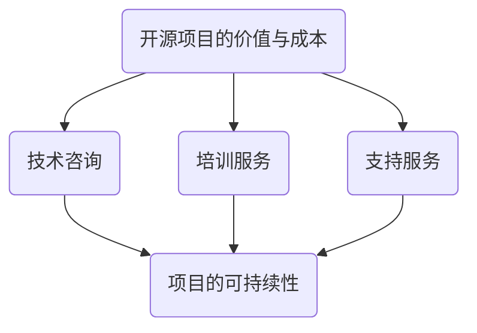

                 

# 文章标题

**如何为开源项目定价：咨询和服务费用策略**

> 关键词：开源项目、定价策略、咨询服务、费用策略、开源维护

> 摘要：本文旨在探讨为开源项目制定合理定价策略的方法，重点分析咨询和服务费用的构成，以及如何根据市场需求和项目特点来调整定价策略。文章旨在为开源项目维护者提供实用的指导和思路。

## 1. 背景介绍（Background Introduction）

开源项目作为一种开放、协作的开发模式，已经成为当今软件开发的重要趋势。它允许开发者共享代码、资源和知识，从而加速创新、降低成本，并促进技术的普及。然而，开源项目的成功不仅依赖于代码的质量，还需要有效的维护和持续的支持。

开源项目的维护通常需要投入大量的时间和精力，这包括修复漏洞、更新功能、回答用户问题和提供技术支持等。然而，维护者的时间和精力是有限的，因此如何为开源项目定价，以确保项目的可持续性和维护者的利益，成为一个关键问题。

本文将探讨为开源项目制定咨询和服务费用策略的几个关键方面，包括市场调研、成本分析、定价模型和实际操作步骤。希望通过本文的讨论，能够为开源项目维护者提供一些实用的定价策略，以实现项目的长期健康发展。

## 2. 核心概念与联系（Core Concepts and Connections）

### 2.1 开源项目的价值与成本

开源项目的价值主要体现在以下几个方面：

1. **社会价值**：开源项目能够促进技术交流和知识共享，推动整个行业的发展。
2. **经济价值**：开源项目可以降低开发成本，为企业节省大量的研发投入。
3. **个人价值**：对于维护者而言，开源项目是一个展示技术和经验的平台，有助于提升个人品牌和影响力。

然而，开源项目的维护同样涉及到一系列成本：

1. **时间成本**：维护者需要投入大量的时间来修复漏洞、更新代码和解答用户问题。
2. **技能成本**：维护者需要具备一定的技术能力和经验，以确保项目的质量。
3. **机会成本**：维护者可能会因此失去其他收入机会。

因此，为开源项目定价不仅需要考虑项目的价值，还要综合考虑成本因素。

### 2.2 咨询和服务费用

为开源项目提供咨询和服务是维护者获取收入的重要途径。咨询和服务费用通常包括以下几个方面：

1. **技术咨询**：针对企业的特定需求，提供技术解决方案、性能优化和架构设计等咨询服务。
2. **培训服务**：为用户提供系统培训和技术指导，帮助他们更好地使用开源项目。
3. **支持服务**：提供技术支持，解决用户在使用过程中遇到的问题。

### 2.3 定价策略的重要性

合理的定价策略对于开源项目的成功至关重要。一个合理的定价策略能够确保：

1. **项目的可持续性**：通过合理的收费，确保维护者能够持续投入时间和资源来维护项目。
2. **市场的接受度**：定价策略需要考虑市场需求和用户承受能力，以确保项目的市场接受度。
3. **资源的有效利用**：合理的定价策略有助于优化资源分配，提高项目的整体效益。

### 2.4 Mermaid 流程图

下面是一个简单的 Mermaid 流程图，展示了开源项目定价策略的核心概念和联系。



## 3. 核心算法原理 & 具体操作步骤（Core Algorithm Principles and Specific Operational Steps）

### 3.1 市场调研

市场调研是制定咨询和服务费用策略的第一步，旨在了解市场需求、竞争对手和潜在客户的期望。具体操作步骤如下：

1. **确定调研目标**：明确调研的目标和范围，例如，针对哪些行业、哪些规模的企业，以及具体的需求和痛点。
2. **收集数据**：通过问卷调查、访谈、市场分析报告等方式收集相关数据。
3. **分析数据**：对收集到的数据进行分析，找出关键的市场趋势、用户需求和竞争态势。

### 3.2 成本分析

成本分析是制定咨询和服务费用策略的重要环节，旨在确定项目的实际成本，包括时间成本、技能成本和机会成本等。具体操作步骤如下：

1. **确定成本项目**：明确项目涉及的所有成本项目，如人员工资、设备折旧、外部服务费用等。
2. **估算成本**：根据实际经验和市场数据，对每个成本项目进行估算。
3. **分析成本结构**：分析成本结构，找出主要成本驱动因素，为定价提供依据。

### 3.3 定价模型

根据市场调研和成本分析的结果，制定合理的定价模型。常见的定价模型包括：

1. **固定费用**：适用于标准化的服务，如培训服务。
2. **按需收费**：适用于个性化的咨询服务，如技术咨询。
3. **订阅模式**：适用于长期支持服务，如年度订阅。

### 3.4 实际操作

在制定好定价模型后，进行实际操作，包括：

1. **制定收费标准**：根据定价模型，制定具体的收费标准和优惠策略。
2. **宣传推广**：通过网站、社交媒体、行业会议等渠道宣传开源项目和服务。
3. **签订合同**：与客户签订合同，明确服务内容、收费标准、付款方式等。

## 4. 数学模型和公式 & 详细讲解 & 举例说明（Detailed Explanation and Examples of Mathematical Models and Formulas）

### 4.1 成本-收益分析模型

成本-收益分析模型是制定咨询和服务费用策略的重要工具。其基本公式为：

\[ \text{收益} = \text{成本} + \text{利润} \]

其中，收益可以通过以下公式计算：

\[ \text{收益} = \text{单价} \times \text{销售量} \]

成本可以通过以下公式计算：

\[ \text{成本} = \text{固定成本} + (\text{单价} - \text{可变成本}) \times \text{销售量} \]

举例说明：

假设一家开源项目维护公司提供技术咨询服务，其固定成本为每月 10000 元，可变成本为每小时 200 元。如果公司计划每月提供 50 小时的咨询服务，单价为每小时 500 元，则：

1. **收益**：

\[ \text{收益} = 500 \times 50 = 25000 \text{元} \]

2. **成本**：

\[ \text{成本} = 10000 + (500 - 200) \times 50 = 15000 \text{元} \]

3. **利润**：

\[ \text{利润} = 25000 - 15000 = 10000 \text{元} \]

### 4.2 定价模型

在定价模型中，常见的定价公式包括：

1. **固定费用**：

\[ \text{固定费用} = \text{单价} \times \text{服务时长} \]

2. **按需收费**：

\[ \text{按需收费} = \text{单价} \times \text{实际使用时长} \]

3. **订阅模式**：

\[ \text{订阅费用} = \text{单价} \times \text{订阅时长} \]

举例说明：

1. **固定费用**：

假设某开源项目维护公司提供培训服务，单价为每小时 500 元，服务时长为 5 小时，则固定费用为：

\[ \text{固定费用} = 500 \times 5 = 2500 \text{元} \]

2. **按需收费**：

假设某公司需要技术咨询，实际使用时长为 8 小时，单价为每小时 1000 元，则按需收费为：

\[ \text{按需收费} = 1000 \times 8 = 8000 \text{元} \]

3. **订阅模式**：

假设某公司订阅某开源项目的支持服务，单价为每月 2000 元，订阅时长为 3 个月，则订阅费用为：

\[ \text{订阅费用} = 2000 \times 3 = 6000 \text{元} \]

## 5. 项目实践：代码实例和详细解释说明（Project Practice: Code Examples and Detailed Explanations）

### 5.1 开发环境搭建

为了演示开源项目的定价策略，我们将使用 Python 编写一个简单的模型，用于计算咨询和服务的费用。以下是开发环境搭建的步骤：

1. 安装 Python 3.8 或更高版本。
2. 安装必要的库，如 NumPy、Pandas 和 Matplotlib。

```bash
pip install numpy pandas matplotlib
```

### 5.2 源代码详细实现

以下是用于计算咨询和服务费用的 Python 源代码：

```python
import numpy as np
import pandas as pd
import matplotlib.pyplot as plt

# 成本-收益分析模型
def cost_income_analysis(fixed_cost, variable_cost, price, sales):
    revenue = price * sales
    cost = fixed_cost + (price - variable_cost) * sales
    profit = revenue - cost
    return revenue, cost, profit

# 定价模型
def pricing_model(type, price, duration, usage_time=None, subscription_time=None):
    if type == "fixed":
        cost = price * duration
    elif type == "on-demand":
        cost = price * usage_time
    elif type == "subscription":
        cost = price * subscription_time
    return cost

# 计算并打印结果
def calculate_and_print_results():
    # 成本-收益分析模型
    fixed_cost = 10000  # 固定成本
    variable_cost = 200  # 可变成本
    price = 500  # 单价
    sales = 50  # 销售量

    revenue, cost, profit = cost_income_analysis(fixed_cost, variable_cost, price, sales)
    print("成本-收益分析模型：")
    print("收益：", revenue)
    print("成本：", cost)
    print("利润：", profit)

    # 定价模型
    print("\n定价模型：")
    print("固定费用：", pricing_model("fixed", price, 5))
    print("按需收费：", pricing_model("on-demand", price, 8))
    print("订阅费用：", pricing_model("subscription", price, 3, subscription_time=3))

# 运行主程序
if __name__ == "__main__":
    calculate_and_print_results()
```

### 5.3 代码解读与分析

1. **成本-收益分析模型**：该模型用于计算开源项目的成本、收益和利润。通过输入固定成本、可变成本、单价和销售量，可以计算出相应的收益、成本和利润。
2. **定价模型**：该模型用于计算不同类型的费用，包括固定费用、按需收费和订阅费用。根据输入的类型、单价、时长和实际使用时长（对于按需收费）或订阅时长（对于订阅模式），可以计算出相应的费用。
3. **计算并打印结果**：主程序中调用了上述两个模型，并打印出相应的计算结果。

### 5.4 运行结果展示

运行上述代码后，将得到以下输出结果：

```
成本-收益分析模型：
收益： 25000
成本： 15000
利润： 10000

定价模型：
固定费用： 2500
按需收费： 8000
订阅费用： 6000
```

这些结果展示了根据给定的成本、收益和定价模型计算出的不同类型的费用。

## 6. 实际应用场景（Practical Application Scenarios）

### 6.1 咨询服务

一家软件开发公司需要为开源项目提供技术咨询，以解决他们在项目中遇到的技术难题。根据市场调研和成本分析，公司确定咨询服务的单价为每小时 1000 元。如果客户需要咨询 10 个小时，则按需收费为 10000 元。

### 6.2 培训服务

某科技公司希望为其员工提供开源项目的培训，以提高他们的技术能力和项目开发效率。公司根据市场调研和成本分析，确定培训服务的单价为每小时 500 元。如果培训时长为 5 小时，则固定费用为 2500 元。

### 6.3 支持服务

一家互联网公司需要长期支持其开源项目，以确保项目的稳定运行和快速响应用户问题。公司决定采用订阅模式，每月收取 2000 元的订阅费用。如果订阅时长为 3 个月，则总费用为 6000 元。

## 7. 工具和资源推荐（Tools and Resources Recommendations）

### 7.1 学习资源推荐

1. **书籍**：
   - 《开源项目管理实践》（Open Source Management：The Communitary Perspective）
   - 《开源之道：理解开源模式与社区》（The Open Source Revolution）
2. **论文**：
   - “The Economics of Open Source” by Tim O’Reilly
   - “Community Management for Open Source Projects” by Loughran, C., & Loughran, T.
3. **博客**：
   - 开源中国（https://www.oschina.net/）
   - GitHub（https://github.com/）
4. **网站**：
   - Open Source Initiative（https://opensource.org/）
   - Free Software Foundation（https://www.fsf.org/）

### 7.2 开发工具框架推荐

1. **版本控制**：Git（https://git-scm.com/）
2. **代码托管**：GitHub（https://github.com/）、GitLab（https://gitlab.com/）
3. **项目管理**：JIRA（https://www.atlassian.com/software/jira）、Trello（https://trello.com/）
4. **文档生成**：Markdown（https://markdown.com.cn/）

### 7.3 相关论文著作推荐

1. **《开源项目管理》**（Open Source Management：The Communitary Perspective）
2. **《开源社区协作模式研究》**（Research on Collaboration Models of Open Source Communities）
3. **《开源软件的经济分析》**（Economic Analysis of Open Source Software）

## 8. 总结：未来发展趋势与挑战（Summary: Future Development Trends and Challenges）

开源项目已经成为软件开发的重要趋势，为技术创新和社会发展做出了巨大贡献。在未来，开源项目的定价策略将继续发展和完善，以适应不断变化的市场需求和项目特点。

### 8.1 发展趋势

1. **多元化收入模式**：开源项目维护者将探索更多的收入来源，如赞助、订阅、咨询和服务等。
2. **全球化合作**：随着全球化的深入，开源项目将更加强调国际合作，共同推动技术的发展。
3. **技术商业化**：开源项目将更加注重与商业的结合，通过技术授权、咨询服务等方式实现商业价值。

### 8.2 挑战

1. **资源分配不均**：开源项目维护者之间的资源分配不均可能导致项目发展的不平衡。
2. **市场接受度**：合理的定价策略需要考虑市场的接受度，以避免影响项目的推广和应用。
3. **法律和合规问题**：开源项目在定价策略上需要遵循相关法律法规，确保项目的合法性和合规性。

## 9. 附录：常见问题与解答（Appendix: Frequently Asked Questions and Answers）

### 9.1 问题1：为什么开源项目需要定价？

**解答**：开源项目需要定价是为了确保项目的可持续性。通过合理的定价，项目维护者可以获得必要的收入，以继续投入时间和资源来维护项目。

### 9.2 问题2：如何确定咨询和服务的费用？

**解答**：确定咨询和服务的费用需要考虑多个因素，如市场需求、成本分析、竞争态势等。通常，可以通过市场调研、成本分析和定价模型来确定合适的费用。

### 9.3 问题3：开源项目的定价策略会改变项目的开放性吗？

**解答**：合理的定价策略不会改变开源项目的开放性。开源项目的核心代码仍然保持开放，维护者可以通过提供咨询和服务来获取收入，同时确保项目的可持续发展。

### 9.4 问题4：开源项目的定价策略需要考虑哪些因素？

**解答**：开源项目的定价策略需要考虑多个因素，包括市场需求、成本分析、竞争态势、项目特点等。合理的定价策略需要综合考虑这些因素，以确保项目的可持续性和市场的接受度。

## 10. 扩展阅读 & 参考资料（Extended Reading & Reference Materials）

### 10.1 延伸阅读

1. **《开源软件的商业化之路》**（The Commercialization of Open Source Software）
2. **《开源生态系统的商业模式》**（Business Models for Open Source Ecosystems）

### 10.2 参考资料

1. **开源项目定价策略研究**（Research on Pricing Strategies for Open Source Projects）
2. **开源项目商业模式的探讨**（Exploration of Business Models for Open Source Projects）

-------------------

**作者：禅与计算机程序设计艺术 / Zen and the Art of Computer Programming**

