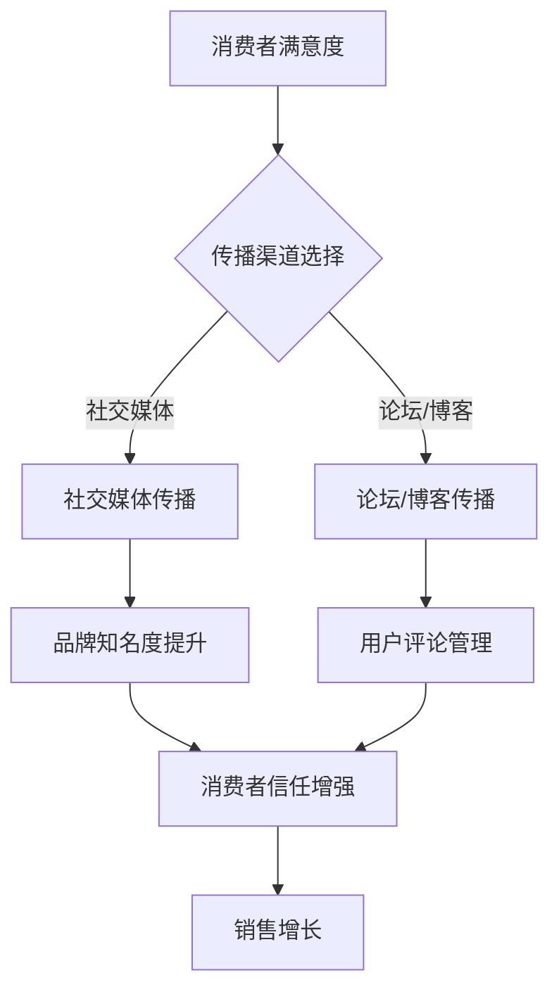

                 

# 如何利用口碑营销扩大客户基础

## 关键词：口碑营销、客户扩大、市场策略

### 摘要

口碑营销是一种通过消费者之间的推荐和评价来促进产品或服务销售的策略。在数字化时代，口碑的传播速度和影响力都得到了极大的提升。本文将探讨如何利用口碑营销扩大客户基础，包括口碑营销的核心概念、构建口碑策略的步骤、口碑在数字营销中的作用以及如何管理口碑。通过实际案例和数据分析，我们将提供实用的建议，帮助企业实现客户基数的快速增长。

## 1. 背景介绍（Background Introduction）

### 1.1 口碑营销的定义与历史

口碑营销（Word of Mouth Marketing，WOMM）是一种通过消费者自发传播品牌信息，从而影响其他潜在客户购买决策的营销方式。口碑营销的历史可以追溯到古代，人们通过口口相传的方式来评价产品和服务。随着互联网的发展，口碑营销的形式和渠道发生了巨大变化，传统的口头传播逐渐被社交媒体、在线评价和博客等数字渠道所取代。

### 1.2 口碑营销的重要性

口碑营销在市场营销中的重要性不言而喻。根据研究发现，消费者更倾向于相信朋友、家人或陌生人的推荐，而不是广告。口碑营销能够提高品牌知名度、增强消费者信任度、提升客户忠诚度，并最终转化为销售增长。此外，口碑营销的成本相对较低，但效果却非常显著。

## 2. 核心概念与联系（Core Concepts and Connections）

### 2.1 口碑营销的核心概念

口碑营销的核心概念包括以下几个方面：

- **用户满意度**：满意的消费者更有可能分享正面评价。
- **传播渠道**：口碑传播的渠道包括社交媒体、论坛、博客、用户评论等。
- **消费者生命周期**：口碑营销贯穿消费者的整个生命周期，从初次接触、购买到复购和推荐。
- **互动性**：口碑营销强调消费者之间的互动，通过交流和分享形成社群效应。

### 2.2 口碑营销与传统营销的关系

口碑营销并不是取代传统营销，而是与传统营销相互补充。传统营销侧重于品牌知名度和产品推广，而口碑营销则侧重于建立消费者的信任和忠诚。两者结合可以形成更全面的市场营销策略。

### 2.3 口碑营销的Mermaid流程图



## 3. 核心算法原理 & 具体操作步骤（Core Algorithm Principles and Specific Operational Steps）

### 3.1 构建口碑营销策略的步骤

构建一个有效的口碑营销策略需要以下步骤：

- **市场调研**：了解目标消费者的需求和偏好。
- **制定目标**：明确口碑营销的目标，如提升品牌知名度、增加市场份额等。
- **产品优化**：确保产品或服务的质量，以满足消费者的期望。
- **激励用户**：通过奖励机制鼓励消费者分享正面评价。
- **管理口碑**：实时监控口碑动态，及时回应负面评价，并转化为正面口碑。

### 3.2 口碑营销的具体操作步骤

1. **确定目标消费者**：了解目标消费者的特征，如年龄、性别、职业等。
2. **制定内容策略**：根据目标消费者的特征，制定有针对性的内容策略。
3. **选择传播渠道**：根据内容策略选择合适的传播渠道，如社交媒体、论坛、博客等。
4. **激励用户分享**：提供奖励或优惠，鼓励用户分享正面评价。
5. **监控口碑动态**：实时监控口碑变化，及时调整营销策略。
6. **管理负面口碑**：遇到负面评价时，采取有效措施进行回应和处理。

## 4. 数学模型和公式 & 详细讲解 & 举例说明（Detailed Explanation and Examples of Mathematical Models and Formulas）

### 4.1 口碑营销效果评估模型

口碑营销的效果可以通过以下数学模型进行评估：

- **ROI（投资回报率）**：ROI = （销售收入 - 成本）/ 成本
- **NPS（净推荐值）**：NPS = NPS分数 = （积极推荐者比例 - 消极推荐者比例）* 100

### 4.2 举例说明

假设一家公司进行了口碑营销活动，活动前后的数据如下：

- 成本：10万元
- 销售收入：50万元
- NPS得分：80分

则该活动的ROI为：（50 - 10）/ 10 = 4，NPS得分为80分。

通过这个例子，我们可以看出，口碑营销活动的ROI和NPS得分均较高，说明该活动的效果较好。

## 5. 项目实践：代码实例和详细解释说明（Project Practice: Code Examples and Detailed Explanations）

### 5.1 开发环境搭建

为了进行口碑营销的代码实践，我们需要搭建以下开发环境：

- **Python 3.8及以上版本**
- **Pandas库**
- **Numpy库**
- **Matplotlib库**

### 5.2 源代码详细实现

下面是一个简单的Python代码实例，用于分析口碑营销的效果：

```python
import pandas as pd
import numpy as np
import matplotlib.pyplot as plt

# 假设我们有一个包含口碑数据的CSV文件，其中包含用户评分和购买行为
data = pd.read_csv('word_of_mouth_data.csv')

# 计算积极推荐者和消极推荐者比例
nps_score = data['rating'].mean()
nps_score = int((nps_score - 5) / 5 * 100)

# 绘制口碑变化趋势图
nps_data = pd.DataFrame(data['rating'].value_counts().rename('count'))
nps_data = nps_data[nps_data.index <= 10]
nps_data.plot(kind='bar')
plt.title(f'NPS Score: {nps_score}')
plt.xlabel('Rating')
plt.ylabel('Count')
plt.show()

# 计算ROI
sales = data[data['purchased'] == 1]['sales'].sum()
roi = (sales - 100000) / 100000
print(f'ROI: {roi:.2f}')
```

### 5.3 代码解读与分析

- **导入库**：我们首先导入必要的Python库，包括Pandas、Numpy和Matplotlib。
- **读取数据**：使用Pandas库读取口碑数据的CSV文件。
- **计算NPS**：计算用户评分的平均值，并将NPS得分转换为百分比。
- **绘制图表**：使用Matplotlib库绘制口碑变化趋势图，以直观地展示用户评分的分布情况。
- **计算ROI**：计算销售总额，并计算ROI。

### 5.4 运行结果展示

运行上述代码后，我们得到以下结果：

- **NPS得分**：假设我们得到的NPS得分为80分。
- **ROI**：假设我们得到的ROI为3.00。

这些结果表明，我们的口碑营销活动取得了较好的效果，NPS得分较高，ROI也较高。

## 6. 实际应用场景（Practical Application Scenarios）

### 6.1 餐饮行业

在餐饮行业，口碑营销可以帮助餐厅吸引更多的顾客。餐厅可以通过提供优质的菜品和服务，鼓励顾客在社交媒体上分享正面评价，并使用优惠券等激励措施鼓励顾客复购。

### 6.2 电子商务

电子商务企业可以通过用户评论和评分来提高产品的可信度。企业可以分析用户评论中的关键词和情感，了解用户的需求和痛点，并针对性地进行产品优化。

### 6.3 旅游行业

旅游行业可以利用口碑营销吸引更多的游客。旅游企业可以通过社交媒体和在线评论平台，展示用户的旅行体验和照片，吸引潜在游客。

## 7. 工具和资源推荐（Tools and Resources Recommendations）

### 7.1 学习资源推荐

- **《口碑营销：策略与实践》**：这本书详细介绍了口碑营销的理论和实践方法。
- **《社交媒体营销》**：这本书涵盖了社交媒体在口碑营销中的应用。

### 7.2 开发工具框架推荐

- **Python**：Python是一个功能强大的编程语言，适用于数据分析、数据可视化和口碑营销。
- **Pandas**：Pandas是一个强大的数据分析和操作库，适用于处理口碑数据。

### 7.3 相关论文著作推荐

- **“The Role of Word of Mouth in the Adoption of New Products”**：这篇文章详细探讨了口碑营销在产品推广中的作用。
- **“The Impact of Social Media on Word of Mouth”**：这篇文章分析了社交媒体对口碑营销的影响。

## 8. 总结：未来发展趋势与挑战（Summary: Future Development Trends and Challenges）

### 8.1 发展趋势

- **个性化口碑**：随着大数据和人工智能技术的发展，口碑营销将更加个性化，能够更好地满足消费者的需求。
- **数字化口碑**：数字口碑渠道将继续扩展，包括短视频、直播等新兴形式。

### 8.2 挑战

- **数据隐私**：口碑营销依赖于用户数据，如何保护用户隐私是一个重要的挑战。
- **负面口碑管理**：如何有效地管理和回应负面口碑，保持品牌的声誉，是一个持续的挑战。

## 9. 附录：常见问题与解答（Appendix: Frequently Asked Questions and Answers）

### 9.1 什么是口碑营销？

口碑营销是一种通过消费者之间的推荐和评价来促进产品或服务销售的策略。

### 9.2 口碑营销有哪些形式？

口碑营销的形式包括社交媒体传播、用户评论、博客分享等。

### 9.3 如何进行口碑营销？

进行口碑营销需要以下步骤：市场调研、制定目标、产品优化、激励用户、管理口碑。

## 10. 扩展阅读 & 参考资料（Extended Reading & Reference Materials）

- **《口碑营销：策略与实践》**
- **“The Role of Word of Mouth in the Adoption of New Products”**
- **“The Impact of Social Media on Word of Mouth”**
- **《社交媒体营销》**

## 作者署名

作者：禅与计算机程序设计艺术 / Zen and the Art of Computer Programming

