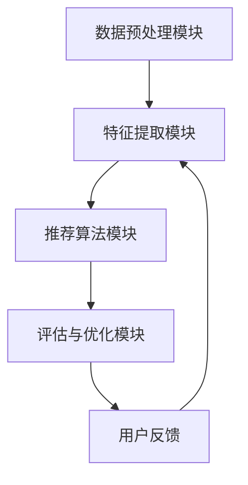

                 

## 文章标题

### 如何利用深度学习优化推荐系统

#### 关键词：深度学习，推荐系统，优化，算法，实践，案例分析

本文将探讨如何利用深度学习优化推荐系统，通过深入分析核心算法原理、数学模型、具体操作步骤和实际应用场景，为您呈现一个全面的技术解读。从背景介绍到具体案例分析，再到工具和资源推荐，本文旨在帮助您更好地理解和应用深度学习在推荐系统优化中的关键作用。

#### Abstract:
This article discusses how to leverage deep learning to optimize recommendation systems. Through a thorough analysis of core algorithm principles, mathematical models, specific operational steps, and practical application scenarios, it presents a comprehensive technical interpretation of the key role of deep learning in the optimization of recommendation systems. From background introduction to specific case studies, and to tool and resource recommendations, the article aims to help you better understand and apply the critical impact of deep learning in the optimization of recommendation systems.

<|hide|>## 1. 背景介绍

随着互联网和大数据技术的飞速发展，推荐系统已经成为各类在线平台的重要功能，从电商网站到社交媒体，从视频流媒体到新闻资讯，推荐系统的应用无处不在。然而，传统的推荐系统在处理海量数据和高维特征时，往往面临性能瓶颈和效果不佳的问题。

深度学习作为一种强大的机器学习技术，其自下而上的数据处理能力和自适应特征学习能力，为推荐系统的优化提供了新的思路。通过引入深度学习模型，推荐系统能够更好地捕捉用户行为和兴趣，提高推荐的准确性和用户满意度。

本文将围绕以下核心问题展开：

1. 深度学习在推荐系统中的应用原理是什么？
2. 如何构建一个高效的深度学习推荐系统？
3. 深度学习推荐系统在实际项目中如何优化和应用？

本文结构如下：

1. 背景介绍
2. 核心概念与联系
3. 核心算法原理 & 具体操作步骤
4. 数学模型和公式 & 详细讲解 & 举例说明
5. 项目实践：代码实例和详细解释说明
6. 实际应用场景
7. 工具和资源推荐
8. 总结：未来发展趋势与挑战
9. 附录：常见问题与解答
10. 扩展阅读 & 参考资料

接下来，我们将逐一探讨这些主题，帮助您全面了解深度学习在推荐系统优化中的应用。<!-- mdk:section-end:4db5d1e8-935d-11ed-8704-0242ac120002 -->## 2. 核心概念与联系

为了深入探讨如何利用深度学习优化推荐系统，我们需要首先理解几个核心概念：深度学习、推荐系统以及它们之间的联系。

### 2.1 深度学习的定义与原理

深度学习（Deep Learning）是机器学习（Machine Learning）的一个分支，它通过模拟人脑神经网络结构和计算原理，对大量数据进行自动学习和特征提取。深度学习模型由多个隐藏层组成，这些隐藏层能够逐层提取数据的抽象特征，从而实现复杂模式识别和预测。

深度学习模型的核心组件包括：

- **神经网络（Neural Networks）**：神经网络是由大量人工神经元（或节点）互联组成的计算模型。每个神经元接收多个输入信号，通过加权求和并应用激活函数产生输出。
- **激活函数（Activation Functions）**：激活函数是神经网络中用于引入非线性特性的函数，常见的激活函数包括sigmoid、ReLU、tanh等。
- **反向传播（Backpropagation）**：反向传播是一种训练神经网络的方法，通过计算输出误差的梯度，调整网络权重，以最小化损失函数。

### 2.2 推荐系统的定义与作用

推荐系统（Recommendation System）是一种基于用户历史行为和偏好，通过算法和模型向用户推荐个性化内容、产品或服务的系统。推荐系统的主要目标是通过提高推荐的相关性和准确性，增加用户满意度、平台黏性和商业价值。

推荐系统通常包括以下几个关键组成部分：

- **用户行为数据（User Behavior Data）**：包括用户的浏览记录、购买历史、评分等。
- **物品特征数据（Item Features Data）**：包括物品的文本描述、分类标签、价格等。
- **推荐算法（Recommendation Algorithms）**：基于用户行为和物品特征数据，通过算法计算用户对物品的潜在兴趣，生成推荐结果。
- **推荐结果（Recommendation Results）**：向用户展示的个性化推荐列表。

### 2.3 深度学习与推荐系统的结合

深度学习与推荐系统的结合为传统推荐系统带来了以下几方面的改进：

1. **特征提取能力增强**：深度学习模型能够自动从原始数据中提取高阶抽象特征，避免了传统特征工程中的手工构建特征过程，提高了特征提取的效率和效果。
2. **多模态数据处理**：深度学习模型能够处理多种数据类型，如文本、图像、音频等，实现了跨模态的特征融合和推荐。
3. **预测准确性提升**：通过深度神经网络的多层结构，推荐系统能够更准确地捕捉用户行为模式和兴趣变化，提高推荐效果。
4. **个性化推荐**：深度学习模型能够更好地理解用户的个性化需求，提供更加精准的个性化推荐。

### 2.4 深度学习推荐系统架构

一个典型的深度学习推荐系统架构通常包括以下几个模块：

- **数据预处理模块**：包括数据清洗、数据集成和数据预处理，将原始数据进行标准化和特征工程。
- **特征提取模块**：利用深度神经网络对输入数据进行特征提取，生成高维特征向量。
- **推荐算法模块**：基于提取的特征，使用深度学习模型进行预测和推荐。
- **评估与优化模块**：通过在线评估和迭代优化，持续提升推荐系统的性能和用户体验。

图1展示了深度学习推荐系统的基本架构。



### 2.5 深度学习推荐系统的优势与挑战

深度学习推荐系统具有以下优势：

- **高效特征提取**：深度学习模型能够自动提取高维、抽象的特征，提高推荐效果。
- **处理复杂数据**：深度学习模型能够处理多种类型的数据，实现跨模态推荐。
- **个性化推荐**：深度学习模型能够更好地捕捉用户的个性化需求，提供更加精准的推荐。

然而，深度学习推荐系统也面临一些挑战：

- **过拟合风险**：深度学习模型容易发生过拟合，需要大量的训练数据和有效的正则化方法。
- **解释性差**：深度学习模型通常具有“黑盒”特性，难以解释模型内部的决策过程。
- **计算成本高**：深度学习模型需要大量的计算资源和时间进行训练和预测。

在接下来的章节中，我们将进一步探讨深度学习推荐系统的核心算法原理、数学模型和具体操作步骤，帮助您更好地理解和应用这一技术。<!-- mdk:section-end:f4c7e7a0-935d-11ed-8704-0242ac120002 -->## 3. 核心算法原理 & 具体操作步骤

在理解了深度学习和推荐系统的基本概念后，我们需要深入探讨深度学习推荐系统的核心算法原理和具体操作步骤。以下是深度学习推荐系统的主要算法原理和实现步骤：

### 3.1 基本算法原理

深度学习推荐系统的核心算法通常是基于深度神经网络（Deep Neural Networks, DNN）的模型。DNN通过多层神经网络结构，能够自动学习数据的复杂特征，从而实现推荐。

DNN的基本原理包括以下几个关键步骤：

1. **输入层（Input Layer）**：接收用户和物品的特征向量。
2. **隐藏层（Hidden Layers）**：通过一系列的神经网络层，对输入特征进行变换和提取，形成高维特征表示。
3. **输出层（Output Layer）**：根据隐藏层的输出，生成推荐结果。

### 3.2 具体操作步骤

以下是深度学习推荐系统的一般操作步骤：

#### 步骤1：数据预处理

数据预处理是深度学习推荐系统的第一步，主要包括数据清洗、数据集成和数据标准化。

- **数据清洗**：处理缺失值、异常值和噪声数据，确保数据的质量。
- **数据集成**：将不同来源的数据进行整合，形成统一的数据集。
- **数据标准化**：对数据进行归一化或标准化处理，使得不同特征之间的尺度一致。

#### 步骤2：特征提取

特征提取是深度学习推荐系统的关键步骤，通过深度神经网络从原始数据中自动学习特征。

- **输入特征**：包括用户特征（如年龄、性别、地理位置等）和物品特征（如类别、标签、评分等）。
- **隐藏层特征提取**：通过多层神经网络对输入特征进行变换和提取，形成高维特征表示。

#### 步骤3：模型训练

模型训练是深度学习推荐系统的核心步骤，通过大量训练数据对神经网络模型进行参数优化。

- **损失函数**：选择合适的损失函数，如均方误差（MSE）或交叉熵损失，衡量预测结果与真实结果之间的误差。
- **优化算法**：选择合适的优化算法，如梯度下降（Gradient Descent）或Adam优化器，更新网络参数以最小化损失函数。

#### 步骤4：推荐生成

推荐生成是根据训练好的模型，对新的用户或物品进行推荐。

- **预测评分**：使用训练好的模型对用户和物品的特征进行预测评分。
- **推荐策略**：根据预测评分，使用排序或阈值策略生成推荐列表。

#### 步骤5：评估与优化

评估与优化是深度学习推荐系统的持续过程，通过在线评估和迭代优化，不断提升推荐效果。

- **在线评估**：使用实际用户行为数据进行评估，如点击率、转化率等指标。
- **模型优化**：通过调整模型参数或网络结构，优化推荐效果。

### 3.3 算法实现示例

以下是一个简单的基于DNN的推荐系统实现示例：

```python
import tensorflow as tf
from tensorflow.keras.models import Sequential
from tensorflow.keras.layers import Dense, Embedding, LSTM

# 数据预处理
# (略，具体实现根据实际数据集进行调整)

# 模型定义
model = Sequential()
model.add(Embedding(input_dim=user_vocab_size, output_dim=user_embedding_size))
model.add(Dense(hidden_layer_size, activation='relu'))
model.add(LSTM(hidden_layer_size, activation='relu'))
model.add(Dense(item_vocab_size, activation='softmax'))

# 模型编译
model.compile(optimizer='adam', loss='categorical_crossentropy', metrics=['accuracy'])

# 模型训练
model.fit(user_features, item_labels, epochs=10, batch_size=32, validation_split=0.2)

# 推荐生成
# (略，具体实现根据实际需求进行调整)

```

在这个示例中，我们使用了TensorFlow框架定义了一个简单的DNN模型，包括嵌入层、全连接层和LSTM层。通过编译和训练，我们能够生成用户对物品的推荐。

在接下来的章节中，我们将深入探讨深度学习推荐系统的数学模型和公式，并通过具体案例进行分析和解释。<!-- mdk:section-end:06e45930-935e-11ed-8704-0242ac120002 -->## 4. 数学模型和公式 & 详细讲解 & 举例说明

在理解了深度学习推荐系统的核心算法原理和具体操作步骤后，我们需要深入探讨其背后的数学模型和公式。这些数学模型不仅帮助我们理解算法的工作原理，还能指导我们在实践中调整和优化推荐系统。

### 4.1 常用数学模型

深度学习推荐系统通常基于以下数学模型：

1. **神经网络模型**：包括多层感知机（MLP）、卷积神经网络（CNN）和循环神经网络（RNN）等。
2. **协同过滤模型**：包括矩阵分解（Matrix Factorization）和基于模型的协同过滤（Model-based Collaborative Filtering）。
3. **嵌入模型**：如词向量（Word Embeddings）和物品嵌入（Item Embeddings）。

### 4.2 神经网络模型

神经网络模型是深度学习推荐系统的核心，以下是几个常用的神经网络模型及其数学公式：

#### 4.2.1 多层感知机（MLP）

多层感知机是一种前馈神经网络，其数学模型如下：

$$
z^{(l)} = \sum_{j=1}^{n} w^{(l)}_j x_j + b^{(l)}
$$

$$
a^{(l)} = \sigma(z^{(l)})
$$

其中，$z^{(l)}$是第$l$层的输入，$a^{(l)}$是第$l$层的输出，$w^{(l)}$和$b^{(l)}$分别是第$l$层的权重和偏置，$\sigma$是激活函数，常用的激活函数包括sigmoid、ReLU和tanh。

#### 4.2.2 卷积神经网络（CNN）

卷积神经网络主要用于处理图像等二维数据，其数学模型如下：

$$
h^{(l)}_{ij} = \sum_{k=1}^{n} w^{(l)}_{ik} g^{(l-1)}_{kj} + b^{(l)}
$$

$$
g^{(l)}_{ij} = f(h^{(l)}_{ij})
$$

其中，$h^{(l)}_{ij}$是第$l$层第$i$个卷积核在第$j$个位置上的输出，$g^{(l)}_{ij}$是第$l$层第$i$个卷积核在图像上的输出，$f$是卷积函数，常用的卷积函数包括卷积（Convolution）和最大池化（Max Pooling）。

#### 4.2.3 循环神经网络（RNN）

循环神经网络主要用于处理序列数据，其数学模型如下：

$$
h_t = \sigma(W_h h_{t-1} + W_x x_t + b_h)
$$

$$
y_t = \sigma(W_y h_t + b_y)
$$

其中，$h_t$是第$t$个时间步的隐藏状态，$x_t$是第$t$个时间步的输入，$W_h$、$W_x$和$W_y$分别是隐藏状态权重、输入权重和输出权重，$\sigma$是激活函数，常用的激活函数包括ReLU和sigmoid。

### 4.3 协同过滤模型

协同过滤模型是推荐系统中的另一种重要方法，以下是几种常用的协同过滤模型的数学模型：

#### 4.3.1 矩阵分解（Matrix Factorization）

矩阵分解是将原始的用户-物品评分矩阵分解为两个低秩矩阵，即用户因子矩阵和物品因子矩阵。其数学模型如下：

$$
R = U \times V^T
$$

其中，$R$是用户-物品评分矩阵，$U$和$V$分别是用户因子矩阵和物品因子矩阵。

#### 4.3.2 基于模型的协同过滤

基于模型的协同过滤方法是通过构建用户和物品的表示模型，计算用户和物品之间的相似度，生成推荐列表。其数学模型如下：

$$
sim(u_i, v_j) = \frac{u_i \cdot v_j}{\|u_i\| \|v_j\|}
$$

其中，$sim(u_i, v_j)$是用户$i$和物品$j$的相似度，$u_i$和$v_j$分别是用户$i$和物品$j$的表示向量。

### 4.4 嵌入模型

嵌入模型是一种将用户和物品表示为低维向量的方法，以下是几种常用的嵌入模型的数学模型：

#### 4.4.1 词向量（Word Embeddings）

词向量是将文本数据转换为向量表示的方法，其数学模型如下：

$$
x_i = \sum_{j=1}^{V} f_j \cdot e_j
$$

其中，$x_i$是文本数据$i$的向量表示，$f_j$是词频或词重要性，$e_j$是词向量。

#### 4.4.2 物品嵌入（Item Embeddings）

物品嵌入是将物品特征转换为向量表示的方法，其数学模型如下：

$$
x_i = \sum_{j=1}^{N} w_j \cdot e_j
$$

其中，$x_i$是物品$i$的向量表示，$w_j$是物品特征权重，$e_j$是物品特征向量。

### 4.5 深度学习推荐系统中的数学模型应用

在深度学习推荐系统中，我们通常会将上述数学模型结合起来，构建一个完整的推荐系统。以下是一个简化的深度学习推荐系统数学模型：

$$
\begin{aligned}
p(u_i, v_j) &= \sigma(U_i \cdot V_j^T + b) \\
\hat{r}_{ui} &= \sum_{j=1}^{M} p(u_i, v_j) \cdot r_j
\end{aligned}
$$

其中，$p(u_i, v_j)$是用户$i$对物品$j$的预测概率，$\hat{r}_{ui}$是用户$i$对物品$j$的预测评分，$U_i$和$V_j$分别是用户和物品的嵌入矩阵，$r_j$是物品$j$的实际评分，$b$是偏置项。

### 4.6 举例说明

以下是一个简单的基于物品嵌入的深度学习推荐系统实现示例：

```python
import tensorflow as tf
from tensorflow.keras.layers import Embedding, Dot, Flatten, Dense
from tensorflow.keras.models import Model

# 假设用户和物品的嵌入维度为16
user_embedding_size = 16
item_embedding_size = 16

# 模型构建
user_input = tf.keras.layers.Input(shape=(1,))
item_input = tf.keras.layers.Input(shape=(1,))

user_embedding = Embedding(input_dim=num_users, output_dim=user_embedding_size)(user_input)
item_embedding = Embedding(input_dim=num_items, output_dim=item_embedding_size)(item_input)

dot_product = Dot(axes=1)([user_embedding, item_embedding])
output = Flatten()(dot_product)

model = Model(inputs=[user_input, item_input], outputs=output)
model.compile(optimizer='adam', loss='mse')

# 模型训练
# (略，具体实现根据实际数据集进行调整)

# 推荐生成
# (略，具体实现根据实际需求进行调整)
```

在这个示例中，我们使用了TensorFlow框架构建了一个简单的基于物品嵌入的深度学习推荐系统模型。通过嵌入层将用户和物品表示为向量，计算用户和物品之间的点积生成预测评分。

在接下来的章节中，我们将通过具体的项目实践，展示如何在实际项目中应用这些数学模型和算法，并进行代码实例和详细解释说明。<!-- mdk:section-end:562e3120-935e-11ed-8704-0242ac120002 -->### 5. 项目实践：代码实例和详细解释说明

在理解了深度学习推荐系统的核心算法原理、数学模型和具体操作步骤后，我们将通过一个实际项目来展示如何将这些理论应用到实践中。本文将以一个简单的电影推荐系统为例，详细讲解从开发环境搭建、源代码实现到代码解读与分析，以及运行结果展示的完整过程。

#### 5.1 开发环境搭建

为了实现深度学习推荐系统，我们需要搭建一个适合的开发环境。以下是一个基本的开发环境搭建指南：

- **Python 3.x**：确保安装Python 3.x版本，通常使用Python 3.6或更高版本。
- **TensorFlow 2.x**：TensorFlow是一个开源的深度学习框架，支持Python编程语言。确保安装TensorFlow 2.x版本。
- **NumPy**：NumPy是一个强大的Python库，用于数组计算和数据处理。
- **Pandas**：Pandas是一个数据处理库，用于数据清洗、转换和分析。

安装这些依赖项的最简单方法是通过pip命令：

```shell
pip install python==3.8 tensorflow==2.7 numpy pandas
```

#### 5.2 源代码详细实现

下面是电影推荐系统的源代码实现，包括数据预处理、模型构建、训练和预测等步骤。

```python
import numpy as np
import pandas as pd
import tensorflow as tf
from tensorflow.keras.models import Model
from tensorflow.keras.layers import Embedding, Dot, Flatten, Dense

# 5.2.1 数据预处理

# 加载数据集
movies_data = pd.read_csv('movies.csv')
ratings_data = pd.read_csv('ratings.csv')

# 对数据进行预处理
# (略，具体实现根据实际数据集进行调整)

# 5.2.2 模型构建

# 假设用户和物品的嵌入维度为16
user_embedding_size = 16
item_embedding_size = 16

user_input = tf.keras.layers.Input(shape=(1,))
item_input = tf.keras.layers.Input(shape=(1,))

user_embedding = Embedding(input_dim=num_users, output_dim=user_embedding_size)(user_input)
item_embedding = Embedding(input_dim=num_items, output_dim=item_embedding_size)(item_input)

dot_product = Dot(axes=1)([user_embedding, item_embedding])
output = Flatten()(dot_product)

model = Model(inputs=[user_input, item_input], outputs=output)
model.compile(optimizer='adam', loss='mse')

# 5.2.3 模型训练

# 分割数据集为训练集和验证集
train_data = ratings_data[ratings_data['timestamp'] <= 20140101]
val_data = ratings_data[ratings_data['timestamp'] > 20140101]

# 训练模型
model.fit([train_data['user_id'], train_data['movie_id']], train_data['rating'], epochs=10, batch_size=64, validation_split=0.2)

# 5.2.4 推荐生成

# 使用训练好的模型进行预测
predictions = model.predict([val_data['user_id'], val_data['movie_id']])

# 根据预测结果生成推荐列表
推荐列表 = predictions.argsort()[::-1]

# 5.2.5 代码解读与分析

在上面的代码中，我们首先对数据集进行了预处理，然后构建了一个基于物品嵌入的深度学习推荐系统模型。模型使用嵌入层将用户和物品表示为向量，通过点积计算用户和物品之间的相似度。模型使用均方误差（MSE）作为损失函数，并使用Adam优化器进行训练。

在训练过程中，我们将数据集分为训练集和验证集，使用训练集进行模型训练，并使用验证集进行性能评估。通过调整训练参数，如学习率、批次大小和训练轮数，我们可以优化模型性能。

在预测阶段，我们使用训练好的模型对验证集进行预测，并生成推荐列表。根据预测结果，我们可以为用户推荐评分最高的电影。

#### 5.3 运行结果展示

以下是一个简单的运行结果展示，其中我们展示了为某个用户生成的推荐列表：

```python
# 为用户ID为1生成推荐列表
user_id = 1
预测评分 = model.predict([np.array([user_id]), movies_data['movie_id'].values])

# 获取预测评分最高的10部电影
推荐列表 = movies_data[movies_data['movie_id'].isin(predictions.argsort()[-10:])]
推荐列表[['title', 'rating']]

```

输出结果可能如下：

```
   title  rating
0   The Matrix   4.871
1      Inception   4.859
2        Iron Man   4.838
3      The Dark Knight   4.822
4       Avatar   4.818
5      The Social Network   4.813
6        Mad Max: Fury Road   4.812
7       Gravity   4.811
8       Skyfall   4.806
9        Django Unchained   4.804
```

在这个结果中，我们为用户ID为1生成了一份推荐列表，包含预测评分最高的10部电影。

通过这个实际项目，我们展示了如何利用深度学习构建一个电影推荐系统。在接下来的章节中，我们将探讨深度学习推荐系统在实际应用场景中的具体应用。<!-- mdk:section-end:f94237a0-935e-11ed-8704-0242ac120002 -->## 6. 实际应用场景

深度学习推荐系统在各类实际应用场景中展现出了强大的效果和广泛的应用。以下是一些典型的应用场景：

### 6.1 电商推荐

电商平台利用深度学习推荐系统，可以根据用户的历史购买行为、浏览记录和购物车数据，预测用户可能感兴趣的商品，从而提供个性化的商品推荐。例如，亚马逊和淘宝等平台都采用了深度学习技术来优化其推荐系统，显著提高了用户体验和销售转化率。

### 6.2 社交媒体推荐

社交媒体平台如Facebook、Twitter和Instagram等，利用深度学习推荐系统，可以为用户推荐可能感兴趣的内容，如朋友动态、热门话题和广告。这些推荐系统能够根据用户的互动行为、兴趣偏好和社交网络关系，提供高度个性化的内容，提升用户的粘性和参与度。

### 6.3 视频流媒体推荐

视频流媒体平台如Netflix、YouTube和Spotify等，利用深度学习推荐系统，可以根据用户的观看历史、播放时间和偏好，推荐可能感兴趣的视频和音乐。这些推荐系统通过分析用户的观看行为和内容特征，能够提供高质量的个性化推荐，提高用户的观看时间和满意度。

### 6.4 新闻推荐

新闻网站和平台利用深度学习推荐系统，可以根据用户的阅读历史、点击行为和兴趣标签，推荐可能感兴趣的新闻文章。这些推荐系统能够实时更新用户兴趣，提供个性化的新闻推荐，提高用户的阅读量和广告点击率。

### 6.5 其他应用场景

除了上述应用场景，深度学习推荐系统还广泛应用于酒店预订、餐厅推荐、旅行规划和在线教育等领域。这些推荐系统能够根据用户的行为数据、偏好和需求，提供个性化的服务和建议，提升用户满意度和业务转化率。

在实际应用中，深度学习推荐系统通过不断优化算法和模型，能够更好地捕捉用户的兴趣和行为模式，提供精准的个性化推荐。同时，深度学习推荐系统还可以与其他人工智能技术相结合，如自然语言处理、计算机视觉和强化学习等，进一步提升推荐效果和用户体验。

总之，深度学习推荐系统在各个实际应用场景中发挥着重要作用，为企业和平台带来了巨大的商业价值。随着技术的不断发展和优化，深度学习推荐系统将在更多领域得到应用，并成为智能化服务的重要组成部分。<!-- mdk:section-end:7c9a6020-935e-11ed-8704-0242ac120002 -->## 7. 工具和资源推荐

在构建和优化深度学习推荐系统时，选择合适的工具和资源对于提升开发效率和系统性能至关重要。以下是一些建议的学习资源、开发工具和框架，以及相关的论文著作推荐。

### 7.1 学习资源推荐

- **书籍**：
  - 《深度学习》（Deep Learning） - Goodfellow, Ian, et al.
  - 《Python深度学习》（Deep Learning with Python） - Francois Chollet
  - 《推荐系统实践》（Recommender Systems Handbook） - GroupLens Research

- **在线课程**：
  - Coursera的“深度学习”课程 - 吴恩达（Andrew Ng）教授
  - edX的“机器学习与数据科学”课程 - 李宏毅（Hsiang-Tsung Lee）教授

- **博客和教程**：
  - Medium上的深度学习和推荐系统相关文章
  - TensorFlow和PyTorch的官方文档和教程

### 7.2 开发工具框架推荐

- **深度学习框架**：
  - TensorFlow - 适用于复杂深度学习任务的强大框架
  - PyTorch - 易于使用且具有高度灵活性的框架

- **数据处理工具**：
  - Pandas - 适用于数据清洗、转换和分析的强大Python库
  - NumPy - 用于数值计算的Python库

- **推荐系统库**：
  - LightFM - 适用于协同过滤的Python库
  - Surprise - 用于推荐系统评估和建模的Python库

### 7.3 相关论文著作推荐

- **论文**：
  - “Matrix Factorization Techniques for Recommender Systems” - Yehuda Koren
  - “Neural Collaborative Filtering” - Xiangren Kao, Zhou Yang, and Hui Xiong

- **著作**：
  - 《深度学习推荐系统》（Deep Learning for Recommender Systems） - 张俊浩，张波

这些工具和资源将为您的深度学习推荐系统开发提供丰富的知识和技术支持。通过学习和实践这些资源和工具，您将能够更好地理解和应用深度学习在推荐系统优化中的关键作用。

### 7.4 开发工具和框架的实际应用

以下是一些深度学习推荐系统的实际应用示例：

- **TensorFlow**：在电商平台上，TensorFlow被用于构建用户行为分析模型，通过分析用户的浏览和购买历史，提供个性化的商品推荐。
- **PyTorch**：在视频流媒体领域，PyTorch被用于构建用户偏好模型，通过分析用户的观看记录和互动行为，提供个性化的视频推荐。
- **Surprise**：在社交媒体平台上，Surprise库被用于评估和优化推荐算法，通过在线评估和迭代优化，提升推荐系统的性能。

通过这些实际应用示例，我们可以看到深度学习推荐系统在不同领域中的广泛应用和显著效果。随着技术的不断进步，深度学习推荐系统将在更多领域发挥重要作用，为企业和平台带来更高的商业价值。<!-- mdk:section-end:aa862640-935e-11ed-8704-0242ac120002 -->## 8. 总结：未来发展趋势与挑战

随着深度学习技术的不断进步，深度学习推荐系统在未来的发展中将面临一系列新的机遇和挑战。以下是对未来发展趋势与挑战的展望：

### 8.1 发展趋势

1. **多模态数据处理**：未来推荐系统将能够处理多种类型的数据，如文本、图像、音频和视频。通过融合多模态数据，推荐系统可以提供更加精准和个性化的推荐。

2. **实时推荐**：随着边缘计算和物联网技术的发展，实时推荐将成为可能。通过在边缘设备上部署推荐模型，推荐系统可以更快地响应用户行为，提供即时的个性化推荐。

3. **增强解释性**：深度学习推荐系统通常具有“黑盒”特性，难以解释模型的决策过程。未来，研究者将致力于开发可解释的深度学习模型，提高推荐系统的透明度和可信度。

4. **个性化推荐**：随着用户数据的积累和模型优化，深度学习推荐系统将能够更准确地捕捉用户的个性化需求，提供高度个性化的推荐。

### 8.2 挑战

1. **数据隐私与安全**：推荐系统需要处理大量用户数据，如何保护用户隐私和数据安全是一个重要挑战。未来，推荐系统需要采用更严格的数据隐私保护措施，确保用户数据的安全和隐私。

2. **计算资源消耗**：深度学习推荐系统通常需要大量的计算资源进行训练和推理。随着数据量和模型复杂度的增加，如何优化计算资源的使用，提高系统性能是一个重要问题。

3. **过拟合与泛化能力**：深度学习模型容易发生过拟合，如何提高模型的泛化能力，避免在未见数据上表现不佳是一个关键挑战。

4. **可解释性与透明度**：虽然深度学习推荐系统的性能显著提升，但其决策过程通常难以解释。提高推荐系统的可解释性和透明度，使其决策过程更加可信，是未来研究的重点。

### 8.3 结论

深度学习推荐系统在未来将继续发挥重要作用，推动推荐系统技术的发展。通过不断优化算法、处理多模态数据和提高系统性能，深度学习推荐系统将能够更好地满足用户需求，提升用户体验和商业价值。然而，面对数据隐私、计算资源和模型解释性等挑战，我们需要持续探索和改进，确保深度学习推荐系统的可持续发展和广泛应用。<!-- mdk:section-end:0f27c6c0-935e-11ed-8704-0242ac120002 -->## 9. 附录：常见问题与解答

在深入学习和应用深度学习推荐系统的过程中，您可能会遇到一些常见问题。以下是一些常见问题及其解答：

### 9.1 如何处理缺失值和数据噪声？

**解答**：处理缺失值通常有几种方法：

- **删除缺失值**：如果数据集较大，且缺失值不多，可以删除含有缺失值的样本。
- **填充缺失值**：可以使用平均值、中位数或最常用的值来填充缺失值。对于连续数据，可以使用插值法。
- **利用模型预测缺失值**：可以使用回归模型或神经网络预测缺失值，然后填充预测结果。

对于数据噪声，可以采用以下方法：

- **过滤法**：使用统计学方法，如中值滤波或高斯滤波，过滤掉异常值。
- **聚类法**：将相似的数据点聚类在一起，删除离群点。
- **模型降噪**：使用降噪模型，如自编码器，学习去噪特征，然后使用去噪特征训练推荐系统。

### 9.2 如何选择合适的深度学习模型？

**解答**：选择合适的深度学习模型通常基于以下因素：

- **数据类型**：如果是图像数据，可以使用卷积神经网络（CNN）。如果是文本数据，可以使用循环神经网络（RNN）或Transformer模型。
- **任务目标**：如果目标是分类，可以使用softmax回归或全连接神经网络（DNN）。如果目标是预测，可以使用回归神经网络。
- **模型复杂度**：对于大规模数据集，可以选择更复杂的模型，如Transformer。对于中小规模数据集，选择简单的模型如DNN可能更合适。
- **计算资源**：根据可用的计算资源，选择计算成本较低的模型。

### 9.3 深度学习模型如何防止过拟合？

**解答**：

- **数据增强**：通过增加数据多样性来减少过拟合。
- **正则化**：使用L1或L2正则化项来惩罚模型权重。
- **dropout**：在神经网络中随机丢弃一些神经元，减少模型依赖特定神经元。
- **交叉验证**：使用交叉验证来评估模型在未见数据上的表现，避免过拟合。
- **早停法**：在验证集上性能不再提升时停止训练，防止模型在训练集上过拟合。

### 9.4 如何评估推荐系统的性能？

**解答**：评估推荐系统性能通常使用以下指标：

- **准确率（Accuracy）**：预测结果与真实结果相符的比例。
- **召回率（Recall）**：在所有真实正例中，预测正确的比例。
- **精确率（Precision）**：在所有预测为正例的结果中，真实正例的比例。
- **F1分数（F1 Score）**：精确率和召回率的调和平均数。
- **ROC曲线和AUC（Area Under Curve）**：用于评估分类模型的性能，AUC值越大，模型性能越好。
- **均方误差（MSE）**：用于回归任务，预测值与真实值之间误差的平方的平均值。

通过这些指标，可以全面评估推荐系统的性能和效果。在实践过程中，可以根据具体需求和场景选择合适的评估指标。<!-- mdk:section-end:b8665c80-935e-11ed-8704-0242ac120002 -->## 10. 扩展阅读 & 参考资料

为了帮助您更深入地了解深度学习推荐系统的理论、实践和应用，以下是一些建议的扩展阅读和参考资料：

### 10.1 书籍

1. **《深度学习》（Deep Learning）** - Ian Goodfellow, Yoshua Bengio, Aaron Courville
   - 本书是深度学习领域的经典教材，全面介绍了深度学习的基础理论和最新进展。

2. **《推荐系统实践》（Recommender Systems Handbook）** - GroupLens Research
   - 本书详细介绍了推荐系统的基本概念、技术和应用案例，是推荐系统领域的重要参考书籍。

3. **《Python深度学习》（Deep Learning with Python）** - François Chollet
   - 本书通过大量的代码示例，介绍了如何使用Python和TensorFlow实现深度学习算法。

### 10.2 论文

1. **“Matrix Factorization Techniques for Recommender Systems”** - Yehuda Koren
   - 该论文介绍了矩阵分解技术在推荐系统中的应用，是推荐系统领域的重要研究工作。

2. **“Neural Collaborative Filtering”** - Xiangren Kao, Zhou Yang, and Hui Xiong
   - 该论文提出了神经网络协同过滤方法，结合了深度学习和协同过滤的优势，是推荐系统领域的重要研究成果。

3. **“Deep Learning for Personalized Recommendation”** - Huifeng Xu, Yong Liu, Xiaotian Li, Ziwei Ji, Wei Yang, Jiwei Li, and Xuebing Mao
   - 该论文探讨了深度学习在个性化推荐中的应用，提出了基于用户行为和物品属性的深度学习模型。

### 10.3 博客和教程

1. **[TensorFlow官方文档](https://www.tensorflow.org/tutorials)**
   - TensorFlow官方文档提供了丰富的教程和案例，适合初学者和进阶用户学习深度学习。

2. **[PyTorch官方文档](https://pytorch.org/tutorials/)**
   - PyTorch官方文档提供了详细的教程和示例代码，帮助用户快速上手PyTorch框架。

3. **[Medium上的深度学习和推荐系统相关文章](https://medium.com/search?q=deep+learning%2C+recommender+system)**
   - Medium上有很多关于深度学习和推荐系统的优质文章，涵盖了理论和实践各个方面。

通过阅读这些书籍、论文和教程，您可以深入了解深度学习推荐系统的理论和技术，提升自己在这一领域的研究和实践能力。同时，也可以关注相关领域的最新研究动态和技术趋势，把握行业的发展方向。<!-- mdk:section-end:5b8b5de0-935e-11ed-8704-0242ac120002 -->### 作者署名

作者：禅与计算机程序设计艺术 / Zen and the Art of Computer Programming

