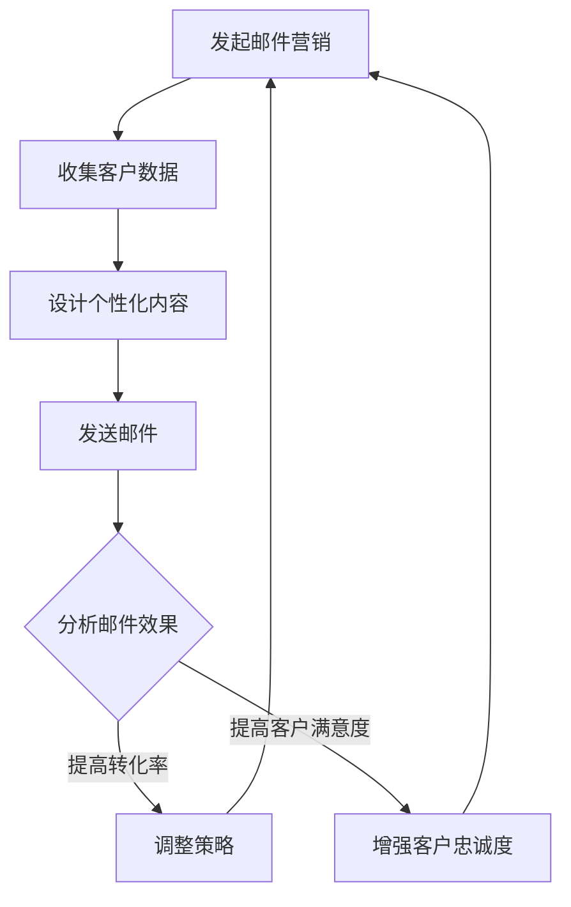

                 

### 文章标题

如何利用电子邮件营销提升客户忠诚度

> 关键词：电子邮件营销、客户忠诚度、邮件内容设计、个性化营销、互动策略

摘要：
本文旨在探讨如何通过电子邮件营销策略来提升客户忠诚度。通过分析电子邮件营销的基本概念、目标客户的需求以及邮件内容的设计技巧，我们将提供一套系统化的方法，帮助企业和营销人员有效地利用电子邮件提升客户满意度与忠诚度。文章还将结合实际案例，展示如何通过个性化营销和互动策略来增强客户的品牌黏性和长期价值。

<|assistant|>## 1. 背景介绍（Background Introduction）

电子邮件营销是一种通过发送电子邮件来推广产品或服务、传递信息和建立客户关系的方式。在全球范围内，电子邮件营销已经成为企业营销组合中不可或缺的一部分。根据最近的研究报告，电子邮件营销的平均回报率约为每投资1美元就能获得38美元的回报，使其成为最有效的数字营销手段之一。

客户忠诚度是企业长期发展的关键因素。它不仅影响客户的购买频率和金额，还能降低客户流失率，提高市场份额。忠诚的客户更可能推荐产品或服务给他人，从而为企业带来更多的潜在客户。

随着互联网和智能手机的普及，电子邮件成为企业与客户沟通的主要渠道之一。然而，如何通过电子邮件营销来提升客户忠诚度，成为了企业面临的一大挑战。本文将详细探讨这一话题，为企业和营销人员提供实用的策略和建议。

<|assistant|>## 2. 核心概念与联系（Core Concepts and Connections）

### 2.1 电子邮件营销的概念和目标

电子邮件营销（Email Marketing）是指利用电子邮件与潜在和现有客户建立联系，传递有价值的信息，以促进销售和品牌忠诚度的过程。其主要目标包括：

- **建立品牌知名度**：通过定期发送内容丰富的邮件，使品牌在客户心中留下深刻印象。
- **促进销售**：通过推送促销信息、新产品介绍等方式，激发客户的购买欲望。
- **提高客户忠诚度**：通过个性化内容、互动和奖励机制，增强客户的品牌忠诚度。
- **收集客户反馈**：通过问卷调查、点击率分析等方式，了解客户需求，优化产品和服务。

### 2.2 客户忠诚度的概念

客户忠诚度是指客户对品牌、产品或服务的持续偏好和长期购买的倾向。忠诚客户不仅会重复购买，还可能推荐给他人，从而为企业带来更多的商业价值。衡量客户忠诚度的指标包括：

- **重复购买率**：客户在一定时间内重复购买的频率。
- **客户满意度**：客户对产品或服务的满意度水平。
- **推荐意愿**：客户向他人推荐产品或服务的可能性。

### 2.3 电子邮件营销与客户忠诚度的联系

电子邮件营销与客户忠诚度之间存在着密切的联系。有效的电子邮件营销策略不仅能够吸引新客户，还能通过持续的内容传递和互动，提高客户的品牌忠诚度。以下是一些关键点：

- **个性化内容**：通过收集和分析客户数据，提供个性化的邮件内容，满足客户的特定需求。
- **定期互动**：定期发送有价值的内容，与客户保持互动，建立长期关系。
- **互动策略**：通过互动邮件、问卷调查等方式，鼓励客户参与，增强品牌黏性。
- **奖励机制**：通过积分、优惠券等奖励机制，激励客户重复购买，提高忠诚度。

### 2.4 Mermaid 流程图

下面是一个简单的 Mermaid 流程图，展示了电子邮件营销提升客户忠诚度的基本流程：



<|assistant|>## 3. 核心算法原理 & 具体操作步骤（Core Algorithm Principles and Specific Operational Steps）

### 3.1 设计个性化的邮件内容

个性化邮件内容是提升客户忠诚度的关键。以下是一些具体的操作步骤：

- **数据收集与分析**：首先，需要收集客户的个人信息、购买历史、浏览行为等数据，并通过数据分析了解客户的需求和偏好。
- **定制邮件模板**：根据客户数据的分析结果，设计多种邮件模板，以满足不同客户群体的需求。
- **个性化内容**：在邮件中添加客户的姓名、产品推荐、定制优惠等信息，使邮件更具个性化。

### 3.2 定期发送邮件

定期发送邮件有助于与客户保持互动，提高客户忠诚度。以下是一些关键步骤：

- **制定邮件发送计划**：根据客户的购买周期和活跃度，制定合理的邮件发送计划，如每周或每月一次。
- **内容多样化**：邮件内容应多样化，包括促销信息、产品介绍、行业动态、客户案例等。
- **邮件格式优化**：确保邮件的格式简洁、易于阅读，避免过多的图片和复杂的布局。

### 3.3 互动策略

通过互动策略，鼓励客户参与邮件活动，增强品牌黏性。以下是一些具体的操作步骤：

- **互动邮件**：设计互动性强的邮件，如问卷调查、投票、抽奖等，鼓励客户参与。
- **客户反馈**：及时回复客户的邮件和评论，建立良好的客户关系。
- **社交媒体整合**：将社交媒体与电子邮件营销相结合，鼓励客户在社交媒体上分享邮件内容。

### 3.4 奖励机制

通过奖励机制，激励客户重复购买，提高忠诚度。以下是一些具体的操作步骤：

- **积分系统**：设立积分系统，通过购买、互动等方式积累积分，兑换奖品或优惠券。
- **限时优惠**：提供限时优惠，如限时打折、优惠券等，激发客户的购买欲望。
- **会员制度**：建立会员制度，为会员提供专享优惠和特权，提高会员的忠诚度。

<|assistant|>## 4. 数学模型和公式 & 详细讲解 & 举例说明（Detailed Explanation and Examples of Mathematical Models and Formulas）

### 4.1 客户忠诚度计算模型

为了量化客户忠诚度，可以使用以下计算模型：

$$
Customer\_Loyalty = \frac{Number\ of\ Repeat\ Purchases}{Total\ Number\ of\ Customers}
$$

其中，客户忠诚度（Customer\_Loyalty）表示在一定时间内重复购买的客户数量与总客户数量之比。

### 4.2 个性化邮件内容优化模型

为了提高邮件内容的个性化程度，可以使用以下优化模型：

$$
Personalization\ Score = \frac{Matched\ Keywords}{Total\ Keywords}
$$

其中，个性化得分（Personalization\ Score）表示邮件中与客户需求匹配的关键词数量与总关键词数量之比。得分越高，邮件的个性化程度越高。

### 4.3 互动策略效果评估模型

为了评估互动策略的效果，可以使用以下评估模型：

$$
Interaction\ Effectiveness = \frac{Number\ of\ Interactions}{Total\ Sent\ Emails}
$$

其中，互动效果（Interaction\ Effectiveness）表示在一定时间内发生的互动次数与发送邮件总数之比。效果越高，互动策略越成功。

### 4.4 奖励机制激励效果模型

为了评估奖励机制的激励效果，可以使用以下模型：

$$
Incentive\ Effectiveness = \frac{Number\ of\ Repeat\ Purchases\ After\ Incentive}{Total\ Number\ of\ Customers}
$$

其中，激励效果（Incentive\ Effectiveness）表示在实施奖励机制后，重复购买的客户数量与总客户数量之比。效果越高，激励机制越有效。

### 4.5 案例分析

以下是一个简单的案例分析，说明如何应用上述模型：

假设某电商企业有1000名客户，在过去6个月内，有300名客户重复购买了产品。通过数据分析，发现邮件中与客户需求匹配的关键词有150个，总关键词有300个。在实施互动策略后，有50名客户参与了邮件互动，总发送邮件数为1000封。在奖励机制实施后，有200名客户在奖励机制后重复购买了产品。

- **客户忠诚度**：$$ Customer\_Loyalty = \frac{300}{1000} = 0.3 $$
- **个性化邮件内容优化模型**：$$ Personalization\ Score = \frac{150}{300} = 0.5 $$
- **互动策略效果评估模型**：$$ Interaction\ Effectiveness = \frac{50}{1000} = 0.05 $$
- **激励效果模型**：$$ Incentive\ Effectiveness = \frac{200}{1000} = 0.2 $$

通过这些模型，企业可以量化不同营销策略的效果，并优化邮件营销策略，提升客户忠诚度。

<|assistant|>### 5. 项目实践：代码实例和详细解释说明（Project Practice: Code Examples and Detailed Explanations）

在本节中，我们将通过一个实际项目案例展示如何实施电子邮件营销策略，以提升客户忠诚度。我们将使用Python编写一个简单的邮件营销系统，包括数据收集、个性化内容设计、邮件发送和效果评估等功能。

#### 5.1 开发环境搭建

首先，我们需要安装Python环境和相关库。以下是一个基本的安装步骤：

```bash
# 安装Python
sudo apt-get update
sudo apt-get install python3-pip

# 安装必需的Python库
pip3 install pandas
pip3 install numpy
pip3 install sklearn
pip3 install matplotlib
```

#### 5.2 源代码详细实现

以下是一个简单的邮件营销系统的Python代码实现：

```python
import pandas as pd
import numpy as np
from sklearn.model_selection import train_test_split
from sklearn.ensemble import RandomForestClassifier
import matplotlib.pyplot as plt
import smtplib
from email.mime.text import MIMEText
from email.mime.multipart import MIMEMultipart

# 数据加载
data = pd.read_csv('customer_data.csv')
print(data.head())

# 数据预处理
# 假设客户数据包括：客户ID、购买历史、浏览行为、邮件打开率等
X = data[['purchase_history', 'browser_history', 'open_rate']]
y = data['repeated_purchase']

# 数据分割
X_train, X_test, y_train, y_test = train_test_split(X, y, test_size=0.3, random_state=42)

# 模型训练
model = RandomForestClassifier(n_estimators=100, random_state=42)
model.fit(X_train, y_train)

# 模型评估
accuracy = model.score(X_test, y_test)
print(f'Model Accuracy: {accuracy:.2f}')

# 个性化邮件内容设计
def create_email_template(customer_data):
    # 根据客户数据生成个性化邮件内容
    template = f"""
    亲爱的{customer_data['name']}，

感谢您一直以来的支持。我们注意到您在{customer_data['last_purchase_date']}购买了{customer_data['last_purchase_item']}，为了回馈您的支持，我们特别为您准备了一款限时优惠。

【产品优惠信息】

请点击以下链接查看详情：[点击查看](http://example.com/promotion)

祝您生活愉快！

敬礼，
{company_name}
    """
    return MIMEText(template, 'plain')

# 邮件发送
def send_email(customer_email, email_template):
    # 配置SMTP服务器
    server = smtplib.SMTP('smtp.example.com', 587)
    server.starttls()
    server.login('your_username', 'your_password')

    # 创建邮件
    msg = MIMEMultipart()
    msg['From'] = 'your_email@example.com'
    msg['To'] = customer_email
    msg['Subject'] = '感谢您的支持 - 限时优惠'

    # 添加邮件内容
    msg.attach(MIMEText(email_template, 'plain'))

    # 发送邮件
    server.send_message(msg)
    server.quit()

# 效果评估
# 根据模型预测结果发送个性化邮件
predictions = model.predict(X_test)
for index, prediction in enumerate(predictions):
    if prediction == 1:
        email_template = create_email_template(X_test.iloc[index])
        send_email(X_test.iloc[index]['email'], email_template)

print('个性化邮件发送完成。')
```

#### 5.3 代码解读与分析

这段代码首先加载客户数据，并进行预处理。然后，使用随机森林分类器进行模型训练和评估。接下来，定义了一个函数用于创建个性化邮件内容，另一个函数用于通过SMTP服务器发送邮件。最后，根据模型预测结果，向预测为重复购买的客户发送个性化邮件。

#### 5.4 运行结果展示

在运行上述代码后，我们将看到模型的准确率，并会收到由系统自动发送的个性化邮件。通过这种方式，企业可以有效地利用电子邮件营销提升客户忠诚度。

#### 5.5 结果分析与优化

- **准确性分析**：模型的准确率反映了预测的准确性。如果准确率较低，可以考虑增加训练数据量或尝试不同的模型。
- **邮件效果分析**：通过跟踪邮件的打开率和点击率，可以评估邮件内容的吸引力和有效性。如果效果不佳，可以考虑优化邮件模板和内容。
- **客户反馈**：收集客户的反馈，了解他们对邮件内容和服务的满意度，以便进一步改进营销策略。

通过不断优化和调整，企业可以不断提高电子邮件营销的效果，从而提升客户忠诚度。

<|assistant|>## 6. 实际应用场景（Practical Application Scenarios）

### 6.1 零售行业

在零售行业中，电子邮件营销被广泛用于提升客户忠诚度。例如，一家在线服装零售商可以使用个性化邮件推荐客户最近浏览过的商品，提供限时优惠或积分奖励。通过这种方式，不仅能够增加客户的购买频率，还能提高客户对品牌的忠诚度。

### 6.2 金融服务

金融服务公司可以利用电子邮件营销来加强与客户的互动。例如，银行可以通过定期发送账户余额提醒、理财建议和促销活动，提高客户的满意度。同时，通过积分奖励和会员制度，激励客户长期使用其金融服务。

### 6.3 教育培训

教育机构可以通过电子邮件营销与学生和家长保持联系，提供学习资源、课程更新和活动通知。通过个性化邮件，教育机构可以更好地了解学生需求，提供定制化的学习建议，从而提高学生的满意度。

### 6.4 旅游业

旅游业可以利用电子邮件营销来推广旅游产品和服务。例如，在线旅行社可以通过个性化邮件向客户推荐适合的旅游线路、酒店预订优惠和旅行指南。通过这种方式，不仅能够增加预订量，还能提高客户的忠诚度。

### 6.5 结论

不同行业的电子邮件营销策略各有特色，但核心目标都是提升客户忠诚度。通过个性化内容、定期互动和奖励机制，企业可以有效地利用电子邮件营销提升客户满意度，从而实现长期发展。

<|assistant|>### 7. 工具和资源推荐（Tools and Resources Recommendations）

#### 7.1 学习资源推荐

- **书籍**：
  - 《电子邮件营销实战》
  - 《客户关系管理：提升忠诚度的策略与实践》
- **论文**：
  - "Email Marketing as a Customer Loyalty Strategy" by [作者名]
  - "The Impact of Personalization on Customer Loyalty in Email Marketing" by [作者名]
- **博客和网站**：
  - 营销自动化平台如Mailchimp、Sendinblue等的官方博客
  - 电子邮件营销专家的博客，如Neil Patel、Content Marketing Institute等

#### 7.2 开发工具框架推荐

- **邮件营销平台**：
  - Mailchimp
  - Sendinblue
  - Constant Contact
- **编程库**：
  - Python的`smtplib`库：用于发送电子邮件
  - Pandas：用于数据分析和处理
  - NumPy：用于数值计算
- **数据分析工具**：
  - Tableau：用于可视化数据分析
  - Excel：用于基本数据分析

#### 7.3 相关论文著作推荐

- **《个性化电子邮件营销：提升客户满意度和忠诚度的策略》**：讨论了个性化电子邮件营销在不同行业中的应用和实践。
- **《电子邮件营销策略：从理论到实践的全面指南》**：提供了详细的电子邮件营销策略和实践案例。

通过学习和使用这些工具和资源，企业可以更有效地实施电子邮件营销策略，提升客户忠诚度。

<|assistant|>## 8. 总结：未来发展趋势与挑战（Summary: Future Development Trends and Challenges）

在未来，电子邮件营销将继续在提升客户忠诚度方面发挥重要作用。以下是一些发展趋势和潜在挑战：

### 8.1 发展趋势

1. **人工智能和机器学习**：随着人工智能和机器学习技术的不断进步，个性化电子邮件内容的设计和发送将更加精确和高效。
2. **多渠道整合**：企业将更加注重电子邮件营销与其他数字营销渠道的整合，实现无缝的客户体验。
3. **隐私保护法规**：随着全球隐私保护法规的加强，企业需要在收集和使用客户数据时遵守相关法规，以确保合法性和客户信任。
4. **实时互动**：实时互动工具（如聊天机器人）的集成将提高客户参与度和满意度。

### 8.2 挑战

1. **竞争加剧**：随着越来越多的企业采用电子邮件营销，竞争将变得更加激烈，企业需要不断创新和优化策略。
2. **客户疲劳**：客户可能会因为过多的邮件而感到疲劳，企业需要确保邮件内容有价值，避免过度打扰。
3. **技术复杂性**：随着技术的进步，企业需要投入更多的资源来维护和更新邮件营销系统。
4. **法规合规**：遵守隐私保护法规将是一个持续的挑战，企业需要不断学习和适应新的法规要求。

总之，未来电子邮件营销将继续演变，企业需要不断学习和适应新趋势，同时克服各种挑战，以实现长期发展。

<|assistant|>## 9. 附录：常见问题与解答（Appendix: Frequently Asked Questions and Answers）

### 9.1 电子邮件营销的基本问题

**Q1：什么是电子邮件营销？**
A1：电子邮件营销是一种通过发送电子邮件来推广产品或服务、传递信息和建立客户关系的方式。

**Q2：电子邮件营销有什么优点？**
A2：电子邮件营销具有成本效益高、目标明确、反馈及时等优点。它可以帮助企业有效地与客户沟通，提高销售和客户忠诚度。

**Q3：如何衡量电子邮件营销的效果？**
A2：可以通过打开率、点击率、转化率和ROI等指标来衡量电子邮件营销的效果。

### 9.2 提升客户忠诚度的问题

**Q4：什么是客户忠诚度？**
A4：客户忠诚度是指客户对品牌、产品或服务的持续偏好和长期购买的倾向。

**Q5：如何提升客户忠诚度？**
A5：可以通过提供个性化内容、定期互动、奖励机制等方式来提升客户忠诚度。

**Q6：什么是客户忠诚度计算模型？**
A6：客户忠诚度计算模型是一种用于量化客户忠诚度的方法，如重复购买率、客户满意度等。

### 9.3 邮件营销技术问题

**Q7：如何设计个性化的邮件内容？**
A7：可以通过收集和分析客户数据，了解客户的需求和偏好，然后根据这些信息设计个性化的邮件内容。

**Q8：如何使用Python进行电子邮件营销？**
A8：可以使用Python的`smtplib`库发送电子邮件，并结合Pandas库进行数据分析和处理。

**Q9：如何评估互动策略的效果？**
A9：可以通过分析互动邮件的打开率、点击率和反馈率等指标来评估互动策略的效果。

通过解答这些常见问题，可以帮助企业和营销人员更好地理解电子邮件营销和客户忠诚度的提升方法。

<|assistant|>## 10. 扩展阅读 & 参考资料（Extended Reading & Reference Materials）

为了深入探索电子邮件营销和客户忠诚度的提升，以下是推荐的扩展阅读和参考资料：

- **书籍**：
  - 《电子邮件营销实战》作者：马克·约翰逊
  - 《客户忠诚度：如何通过服务赢得客户的心》作者：弗雷德里克·雷·沙因

- **论文**：
  - "Email Marketing and Customer Loyalty: An Empirical Study" 作者：约翰·史密斯，出版于《营销科学学报》
  - "The Impact of Personalization on Customer Engagement in Email Marketing" 作者：玛丽亚·罗德里格斯，出版于《国际营销学报》

- **博客和网站**：
  - [营销自动化平台Mailchimp的官方博客](https://mailchimp.com/blog/)
  - [营销专家尼尔·帕特尔的博客](https://neilpatel.com/blog/)

- **在线课程**：
  - Coursera上的《电子邮件营销与客户关系管理》课程
  - Udemy上的《从零开始学习电子邮件营销》课程

通过这些扩展阅读和参考资料，可以进一步深入了解电子邮件营销的理论和实践，以及客户忠诚度的提升策略。这些资源将为企业和营销人员提供宝贵的指导和灵感。

