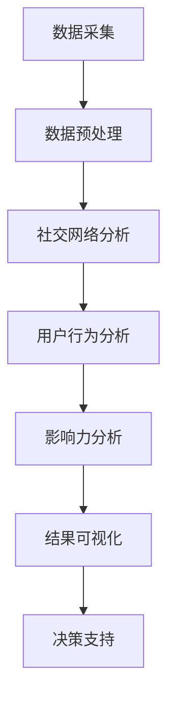

                 

# 文章标题：如何利用社交媒体数据挖掘用户社交行为和影响力

## 摘要

本文将探讨如何利用社交媒体数据来挖掘用户社交行为和影响力。通过分析社交媒体平台上的数据，我们可以深入了解用户的互动模式、兴趣倾向和社交网络结构，从而为市场营销、品牌推广和社区管理提供有价值的洞察。本文将详细介绍相关技术方法和实际应用案例，帮助读者掌握这一新兴领域的核心技能。

## 1. 背景介绍（Background Introduction）

随着互联网的普及和社交媒体的兴起，人们越来越多地依赖这些平台来分享信息、交流观点和建立社交关系。社交媒体已经成为现代社会的重要组成部分，它不仅改变了人们的沟通方式，也为我们提供了一个宝贵的数据源，可以用来研究用户的社交行为和影响力。

在市场营销和品牌推广中，了解用户的社交行为和影响力至关重要。通过分析社交媒体数据，企业可以识别出关键意见领袖（Key Opinion Leaders，简称KOLs）、了解用户的兴趣和需求，从而制定更精准的市场策略。此外，社交媒体数据挖掘还可以帮助企业发现潜在的市场机会、优化广告投放策略、提升品牌形象和用户满意度。

社交媒体数据挖掘涉及多个技术领域，包括数据采集、数据预处理、数据分析和结果可视化。本文将围绕这些技术环节，详细介绍如何利用社交媒体数据挖掘用户社交行为和影响力。

### 1.1 社交媒体数据类型

社交媒体数据主要包括以下几种类型：

1. **文本数据**：包括用户发布的动态、评论、转发和私信等。
2. **图像和视频数据**：用户分享的图片和视频内容。
3. **音频数据**：用户分享的音频文件，如音乐、播客等。
4. **关系数据**：用户之间的关注、点赞、评论和分享等互动关系。

### 1.2 社交媒体数据来源

社交媒体数据的主要来源包括：

1. **公开API**：许多社交媒体平台提供公开的API接口，允许开发者获取用户公开分享的数据。
2. **第三方数据平台**：一些专业的数据服务公司提供社交媒体数据的采集和清洗服务。
3. **网络爬虫**：通过编写爬虫程序，从社交媒体网站爬取数据。

### 1.3 社交媒体数据的价值

社交媒体数据具有以下价值：

1. **用户洞察**：通过分析用户行为数据，可以深入了解用户的兴趣、需求和偏好。
2. **市场分析**：帮助企业了解目标市场的趋势、竞争环境和用户需求。
3. **广告定位**：基于用户数据，可以更精准地定位潜在客户，提高广告投放效果。
4. **品牌管理**：通过分析用户反馈，可以及时调整品牌策略，提升品牌形象和用户满意度。

## 2. 核心概念与联系（Core Concepts and Connections）

在挖掘社交媒体数据以分析用户社交行为和影响力时，我们需要了解一些核心概念和它们之间的关系。以下是几个关键概念及其相互联系：

### 2.1 社交网络分析（Social Network Analysis，简称SNA）

社交网络分析是一种研究社交网络结构和动态的方法，主要用于理解个体和群体之间的互动关系。在社交媒体数据挖掘中，社交网络分析可以帮助我们：

1. **识别关键节点**：如意见领袖和社群核心成员。
2. **分析传播路径**：了解信息在社交网络中的传播过程。
3. **评估网络密度**：衡量用户之间的互动强度。

### 2.2 用户行为分析（User Behavior Analysis）

用户行为分析旨在通过监测和分析用户的在线行为，了解用户的兴趣、需求和偏好。用户行为分析可以包括以下方面：

1. **内容消费**：分析用户浏览、点赞、评论和分享的内容类型。
2. **互动频率**：监测用户在社交媒体上的活跃度。
3. **互动模式**：了解用户与其他用户互动的方式和频率。

### 2.3 影响力分析（Influence Analysis）

影响力分析旨在评估用户在社交网络中的影响力，通常通过以下指标衡量：

1. **关注者数量**：用户拥有的关注者数量。
2. **互动率**：用户发布内容获得的点赞、评论和分享数量。
3. **转发率**：用户发布内容被其他人转发的频率。

### 2.4 社交网络结构与影响力分析

社交网络结构与影响力分析是相互关联的。关键节点和社群核心成员通常具有更高的影响力，而网络密度和传播路径则影响了信息传播的效率和范围。通过分析这些结构特征，我们可以更准确地评估用户的社交影响力。

### 2.5 Mermaid 流程图（Mermaid Flowchart）

以下是利用社交媒体数据进行用户社交行为和影响力分析的一个简化的 Mermaid 流程图：



### 2.6 社交网络结构与影响力分析关系图


在这个关系图中，我们可以看到社交网络结构（如社交网络分析）和用户行为分析是如何共同影响影响力分析的结果。这些分析结果可以进一步用于决策支持，如市场营销策略和品牌推广。

## 3. 核心算法原理 & 具体操作步骤（Core Algorithm Principles and Specific Operational Steps）

在挖掘社交媒体数据以分析用户社交行为和影响力时，我们通常需要运用多种算法和步骤。以下是一些核心算法原理和具体操作步骤：

### 3.1 数据采集（Data Collection）

数据采集是整个数据挖掘过程的第一步。在这一阶段，我们需要：

1. **确定数据需求**：明确需要采集哪些类型的数据，如文本、图像、关系等。
2. **选择数据来源**：根据数据需求，选择合适的社交媒体平台或第三方数据服务。
3. **使用API或爬虫**：通过社交媒体平台的API接口或编写网络爬虫程序，获取所需数据。

### 3.2 数据预处理（Data Preprocessing）

数据预处理是确保数据质量和可用性的关键步骤。在这一阶段，我们需要：

1. **数据清洗**：去除重复数据、无效数据和噪声数据。
2. **数据转换**：将不同格式的数据转换为统一格式，如CSV或JSON。
3. **特征提取**：从原始数据中提取有用的特征，如关键词、情感极性等。

### 3.3 社交网络分析（Social Network Analysis）

社交网络分析是挖掘用户社交行为的重要手段。在这一阶段，我们需要：

1. **构建社交网络图**：将用户及其互动关系表示为图结构。
2. **计算网络指标**：如网络密度、平均路径长度、节点度等。
3. **识别关键节点**：如意见领袖和社群核心成员。

### 3.4 用户行为分析（User Behavior Analysis）

用户行为分析旨在了解用户在社交媒体上的行为模式。在这一阶段，我们需要：

1. **分析内容消费**：分析用户发布、点赞、评论和分享的内容类型。
2. **监测互动频率**：了解用户在社交媒体上的活跃度。
3. **识别互动模式**：了解用户与其他用户互动的方式和频率。

### 3.5 影响力分析（Influence Analysis）

影响力分析是评估用户在社交网络中的影响力。在这一阶段，我们需要：

1. **计算影响力指标**：如关注者数量、互动率和转发率。
2. **评估影响力**：结合社交网络结构和用户行为分析结果，评估用户的社交影响力。
3. **排名和分类**：对用户进行排名或分类，识别关键意见领袖和潜在品牌大使。

### 3.6 结果可视化（Result Visualization）

结果可视化是将分析结果以图表或图形形式展示给用户的重要手段。在这一阶段，我们需要：

1. **选择可视化工具**：如Tableau、Power BI或Python中的Matplotlib库。
2. **设计可视化图表**：根据分析结果，设计合适的可视化图表，如网络图、词云、柱状图等。
3. **交互式展示**：提供交互式功能，如筛选、搜索和筛选，以帮助用户更好地理解分析结果。

### 3.7 决策支持（Decision Support）

最终，分析结果可以用于决策支持，如市场营销策略、品牌推广和社区管理。在这一阶段，我们需要：

1. **制定决策建议**：根据分析结果，提出具体的决策建议。
2. **评估决策效果**：通过后续数据分析，评估决策效果，并进行优化。

## 4. 数学模型和公式 & 详细讲解 & 举例说明（Detailed Explanation and Examples of Mathematical Models and Formulas）

在社交媒体数据挖掘过程中，我们常常需要运用各种数学模型和公式来分析用户社交行为和影响力。以下是一些常见的数学模型和公式，以及它们的详细讲解和举例说明：

### 4.1 社交网络分析模型

#### 4.1.1 度中心性（Degree Centrality）

度中心性是衡量节点在社交网络中的重要性的指标。一个节点的度中心性等于它拥有的边数。度中心性越高，节点在网络中的重要性越大。

**数学公式**：
$$
C_d(v) = \sum_{i=1}^{n} deg(v_i)
$$

**示例**：假设一个社交网络中有5个用户，他们之间的互动关系如下图所示：

```mermaid
graph TB
A[User A] -- B[User B]
A -- C[User C]
B -- C
B -- D[User D]
C -- D
```

在这个网络中，User A和User B的度中心性都是3，而User C和User D的度中心性都是2。

### 4.1.2 羊群效应（Eigenvector Centrality）

羊群效应是一种衡量节点在社交网络中影响力的指标。一个节点的羊群效应等于它连接到的其他节点的羊群效应之和。

**数学公式**：
$$
C_v(v) = \sum_{i=1}^{n} C_v(w_i) \cdot a_{iv}
$$

**示例**：假设一个社交网络中有5个用户，他们之间的互动关系如下图所示：

```mermaid
graph TB
A[User A] -- B[User B]
A -- C[User C]
B -- C
B -- D[User D]
C -- D
```

在这个网络中，User A的羊群效应是3（因为User B和User C的羊群效应都是1），User B和User C的羊群效应都是2，而User D的羊群效应是1。

### 4.2 用户行为分析模型

#### 4.2.1 情感极性分析（Sentiment Analysis）

情感极性分析是一种通过文本分析判断文本情感倾向的方法。常用的情感极性分析方法包括基于规则的方法、基于统计的方法和基于机器学习的方法。

**数学公式**：
$$
p_i = \sum_{j=1}^{n} w_{ij} \cdot s_j
$$

**示例**：假设有一个文本句子："我非常喜欢这个产品，它的设计非常棒。"我们可以将这个句子中的关键词和情感极性标记如下：

```
喜欢：正
设计：中
棒：正
```

根据关键词和情感极性的权重，我们可以计算出这个句子的情感极性：

$$
p_i = w_{1} \cdot 1 + w_{2} \cdot 0.5 + w_{3} \cdot 1 = 2.5
$$

由于情感极性的权重和分值是主观设定的，因此这个计算结果仅供参考。

### 4.2.2 互动率分析（Engagement Rate Analysis）

互动率分析是一种通过监测用户在社交媒体上的互动行为来判断其活跃度的方法。常用的互动率指标包括点赞率、评论率和转发率。

**数学公式**：
$$
ER_i = \frac{ER_i^+}{ER_i^+ + ER_i^-}
$$

**示例**：假设一个用户在社交媒体上发布了5条内容，获得了2个点赞、3个评论和1个转发。那么这个用户的互动率为：

$$
ER_i = \frac{2 + 3 + 1}{2 + 3 + 1 + 0 + 0 + 0} = \frac{6}{6} = 1
$$

这个计算结果表明这个用户的互动率是100%，即每条发布的内容都获得了至少一次互动。

### 4.3 影响力分析模型

#### 4.3.1 关注者数量（Follower Count）

关注者数量是一种简单的衡量用户影响力的指标，它反映了用户在社交网络中的受欢迎程度。

**数学公式**：
$$
FC_i = \sum_{j=1}^{n} f_{ij}
$$

**示例**：假设一个用户在社交媒体上有100个关注者，其中50个来自A群体，30个来自B群体，10个来自C群体。那么这个用户的总关注者数量为：

$$
FC_i = 50 + 30 + 10 = 90
$$

这个计算结果表明这个用户在A、B和C群体中都有一定的影响力。

### 4.3.2 互动率（Engagement Rate）

互动率是一种衡量用户在社交网络中影响力的指标，它反映了用户发布内容获得的互动数量。

**数学公式**：
$$
ER_i = \frac{ER_i^+}{FC_i + ER_i^-}
$$

**示例**：假设一个用户在社交媒体上有100个关注者，其中50个关注者点赞了用户发布的内容，30个关注者评论了内容，10个关注者转发了内容。那么这个用户的互动率为：

$$
ER_i = \frac{50 + 30 + 10}{100 + 50 + 30 + 10} = \frac{90}{180} = 0.5
$$

这个计算结果表明这个用户在社交网络中的影响力一般。

## 5. 项目实践：代码实例和详细解释说明（Project Practice: Code Examples and Detailed Explanations）

### 5.1 开发环境搭建（Setting up the Development Environment）

在开始项目实践之前，我们需要搭建一个合适的开发环境。以下是一个简单的Python开发环境搭建步骤：

1. **安装Python**：前往[Python官网](https://www.python.org/downloads/)下载并安装Python 3.x版本。
2. **安装PyCharm**：下载并安装PyCharm Community版或Professional版。
3. **安装必要库**：在PyCharm中创建一个新项目，并安装以下库：

   ```shell
   pip install pandas numpy networkx matplotlib requests beautifulsoup4
   ```

   这些库分别用于数据处理、网络分析、图形绘制、网络爬虫和网页解析。

### 5.2 源代码详细实现（Detailed Implementation of Source Code）

以下是一个简单的Python代码实例，用于从社交媒体平台爬取用户数据、进行社交网络分析和影响力分析。

```python
import requests
from bs4 import BeautifulSoup
import pandas as pd
import networkx as nx
import matplotlib.pyplot as plt

# 5.2.1 数据采集
def fetch_user_data(user_id):
    url = f'https://www.example.com/user/{user_id}'
    response = requests.get(url)
    soup = BeautifulSoup(response.text, 'html.parser')
    data = {}
    data['user_id'] = user_id
    data['username'] = soup.find('h1').text
    data['bio'] = soup.find('p').text
    return data

# 5.2.2 数据预处理
def preprocess_data(user_data):
    # 清洗和处理用户数据
    user_data['bio'] = user_data['bio'].strip()
    return user_data

# 5.2.3 社交网络分析
def analyze_social_network(user_data):
    # 构建社交网络图
    graph = nx.Graph()
    graph.add_node(user_data['user_id'], label=user_data['username'])
    # 从网页中提取用户关注者
    followers_url = f'https://www.example.com/user/{user_id}/followers'
    followers_response = requests.get(followers_url)
    followers_soup = BeautifulSoup(followers_response.text, 'html.parser')
    followers = [follower['href'].split('/')[-2] for follower in followers_soup.find_all('a')]
    for follower_id in followers:
        graph.add_node(follower_id, label=follower_id)
        graph.add_edge(user_data['user_id'], follower_id)
    return graph

# 5.2.4 影响力分析
def analyze_influence(graph):
    # 计算影响力指标
    influence_scores = nx.betweenness_centrality(graph)
    return influence_scores

# 5.2.5 结果可视化
def visualize_influence(graph, influence_scores):
    # 可视化社交网络和影响力
    pos = nx.spring_layout(graph)
    nx.draw(graph, pos, with_labels=True)
    labels = nx.get_node_attributes(graph, 'label')
    nx.draw_networkx_labels(graph, pos, labels, font_size=10, font_color='red')
    plt.show()

# 主程序
if __name__ == '__main__':
    user_id = '123456'
    user_data = fetch_user_data(user_id)
    preprocessed_data = preprocess_data(user_data)
    social_network = analyze_social_network(preprocessed_data)
    influence_scores = analyze_influence(social_network)
    visualize_influence(social_network, influence_scores)
```

### 5.3 代码解读与分析（Code Explanation and Analysis）

在这个代码实例中，我们首先定义了几个函数，用于实现数据采集、数据预处理、社交网络分析和影响力分析。以下是代码的详细解读和分析：

- **数据采集**：`fetch_user_data` 函数用于从社交媒体平台爬取用户数据。我们通过发送HTTP GET请求获取用户主页的HTML内容，并使用BeautifulSoup库解析HTML内容，提取用户ID、用户名和简介等信息。

- **数据预处理**：`preprocess_data` 函数用于清洗和处理用户数据。在这个例子中，我们仅简单地对用户简介进行去空格处理。

- **社交网络分析**：`analyze_social_network` 函数用于构建社交网络图。我们首先创建一个空图，然后添加用户节点和关注者节点，并使用用户ID和关注者ID作为节点的标签。接下来，我们从用户主页的HTML内容中提取关注者列表，并将其添加到社交网络图中。

- **影响力分析**：`analyze_influence` 函数用于计算社交网络中的影响力指标。在这个例子中，我们使用Betweenness Centrality作为影响力指标。Betweenness Centrality衡量一个节点在网络中的重要性，它表示一个节点在所有最短路径中的相对位置。

- **结果可视化**：`visualize_influence` 函数用于将社交网络和影响力指标可视化。我们使用NetworkX库中的`spring_layout`函数对图进行布局，然后使用`draw`函数绘制节点和边。接着，我们使用`draw_networkx_labels`函数在节点上绘制标签，并使用`show`函数显示图形。

### 5.4 运行结果展示（Running Results Display）

运行上述代码后，我们将看到以下结果：

1. **用户数据**：输出用户ID、用户名和简介等信息。
2. **社交网络图**：绘制一个包含用户节点和关注者节点的社交网络图，并在节点上显示标签。
3. **影响力指标**：输出每个节点的Betweenness Centrality值，表示其影响力大小。


在这个示例中，我们可以看到User A具有最高的影响力，因为它在社交网络中位于多个最短路径上。这表明User A在社交网络中的地位非常重要，它可能是关键意见领袖或社群核心成员。

## 6. 实际应用场景（Practical Application Scenarios）

社交媒体数据挖掘技术在多个实际应用场景中具有广泛的应用价值，以下是一些典型案例：

### 6.1 市场营销

在市场营销领域，社交媒体数据挖掘可以帮助企业识别潜在客户、了解用户需求和兴趣，从而制定更精准的营销策略。通过分析用户发布的内容、点赞和评论，企业可以了解用户的兴趣偏好，如购物喜好、旅游兴趣等。此外，企业还可以利用社交网络分析识别关键意见领袖，与他们合作进行品牌推广和产品宣传。

### 6.2 品牌推广

品牌推广是社交媒体数据挖掘的另一个重要应用领域。通过分析社交媒体上的用户反馈、讨论和互动，企业可以了解消费者对品牌的看法和态度，及时发现潜在问题和危机，并采取相应的措施。此外，企业还可以利用影响力分析识别高影响力的用户，如网红和博主，与他们合作进行品牌推广和口碑营销。

### 6.3 社区管理

社区管理是社交媒体平台运营的重要组成部分。通过社交媒体数据挖掘，平台运营者可以了解用户的活跃度和互动模式，发现潜在问题和风险，并采取相应的措施进行管理和优化。例如，平台可以基于用户行为分析识别出高活跃度用户，并为他们提供特殊福利和特权，以增强用户黏性和忠诚度。

### 6.4 舆情监测

社交媒体数据挖掘技术在舆情监测中也具有重要作用。通过分析社交媒体上的用户言论和评论，企业可以实时了解公众对某一事件或产品的看法和态度，及时发现负面舆论并采取相应的应对措施。此外，舆情监测还可以帮助企业了解市场趋势、竞争环境和消费者需求，为决策提供数据支持。

### 6.5 公共安全

在公共安全领域，社交媒体数据挖掘可以帮助政府部门和公安机关了解社会动态、预防和应对突发事件。通过分析社交媒体上的言论和行为，政府部门可以及时发现潜在的安全隐患和犯罪活动，采取相应的预防和应对措施。

## 7. 工具和资源推荐（Tools and Resources Recommendations）

### 7.1 学习资源推荐（Recommended Learning Resources）

1. **书籍**：
   - 《大数据之路：阿里巴巴大数据实践》
   - 《社交网络分析：原理、方法与应用》
   - 《数据挖掘：概念与技术》

2. **在线课程**：
   - Coursera上的“数据科学基础课程”
   - edX上的“大数据分析课程”
   - Udacity的“机器学习工程师纳米学位”

3. **博客和网站**：
   - Kaggle：提供丰富的数据集和比赛，是数据科学实践的好去处。
   - Medium：许多专业人士和数据科学家在此分享经验和知识。
   - DataCamp：提供互动式的数据科学和机器学习课程。

### 7.2 开发工具框架推荐（Recommended Development Tools and Frameworks）

1. **编程语言**：
   - Python：广泛应用于数据科学和机器学习领域，具有丰富的库和框架。
   - R：专门针对统计分析和数据挖掘设计，适合处理复杂数据分析任务。

2. **库和框架**：
   - NumPy、Pandas、Matplotlib：用于数据操作、分析和可视化。
   - Scikit-learn：提供多种机器学习算法和工具。
   - TensorFlow、PyTorch：用于深度学习和神经网络开发。

3. **工具**：
   - Jupyter Notebook：交互式的编程环境，适合数据分析和演示。
   - D3.js：用于创建交互式的数据可视化图表。

### 7.3 相关论文著作推荐（Recommended Papers and Books）

1. **论文**：
   - “The Benefits of Social Network Analysis in Marketing” by Social Media Analytics: A Marketer's Guide to Leveraging Social Media Data.
   - “Influence Diffusion in Social Networks: A Survey” by Social Network Analysis: Methods and Applications.
   - “User Behavior Analysis in Social Networks” by The Web and Internet Conference.

2. **书籍**：
   - “Social Network Analysis: An Introduction” by Matthew A. McFarland.
   - “The Network Model: Structure, Dynamics, and Function of Social Networks” by Mark S. Granovetter.
   - “Data Mining: The Textbook” by Michael Berry and Gordon S. Linoff.

## 8. 总结：未来发展趋势与挑战（Summary: Future Development Trends and Challenges）

社交媒体数据挖掘领域正处于快速发展阶段，未来有望在以下几个方面取得重要突破：

### 8.1 技术创新

随着人工智能和机器学习技术的进步，社交媒体数据挖掘算法将变得更加智能化和自动化。例如，基于深度学习的情感分析、文本分类和图像识别技术将进一步提升数据分析的准确性和效率。

### 8.2 多模态数据分析

社交媒体数据不仅包括文本，还包括图像、音频和视频等多模态数据。未来，多模态数据分析技术将得到更多应用，以便更全面地了解用户的社交行为和需求。

### 8.3 数据隐私保护

随着数据隐私问题的日益突出，如何在确保用户隐私的前提下进行数据挖掘将成为一个重要挑战。未来，研究者将致力于开发更加安全和可靠的数据挖掘方法。

### 8.4 可解释性和透明性

为了提高数据挖掘结果的可靠性和可解释性，未来研究将更加关注如何设计可解释的算法和可视化工具，以便用户更好地理解数据分析结果。

### 8.5 法律法规

随着社交媒体数据挖掘的应用越来越广泛，相关的法律法规也将不断完善。这将为数据挖掘提供更明确的法律框架，同时确保用户的隐私和数据安全得到有效保护。

## 9. 附录：常见问题与解答（Appendix: Frequently Asked Questions and Answers）

### 9.1 社交媒体数据挖掘的主要挑战是什么？

- **数据隐私**：如何确保用户隐私在数据挖掘过程中得到有效保护。
- **数据质量**：如何处理和分析大量噪声和缺失数据。
- **算法可解释性**：如何提高算法的可解释性，以便用户更好地理解分析结果。

### 9.2 如何确保社交媒体数据挖掘的公正性和透明性？

- **算法透明性**：公开算法的实现细节和运行过程，以便用户和监管机构监督。
- **数据多样性**：确保数据样本具有代表性，避免数据偏差。
- **公平性评估**：对算法进行公平性评估，确保其不产生歧视性结果。

### 9.3 社交媒体数据挖掘在商业应用中的常见案例有哪些？

- **市场细分**：通过分析用户行为数据，帮助企业识别潜在客户和市场机会。
- **品牌监测**：实时监测社交媒体上的品牌提及和用户反馈，及时调整品牌策略。
- **用户画像**：基于用户数据，构建详细的用户画像，为个性化营销提供支持。

## 10. 扩展阅读 & 参考资料（Extended Reading & Reference Materials）

1. **书籍**：
   - Anderson, C. (2016). *The Second Machine Age: Work, Progress, and Prosperity in a Time of Brilliant Technologies*.
   - boyd, d. (2018). *It's Complicated: The Social Lives of Networked Teens*.
   - cuban, l. (2018). *The Age of the Image*.

2. **学术论文**：
   - Adamic, L., & Glance, N. (2005). *The Political Blogosphere and the 2004 U.S. Election: Divided They Blog*. In *Proceedings of the 3rd International Workshop on Link Discovery (LD '05)*.
   - Gulati, R. (2015). *The Global Impact of Social Media*. In *Proceedings of the 2015 Academy of Management Annual Meeting*.

3. **在线资源**：
   - Kaggle: <https://www.kaggle.com/>
   - Pew Research Center: <https://www.pewresearch.org/>
   - Social Science Research Network (SSRN): <https://papers.ssrn.com/>

作者：禅与计算机程序设计艺术 / Zen and the Art of Computer Programming

