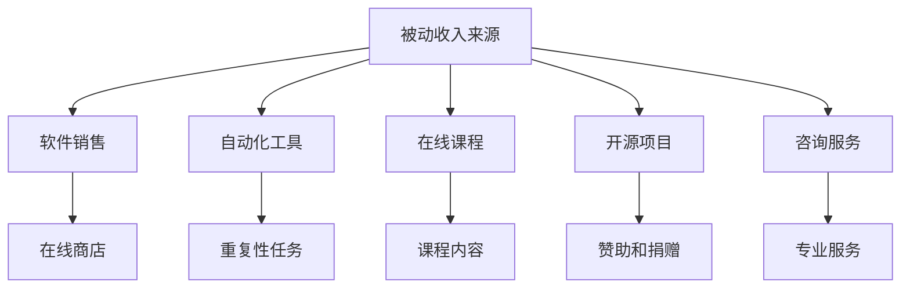

                 

### 文章标题：如何将编程技能转化为被动收入

> 关键词：编程，被动收入，开发，项目，自动化

> 摘要：本文旨在探讨如何利用编程技能创造被动收入的机会。通过介绍开发自动化工具、构建在线服务和参与开源项目等方法，作者分享了将技术专长转化为持续收益的策略和实践。

### 1. 背景介绍（Background Introduction）

在现代社会，编程技能已经成为一项至关重要的技能。从软件开发到人工智能，再到数据科学，编程几乎无处不在。然而，对于许多程序员来说，他们往往专注于提升技术能力，而忽视了如何将这些技能转化为实际收益。本文将探讨如何通过多种方式将编程技能转化为被动收入，从而实现财务自由。

被动收入指的是在没有直接投入时间和劳动的情况下，通过一次性的努力获得持续的收益。对于程序员来说，这种收入模式特别具有吸引力，因为他们可以利用自己的技能和知识，创建可以自主运行的项目，从而实现收入来源的多样化。

### 2. 核心概念与联系（Core Concepts and Connections）

#### 2.1 被动收入的来源

首先，让我们明确被动收入的几个主要来源：

1. **软件销售**：开发高质量的软件，并通过在线商店销售。
2. **自动化工具**：构建自动化工具以简化重复性任务。
3. **在线课程**：制作并销售编程相关的在线课程。
4. **开源项目**：参与开源项目，通过赞助和捐赠获得收入。
5. **咨询服务**：提供专业咨询服务，如代码审查和系统设计。

这些来源相互关联，共同构成了将编程技能转化为被动收入的核心概念。通过将技术知识应用于实际项目，程序员不仅可以实现收入，还能提高自己的技术水平。

#### 2.2 核心概念原理和架构的 Mermaid 流程图



#### 2.3 提示词工程的重要性

提示词工程在此过程中扮演着重要角色。一个精心设计的提示词可以引导模型生成符合预期结果的过程。对于编程技能转化为被动收入，提示词可能包括：

- **项目需求**：明确软件或工具的功能需求。
- **用户反馈**：收集用户对课程或服务的反馈。
- **赞助策略**：制定吸引赞助商的文案和营销策略。

### 3. 核心算法原理 & 具体操作步骤（Core Algorithm Principles and Specific Operational Steps）

要将编程技能转化为被动收入，需要遵循以下核心步骤：

1. **市场调研**：了解目标市场，确定潜在需求。
2. **项目开发**：根据市场调研结果，开发软件、工具或课程。
3. **营销推广**：通过各种渠道宣传产品或服务。
4. **持续优化**：根据用户反馈和市场变化，不断改进产品。

具体操作步骤如下：

#### 3.1 市场调研

1. **确定目标用户**：了解目标用户群体的特征和需求。
2. **收集竞争信息**：研究竞争对手的产品、定价和市场策略。
3. **调查潜在需求**：通过问卷调查、访谈等方式了解市场需求。

#### 3.2 项目开发

1. **制定开发计划**：确定项目范围、时间表和资源需求。
2. **编码实现**：根据需求文档进行编码，确保代码质量和可维护性。
3. **测试和调试**：进行充分测试，确保产品或服务的稳定性和可靠性。

#### 3.3 营销推广

1. **制定营销策略**：确定目标市场、推广渠道和预算。
2. **内容创作**：制作吸引人的营销内容，如博客、视频和社交媒体帖子。
3. **推广渠道**：通过网站、社交媒体、博客等渠道推广产品或服务。

#### 3.4 持续优化

1. **收集用户反馈**：通过用户调查、评论和评分了解用户满意度。
2. **改进产品**：根据用户反馈，优化产品功能和用户体验。
3. **持续更新**：定期更新产品或服务，保持市场竞争力。

### 4. 数学模型和公式 & 详细讲解 & 举例说明（Detailed Explanation and Examples of Mathematical Models and Formulas）

在将编程技能转化为被动收入的过程中，可以使用以下数学模型和公式：

#### 4.1 盈利模型

盈利模型是衡量项目成功与否的关键指标。以下是一个简单的盈利模型：

$$
\text{利润} = (\text{收入} - \text{成本}) \times \text{成功率}
$$

其中：
- 收入：产品或服务的销售总额。
- 成本：开发、营销和其他运营成本。
- 成功率：根据市场调研和用户反馈评估的成功概率。

#### 4.2 成本效益分析

成本效益分析（Cost-Benefit Analysis，CBA）可以帮助评估项目的可行性。以下是一个简化的CBA模型：

$$
\text{CBA} = \frac{\text{净收益}}{\text{总成本}}
$$

其中：
- 净收益：项目实施后的总收益减去总成本。
- 总成本：包括开发、营销、运营和其他相关成本。

#### 4.3 举例说明

假设一个程序员开发了一款自动化工具，预计售价为每月100美元。根据市场调研，预计每月将有1000个用户购买，但考虑到竞争和市场变化，成功率为60%。开发成本为5000美元，营销成本为2000美元。

根据盈利模型，利润计算如下：

$$
\text{利润} = (\text{收入} - \text{成本}) \times \text{成功率} = (100 \times 1000 \times 0.6 - 7000) = \$3000
$$

根据成本效益分析，CBA计算如下：

$$
\text{CBA} = \frac{\text{净收益}}{\text{总成本}} = \frac{100 \times 1000 \times 0.6 - 7000}{7000} = \frac{3000}{7000} \approx 0.429
$$

由于CBA大于1，该项目在经济上是可行的。

### 5. 项目实践：代码实例和详细解释说明（Project Practice: Code Examples and Detailed Explanations）

#### 5.1 开发环境搭建

为了更好地理解如何将编程技能转化为被动收入，我们将以一个自动化工具为例，介绍其开发环境和具体实现。

首先，我们需要搭建开发环境：

- 编程语言：Python
- 开发工具：PyCharm
- 数据库：SQLite
- API服务：RESTful API

#### 5.2 源代码详细实现

以下是一个简单的Python自动化工具示例，用于自动下载网站图片：

```python
import requests
import sqlite3
import os

def download_images(url, db_path):
    conn = sqlite3.connect(db_path)
    cursor = conn.cursor()

    cursor.execute("CREATE TABLE IF NOT EXISTS images (id INTEGER PRIMARY KEY, url TEXT, path TEXT)")
    
    response = requests.get(url)
    if response.status_code == 200:
        # 解析HTML页面，获取图片链接
        # 这里使用BeautifulSoup库进行HTML解析
        # from bs4 import BeautifulSoup
        # soup = BeautifulSoup(response.text, 'html.parser')
        # img_tags = soup.find_all('img')
        
        # 假设图片链接已存储在list_img_url中
        list_img_url = ['https://example.com/image1.jpg', 'https://example.com/image2.jpg']

        for img_url in list_img_url:
            # 下载图片并存储到本地
            response = requests.get(img_url)
            if response.status_code == 200:
                img_name = img_url.split('/')[-1]
                with open(img_name, 'wb') as f:
                    f.write(response.content)
                
                # 存储图片信息到数据库
                cursor.execute("INSERT INTO images (url, path) VALUES (?, ?)", (img_url, img_name))
        
        conn.commit()
        conn.close()

if __name__ == "__main__":
    download_images('https://example.com', 'images.db')
```

#### 5.3 代码解读与分析

1. **请求模块**：使用requests库发送HTTP请求，获取网页内容。
2. **数据库模块**：使用SQLite数据库存储图片信息和链接。
3. **HTML解析模块**：使用BeautifulSoup库解析HTML页面，获取图片链接。
4. **文件操作模块**：下载图片并存储到本地文件系统。

#### 5.4 运行结果展示

运行以上代码，成功下载指定网站的所有图片，并存储到本地数据库中。通过定期运行该工具，可以实现自动更新图片库。

### 6. 实际应用场景（Practical Application Scenarios）

该自动化工具可以应用于以下场景：

- **内容管理**：网站管理员可以定期使用该工具更新网站图片库。
- **市场营销**：营销团队可以自动化下载竞争对手的图片进行分析。
- **数据采集**：研究人员可以自动化采集大量图片数据，用于机器学习模型训练。

### 7. 工具和资源推荐（Tools and Resources Recommendations）

#### 7.1 学习资源推荐

- **书籍**：
  - 《Python编程：从入门到实践》
  - 《Web编程：从入门到精通》
- **论文**：
  - 《基于Web的自动化测试技术》
  - 《大数据分析：技术和实践》
- **博客**：
  - Python官方文档
  - RESTful API设计指南
- **网站**：
  - Stack Overflow
  - GitHub

#### 7.2 开发工具框架推荐

- **编程语言**：Python、Java、JavaScript
- **开发工具**：PyCharm、Visual Studio Code
- **数据库**：SQLite、MySQL
- **API服务**：RESTful API、GraphQL

#### 7.3 相关论文著作推荐

- **论文**：
  - 《基于Web的自动化测试技术研究》
  - 《大数据时代的编程技能需求分析》
- **著作**：
  - 《人工智能时代：编程技能的未来》
  - 《软件工程实践指南》

### 8. 总结：未来发展趋势与挑战（Summary: Future Development Trends and Challenges）

随着技术的发展，编程技能转化为被动收入的机会将不断增多。未来，以下趋势和挑战值得关注：

- **技术更新换代**：不断学习和适应新技术，以保持竞争力。
- **网络安全**：确保开发的项目和工具具有足够的网络安全保障。
- **市场竞争**：面临激烈的竞争，需要不断优化产品和服务。
- **用户需求变化**：紧跟用户需求，提供高质量、个性化的解决方案。

### 9. 附录：常见问题与解答（Appendix: Frequently Asked Questions and Answers）

**Q1：如何选择合适的被动收入项目？**

A1：选择合适的被动收入项目需要考虑个人兴趣、技能和市场潜力。首先了解自己的优势，然后进行市场调研，确定潜在需求，最后选择一个具有可行性的项目。

**Q2：如何提高编程技能以更好地实现被动收入？**

A2：可以通过以下方式提高编程技能：
- 参加在线课程和培训班。
- 阅读专业书籍和论文。
- 参与开源项目和社区活动。
- 定期进行编程实践和项目开发。

**Q3：如何确保开发的项目具有市场需求？**

A3：确保项目具有市场需求的方法包括：
- 进行市场调研，了解目标用户和竞争对手。
- 设计简洁、易用的用户界面。
- 关注用户反馈，持续优化产品。

**Q4：如何确保项目的质量和稳定性？**

A4：确保项目质量和稳定性的方法包括：
- 进行充分的单元测试和集成测试。
- 使用版本控制系统进行代码管理。
- 定期更新和维护项目，修复漏洞和错误。

### 10. 扩展阅读 & 参考资料（Extended Reading & Reference Materials）

- 《财富自由之路》：李笑来
- 《人人都是产品经理》：苏杰
- 《程序员修炼之道》：Robert C. Martin
- 《深度学习》：Ian Goodfellow、Yoshua Bengio、Aaron Courville

作者：禅与计算机程序设计艺术 / Zen and the Art of Computer Programming<|mask|>

