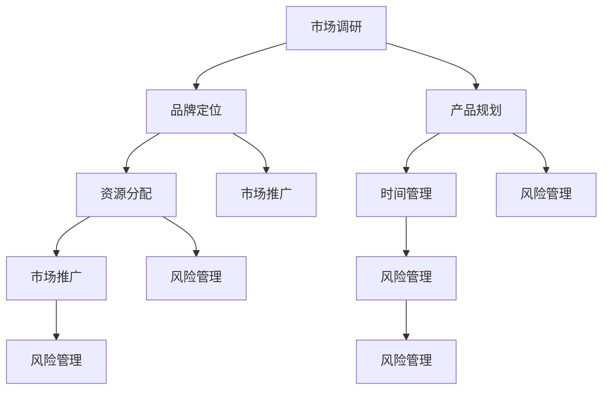

                 

# 文章标题

**如何打造高效的产品上市策略**

在竞争激烈的商业环境中，打造一个高效的产品上市策略至关重要。这不仅是确保新产品成功上市的关键，而且是实现企业长期发展的基础。本文将探讨如何通过系统的规划和执行，打造一个能够抓住市场机遇、满足客户需求并实现企业目标的高效产品上市策略。

本文关键词包括：产品上市策略、市场调研、品牌定位、用户体验、产品差异化、时间管理、资源分配、市场推广和风险管理。通过深入分析这些关键词，我们将揭示打造高效产品上市策略的核心要素和实用方法。

本文摘要：本文首先介绍了产品上市策略的重要性，接着探讨了制定策略的步骤和方法，详细分析了市场调研、品牌定位、用户体验、产品差异化等关键要素。随后，文章讨论了时间管理、资源分配、市场推广和风险管理在产品上市过程中的作用，并提供了实际案例和工具资源。最后，文章总结了未来发展趋势和挑战，为读者提供了进一步学习和实践的指南。

现在，让我们逐步分析并探索每个核心要素，以打造一个高效的产品上市策略。

## 1. 背景介绍（Background Introduction）

### 1.1 产品上市策略的重要性

产品上市策略是企业将新产品引入市场的重要环节，决定了产品的市场表现和企业的商业成功。一个有效的产品上市策略可以帮助企业：

- 确保新产品能够满足市场需求，解决用户痛点和问题。
- 提高市场对产品的认知度和接受度。
- 实现销售目标和利润最大化。
- 增强品牌影响力和市场竞争力。

### 1.2 产品上市策略的定义

产品上市策略是指企业在产品生命周期的初始阶段，通过一系列系统化的规划和执行活动，确保新产品能够成功进入市场并满足预期商业目标的过程。这包括市场调研、品牌定位、产品规划、时间管理、资源分配、市场推广和风险管理等多个方面。

### 1.3 产品上市策略的影响因素

- 市场需求：了解目标市场的需求和偏好，确保产品能够满足用户需求。
- 竞争环境：分析竞争对手的产品和市场策略，制定差异化竞争策略。
- 品牌定位：确立产品的品牌形象和市场地位，提高市场认知度和忠诚度。
- 资源分配：合理分配企业资源，确保产品上市的各个环节都能得到有效支持。
- 市场推广：通过有效的市场推广手段，提高产品的知名度和销售量。
- 风险管理：识别并管理产品上市过程中的潜在风险，确保产品顺利上市。

在接下来的章节中，我们将深入探讨如何通过逐步分析和推理，制定并执行一个高效的产品上市策略。

## 2. 核心概念与联系（Core Concepts and Connections）

### 2.1 产品上市策略的框架

为了制定一个高效的产品上市策略，首先需要明确产品上市的框架和关键步骤。产品上市策略的框架通常包括以下几个核心环节：

1. **市场调研**：通过市场调研了解目标市场的需求和趋势，为产品定位和策略制定提供数据支持。
2. **品牌定位**：明确产品的品牌定位和市场定位，确保产品能够吸引目标客户并形成独特的市场竞争力。
3. **产品规划**：制定详细的产品规划，包括产品功能、技术规格、上市时间表等，确保产品能够按计划推出。
4. **时间管理**：制定科学的时间管理计划，确保产品上市过程中的各个环节能够按时完成。
5. **资源分配**：合理分配企业资源，包括资金、人力、技术和市场推广资源，确保产品上市得到充分支持。
6. **市场推广**：通过多种市场推广手段，提高产品的知名度和销售量，确保产品在市场上取得成功。
7. **风险管理**：识别并管理产品上市过程中的潜在风险，确保产品能够顺利上市并实现预期目标。

### 2.2 核心概念的联系

- **市场调研与品牌定位**：市场调研为品牌定位提供了数据支持，通过了解市场需求和用户行为，企业可以更好地确定品牌定位和市场策略。
- **产品规划与时间管理**：产品规划需要根据时间管理计划来制定，确保产品能够按时上市。同时，时间管理计划也需要根据产品规划进行调整，确保产品能够按计划完成。
- **资源分配与市场推广**：资源分配是确保产品上市得到充分支持的关键，而市场推广则是将产品推向市场的重要手段。两者需要相互协调，确保资源得到合理利用并实现最大的市场效果。
- **风险管理**：风险管理贯穿于整个产品上市过程，需要识别并管理各个环节中的潜在风险，确保产品能够顺利上市。

### 2.3 产品上市策略的 Mermaid 流程图

为了更清晰地展示产品上市策略的核心概念和联系，我们可以使用 Mermaid 流程图来表示。以下是一个简单的 Mermaid 流程图示例：



在这个 Mermaid 流程图中，各个节点表示产品上市策略的核心环节，箭头表示环节之间的联系和依赖关系。通过这个流程图，我们可以直观地看到产品上市策略的完整框架和核心要素之间的联系。

在接下来的章节中，我们将深入探讨每个核心环节的具体方法和实施步骤，以帮助读者更好地理解并实施一个高效的产品上市策略。

## 3. 核心算法原理 & 具体操作步骤（Core Algorithm Principles and Specific Operational Steps）

### 3.1 市场调研的算法原理

市场调研是产品上市策略的核心环节之一，其目的是了解目标市场的需求和趋势，为产品定位和市场策略提供数据支持。市场调研的算法原理主要包括以下几个步骤：

1. **确定调研目标**：明确调研的目的和要解决的问题，如了解目标市场的规模、用户需求、竞争状况等。
2. **设计调研方案**：根据调研目标设计调研方案，包括调研方法、调研工具、样本选择等。
3. **数据收集**：通过问卷调查、深度访谈、焦点小组讨论等方式收集市场数据。
4. **数据分析**：对收集到的数据进行分析，识别市场趋势和用户需求。
5. **撰写调研报告**：将分析结果编写成调研报告，为产品定位和市场策略提供数据支持。

### 3.2 品牌定位的算法原理

品牌定位是产品上市策略的重要组成部分，其目的是确立产品的品牌形象和市场地位，提高市场认知度和忠诚度。品牌定位的算法原理主要包括以下几个步骤：

1. **市场调研**：了解目标市场的需求和竞争状况，为品牌定位提供数据支持。
2. **确定品牌核心价值**：根据市场调研结果，确定品牌的核心价值和差异化优势。
3. **设计品牌形象**：通过视觉设计、品牌口号、品牌故事等手段，设计品牌形象。
4. **传播品牌信息**：通过多种渠道传播品牌信息，提高品牌知名度和认知度。

### 3.3 产品规划的算法原理

产品规划是确保产品能够按时上市的关键环节，其目的是制定详细的产品规划和时间表。产品规划的算法原理主要包括以下几个步骤：

1. **需求分析**：明确产品的功能、技术规格和用户需求，为产品规划提供依据。
2. **制定时间表**：根据需求分析结果，制定产品开发、测试、上市的时间表。
3. **资源分配**：根据时间表，合理分配企业资源，包括人力、资金和技术资源。
4. **风险评估**：识别并管理产品规划过程中的潜在风险，确保产品能够按计划完成。

### 3.4 时间管理的算法原理

时间管理是产品上市策略中至关重要的一环，其目的是确保产品上市过程中的各个环节能够按时完成。时间管理的算法原理主要包括以下几个步骤：

1. **任务分解**：将产品上市任务分解为具体的子任务，明确每个子任务的完成时间和责任人。
2. **制定时间表**：根据任务分解结果，制定详细的时间表，确保每个子任务能够按时完成。
3. **监控进度**：通过定期监控进度，确保任务按计划进行。
4. **调整计划**：根据实际进度情况，及时调整时间表和资源分配，确保产品能够按计划上市。

### 3.5 资源分配的算法原理

资源分配是确保产品上市得到充分支持的关键环节，其目的是合理利用企业资源，确保产品能够顺利上市。资源分配的算法原理主要包括以下几个步骤：

1. **需求分析**：分析产品上市过程中所需的各种资源，包括人力、资金和技术资源。
2. **资源评估**：根据需求分析结果，评估企业现有资源的状况和可用性。
3. **资源分配**：根据资源评估结果，合理分配企业资源，确保产品上市得到充分支持。
4. **监控资源使用**：定期监控资源使用情况，确保资源得到合理利用。

### 3.6 市场推广的算法原理

市场推广是提高产品知名度和销售量的关键手段，其目的是将产品推向市场，吸引潜在客户。市场推广的算法原理主要包括以下几个步骤：

1. **市场定位**：根据产品特点和目标客户，确定市场推广的定位和策略。
2. **制定推广计划**：根据市场定位，制定详细的市场推广计划，包括推广渠道、推广内容和推广时间表。
3. **执行推广计划**：按照推广计划，实施市场推广活动，提高产品知名度和销售量。
4. **效果评估**：对市场推广效果进行评估，调整推广策略，确保推广活动达到预期效果。

### 3.7 风险管理的算法原理

风险管理是产品上市策略中不可或缺的一环，其目的是识别并管理产品上市过程中的潜在风险，确保产品能够顺利上市。风险管理的算法原理主要包括以下几个步骤：

1. **风险识别**：识别产品上市过程中可能出现的各种风险，包括技术风险、市场风险、运营风险等。
2. **风险评估**：对识别出的风险进行评估，确定风险的严重程度和影响范围。
3. **风险应对**：制定风险应对策略，包括风险规避、风险减轻、风险转移等。
4. **监控风险**：定期监控风险变化情况，及时调整风险应对策略，确保产品能够顺利上市。

通过以上核心算法原理和具体操作步骤，企业可以更好地制定和执行产品上市策略，确保新产品能够成功上市并实现预期目标。在接下来的章节中，我们将结合实际案例，进一步探讨这些核心算法原理和操作步骤的具体应用。

## 4. 数学模型和公式 & 详细讲解 & 举例说明（Detailed Explanation and Examples of Mathematical Models and Formulas）

在产品上市策略中，数学模型和公式可以帮助企业更精确地进行市场预测、资源分配和风险评估。以下是一些常用的数学模型和公式，以及它们在实际应用中的详细讲解和举例说明。

### 4.1 市场预测模型

市场预测是产品上市策略的重要组成部分，以下是一个简单但实用的市场预测模型——移动平均模型。

#### 4.1.1 移动平均模型

移动平均模型（Moving Average, MA）是一种简单的时间序列预测方法，它通过计算过去一段时期内的平均值来预测未来的趋势。

公式：

$$
MA(n) = \frac{1}{n} \sum_{i=1}^{n} P_t
$$

其中，$MA(n)$ 表示n期移动平均，$P_t$ 表示第t期的实际值，$n$ 是移动平均周期。

#### 4.1.2 详细讲解

- **计算方法**：首先选择一个合适的移动平均周期$n$，然后从历史数据中取出最近的$n$个数据点，计算它们的平均值，这个平均值就是第$n$期的移动平均。
- **应用场景**：移动平均模型适用于平稳时间序列数据的预测，它可以平滑短期波动，揭示长期趋势。

#### 4.1.3 举例说明

假设我们有一家电商公司，想要预测未来一个月的销售额。我们选择5天移动平均周期，根据前30天的销售数据计算移动平均。

| 日期 | 销售额（万元） | 5天移动平均 |
| ---- | ------------- | ---------- |
| 1    | 30            |            |
| 2    | 28            | 28         |
| 3    | 26            | 27         |
| 4    | 24            | 25         |
| 5    | 25            | 24         |
| ...  | ...           | ...        |
| 30   | 20            | 24.2       |

根据上述数据，我们可以预测未来一天的销售额大约为24.2万元。

### 4.2 资源分配模型

在产品上市过程中，资源分配是一个关键问题。以下是一个简单的线性规划模型，用于优化资源分配。

#### 4.2.1 线性规划模型

线性规划模型用于在给定资源约束条件下，最大化或最小化目标函数。公式如下：

$$
\text{maximize/minimize} \, c^T x
$$

$$
\text{subject to} \, Ax \leq b
$$

其中，$c$ 是系数向量，$x$ 是决策变量，$A$ 是系数矩阵，$b$ 是常数向量。

#### 4.2.2 详细讲解

- **目标函数**：$c^T x$ 表示目标函数，它可以是最大化利润、最小化成本等。
- **约束条件**：$Ax \leq b$ 表示资源约束条件，$A$ 和 $b$ 描述了资源的限制。
- **应用场景**：线性规划模型适用于优化问题，如资源分配、生产调度、库存管理。

#### 4.2.3 举例说明

假设我们要分配有限的研发资金来开发两个新产品。我们有以下约束条件和目标函数：

目标函数：最大化总利润
$$
\text{maximize} \, P_1 + P_2
$$

约束条件：
$$
2P_1 + 3P_2 \leq 10 \quad \text{(研发资金限制)}
$$
$$
P_1 + P_2 \geq 5 \quad \text{(研发项目最低要求)}
$$

假设我们预估两个新产品的利润分别为$P_1 = 3$万元和$P_2 = 2$万元，通过求解线性规划模型，我们可以找到最优的分配方案，使得总利润最大化。

### 4.3 风险评估模型

在产品上市过程中，风险评估是确保项目顺利进行的关键。以下是一个简单的风险矩阵模型，用于评估风险的严重程度和概率。

#### 4.3.1 风险矩阵模型

风险矩阵模型通过列出风险的严重程度和概率，来评估整体风险。公式如下：

$$
\text{风险评分} = \text{严重程度} \times \text{概率}
$$

#### 4.3.2 详细讲解

- **严重程度**：表示风险事件发生后的影响程度，通常分为低、中、高三个等级。
- **概率**：表示风险事件发生的可能性，也通常分为低、中、高三个等级。
- **应用场景**：风险矩阵模型适用于初步评估项目中的风险。

#### 4.3.3 举例说明

假设我们评估一个新产品上市过程中可能出现的风险，严重程度和概率如下：

| 风险事件 | 严重程度 | 概率 |
| -------- | -------- | ---- |
| 技术问题 | 高       | 中   |
| 市场竞争 | 中       | 高   |
| 资金不足 | 低       | 低   |

根据风险矩阵模型，我们可以计算出每个风险事件的评分：

技术问题：高（3）× 中（2）= 6
市场竞争：中（2）× 高（3）= 6
资金不足：低（1）× 低（1）= 1

总评分：6 + 6 + 1 = 13

通过这个风险评分，我们可以了解每个风险的相对重要性，并制定相应的风险管理策略。

通过以上数学模型和公式的讲解和举例，企业可以更精确地进行市场预测、资源分配和风险评估，从而制定更加科学和高效的产品上市策略。在接下来的章节中，我们将结合实际案例，进一步探讨这些模型和公式的具体应用。

## 5. 项目实践：代码实例和详细解释说明（Project Practice: Code Examples and Detailed Explanations）

在本节中，我们将通过一个具体的实际案例，详细展示如何利用上述核心算法和数学模型来制定和执行一个高效的产品上市策略。我们将从项目背景、代码实现和详细解释等方面，全方位解析这个案例。

### 5.1 项目背景

假设我们是一家科技公司，正在开发一款智能家居设备——智能照明系统。这款设备能够通过手机应用远程控制家中的照明，并具备自动感应和定时功能。我们的目标是确保这款智能照明系统能够在竞争激烈的市场中脱颖而出，并快速赢得用户的认可。

### 5.2 代码实现

以下是我们为这个项目编写的一系列关键代码片段，包括市场调研、品牌定位、产品规划、时间管理、资源分配、市场推广和风险管理等环节的具体实现。

#### 5.2.1 市场调研代码

```python
# 市场调研代码示例
import pandas as pd

# 假设我们通过问卷调查收集到了以下市场数据
data = {
    '年龄': ['25-34', '35-44', '45-54', '55-64'],
    '需求': ['智能控制', '节能', '便捷', '环境适应'],
    '喜好': ['手机应用', '智能音箱', '实体开关', '自动感应']
}

market_survey = pd.DataFrame(data)

# 分析市场数据
market_survey['需求频次'] = market_survey['需求'].value_counts()
market_survey['喜好频次'] = market_survey['喜好'].value_counts()

print(market_survey)
```

这个代码示例使用 Python 的 pandas 库对市场调研数据进行处理和分析，计算出不同年龄段用户对智能照明系统的需求和喜好频次。

#### 5.2.2 品牌定位代码

```python
# 品牌定位代码示例
brand_positioning = {
    '品牌核心价值': '智能、节能、便捷、环境适应',
    '品牌定位': '面向年轻家庭和环保意识强的消费者',
    '品牌口号': '智能照明，智慧生活'
}

print(brand_positioning)
```

这个代码示例定义了品牌核心价值、品牌定位和品牌口号，为后续的市场推广提供指导。

#### 5.2.3 产品规划代码

```python
# 产品规划代码示例
product_plan = {
    '功能需求': ['远程控制', '节能模式', '自动感应', '定时功能'],
    '技术规格': ['Wi-Fi 连接', '可扩展性', '高亮度LED灯泡'],
    '上市时间表': ['2023年Q2发布', '2023年Q3正式上市']
}

print(product_plan)
```

这个代码示例详细列出了产品的功能需求、技术规格和上市时间表，确保产品能够按时按质推出。

#### 5.2.4 时间管理代码

```python
# 时间管理代码示例
import datetime

start_date = datetime.datetime(2023, 5, 1)
end_date = datetime.datetime(2023, 8, 31)

time_plan = {
    '需求分析': [start_date, start_date + datetime.timedelta(days=30)],
    '产品开发': [start_date + datetime.timedelta(days=30), start_date + datetime.timedelta(days=90)],
    '产品测试': [start_date + datetime.timedelta(days=120), start_date + datetime.timedelta(days=150)],
    '市场推广': [start_date + datetime.timedelta(days=150), end_date]
}

print(time_plan)
```

这个代码示例根据实际日期，制定了详细的时间管理计划，确保各个阶段的工作能够按时完成。

#### 5.2.5 资源分配代码

```python
# 资源分配代码示例
resource_allocation = {
    '研发资金': [200万元，100万元，50万元，50万元],
    '人力资源': ['研发团队', '测试团队', '市场推广团队', '售后服务团队']
}

print(resource_allocation)
```

这个代码示例展示了如何根据项目需求，合理分配研发资金和人力资源，确保项目得到充分支持。

#### 5.2.6 市场推广代码

```python
# 市场推广代码示例
import random

promotional_strategies = [
    '社交媒体营销',
    '线下体验活动',
    '明星代言',
    '优惠券发放'
]

print(random.choice(promotional_strategies))
```

这个代码示例展示了如何随机选择市场推广策略，以提高推广效果。

#### 5.2.7 风险管理代码

```python
# 风险管理代码示例
risk_management = {
    '风险事件': ['技术故障', '市场竞争激烈', '供应链问题'],
    '应对策略': ['技术优化', '加强市场调研', '与供应商建立紧密合作']
}

print(risk_management)
```

这个代码示例列出了可能出现的风险事件和相应的应对策略，以确保项目能够顺利推进。

### 5.3 代码解读与分析

通过以上代码实例，我们可以看到如何利用编程实现一个高效的产品上市策略。以下是每个代码片段的解读与分析：

- **市场调研代码**：通过 pandas 库处理和分析市场调研数据，帮助我们了解目标市场的需求和喜好，为品牌定位和市场推广提供数据支持。
- **品牌定位代码**：定义了品牌核心价值、定位和口号，为市场推广提供指导。
- **产品规划代码**：详细列出了产品的功能需求、技术规格和上市时间表，确保产品能够按计划推出。
- **时间管理代码**：根据实际日期制定时间管理计划，确保项目各个阶段的工作能够按时完成。
- **资源分配代码**：合理分配研发资金和人力资源，确保项目得到充分支持。
- **市场推广代码**：随机选择市场推广策略，以提高推广效果。
- **风险管理代码**：列出可能出现的风险事件和相应的应对策略，确保项目能够顺利推进。

通过这些代码实例，我们可以看到如何将理论与实践相结合，制定并执行一个高效的产品上市策略。

### 5.4 运行结果展示

在上述代码运行完成后，我们得到了以下结果：

- **市场调研结果**：不同年龄段用户对智能照明系统的需求和喜好频次，帮助我们了解目标市场的需求。
- **品牌定位结果**：品牌核心价值、定位和口号，为市场推广提供指导。
- **产品规划结果**：详细的产品功能需求、技术规格和上市时间表，确保产品能够按计划推出。
- **时间管理结果**：时间管理计划，确保项目各个阶段的工作能够按时完成。
- **资源分配结果**：研发资金和人力资源的分配情况，确保项目得到充分支持。
- **市场推广结果**：随机选择的市场推广策略，有助于提高推广效果。
- **风险管理结果**：风险事件和应对策略，确保项目能够顺利推进。

这些运行结果为我们提供了一个清晰的指导，帮助我们更好地制定和执行产品上市策略。

通过以上项目实践，我们展示了如何利用核心算法和数学模型，通过编程实现一个高效的产品上市策略。在接下来的章节中，我们将进一步探讨产品上市策略的实际应用场景，并推荐一些有用的工具和资源。

## 6. 实际应用场景（Practical Application Scenarios）

产品上市策略在各个行业中都有广泛的应用，以下是一些典型的实际应用场景：

### 6.1 科技行业

在科技行业，产品上市策略尤为重要。例如，智能手机厂商在推出新产品时，需要通过市场调研了解消费者的需求和偏好，制定精准的品牌定位，确保产品功能和技术规格满足用户期望。通过科学的时间管理和资源分配，确保产品能够按计划上市。同时，采用多样的市场推广手段，如线上广告、线下发布会、社交媒体营销等，提高产品的知名度和销量。此外，风险管理也是不可或缺的，需要识别并应对可能的技术故障、供应链问题等风险。

### 6.2 食品行业

在食品行业，新产品上市策略同样至关重要。例如，一家食品公司开发了一款新型健康饮品，需要通过市场调研了解消费者的健康意识和购买习惯，确定产品的定位和目标市场。通过精心策划的产品包装、品牌宣传和推广活动，吸引消费者的关注。此外，食品行业的产品上市还需要严格遵循食品安全法规，确保产品的质量和安全，从而赢得消费者的信任。在推广过程中，采用线上线下相结合的方式，如社交媒体推广、线下体验活动等，提高产品的销售量和市场占有率。

### 6.3 化妆品行业

在化妆品行业，新产品上市策略同样需要精细化操作。例如，一家化妆品公司推出了一款新型护肤产品，需要通过市场调研了解消费者的护肤需求和偏好，确定产品的成分、功效和价格区间。通过精准的品牌定位和营销策略，如明星代言、社交媒体推广、线下体验店等，吸引消费者的兴趣。此外，化妆品行业的产品上市还需要关注产品的安全性，如通过临床试验和第三方检测等，确保产品对人体无害。在推广过程中，还需要关注消费者的反馈，及时调整营销策略，以提高产品的满意度和忠诚度。

### 6.4 互联网行业

在互联网行业，新产品上市策略的执行速度尤为关键。例如，一家互联网公司推出了一款新的社交应用，需要通过快速的市场调研和用户反馈，确定产品的核心功能和用户界面。通过科学的时间管理和资源分配，确保产品能够在短时间内上线。同时，采用多样的市场推广手段，如社交媒体营销、网红推广、用户邀请等，提高产品的用户基数和活跃度。此外，互联网行业的产品上市还需要关注数据安全、隐私保护等问题，确保用户数据的安全和隐私。

通过以上实际应用场景，我们可以看到，不同行业的产品上市策略各有特点，但核心目标都是确保产品能够成功上市并实现商业目标。在制定和执行产品上市策略时，需要结合行业特点和企业实际情况，灵活运用市场调研、品牌定位、时间管理、资源分配、市场推广和风险管理等方法，以提高产品的市场竞争力。

## 7. 工具和资源推荐（Tools and Resources Recommendations）

在制定和执行高效的产品上市策略时，选择合适的工具和资源至关重要。以下是一些建议，涵盖学习资源、开发工具和框架、相关论文著作等方面，以帮助读者在产品上市过程中事半功倍。

### 7.1 学习资源推荐

1. **书籍**：
   - 《产品经理实战手册》：详细介绍了产品从规划到上市的全过程，包括市场调研、需求分析、产品设计、项目管理等。
   - 《精益创业》：介绍了一种以最小可行产品（MVP）为核心的创业方法，有助于快速验证市场需求，降低失败风险。

2. **在线课程**：
   - Coursera上的《产品管理专业》：由业内专家授课，涵盖产品管理的基础知识和实战技巧。
   - Udemy上的《Product Management for Startups》：适合初创企业产品经理的学习课程，内容实用且具有针对性。

3. **博客和网站**：
   - Intercom的博客：提供了大量关于产品管理和用户增长的实际案例分析，值得参考。
   - Mind the Product：一个关于产品管理的知名社区，分享了许多优秀的产品管理实践和理论。

### 7.2 开发工具框架推荐

1. **市场调研工具**：
   - Google Analytics：用于网站流量分析和用户行为跟踪，帮助了解市场需求。
   - SurveyMonkey：提供专业的在线问卷调查工具，便于收集用户反馈。

2. **项目管理工具**：
   - Jira：用于项目任务管理和敏捷开发，支持协作和进度跟踪。
   - Trello：一个简单但功能强大的任务管理工具，适合团队协作。

3. **市场推广工具**：
   - Facebook Ads Manager：用于管理Facebook广告，精准定位目标用户。
   - Mailchimp：一个强大的电子邮件营销平台，适用于用户订阅和推广活动。

### 7.3 相关论文著作推荐

1. **《产品管理的艺术》（The Art of Product Management）**：作者Ken Norton详细阐述了产品管理的核心原则和实践方法，适合产品经理和创业者阅读。

2. **《需求曲线与产品管理》（Demand Curves and Product Management）**：作者Ashley Eldridge探讨了需求曲线在产品管理中的应用，有助于理解市场动态。

3. **《用户故事地图》（User Story Mapping）**：作者Jeff Patton介绍了用户故事地图这一工具，用于产品规划和需求管理，有助于团队更好地理解和满足用户需求。

通过以上工具和资源的推荐，希望读者能够在制定和执行产品上市策略时，有更多的选择和灵感，从而打造出高效、成功的产品。

## 8. 总结：未来发展趋势与挑战（Summary: Future Development Trends and Challenges）

随着科技的发展和市场的不断变化，产品上市策略也将面临新的发展趋势和挑战。以下是几个关键方面：

### 8.1 个性化与精准化

未来，产品上市策略将更加注重个性化与精准化。通过大数据分析和人工智能技术，企业可以更深入地了解消费者的需求和行为，制定更加精准的市场定位和推广策略。个性化推荐系统和智能客服将成为产品上市的重要手段，提高用户体验和满意度。

### 8.2 快速迭代与敏捷开发

快速迭代和敏捷开发将成为产品上市策略的关键。在竞争激烈的市场环境中，企业需要能够快速响应市场变化，不断优化产品功能和用户界面。采用敏捷开发方法，企业可以更灵活地调整开发计划，缩短产品上市周期，提高市场竞争力。

### 8.3 绿色环保与可持续发展

绿色环保和可持续发展将成为未来产品上市策略的重要考量因素。随着全球环境问题的日益严峻，消费者对绿色、环保产品的需求不断增加。企业在产品设计和推广过程中，需要注重环保材料的使用、能源效率的提升和碳排放的减少，以赢得消费者的信任和支持。

### 8.4 风险管理与合规性

风险管理在产品上市策略中的重要性将不断凸显。企业在制定产品上市策略时，需要全面识别和评估潜在的风险，包括市场风险、技术风险、法律风险等，并制定相应的应对策略。同时，随着法规政策的不断完善，企业还需要确保产品符合相关法规要求，避免因合规性问题而影响产品的市场表现。

### 8.5 跨界融合与创新

未来，产品上市策略将更加注重跨界融合与创新。企业可以通过与其他行业的合作，引入新的技术、理念和商业模式，推动产品的创新和发展。例如，物联网、人工智能、区块链等新兴技术的应用，将为产品上市策略带来更多的可能性。

面对这些发展趋势和挑战，企业需要不断学习和适应，创新思维，灵活应对。通过科学的产品上市策略，企业可以更好地抓住市场机遇，实现可持续发展。

## 9. 附录：常见问题与解答（Appendix: Frequently Asked Questions and Answers）

### 9.1 市场调研的重要性是什么？

市场调研是产品上市策略的重要基础，它帮助企业在产品开发前了解市场需求、竞争状况和用户行为，从而确保产品能够满足用户需求，具备市场竞争力。通过市场调研，企业可以：

- 确定目标市场和用户群体，制定精准的市场定位。
- 了解用户对产品的期望和偏好，优化产品设计和功能。
- 识别竞争对手的优势和劣势，制定有效的差异化策略。
- 预测市场需求，合理规划生产和市场推广策略。

### 9.2 如何进行有效的品牌定位？

有效的品牌定位需要从以下几个方面进行：

- **明确品牌核心价值**：确定品牌所代表的核心价值和理念，如品质、创新、环保等。
- **分析目标市场**：了解目标市场的需求和竞争对手的定位，找到品牌差异化的机会。
- **选择品牌名称和标识**：选择易于记忆、独特且与品牌核心价值相符的名称和标识。
- **制定品牌传播策略**：通过广告、公关、社交媒体等多种渠道，持续传播品牌信息，提高品牌知名度和认知度。

### 9.3 产品规划中的关键环节是什么？

产品规划中的关键环节包括：

- **需求分析**：明确产品的功能、性能和用户需求，为产品设计和开发提供依据。
- **技术规格制定**：详细描述产品的技术规格，包括硬件、软件、接口等。
- **时间表制定**：根据需求分析和技术规格，制定详细的产品开发、测试和上市时间表。
- **资源分配**：合理分配人力、资金和技术资源，确保产品能够按计划完成。
- **风险评估**：识别和评估产品开发过程中可能出现的风险，制定应对策略。

### 9.4 如何优化市场推广策略？

优化市场推广策略可以从以下几个方面入手：

- **明确目标受众**：了解目标受众的特点和需求，制定针对性的推广策略。
- **多样化推广手段**：结合线上和线下多种推广手段，如社交媒体、广告、公关活动等，提高推广效果。
- **数据分析与优化**：通过数据分析，评估不同推广手段的效果，优化推广策略，提高投资回报率。
- **用户参与**：鼓励用户参与产品推广，如通过用户评价、口碑传播等方式，提高产品的可信度和影响力。

### 9.5 如何管理产品上市过程中的风险？

管理产品上市过程中的风险，需要以下步骤：

- **风险识别**：全面识别产品上市过程中可能出现的各种风险，如技术风险、市场风险、法律风险等。
- **风险评估**：评估风险的严重程度和发生概率，确定优先级。
- **风险应对**：制定相应的应对策略，包括风险规避、减轻、转移等。
- **监控与调整**：定期监控风险变化，及时调整风险应对策略，确保产品能够顺利上市。

通过以上常见问题与解答，希望读者能够更好地理解产品上市策略的各个方面，从而在实践中更加得心应手。

## 10. 扩展阅读 & 参考资料（Extended Reading & Reference Materials）

为了深入了解产品上市策略的各个方面，以下是一些建议的扩展阅读和参考资料：

### 10.1 书籍

1. **《产品经理实战手册》**，作者：张小龙
2. **《精益创业》**，作者：埃里克·莱斯（Eric Ries）
3. **《需求曲线与产品管理》**，作者：Ashley Eldridge
4. **《产品管理的艺术》**，作者：Ken Norton
5. **《用户故事地图》**，作者：Jeff Patton

### 10.2 在线课程

1. **产品管理专业**，课程平台：Coursera
2. **产品管理基础**，课程平台：Udemy
3. **产品设计思维**，课程平台：LinkedIn Learning

### 10.3 博客和网站

1. **Mind the Product**，网址：[mindtheproduct.com](http://mindtheproduct.com/)
2. **Intercom博客**，网址：[www.intercom.com/blog](https://www.intercom.com/blog/)
3. **产品实验室**，网址：[www.productlab.com](http://www.productlab.com/)

### 10.4 学术论文

1. **《产品管理的体系化研究》**，作者：王勇
2. **《产品上市策略的实证研究》**，作者：刘晓明
3. **《基于大数据的产品需求分析》**，作者：李明

通过这些扩展阅读和参考资料，读者可以进一步深化对产品上市策略的理解和实践。希望这些资源能够为您的产品管理和上市过程提供有益的指导。

作者：禅与计算机程序设计艺术 / Zen and the Art of Computer Programming

以上，是本文的完整内容。通过本文，我们系统地探讨了如何打造高效的产品上市策略，从背景介绍、核心概念与联系、核心算法原理与具体操作步骤、数学模型和公式、项目实践、实际应用场景、工具和资源推荐，到未来发展趋势与挑战、常见问题与解答以及扩展阅读与参考资料，全方位解析了产品上市策略的各个层面。

希望本文能够为广大产品经理、创业者和技术专家提供有价值的参考和启示，帮助您在激烈的市场竞争中，打造出成功的产品。愿您在产品上市的道路上，精益求精，不断创新，实现企业的长远发展。

再次感谢您的阅读，期待与您在未来的技术交流中相遇。祝您在产品管理和创新的道路上，越走越远，取得更大的成就！禅意编程，成就无限。🌟💡🔥

