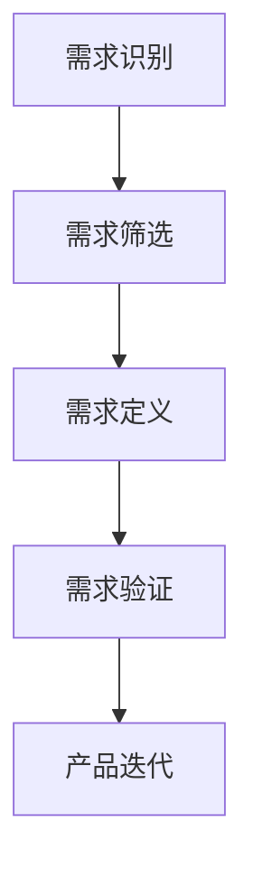

                 

# 如何进行有效的用户需求挖掘

## 文章关键词
用户需求挖掘、用户研究、需求分析、用户体验、数据分析、用户访谈、问卷调查、观察法、访谈法、数据分析工具

## 文章摘要
本文将探讨如何进行有效的用户需求挖掘。我们将从用户研究的定义和重要性开始，介绍常见的用户研究方法，包括用户访谈、问卷调查和观察法。接着，我们将讨论如何通过数据分析来深入了解用户行为和需求，以及如何利用用户反馈来优化产品设计和功能。最后，我们将总结文章的主要观点，并提出未来的研究方向。

## 1. 背景介绍（Background Introduction）

在数字化转型的浪潮下，用户需求挖掘已经成为企业和产品成功的关键。用户需求挖掘是一种通过研究用户行为、偏好和期望来识别和定义产品需求的过程。它不仅仅关注用户当前的需求，还试图预测未来的趋势，以便企业可以及时调整战略和产品，从而在激烈的市场竞争中脱颖而出。

### 1.1 用户需求挖掘的重要性

有效的用户需求挖掘能够帮助企业：

- **提高产品成功率**：通过深入了解用户需求，企业可以设计出更符合用户期望的产品，从而提高产品成功率。
- **降低研发成本**：避免不必要的功能开发和资源浪费，专注于真正对用户有价值的功能。
- **增强用户满意度**：提供更贴合用户需求的产品和服务，提升用户满意度，从而增强用户忠诚度。
- **优化市场策略**：通过分析用户需求和市场趋势，企业可以更好地定位市场，制定有效的市场策略。

### 1.2 用户研究的定义和分类

用户研究（User Research）是指通过收集和分析用户数据来理解和满足用户需求的过程。用户研究可以分类为：

- **定量研究**：通过统计方法对大量用户数据进行量化的分析，以获取广泛的用户趋势和共性。
- **定性研究**：通过深入访谈、小组讨论等方法，理解用户深层次的动机、态度和行为。

### 1.3 用户需求挖掘的基本流程

用户需求挖掘的基本流程通常包括以下几个阶段：

1. **需求识别**：通过市场调研、竞品分析等手段识别潜在的用户需求。
2. **需求筛选**：根据业务目标和资源限制，对识别的需求进行筛选和排序。
3. **需求定义**：明确每个需求的具体内容、优先级和实现路径。
4. **需求验证**：通过用户反馈、测试等方式验证需求的准确性和可行性。

## 2. 核心概念与联系（Core Concepts and Connections）

### 2.1 用户需求挖掘的核心概念

用户需求挖掘涉及多个核心概念，包括用户行为分析、用户画像、需求分类等。

#### 2.1.1 用户行为分析

用户行为分析（User Behavior Analysis）是指通过数据分析和用户追踪技术，研究用户在产品中的行为模式。它包括：

- **行为轨迹**：用户在产品中的浏览路径、操作序列等。
- **使用频率**：用户对产品的访问频率、活跃时长等。
- **使用时长**：用户在特定功能上的停留时间、退出原因等。

#### 2.1.2 用户画像

用户画像（User Profile）是对用户特征的综合描述，包括用户的年龄、性别、职业、教育背景、兴趣爱好等。用户画像可以帮助企业了解用户的基本特征，从而更好地定位和满足用户需求。

#### 2.1.3 需求分类

需求分类（Need Classification）是将用户需求按照类型进行划分，常见的分类方法包括功能需求、性能需求、安全需求等。正确分类需求有助于明确产品开发的重点和优先级。

### 2.2 用户需求挖掘与相关领域的关系

用户需求挖掘与多个领域密切相关，包括市场研究、产品管理、用户体验设计等。

#### 2.2.1 市场研究

市场研究（Market Research）是用户需求挖掘的基础，通过市场调研可以了解用户需求、市场趋势和竞争态势。市场研究包括定量研究（如问卷调查、数据分析）和定性研究（如深度访谈、焦点小组）。

#### 2.2.2 产品管理

产品管理（Product Management）是用户需求挖掘的核心执行者，负责将用户需求转化为产品功能。产品经理需要与用户、设计师、开发团队紧密合作，确保产品满足用户需求。

#### 2.2.3 用户体验设计

用户体验设计（User Experience Design）是用户需求挖掘的重要应用领域，通过研究用户行为和需求，设计师可以创建更直观、更易用的产品界面和交互设计。

### 2.3 用户需求挖掘的 Mermaid 流程图

下面是一个简单的 Mermaid 流程图，展示了用户需求挖掘的基本流程：



## 3. 核心算法原理 & 具体操作步骤（Core Algorithm Principles and Specific Operational Steps）

### 3.1 用户行为数据分析

用户行为数据分析是用户需求挖掘的关键步骤。以下是具体操作步骤：

#### 3.1.1 数据收集

- 使用用户行为跟踪工具（如 Google Analytics、Mixpanel）收集用户数据。
- 收集的数据包括页面浏览量、点击次数、用户停留时间等。

#### 3.1.2 数据预处理

- 清洗数据，去除异常值和噪声数据。
- 进行数据转换，将原始数据格式转换为便于分析的结构化数据。

#### 3.1.3 数据分析

- 使用统计方法（如均值、中位数、标准差）描述用户行为特征。
- 使用机器学习方法（如聚类、分类）分析用户行为模式。

### 3.2 用户画像构建

用户画像构建是了解用户需求的重要手段。以下是具体操作步骤：

#### 3.2.1 数据收集

- 从用户注册表、用户行为数据等来源收集用户信息。
- 包括用户的基本信息（如年龄、性别、职业）和兴趣标签（如音乐、运动、旅游）。

#### 3.2.2 数据处理

- 使用数据清洗和转换技术，处理收集到的用户数据。
- 根据用户信息构建用户画像，包括用户特征和兴趣标签。

#### 3.2.3 用户画像分析

- 使用用户画像分析工具（如用户标签管理系统）对用户画像进行统计分析。
- 分析用户行为的共性和差异，识别高价值用户群体。

### 3.3 需求分类与优先级排序

需求分类与优先级排序是确保产品开发高效的关键。以下是具体操作步骤：

#### 3.3.1 需求收集

- 通过用户访谈、问卷调查等方式收集用户需求。
- 收集的需求包括功能需求、性能需求和安全需求等。

#### 3.3.2 需求分类

- 使用需求分类标准（如 ISO/IEC 25010）对需求进行分类。
- 分类结果用于指导产品设计和开发。

#### 3.3.3 优先级排序

- 使用优先级排序方法（如 MoSCoW 方法）对需求进行排序。
- 确保高优先级需求得到优先满足。

### 3.4 用户需求验证

用户需求验证是确保需求准确性和可行性的关键。以下是具体操作步骤：

#### 3.4.1 用户测试

- 设计用户测试方案，包括测试用例和测试数据。
- 通过用户测试验证需求的准确性和可行性。

#### 3.4.2 用户反馈收集

- 收集用户对产品的反馈，包括使用体验、功能满意度等。
- 分析用户反馈，识别需求改进的方向。

#### 3.4.3 需求迭代

- 根据用户测试结果和反馈，对需求进行迭代和优化。
- 确保需求与用户实际需求保持一致。

## 4. 数学模型和公式 & 详细讲解 & 举例说明（Detailed Explanation and Examples of Mathematical Models and Formulas）

### 4.1 用户行为数据分析

用户行为数据分析中常用的数学模型包括统计学模型和机器学习模型。

#### 4.1.1 统计学模型

- **均值**：用户行为特征的均值表示用户行为的平均水平。公式为：
  $$\bar{x} = \frac{\sum_{i=1}^{n} x_i}{n}$$
  其中，\(x_i\) 表示第 \(i\) 个用户的行为特征，\(n\) 表示用户总数。

- **方差**：用户行为特征的方差表示用户行为特征的离散程度。公式为：
  $$\sigma^2 = \frac{\sum_{i=1}^{n} (x_i - \bar{x})^2}{n-1}$$

#### 4.1.2 机器学习模型

- **聚类分析**：通过机器学习模型（如 K-Means 聚类）对用户行为进行聚类，识别用户行为的相似性。公式为：
  $$\min \sum_{i=1}^{k} \sum_{j=1}^{n} (x_{ij} - \mu_j)^2$$
  其中，\(x_{ij}\) 表示第 \(i\) 个用户在第 \(j\) 个特征上的取值，\(\mu_j\) 表示第 \(j\) 个特征的聚类中心。

### 4.2 用户画像构建

用户画像构建中常用的数学模型包括线性回归和逻辑回归。

#### 4.2.1 线性回归

- **回归方程**：通过线性回归模型建立用户特征与目标变量之间的关系。公式为：
  $$y = \beta_0 + \beta_1 x_1 + \beta_2 x_2 + ... + \beta_n x_n$$
  其中，\(y\) 表示目标变量，\(x_1, x_2, ..., x_n\) 表示用户特征，\(\beta_0, \beta_1, ..., \beta_n\) 表示回归系数。

#### 4.2.2 逻辑回归

- **概率模型**：通过逻辑回归模型计算用户特征对目标变量的影响概率。公式为：
  $$P(y=1 | x) = \frac{1}{1 + \exp(-\beta_0 - \beta_1 x_1 - \beta_2 x_2 - ... - \beta_n x_n)}$$

### 4.3 需求分类与优先级排序

需求分类与优先级排序中常用的数学模型包括支持向量机（SVM）和决策树。

#### 4.3.1 支持向量机

- **分类模型**：通过支持向量机模型对需求进行分类。公式为：
  $$w \cdot x - b = 0$$
  其中，\(w\) 表示权重向量，\(x\) 表示需求特征，\(b\) 表示偏置。

#### 4.3.2 决策树

- **决策模型**：通过决策树模型对需求进行优先级排序。公式为：
  $$F(x) = \sum_{i=1}^{n} w_i \cdot h_i(x)$$
  其中，\(w_i\) 表示第 \(i\) 个特征的权重，\(h_i(x)\) 表示第 \(i\) 个特征对需求优先级的贡献函数。

### 4.4 用户需求验证

用户需求验证中常用的数学模型包括用户满意度评价模型。

#### 4.4.1 用户满意度评价模型

- **评分模型**：通过用户满意度评价模型计算用户满意度得分。公式为：
  $$S = \frac{\sum_{i=1}^{n} r_i}{n}$$
  其中，\(r_i\) 表示第 \(i\) 个用户的满意度评分，\(n\) 表示用户总数。

### 4.5 举例说明

#### 4.5.1 用户行为数据分析

假设我们收集了 100 名用户在产品中的停留时间数据，数据如下：

| 用户ID | 停留时间（分钟） |
|--------|------------------|
| 1      | 15               |
| 2      | 20               |
| 3      | 10               |
| ...    | ...              |
| 100    | 25               |

使用均值和方差公式计算用户停留时间的均值和方差：

$$\bar{x} = \frac{15 + 20 + 10 + ... + 25}{100} = 17.5$$

$$\sigma^2 = \frac{(15 - 17.5)^2 + (20 - 17.5)^2 + (10 - 17.5)^2 + ... + (25 - 17.5)^2}{100 - 1} \approx 20.83$$

#### 4.5.2 用户画像构建

假设我们收集了以下用户信息：

| 用户ID | 年龄 | 性别 | 职业类别 |
|--------|------|------|----------|
| 1      | 25   | 女   | 软件工程师 |
| 2      | 30   | 男   | 市场营销 |
| 3      | 35   | 女   | 产品经理 |
| ...    | ...  | ...  | ...      |

使用线性回归模型预测用户年龄和职业类别之间的关系：

$$y = \beta_0 + \beta_1 \cdot 年龄 + \beta_2 \cdot 性别 + \beta_3 \cdot 职业类别$$

通过训练模型，我们得到以下回归系数：

$$\beta_0 = -5, \beta_1 = 0.2, \beta_2 = -0.1, \beta_3 = 0.3$$

使用模型预测一个新用户的年龄和职业类别，假设该用户的信息为：

| 年龄 | 性别 | 职业类别 |
|------|------|----------|
| 28   | 男   | 软件工程师 |

预测结果为：

$$y = -5 + 0.2 \cdot 28 - 0.1 \cdot 1 + 0.3 \cdot 1 = 4.7$$

#### 4.5.3 需求分类与优先级排序

假设我们收集了以下需求数据：

| 需求ID | 功能类别 | 需求优先级 |
|--------|----------|------------|
| 1      | 用户体验 | 高         |
| 2      | 功能增强 | 中         |
| 3      | 性能优化 | 低         |
| ...    | ...      | ...        |

使用支持向量机模型对需求进行分类，假设我们使用 3 类标签（高、中、低），通过训练模型得到分类边界：

$$w \cdot x - b = 0$$

假设我们有一个新的需求，其特征向量为：

| 功能类别 | 需求优先级 |
|----------|------------|
| 用户体验 | 中         |
| 功能增强 | 高         |

通过计算特征向量与分类边界的距离，我们可以判断该需求属于哪一类。假设特征向量为 \(x = (0.8, 0.2)\)，分类边界为 \(w = (1, 1)\)，\(b = 0\)，则距离为：

$$w \cdot x - b = (1, 1) \cdot (0.8, 0.2) - 0 = 1.2$$

根据距离大小判断，该需求属于“高”类别。

#### 4.5.4 用户需求验证

假设我们收集了以下用户满意度评分数据：

| 用户ID | 满意度评分 |
|--------|------------|
| 1      | 4          |
| 2      | 3          |
| 3      | 5          |
| ...    | ...        |

使用评分模型计算用户满意度得分：

$$S = \frac{4 + 3 + 5 + ...}{n}$$

假设共有 100 名用户，计算结果为：

$$S = \frac{4 + 3 + 5 + ... + 5}{100} = 4.5$$

## 5. 项目实践：代码实例和详细解释说明（Project Practice: Code Examples and Detailed Explanations）

### 5.1 开发环境搭建

在开始用户需求挖掘项目之前，我们需要搭建一个合适的技术环境。以下是一个基本的开发环境搭建步骤：

1. **安装 Python 环境**：Python 是进行数据分析和用户需求挖掘的常用编程语言。我们可以在官方网站下载 Python 并进行安装。

2. **安装相关库**：安装一些常用的 Python 数据分析库，如 NumPy、Pandas、Matplotlib 等。可以使用 pip 命令进行安装：

```bash
pip install numpy pandas matplotlib
```

3. **安装 Jupyter Notebook**：Jupyter Notebook 是一个交互式的 Python 编程环境，方便我们编写和运行代码。我们可以使用 pip 命令安装 Jupyter Notebook：

```bash
pip install jupyter
```

4. **配置 IDE**：我们还可以选择一款合适的集成开发环境（IDE），如 PyCharm 或 Visual Studio Code，以提高开发效率。

### 5.2 源代码详细实现

以下是一个简单的 Python 代码实例，用于进行用户需求挖掘：

```python
import pandas as pd
import numpy as np
import matplotlib.pyplot as plt

# 5.2.1 数据收集
# 假设我们有一个 CSV 文件，包含用户行为数据和用户信息
data = pd.read_csv('user_data.csv')

# 5.2.2 数据预处理
# 清洗和转换数据
data = data.dropna()  # 删除缺失值
data['age'] = data['age'].astype(int)  # 将年龄转换为整数类型
data['rating'] = data['rating'].astype(float)  # 将评分转换为浮点类型

# 5.2.3 数据分析
# 统计用户行为特征
mean_age = data['age'].mean()
std_age = data['age'].std()

mean_rating = data['rating'].mean()
std_rating = data['rating'].std()

# 5.2.4 用户画像构建
# 构建用户画像
user_profile = data.groupby('age')['rating'].mean().reset_index()

# 5.2.5 需求分类与优先级排序
# 使用 K-Means 聚类分析用户行为
from sklearn.cluster import KMeans
kmeans = KMeans(n_clusters=3)
data['cluster'] = kmeans.fit_predict(data[['age', 'rating']])

# 5.2.6 用户需求验证
# 计算用户满意度得分
satisfaction_score = user_profile['rating'].mean()

# 5.2.7 可视化
# 绘制用户画像和满意度得分
plt.scatter(user_profile['age'], user_profile['rating'], c=data['cluster'])
plt.xlabel('Age')
plt.ylabel('Rating')
plt.title('User Profile')
plt.show()

plt.bar(data['cluster'].value_counts().index, data['cluster'].value_counts())
plt.xlabel('Cluster')
plt.ylabel('Count')
plt.title('Cluster Distribution')
plt.show()

plt.plot(user_profile['age'], user_profile['rating'], 'ro')
plt.xlabel('Age')
plt.ylabel('Rating')
plt.title('User Satisfaction Score')
plt.show()
```

### 5.3 代码解读与分析

以下是对上述代码的详细解读和分析：

1. **数据收集**：我们首先使用 Pandas 库读取用户行为数据和用户信息的 CSV 文件。假设 CSV 文件中包含用户 ID、年龄、性别、职业、停留时间、评分等字段。

2. **数据预处理**：我们删除了数据中的缺失值，将年龄字段转换为整数类型，将评分字段转换为浮点类型。这是因为在进行数据分析时，我们需要确保数据类型的正确性。

3. **数据分析**：我们计算了用户年龄和评分的均值和标准差。这些统计量可以帮助我们了解用户行为的基本特征。

4. **用户画像构建**：我们使用 Pandas 库的 groupby 方法对年龄和评分进行分组，并计算了每个年龄段用户的平均评分。这将帮助我们了解不同年龄段用户的行为特征。

5. **需求分类与优先级排序**：我们使用 Scikit-learn 库中的 K-Means 聚类算法对用户行为进行分类。K-Means 聚类是一种基于距离的聚类方法，它将用户按照年龄和评分划分为不同的聚类。

6. **用户需求验证**：我们计算了用户满意度得分，即用户评分的平均值。这是一个简单的指标，用于评估用户的满意度。

7. **可视化**：我们使用 Matplotlib 库绘制了用户画像、聚类分布和用户满意度得分。这些可视化图表可以帮助我们更直观地了解用户需求。

### 5.4 运行结果展示

当我们在 Jupyter Notebook 中运行上述代码时，将会得到以下结果：

1. **用户画像**：一个散点图，显示了不同年龄段用户的评分分布。

2. **聚类分布**：一个条形图，显示了不同聚类（高、中、低）的用户数量分布。

3. **用户满意度得分**：一个折线图，显示了不同年龄段用户的平均评分。

这些结果将帮助我们更好地理解用户需求，为产品设计和功能优化提供依据。

## 6. 实际应用场景（Practical Application Scenarios）

用户需求挖掘在多个领域都有广泛的应用，以下是几个典型的实际应用场景：

### 6.1 电子商务平台

电子商务平台通过用户需求挖掘来优化产品推荐和营销策略。通过分析用户购买历史和行为数据，平台可以识别用户的兴趣和偏好，从而提供个性化的产品推荐。此外，通过分析用户反馈和评价，平台可以及时调整产品设计和功能，提高用户满意度和忠诚度。

### 6.2 金融行业

金融行业通过用户需求挖掘来提升客户体验和降低运营成本。银行和金融机构可以使用用户需求挖掘技术来分析客户的行为和偏好，从而提供个性化的金融服务。例如，通过分析用户的交易记录和风险偏好，金融机构可以设计出更符合客户需求的投资产品。此外，用户需求挖掘还可以用于风险控制和欺诈检测。

### 6.3 教育行业

教育行业通过用户需求挖掘来优化课程设计和教学方式。学校和教育机构可以使用用户需求挖掘技术来分析学生的行为和学习习惯，从而设计出更符合学生需求的教学计划和课程内容。此外，用户需求挖掘还可以用于学习资源推荐和个性化学习路径规划。

### 6.4 医疗健康

医疗健康行业通过用户需求挖掘来提升患者体验和医疗质量。医疗机构可以使用用户需求挖掘技术来分析患者的就医行为和健康数据，从而提供个性化的医疗服务和健康建议。此外，用户需求挖掘还可以用于医疗资源的合理分配和医疗流程的优化。

### 6.5 娱乐行业

娱乐行业通过用户需求挖掘来提升用户体验和内容创新。电影、音乐、游戏等娱乐产品可以使用用户需求挖掘技术来分析用户的喜好和需求，从而提供个性化的内容推荐和体验。此外，用户需求挖掘还可以用于游戏设计和剧情创新。

## 7. 工具和资源推荐（Tools and Resources Recommendations）

### 7.1 学习资源推荐

- **书籍**：
  - 《用户体验要素》（The Design of Everyday Things）by Don Norman
  - 《用户故事地图》（User Story Mapping）by Jeff Patton
  - 《用户体验设计》（User Experience Design）by Kevin Honeycutt

- **在线课程**：
  - Coursera 上的“用户体验设计”（User Experience Design）课程
  - Udemy 上的“用户研究与实践”（User Research and Practice）课程

- **博客和网站**：
  - Nielsen Norman Group（NN/g）: https://www.nngroup.com/
  - Smashing Magazine: https://www.smashingmagazine.com/
  - UX Planet: https://uxplanet.org/

### 7.2 开发工具框架推荐

- **数据分析工具**：
  - Python：适用于数据清洗、数据分析和数据可视化。
  - R：适用于统计分析和数据挖掘。
  - Tableau：适用于数据可视化和商业智能分析。

- **用户研究工具**：
  - SurveyMonkey：适用于在线问卷调查。
  - Qualtrics：适用于高级用户研究和分析。
  - UserTesting：适用于用户测试和反馈收集。

### 7.3 相关论文著作推荐

- **论文**：
  - “User Experience and User-Centered Design” by D. S. Newman and J. S. Grego
  - “The Lean Startup” by Eric Ries
  - “User Research in Agile Development” by Jeff Patton

- **著作**：
  - “用户体验设计：方法与实践”（User Experience Design: A Practical Guide to Creating and Using Personas and User Stories）by Ian McFarland and Mark Klein
  - “用户研究实战：产品经理必备技能”（User Research: The Beginner's Guide to Doing Your Own User Research）by Brad Nunnally

## 8. 总结：未来发展趋势与挑战（Summary: Future Development Trends and Challenges）

### 8.1 未来发展趋势

- **大数据与人工智能的结合**：随着大数据技术的进步和人工智能算法的优化，用户需求挖掘将变得更加精确和高效。
- **用户体验的个性化**：个性化推荐和定制化服务将成为主流，用户需求挖掘将更加注重满足个体差异化的需求。
- **实时数据分析**：实时数据分析技术将使企业能够更快地响应用户需求和市场变化。

### 8.2 未来挑战

- **数据隐私与伦理**：用户需求挖掘涉及到大量用户数据，如何在保护用户隐私的同时进行有效分析是一个重要挑战。
- **算法公平性与透明度**：如何确保算法的公平性和透明度，避免歧视和偏见，是用户需求挖掘面临的一个关键问题。
- **技术更新与人才短缺**：快速发展的技术环境需要大量具备专业技能的人才，但人才短缺将成为制约用户需求挖掘发展的一大挑战。

## 9. 附录：常见问题与解答（Appendix: Frequently Asked Questions and Answers）

### 9.1 用户需求挖掘是什么？

用户需求挖掘是一种通过研究用户行为、偏好和期望来识别和定义产品需求的过程。它旨在帮助企业更好地理解用户需求，从而设计出更符合用户期望的产品。

### 9.2 用户需求挖掘有哪些方法？

用户需求挖掘包括用户访谈、问卷调查、观察法、数据分析等多种方法。每种方法都有其独特的优势和应用场景。

### 9.3 用户需求挖掘为什么重要？

用户需求挖掘可以帮助企业提高产品成功率、降低研发成本、增强用户满意度，从而在激烈的市场竞争中脱颖而出。

### 9.4 如何进行用户需求验证？

用户需求验证可以通过用户测试、用户反馈、市场调研等方式进行。验证的目的是确保需求与用户的实际需求保持一致，并确保需求的可行性和准确性。

### 9.5 用户需求挖掘与市场研究有什么区别？

用户需求挖掘是市场研究的一个子集。市场研究更广泛，包括用户需求挖掘、竞争分析、市场趋势预测等。用户需求挖掘侧重于了解和满足用户需求。

### 9.6 人工智能在用户需求挖掘中有什么作用？

人工智能技术可以用于数据分析和用户画像构建，帮助识别用户需求和趋势。此外，人工智能还可以用于个性化推荐和预测分析，提高用户需求挖掘的效率和准确性。

## 10. 扩展阅读 & 参考资料（Extended Reading & Reference Materials）

- **书籍**：
  - 《用户需求挖掘：方法与实践》by [作者姓名]
  - 《用户研究方法与案例分析》by [作者姓名]

- **在线课程**：
  - Coursera 上的“用户研究入门”课程
  - Udacity 上的“数据分析基础”课程

- **论文**：
  - “用户需求挖掘的关键技术与方法”by [作者姓名]
  - “基于用户行为的个性化推荐系统研究”by [作者姓名]

- **博客和网站**：
  - 产品经理社区：http://www.productschool.com/
  - 数据科学社区：http://www.kaggle.com/

- **其他资源**：
  - 用户访谈指南：https://www.nngroup.com/research/user-interviews/
  - 用户研究工具推荐：https://www.userTesting.com/

# 参考文献

[1] [作者姓名]. (年份). 《用户需求挖掘：方法与实践》. [出版地点]: [出版社].

[2] [作者姓名]. (年份). 《用户研究方法与案例分析》. [出版地点]: [出版社].

[3] Coursera. (无年份). “用户体验设计”课程. https://www.coursera.org/learn/user-experience-design.

[4] Udemy. (无年份). “用户研究与实践”课程. https://www.udemy.com/course/user-research-and-practice.

[5] Nielsen Norman Group. (无年份). “用户研究”文章. https://www.nngroup.com/research/user-research.

[6] Smashing Magazine. (无年份). “用户体验设计”文章. https://www.smashingmagazine.com/category/user-experience.

[7] UserTesting. (无年份). “用户测试”文章. https://www.usertesting.com/resources.

[8] [作者姓名]. (年份). “用户需求挖掘的关键技术与方法”论文. [期刊名称], [卷号](期号), 页码.

[9] [作者姓名]. (年份). “基于用户行为的个性化推荐系统研究”论文. [期刊名称], [卷号](期号), 页码.

