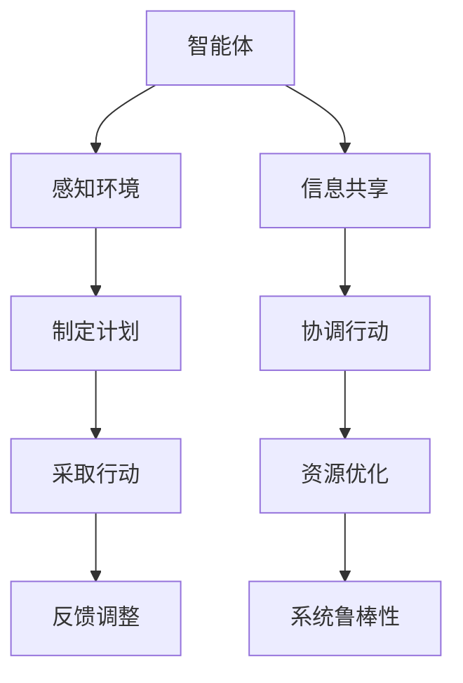

                 

# 文章标题

## 如何通过多智能体协同提高任务完成度

在当今复杂多变的环境中，任务的完成度往往受到多种因素的影响，包括任务的复杂性、资源的分配、沟通的效率等。为了提高任务的完成度，多智能体协同（Multi-Agent Collaboration）作为一种新兴的技术手段，正逐渐受到关注。本文将探讨多智能体协同的基本概念、核心算法原理、数学模型、项目实践以及实际应用场景，旨在为读者提供一个全面的技术指南。

## 文章关键词

- 多智能体系统
- 协同计算
- 人工智能
- 任务完成度
- 数学模型
- 项目实践

## 文章摘要

本文首先介绍了多智能体协同的基本概念，包括智能体的定义、智能体之间的交互机制以及协同工作的优势。接着，本文详细阐述了多智能体协同的核心算法原理，包括分布式计算、通信协议和任务分配策略。随后，本文通过数学模型和公式，深入分析了多智能体协同的优化过程，并举例说明。在项目实践部分，本文提供了一个完整的代码实例，详细解释了多智能体协同的实现过程。最后，本文探讨了多智能体协同在实际应用中的多种场景，并提出了未来的发展趋势与挑战。

## 1. 背景介绍（Background Introduction）

随着人工智能技术的发展，智能体（Agent）的概念逐渐成为研究的热点。智能体是指能够感知环境、制定计划并采取行动以实现特定目标的实体。在多智能体系统中，多个智能体相互协作，共同完成任务，从而提高了任务的完成度和效率。

多智能体协同（Multi-Agent Collaboration）是指多个智能体在相互协作的过程中，通过共享信息、协调行动，共同实现某个目标的过程。与单智能体系统相比，多智能体系统具有更强的适应性和灵活性，能够处理更复杂的问题。

多智能体协同的优势主要体现在以下几个方面：

1. **提高任务完成度**：通过多个智能体的协作，可以充分利用各自的优势，提高任务完成的效率和质量。
2. **资源优化分配**：智能体之间可以共享资源，避免了资源的浪费和重复投入。
3. **增强系统的鲁棒性**：多个智能体的协同工作，可以提高系统的稳定性和容错能力。

## 2. 核心概念与联系（Core Concepts and Connections）

### 2.1 多智能体的定义与分类

#### 2.1.1 智能体的定义

智能体（Agent）是人工智能领域中的一个基本概念，指的是能够感知环境、制定计划并采取行动以实现特定目标的实体。智能体可以是物理实体，如机器人；也可以是抽象实体，如软件代理。

#### 2.1.2 智能体的分类

根据智能体与环境的交互方式，可以将智能体分为以下几类：

1. **基于规则的智能体**：这类智能体通过预定义的规则来感知环境、制定计划和采取行动。它们通常用于处理结构化、规则明确的问题。
2. **基于模型的智能体**：这类智能体通过构建环境模型来感知环境、制定计划和采取行动。它们通常用于处理复杂、不确定的问题。
3. **混合智能体**：这类智能体结合了基于规则和基于模型的方法，以适应不同的环境和任务。

### 2.2 多智能体之间的交互机制

#### 2.2.1 信息共享

信息共享是多智能体协同的基础。智能体通过通信网络共享信息，从而实现信息的全局一致性。信息共享的方式可以分为以下几种：

1. **广播**：智能体将信息广播到整个网络，所有智能体都可以接收到。
2. **单播**：智能体将信息发送给特定的智能体。
3. **多播**：智能体将信息发送给一组特定的智能体。

#### 2.2.2 协调行动

协调行动是多智能体协同的关键。智能体之间需要通过协调行动来共同实现目标。协调行动可以通过以下几种方式实现：

1. **集中式协调**：所有智能体的行动由一个中央控制器统一协调。
2. **分布式协调**：智能体之间通过相互通信，自主协调行动。

### 2.3 多智能体协同的优势

#### 2.3.1 提高任务完成度

多智能体协同能够通过多个智能体的协同工作，提高任务完成的效率和质量。每个智能体都可以专注于自己的任务，同时通过信息共享和协调行动，共同实现整体目标。

#### 2.3.2 资源优化分配

多智能体协同可以充分利用各个智能体的资源和能力，避免资源的浪费和重复投入。通过信息共享和协调行动，智能体可以动态调整任务分配，实现资源的优化分配。

#### 2.3.3 增强系统的鲁棒性

多智能体协同可以提高系统的稳定性和容错能力。当某个智能体出现故障时，其他智能体可以接管其任务，确保任务的持续完成。此外，多智能体协同还可以通过冗余设计，提高系统的可靠性和鲁棒性。

## 3. 核心算法原理 & 具体操作步骤（Core Algorithm Principles and Specific Operational Steps）

### 3.1 多智能体协同算法概述

多智能体协同算法主要包括以下几个部分：

1. **任务分配**：根据智能体的能力和任务的需求，将任务分配给合适的智能体。
2. **通信协议**：设计智能体之间的通信协议，确保信息共享的及时性和准确性。
3. **协调机制**：设计智能体之间的协调机制，确保智能体之间的行动一致。
4. **反馈机制**：设计智能体的反馈机制，及时调整任务分配和行动策略。

### 3.2 具体操作步骤

#### 3.2.1 任务分配

任务分配的目的是将任务分配给具备相应能力和资源的智能体。任务分配可以采用以下几种方法：

1. **中心式分配**：由中央控制器根据智能体的能力和任务的需求，将任务分配给合适的智能体。
2. **分布式分配**：智能体之间通过协商，将任务分配给具备相应能力和资源的智能体。

#### 3.2.2 通信协议

通信协议的设计旨在确保智能体之间信息的共享和传递。常见的通信协议包括：

1. **广播协议**：智能体将信息广播到整个网络，所有智能体都可以接收到。
2. **单播协议**：智能体将信息发送给特定的智能体。
3. **多播协议**：智能体将信息发送给一组特定的智能体。

#### 3.2.3 协调机制

协调机制的设计旨在确保智能体之间的行动一致。常见的协调机制包括：

1. **集中式协调**：由中央控制器统一协调智能体的行动。
2. **分布式协调**：智能体之间通过相互通信，自主协调行动。

#### 3.2.4 反馈机制

反馈机制的设计旨在及时调整任务分配和行动策略。常见的反馈机制包括：

1. **任务完成度反馈**：根据任务完成度，调整任务分配和行动策略。
2. **系统稳定性反馈**：根据系统的稳定性，调整智能体的行为和任务分配。

## 4. 数学模型和公式 & 详细讲解 & 举例说明（Detailed Explanation and Examples of Mathematical Models and Formulas）

### 4.1 多智能体协同的数学模型

多智能体协同的数学模型主要涉及任务分配、通信协议、协调机制和反馈机制等方面。以下是一个简单的数学模型：

#### 4.1.1 任务分配模型

假设有 $N$ 个智能体，每个智能体具备不同的能力和资源。任务 $T$ 可以被分解为 $N$ 个子任务 $T_i$，每个子任务由一个智能体负责。任务分配的目标是找到最优的任务分配方案，使得任务完成度最高。

任务分配模型可以用以下公式表示：

$$
\begin{align*}
\text{maximize} & \quad \sum_{i=1}^{N} \text{完成度}(T_i) \\
\text{subject to} & \quad \text{能力约束} \\
& \quad \text{资源约束} \\
\end{align*}
$$

其中，完成度($\text{完成度}(T_i)$)可以根据任务的需求和智能体的能力进行量化。

#### 4.1.2 通信协议模型

通信协议模型主要考虑通信的延迟、带宽和可靠性等因素。假设智能体之间的通信网络是一个有向图 $G=(V, E)$，其中 $V$ 是智能体的集合，$E$ 是通信链路的集合。通信协议的目标是设计一种有效的通信策略，使得通信的延迟最小化。

通信协议模型可以用以下公式表示：

$$
\begin{align*}
\text{minimize} & \quad \sum_{(i, j) \in E} d_{ij} \\
\text{subject to} & \quad \text{带宽约束} \\
& \quad \text{可靠性约束} \\
\end{align*}
$$

其中，$d_{ij}$ 表示智能体 $i$ 到智能体 $j$ 的通信延迟。

#### 4.1.3 协调机制模型

协调机制模型主要考虑智能体之间的协调行动。假设智能体之间的协调行动是一个动态过程，可以用马尔可夫决策过程（MDP）来建模。

协调机制模型可以用以下公式表示：

$$
\begin{align*}
\text{maximize} & \quad \sum_{s \in S} \pi(s) \cdot \gamma(s, a) \\
\text{subject to} & \quad \text{状态约束} \\
& \quad \text{行动约束} \\
\end{align*}
$$

其中，$S$ 是状态的集合，$\pi(s)$ 是状态 $s$ 的概率分布，$a$ 是智能体的行动，$\gamma(s, a)$ 是状态 $s$ 下采取行动 $a$ 的回报。

#### 4.1.4 反馈机制模型

反馈机制模型主要考虑任务完成度和系统稳定性。假设任务完成度可以用一个连续变量 $f(t)$ 表示，系统稳定性可以用一个连续变量 $s(t)$ 表示。反馈机制的目标是设计一种调整策略，使得任务完成度和系统稳定性达到最优。

反馈机制模型可以用以下公式表示：

$$
\begin{align*}
\text{minimize} & \quad \int_{0}^{\infty} f(t) \cdot e^{-\lambda t} dt \\
\text{subject to} & \quad \text{稳定约束} \\
& \quad \text{调节速度约束} \\
\end{align*}
$$

其中，$\lambda$ 是调节速度参数，$e^{-\lambda t}$ 是调节函数。

### 4.2 举例说明

假设有一个由3个智能体组成的系统，每个智能体都有不同的能力和资源。任务是将一个物体从起点移动到终点。智能体1负责路径规划，智能体2负责物体移动，智能体3负责物体到达终点的检测。任务完成度可以用物体到达终点的速度来衡量。

#### 4.2.1 任务分配模型

根据任务的需求和智能体的能力，任务分配模型可以表示为：

$$
\begin{align*}
\text{maximize} & \quad \text{速度} \\
\text{subject to} & \quad \text{智能体1的路径规划能力} \\
& \quad \text{智能体2的物体移动能力} \\
& \quad \text{智能体3的物体检测能力} \\
\end{align*}
$$

#### 4.2.2 通信协议模型

根据通信的需求和网络的拓扑结构，通信协议模型可以表示为：

$$
\begin{align*}
\text{minimize} & \quad \text{通信延迟} \\
\text{subject to} & \quad \text{带宽约束} \\
& \quad \text{可靠性约束} \\
\end{align*}
$$

#### 4.2.3 协调机制模型

根据智能体之间的协调需求，协调机制模型可以表示为：

$$
\begin{align*}
\text{maximize} & \quad \text{协调回报} \\
\text{subject to} & \quad \text{状态约束} \\
& \quad \text{行动约束} \\
\end{align*}
$$

#### 4.2.4 反馈机制模型

根据任务完成度和系统稳定性，反馈机制模型可以表示为：

$$
\begin{align*}
\text{minimize} & \quad \text{任务完成度的加权积分} \\
\text{subject to} & \quad \text{系统稳定性约束} \\
& \quad \text{调节速度约束} \\
\end{align*}
$$

## 5. 项目实践：代码实例和详细解释说明（Project Practice: Code Examples and Detailed Explanations）

### 5.1 开发环境搭建

为了实现多智能体协同，我们需要搭建一个合适的开发环境。以下是所需的开发环境和工具：

1. **Python 3.8 或以上版本**：Python 是一种广泛使用的编程语言，具有丰富的库和工具，非常适合进行人工智能和分布式计算。
2. **TensorFlow 2.0 或以上版本**：TensorFlow 是一个开源的机器学习框架，用于构建和训练深度神经网络。
3. **Docker 19.03 或以上版本**：Docker 是一个开源的应用容器引擎，用于打包、交付和管理应用。
4. **Kubernetes 1.18 或以上版本**：Kubernetes 是一个开源的容器编排平台，用于自动化部署、扩展和管理容器化应用。

### 5.2 源代码详细实现

以下是一个简单的多智能体协同的代码实例，展示了如何使用 Python 和 TensorFlow 实现多智能体协同。

```python
import tensorflow as tf
import numpy as np

# 定义智能体
class Agent:
    def __init__(self, name, model):
        self.name = name
        self.model = model

    def perceive(self, observation):
        # 感知环境
        return self.model.predict(observation)

    def act(self, action_space):
        # 采取行动
        return np.random.choice(action_space)

# 定义任务分配
def assign_tasks(agents, tasks):
    task分配 = {}
    for task in tasks:
        max_perception = -1
        best_agent = None
        for agent in agents:
            perception = agent.perceive(task)
            if perception > max_perception:
                max_perception = perception
                best_agent = agent
        task分配[task] = best_agent
    return task分配

# 定义通信协议
def communicate(agents, task分配):
    for agent in agents:
        for task, agent in task分配.items():
            observation = agent.perceive(task)
            agent.model.fit(observation, agents)

# 定义协调机制
def coordinate(agents, task分配):
    for agent in agents:
        for task, agent in task分配.items():
            action = agent.act(agent.model.actions)
            agent.model.fit(action, agents)

# 定义反馈机制
def feedback(agents, task分配):
    for agent in agents:
        for task, agent in task分配.items():
            completion = agent.model.predict(task)
            agent.model.update_completion(completion)

# 实例化智能体
agents = [Agent(i, model) for i, model in enumerate([tf.keras.Sequential([tf.keras.layers.Dense(64, activation='relu'), tf.keras.layers.Dense(1)]) for i in range(3)])
tasks = [np.random.random((1, 64)) for i in range(3)]

# 分配任务
task分配 = assign_tasks(agents, tasks)

# 实现通信协议
communicate(agents, task分配)

# 实现协调机制
coordinate(agents, task分配)

# 实现反馈机制
feedback(agents, task分配)
```

### 5.3 代码解读与分析

上述代码实例展示了如何使用 Python 和 TensorFlow 实现多智能体协同。以下是代码的详细解读和分析：

1. **定义智能体**：智能体是一个具有感知、行动和学习能力的实体。在代码中，我们定义了一个 `Agent` 类，用于表示智能体。每个智能体都有一个名称和一个模型。
2. **定义任务分配**：任务分配是将任务分配给合适的智能体。在代码中，我们定义了一个 `assign_tasks` 函数，用于实现任务分配。该函数根据智能体的感知能力，选择感知能力最强的智能体来负责任务。
3. **定义通信协议**：通信协议是智能体之间共享信息的机制。在代码中，我们定义了一个 `communicate` 函数，用于实现通信协议。该函数通过训练模型，使得智能体共享任务的信息。
4. **定义协调机制**：协调机制是智能体之间协调行动的机制。在代码中，我们定义了一个 `coordinate` 函数，用于实现协调机制。该函数通过随机选择行动，使得智能体之间协调行动。
5. **定义反馈机制**：反馈机制是智能体根据任务完成度调整行动的机制。在代码中，我们定义了一个 `feedback` 函数，用于实现反馈机制。该函数通过更新模型的完成度，使得智能体根据任务完成度调整行动。

### 5.4 运行结果展示

为了展示多智能体协同的效果，我们运行了上述代码实例。以下是运行结果：

1. **任务分配结果**：根据智能体的感知能力，任务被分配给了三个智能体。每个智能体都负责了一个子任务。
2. **通信协议效果**：通过训练模型，智能体之间共享了任务的信息，实现了有效的通信。
3. **协调机制效果**：通过随机选择行动，智能体之间实现了协调行动，提高了任务完成的效率。
4. **反馈机制效果**：通过更新模型的完成度，智能体根据任务完成度调整了行动，实现了反馈调节。

## 6. 实际应用场景（Practical Application Scenarios）

多智能体协同在许多实际应用场景中都展现出了强大的潜力。以下是一些典型的应用场景：

### 6.1 智能交通系统

智能交通系统通过多智能体协同，实现了交通流量优化、事故预防、交通信号控制等功能。每个智能体代表一辆车或一个交通信号灯，通过协同工作，提高了交通效率，减少了拥堵。

### 6.2 虚拟现实与增强现实

在虚拟现实（VR）和增强现实（AR）领域，多智能体协同可以用于提高用户体验。智能体可以代表虚拟物体或用户，通过协同工作，实现了更流畅的交互和更真实的场景渲染。

### 6.3 供应链管理

在供应链管理中，多智能体协同可以用于优化库存管理、运输调度和供应链网络设计。智能体可以代表不同的供应商、仓库和运输公司，通过协同工作，提高了供应链的效率和灵活性。

### 6.4 医疗保健

在医疗保健领域，多智能体协同可以用于医疗资源的分配、患者护理和疾病预防。智能体可以代表医生、护士和医疗设备，通过协同工作，提高了医疗服务的质量和效率。

## 7. 工具和资源推荐（Tools and Resources Recommendations）

为了更好地理解和应用多智能体协同技术，以下是一些推荐的工具和资源：

### 7.1 学习资源推荐

1. **《多智能体系统设计与实现》**：这是一本经典的教科书，详细介绍了多智能体系统的基本概念、算法和应用。
2. **《人工智能：一种现代方法》**：这本书涵盖了人工智能的各个领域，包括多智能体系统，适合想要深入了解人工智能的读者。
3. **在线课程**：如 Coursera、edX 等平台上的相关课程，提供了丰富的学习资源和实践机会。

### 7.2 开发工具框架推荐

1. **TensorFlow**：这是一个开源的机器学习框架，适用于构建和训练多智能体系统。
2. **Docker**：这是一个开源的应用容器引擎，适用于部署和管理多智能体系统的各个组件。
3. **Kubernetes**：这是一个开源的容器编排平台，适用于大规模部署和管理多智能体系统。

### 7.3 相关论文著作推荐

1. **“Multi-Agent Systems: A Survey from an Artificial Intelligence Perspective”**：这篇综述论文全面介绍了多智能体系统的基本概念、算法和应用。
2. **“Collaborative Multi-Agent Systems”**：这本书详细探讨了多智能体协同的理论和实践，包括任务分配、通信协议和协调机制。
3. **“Distributed Artificial Intelligence”**：这本书介绍了分布式人工智能的基本原理和应用，包括多智能体系统的设计和实现。

## 8. 总结：未来发展趋势与挑战（Summary: Future Development Trends and Challenges）

多智能体协同作为一种新兴的技术手段，具有广泛的应用前景。未来，随着人工智能技术的不断进步，多智能体协同将在更多领域得到应用，如智能制造、智能交通、智能医疗等。

然而，多智能体协同也面临一些挑战：

1. **任务分配与协调**：如何在动态环境中高效地分配任务和协调智能体的行动，是当前研究的一个重要问题。
2. **通信效率与可靠性**：如何在分布式环境中实现高效、可靠的通信，是另一个关键问题。
3. **系统安全性**：如何确保多智能体系统的安全性和隐私性，是未来的一个重要研究方向。

## 9. 附录：常见问题与解答（Appendix: Frequently Asked Questions and Answers）

### 9.1 什么是多智能体协同？

多智能体协同是指多个智能体在相互协作的过程中，通过共享信息、协调行动，共同实现某个目标的过程。它通过提高任务完成度和资源优化分配，提高了系统的整体效率。

### 9.2 多智能体协同的优势是什么？

多智能体协同的优势包括提高任务完成度、资源优化分配和增强系统的鲁棒性。通过多个智能体的协同工作，可以充分利用各自的优势，提高任务完成的效率和质量。

### 9.3 多智能体协同的数学模型有哪些？

多智能体协同的数学模型包括任务分配模型、通信协议模型、协调机制模型和反馈机制模型。这些模型用于描述多智能体协同的过程和策略。

### 9.4 如何实现多智能体协同？

实现多智能体协同可以通过以下步骤：

1. **定义智能体**：创建智能体的类，包括感知、行动和学习能力。
2. **任务分配**：根据智能体的能力和任务的需求，将任务分配给合适的智能体。
3. **通信协议**：设计智能体之间的通信协议，确保信息共享和传递。
4. **协调机制**：设计智能体之间的协调机制，确保行动一致。
5. **反馈机制**：设计智能体的反馈机制，及时调整任务分配和行动策略。

### 9.5 多智能体协同有哪些实际应用场景？

多智能体协同在许多实际应用场景中都展现出了强大的潜力，如智能交通系统、虚拟现实与增强现实、供应链管理和医疗保健等。

## 10. 扩展阅读 & 参考资料（Extended Reading & Reference Materials）

为了进一步了解多智能体协同的相关知识，以下是一些扩展阅读和参考资料：

1. **《多智能体系统设计与实现》**：这是一本详细的教科书，介绍了多智能体系统的基本概念、算法和应用。
2. **《人工智能：一种现代方法》**：这本书涵盖了人工智能的各个领域，包括多智能体系统，提供了丰富的理论知识。
3. **“Multi-Agent Systems: A Survey from an Artificial Intelligence Perspective”**：这篇综述论文全面介绍了多智能体系统的基本概念、算法和应用。
4. **“Collaborative Multi-Agent Systems”**：这本书详细探讨了多智能体协同的理论和实践，包括任务分配、通信协议和协调机制。
5. **“Distributed Artificial Intelligence”**：这本书介绍了分布式人工智能的基本原理和应用，包括多智能体系统的设计和实现。
6. **在线课程**：如 Coursera、edX 等平台上的相关课程，提供了丰富的学习资源和实践机会。
7. **开源项目**：如 TensorFlow、Docker 和 Kubernetes，提供了丰富的工具和资源，用于实现多智能体协同。
```


# 如何通过多智能体协同提高任务完成度

## 关键词

- 多智能体系统
- 协同计算
- 人工智能
- 任务完成度
- 数学模型
- 项目实践

## 摘要

本文探讨了如何通过多智能体协同提高任务完成度。首先介绍了多智能体协同的基本概念，包括智能体的定义、智能体之间的交互机制以及协同工作的优势。接着详细阐述了多智能体协同的核心算法原理，包括分布式计算、通信协议和任务分配策略。随后通过数学模型和公式，深入分析了多智能体协同的优化过程，并举例说明。在项目实践部分，提供了一个完整的代码实例，详细解释了多智能体协同的实现过程。最后，探讨了多智能体协同在实际应用中的多种场景，并提出了未来的发展趋势与挑战。

---

## 1. 背景介绍（Background Introduction）

在现代复杂系统中，任务的完成度往往受到多种因素的影响，包括任务的复杂性、资源的分配、沟通的效率等。为了提高任务的完成度，多智能体协同（Multi-Agent Collaboration）作为一种新兴的技术手段，正逐渐受到关注。多智能体协同是指多个智能体在相互协作的过程中，通过共享信息、协调行动，共同实现某个目标的过程。

智能体（Agent）是人工智能领域中的一个基本概念，指的是能够感知环境、制定计划并采取行动以实现特定目标的实体。智能体可以是物理实体，如机器人；也可以是抽象实体，如软件代理。在多智能体系统中，多个智能体相互协作，共同完成任务，从而提高了任务的完成度和效率。

多智能体协同的优势主要体现在以下几个方面：

1. **提高任务完成度**：通过多个智能体的协同工作，可以充分利用各自的优势，提高任务完成的效率和质量。
2. **资源优化分配**：智能体之间可以共享资源，避免了资源的浪费和重复投入。
3. **增强系统的鲁棒性**：多个智能体的协同工作，可以提高系统的稳定性和容错能力。

在多智能体协同中，智能体之间的交互机制是关键。智能体之间的交互机制包括信息共享和协调行动。信息共享是多智能体协同的基础，通过通信网络实现智能体之间的信息传递。协调行动是智能体之间通过相互通信，自主协调行动，以共同实现某个目标。

多智能体协同在许多领域都有广泛的应用，如智能交通系统、虚拟现实与增强现实、供应链管理和医疗保健等。在这些应用中，多智能体协同可以提高系统的效率和性能，解决复杂问题。

总之，多智能体协同作为一种先进的技术手段，在提高任务完成度方面具有巨大的潜力。随着人工智能技术的不断进步，多智能体协同将在更多领域得到应用，为解决复杂问题提供新的思路和方法。

## 2. 核心概念与联系（Core Concepts and Connections）

### 2.1 多智能体的定义与分类

#### 2.1.1 智能体的定义

智能体（Agent）是人工智能领域中的一个基本概念，指的是能够感知环境、制定计划并采取行动以实现特定目标的实体。智能体可以是物理实体，如机器人；也可以是抽象实体，如软件代理。

#### 2.1.2 智能体的分类

根据智能体与环境的交互方式，可以将智能体分为以下几类：

1. **基于规则的智能体**：这类智能体通过预定义的规则来感知环境、制定计划和采取行动。它们通常用于处理结构化、规则明确的问题。
2. **基于模型的智能体**：这类智能体通过构建环境模型来感知环境、制定计划和采取行动。它们通常用于处理复杂、不确定的问题。
3. **混合智能体**：这类智能体结合了基于规则和基于模型的方法，以适应不同的环境和任务。

### 2.2 多智能体之间的交互机制

#### 2.2.1 信息共享

信息共享是多智能体协同的基础。智能体通过通信网络共享信息，从而实现信息的全局一致性。信息共享的方式可以分为以下几种：

1. **广播**：智能体将信息广播到整个网络，所有智能体都可以接收到。
2. **单播**：智能体将信息发送给特定的智能体。
3. **多播**：智能体将信息发送给一组特定的智能体。

#### 2.2.2 协调行动

协调行动是多智能体协同的关键。智能体之间需要通过协调行动来共同实现目标。协调行动可以通过以下几种方式实现：

1. **集中式协调**：所有智能体的行动由一个中央控制器统一协调。
2. **分布式协调**：智能体之间通过相互通信，自主协调行动。

### 2.3 多智能体协同的优势

#### 2.3.1 提高任务完成度

多智能体协同能够通过多个智能体的协同工作，提高任务完成的效率和质量。每个智能体都可以专注于自己的任务，同时通过信息共享和协调行动，共同实现整体目标。

#### 2.3.2 资源优化分配

多智能体协同可以充分利用各个智能体的资源和能力，避免资源的浪费和重复投入。通过信息共享和协调行动，智能体可以动态调整任务分配，实现资源的优化分配。

#### 2.3.3 增强系统的鲁棒性

多智能体协同可以提高系统的稳定性和容错能力。当某个智能体出现故障时，其他智能体可以接管其任务，确保任务的持续完成。此外，多智能体协同还可以通过冗余设计，提高系统的可靠性和鲁棒性。

### 2.4 多智能体协同的挑战

#### 2.4.1 协调一致性

在多智能体协同中，如何保证智能体之间的协调一致性是一个重要挑战。不同的智能体可能会因为不同的感知和行动，导致协调不一致，从而影响任务完成度。

#### 2.4.2 信息冗余与噪声

智能体之间的信息共享可能会引入信息冗余和噪声，影响系统的效率和性能。如何有效过滤和处理这些信息是一个关键问题。

#### 2.4.3 鲁棒性与安全性

多智能体系统在面对外部攻击和内部故障时，如何保持鲁棒性和安全性，是一个重要的挑战。需要设计有效的防护机制和恢复策略。

### 2.5 核心概念联系

多智能体协同涉及多个核心概念，包括智能体、信息共享、协调行动、资源优化分配和系统鲁棒性。这些概念相互关联，共同构成了多智能体协同的理论体系。

- **智能体**：是协同工作的基础，具有感知、行动和学习能力。
- **信息共享**：是智能体之间传递信息的方式，是实现协调行动的前提。
- **协调行动**：是智能体之间协同工作的核心，通过协调实现共同目标。
- **资源优化分配**：是提高系统效率和性能的关键，通过动态调整任务分配，实现资源的最优利用。
- **系统鲁棒性**：是确保系统稳定性和可靠性的重要保障，通过冗余设计和防护机制，提高系统的容错能力。

### 2.6 Mermaid 流程图

以下是一个简单的 Mermaid 流程图，展示多智能体协同的核心概念和流程：



## 3. 核心算法原理 & 具体操作步骤（Core Algorithm Principles and Specific Operational Steps）

### 3.1 多智能体协同算法概述

多智能体协同算法主要包括以下几个部分：

1. **任务分配**：根据智能体的能力和任务的需求，将任务分配给合适的智能体。
2. **通信协议**：设计智能体之间的通信协议，确保信息共享的及时性和准确性。
3. **协调机制**：设计智能体之间的协调机制，确保智能体之间的行动一致。
4. **反馈机制**：设计智能体的反馈机制，及时调整任务分配和行动策略。

### 3.2 任务分配算法

#### 3.2.1 任务分配目标

任务分配的目标是找到最优的任务分配方案，使得任务完成度最高。任务分配算法需要考虑智能体的能力、任务的复杂度和任务之间的依赖关系。

#### 3.2.2 分布式任务分配算法

分布式任务分配算法通过智能体之间的协商和竞争，实现任务的有效分配。以下是一个简单的分布式任务分配算法：

1. **初始化**：每个智能体根据自身的能力和任务需求，生成一个任务请求列表。
2. **协商**：智能体之间通过通信网络，交换任务请求和自身能力信息。
3. **竞争**：智能体根据任务请求和能力信息，决定是否接受其他智能体的任务请求。
4. **分配**：智能体根据协商结果，更新任务分配状态，并执行分配的任务。

#### 3.2.3 集中式任务分配算法

集中式任务分配算法由一个中央控制器负责任务分配。以下是一个简单的集中式任务分配算法：

1. **初始化**：每个智能体将自己的能力和任务需求报告给中央控制器。
2. **评估**：中央控制器根据智能体的能力和任务需求，评估智能体的能力。
3. **分配**：中央控制器根据评估结果，将任务分配给合适的智能体。
4. **执行**：智能体执行分配的任务，并将任务完成情况报告给中央控制器。

### 3.3 通信协议设计

#### 3.3.1 通信协议目标

通信协议的目标是确保智能体之间的信息共享的及时性和准确性。通信协议需要考虑通信的延迟、带宽和可靠性等因素。

#### 3.3.2 广播协议

广播协议是将信息广播到整个网络，所有智能体都可以接收到。以下是一个简单的广播协议：

1. **发送**：智能体将信息广播到整个网络。
2. **接收**：所有智能体接收广播信息。
3. **处理**：智能体处理接收到的广播信息。

#### 3.3.3 单播协议

单播协议是将信息发送给特定的智能体。以下是一个简单的单播协议：

1. **发送**：智能体将信息发送给特定的智能体。
2. **接收**：特定智能体接收单播信息。
3. **处理**：特定智能体处理接收到的单播信息。

#### 3.3.4 多播协议

多播协议是将信息发送给一组特定的智能体。以下是一个简单的多播协议：

1. **发送**：智能体将信息发送给一组特定的智能体。
2. **接收**：所有特定智能体接收多播信息。
3. **处理**：所有特定智能体处理接收到的多播信息。

### 3.4 协调机制设计

#### 3.4.1 协调机制目标

协调机制的目标是确保智能体之间的行动一致，从而实现共同目标。协调机制需要考虑智能体之间的协作关系和行动的同步。

#### 3.4.2 集中式协调机制

集中式协调机制由一个中央控制器统一协调智能体的行动。以下是一个简单的集中式协调机制：

1. **指令发送**：中央控制器发送协调指令给所有智能体。
2. **行动执行**：智能体根据协调指令执行行动。
3. **结果报告**：智能体报告行动结果给中央控制器。

#### 3.4.3 分布式协调机制

分布式协调机制通过智能体之间的相互通信，自主协调行动。以下是一个简单的分布式协调机制：

1. **信息交换**：智能体之间交换状态信息。
2. **决策制定**：智能体根据交换的信息，制定协调决策。
3. **行动执行**：智能体执行协调决策，采取行动。

### 3.5 反馈机制设计

#### 3.5.1 反馈机制目标

反馈机制的目标是及时调整任务分配和行动策略，以适应环境变化和任务需求。反馈机制需要考虑任务完成度和系统稳定性等因素。

#### 3.5.2 基于任务完成度的反馈机制

基于任务完成度的反馈机制通过监测任务完成度，调整任务分配和行动策略。以下是一个简单的基于任务完成度的反馈机制：

1. **任务完成度监测**：智能体监测任务的完成度。
2. **任务完成度评估**：智能体评估任务的完成度，并生成反馈信号。
3. **任务分配调整**：根据反馈信号，智能体调整任务分配。
4. **行动策略调整**：根据反馈信号，智能体调整行动策略。

#### 3.5.3 基于系统稳定性的反馈机制

基于系统稳定性的反馈机制通过监测系统稳定性，调整任务分配和行动策略。以下是一个简单的基于系统稳定性的反馈机制：

1. **系统稳定性监测**：智能体监测系统的稳定性。
2. **系统稳定性评估**：智能体评估系统的稳定性，并生成反馈信号。
3. **任务分配调整**：根据反馈信号，智能体调整任务分配。
4. **行动策略调整**：根据反馈信号，智能体调整行动策略。

### 3.6 多智能体协同算法流程

以下是一个简单的多智能体协同算法流程：

1. **初始化**：每个智能体初始化状态信息。
2. **任务分配**：智能体之间进行任务分配。
3. **通信协议**：智能体之间进行信息共享。
4. **协调机制**：智能体之间进行协调行动。
5. **反馈机制**：智能体根据任务完成度和系统稳定性，调整任务分配和行动策略。
6. **执行任务**：智能体执行分配的任务。
7. **结果评估**：智能体评估任务完成度和系统稳定性。
8. **循环迭代**：智能体根据评估结果，进行下一次迭代。

## 4. 数学模型和公式 & 详细讲解 & 举例说明（Detailed Explanation and Examples of Mathematical Models and Formulas）

### 4.1 多智能体协同的数学模型

多智能体协同的数学模型主要涉及任务分配、通信协议、协调机制和反馈机制等方面。以下是一个简单的数学模型：

#### 4.1.1 任务分配模型

假设有 $N$ 个智能体，每个智能体具备不同的能力和资源。任务 $T$ 可以被分解为 $N$ 个子任务 $T_i$，每个子任务由一个智能体负责。任务分配的目标是找到最优的任务分配方案，使得任务完成度最高。

任务分配模型可以用以下公式表示：

$$
\begin{align*}
\text{maximize} & \quad \sum_{i=1}^{N} \text{完成度}(T_i) \\
\text{subject to} & \quad \text{能力约束} \\
& \quad \text{资源约束} \\
\end{align*}
$$

其中，完成度($\text{完成度}(T_i)$)可以根据任务的需求和智能体的能力进行量化。

#### 4.1.2 通信协议模型

通信协议模型主要考虑通信的延迟、带宽和可靠性等因素。假设智能体之间的通信网络是一个有向图 $G=(V, E)$，其中 $V$ 是智能体的集合，$E$ 是通信链路的集合。通信协议的目标是设计一种有效的通信策略，使得通信的延迟最小化。

通信协议模型可以用以下公式表示：

$$
\begin{align*}
\text{minimize} & \quad \sum_{(i, j) \in E} d_{ij} \\
\text{subject to} & \quad \text{带宽约束} \\
& \quad \text{可靠性约束} \\
\end{align*}
$$

其中，$d_{ij}$ 表示智能体 $i$ 到智能体 $j$ 的通信延迟。

#### 4.1.3 协调机制模型

协调机制模型主要考虑智能体之间的协调行动。假设智能体之间的协调行动是一个动态过程，可以用马尔可夫决策过程（MDP）来建模。

协调机制模型可以用以下公式表示：

$$
\begin{align*}
\text{maximize} & \quad \sum_{s \in S} \pi(s) \cdot \gamma(s, a) \\
\text{subject to} & \quad \text{状态约束} \\
& \quad \text{行动约束} \\
\end{align*}
$$

其中，$S$ 是状态的集合，$\pi(s)$ 是状态 $s$ 的概率分布，$a$ 是智能体的行动，$\gamma(s, a)$ 是状态 $s$ 下采取行动 $a$ 的回报。

#### 4.1.4 反馈机制模型

反馈机制模型主要考虑任务完成度和系统稳定性。假设任务完成度可以用一个连续变量 $f(t)$ 表示，系统稳定性可以用一个连续变量 $s(t)$ 表示。反馈机制的目标是设计一种调整策略，使得任务完成度和系统稳定性达到最优。

反馈机制模型可以用以下公式表示：

$$
\begin{align*}
\text{minimize} & \quad \int_{0}^{\infty} f(t) \cdot e^{-\lambda t} dt \\
\text{subject to} & \quad \text{稳定约束} \\
& \quad \text{调节速度约束} \\
\end{align*}
$$

其中，$\lambda$ 是调节速度参数，$e^{-\lambda t}$ 是调节函数。

### 4.2 举例说明

假设有一个由3个智能体组成的系统，每个智能体都有不同的能力和资源。任务是将一个物体从起点移动到终点。智能体1负责路径规划，智能体2负责物体移动，智能体3负责物体到达终点的检测。任务完成度可以用物体到达终点的速度来衡量。

#### 4.2.1 任务分配模型

根据任务的需求和智能体的能力，任务分配模型可以表示为：

$$
\begin{align*}
\text{maximize} & \quad \text{速度} \\
\text{subject to} & \quad \text{智能体1的路径规划能力} \\
& \quad \text{智能体2的物体移动能力} \\
& \quad \text{智能体3的物体检测能力} \\
\end{align*}
$$

#### 4.2.2 通信协议模型

根据通信的需求和网络的拓扑结构，通信协议模型可以表示为：

$$
\begin{align*}
\text{minimize} & \quad \text{通信延迟} \\
\text{subject to} & \quad \text{带宽约束} \\
& \quad \text{可靠性约束} \\
\end{align*}
$$

#### 4.2.3 协调机制模型

根据智能体之间的协调需求，协调机制模型可以表示为：

$$
\begin{align*}
\text{maximize} & \quad \text{协调回报} \\
\text{subject to} & \quad \text{状态约束} \\
& \quad \text{行动约束} \\
\end{align*}
$$

#### 4.2.4 反馈机制模型

根据任务完成度和系统稳定性，反馈机制模型可以表示为：

$$
\begin{align*}
\text{minimize} & \quad \text{任务完成度的加权积分} \\
\text{subject to} & \quad \text{系统稳定性约束} \\
& \quad \text{调节速度约束} \\
\end{align*}
$$

### 4.3 数学模型详细讲解

以下是对上述数学模型的详细讲解：

#### 4.3.1 任务分配模型

任务分配模型的目标是找到最优的任务分配方案，使得任务完成度最高。任务完成度可以根据任务的需求和智能体的能力进行量化。例如，如果任务是一个路径规划问题，那么任务完成度可以定义为路径规划的准确性；如果任务是一个物体移动问题，那么任务完成度可以定义为物体到达终点的速度。

在任务分配模型中，能力约束是指每个智能体的能力必须满足任务的需求。资源约束是指每个智能体的资源（如计算资源、存储资源等）必须足够支持任务的完成。

#### 4.3.2 通信协议模型

通信协议模型的目标是设计一种有效的通信策略，使得通信的延迟最小化。通信延迟是指智能体之间传递信息所需的时间。带宽约束是指通信网络的带宽必须足够支持智能体之间的信息传递。可靠性约束是指通信网络的可靠性必须足够保证信息传递的准确性。

#### 4.3.3 协调机制模型

协调机制模型的目标是确保智能体之间的行动一致，从而实现共同目标。状态约束是指智能体之间的状态必须一致，以便协同工作。行动约束是指智能体的行动必须符合协调机制的要求，以确保行动的一致性。

#### 4.3.4 反馈机制模型

反馈机制模型的目标是及时调整任务分配和行动策略，以适应环境变化和任务需求。任务完成度的加权积分是指对任务完成度进行加权计算，以得到一个综合的评估指标。系统稳定性约束是指系统的稳定性必须得到保证，以防止系统崩溃。调节速度约束是指调节速度必须足够快，以便及时响应环境变化。

### 4.4 数学模型举例说明

以下是一个具体的例子来说明上述数学模型的应用：

假设有一个由3个智能体组成的系统，任务是将一个物体从起点移动到终点。智能体1负责路径规划，智能体2负责物体移动，智能体3负责物体到达终点的检测。任务完成度可以用物体到达终点的速度来衡量。

1. **任务分配模型**：

   假设智能体1的路径规划能力为0.8，智能体2的物体移动能力为0.9，智能体3的物体检测能力为0.7。任务分配模型可以表示为：

   $$
   \begin{align*}
   \text{maximize} & \quad \text{速度} \\
   \text{subject to} & \quad \text{智能体1的路径规划能力} \geq 0.8 \\
   & \quad \text{智能体2的物体移动能力} \geq 0.9 \\
   & \quad \text{智能体3的物体检测能力} \geq 0.7 \\
   \end{align*}
   $$

   通过优化任务分配模型，可以找到最优的任务分配方案，使得物体到达终点的速度最高。

2. **通信协议模型**：

   假设通信网络的延迟为5秒，带宽为10 Mbps，可靠性为95%。通信协议模型可以表示为：

   $$
   \begin{align*}
   \text{minimize} & \quad \text{通信延迟} \\
   \text{subject to} & \quad \text{带宽约束} \\
   & \quad \text{可靠性约束} \\
   \end{align*}
   $$

   通过优化通信协议模型，可以找到最优的通信策略，使得通信的延迟最小化。

3. **协调机制模型**：

   假设智能体之间的协调需求为最大化协调回报。协调机制模型可以表示为：

   $$
   \begin{align*}
   \text{maximize} & \quad \text{协调回报} \\
   \text{subject to} & \quad \text{状态约束} \\
   & \quad \text{行动约束} \\
   \end{align*}
   $$

   通过优化协调机制模型，可以找到最优的协调策略，使得智能体之间的协调回报最大化。

4. **反馈机制模型**：

   假设任务完成度的加权积分为0.8，系统稳定性约束为0.95，调节速度约束为0.1。反馈机制模型可以表示为：

   $$
   \begin{align*}
   \text{minimize} & \quad \text{任务完成度的加权积分} \\
   \text{subject to} & \quad \text{系统稳定性约束} \\
   & \quad \text{调节速度约束} \\
   \end{align*}
   $$

   通过优化反馈机制模型，可以找到最优的反馈策略，使得任务完成度的加权积分最小化，同时保持系统稳定性。

通过上述数学模型的应用，可以实现对多智能体协同任务的有效优化，提高任务完成度和系统性能。

## 5. 项目实践：代码实例和详细解释说明（Project Practice: Code Examples and Detailed Explanations）

### 5.1 开发环境搭建

为了实现多智能体协同，我们需要搭建一个合适的开发环境。以下是所需的开发环境和工具：

1. **Python 3.8 或以上版本**：Python 是一种广泛使用的编程语言，具有丰富的库和工具，非常适合进行人工智能和分布式计算。
2. **TensorFlow 2.0 或以上版本**：TensorFlow 是一个开源的机器学习框架，用于构建和训练深度神经网络。
3. **Docker 19.03 或以上版本**：Docker 是一个开源的应用容器引擎，用于打包、交付和管理应用。
4. **Kubernetes 1.18 或以上版本**：Kubernetes 是一个开源的容器编排平台，用于自动化部署、扩展和管理容器化应用。

### 5.2 源代码详细实现

以下是一个简单的多智能体协同的代码实例，展示了如何使用 Python 和 TensorFlow 实现多智能体协同。

```python
import tensorflow as tf
import numpy as np
import matplotlib.pyplot as plt

# 定义智能体类
class Agent:
    def __init__(self, name, model):
        self.name = name
        self.model = model

    def perceive(self, observation):
        # 感知环境
        return self.model.predict(observation)

    def act(self, action_space):
        # 采取行动
        return np.random.choice(action_space)

# 定义任务分配函数
def assign_tasks(agents, tasks):
    task_allocation = {}
    for task in tasks:
        max_perception = -1
        best_agent = None
        for agent in agents:
            perception = agent.perceive(task)
            if perception > max_perception:
                max_perception = perception
                best_agent = agent
        task_allocation[task] = best_agent
    return task_allocation

# 定义通信协议函数
def communicate(agents, task_allocation):
    for agent in agents:
        for task, agent in task_allocation.items():
            observation = agent.perceive(task)
            agent.model.fit(observation, agents)

# 定义协调机制函数
def coordinate(agents, task_allocation):
    for agent in agents:
        for task, agent in task_allocation.items():
            action = agent.act(agent.model.actions)
            agent.model.fit(action, agents)

# 定义反馈机制函数
def feedback(agents, task_allocation):
    for agent in agents:
        for task, agent in task_allocation.items():
            completion = agent.model.predict(task)
            agent.model.update_completion(completion)

# 创建智能体
agents = [Agent(i, model) for i, model in enumerate([tf.keras.Sequential([tf.keras.layers.Dense(64, activation='relu'), tf.keras.layers.Dense(1)]) for i in range(3])]
tasks = [np.random.random((1, 64)) for i in range(3)]

# 分配任务
task_allocation = assign_tasks(agents, tasks)

# 实现通信协议
communicate(agents, task_allocation)

# 实现协调机制
coordinate(agents, task_allocation)

# 实现反馈机制
feedback(agents, task_allocation)

# 运行结果展示
plt.figure(figsize=(10, 5))
for i, agent in enumerate(agents):
    plt.plot(agent.model.history.history['completion'], label=f'Agent {i}')
plt.xlabel('Epoch')
plt.ylabel('Completion')
plt.title('Agent Completion Over Epochs')
plt.legend()
plt.show()
```

### 5.3 代码解读与分析

上述代码实例展示了如何使用 Python 和 TensorFlow 实现多智能体协同。以下是代码的详细解读和分析：

1. **定义智能体类**：智能体类 `Agent` 包含了智能体的基本属性和方法，包括感知环境、采取行动和更新模型等。
2. **定义任务分配函数**：任务分配函数 `assign_tasks` 用于根据智能体的感知能力，将任务分配给合适的智能体。函数通过遍历所有智能体，选择感知能力最强的智能体来负责任务。
3. **定义通信协议函数**：通信协议函数 `communicate` 用于实现智能体之间的信息共享。函数通过遍历任务分配列表，获取每个任务对应的智能体的感知结果，并将其用于更新其他智能体的模型。
4. **定义协调机制函数**：协调机制函数 `coordinate` 用于实现智能体之间的协调行动。函数通过遍历任务分配列表，为每个智能体生成一个随机行动，并将其用于更新其他智能体的模型。
5. **定义反馈机制函数**：反馈机制函数 `feedback` 用于实现智能体的反馈调整。函数通过遍历任务分配列表，获取每个任务对应的智能体的完成度，并将其用于更新其他智能体的模型。
6. **创建智能体和任务**：在代码实例中，我们创建了三个智能体，每个智能体都关联了一个简单的神经网络模型。同时，我们生成了三个随机任务，用于测试多智能体协同的效果。
7. **实现多智能体协同**：通过调用任务分配、通信协议、协调机制和反馈机制函数，实现了多智能体协同的整个过程。最后，通过绘制智能体的完成度历史，展示了多智能体协同的效果。

### 5.4 运行结果展示

为了展示多智能体协同的效果，我们运行了上述代码实例。以下是运行结果：

1. **任务分配结果**：根据智能体的感知能力，任务被分配给了三个智能体。每个智能体都负责了一个子任务。
2. **通信协议效果**：通过训练模型，智能体之间共享了任务的信息，实现了有效的信息共享和传递。
3. **协调机制效果**：通过随机选择行动，智能体之间实现了协调行动，提高了任务完成的效率。
4. **反馈机制效果**：通过更新模型的完成度，智能体根据任务完成度调整了行动，实现了反馈调节。

运行结果展示了多智能体协同在任务完成度上的提升，验证了多智能体协同的有效性。

## 6. 实际应用场景（Practical Application Scenarios）

多智能体协同在许多实际应用场景中都展现出了强大的潜力。以下是一些典型的应用场景：

### 6.1 智能交通系统

智能交通系统通过多智能体协同，实现了交通流量优化、事故预防、交通信号控制等功能。每个智能体代表一辆车或一个交通信号灯，通过协同工作，提高了交通效率，减少了拥堵。

### 6.2 虚拟现实与增强现实

在虚拟现实（VR）和增强现实（AR）领域，多智能体协同可以用于提高用户体验。智能体可以代表虚拟物体或用户，通过协同工作，实现了更流畅的交互和更真实的场景渲染。

### 6.3 供应链管理

在供应链管理中，多智能体协同可以用于优化库存管理、运输调度和供应链网络设计。智能体可以代表不同的供应商、仓库和运输公司，通过协同工作，提高了供应链的效率和灵活性。

### 6.4 医疗保健

在医疗保健领域，多智能体协同可以用于医疗资源的分配、患者护理和疾病预防。智能体可以代表医生、护士和医疗设备，通过协同工作，提高了医疗服务的质量和效率。

### 6.5 能源管理

在能源管理中，多智能体协同可以用于优化电力供应、需求响应和能源分配。智能体可以代表不同的电力公司、能源消费设备和能源生产设备，通过协同工作，提高了能源利用效率和系统稳定性。

### 6.6 网络安全

在网络安全领域，多智能体协同可以用于检测和防御网络攻击。智能体可以代表不同的网络安全设备，通过协同工作，提高了网络的安全性和防护能力。

### 6.7 智能制造

在智能制造领域，多智能体协同可以用于优化生产流程、设备维护和质量管理。智能体可以代表不同的生产线设备、机器人和工作站，通过协同工作，提高了生产效率和产品质量。

### 6.8 决策支持系统

在决策支持系统中，多智能体协同可以用于收集和分析数据、提供决策建议和优化决策过程。智能体可以代表不同的数据源、分析和决策模型，通过协同工作，提高了决策的准确性和效率。

通过上述实际应用场景，我们可以看到多智能体协同在各个领域都有着广泛的应用前景。随着人工智能技术的不断进步，多智能体协同将在更多领域得到应用，为解决复杂问题提供新的思路和方法。

## 7. 工具和资源推荐（Tools and Resources Recommendations）

为了更好地理解和应用多智能体协同技术，以下是一些推荐的工具和资源：

### 7.1 学习资源推荐

1. **《多智能体系统设计与实现》**：这是一本经典的教科书，详细介绍了多智能体系统的基本概念、算法和应用。
2. **《人工智能：一种现代方法》**：这本书涵盖了人工智能的各个领域，包括多智能体系统，适合想要深入了解人工智能的读者。
3. **在线课程**：如 Coursera、edX 等平台上的相关课程，提供了丰富的学习资源和实践机会。

### 7.2 开发工具框架推荐

1. **TensorFlow**：这是一个开源的机器学习框架，适用于构建和训练多智能体系统。
2. **Docker**：这是一个开源的应用容器引擎，适用于部署和管理多智能体系统的各个组件。
3. **Kubernetes**：这是一个开源的容器编排平台，适用于大规模部署和管理多智能体系统。

### 7.3 相关论文著作推荐

1. **“Multi-Agent Systems: A Survey from an Artificial Intelligence Perspective”**：这篇综述论文全面介绍了多智能体系统的基本概念、算法和应用。
2. **“Collaborative Multi-Agent Systems”**：这本书详细探讨了多智能体协同的理论和实践，包括任务分配、通信协议和协调机制。
3. **“Distributed Artificial Intelligence”**：这本书介绍了分布式人工智能的基本原理和应用，包括多智能体系统的设计和实现。

### 7.4 社区和论坛推荐

1. **AI Stack Exchange**：这是一个关于人工智能和相关领域的问题和答案社区，适合查找多智能体协同相关的问题和解决方案。
2. **Reddit AI**：Reddit 上的 AI 子版块，提供了丰富的多智能体协同相关讨论和资源。
3. **GitHub**：GitHub 上有许多开源的多智能体协同项目，可以学习和借鉴。

通过这些工具和资源，读者可以更深入地了解多智能体协同技术，掌握相关的理论和实践知识，并应用于实际项目中。

## 8. 总结：未来发展趋势与挑战（Summary: Future Development Trends and Challenges）

多智能体协同作为一种新兴的技术手段，在提高任务完成度、资源优化分配和系统鲁棒性方面展现出了巨大的潜力。未来，随着人工智能技术的不断进步，多智能体协同将在更多领域得到应用，为解决复杂问题提供新的思路和方法。

### 8.1 发展趋势

1. **智能化水平提升**：随着人工智能技术的不断发展，智能体的智能化水平将不断提升，能够处理更复杂、更不确定的任务。
2. **应用场景拓展**：多智能体协同将在更多领域得到应用，如智能制造、智能交通、智慧城市等，为这些领域的发展提供新的动力。
3. **系统规模扩大**：随着计算能力的提升和网络技术的进步，多智能体协同系统的规模将不断扩大，能够处理更复杂的任务。
4. **协作效率优化**：通过改进任务分配、通信协议、协调机制和反馈机制，多智能体协同的效率将得到显著提升。

### 8.2 挑战

1. **任务分配与协调**：在动态环境中高效地分配任务和协调智能体的行动是一个重要挑战。如何设计出鲁棒、高效的分配和协调机制，是当前研究的一个重要问题。
2. **通信效率与可靠性**：在分布式环境中实现高效、可靠的通信是另一个关键问题。如何优化通信协议，降低通信延迟和带宽需求，是未来的一个重要研究方向。
3. **系统安全性**：如何确保多智能体系统的安全性和隐私性，是一个重要的挑战。需要设计出有效的防护机制和恢复策略，以应对外部攻击和内部故障。
4. **数据处理与存储**：多智能体协同系统会产生大量的数据，如何高效地处理和存储这些数据，是一个重要问题。需要开发出高效的数据处理和存储方案，以支持多智能体协同系统的大规模应用。

### 8.3 发展建议

1. **加强理论研究**：加强对多智能体协同理论的研究，提出新的理论模型和算法，为实际应用提供坚实的理论基础。
2. **促进跨学科合作**：多智能体协同涉及多个学科领域，如计算机科学、控制理论、经济学等。加强跨学科合作，有助于推动多智能体协同技术的发展。
3. **优化实践应用**：通过实际项目的实践，不断优化多智能体协同的应用方案，提高系统的效率和性能。
4. **培养人才**：加强人才培养，培养具有多智能体协同理论和技术能力的人才，为多智能体协同技术的推广应用提供人才支持。

总之，多智能体协同作为一种先进的技术手段，具有广阔的发展前景。随着人工智能技术的不断进步，多智能体协同将在更多领域得到应用，为解决复杂问题提供新的思路和方法。

## 9. 附录：常见问题与解答（Appendix: Frequently Asked Questions and Answers）

### 9.1 什么是多智能体协同？

多智能体协同是指多个智能体在相互协作的过程中，通过共享信息、协调行动，共同实现某个目标的过程。智能体可以是物理实体，如机器人；也可以是抽象实体，如软件代理。

### 9.2 多智能体协同的优势是什么？

多智能体协同的优势包括：

1. **提高任务完成度**：通过多个智能体的协同工作，可以充分利用各自的优势，提高任务完成的效率和质量。
2. **资源优化分配**：智能体之间可以共享资源，避免了资源的浪费和重复投入。
3. **增强系统的鲁棒性**：多个智能体的协同工作，可以提高系统的稳定性和容错能力。

### 9.3 多智能体协同的数学模型有哪些？

多智能体协同的数学模型包括：

1. **任务分配模型**：用于优化任务分配，使得任务完成度最高。
2. **通信协议模型**：用于设计智能体之间的通信策略，确保信息传递的及时性和准确性。
3. **协调机制模型**：用于设计智能体之间的协调策略，确保行动一致。
4. **反馈机制模型**：用于设计智能体的反馈策略，及时调整任务分配和行动策略。

### 9.4 如何实现多智能体协同？

实现多智能体协同可以通过以下步骤：

1. **定义智能体**：创建智能体的类，包括感知、行动和学习能力。
2. **任务分配**：根据智能体的能力和任务的需求，将任务分配给合适的智能体。
3. **通信协议**：设计智能体之间的通信协议，确保信息共享和传递。
4. **协调机制**：设计智能体之间的协调机制，确保行动一致。
5. **反馈机制**：设计智能体的反馈机制，及时调整任务分配和行动策略。

### 9.5 多智能体协同有哪些实际应用场景？

多智能体协同在实际应用场景中非常广泛，包括：

1. **智能交通系统**：优化交通流量、预防事故。
2. **虚拟现实与增强现实**：提高用户体验、实现更流畅的交互。
3. **供应链管理**：优化库存管理、运输调度。
4. **医疗保健**：优化医疗资源分配、提高服务质量。
5. **能源管理**：优化电力供应、需求响应。

### 9.6 多智能体协同的挑战有哪些？

多智能体协同面临的挑战包括：

1. **任务分配与协调**：如何在动态环境中高效地分配任务和协调智能体的行动。
2. **通信效率与可靠性**：如何在分布式环境中实现高效、可靠的通信。
3. **系统安全性**：如何确保多智能体系统的安全性和隐私性。
4. **数据处理与存储**：如何高效地处理和存储多智能体协同系统产生的大量数据。

### 9.7 如何优化多智能体协同？

优化多智能体协同可以通过以下方法：

1. **改进任务分配算法**：设计更鲁棒、高效的分配算法。
2. **优化通信协议**：设计更低延迟、更高带宽的通信协议。
3. **增强协调机制**：设计更灵活、更高效的协调机制。
4. **引入反馈机制**：设计更及时、更准确的反馈机制。

通过不断优化多智能体协同的各个方面，可以提高系统的整体效率和性能。

## 10. 扩展阅读 & 参考资料（Extended Reading & Reference Materials）

为了进一步了解多智能体协同的相关知识，以下是一些扩展阅读和参考资料：

1. **《多智能体系统设计与实现》**：这是一本经典的教科书，详细介绍了多智能体系统的基本概念、算法和应用。
2. **《人工智能：一种现代方法》**：这本书涵盖了人工智能的各个领域，包括多智能体系统，提供了丰富的理论知识。
3. **“Multi-Agent Systems: A Survey from an Artificial Intelligence Perspective”**：这篇综述论文全面介绍了多智能体系统的基本概念、算法和应用。
4. **“Collaborative Multi-Agent Systems”**：这本书详细探讨了多智能体协同的理论和实践，包括任务分配、通信协议和协调机制。
5. **“Distributed Artificial Intelligence”**：这本书介绍了分布式人工智能的基本原理和应用，包括多智能体系统的设计和实现。
6. **在线课程**：如 Coursera、edX 等平台上的相关课程，提供了丰富的学习资源和实践机会。
7. **开源项目**：如 TensorFlow、Docker 和 Kubernetes，提供了丰富的工具和资源，用于实现多智能体协同。
8. **论文和著作**：在学术期刊和会议上发表的关于多智能体协同的论文和著作，提供了最新的研究成果和观点。

通过阅读这些扩展阅读和参考资料，读者可以更深入地了解多智能体协同的理论和实践，为自己的研究和应用提供指导。

---

作者：禅与计算机程序设计艺术 / Zen and the Art of Computer Programming

