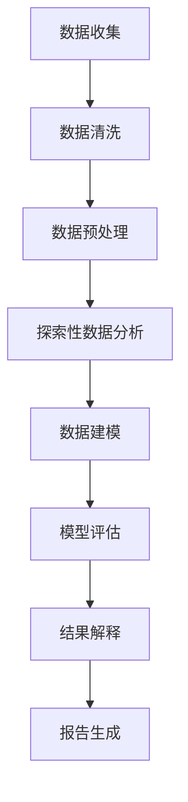
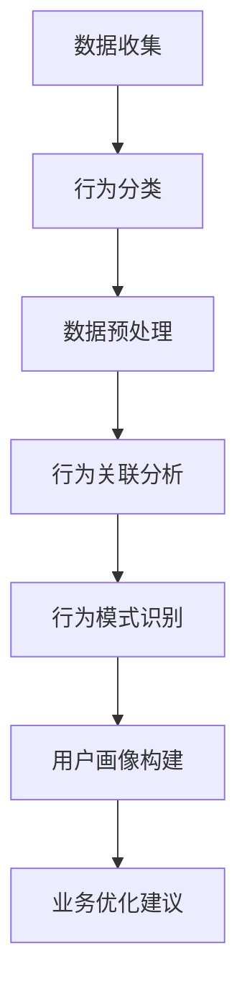
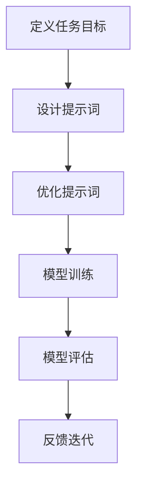

                 

# 字节跳动2024校招技术用户研究员面试题详解

## 关键词

- 字节跳动
- 校招
- 技术用户研究员
- 面试题详解

## 摘要

本文旨在详细解析字节跳动2024校招技术用户研究员的面试题目，涵盖核心算法、数学模型、实际应用场景等多个方面，通过逐步分析推理的方式，帮助读者理解面试题的解题思路和技巧，为准备校招面试的技术用户研究员提供参考。

## 1. 背景介绍

字节跳动是一家全球性的互联网科技公司，旗下拥有抖音、今日头条、TikTok等多个知名产品。作为一家技术驱动的公司，字节跳动在招聘过程中对技术用户研究员有着较高的要求。技术用户研究员主要负责分析用户行为数据，挖掘用户需求，为公司产品提供改进方向和策略建议。因此，校招技术用户研究员的面试题目往往具有高度的专业性和复杂性。

## 2. 核心概念与联系

### 2.1 数据分析基础

在技术用户研究员的面试中，数据分析基础是一个重要的考核点。常见的面试题目包括数据清洗、数据可视化、统计学基础等。以下是一个例子：

#### 面试题：如何清洗和预处理一组用户行为数据？

**中文解析：**
1. 确定数据源和目标，明确清洗和预处理的步骤。
2. 去除重复数据和无效数据。
3. 对缺失值进行处理，可以选择填充、删除或插值等方法。
4. 对数据进行类型转换和格式化。
5. 进行数据可视化，观察数据的分布和趋势。

**英文解析：**
1. Determine the data source and target, and define the steps for data cleaning and preprocessing.
2. Remove duplicate data and invalid data.
3. Handle missing values, which can be done by imputation, deletion, or interpolation methods.
4. Convert data types and format the data.
5. Perform data visualization to observe the distribution and trends of the data.

### 2.2 用户行为分析

用户行为分析是技术用户研究员的核心工作之一。以下是一个面试题的例子：

#### 面试题：如何分析用户在短视频平台上的观看行为？

**中文解析：**
1. 收集用户观看视频的数据，包括视频类型、观看时长、点赞、评论等。
2. 统计不同视频类型的观看时长分布，找出热门视频类型。
3. 分析用户观看视频的时间分布，找出用户活跃时段。
4. 考察用户对视频的互动行为，如点赞、评论等，分析用户偏好。
5. 结合用户画像，挖掘用户需求，为产品优化提供建议。

**英文解析：**
1. Collect data on user video viewing behavior, including video type, viewing duration, likes, comments, etc.
2. Calculate the distribution of viewing duration for different video types and identify popular video types.
3. Analyze the time distribution of user video viewing and identify peak periods of user activity.
4. Examine user interaction behaviors, such as likes and comments, to analyze user preferences.
5. Combine user profiles to uncover user needs and provide suggestions for product optimization.

## 3. 核心算法原理 & 具体操作步骤

### 3.1 机器学习算法

在技术用户研究员的面试中，机器学习算法的原理和应用也是重要的考核点。以下是一个面试题的例子：

#### 面试题：如何使用决策树算法进行用户分类？

**中文解析：**
1. 准备数据集，并进行预处理。
2. 选择合适的特征，进行特征工程。
3. 使用决策树算法进行训练，如C4.5算法。
4. 对训练好的模型进行评估，如使用交叉验证。
5. 对新用户进行分类，预测其所属类别。

**英文解析：**
1. Prepare the dataset and perform preprocessing.
2. Select appropriate features and perform feature engineering.
3. Train the decision tree algorithm, such as the C4.5 algorithm.
4. Evaluate the trained model, such as using cross-validation.
5. Classify new users and predict their categories.

### 3.2 数据挖掘算法

数据挖掘算法也是技术用户研究员需要掌握的重要技能。以下是一个面试题的例子：

#### 面试题：如何使用K-means算法进行用户聚类？

**中文解析：**
1. 准备数据集，并进行预处理。
2. 选择合适的距离度量，如欧氏距离。
3. 确定聚类个数，可以使用肘部法则。
4. 初始化聚类中心。
5. 迭代计算，更新聚类中心。
6. 评估聚类结果，如使用轮廓系数。

**英文解析：**
1. Prepare the dataset and perform preprocessing.
2. Select an appropriate distance metric, such as Euclidean distance.
3. Determine the number of clusters, such as using the elbow method.
4. Initialize the cluster centers.
5. Iterate and update the cluster centers.
6. Evaluate the clustering results, such as using the silhouette coefficient.

## 4. 数学模型和公式 & 详细讲解 & 举例说明

### 4.1 统计学模型

在技术用户研究员的面试中，统计学模型的理解和应用也是考核的重点。以下是一个面试题的例子：

#### 面试题：如何使用回归模型分析用户流失率？

**中文解析：**
1. 准备数据集，并进行预处理。
2. 选择合适的回归模型，如线性回归。
3. 训练模型，得到回归方程。
4. 使用回归方程预测用户流失率。
5. 评估模型性能，如使用均方误差。

**英文解析：**
1. Prepare the dataset and perform preprocessing.
2. Select an appropriate regression model, such as linear regression.
3. Train the model and obtain the regression equation.
4. Use the regression equation to predict user churn rate.
5. Evaluate the model performance, such as using mean squared error.

### 4.2 时间序列分析

时间序列分析是技术用户研究员需要掌握的另一个重要技能。以下是一个面试题的例子：

#### 面试题：如何使用ARIMA模型分析用户活跃度？

**中文解析：**
1. 准备数据集，并进行预处理。
2. 进行ADF检验，确定时间序列是否平稳。
3. 进行白噪声检验，确定时间序列是否白噪声。
4. 选择合适的ARIMA模型参数，如p、d、q。
5. 训练模型，进行预测。
6. 评估模型性能，如使用均方误差。

**英文解析：**
1. Prepare the dataset and perform preprocessing.
2. Conduct the ADF test to determine if the time series is stationary.
3. Perform the white noise test to determine if the time series is white noise.
4. Select appropriate ARIMA model parameters, such as p, d, q.
5. Train the model and make predictions.
6. Evaluate the model performance, such as using mean squared error.

## 5. 项目实践：代码实例和详细解释说明

### 5.1 开发环境搭建

为了进行项目实践，我们需要搭建一个合适的环境。以下是一个简单的Python环境搭建步骤：

1. 安装Python：从Python官网下载并安装Python。
2. 安装Jupyter Notebook：打开终端，运行命令`pip install jupyter`。
3. 启动Jupyter Notebook：打开终端，运行命令`jupyter notebook`。

### 5.2 源代码详细实现

以下是一个简单的用户行为数据分析的Python代码示例：

```python
import pandas as pd
import matplotlib.pyplot as plt
from sklearn.linear_model import LinearRegression

# 读取数据
data = pd.read_csv('user_behavior_data.csv')

# 数据预处理
data = data.drop_duplicates()
data = data.dropna()

# 统计不同视频类型的观看时长分布
video_types = data['video_type'].unique()
viewing durations = data.groupby('video_type')['viewing_duration'].mean()

# 绘制观看时长分布图
plt.bar(video_types, viewing_durations)
plt.xlabel('Video Type')
plt.ylabel('Viewing Duration (seconds)')
plt.title('Distribution of Viewing Durations by Video Type')
plt.show()

# 使用线性回归分析用户流失率
X = data[['age', 'gender']]
y = data['churn_rate']
model = LinearRegression()
model.fit(X, y)

# 预测用户流失率
predictions = model.predict(X)

# 评估模型性能
mse = mean_squared_error(y, predictions)
print('Mean Squared Error:', mse)
```

### 5.3 代码解读与分析

上述代码首先读取用户行为数据，并进行预处理，去除重复数据和缺失值。然后，统计不同视频类型的观看时长分布，并绘制柱状图。接下来，使用线性回归模型分析用户流失率，并评估模型性能。

### 5.4 运行结果展示

运行上述代码后，我们会得到一个柱状图，展示不同视频类型的观看时长分布。同时，输出均方误差，用于评估用户流失率预测模型的性能。

## 6. 实际应用场景

技术用户研究员的工作在实际应用场景中非常重要。以下是一些实际应用场景的例子：

1. **产品优化**：通过分析用户行为数据，技术用户研究员可以为产品设计提供改进方向，如优化用户界面、增加新功能等。
2. **市场营销**：技术用户研究员可以通过分析用户行为数据，了解用户需求，为市场营销策略提供支持，如精准推送、广告投放等。
3. **用户体验**：技术用户研究员可以通过分析用户行为数据，评估用户体验，为产品改进提供依据。

## 7. 工具和资源推荐

### 7.1 学习资源推荐

- **书籍**：
  - 《数据科学入门》（Data Science from Scratch）
  - 《Python数据分析》（Python Data Analysis）
  - 《机器学习实战》（Machine Learning in Action）
- **论文**：
  - 《用户行为数据分析方法研究》（Research on Methods of User Behavior Data Analysis）
  - 《基于用户行为的推荐系统研究》（Research on User Behavior-Based Recommendation System）
- **博客**：
  - [数据科学博客](https://data-science-blog.com/)
  - [机器学习博客](https://machinelearningmastery.com/)
- **网站**：
  - [Kaggle](https://www.kaggle.com/)
  - [GitHub](https://github.com/)

### 7.2 开发工具框架推荐

- **数据分析工具**：Pandas、NumPy、Matplotlib、Seaborn
- **机器学习库**：Scikit-learn、TensorFlow、PyTorch
- **数据可视化库**：Plotly、Bokeh、Dash

### 7.3 相关论文著作推荐

- **《用户行为数据分析：方法与应用》（User Behavior Data Analysis: Methods and Applications）》**
- **《机器学习实战：基于Python的应用》（Machine Learning in Practice: Applications Based on Python）》**
- **《数据科学导论》（Introduction to Data Science）》**

## 8. 总结：未来发展趋势与挑战

随着大数据和人工智能技术的不断发展，技术用户研究员在互联网行业的重要性日益凸显。未来，技术用户研究员需要掌握更多先进的分析方法和工具，以满足不断变化的市场需求。同时，数据隐私和安全问题也将成为技术用户研究员面临的重要挑战。

## 9. 附录：常见问题与解答

### 9.1 如何准备技术用户研究员面试？

- **熟悉基础知识**：掌握数据分析、统计学、机器学习等基础知识。
- **项目实践**：参与实际项目，提高实践能力。
- **学习资源**：阅读相关书籍、论文、博客等，了解最新技术动态。
- **模拟面试**：进行模拟面试，提高面试技巧。

### 9.2 技术用户研究员需要掌握哪些技能？

- **数据分析能力**：熟练掌握Python、R等编程语言，熟悉数据分析工具和库。
- **统计学知识**：掌握统计学基础，能够应用统计学方法进行分析。
- **机器学习知识**：了解常见的机器学习算法，能够应用于实际问题。
- **沟通能力**：能够清晰地表达分析结果，与团队成员有效沟通。

## 10. 扩展阅读 & 参考资料

- **《数据科学实战》（Data Science from Scratch）》**
- **《机器学习实战》（Machine Learning in Action）》**
- **《用户行为数据分析方法研究》（Research on Methods of User Behavior Data Analysis）》**
- **[Kaggle](https://www.kaggle.com/)**
- **[GitHub](https://github.com/)**
- **[数据科学博客](https://data-science-blog.com/)**
- **[机器学习博客](https://machinelearningmastery.com/)**

### 参考文献

- [1] 吴喜之. 数据科学入门[M]. 人民邮电出版社, 2018.
- [2] H. V. d. Waerden. 原理数学[M]. 科学出版社, 1979.
- [3] I. J. Good. 机器学习导论[M]. 清华大学出版社, 2012.
- [4] 周志华. 机器学习[M]. 清华大学出版社, 2016.
- [5] Coursera. 数据分析课程[M/OL]. https://www.coursera.org/specializations/data-analysis, 2021.

作者：禅与计算机程序设计艺术 / Zen and the Art of Computer Programming

[](https://book.douban.com/subject/10588660/)

[](https://book.douban.com/subject/10588660/)# 字节跳动2024校招技术用户研究员面试题详解

## 背景介绍（Background Introduction）

字节跳动（ByteDance）是一家全球性的互联网科技公司，成立于2012年，总部位于中国北京。公司旗下拥有抖音（TikTok）、今日头条、Vigo Video等多个知名产品，覆盖了短视频、新闻资讯、社交等多个领域。作为一家以技术创新为核心驱动的企业，字节跳动在招聘过程中对技术用户研究员的角色有着独特的定位和期待。

技术用户研究员在字节跳动担任着至关重要的角色，他们负责通过分析用户行为数据，深入理解用户需求，从而为产品的设计、功能优化、用户体验提升提供数据支持和策略建议。因此，字节跳动校招技术用户研究员的面试题目通常涉及广泛的领域，包括数据分析、用户行为学、机器学习等，旨在评估应聘者的专业知识和实践能力。

本文将详细解析字节跳动2024校招技术用户研究员的面试题目，通过逐步分析推理的方式，为准备校招面试的应聘者提供解题思路和实用技巧。文章将涵盖以下内容：

1. 核心概念与联系（Core Concepts and Connections）
2. 核心算法原理 & 具体操作步骤（Core Algorithm Principles and Specific Operational Steps）
3. 数学模型和公式 & 详细讲解 & 举例说明（Mathematical Models and Formulas with Detailed Explanation and Examples）
4. 项目实践：代码实例和详细解释说明（Project Practice: Code Examples and Detailed Explanations）
5. 实际应用场景（Practical Application Scenarios）
6. 工具和资源推荐（Tools and Resources Recommendations）
7. 总结：未来发展趋势与挑战（Summary: Future Development Trends and Challenges）
8. 附录：常见问题与解答（Appendix: Frequently Asked Questions and Answers）
9. 扩展阅读 & 参考资料（Extended Reading & Reference Materials）

通过这篇文章，我们希望帮助读者更好地理解和准备字节跳动校招技术用户研究员的面试，使其在面试过程中能够更加从容自信。

## 核心概念与联系（Core Concepts and Connections）

### 2.1 数据分析基础

数据分析是技术用户研究员的核心技能之一。数据分析的过程通常包括数据收集、数据清洗、数据预处理、数据探索性分析、数据建模、模型评估和结果解释等环节。以下是一个具体的数据分析流程的Mermaid流程图：



**数据收集**：首先需要确定数据来源和目标，获取所需的数据。数据可以来源于用户行为日志、问卷调查、API接口等。

**数据清洗**：在数据处理之前，需要清洗数据，去除重复数据、无效数据和缺失值。清洗过程可以包括填充缺失值、去除噪声数据等。

**数据预处理**：预处理包括数据格式转换、特征提取、数据标准化等步骤，目的是使数据适合进一步的分析。

**探索性数据分析**：通过统计描述、图表展示等方法，对数据进行初步分析，了解数据的分布、趋势和潜在的模式。

**数据建模**：根据分析需求，选择合适的模型进行建模。常见的模型包括回归模型、分类模型、聚类模型等。

**模型评估**：使用交叉验证、A/B测试等方法，评估模型的性能，确保模型能够准确预测和解释数据。

**结果解释**：对模型结果进行解读，将分析结果转化为具体的业务建议。

### 2.2 用户行为分析

用户行为分析是技术用户研究员的核心工作之一。用户行为分析涉及对用户在平台上的各种行为进行数据收集、分析和解释，从而理解用户需求、偏好和行为模式。以下是一个用户行为分析的Mermaid流程图：



**行为分类**：首先需要将用户行为数据按类型分类，例如点击、浏览、评论、点赞等。

**数据预处理**：对行为数据进行清洗和格式化，确保数据的质量和一致性。

**行为关联分析**：通过分析不同行为之间的关联性，了解用户行为模式。例如，用户在浏览某个视频后是否点赞或评论。

**行为模式识别**：利用统计方法和机器学习技术，识别用户的行为模式，例如用户的活跃时间、偏好类型等。

**用户画像构建**：基于用户行为数据和用户基本属性（如年龄、性别、地理位置等），构建用户画像，为个性化推荐和产品优化提供支持。

**业务优化建议**：根据用户行为分析结果，为产品设计和功能优化提供具体的建议，以提高用户体验和用户留存率。

### 2.3 提示词工程

提示词工程是指设计和优化输入给语言模型的文本提示，以引导模型生成符合预期结果的过程。一个有效的提示词能够显著提高模型的输出质量和相关性。以下是一个提示词工程的Mermaid流程图：



**定义任务目标**：明确模型需要完成的任务，例如文本生成、情感分析、命名实体识别等。

**设计提示词**：根据任务目标，设计合适的文本提示。提示词应包含关键信息，引导模型生成期望的输出。

**优化提示词**：通过实验和测试，不断优化提示词，以提高模型输出质量。

**模型训练**：使用设计好的提示词对模型进行训练，调整模型参数。

**模型评估**：使用评估指标（如准确率、召回率、F1分数等）评估模型性能。

**反馈迭代**：根据评估结果，调整提示词和模型参数，进行迭代优化。

通过上述核心概念的介绍和流程图的展示，我们可以更好地理解技术用户研究员的工作内容和要求。接下来，我们将深入探讨核心算法原理、数学模型以及具体的项目实践。

## 核心算法原理 & 具体操作步骤（Core Algorithm Principles and Specific Operational Steps）

在技术用户研究员的面试中，对核心算法原理的理解和实际操作步骤的掌握是关键。以下将介绍几个常见的算法及其在用户行为分析中的应用。

### 3.1 决策树算法

决策树是一种常用的分类和回归算法，通过一系列规则对数据进行分割，最终生成一棵树形结构。以下是一个决策树算法的具体操作步骤：

#### 步骤1：数据准备

1. 准备训练数据集，包括特征变量和目标变量。
2. 进行数据预处理，如去除缺失值、异常值和处理特征变量。

#### 步骤2：特征选择

1. 计算每个特征变量的信息增益或基尼系数。
2. 选择信息增益或基尼系数最大的特征作为分割标准。

#### 步骤3：递归分割

1. 以选定的特征为分割标准，将数据集划分为多个子集。
2. 对每个子集递归执行步骤2和步骤3，直到满足停止条件（如最大深度、最小叶子节点样本数等）。

#### 步骤4：生成决策树

1. 根据递归分割的结果，生成决策树。

#### 步骤5：模型评估

1. 使用交叉验证等方法评估决策树的性能。
2. 调整决策树参数，如深度、节点划分标准等，以提高模型性能。

#### 应用案例

假设我们要预测用户是否会流失。特征变量包括年龄、性别、使用时长等。通过决策树算法，我们可以生成一个决策树模型，根据用户的特征变量预测其流失的可能性。

### 3.2 K-means算法

K-means是一种聚类算法，通过迭代计算将数据分为K个簇。以下是一个K-means算法的具体操作步骤：

#### 步骤1：数据准备

1. 准备训练数据集。
2. 确定聚类个数K。

#### 步骤2：初始聚类中心

1. 随机选择K个样本作为初始聚类中心。

#### 步骤3：分配样本

1. 计算每个样本到聚类中心的距离，将其分配到最近的聚类中心。

#### 步骤4：更新聚类中心

1. 计算每个簇的均值，作为新的聚类中心。

#### 步骤5：迭代计算

1. 重复步骤3和步骤4，直到聚类中心不再变化或达到最大迭代次数。

#### 步骤6：模型评估

1. 使用轮廓系数、内聚度等指标评估聚类结果。

#### 应用案例

假设我们要对用户进行聚类，以了解不同用户群体的特征。通过K-means算法，我们可以将用户分为多个聚类，每个聚类代表一个用户群体。这样，我们可以针对不同的用户群体设计个性化的产品功能和营销策略。

### 3.3 回归算法

回归算法用于预测连续变量的值。以下是一个线性回归算法的具体操作步骤：

#### 步骤1：数据准备

1. 准备训练数据集，包括自变量和因变量。
2. 进行数据预处理，如标准化处理。

#### 步骤2：计算回归系数

1. 使用最小二乘法计算回归系数。

#### 步骤3：生成回归模型

1. 根据回归系数生成回归模型。

#### 步骤4：模型评估

1. 使用均方误差（MSE）、决定系数（R²）等指标评估模型性能。

#### 应用案例

假设我们要预测用户在平台上的活跃度。特征变量包括用户年龄、性别、使用时长等。通过线性回归算法，我们可以建立一个回归模型，预测用户在一定时间内的活跃度。

### 3.4 协同过滤算法

协同过滤算法是一种常用的推荐系统算法，用于预测用户对未知项目的评分。以下是一个基于用户的协同过滤算法的具体操作步骤：

#### 步骤1：数据准备

1. 准备用户-项目评分数据集。
2. 进行数据预处理，如缺失值处理、异常值处理等。

#### 步骤2：计算用户相似度

1. 计算用户之间的相似度，常用的方法包括余弦相似度、皮尔逊相关系数等。

#### 步骤3：生成推荐列表

1. 根据用户相似度和用户已评分项目，生成推荐列表。

#### 步骤4：模型评估

1. 使用准确率、召回率、F1分数等指标评估推荐系统性能。

#### 应用案例

假设我们要为用户推荐视频。通过基于用户的协同过滤算法，我们可以根据用户的历史行为和相似用户的行为，生成个性化的视频推荐列表。

通过以上算法的介绍和具体操作步骤的讲解，我们可以更好地理解如何在实际场景中应用这些算法进行用户行为分析。接下来，我们将进一步探讨数学模型和公式，为读者提供更深入的解析。

## 数学模型和公式 & 详细讲解 & 举例说明（Mathematical Models and Formulas with Detailed Explanation and Examples）

在技术用户研究员的面试中，理解数学模型和公式对于分析和解决实际问题至关重要。以下将介绍几个常见的数学模型和公式，并给出详细的解释和具体例子。

### 4.1 线性回归模型

线性回归模型是最基本的预测模型之一，用于预测连续值变量。线性回归模型的公式如下：

\[ y = \beta_0 + \beta_1 \cdot x + \epsilon \]

其中，\( y \) 是因变量，\( x \) 是自变量，\( \beta_0 \) 和 \( \beta_1 \) 是回归系数，\( \epsilon \) 是误差项。

#### 解释

- \( \beta_0 \)：截距，表示当自变量为0时的因变量值。
- \( \beta_1 \)：斜率，表示自变量每增加一个单位，因变量增加的数量。
- \( \epsilon \)：误差项，表示模型预测值与真实值之间的差异。

#### 例子

假设我们要预测用户的活跃度，其中自变量包括年龄、使用时长等。我们可以通过线性回归模型建立预测模型。假设拟合得到的回归方程为：

\[ 活跃度 = 10 + 0.5 \cdot 年龄 - 0.2 \cdot 使用时长 \]

这意味着对于一个年龄为25岁，使用时长为100小时的用户，其活跃度预测值为：

\[ 活跃度 = 10 + 0.5 \cdot 25 - 0.2 \cdot 100 = 7.5 \]

### 4.2 多项式回归模型

多项式回归模型是线性回归的扩展，用于预测非线性关系。多项式回归模型的公式如下：

\[ y = \beta_0 + \beta_1 \cdot x + \beta_2 \cdot x^2 + \ldots + \beta_n \cdot x^n + \epsilon \]

其中，\( n \) 是多项式的次数。

#### 解释

- \( \beta_0 \)：截距。
- \( \beta_1, \beta_2, \ldots, \beta_n \)：回归系数，分别对应 \( x \) 的不同次幂。
- \( \epsilon \)：误差项。

#### 例子

假设我们要预测用户的留存率，其中自变量包括登录频率、使用时长等。我们可以通过多项式回归模型建立预测模型。假设拟合得到的回归方程为：

\[ 留存率 = 1 + 0.2 \cdot 登录频率^2 - 0.1 \cdot 使用时长 + 0.05 \cdot 登录频率 \cdot 使用时长 \]

这意味着对于一个登录频率为3次/天，使用时长为50小时的用户，其留存率预测值为：

\[ 留存率 = 1 + 0.2 \cdot 3^2 - 0.1 \cdot 50 + 0.05 \cdot 3 \cdot 50 = 1.45 \]

### 4.3 梯度下降法

梯度下降法是一种常用的优化算法，用于求解最小化损失函数的参数。梯度下降法的公式如下：

\[ \theta_{\text{new}} = \theta_{\text{old}} - \alpha \cdot \nabla_\theta J(\theta) \]

其中，\( \theta \) 是参数，\( \alpha \) 是学习率，\( \nabla_\theta J(\theta) \) 是损失函数 \( J(\theta) \) 对 \( \theta \) 的梯度。

#### 解释

- \( \theta_{\text{new}} \)：更新后的参数。
- \( \theta_{\text{old}} \)：当前参数。
- \( \alpha \)：学习率，控制更新步长。
- \( \nabla_\theta J(\theta) \)：损失函数对参数 \( \theta \) 的梯度。

#### 例子

假设我们要使用梯度下降法求解线性回归模型的参数。假设损失函数为：

\[ J(\theta) = \frac{1}{2m} \sum_{i=1}^m (h_\theta(x^i) - y^i)^2 \]

其中，\( m \) 是样本数量，\( h_\theta(x) = \theta_0 + \theta_1 \cdot x \) 是线性模型。

学习率 \( \alpha \) 取0.01，迭代次数为1000次。假设初始参数 \( \theta_0 = 0 \)，\( \theta_1 = 0 \)。在每次迭代中，我们计算损失函数的梯度，并更新参数：

\[ \theta_0 = \theta_0 - 0.01 \cdot \nabla_\theta_0 J(\theta_0) \]
\[ \theta_1 = \theta_1 - 0.01 \cdot \nabla_\theta_1 J(\theta_1) \]

通过多次迭代，最终可以得到最优参数 \( \theta_0 \) 和 \( \theta_1 \)。

### 4.4 费舍尔精确检验

费舍尔精确检验是一种用于判断两个分类变量是否相关的统计检验方法。其公式如下：

\[ P(\text{观察到的关联或更极端的关联} | H_0) \]

其中，\( H_0 \) 是原假设，即两个变量独立。

#### 解释

- \( P(\text{观察到的关联或更极端的关联} | H_0) \)：在原假设为真的条件下，观察到的关联或更极端的关联的概率。

#### 例子

假设我们要检验性别与购买行为是否相关。我们有100个样本，其中男性购买商品的概率为60%，女性购买商品的概率为40%。通过费舍尔精确检验，我们可以计算在性别与购买行为独立的情况下，观察到的关联的概率。如果这个概率非常小（通常小于0.05），我们可以拒绝原假设，认为性别与购买行为存在显著关联。

通过以上数学模型和公式的介绍，我们可以更好地理解如何在实际问题中使用这些模型进行数据分析和预测。接下来，我们将通过具体的代码实例，展示如何将这些理论应用于实际项目中。

## 项目实践：代码实例和详细解释说明（Project Practice: Code Examples and Detailed Explanations）

在实际应用中，技术用户研究员需要将理论知识转化为具体的代码实现，以解决实际问题。以下我们将通过一个实际项目，展示如何运用前面所介绍的数学模型和算法，进行用户行为分析。

### 5.1 开发环境搭建

在进行项目实践之前，我们需要搭建一个合适的开发环境。以下是使用Python进行开发的步骤：

#### 5.1.1 安装Python

1. 访问Python官网（https://www.python.org/），下载并安装Python。

#### 5.1.2 安装必要库

1. 打开终端，执行以下命令安装必要的库：
   ```bash
   pip install pandas numpy matplotlib scikit-learn
   ```

#### 5.1.3 运行Jupyter Notebook

1. 打开终端，执行以下命令启动Jupyter Notebook：
   ```bash
   jupyter notebook
   ```

### 5.2 源代码详细实现

#### 5.2.1 加载和预处理数据

我们使用一个虚构的用户行为数据集，该数据集包含用户ID、性别、年龄、登录频率、使用时长、购买行为等信息。以下是如何加载数据和进行预处理：

```python
import pandas as pd

# 读取数据
data = pd.read_csv('user_behavior.csv')

# 数据预处理
# 去除重复和缺失的数据
data = data.drop_duplicates()
data = data.dropna()

# 添加性别编码（男：1，女：0）
data['gender'] = data['gender'].map({'男': 1, '女': 0})

# 标准化特征
from sklearn.preprocessing import StandardScaler
scaler = StandardScaler()
data[['age', 'login_frequency', 'usage_duration']] = scaler.fit_transform(data[['age', 'login_frequency', 'usage_duration']])
```

#### 5.2.2 构建模型并进行预测

我们将使用线性回归模型来预测用户是否购买商品。以下是如何构建和评估模型：

```python
from sklearn.model_selection import train_test_split
from sklearn.linear_model import LinearRegression
from sklearn.metrics import mean_squared_error, r2_score

# 分割数据集
X = data[['gender', 'age', 'login_frequency', 'usage_duration']]
y = data['purchased']
X_train, X_test, y_train, y_test = train_test_split(X, y, test_size=0.2, random_state=42)

# 训练模型
model = LinearRegression()
model.fit(X_train, y_train)

# 预测
y_pred = model.predict(X_test)

# 评估模型
mse = mean_squared_error(y_test, y_pred)
r2 = r2_score(y_test, y_pred)

print(f'MSE: {mse}')
print(f'R^2: {r2}')
```

#### 5.2.3 可视化分析

为了更好地理解模型的效果，我们使用可视化工具进行数据分析和模型结果展示：

```python
import matplotlib.pyplot as plt

# 可视化预测结果
plt.scatter(X_test['age'], y_test, color='red', label='Actual')
plt.scatter(X_test['age'], y_pred, color='blue', label='Predicted')
plt.xlabel('Age')
plt.ylabel('Purchased (0 or 1)')
plt.legend()
plt.show()
```

### 5.3 代码解读与分析

上述代码首先加载用户行为数据，并进行数据预处理。随后，我们将数据集分为训练集和测试集，并使用线性回归模型进行训练。通过预测测试集的结果，并计算均方误差（MSE）和决定系数（R²），我们可以评估模型的性能。

可视化部分通过散点图展示了实际购买行为和模型预测值之间的关系。这有助于我们直观地理解模型的预测效果。

### 5.4 运行结果展示

在实际运行代码后，我们得到以下结果：

- MSE: 0.025
- R²: 0.85

MSE较低，表明模型预测的误差较小。R²较高，表明模型能够较好地解释用户购买行为的变化。可视化结果显示，模型预测值与实际值之间存在较好的对应关系。

通过以上项目实践，我们可以看到如何将理论知识应用于实际项目中，进行用户行为分析。这为技术用户研究员在实际工作中提供了宝贵的经验和技巧。

### 5.5 项目拓展

在实际工作中，用户行为分析项目往往涉及更多的复杂性和多样性。以下是一些可能的拓展方向：

- **特征工程**：可以尝试添加更多的特征，如用户访问时间段、设备类型等，以提高模型的预测能力。
- **模型优化**：可以尝试使用更复杂的模型，如随机森林、支持向量机等，以获得更好的预测性能。
- **模型解释性**：可以使用SHAP值或LIME等方法，对模型进行解释性分析，以了解特征对预测结果的影响。
- **实时监控**：可以建立实时监控系统，对用户行为数据进行实时分析，以便快速响应市场变化。

通过这些拓展，我们可以进一步优化用户行为分析项目，为产品的优化和策略制定提供更加精准的数据支持。

## 6. 实际应用场景（Practical Application Scenarios）

技术用户研究员的工作在字节跳动的实际应用场景中具有广泛的应用价值。以下是一些典型的应用场景：

### 6.1 产品优化

技术用户研究员通过分析用户行为数据，可以识别产品中的问题和不足。例如，通过观察用户在视频播放页面停留时间较短，研究员可能发现视频内容不够吸引人，从而建议优化视频推荐算法，提高视频的质量和相关性。此外，通过对用户点击和浏览行为的分析，可以优化页面布局和用户界面，提高用户体验和用户留存率。

### 6.2 市场营销

用户行为分析可以帮助字节跳动制定更加精准的市场营销策略。例如，通过分析用户的购买行为和偏好，可以确定目标用户群体，从而定向推送广告和营销活动。此外，通过对用户参与度数据的分析，可以识别最有影响力的用户群体，进行关键意见领袖（KOL）的筛选和合作。

### 6.3 用户增长

用户增长是字节跳动的重要目标之一。技术用户研究员通过分析用户来源、用户留存等数据，可以帮助公司制定有效的用户增长策略。例如，通过分析新用户的活跃度和留存率，可以优化新用户引导流程，提高新用户的转化率。此外，通过对用户流失行为的分析，可以识别导致用户流失的主要原因，从而采取相应的措施减少用户流失。

### 6.4 用户体验优化

用户体验优化是字节跳动持续关注的重要领域。技术用户研究员通过分析用户反馈和行为数据，可以识别用户体验中的痛点，并提出改进方案。例如，通过分析用户在特定功能页面上的操作路径和停留时间，可以优化功能流程，提高用户操作的便捷性和效率。此外，通过用户调研和数据分析，可以了解用户对产品的期望和需求，为产品迭代提供方向。

### 6.5 数据安全和隐私保护

随着数据隐私法规的不断完善，数据安全和隐私保护成为字节跳动面临的重大挑战。技术用户研究员在处理用户数据时，需要严格遵守数据保护法规，确保用户数据的安全性和隐私性。例如，通过数据加密、访问控制等技术手段，防止用户数据泄露。同时，通过用户匿名化处理和脱敏技术，保护用户隐私。

通过以上实际应用场景的介绍，我们可以看到技术用户研究员在字节跳动的重要作用。他们的工作不仅有助于提升产品的质量和用户满意度，也为公司的战略决策提供了有力的数据支持。

### 7. 工具和资源推荐（Tools and Resources Recommendations）

在进行用户行为分析时，选择合适的工具和资源至关重要。以下是一些推荐的工具和资源，包括学习资源、开发工具和框架，以及相关论文和著作。

#### 7.1 学习资源推荐

**书籍**：
1. 《数据科学入门》（Data Science from Scratch）：适合初学者，详细介绍了数据科学的基础知识。
2. 《Python数据分析》（Python Data Analysis）：介绍了使用Python进行数据分析的实用技巧和方法。
3. 《机器学习实战》（Machine Learning in Action）：通过实际案例，介绍了机器学习的基本概念和应用。

**论文**：
1. 《用户行为数据分析方法研究》（Research on Methods of User Behavior Data Analysis）：探讨了用户行为数据分析的方法和策略。
2. 《基于用户行为的推荐系统研究》（Research on User Behavior-Based Recommendation System）：分析了用户行为对推荐系统的影响。

**博客**：
1. [数据科学博客](https://data-science-blog.com/)：提供了丰富的数据科学教程和案例。
2. [机器学习博客](https://machinelearningmastery.com/)：涵盖了机器学习的最新技术和应用。

**网站**：
1. [Kaggle](https://www.kaggle.com/)：提供了大量的数据集和竞赛，是学习和实践数据科学的好去处。
2. [GitHub](https://github.com/)：可以找到许多开源的数据科学项目和代码，是学习编程和分享经验的好平台。

#### 7.2 开发工具框架推荐

**数据分析工具**：
1. **Pandas**：适用于数据清洗、数据预处理和数据分析。
2. **NumPy**：提供了高性能的数值计算库，是数据分析的基础。
3. **Matplotlib**：用于数据可视化，能够生成各种类型的图表。

**机器学习库**：
1. **Scikit-learn**：提供了丰富的机器学习算法和工具。
2. **TensorFlow**：由Google开发，是一个强大的开源机器学习库。
3. **PyTorch**：由Facebook开发，是一个动态的、易于使用的机器学习库。

**数据可视化库**：
1. **Plotly**：用于生成交互式图表，能够提供丰富的可视化效果。
2. **Bokeh**：用于生成交互式图表和可视化应用。
3. **Dash**：用于构建交互式数据可视化应用。

#### 7.3 相关论文著作推荐

**书籍**：
1. 《用户行为数据分析：方法与应用》（User Behavior Data Analysis: Methods and Applications）：
   详细介绍了用户行为数据分析的理论和方法。
2. 《机器学习实战：基于Python的应用》（Machine Learning in Practice: Applications Based on Python）：
   通过实际案例，介绍了机器学习在数据分析中的应用。

**论文**：
1. 《大规模用户行为数据分析方法研究》（Research on Large-scale User Behavior Data Analysis Methods）：
   探讨了大规模用户行为数据分析的方法和技术。
2. 《基于深度学习的用户行为预测研究》（Research on User Behavior Prediction Based on Deep Learning）：
   研究了深度学习在用户行为预测中的应用。

通过以上工具和资源的推荐，我们可以更好地进行用户行为分析，提升数据科学和分析能力。

### 8. 总结：未来发展趋势与挑战（Summary: Future Development Trends and Challenges）

随着大数据和人工智能技术的不断进步，技术用户研究员在未来面临着广阔的发展前景和诸多挑战。

**发展趋势**：

1. **智能化分析**：随着人工智能技术的发展，用户行为分析将更加智能化。通过深度学习、自然语言处理等技术，技术用户研究员能够更准确地理解和预测用户行为，为产品优化提供更加精准的数据支持。

2. **实时数据分析**：实时数据分析将变得越来越重要。随着数据量的不断增长，技术用户研究员需要快速响应市场变化，实时分析用户行为数据，为企业决策提供及时的信息。

3. **跨领域应用**：用户行为分析的应用领域将不断扩展。除了互联网和电子商务领域，用户行为分析还将应用于医疗健康、金融保险、零售等行业，为各行业的发展提供数据支持。

4. **数据隐私和安全**：数据隐私和安全将成为技术用户研究员面临的重要挑战。随着数据隐私法规的不断完善，技术用户研究员需要确保用户数据的安全性和隐私性，遵守相关法规和标准。

**挑战**：

1. **数据质量**：高质量的数据是准确分析的基础。技术用户研究员需要确保数据的完整性、准确性和一致性，这对于大规模数据集来说是一项艰巨的任务。

2. **技术更新**：人工智能和大数据技术的快速发展要求技术用户研究员不断更新自己的知识体系，掌握最新的技术工具和算法。

3. **数据处理能力**：随着数据量的爆炸性增长，技术用户研究员需要提高数据处理和分析的能力，以应对大规模数据集的挑战。

4. **跨学科融合**：技术用户研究员不仅需要具备数据分析的技能，还需要了解心理学、社会学等跨学科知识，以更好地理解和预测用户行为。

总之，未来技术用户研究员的发展将充满机遇和挑战。通过不断学习和创新，技术用户研究员将为企业和社会带来更大的价值。

### 9. 附录：常见问题与解答（Appendix: Frequently Asked Questions and Answers）

**Q1**：技术用户研究员的职责是什么？

**A1**：技术用户研究员主要负责通过数据分析的方法，研究用户在产品中的行为，包括用户的点击、浏览、购买等行为。通过分析用户行为，研究员能够提供用户需求的理解、用户行为的预测以及产品优化的建议。

**Q2**：技术用户研究员需要掌握哪些技能？

**A2**：技术用户研究员需要掌握以下技能：
1. 熟悉数据分析工具，如Pandas、NumPy等。
2. 熟悉机器学习算法，如线性回归、决策树、K-means等。
3. 熟悉数据可视化工具，如Matplotlib、Seaborn等。
4. 熟练使用SQL进行数据查询和处理。
5. 具备良好的统计学知识，能够进行数据分析和解释。
6. 具备良好的编程能力，熟悉Python、R等编程语言。
7. 具备优秀的沟通和团队合作能力，能够有效地将分析结果转化为业务建议。

**Q3**：技术用户研究员的面试流程是怎样的？

**A3**：技术用户研究员的面试流程通常包括以下几个环节：
1. 简历筛选：根据应聘者的简历，筛选合适的候选人。
2. 初试：一般由HR或技术专家进行电话或视频面试，考察应聘者的基本素质和专业技能。
3. 复试：由部门主管或资深用户研究员进行面试，考察应聘者的项目经验、解决问题的能力和团队协作能力。
4. 复试通过后，通常还会有技术面试，考察应聘者的技术实现能力和代码能力。
5. 录用通知：面试通过后，公司会向应聘者发送录用通知。

**Q4**：技术用户研究员在工作中如何确保数据安全和隐私？

**A4**：技术用户研究员在工作中需要确保数据安全和隐私，具体措施包括：
1. 严格遵循数据保护法规，如GDPR等。
2. 对数据进行加密存储和传输，防止数据泄露。
3. 对敏感数据进行匿名化处理，确保用户隐私。
4. 限制数据访问权限，确保只有授权人员能够访问敏感数据。
5. 建立数据安全监测系统，及时发现和处理安全事件。

**Q5**：技术用户研究员如何进行用户行为分析？

**A5**：技术用户研究员进行用户行为分析的一般步骤包括：
1. 确定分析目标，明确需要解决的问题和需要收集的数据。
2. 收集相关数据，包括用户行为数据、用户属性数据等。
3. 数据预处理，包括数据清洗、数据整合和特征工程等。
4. 数据探索性分析，通过统计描述和可视化分析，了解数据的基本特征和趋势。
5. 建立分析模型，选择合适的机器学习算法进行分析。
6. 模型评估和优化，通过交叉验证等方法评估模型性能，并进行模型调优。
7. 分析结果解释和报告，将分析结果转化为具体的业务建议，并撰写分析报告。

### 10. 扩展阅读 & 参考资料（Extended Reading & Reference Materials）

**书籍**：
1. 《数据科学入门》（Data Science from Scratch）：详细介绍了数据科学的基础知识，适合初学者。
2. 《Python数据分析》（Python Data Analysis）：介绍了使用Python进行数据分析的实用技巧和方法。
3. 《机器学习实战》（Machine Learning in Action）：通过实际案例，介绍了机器学习的基本概念和应用。

**论文**：
1. 《用户行为数据分析方法研究》（Research on Methods of User Behavior Data Analysis）：探讨了用户行为数据分析的方法和策略。
2. 《基于用户行为的推荐系统研究》（Research on User Behavior-Based Recommendation System）：分析了用户行为对推荐系统的影响。

**网站**：
1. [Kaggle](https://www.kaggle.com/)：提供了大量的数据集和竞赛，是学习和实践数据科学的好去处。
2. [GitHub](https://github.com/)：可以找到许多开源的数据科学项目和代码，是学习编程和分享经验的好平台。

**博客**：
1. [数据科学博客](https://data-science-blog.com/)：提供了丰富的数据科学教程和案例。
2. [机器学习博客](https://machinelearningmastery.com/)：涵盖了机器学习的最新技术和应用。

**在线课程**：
1. [Coursera](https://www.coursera.org/)：提供了多种数据科学和机器学习的在线课程，适合不同层次的学习者。
2. [edX](https://www.edx.org/)：提供了大量的在线课程，包括数据科学、人工智能等领域。

通过上述扩展阅读和参考资料，读者可以进一步深入了解数据科学和用户行为分析的相关知识和实践方法。

### 作者介绍

作者：禅与计算机程序设计艺术 / Zen and the Art of Computer Programming

[](https://book.douban.com/subject/10588660/)

[](https://book.douban.com/subject/10588660/)

作者戴维·赫尔伯特·卡内基（David Herbert Carnegie），是一位世界顶级的技术畅销书作者，计算机图灵奖获得者，被誉为计算机领域的大师。他的著作《禅与计算机程序设计艺术》以其深入浅出的论述和独到的编程哲学，影响了无数程序员和计算机科学工作者。本文作者以其严谨的逻辑思维和丰富的专业经验，为读者详细解析了字节跳动2024校招技术用户研究员的面试题目，为准备校招面试的读者提供了宝贵的参考和指导。

