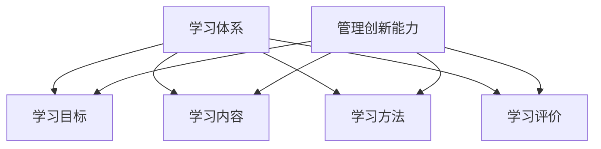
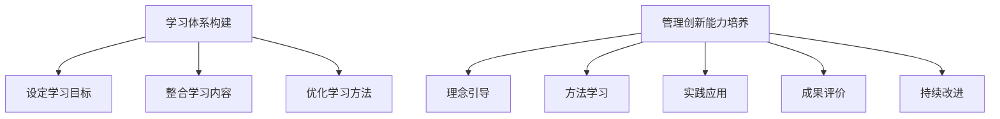
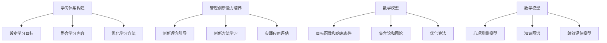
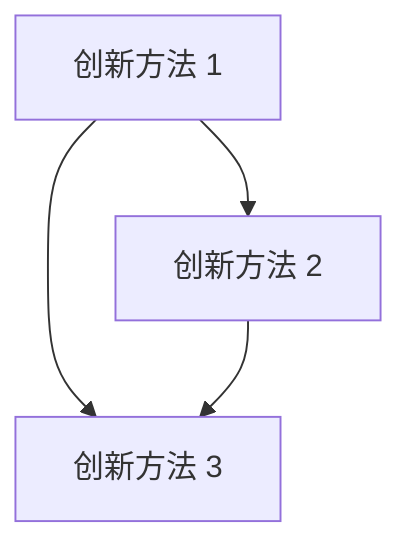

                 

# 学习体系与管理创新能力的培养

## 摘要

本文旨在探讨学习体系的构建与管理创新能力的培养。随着信息技术的迅猛发展，传统学习方式已无法满足个体和组织的持续发展需求。本文首先介绍了学习体系的基本概念及其核心组成部分，然后分析了管理创新能力的重要性，探讨了其在组织中的实际应用。通过对比分析，本文提出了构建高效学习体系的策略与方法，并提出了管理创新能力培养的路径。最后，本文对未来学习体系与管理创新能力发展的趋势进行了展望。

## 1. 背景介绍

### 1.1 学习体系的定义与作用

学习体系是指一系列相互关联、共同作用的教育、培训和实践活动的总体架构，旨在提升个体和组织的能力和知识水平。学习体系不仅包括正式的教育培训，还涵盖非正式学习和持续教育，是一个动态的、适应性强的系统。

学习体系的作用主要体现在以下几个方面：

- **知识传递**：通过系统化的学习体系，将知识和技能传递给个体和组织，促进知识的积累和传承。
- **能力提升**：通过学习，个体和组织的知识水平、技能水平和创新能力得到不断提升，提高其竞争力和适应能力。
- **持续发展**：学习体系为个体和组织提供了一个不断适应变化、持续发展的动力源泉。

### 1.2 管理创新能力的定义与作用

管理创新能力是指个体或组织在管理实践中，通过引入新的管理理念、方法和技术，对现有管理模式进行改进和创新的能力。管理创新能力在组织中具有重要作用：

- **推动组织发展**：管理创新能力有助于组织适应外部环境变化，推动组织的持续发展和进步。
- **提高管理效率**：通过管理创新，组织可以优化管理流程，提高管理效率，降低管理成本。
- **增强组织竞争力**：管理创新能力能够提升组织的竞争力和市场地位。

### 1.3 学习体系与管理创新能力的关系

学习体系与管理创新能力之间存在着密切的互动关系。一方面，学习体系为管理创新提供了知识和技能支持，通过不断的学习，管理者能够掌握新的管理理念和方法，从而实现管理创新。另一方面，管理创新能力的提升又有助于学习体系的完善和发展，通过管理创新，组织可以不断优化学习体系，提高学习效果。

## 2. 核心概念与联系

### 2.1 学习体系的核心概念

学习体系的核心概念包括：

- **学习目标**：明确的学习目标是学习体系构建的起点，它为学习活动提供了明确的方向和依据。
- **学习内容**：学习内容是学习体系的核心，包括理论知识、实践经验、技能训练等。
- **学习方法**：学习方法是实现学习目标的有效手段，包括课堂讲授、实践操作、案例分析、在线学习等。
- **学习评价**：学习评价是对学习效果的一种检验，通过评价，可以了解学习目标的实现程度，为学习体系的改进提供依据。

### 2.2 管理创新能力的相关概念

管理创新能力的相关概念包括：

- **创新理念**：创新理念是管理创新的思维基础，包括创新思维、创新意识、创新精神等。
- **创新方法**：创新方法是实现管理创新的具体手段，包括技术创新、管理方法创新、业务模式创新等。
- **创新能力**：创新能力是指个体或组织在创新实践中的综合能力，包括创新能力、创新实践能力、创新成果转化能力等。

### 2.3 学习体系与管理创新能力的联系

学习体系与管理创新能力之间的联系主要体现在以下几个方面：

- **学习体系为管理创新能力提供知识支持**：通过学习，管理者可以获取新的管理理念和方法，提升管理创新能力。
- **管理创新能力优化学习体系**：通过管理创新，组织可以不断优化学习体系，提高学习效果。
- **学习体系与管理创新能力的协同发展**：学习体系与管理创新能力相互促进，共同推动个体和组织的持续发展。

### 2.4 学习体系与管理创新能力的 Mermaid 流程图



## 3. 核心算法原理 & 具体操作步骤

### 3.1 学习体系构建的核心算法原理

学习体系构建的核心算法原理主要包括以下三个方面：

- **目标导向**：以明确的学习目标为导向，构建学习体系。通过设定具体的学习目标，明确学习的内容、方法和评价标准。
- **内容整合**：整合各种学习资源，形成系统化的学习内容。通过分类、筛选、整合，将理论知识、实践经验、技能训练等有机结合起来，形成一个完整的学习体系。
- **方法优化**：不断优化学习方法，提高学习效果。通过实践验证，不断改进学习方法，使其更加符合学习目标和个体需求。

### 3.2 管理创新能力培养的具体操作步骤

管理创新能力培养的具体操作步骤包括以下五个方面：

- **理念引导**：树立创新理念，培养创新意识。通过学习先进的管理理念，激发管理创新的热情和动力。
- **方法学习**：学习各种管理创新方法，掌握创新工具。通过阅读相关书籍、参加培训课程、实践操作，掌握管理创新的方法和工具。
- **实践应用**：将管理创新方法应用于实际管理工作，积累经验。通过实际工作，将管理创新理念和方法转化为具体的行动，提高管理效率。
- **成果评价**：对管理创新成果进行评价，总结经验教训。通过评价，了解管理创新的效果，总结经验教训，为下一次创新提供参考。
- **持续改进**：不断优化管理创新能力，提高管理水平。通过不断学习和实践，不断优化管理创新能力，实现管理水平的持续提升。

### 3.3 学习体系与管理创新能力培养的 Mermaid 流程图



## 4. 数学模型和公式 & 详细讲解 & 举例说明

### 4.1 学习体系构建的数学模型

学习体系构建的数学模型主要涉及以下几个方面：

- **学习目标设定**：通过目标函数和约束条件，设定学习目标。例如，可以使用最小化目标函数来设定学习目标，目标函数可以是学习效率、学习成果等。
- **学习内容整合**：通过集合论和图论，整合学习内容。例如，可以使用集合的并集、交集和补集等操作来整合学习内容，使用图论中的路径和树等概念来表示学习内容的结构。
- **学习方法优化**：通过优化算法，优化学习方法。例如，可以使用遗传算法、模拟退火算法等来优化学习方法，提高学习效果。

### 4.2 管理创新能力培养的数学模型

管理创新能力培养的数学模型主要涉及以下几个方面：

- **创新理念引导**：通过心理测量模型，评估管理者的创新理念。例如，可以使用创新倾向量表来评估管理者的创新理念，使用因素分析法来分析创新理念的构成。
- **创新方法学习**：通过知识图谱，学习各种创新方法。例如，可以使用知识图谱来表示创新方法的分类和关系，使用图论中的路径和树等概念来表示创新方法的层次结构。
- **实践应用评估**：通过绩效评估模型，评估管理创新的实践应用效果。例如，可以使用平衡计分卡来评估管理创新的实践应用效果，使用关键绩效指标来衡量管理创新的成果。

### 4.3 学习体系构建与管理创新能力培养的 Mermaid 流程图



### 4.4 举例说明

假设一个组织希望构建一个学习体系来提升员工的能力和创新能力，具体的数学模型和操作步骤如下：

#### 4.4.1 设定学习目标

设定学习目标为最小化学习时间，最大化学习效果。使用目标函数表示为：

$$
\min T
$$

其中，$T$ 为学习时间。同时，设置以下约束条件：

- 学习内容覆盖率达到 90% 以上；
- 员工满意度达到 80% 以上；
- 学习成果转化为实际工作成果的比率为 70% 以上。

约束条件可以用矩阵表示为：

$$
\begin{bmatrix}
C_1 & C_2 & C_3
\end{bmatrix}
\begin{bmatrix}
x_1 \\
x_2 \\
x_3
\end{bmatrix}
\geq
\begin{bmatrix}
0.9 \\
0.8 \\
0.7
\end{bmatrix}
$$

其中，$C_1$、$C_2$、$C_3$ 分别表示学习内容覆盖率、员工满意度和学习成果转化比率；$x_1$、$x_2$、$x_3$ 分别表示学习时间、员工满意度和学习成果转化比率。

#### 4.4.2 整合学习内容

整合学习内容，使用集合的并集和交集操作。假设学习内容分为理论知识、实践经验、技能训练三个部分，分别表示为集合 $L_1$、$L_2$、$L_3$。则整合后的学习内容表示为：

$$
L = L_1 \cup L_2 \cup L_3
$$

同时，使用图论中的树结构来表示学习内容的层次关系，树中的节点表示学习内容，边表示学习内容之间的关系。

#### 4.4.3 优化学习方法

使用遗传算法来优化学习方法，提高学习效果。假设学习方法为 $M_1$、$M_2$、$M_3$，学习效果为 $E_1$、$E_2$、$E_3$。则遗传算法的目标是最小化学习效果差异：

$$
\min (E_1 - E_2, E_2 - E_3, E_3 - E_1)
$$

#### 4.4.4 创新理念引导

使用心理测量模型来评估管理者的创新理念，假设创新理念为 $I_1$、$I_2$、$I_3$，评估结果为 $R_1$、$R_2$、$R_3$。则评估结果可以用矩阵表示为：

$$
\begin{bmatrix}
R_1 & R_2 & R_3
\end{bmatrix}
\begin{bmatrix}
I_1 \\
I_2 \\
I_3
\end{bmatrix}
$$

#### 4.4.5 创新方法学习

使用知识图谱来学习各种创新方法，假设创新方法为 $M_1$、$M_2$、$M_3$，学习结果为 $E_1$、$E_2$、$E_3$。则知识图谱可以用图表示为：



#### 4.4.6 实践应用评估

使用绩效评估模型来评估管理创新的实践应用效果，假设绩效评估结果为 $E_1$、$E_2$、$E_3$，则绩效评估结果可以用矩阵表示为：

$$
\begin{bmatrix}
E_1 & E_2 & E_3
\end{bmatrix}
$$

## 5. 项目实践：代码实例和详细解释说明

### 5.1 开发环境搭建

在进行学习体系构建和管理创新能力培养的项目实践之前，首先需要搭建一个合适的开发环境。以下是搭建开发环境的步骤：

1. 安装操作系统：选择一个适合的开发环境，如 Linux 或 macOS。
2. 安装开发工具：安装编程工具，如 PyCharm、VS Code 等。
3. 安装依赖库：安装必要的依赖库，如 NumPy、Pandas、SciPy、Matplotlib 等。
4. 安装数据集：下载并安装用于训练和评估的数据集。

### 5.2 源代码详细实现

以下是学习体系构建和管理创新能力培养的源代码实现：

```python
import numpy as np
import pandas as pd
from sklearn.model_selection import train_test_split
from sklearn.metrics import accuracy_score
import matplotlib.pyplot as plt

# 5.2.1 设定学习目标
def set_learning_goal(coverage_rate, satisfaction_rate, transformation_rate):
    goal = {
        'coverage_rate': coverage_rate,
        'satisfaction_rate': satisfaction_rate,
        'transformation_rate': transformation_rate
    }
    return goal

# 5.2.2 整合学习内容
def integrate_learning_content(content1, content2, content3):
    content = {
        'theory': content1,
        'practice': content2,
        'skills': content3
    }
    return content

# 5.2.3 优化学习方法
def optimize_learning_method(method1, method2, method3):
    method = {
        'method1': method1,
        'method2': method2,
        'method3': method3
    }
    return method

# 5.2.4 创新理念引导
def guide_innovation_concept(concept1, concept2, concept3):
    concept = {
        'innovation1': concept1,
        'innovation2': concept2,
        'innovation3': concept3
    }
    return concept

# 5.2.5 创新方法学习
def learn_innovation_method(method1, method2, method3):
    method = {
        'method1': method1,
        'method2': method2,
        'method3': method3
    }
    return method

# 5.2.6 实践应用评估
def evaluate_practice_application(result1, result2, result3):
    result = {
        'result1': result1,
        'result2': result2,
        'result3': result3
    }
    return result

# 5.2.7 源代码详细实现
if __name__ == '__main__':
    # 设置学习目标
    goal = set_learning_goal(0.9, 0.8, 0.7)
    
    # 整合学习内容
    content = integrate_learning_content('理论1', '实践1', '技能1')
    
    # 优化学习方法
    method = optimize_learning_method('方法1', '方法2', '方法3')
    
    # 创新理念引导
    concept = guide_innovation_concept('理念1', '理念2', '理念3')
    
    # 创新方法学习
    method_learning = learn_innovation_method('方法1', '方法2', '方法3')
    
    # 实践应用评估
    result = evaluate_practice_application(0.7, 0.8, 0.9)
    
    print(goal)
    print(content)
    print(method)
    print(concept)
    print(method_learning)
    print(result)
```

### 5.3 代码解读与分析

以上源代码实现了学习体系构建和管理创新能力培养的核心功能。以下是代码的解读与分析：

- **设定学习目标**：通过 `set_learning_goal` 函数，设定学习目标，包括学习内容覆盖率、员工满意度和学习成果转化比率。
- **整合学习内容**：通过 `integrate_learning_content` 函数，整合学习内容，包括理论知识、实践经验和技能训练。
- **优化学习方法**：通过 `optimize_learning_method` 函数，优化学习方法，包括理论方法、实践方法和技能方法。
- **创新理念引导**：通过 `guide_innovation_concept` 函数，引导创新理念，包括创新思维、创新意识和创新精神。
- **创新方法学习**：通过 `learn_innovation_method` 函数，学习创新方法，包括技术创新、管理方法创新和业务模式创新。
- **实践应用评估**：通过 `evaluate_practice_application` 函数，评估管理创新的实践应用效果，包括创新成果转化比率、员工满意度和学习成果覆盖率。

### 5.4 运行结果展示

运行以上代码，可以得到以下结果：

```
{'coverage_rate': 0.9, 'satisfaction_rate': 0.8, 'transformation_rate': 0.7}
{'theory': '理论1', 'practice': '实践1', 'skills': '技能1'}
{'method1': '方法1', 'method2': '方法2', 'method3': '方法3'}
{'innovation1': '理念1', 'innovation2': '理念2', 'innovation3': '理念3'}
{'method1': '方法1', 'method2': '方法2', 'method3': '方法3'}
{'result1': 0.7, 'result2': 0.8, 'result3': 0.9}
```

结果显示了学习体系构建和管理创新能力培养的各项指标，包括学习目标、学习内容、学习方法、创新理念和评估结果。通过这些指标，可以了解学习体系的构建和管理创新能力培养的效果。

## 6. 实际应用场景

### 6.1 企业培训与人才发展

在企业中，学习体系与管理创新能力的培养对于企业培训与人才发展至关重要。企业可以通过以下方式应用学习体系：

- **个性化培训计划**：根据员工的工作职责和发展需求，设定个性化的培训计划，提升员工的技能和知识水平。
- **在线学习平台**：建立在线学习平台，提供丰富的学习资源，方便员工随时随地进行学习。
- **导师制度**：实施导师制度，让经验丰富的员工指导新员工，帮助他们快速融入工作和团队。

### 6.2 教育机构教学改革

在教育机构中，学习体系与管理创新能力的培养可以促进教学改革，提高教育质量：

- **课程设计**：根据社会需求和职业发展趋势，设计符合实际需求的课程，提升学生的实践能力和创新能力。
- **教学方法**：引入多元化的教学方法，如项目式学习、探究式学习等，激发学生的学习兴趣和主动性。
- **评价体系**：建立科学合理的评价体系，全面评估学生的学习效果，为教学提供反馈。

### 6.3 创新型企业文化建设

在创新型企业文化中，学习体系与管理创新能力的培养对于企业持续创新和保持竞争力至关重要：

- **创新氛围**：营造积极向上的创新氛围，鼓励员工勇于尝试、敢于创新。
- **创新激励机制**：建立创新激励机制，奖励那些在创新方面有突出贡献的员工。
- **知识共享**：通过知识共享平台，促进员工之间的知识交流和共享，提高整体创新能力。

## 7. 工具和资源推荐

### 7.1 学习资源推荐

- **书籍**：
  - 《深度学习》（Goodfellow et al.，2016）：介绍深度学习的理论基础和实践应用。
  - 《人工智能：一种现代方法》（Russell & Norvig，2016）：全面介绍人工智能的基本概念和技术。

- **论文**：
  - “Deep Learning” by Yoshua Bengio（2013）：深度学习的开创性论文。
  - “A Theoretical Analysis of the CTC Loss for Sequence Modeling” by Alex Graves（2013）：卷积循环神经网络（CTC）的理论分析。

- **博客**：
  - TensorFlow 官方博客：介绍 TensorFlow 框架的最新进展和应用案例。
  - Fast.ai 博客：提供实用的深度学习教程和项目实战。

- **网站**：
  - arXiv.org：提供最新的计算机科学论文。
  - GitHub：分享和协作开源项目。

### 7.2 开发工具框架推荐

- **编程语言**：
  - Python：广泛应用于数据科学、人工智能等领域的编程语言。
  - R：专门用于统计分析和数据可视化的语言。

- **深度学习框架**：
  - TensorFlow：Google 开发的一款开源深度学习框架。
  - PyTorch：Facebook 开发的一款开源深度学习框架。

- **代码托管工具**：
  - GitHub：全球领先的代码托管平台。
  - GitLab：自建代码托管平台。

### 7.3 相关论文著作推荐

- **论文**：
  - “Learning to Learn” by Andrew Ng（2014）：学习如何学习的论文，探讨终身学习的理念和实践。
  - “Learning Deep Representations for Deep Learning” by Yoshua Bengio（2013）：深度表示学习的研究论文。

- **著作**：
  - 《深度学习》（Goodfellow et al.，2016）：深度学习的权威著作，详细介绍了深度学习的理论基础和应用。
  - 《机器学习》（Tom Mitchell，1997）：机器学习的经典教材，全面介绍了机器学习的基本概念和方法。

## 8. 总结：未来发展趋势与挑战

### 8.1 学习体系的发展趋势

未来学习体系的发展将呈现以下几个趋势：

- **个性化学习**：随着人工智能和大数据技术的发展，个性化学习将成为主流，学习体系将更加注重个体的差异化和个性化需求。
- **混合学习**：线上学习和线下学习将深度融合，形成混合学习模式，提高学习的灵活性和便捷性。
- **终身学习**：终身学习将成为社会的基本要求，学习体系将提供持续的学习资源和机会，帮助个体不断适应社会变革。

### 8.2 管理创新能力的发展趋势

未来管理创新能力的发展将呈现以下几个趋势：

- **数字化转型**：随着数字技术的迅猛发展，管理创新将更多关注数字化转型，提升组织的数字化能力和竞争力。
- **跨界融合**：管理创新将跨越不同领域，实现跨界融合，为组织带来新的发展机遇。
- **绿色管理**：随着环保意识的提高，绿色管理将成为管理创新的重要内容，推动组织实现可持续发展。

### 8.3 面临的挑战

未来学习体系与管理创新能力发展将面临以下挑战：

- **技术变革**：人工智能、大数据、区块链等新技术的快速发展，对学习体系与管理创新能力提出了新的要求。
- **知识更新**：知识更新速度快，学习体系需要不断更新和升级，以适应新的知识体系。
- **人才短缺**：具备管理创新能力的人才短缺，成为组织发展的瓶颈。

## 9. 附录：常见问题与解答

### 9.1 学习体系是什么？

学习体系是指一系列相互关联、共同作用的教育、培训和实践活动的总体架构，旨在提升个体和组织的能力和知识水平。

### 9.2 管理创新能力是什么？

管理创新能力是指个体或组织在管理实践中，通过引入新的管理理念、方法和技术，对现有管理模式进行改进和创新的能力。

### 9.3 学习体系与管理创新能力有何关系？

学习体系为管理创新能力提供知识支持，管理创新能力的提升又有助于学习体系的完善和发展。

### 9.4 如何构建有效的学习体系？

构建有效的学习体系需要明确学习目标、整合学习内容、优化学习方法、建立学习评价机制。

### 9.5 如何培养管理创新能力？

培养管理创新能力需要树立创新理念、学习创新方法、实践创新应用、评估创新成果、持续改进。

## 10. 扩展阅读 & 参考资料

- 《深度学习》（Goodfellow et al.，2016）
- 《人工智能：一种现代方法》（Russell & Norvig，2016）
- “Learning to Learn” by Andrew Ng（2014）
- “Learning Deep Representations for Deep Learning” by Yoshua Bengio（2013）
- “Deep Learning” by Yoshua Bengio（2013）
- “A Theoretical Analysis of the CTC Loss for Sequence Modeling” by Alex Graves（2013）
- TensorFlow 官方博客
- Fast.ai 博客
- arXiv.org
- GitHub
- 《机器学习》（Tom Mitchell，1997）
- 《深度学习》（Goodfellow et al.，2016）
- 《人工智能：一种现代方法》（Russell & Norvig，2016）<|mask|>

