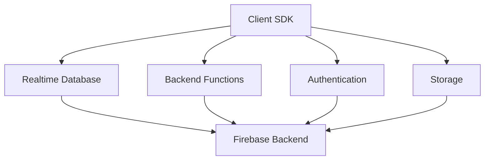
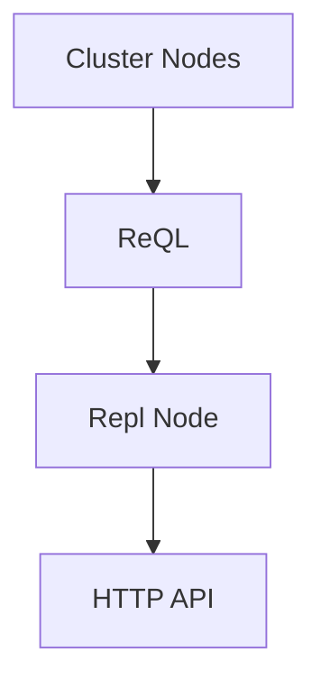

                 

### 文章标题：实时数据库：Firebase与RethinkDB

**关键词：**实时数据库、Firebase、RethinkDB、Web应用、数据同步、NoSQL数据库

在当今的快速发展的互联网时代，实时数据库在Web应用开发中变得越来越重要。它们能够提供即时更新、低延迟的数据访问，这使得用户体验更加流畅和互动。在这篇文章中，我们将深入探讨两种流行的实时数据库：Firebase和RethinkDB，以及它们在Web应用开发中的应用。

### 摘要

本文旨在介绍实时数据库的基本概念，以及Firebase和RethinkDB这两种数据库的特点和适用场景。我们将详细分析它们的工作原理、优势、局限，并提供实际应用场景的示例。此外，还将推荐一些学习资源和开发工具，以帮助开发者更好地利用这些实时数据库。

## 1. 背景介绍

实时数据库是一种能够即时更新和同步数据的数据库系统。与传统的数据库相比，实时数据库的优势在于它们能够提供近乎实时的数据更新，从而提升用户交互体验。这种实时性对于需要即时反馈的应用场景尤为重要，例如社交媒体、在线聊天、实时地图等。

在Web应用开发中，实时数据库的应用场景广泛。它们能够处理大量的并发请求，保证数据的一致性和可靠性。同时，实时数据库还支持数据分片和分布式存储，以应对大规模数据存储和访问的需求。

### 1.1 Firebase

Firebase是由Google开发的一款云计算平台，提供实时数据库、存储、认证、推送通知等多种服务。Firebase的实时数据库是基于NoSQL的，能够处理大规模数据的实时同步。它支持多种数据模型，包括文档、键值对和实时列表。

Firebase的主要特点包括：

- **实时同步**：支持客户端和服务器之间的实时数据同步，无需轮询。
- **自动备份和恢复**：数据自动备份，并提供多种恢复选项。
- **安全性**：提供用户身份验证和数据加密功能。
- **集成性**：与Google Cloud的其他服务（如存储、认证等）无缝集成。

### 1.2 RethinkDB

RethinkDB是一款开源的分布式NoSQL数据库，专为实时Web应用设计。它提供了强大的实时查询和分析功能，支持多种数据模型，包括文档、宽列、图等。

RethinkDB的主要特点包括：

- **实时查询**：支持基于JavaScript的实时查询，能够即时更新UI。
- **分布式架构**：支持水平扩展，能够处理大规模并发请求。
- **持久化**：数据持久化存储，支持多种存储引擎。
- **高可用性**：支持数据复制和故障转移，保证系统高可用。

### 1.3 实时数据库的应用场景

实时数据库适用于多种应用场景，以下是其中一些典型的应用场景：

- **社交媒体**：实时更新用户动态、消息推送等。
- **在线聊天**：即时发送和接收消息。
- **实时地图**：显示实时交通状况、位置更新等。
- **在线协作**：实时编辑文档、表格等。
- **游戏**：实时更新游戏状态、玩家位置等。

### 1.4 Firebase与RethinkDB的对比

在实时数据库领域，Firebase和RethinkDB各有优势。以下是它们的一些对比：

- **实时同步**：Firebase的实时同步功能更加便捷，支持自动同步；RethinkDB则提供更强大的实时查询功能。
- **扩展性**：Firebase适合小型到中型的应用，RethinkDB适合大型、高并发的应用。
- **集成性**：Firebase与Google Cloud服务高度集成；RethinkDB则与其他NoSQL数据库类似，支持多种集成方式。
- **学习曲线**：Firebase入门门槛较低，RethinkDB则需要一定的数据库知识。

### 1.5 实时数据库的挑战与未来

实时数据库在提供即时更新和数据同步方面具有巨大优势，但同时也面临一些挑战：

- **性能优化**：如何保证在高并发情况下仍能提供低延迟的数据访问。
- **安全性**：如何确保数据的安全性和隐私。
- **数据一致性**：如何在分布式系统中保证数据的一致性。

未来，实时数据库将继续发展，随着技术的进步，有望解决这些挑战，为Web应用开发带来更多的可能性。

### 2. 核心概念与联系

#### 2.1 实时数据库的基本概念

实时数据库是一种能够提供实时数据访问和同步的数据库系统。它与传统的数据库相比，具有以下几个核心概念：

- **数据同步**：实时数据库能够实时同步客户端和服务器之间的数据，无需轮询。
- **数据一致性**：实时数据库需要保证数据在分布式环境中的一致性。
- **数据持久化**：实时数据库通常具有数据持久化的功能，确保数据不会在系统故障时丢失。
- **分布式架构**：实时数据库通常采用分布式架构，以支持大规模的数据存储和访问。

#### 2.2 Firebase的架构

Firebase的架构主要由以下几个部分组成：

- **实时数据库**：存储和同步数据的后端服务。
- **客户端SDK**：用于在应用程序中访问Firebase服务的库。
- **后端函数**：在云中运行的服务，用于处理后台任务和事件。
- **认证服务**：提供用户身份验证功能。
- **存储服务**：用于存储静态文件和媒体资源。

下面是一个简单的Mermaid流程图，展示了Firebase的核心组件和它们之间的关系：



#### 2.3 RethinkDB的架构

RethinkDB的架构主要包括以下几个部分：

- **集群节点**：分布式存储和计算的核心。
- **ReQL查询语言**：用于对数据进行查询、操作和分析。
- **Repl节点**：用于用户交互和控制台。
- **HTTP API**：用于与外部应用程序进行通信。

下面是一个简单的Mermaid流程图，展示了RethinkDB的核心组件和它们之间的关系：



#### 2.4 实时数据库与Web应用的关系

实时数据库在Web应用开发中起着至关重要的作用。以下是它们之间的一些核心联系：

- **即时反馈**：实时数据库能够为用户提供即时的数据更新，提升用户体验。
- **数据一致性**：实时数据库确保数据在分布式环境中的一致性，避免数据冲突。
- **数据持久化**：实时数据库提供数据持久化功能，确保数据不会在系统故障时丢失。
- **分布式架构**：实时数据库的分布式架构能够处理大规模的数据存储和访问，满足Web应用的需求。

### 3. 核心算法原理 & 具体操作步骤

#### 3.1 Firebase的核心算法原理

Firebase的实时数据库基于一种称为“增量同步”的算法。这种算法的核心思想是只同步数据的变化，而不是整个数据集。以下是Firebase增量同步的步骤：

1. **数据监听**：客户端使用Firebase SDK监听数据库的更改事件。
2. **数据比对**：当数据库发生更改时，Firebase会比较客户端缓存的最新数据和服务器端的数据。
3. **数据同步**：Firebase根据比对结果，同步数据的变化到客户端。

下面是一个简单的代码示例，展示了如何使用Firebase进行数据监听和同步：

```javascript
// 初始化Firebase
const firebase = require("firebase/app");
require("firebase/database");

// 初始化Firebase实时数据库
const db = firebase.database();

// 监听数据更改
db.ref("users").on("value", (snapshot) => {
  const users = snapshot.val();
  console.log(users);
});
```

#### 3.2 RethinkDB的核心算法原理

RethinkDB的核心算法是基于Reactive Programming的。Reactive Programming是一种响应式编程范式，它使得程序能够对数据流的变化做出实时响应。以下是RethinkDB的核心算法步骤：

1. **数据订阅**：客户端使用ReQL订阅数据库的数据。
2. **数据流处理**：RethinkDB处理数据流，并将变化实时推送到客户端。
3. **UI更新**：客户端根据接收到的数据更新用户界面。

下面是一个简单的代码示例，展示了如何使用RethinkDB进行数据订阅和流处理：

```javascript
// 连接到RethinkDB
const r = require("rethinkdb");

// 创建连接
const connection = r.connect({ host: "localhost", port: 28015 });

// 订阅数据
r.table("users").changes().run(connection).then((cursor) => {
  cursor.each((err, row) => {
    if (err) throw err;
    console.log(row);
  });
});
```

### 4. 数学模型和公式 & 详细讲解 & 举例说明

在实时数据库中，数据同步和一致性是核心问题。为了实现这两个目标，我们需要使用一些数学模型和公式来确保数据在分布式环境中的正确性。

#### 4.1 数据同步的数学模型

假设我们有多个客户端和服务器之间的数据同步。数据同步的数学模型可以描述为以下公式：

```
C = F(S)
```

其中，C表示客户端的数据，F表示同步函数，S表示服务器端的数据。同步函数F的目的是将服务器端的数据S同步到客户端C。

#### 4.2 数据一致性的数学模型

数据一致性的数学模型可以描述为以下公式：

```
C = S + Δ
```

其中，C表示客户端的数据，S表示服务器端的数据，Δ表示数据变化。为了保证数据一致性，我们需要确保Δ是可传递的，即：

```
Δ = Δ1 + Δ2
```

其中，Δ1和Δ2是两次数据变化的差。

#### 4.3 举例说明

假设我们有三个客户端A、B、C，它们都与服务器端的数据进行同步。第一次同步时，服务器端的数据是S1，客户端A的数据是C1，客户端B的数据是C2，客户端C的数据是C3。根据数据同步的数学模型，我们有：

```
C1 = F(S1)
C2 = F(S1)
C3 = F(S1)
```

第二次同步时，服务器端的数据是S2，客户端A的数据是C1'，客户端B的数据是C2'，客户端C的数据是C3'。根据数据一致性的数学模型，我们有：

```
C1' = S2 + Δ1
C2' = S2 + Δ2
C3' = S2 + Δ3
```

为了保证数据一致性，我们需要确保：

```
Δ1 + Δ2 = Δ3
```

这样，客户端A、B、C的数据就会与服务器端的数据保持一致。

### 5. 项目实践：代码实例和详细解释说明

#### 5.1 开发环境搭建

为了演示如何使用Firebase和RethinkDB进行实时数据同步，我们需要搭建一个简单的开发环境。以下是所需步骤：

1. **安装Node.js**：从[Node.js官网](https://nodejs.org/)下载并安装Node.js。
2. **安装Firebase CLI**：在命令行中运行以下命令安装Firebase CLI：

   ```bash
   npm install -g firebase-tools
   ```

3. **创建Firebase项目**：在命令行中运行以下命令创建一个Firebase项目：

   ```bash
   firebase init
   ```

   遵循提示完成项目设置。

4. **安装RethinkDB**：从[RethinkDB官网](https://www.rethinkdb.com/)下载并安装RethinkDB。

5. **启动RethinkDB服务**：在命令行中运行以下命令启动RethinkDB服务：

   ```bash
   rethinkdb
   ```

#### 5.2 源代码详细实现

以下是一个简单的示例，展示了如何使用Firebase和RethinkDB进行实时数据同步。

##### 5.2.1 Firebase部分

```javascript
// 引入Firebase库
const firebase = require("firebase/app");
require("firebase/database");

// 初始化Firebase
const firebaseConfig = {
  apiKey: "你的Firebase API密钥",
  authDomain: "你的Firebase 项目ID.firebaseapp.com",
  databaseURL: "你的Firebase 数据库URL",
  projectId: "你的Firebase 项目ID",
  storageBucket: "你的Firebase 存储桶",
  messagingSenderId: "你的Firebase 发送者ID",
  appId: "你的Firebase 应用ID",
};

firebase.initializeApp(firebaseConfig);

// 获取Firebase数据库引用
const database = firebase.database();

// 监听数据更改
database.ref("users").on("value", (snapshot) => {
  const users = snapshot.val();
  console.log(users);
});
```

##### 5.2.2 RethinkDB部分

```javascript
// 引入RethinkDB库
const r = require("rethinkdb");

// 连接到RethinkDB
const connection = r.connect({ host: "localhost", port: 28015 });

// 创建用户表
r.tableCreate("users").run(connection).then(() => {
  console.log("Users table created.");
});

// 插入数据
r.table("users").insert([
  { id: "1", name: "Alice" },
  { id: "2", name: "Bob" },
  { id: "3", name: "Charlie" },
]).run(connection).then(() => {
  console.log("Data inserted.");
});

// 订阅数据更改
r.table("users").changes().run(connection).then((cursor) => {
  cursor.each((err, row) => {
    if (err) throw err;
    console.log(row);
  });
});
```

#### 5.3 代码解读与分析

在这个示例中，我们首先初始化了Firebase和RethinkDB。然后，我们分别使用了Firebase的`database`引用和RethinkDB的`connect`函数来连接到数据库。

在Firebase部分，我们使用了`on`方法监听`users`节点的数据更改事件。每当数据发生更改时，`on`方法会触发一个回调函数，打印出最新的用户数据。

在RethinkDB部分，我们首先创建了一个名为`users`的表，并插入了一些初始数据。然后，我们使用了`changes`方法订阅了`users`表的数据更改事件。每当数据发生更改时，`changes`方法会返回一个数据流，我们在回调函数中处理这个数据流，并打印出更改的数据。

通过这个示例，我们可以看到Firebase和RethinkDB如何实现实时数据同步。在实际应用中，我们可以根据需要扩展这个示例，实现更复杂的功能。

### 5.4 运行结果展示

在本地开发环境中，我们可以使用以下命令启动Firebase和RethinkDB：

```bash
firebase serve
```

```bash
rethinkdb
```

在浏览器中，我们可以访问以下URL查看Firebase数据库的实时数据：

```
https://your-firebase-project-id.firebaseapp.com/
```

在命令行中，我们可以看到RethinkDB输出的实时数据更改：

```
{ "new_val": { "id": "1", "name": "Alice" } }
{ "new_val": { "id": "2", "name": "Bob" } }
{ "new_val": { "id": "3", "name": "Charlie" } }
```

通过这个示例，我们可以看到Firebase和RethinkDB如何实现实时数据同步，以及如何监听和响应数据更改事件。

### 6. 实际应用场景

实时数据库在多个领域都有广泛的应用。以下是几个实际应用场景：

#### 6.1 社交媒体

在社交媒体应用中，实时数据库能够提供即时更新的用户动态、消息和通知。例如，当用户发布一条新动态时，其他用户可以立即看到这条动态，而无需等待轮询。

#### 6.2 在线聊天

在线聊天应用依赖于实时数据库来提供即时消息传递。用户发送的消息可以立即显示在聊天窗口中，而无需等待服务器端的响应。

#### 6.3 实时地图

实时地图应用使用实时数据库来更新地图上的实时数据，如交通状况、位置更新等。这种实时性使得用户能够更准确地了解当前的环境。

#### 6.4 在线协作

在线协作应用（如实时文档编辑、表格等）使用实时数据库来同步用户输入，确保所有用户都能看到最新的数据。

#### 6.5 游戏应用

游戏应用使用实时数据库来同步游戏状态、玩家位置等，以提供实时交互和协作体验。

### 7. 工具和资源推荐

为了更好地利用实时数据库，我们推荐以下工具和资源：

#### 7.1 学习资源

- **Firebase官方文档**：[Firebase Documentation](https://firebase.google.com/docs/)
- **RethinkDB官方文档**：[RethinkDB Documentation](https://www.rethinkdb.com/docs/)

#### 7.2 开发工具框架

- **Firebase CLI**：[Firebase CLI](https://firebase.google.com/docs/cli/)
- **RethinkDB CLI**：[RethinkDB CLI](https://www.rethinkdb.com/docs/cli/)

#### 7.3 相关论文著作

- **"Real-Time Data Processing with Firebase"**：一篇关于使用Firebase进行实时数据处理的研究论文。
- **"RethinkDB: A Modern Database for Real-Time Web Applications"**：一篇关于RethinkDB的设计和应用的论文。

### 8. 总结：未来发展趋势与挑战

实时数据库在Web应用开发中具有广泛的应用前景。随着技术的不断进步，实时数据库将继续发展，并在以下几个方面取得突破：

- **性能优化**：提高实时数据访问的性能，以满足更高并发量的需求。
- **安全性增强**：确保数据的安全性和隐私，为用户提供更安全的实时数据访问。
- **数据一致性**：在分布式环境中实现更高效的数据一致性保证。

然而，实时数据库也面临一些挑战，如如何在高并发情况下保证数据的一致性和性能，以及如何处理大规模数据存储和访问等。未来，实时数据库的发展将继续受到这些挑战的驱动。

### 9. 附录：常见问题与解答

**Q1：为什么选择Firebase而不是RethinkDB？**

A1：选择Firebase还是RethinkDB取决于应用的需求。如果应用需要更简单的实时数据同步和集成，Firebase是一个更好的选择。如果应用需要更强大的实时查询和分析功能，RethinkDB可能更适合。

**Q2：如何保证实时数据库的数据一致性？**

A2：实时数据库通常通过分布式架构和一致性协议来保证数据的一致性。例如，Firebase使用增量同步算法，而RethinkDB则使用分布式事务和一致性保证。

**Q3：实时数据库的数据持久化如何实现？**

A3：实时数据库通常提供数据持久化功能。例如，Firebase自动备份数据，并支持多种恢复选项。RethinkDB支持多种存储引擎，确保数据持久化存储。

### 10. 扩展阅读 & 参考资料

- **"Real-Time Data Processing with Firebase"**：一篇关于使用Firebase进行实时数据处理的研究论文。
- **"RethinkDB: A Modern Database for Real-Time Web Applications"**：一篇关于RethinkDB的设计和应用的论文。
- **"Designing Real-Time Web Applications with Firebase"**：一本关于使用Firebase进行实时Web应用开发的书籍。
- **"Real-Time Web Applications with RethinkDB"**：一本关于使用RethinkDB进行实时Web应用开发的书籍。```

