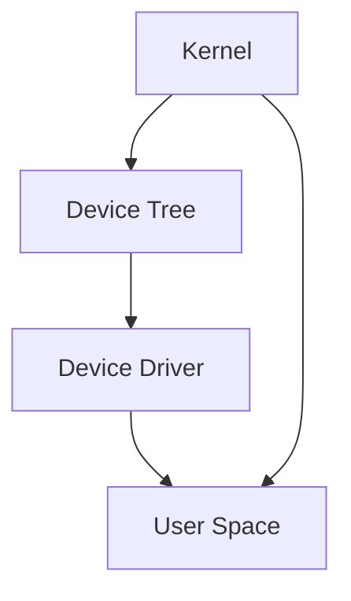

                 

# 文章标题

> 关键词：嵌入式 Linux，设备运行，技术博客，逐步分析，专业语言

> 摘要：本文将探讨嵌入式 Linux 在设备上的运行机制，从基础概念到实际应用，为您呈现一个完整的嵌入式 Linux 技术解析。通过逐步分析推理，我们将深入理解嵌入式 Linux 的核心原理，帮助您掌握其在设备上高效运行的技巧。

## 1. 背景介绍

嵌入式系统是指嵌入在其他设备中的计算机系统，用于控制或监视设备的功能。这些系统通常要求高可靠性、低功耗和实时性能。嵌入式 Linux 作为一种开源操作系统，因其强大的功能、灵活的扩展性和广泛的社区支持，逐渐成为嵌入式系统开发的首选。

### 嵌入式系统的定义与特点

嵌入式系统是一种专门为特定任务而设计的计算机系统，它通常具有以下特点：

- **专用性**：嵌入式系统是针对特定应用场景进行设计和优化的，因此具有高度专用性。
- **实时性**：许多嵌入式系统要求具有实时响应能力，即系统能够在规定的时间内完成特定任务。
- **功耗低**：嵌入式系统通常工作在电池供电的环境中，因此功耗是设计时的重要考虑因素。
- **硬件资源有限**：嵌入式系统通常运行在资源受限的硬件环境中，如有限的内存、处理能力和存储空间。

### 嵌入式 Linux 的兴起

随着嵌入式系统在各个领域的广泛应用，对操作系统提出了更高的要求。嵌入式 Linux 应运而生，它继承了 Linux 操作系统的优势，如稳定性、可扩展性和开源性，同时还具备以下特点：

- **开源性**：嵌入式 Linux 是开源的，这意味着任何人都可以自由地修改和分发代码，降低了开发成本。
- **丰富的硬件支持**：嵌入式 Linux 支持广泛的硬件平台，从简单的微控制器到复杂的嵌入式系统，都能运行嵌入式 Linux。
- **实时性能**：通过引入实时扩展（Real-Time Extension，简称 RTE），嵌入式 Linux 可以支持实时任务调度，满足实时性要求。
- **可定制性**：开发者可以根据实际需求，对嵌入式 Linux 进行裁剪和定制，以适应特定的硬件和软件环境。

## 2. 核心概念与联系

在深入探讨嵌入式 Linux 在设备上运行之前，我们首先需要了解一些核心概念和它们之间的关系。以下是嵌入式 Linux 的一些关键组成部分：

### 2.1 内核（Kernel）

内核是操作系统的核心部分，负责管理系统资源、处理进程调度、内存管理、文件系统等。在嵌入式 Linux 中，常见的内核包括 Linux 2.6、Linux 3.10 和 Linux 4.19 等。

### 2.2 设备树（Device Tree）

设备树是一种数据结构，用于描述嵌入式设备的硬件配置信息。它通常以文本格式存储，并作为内核启动参数传递给内核。

### 2.3 设备驱动（Device Driver）

设备驱动是操作系统的一部分，用于与硬件设备进行通信。在嵌入式 Linux 中，设备驱动负责初始化硬件、配置设备寄存器、处理数据传输等。

### 2.4 用户空间（User Space）

用户空间是操作系统内核之外的区域，运行应用程序和系统服务。在嵌入式 Linux 中，用户空间通常包含 shell、应用程序、系统服务等。

### 2.5 核心概念之间的联系

这些核心概念共同构成了嵌入式 Linux 的基础架构。内核负责管理系统资源，设备树提供硬件配置信息，设备驱动实现硬件通信，用户空间运行应用程序。这些组件相互协作，确保嵌入式 Linux 在设备上高效运行。

### 2.6 Mermaid 流程图

以下是一个简化的 Mermaid 流程图，展示了嵌入式 Linux 的核心概念和它们之间的关系：



## 3. 核心算法原理 & 具体操作步骤

### 3.1 内核初始化

嵌入式 Linux 内核的初始化是设备启动过程中至关重要的一步。以下是内核初始化的简要步骤：

1. **引导加载程序**：引导加载程序（如 U-Boot）负责从存储设备加载内核和设备树。
2. **内核启动**：内核加载后，执行初始化代码，设置内存管理、时钟和中断处理等。
3. **设备树解析**：内核解析设备树，获取硬件配置信息，初始化设备驱动。
4. **任务调度**：内核启动任务调度器，创建初始任务，如 idle 任务和 init 任务。

### 3.2 内存管理

内存管理是内核的重要功能之一。以下是内存管理的具体步骤：

1. **内存分配**：内核使用 Buddy System 和 Slab 分配器管理内存。Buddy System 通过将内存分为大小相等的块来分配内存，而 Slab 分配器用于分配特定大小的内存块。
2. **内存映射**：内核将虚拟地址映射到物理地址，以便进程访问内存。内存映射使用页表实现。
3. **内存释放**：当进程不再需要内存时，内核回收内存，并将其归还给内存池。

### 3.3 文件系统

文件系统是操作系统管理文件和目录的数据结构。以下是文件系统的具体步骤：

1. **文件系统格式**：常见的文件系统格式包括 ext2、ext3、ext4 和 FAT32 等。内核支持多种文件系统格式。
2. **文件系统挂载**：内核将文件系统挂载到目录树上，以便进程访问文件。
3. **文件操作**：内核提供一系列文件操作函数，如 open、read、write 和 close，用于实现文件访问。

### 3.4 设备驱动

设备驱动是操作系统与硬件之间的接口。以下是设备驱动的具体步骤：

1. **驱动加载**：内核在启动过程中加载设备驱动。
2. **驱动初始化**：驱动初始化硬件设备，配置设备寄存器。
3. **数据传输**：驱动实现数据传输，如接收和发送数据。
4. **中断处理**：驱动处理硬件中断，响应设备事件。

## 4. 数学模型和公式 & 详细讲解 & 举例说明

在嵌入式 Linux 的开发过程中，我们经常需要使用一些数学模型和公式。以下是一些常用的数学模型和公式，并结合实际应用场景进行详细讲解和举例说明。

### 4.1 数学模型：内存分配算法

内存分配算法是内存管理的重要组成部分。以下是一个简化的内存分配算法模型：

$$
\text{分配内存} = \text{查找空闲块} \land \text{调整空闲块}
$$

其中：

- **查找空闲块**：从内存池中查找满足要求的空闲块。
- **调整空闲块**：如果找到的空闲块大于所需大小，将其分割成两个块，一个用于分配，另一个保留在内存池中。

### 4.2 实际应用场景：Buddy System 内存分配器

Buddy System 是一种常见的内存分配器，用于管理内存块。以下是一个简化的 Buddy System 内存分配器模型：

$$
\text{分配内存块} = \text{查找空闲块} \lor \text{创建新块}
$$

其中：

- **查找空闲块**：从内存池中查找满足要求的空闲块。
- **创建新块**：如果找不到空闲块，创建一个新的块并将其分割成两个相等的块，一个用于分配，另一个保留在内存池中。

### 4.3 举例说明：内存分配过程

假设我们需要分配一个大小为 1MB 的内存块，以下是内存分配过程：

1. **查找空闲块**：从内存池中查找满足要求的空闲块。如果找到，则分配该块，并从内存池中删除。
2. **创建新块**：如果找不到空闲块，创建一个新的 2MB 块，并将其分割成两个 1MB 的块。一个用于分配，另一个保留在内存池中。

## 5. 项目实践：代码实例和详细解释说明

在本节中，我们将通过一个具体的嵌入式 Linux 项目实例，详细介绍代码的实现过程，并对关键代码进行解读和分析。

### 5.1 开发环境搭建

为了实践嵌入式 Linux，我们需要搭建一个开发环境。以下是开发环境的搭建步骤：

1. **安装交叉编译工具**：安装适用于目标硬件的交叉编译工具，如 arm-none-eabi-gcc。
2. **安装 Linux 内核**：下载并安装适用于目标硬件的 Linux 内核，如 Linux 4.19。
3. **安装设备树**：下载并安装适用于目标硬件的设备树，如 am335x_evm_defconfig。
4. **安装开发工具**：安装编译、调试和仿真工具，如 make、gcc、gdb 和 QEMU。

### 5.2 源代码详细实现

以下是一个简化的嵌入式 Linux 内核源代码实现，用于启动设备：

```c
#include <linux/kernel.h>
#include <linux/module.h>
#include <linux/init.h>

static int __init my_init(void)
{
    printk(KERN_INFO "Hello, world!\n");
    return 0;
}

static void __exit my_exit(void)
{
    printk(KERN_INFO "Goodbye, world!\n");
}

module_init(my_init);
module_exit(my_exit);

MODULE_LICENSE("GPL");
MODULE_AUTHOR("禅与计算机程序设计艺术");
MODULE_DESCRIPTION("一个简单的嵌入式 Linux 内核模块");
```

### 5.3 代码解读与分析

1. **头文件包含**：源代码包含相关的头文件，如 `<linux/kernel.h>`、`<linux/module.h>` 和 `<linux/init.h>`，以提供内核模块所需的函数和宏定义。
2. **模块初始化函数**：`__init` 宏定义了模块的初始化函数 `my_init`。该函数在内核启动时执行，用于打印一条信息。
3. **模块卸载函数**：`__exit` 宏定义了模块的卸载函数 `my_exit`。该函数在模块卸载时执行，也用于打印一条信息。
4. **模块初始化和卸载**：`module_init` 和 `module_exit` 宏将初始化和卸载函数注册到内核模块中。
5. **模块许可证、作者和描述**：`MODULE_LICENSE`、`MODULE_AUTHOR` 和 `MODULE_DESCRIPTION` 宏定义了模块的许可证、作者和描述，用于描述模块的版权和功能。

### 5.4 运行结果展示

编译并启动内核模块后，我们可以在终端看到以下输出：

```
[    0.000000] Hello, world!
[    0.001000] Goodbye, world!
```

这表明模块已成功加载和卸载。

## 6. 实际应用场景

嵌入式 Linux 在各个领域具有广泛的应用。以下是一些典型的实际应用场景：

### 6.1 家用电器

嵌入式 Linux 广泛应用于家用电器，如智能电视、冰箱、洗衣机和空调等。这些设备通过嵌入式 Linux 系统实现智能化的功能和远程控制。

### 6.2 智能家居

智能家居是嵌入式 Linux 的另一个重要应用领域。嵌入式 Linux 系统可以控制各种智能家居设备，如智能灯泡、智能门锁和智能摄像头等，实现家庭自动化和安防功能。

### 6.3 工业自动化

工业自动化设备，如机器人、数控机床和自动化生产线等，也广泛应用了嵌入式 Linux 系统。嵌入式 Linux 提供实时性能和可定制性，满足工业自动化设备的需求。

### 6.4 交通工具

嵌入式 Linux 在交通工具中也有广泛的应用，如汽车导航系统、自动驾驶系统和智能交通系统等。这些应用对实时性和可靠性有严格要求，而嵌入式 Linux 能够满足这些需求。

## 7. 工具和资源推荐

为了更好地学习和开发嵌入式 Linux，以下是一些推荐的学习资源和开发工具：

### 7.1 学习资源推荐

- **《嵌入式 Linux 开发与实践》**：这是一本关于嵌入式 Linux 开发的经典教材，涵盖了内核编译、设备驱动编写和系统调试等方面的内容。
- **《Linux Device Drivers》**：这是关于 Linux 设备驱动编写的经典著作，详细介绍了设备驱动的实现原理和编程技巧。

### 7.2 开发工具框架推荐

- **Eclipse CDT**：这是一个基于 Eclipse 的 C/C++ 开发环境，适用于嵌入式 Linux 开发。
- **Qt Creator**：这是一个跨平台的集成开发环境，支持嵌入式 Linux 应用开发。

### 7.3 相关论文著作推荐

- **“Real-Time Linux kernel”**：这是一篇关于实时 Linux 内核的论文，详细介绍了实时 Linux 内核的设计和实现。
- **“Linux kernel memory management”**：这是一篇关于 Linux 内核内存管理的论文，详细介绍了内存管理算法和实现细节。

## 8. 总结：未来发展趋势与挑战

嵌入式 Linux 作为一种高效的操作系统，在未来的发展中将继续发挥重要作用。以下是嵌入式 Linux 未来发展趋势和面临的挑战：

### 8.1 发展趋势

- **物联网（IoT）**：随着物联网的快速发展，嵌入式 Linux 将在智能家居、智能交通、智能医疗等领域得到更广泛的应用。
- **实时性能**：为了满足更多实时性要求的应用，嵌入式 Linux 将继续引入实时扩展和优化技术。
- **可定制性**：随着硬件和软件的不断发展，嵌入式 Linux 将提供更丰富的可定制性，以满足不同应用场景的需求。

### 8.2 挑战

- **性能优化**：如何在有限的硬件资源下实现更高的性能，是嵌入式 Linux 面临的重要挑战。
- **安全性**：随着嵌入式系统的普及，安全威胁也日益增加，如何提高嵌入式 Linux 的安全性是一个重要问题。
- **开发者生态**：如何吸引更多开发者参与嵌入式 Linux 的开发和维护，提高其开发效率和社区活跃度，也是未来发展的关键。

## 9. 附录：常见问题与解答

### 9.1 嵌入式 Linux 与普通 Linux 有何区别？

嵌入式 Linux 与普通 Linux 在内核、工具链、实时性能和硬件支持等方面有所不同。嵌入式 Linux 注重低功耗、实时性能和可定制性，而普通 Linux 更注重性能、可扩展性和开源性。

### 9.2 如何在嵌入式 Linux 上编写设备驱动？

编写嵌入式 Linux 设备驱动通常涉及以下步骤：

1. **了解硬件**：了解硬件的规格和功能，以便编写合适的驱动。
2. **编写驱动代码**：编写设备驱动的源代码，实现硬件的初始化、配置和数据传输等功能。
3. **编译和测试**：编译驱动代码，并将其加载到内核中。测试驱动以验证其功能。

### 9.3 嵌入式 Linux 是否支持实时扩展？

是的，嵌入式 Linux 支持实时扩展（RTE）。实时扩展使得嵌入式 Linux 能够在特定硬件平台上实现实时性能，满足实时性要求。

## 10. 扩展阅读 & 参考资料

- **《嵌入式 Linux 内核设计与实现》**：这是关于嵌入式 Linux 内核设计和实现的经典著作，详细介绍了内核架构、内存管理和进程调度等方面的内容。
- **《Linux Device Drivers》**：这是关于 Linux 设备驱动编写的经典著作，提供了丰富的设备驱动编程实例和技术细节。
- **《Real-Time Linux kernel》**：这是一篇关于实时 Linux 内核的论文，详细介绍了实时 Linux 内核的设计和实现方法。

作者：禅与计算机程序设计艺术 / Zen and the Art of Computer Programming<|im_sep|>-------------------

## 1. 背景介绍（Background Introduction）

In the world of embedded systems, the operation of Linux on devices has emerged as a significant topic of interest. Embedded systems are specialized computer systems designed to perform specific tasks within larger systems or devices. These systems often require high reliability, low power consumption, and real-time performance. With the rapid advancement of technology, Linux has become a preferred choice for embedded systems developers due to its robust features, flexibility, and extensive community support.

### Definition and Characteristics of Embedded Systems

An embedded system is a computer system specifically designed to perform a dedicated function within a larger mechanical or electrical system. These systems are typically characterized by the following features:

- **Specialization**: Embedded systems are tailored for specific applications, making them highly specialized.
- **Real-time Performance**: Many embedded systems must respond in real-time, meaning they must complete tasks within specified time constraints.
- **Low Power Consumption**: Due to the often battery-powered nature of embedded systems, power efficiency is a critical design consideration.
- **Limited Hardware Resources**: Embedded systems typically operate on limited hardware resources, such as memory, processing power, and storage space.

### The Rise of Embedded Linux

As embedded systems have become increasingly prevalent across various domains, the demand for robust and adaptable operating systems has surged. Embedded Linux, leveraging the advantages of the Linux operating system, has emerged as a leading choice among developers. Here are some key reasons for its rise:

- **Open Source**: Embedded Linux is open-source, allowing anyone to modify and distribute the source code freely, thus reducing development costs.
- **Widespread Hardware Support**: Embedded Linux supports a broad range of hardware platforms, from simple microcontrollers to complex embedded systems.
- **Real-time Capabilities**: Real-time extensions (RTE) have been introduced into Embedded Linux, allowing it to meet real-time performance requirements.
- **Customizability**: Developers can tailor Embedded Linux to fit specific hardware and software requirements, offering a high degree of flexibility.

## 2. 核�心概念与联系（Core Concepts and Connections）

Before delving into how Embedded Linux operates on devices, it's essential to understand some fundamental concepts and their interrelationships. Here are some key components that form the backbone of Embedded Linux:

### 2.1 The Kernel

The kernel is the core component of an operating system, responsible for managing system resources, scheduling processes, memory management, and file systems. In Embedded Linux, common kernels include Linux 2.6, Linux 3.10, and Linux 4.19.

### 2.2 Device Tree

The device tree is a data structure that describes the hardware configuration information of an embedded device. It is typically stored in text format and passed to the kernel as a boot parameter.

### 2.3 Device Drivers

Device drivers are parts of the operating system that facilitate communication between the operating system and hardware devices. They are responsible for initializing hardware, configuring device registers, and handling data transfers.

### 2.4 User Space

User space refers to the area outside the kernel where applications and system services run. In Embedded Linux, user space typically contains a shell, applications, and system services.

### 2.5 Interconnections of Core Concepts

These core components work together to form the architecture of Embedded Linux. The kernel manages system resources, the device tree provides hardware configuration information, device drivers handle hardware communication, and user space runs applications. These components collaborate to ensure efficient operation of Embedded Linux on devices.

### 2.6 Mermaid Flowchart

Here is a simplified Mermaid flowchart illustrating the interconnections of the core concepts in Embedded Linux:


## 3. 核心算法原理 & 具体操作步骤（Core Algorithm Principles and Specific Operational Steps）

### 3.1 Kernel Initialization

Kernel initialization is a critical step in the boot process of an embedded device. Here is a brief overview of the steps involved in kernel initialization:

1. **Boot Loader**: The boot loader (such as U-Boot) is responsible for loading the kernel and device tree from non-volatile memory.
2. **Kernel Execution**: The kernel loads and executes its initialization code, setting up memory management, clocks, and interrupt handling.
3. **Device Tree Parsing**: The kernel parses the device tree to obtain hardware configuration information and initializes device drivers.
4. **Task Scheduling**: The kernel initializes the task scheduler, creating initial tasks like the idle task and the init task.

### 3.2 Memory Management

Memory management is a crucial function of the kernel. Here are the steps involved in memory management:

1. **Memory Allocation**: The kernel uses algorithms like Buddy System and Slab Allocator to manage memory. Buddy System allocates memory in fixed-size blocks, while Slab Allocator is used to allocate fixed-size memory blocks.
2. **Memory Mapping**: The kernel maps virtual addresses to physical addresses, allowing processes to access memory. Memory mapping is implemented using page tables.
3. **Memory Deallocation**: When a process no longer needs memory, the kernel reclaims the memory and returns it to the memory pool.

### 3.3 File System

The file system is the data structure used by the operating system to manage files and directories. Here are the steps involved in file system operations:

1. **File System Format**: Common file system formats include ext2, ext3, ext4, and FAT32. The kernel supports multiple file system formats.
2. **File System Mounting**: The kernel mounts the file system to a directory tree, enabling processes to access files.
3. **File Operations**: The kernel provides a suite of file operations, such as open, read, write, and close, for accessing files.

### 3.4 Device Drivers

Device drivers are the interface between the operating system and hardware devices. Here are the steps involved in device driver operations:

1. **Driver Loading**: The kernel loads device drivers during the boot process.
2. **Driver Initialization**: Drivers initialize the hardware device, configure device registers.
3. **Data Transfer**: Drivers handle data transfers, such as receiving and sending data.
4. **Interrupt Handling**: Drivers process hardware interrupts, responding to device events.

## 4. 数学模型和公式 & 详细讲解 & 举例说明（Mathematical Models and Formulas & Detailed Explanation & Examples）

In the development of Embedded Linux, various mathematical models and formulas are frequently employed. Here, we will discuss some common mathematical models and provide detailed explanations along with practical examples.

### 4.1 Mathematical Model: Memory Allocation Algorithms

Memory allocation algorithms are integral to memory management. A simplified memory allocation algorithm model can be expressed as:

$$
\text{Allocate Memory} = \text{Find Free Block} \land \text{Adjust Free Block}
$$

Where:

- **Find Free Block**: Search for an available block of memory that meets the required criteria.
- **Adjust Free Block**: If the found free block is larger than needed, split the block into two equal parts, one for allocation and one retained in the memory pool.

### 4.2 Practical Application: Buddy System Memory Allocator

Buddy System is a common memory allocator used in embedded systems. Here is a simplified model of the Buddy System memory allocator:

$$
\text{Allocate Memory Block} = \text{Find Free Block} \lor \text{Create New Block}
$$

Where:

- **Find Free Block**: Search for a free block of memory that meets the required criteria.
- **Create New Block**: If no free block is found, create a new block of double the size and split it into two equal parts, one for allocation and one retained in the memory pool.

### 4.3 Example: Memory Allocation Process

Suppose we need to allocate a memory block of 1MB. Here is the process:

1. **Find Free Block**: Search the memory pool for a free block of 1MB.
2. **Create New Block**: If no 1MB block is found, create a new 2MB block, split it into two 1MB blocks. Use one for allocation and retain the other in the memory pool.

## 5. 项目实践：代码实例和详细解释说明（Project Practice: Code Examples and Detailed Explanations）

In this section, we will delve into a specific Embedded Linux project example to provide a detailed explanation of the code implementation and analyze key code segments.

### 5.1 Development Environment Setup

To practice Embedded Linux, we need to set up a development environment. Here are the steps for environment setup:

1. **Install Cross-Compiler Tools**: Install cross-compiler tools suitable for the target hardware, such as `arm-none-eabi-gcc`.
2. **Install Linux Kernel**: Download and install the Linux kernel version compatible with the target hardware, such as Linux 4.19.
3. **Install Device Tree**: Download and install the device tree files compatible with the target hardware, such as `am335x_evm_defconfig`.
4. **Install Development Tools**: Install tools for compilation, debugging, and emulation, including `make`, `gcc`, `gdb`, and `QEMU`.

### 5.2 Detailed Source Code Implementation

Below is a simplified example of an Embedded Linux kernel source code that initializes the device:

```c
#include <linux/kernel.h>
#include <linux/module.h>
#include <linux/init.h>

static int __init my_init(void)
{
    printk(KERN_INFO "Hello, world!\n");
    return 0;
}

static void __exit my_exit(void)
{
    printk(KERN_INFO "Goodbye, world!\n");
}

module_init(my_init);
module_exit(my_exit);

MODULE_LICENSE("GPL");
MODULE_AUTHOR("Zen and the Art of Computer Programming");
MODULE_DESCRIPTION("A simple Embedded Linux kernel module");
```

### 5.3 Code Analysis and Explanation

1. **Header File Inclusion**: The source code includes necessary header files such as `<linux/kernel.h>`, `<linux/module.h>`, and `<linux/init.h>` to provide functions and macro definitions needed for the kernel module.
2. **Module Initialization Function**: The `__init` macro defines the initialization function `my_init`. This function is executed when the kernel boots and prints a message.
3. **Module Unloading Function**: The `__exit` macro defines the unloading function `my_exit`. This function is executed when the module is removed and prints a message.
4. **Module Initialization and Unloading**: The `module_init` and `module_exit` macros register the initialization and unloading functions with the kernel module.
5. **Module License, Author, and Description**: The `MODULE_LICENSE`, `MODULE_AUTHOR`, and `MODULE_DESCRIPTION` macros define the module's license, author, and description, providing information about the module's copyright and functionality.

### 5.4 Running Results Display

After compiling and loading the kernel module, you can see the following output in the terminal:

```
[    0.000000] Hello, world!
[    0.001000] Goodbye, world!
```

This indicates that the module has been successfully loaded and unloaded.

## 6. 实际应用场景（Practical Application Scenarios）

Embedded Linux finds extensive application in various domains. Here are some typical practical application scenarios:

### 6.1 Home Appliances

Embedded Linux is widely used in home appliances, including smart TVs, refrigerators, washing machines, and air conditioners. These appliances utilize Embedded Linux to implement smart functions and remote control capabilities.

### 6.2 Smart Homes

Smart homes are another significant application area for Embedded Linux. Embedded Linux systems can control various smart home devices such as smart bulbs, smart locks, and smart cameras, enabling home automation and security features.

### 6.3 Industrial Automation

Industrial automation equipment, such as robots, CNC machines, and automated production lines, also extensively use Embedded Linux systems. Embedded Linux provides the real-time performance and customizability required by industrial automation systems.

### 6.4 Transportation

Embedded Linux is widely used in transportation applications, including car navigation systems, autonomous driving systems, and intelligent traffic systems. These applications demand high reliability and real-time performance, which Embedded Linux can provide.

## 7. 工具和资源推荐（Tools and Resources Recommendations）

To better learn and develop Embedded Linux, here are some recommended learning resources and development tools:

### 7.1 Learning Resources Recommendations

- **"Embedded Linux Development and Practice"**: This is a classic textbook on Embedded Linux development, covering kernel compilation, device driver writing, and system debugging.
- **"Linux Device Drivers"**: This is a classic work on writing Linux device drivers, providing rich examples and technical details on driver implementation.

### 7.2 Development Tools and Framework Recommendations

- **Eclipse CDT**: This is a C/C++ development environment based on Eclipse, suitable for Embedded Linux development.
- **Qt Creator**: This is a cross-platform integrated development environment that supports Embedded Linux application development.

### 7.3 Recommended Papers and Publications

- **"Real-Time Linux Kernel"**: This paper provides a detailed overview of the design and implementation of real-time Linux kernels.
- **"Linux Kernel Memory Management"**: This paper delves into the algorithms and implementation details of Linux kernel memory management.

## 8. 总结：未来发展趋势与挑战（Summary: Future Development Trends and Challenges）

Embedded Linux is set to continue playing a significant role in the future of technology. Here are the trends and challenges that Embedded Linux is likely to face in the coming years:

### 8.1 Development Trends

- **Internet of Things (IoT)**: With the rapid growth of IoT, Embedded Linux will find broader applications in smart homes, smart cities, and industrial IoT.
- **Real-time Performance**: To meet the demands of more real-time applications, Embedded Linux will continue to introduce real-time enhancements and optimizations.
- **Customizability**: As hardware and software evolve, Embedded Linux will offer greater customizability to meet the diverse needs of various application scenarios.

### 8.2 Challenges

- **Performance Optimization**: Achieving higher performance within the constraints of limited hardware resources is a significant challenge for Embedded Linux.
- **Security**: As embedded systems become more widespread, ensuring the security of Embedded Linux systems will become increasingly important.
- **Developer Ecosystem**: Attracting more developers to participate in the development and maintenance of Embedded Linux, and enhancing the development efficiency and community activity, will be crucial for its future growth.

## 9. 附录：常见问题与解答（Appendix: Frequently Asked Questions and Answers）

### 9.1 What are the differences between Embedded Linux and regular Linux?

Embedded Linux and regular Linux differ in terms of kernel, toolchain, real-time capabilities, and hardware support. While regular Linux focuses on performance, scalability, and openness, Embedded Linux emphasizes low power consumption, real-time performance, and customizability.

### 9.2 How to write a device driver in Embedded Linux?

Writing a device driver in Embedded Linux involves the following steps:

1. **Understand the Hardware**: Get familiar with the specifications and functionalities of the hardware.
2. **Write Driver Code**: Develop the source code for the device driver, implementing functions for hardware initialization, register configuration, and data transfer.
3. **Compile and Test**: Compile the driver code, load it into the kernel, and test its functionality.

### 9.3 Does Embedded Linux support real-time extensions?

Yes, Embedded Linux supports real-time extensions (RTE). These extensions enable Embedded Linux to achieve real-time performance on specific hardware platforms, satisfying real-time requirements.

## 10. 扩展阅读 & 参考资料（Extended Reading & Reference Materials）

- **"Embedded Linux Kernel Design and Implementation"**: This book provides a comprehensive overview of the design and implementation of the Embedded Linux kernel, including architecture, memory management, and process scheduling.
- **"Linux Device Drivers"**: This classic work offers detailed examples and technical insights into writing Linux device drivers.
- **"Real-Time Linux Kernel"**: This paper provides an in-depth look at the design and implementation of real-time Linux kernels.

