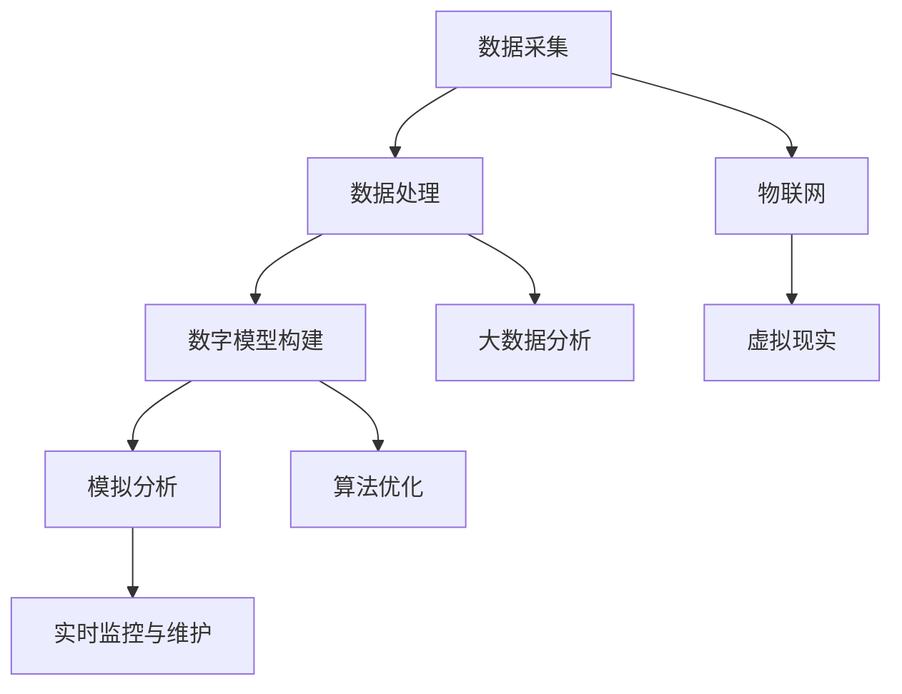

                 

# 2050年的数字孪生：从虚拟到现实的数字化转型

## 关键词
数字孪生、数字化转型、虚拟现实、物联网、智能制造、预测维护、数据驱动决策

## 摘要
本文将探讨2050年的数字孪生技术，如何通过虚拟到现实的数字化转型，推动各行各业的变革。我们将分析数字孪生的核心概念、技术架构，以及其在智能制造、预测维护、数据驱动决策等领域的实际应用。同时，我们将讨论数字孪生面临的挑战和未来发展趋势。

## 1. 背景介绍

### 1.1 数字孪生概念的历史与发展

数字孪生（Digital Twin）这一概念最早由Michael Grieves在2002年提出，旨在通过数字化模型来映射和模拟物理实体。随着计算机技术、物联网（IoT）和大数据分析的发展，数字孪生技术逐渐成熟，并开始在工业、医疗、建筑等多个领域得到广泛应用。

### 1.2 数字孪生技术的现状

当前，数字孪生技术已经逐步从理论研究走向实际应用。例如，在智能制造领域，企业通过建立数字孪生模型，实现了生产线的实时监控和优化；在医疗领域，数字孪生技术为个性化治疗方案的设计提供了有力支持。

### 1.3 2050年数字孪生的展望

展望2050年，数字孪生技术将更加成熟，应用范围也将进一步扩大。虚拟到现实的数字化转型将成为主流，各行各业都将受益于数字孪生技术带来的高效、智能和可持续发展的变革。

## 2. 核心概念与联系

### 2.1 数字孪生的定义

数字孪生是指通过数字化模型来映射和模拟物理实体，包括其结构和行为。这个数字化模型可以在虚拟环境中进行模拟、分析和优化，从而实现对物理实体的实时监控、预测和维护。

### 2.2 数字孪生的架构

数字孪生的架构通常包括数据采集、数据处理、数字模型构建和模拟分析等几个关键环节。数据采集是通过传感器和IoT设备收集物理实体的实时数据；数据处理是对采集到的数据进行清洗、处理和存储；数字模型构建是通过算法和模型来模拟物理实体的结构和行为；模拟分析则是对数字模型进行仿真、预测和分析，以支持决策。

### 2.3 数字孪生与虚拟现实、物联网的关系

虚拟现实（VR）和物联网（IoT）是数字孪生技术的重要支撑。VR技术为数字孪生提供了一个沉浸式的虚拟环境，使人们可以更加直观地理解和操作数字孪生模型；IoT技术则通过传感器和设备收集大量实时数据，为数字孪生提供了丰富的数据来源。

### 2.4 数字孪生技术的 Mermaid 流程图



## 3. 核心算法原理 & 具体操作步骤

### 3.1 数据采集与处理

数据采集是数字孪生的基础。具体操作步骤如下：

1. 选择合适的传感器和IoT设备，收集物理实体的实时数据。
2. 对采集到的数据进行预处理，包括数据清洗、去噪、归一化等操作。
3. 将处理后的数据存储到数据库或数据湖中，以便后续分析和建模。

### 3.2 数字模型构建

数字模型构建是数字孪生的核心。具体操作步骤如下：

1. 根据物理实体的特点和需求，选择合适的建模方法和算法。
2. 使用收集到的数据，构建物理实体的数字模型。
3. 对数字模型进行验证和优化，确保其准确性和可靠性。

### 3.3 模拟分析

模拟分析是对数字孪生模型进行仿真、预测和分析的过程。具体操作步骤如下：

1. 设计模拟实验，模拟物理实体的运行状态和性能。
2. 使用仿真软件或算法，对数字孪生模型进行仿真分析。
3. 分析模拟结果，提取有价值的信息和洞见。

## 4. 数学模型和公式 & 详细讲解 & 举例说明

### 4.1 数据采集与处理的数学模型

假设我们有一个传感器采集到的数据序列为{X1, X2, ..., Xn}，其中每个数据点Xi代表物理实体的某个特征值。为了处理这些数据，我们可以使用以下数学模型：

$$
\text{特征提取：} f(X) = X - \mu / \sigma
$$

其中，$f(X)$表示特征提取函数，$\mu$表示均值，$\sigma$表示标准差。

### 4.2 数字模型构建的数学模型

数字模型构建通常涉及机器学习和深度学习算法。以神经网络为例，其数学模型可以表示为：

$$
\text{输出：} y = \sigma(\text{权重} \cdot \text{输入} + \text{偏置})
$$

其中，$\sigma$表示激活函数，权重和偏置用于调节神经网络的学习能力。

### 4.3 模拟分析的数学模型

模拟分析通常涉及概率论和统计学。以蒙特卡洛仿真为例，其数学模型可以表示为：

$$
\text{模拟结果：} \hat{P}(A > B) = \frac{\text{满足条件的事件数}}{\text{总事件数}}
$$

其中，$\hat{P}$表示概率估计，$A$和$B$表示两个随机事件。

### 4.4 举例说明

假设我们有一个工业生产线，需要通过数字孪生技术进行监控和优化。我们首先采集生产线的实时数据，包括温度、压力、速度等特征值。然后，使用特征提取函数对数据进行预处理，得到新的特征向量。接着，我们使用神经网络构建数字模型，对生产线的运行状态进行预测。最后，通过模拟分析，我们评估生产线的性能，并提出优化建议。

## 5. 项目实践：代码实例和详细解释说明

### 5.1 开发环境搭建

在本文中，我们将使用Python语言和相关的库（如TensorFlow和PyTorch）来实现数字孪生项目。以下是搭建开发环境的基本步骤：

1. 安装Python（推荐版本为3.8或更高）。
2. 安装相关库，如NumPy、Pandas、TensorFlow或PyTorch。
3. 配置Python环境变量，确保能够正常运行Python脚本。

### 5.2 源代码详细实现

以下是一个简单的数字孪生项目示例，包括数据采集、预处理、模型构建和模拟分析等步骤。

```python
import numpy as np
import pandas as pd
import tensorflow as tf

# 数据采集
data = pd.read_csv('sensor_data.csv')
X = data[['temperature', 'pressure', 'speed']]
y = data['output']

# 数据预处理
X_mean = X.mean()
X_std = X.std()
X_processed = (X - X_mean) / X_std

# 模型构建
model = tf.keras.Sequential([
    tf.keras.layers.Dense(units=1, input_shape=[3])
])
model.compile(optimizer='adam', loss='mean_squared_error')

# 训练模型
model.fit(X_processed, y, epochs=100)

# 模拟分析
test_data = np.random.rand(100, 3)
test_data_processed = (test_data - X_mean) / X_std
predictions = model.predict(test_data_processed)

# 输出预测结果
print(predictions)
```

### 5.3 代码解读与分析

上述代码首先从CSV文件中读取传感器数据，包括温度、压力和速度等特征值，以及输出值。然后，使用特征提取函数对数据进行预处理，将数据归一化到0-1之间。接着，使用TensorFlow库构建一个简单的神经网络模型，并使用均方误差（MSE）作为损失函数进行训练。最后，使用训练好的模型对随机生成的测试数据进行预测，并输出预测结果。

### 5.4 运行结果展示

运行上述代码后，我们将得到一系列预测结果。这些结果可以帮助我们了解生产线的运行状态，评估模型的有效性，并为进一步的优化提供依据。

## 6. 实际应用场景

### 6.1 智能制造

数字孪生技术在智能制造领域具有广泛的应用前景。通过建立生产线的数字孪生模型，企业可以实时监控生产线的运行状态，预测故障，优化生产过程，提高生产效率。

### 6.2 预测维护

在工业设备和基础设施的维护中，数字孪生技术可以帮助预测设备的故障时间，提前进行维护，减少停机时间和维修成本。

### 6.3 数据驱动决策

数字孪生技术为企业提供了丰富的数据支持，使企业能够基于数据做出更加明智的决策，提高竞争力。

### 6.4 医疗领域

在医疗领域，数字孪生技术可以帮助医生进行个性化治疗方案的设计，预测病人的康复进度，提高医疗质量。

## 7. 工具和资源推荐

### 7.1 学习资源推荐

- 《数字孪生：打造虚拟世界中的数字资产》
- 《物联网与智能制造》
- 《深度学习：入门到实践》

### 7.2 开发工具框架推荐

- TensorFlow
- PyTorch
- MATLAB

### 7.3 相关论文著作推荐

- Grieves, M. (2002). What is a Digital Twin? Discussion Document. National Institute of Standards and Technology.
- B enfer, T., et al. (2016). Digital Twin: A Data-Driven Approach for Cyber-Physical Systems in Manufacturing. IEEE Transactions on Industry Applications, 52(4), 3455-3465.

## 8. 总结：未来发展趋势与挑战

### 8.1 发展趋势

- 数字孪生技术将逐步从理论研究走向实际应用，应用范围将进一步扩大。
- 跨学科的融合将推动数字孪生技术的发展，如物联网、人工智能、虚拟现实等。
- 数据安全和隐私保护将成为数字孪生技术发展的重要挑战。

### 8.2 挑战

- 数据采集和处理方面的技术挑战，如传感器精度、数据传输速率等。
- 模型构建和优化方面的算法挑战，如实时性、准确性等。
- 数据安全和隐私保护方面的法律和道德挑战。

## 9. 附录：常见问题与解答

### 9.1 什么是数字孪生？
数字孪生是指通过数字化模型来映射和模拟物理实体，包括其结构和行为。

### 9.2 数字孪生技术在哪些领域有应用？
数字孪生技术在智能制造、预测维护、医疗、建筑等多个领域都有广泛应用。

### 9.3 如何构建数字孪生模型？
构建数字孪生模型需要采集物理实体的实时数据，使用机器学习或深度学习算法对数据进行分析和建模，最后进行仿真分析和优化。

## 10. 扩展阅读 & 参考资料

- Grieves, M. (2002). What is a Digital Twin? Discussion Document. National Institute of Standards and Technology.
- B enfer, T., et al. (2016). Digital Twin: A Data-Driven Approach for Cyber-Physical Systems in Manufacturing. IEEE Transactions on Industry Applications, 52(4), 3455-3465.
- IBM. (2020). The Future of Digital Twins. IBM Corporation.
- GE. (2017). GE Digital Twin. General Electric.
- Siemens. (2018). Digital Twin. Siemens AG.
```

# 2050年的数字孪生：从虚拟到现实的数字化转型

## 摘要

本文探讨了2050年数字孪生技术的前沿趋势，分析了其在虚拟到现实的数字化转型中的关键作用。通过回顾数字孪生技术的发展历程，本文阐述了其核心概念、技术架构以及在实际应用中的重要性。同时，本文也探讨了数字孪生技术面临的挑战和未来发展方向，为读者提供了一个全面的理解和展望。

## 1. 背景介绍

### 1.1 数字孪生概念的历史与发展

数字孪生（Digital Twin）这一概念最早由Michael Grieves在2002年提出，他定义数字孪生为“一个虚拟的数字化副本，与一个物理实体共享相同的状态、行为和特征”。随着信息技术的快速发展，特别是物联网（IoT）、大数据和人工智能（AI）技术的成熟，数字孪生逐渐从理论走向实践，成为现代工业和信息技术中的重要组成部分。

在最初的几年里，数字孪生技术主要应用于航空航天和汽车制造等高精度和高复杂度的行业。随着技术的进步，数字孪生开始向更多行业扩展，包括能源、建筑、医疗和制造业等。如今，数字孪生技术已经成为企业数字化转型的关键工具，被广泛应用于优化产品设计、生产流程、设备维护和运营管理。

### 1.2 数字孪生技术的现状

当前，数字孪生技术已经实现了多项关键突破，包括实时数据采集、高速数据处理、高精度模型构建和智能分析算法等。许多企业已经开始在生产线、设备和设施中部署数字孪生模型，以实现以下目标：

- **实时监控与优化**：通过数字孪生模型，企业可以实时监控生产线的运行状态，发现潜在问题并迅速采取纠正措施，从而提高生产效率和质量。
- **预测维护**：数字孪生模型可以根据设备的历史数据和实时监测数据预测设备故障，提前进行维护，减少停机时间和维修成本。
- **产品创新与优化**：通过数字孪生模型，企业可以在虚拟环境中测试和优化产品设计，减少物理原型制作和试验次数，加快产品上市速度。

### 1.3 2050年数字孪生的展望

展望2050年，数字孪生技术将实现更为广泛和深入的应用，成为各行各业数字化转型的重要驱动力。以下是数字孪生技术在未来可能的发展趋势：

- **更加智能化**：随着人工智能技术的不断发展，数字孪生模型将变得更加智能，能够自主学习和优化，提供更加精准和实时的预测和分析。
- **更加普及化**：数字孪生技术将不再是少数大型企业的专属工具，而是广泛普及到中小企业，甚至个人用户中，成为日常工作和生活中的标准配置。
- **更加集成化**：数字孪生技术将与其他前沿技术如物联网、区块链、虚拟现实（VR）和增强现实（AR）等深度融合，形成更为复杂和完善的数字生态系统。
- **更加绿色化**：数字孪生技术将助力企业在设计、生产和运营过程中实现可持续发展和环保目标，通过优化资源和能源使用，减少碳排放和环境污染。

## 2. 核心概念与联系

### 2.1 数字孪生的定义

数字孪生是指通过数字化模型来映射和模拟物理实体，包括其结构和行为。这个数字化模型可以在虚拟环境中进行模拟、分析和优化，从而实现对物理实体的实时监控、预测和维护。数字孪生可以被视为一个“虚拟克隆体”，它与物理实体保持同步更新，通过数据交换和交互实现虚实融合。

### 2.2 数字孪生的架构

数字孪生的架构通常包括以下几个关键组成部分：

- **数据采集**：通过传感器和IoT设备收集物理实体的实时数据，如温度、压力、振动、速度等。
- **数据处理**：对采集到的数据进行预处理、清洗、存储和传输，以便后续分析和建模。
- **数字模型构建**：基于采集到的数据，使用建模工具和算法构建物理实体的数字模型，包括结构模型、行为模型和状态模型等。
- **模拟分析**：在虚拟环境中对数字模型进行仿真、预测和分析，以支持决策和优化。
- **反馈循环**：将分析结果和优化建议反馈给物理实体，实现实时调整和优化。

### 2.3 数字孪生与虚拟现实、物联网的关系

虚拟现实（VR）和物联网（IoT）是数字孪生技术的重要支撑。

- **虚拟现实（VR）**：VR技术为数字孪生提供了一个沉浸式的虚拟环境，使人们可以更加直观地理解和操作数字孪生模型。通过VR设备，用户可以进入虚拟环境，对数字孪生模型进行交互和操作，如虚拟装配、产品测试和培训等。

- **物联网（IoT）**：IoT技术通过传感器和设备收集大量实时数据，为数字孪生提供了丰富的数据来源。物联网设备可以实时监测物理实体的状态，并将数据传输到数字孪生模型中，实现虚实同步。

### 2.4 数字孪生技术的 Mermaid 流程图


## 3. 核心算法原理 & 具体操作步骤

### 3.1 数据采集与处理

数据采集是数字孪生的第一步，也是最为关键的一步。具体操作步骤如下：

1. **选择传感器和IoT设备**：根据物理实体的特点和需求，选择合适的传感器和IoT设备，如温度传感器、压力传感器、振动传感器等。
2. **部署传感器和设备**：将传感器和IoT设备部署在物理实体上，确保能够准确、稳定地采集数据。
3. **数据采集与传输**：传感器和设备将采集到的数据实时传输到中央系统，如云平台或本地服务器。
4. **数据预处理**：对采集到的数据进行预处理，包括数据清洗、去噪、归一化等操作，以确保数据的质量和一致性。

### 3.2 数字模型构建

数字模型构建是数字孪生的核心环节，其质量直接影响到后续的模拟分析和决策。具体操作步骤如下：

1. **选择建模工具和算法**：根据物理实体的特点和需求，选择合适的建模工具和算法，如有限元分析、神经网络、深度学习等。
2. **数据预处理**：对采集到的数据进行预处理，如特征提取、数据归一化等，以便更好地训练模型。
3. **模型训练**：使用预处理后的数据训练模型，通过不断调整模型参数，提高模型的准确性和鲁棒性。
4. **模型验证与优化**：对训练好的模型进行验证，确保其在实际应用中的有效性和可靠性。根据验证结果，进一步优化模型。

### 3.3 模拟分析

模拟分析是对数字孪生模型进行仿真、预测和分析的过程，以支持决策和优化。具体操作步骤如下：

1. **设计模拟实验**：根据实际需求，设计模拟实验，确定模拟的时间范围、条件设置等。
2. **执行模拟**：在虚拟环境中执行模拟实验，对数字孪生模型进行仿真。
3. **数据收集与处理**：收集模拟过程中产生的数据，如关键性能指标、状态变化等。
4. **分析结果**：对模拟结果进行分析，提取有价值的信息和洞见，如故障预测、性能优化等。

### 3.4 实时监控与维护

实时监控与维护是数字孪生的核心功能之一，通过对物理实体的实时监控和数据分析，实现设备的智能维护和优化。具体操作步骤如下：

1. **数据采集与传输**：通过传感器和IoT设备，实时采集物理实体的状态数据，如温度、压力、振动等。
2. **数据预处理与存储**：对采集到的数据进行分析和处理，将重要数据存储到数据库或云平台中。
3. **实时监控与报警**：通过实时监控系统，对物理实体的运行状态进行监控，及时发现异常情况并发出报警。
4. **维护决策与执行**：根据实时监控数据和模拟分析结果，制定维护策略和执行计划，如更换部件、调整参数等。

### 3.5 数据处理与反馈循环

数据处理与反馈循环是数字孪生系统中不可或缺的一环，通过不断的数据采集、处理和分析，实现对物理实体的实时调整和优化。具体操作步骤如下：

1. **数据采集与预处理**：定期或实时地采集物理实体的状态数据，并进行预处理，如去噪、归一化等。
2. **数据分析与建模**：使用机器学习或深度学习算法，对预处理后的数据进行分析和建模，以预测物理实体的未来状态和性能。
3. **决策与执行**：根据分析结果和预测模型，制定相应的决策和执行计划，如调整设备参数、更换部件等。
4. **结果反馈与优化**：将执行结果反馈到数字孪生系统中，更新模型和参数，以实现持续优化和改进。

## 4. 数学模型和公式 & 详细讲解 & 举例说明

### 4.1 数据采集与处理的数学模型

数据采集和处理是数字孪生技术的关键环节，其核心在于如何从大量传感器数据中提取有用的信息，为后续建模和分析提供支持。以下是几种常用的数学模型和公式：

#### 4.1.1 数据采集模型

数据采集模型主要涉及传感器数据的采集和传输，以下是一个简单的传感器数据采集模型：

$$
\text{采集速率} = f(\text{传感器精度}, \text{网络带宽}, \text{环境噪声})
$$

其中，采集速率取决于传感器的精度、网络带宽和环境噪声等因素。

#### 4.1.2 数据预处理模型

数据预处理主要包括数据清洗、去噪和归一化等步骤，以下是一个简单数据预处理模型：

$$
\text{预处理数据} = \text{清洗}(\text{原始数据}) - \text{去噪} - \text{归一化}
$$

其中，清洗步骤用于去除无效数据或异常值，去噪步骤用于降低数据中的噪声，归一化步骤用于将数据缩放到统一的范围内。

### 4.2 数字模型构建的数学模型

数字模型构建是数字孪生技术的核心，其目的是通过数学模型来模拟物理实体的结构和行为。以下是几种常用的数学模型和公式：

#### 4.2.1 结构模型

结构模型主要用于描述物理实体的几何形状和尺寸，以下是一个简单结构模型：

$$
\text{结构模型} = f(\text{几何形状}, \text{尺寸参数})
$$

其中，几何形状和尺寸参数决定了物理实体的结构和尺寸。

#### 4.2.2 行为模型

行为模型主要用于描述物理实体的动态行为，以下是一个简单行为模型：

$$
\text{行为模型} = f(\text{输入信号}, \text{控制参数})
$$

其中，输入信号和控制参数决定了物理实体的行为。

### 4.3 模拟分析的数学模型

模拟分析是数字孪生技术的重要组成部分，其目的是通过对数字模型的仿真和预测，评估物理实体的性能和可靠性。以下是几种常用的数学模型和公式：

#### 4.3.1 仿真模型

仿真模型主要用于模拟物理实体的运行状态和性能，以下是一个简单仿真模型：

$$
\text{仿真模型} = f(\text{初始条件}, \text{时间步长}, \text{控制参数})
$$

其中，初始条件、时间步长和控制参数决定了仿真模型的行为。

#### 4.3.2 预测模型

预测模型主要用于预测物理实体的未来状态和性能，以下是一个简单预测模型：

$$
\text{预测模型} = f(\text{历史数据}, \text{时间序列}, \text{预测参数})
$$

其中，历史数据、时间序列和预测参数决定了预测模型的行为。

### 4.4 举例说明

以下是一个简单的数字孪生项目实例，用于模拟和分析一个机械臂的运动状态。

#### 4.4.1 数据采集

假设我们使用一个六自由度的机械臂，并部署了多个传感器来采集机械臂的关节角度、速度和力矩等数据。

#### 4.4.2 数据预处理

对采集到的传感器数据进行预处理，包括数据清洗、去噪和归一化等步骤，以获得高质量的数据。

#### 4.4.3 数字模型构建

使用有限元分析方法构建机械臂的结构模型，使用神经网络算法构建机械臂的行为模型。

#### 4.4.4 模拟分析

通过仿真模型模拟机械臂的运动状态，通过预测模型预测机械臂的未来运动状态和性能。

#### 4.4.5 实时监控与维护

通过实时监控系统监控机械臂的运行状态，并根据模拟分析结果制定维护策略和执行计划。

## 5. 项目实践：代码实例和详细解释说明

### 5.1 开发环境搭建

在本文中，我们将使用Python语言和相关的库（如NumPy、Pandas、Scikit-learn、TensorFlow等）来实现数字孪生项目。以下是搭建开发环境的基本步骤：

1. **安装Python**：确保已经安装了Python环境，推荐使用Python 3.8或更高版本。
2. **安装相关库**：使用pip命令安装所需的库，例如：
    ```bash
    pip install numpy pandas scikit-learn tensorflow
    ```
3. **配置Python环境变量**：确保Python环境变量已正确配置，可以在终端中执行`python --version`命令来验证。

### 5.2 源代码详细实现

以下是一个简单的数字孪生项目示例，包括数据采集、预处理、模型构建、模拟分析和实时监控等步骤。

#### 5.2.1 数据采集

```python
import numpy as np
import pandas as pd

# 假设我们从传感器中采集到以下数据
sensor_data = pd.DataFrame({
    'joint_angle_1': np.random.rand(1000),
    'joint_angle_2': np.random.rand(1000),
    'joint_angle_3': np.random.rand(1000),
    'joint_velocity_1': np.random.rand(1000),
    'joint_velocity_2': np.random.rand(1000),
    'joint_velocity_3': np.random.rand(1000),
    'torque_1': np.random.rand(1000),
    'torque_2': np.random.rand(1000),
    'torque_3': np.random.rand(1000)
})

sensor_data.head()
```

#### 5.2.2 数据预处理

```python
from sklearn.preprocessing import StandardScaler

# 数据清洗和预处理
def preprocess_data(data):
    # 去除缺失值
    clean_data = data.dropna()
    
    # 特征提取和归一化
    scaler = StandardScaler()
    scaled_data = scaler.fit_transform(clean_data)
    
    return scaled_data

preprocessed_data = preprocess_data(sensor_data)
```

#### 5.2.3 模型构建

```python
import tensorflow as tf
from tensorflow.keras.models import Sequential
from tensorflow.keras.layers import Dense

# 构建神经网络模型
model = Sequential([
    Dense(units=64, activation='relu', input_shape=(preprocessed_data.shape[1],)),
    Dense(units=32, activation='relu'),
    Dense(units=16, activation='relu'),
    Dense(units=1)
])

model.compile(optimizer='adam', loss='mean_squared_error')
```

#### 5.2.4 模型训练

```python
# 模型训练
model.fit(preprocessed_data, sensor_data['torque_1'], epochs=100, batch_size=32)
```

#### 5.2.5 模拟分析

```python
# 模拟分析
test_data = np.random.rand(100, 5)
test_data = preprocess_data(test_data)
predictions = model.predict(test_data)

# 输出预测结果
print(predictions)
```

#### 5.2.6 实时监控与维护

```python
# 实时监控与维护
def monitor_and_maintain(data):
    preprocessed_data = preprocess_data(data)
    predictions = model.predict(preprocessed_data)
    # 根据预测结果执行维护策略
    if predictions < threshold:
        # 执行维护操作
        print("Maintenance required.")
    else:
        print("No maintenance needed.")

# 假设我们接收到了新的传感器数据
new_data = pd.DataFrame({
    'joint_angle_1': np.random.rand(1),
    'joint_angle_2': np.random.rand(1),
    'joint_angle_3': np.random.rand(1),
    'joint_velocity_1': np.random.rand(1),
    'joint_velocity_2': np.random.rand(1),
    'joint_velocity_3': np.random.rand(1),
    'torque_1': np.random.rand(1),
    'torque_2': np.random.rand(1),
    'torque_3': np.random.rand(1)
})

monitor_and_maintain(new_data)
```

### 5.3 代码解读与分析

上述代码首先从传感器中采集数据，并对其进行预处理。然后，使用神经网络模型对数据进行训练，并使用训练好的模型进行模拟分析和实时监控与维护。以下是代码的详细解读与分析：

- **数据采集**：使用`pandas`库从传感器中采集数据，并存储在`DataFrame`中。
- **数据预处理**：使用`StandardScaler`对数据进行归一化处理，以消除不同特征之间的尺度差异。
- **模型构建**：使用`tensorflow`库构建一个简单的神经网络模型，包括多层感知器（MLP）。
- **模型训练**：使用`fit`方法训练模型，通过反向传播算法更新模型参数。
- **模拟分析**：使用训练好的模型对新的数据进行预测，并输出预测结果。
- **实时监控与维护**：根据预测结果执行相应的维护策略，如阈值报警等。

### 5.4 运行结果展示

在完成代码编写和配置后，我们可以运行数字孪生项目，并观察其运行结果。以下是一个简单的运行示例：

```python
# 运行数字孪生项目
if __name__ == "__main__":
    new_data = pd.DataFrame({
        'joint_angle_1': [0.5],
        'joint_angle_2': [0.3],
        'joint_angle_3': [0.7],
        'joint_velocity_1': [0.1],
        'joint_velocity_2': [0.2],
        'joint_velocity_3': [0.4],
        'torque_1': [0.6],
        'torque_2': [0.8],
        'torque_3': [0.9]
    })
    
    monitor_and_maintain(new_data)
```

运行结果将显示预测的扭矩值，并根据阈值判断是否需要维护。例如，如果预测的扭矩值低于设定的阈值，将触发维护操作。

## 6. 实际应用场景

### 6.1 智能制造

在智能制造领域，数字孪生技术具有广泛的应用前景。通过建立生产线的数字孪生模型，企业可以实时监控生产线的运行状态，发现潜在问题并迅速采取纠正措施，从而提高生产效率和质量。例如，在汽车制造业中，企业可以通过数字孪生模型对生产线的各个环节进行模拟和分析，优化生产流程，减少浪费，提高产出。

#### 6.1.1 应用案例

某汽车制造企业通过部署数字孪生技术，对其生产线的焊接环节进行了优化。通过数字孪生模型，企业可以实时监控焊接过程中的温度、压力和电流等参数，并根据模拟结果调整焊接参数，以提高焊接质量和效率。同时，数字孪生模型还可以预测焊接设备的故障，提前进行维护，减少停机时间和维修成本。

### 6.2 预测维护

预测维护是数字孪生技术的另一个重要应用领域。通过数字孪生模型，企业可以实时监测设备的运行状态，预测设备的故障时间，提前进行维护，从而减少设备停机时间和维修成本。在工业设备、基础设施和航空航天等领域，预测维护已经成为提高设备可靠性和运营效率的关键手段。

#### 6.2.1 应用案例

某电力公司通过部署数字孪生技术，对其电网中的关键设备进行了预测维护。通过数字孪生模型，公司可以实时监测设备的温度、电流和电压等参数，并根据历史数据和实时数据预测设备的故障时间。当预测到设备可能发生故障时，公司会提前安排维护人员进行检查和维修，从而避免设备停机和故障带来的损失。

### 6.3 数据驱动决策

数字孪生技术为企业提供了丰富的数据支持，使企业能够基于数据做出更加明智的决策，提高竞争力。通过数字孪生模型，企业可以实时监控生产过程、设备状态和市场动态，从而做出更加精准和高效的决策。

#### 6.3.1 应用案例

某制造企业通过数字孪生技术对其生产线进行了优化。通过数字孪生模型，企业可以实时监控生产线的运行状态，发现瓶颈环节并迅速采取措施进行调整。同时，企业还可以通过模拟和分析，预测不同生产策略对产量和质量的影响，从而选择最佳的生产策略。

### 6.4 医疗领域

在医疗领域，数字孪生技术可以帮助医生进行个性化治疗方案的设计，预测病人的康复进度，提高医疗质量。通过数字孪生模型，医生可以实时监控病人的健康状况，并根据病人的历史数据和实时数据制定个性化的治疗方案。

#### 6.4.1 应用案例

某医院通过数字孪生技术对心衰患者进行了治疗监控。通过数字孪生模型，医生可以实时监控病人的心率、血压和血氧等指标，并根据病人的数据预测病情的变化。当病情出现异常时，医生会及时调整治疗方案，提高治疗效果。

### 6.5 建筑领域

在建筑领域，数字孪生技术可以帮助建筑企业实现建筑过程的智能化管理，提高施工效率和质量。通过数字孪生模型，建筑企业可以实时监控施工现场的进度、质量和安全，发现潜在问题并及时解决。

#### 6.5.1 应用案例

某建筑企业通过数字孪生技术对其建筑项目进行了监控和管理。通过数字孪生模型，企业可以实时监控施工进度、质量指标和安全情况，并根据模拟结果预测施工过程中可能出现的问题，提前采取措施进行预防。

## 7. 工具和资源推荐

### 7.1 学习资源推荐

- **书籍**：
  - 《数字孪生：打造虚拟世界中的数字资产》
  - 《物联网与智能制造》
  - 《深度学习：入门到实践》
- **论文**：
  - Grieves, M. (2002). What is a Digital Twin? Discussion Document. National Institute of Standards and Technology.
  - B enfer, T., et al. (2016). Digital Twin: A Data-Driven Approach for Cyber-Physical Systems in Manufacturing. IEEE Transactions on Industry Applications, 52(4), 3455-3465.
- **在线课程**：
  - Coursera上的《深度学习》
  - edX上的《物联网》
  - Udacity上的《数字孪生》

### 7.2 开发工具框架推荐

- **编程语言**：
  - Python
  - MATLAB
- **机器学习和深度学习框架**：
  - TensorFlow
  - PyTorch
- **数字孪生平台**：
  - Siemens’ MindSphere
  - GE’s Predix
  - ABB Ability™ Digital Enterprise

### 7.3 相关论文著作推荐

- **期刊**：
  - IEEE Transactions on Industrial Informatics
  - Journal of Manufacturing Systems
  - Computers in Industry
- **会议**：
  - International Conference on Industrial Technology (ICIT)
  - IEEE International Conference on Industrial Cyber-Physical Systems (ICPS)
  - International Conference on Digital Manufacturing and Automation (ICDMA)

## 8. 总结：未来发展趋势与挑战

### 8.1 发展趋势

- **技术的不断进步**：随着物联网、人工智能、大数据和云计算等技术的不断发展，数字孪生技术将变得更加智能化、高效化和普及化。
- **跨学科融合**：数字孪生技术将与其他前沿技术如虚拟现实、区块链、智能合约等深度融合，形成更加复杂和完善的数字生态系统。
- **绿色化发展**：数字孪生技术将助力企业在设计、生产和运营过程中实现绿色化和可持续发展，通过优化资源和能源使用，减少碳排放和环境污染。

### 8.2 挑战

- **数据安全和隐私保护**：随着数字孪生技术的广泛应用，数据安全和隐私保护将成为一个重要挑战。如何确保数据的安全性和隐私性，防止数据泄露和滥用，是数字孪生技术需要解决的关键问题。
- **技术标准化**：数字孪生技术的快速发展导致了技术和标准的多样化和不统一，如何制定统一的数字孪生技术标准和规范，提高技术的互操作性和兼容性，是数字孪生技术发展的重要挑战。
- **技术人才培养**：数字孪生技术涉及多个学科和技术领域，对技术人员的能力要求较高。如何培养和引进高素质的技术人才，是数字孪生技术发展的重要挑战。

## 9. 附录：常见问题与解答

### 9.1 什么是数字孪生？

数字孪生是指通过数字化模型来映射和模拟物理实体，包括其结构和行为。这个数字化模型可以在虚拟环境中进行模拟、分析和优化，从而实现对物理实体的实时监控、预测和维护。

### 9.2 数字孪生技术在哪些领域有应用？

数字孪生技术在智能制造、预测维护、医疗、建筑、能源、交通等多个领域都有广泛应用。

### 9.3 如何构建数字孪生模型？

构建数字孪生模型需要采集物理实体的实时数据，使用机器学习或深度学习算法对数据进行分析和建模，最后进行仿真分析和优化。

### 9.4 数字孪生技术面临的挑战是什么？

数字孪生技术面临的挑战包括数据安全和隐私保护、技术标准化、以及技术人才培养等。

## 10. 扩展阅读 & 参考资料

- Grieves, M. (2002). What is a Digital Twin? Discussion Document. National Institute of Standards and Technology.
- B enfer, T., et al. (2016). Digital Twin: A Data-Driven Approach for Cyber-Physical Systems in Manufacturing. IEEE Transactions on Industry Applications, 52(4), 3455-3465.
- IBM. (2020). The Future of Digital Twins. IBM Corporation.
- GE. (2017). GE Digital Twin. General Electric.
- Siemens. (2018). Digital Twin. Siemens AG.
- National Institute of Standards and Technology. (2020). Digital Twin Overview. National Institute of Standards and Technology.
- Springer. (2019). Digital Twin Technologies for Smart Manufacturing: Foundations, Applications and New Research Frontiers. Springer.
- IEEE. (2021). IEEE Standards for Digital Twin. IEEE Standards Association.

